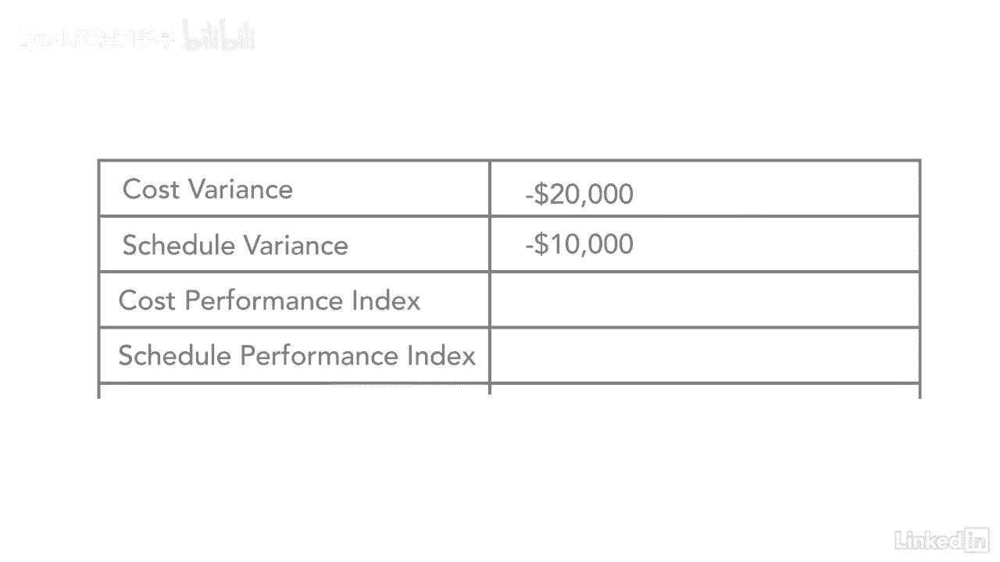

# 061-Lynda教程：项目管理专业人员(PMP)备考指南Cert Prep Project Management Professional (PMP) - P60：chapter_060 - Lynda教程和字幕 - BV1ng411H77g

现在我们已经完成了前四个变量和挣值管理，我们要看看接下来的四个，所以我们要覆盖，成本效益指数，然后调度性能指标，就像我之前说的，一旦你有了前四个，它真的很容易插入你所要做的一切。

把接下来的4个数字和之后的4个数字，所以我们会让你看看它是什么样子的，你会看到成本差异，公式是挣值减去实际成本，所以你已经有了这些数字，所以你所要做的就是把它们插入公式中，所以它是挣得的价值，四万。

减去实际费用，六万，你已经可以通过看这个来判断它不会是好的，它将是一个负数，所以这等于一个负数，所以这里的成本方差是负2万，所以当我们看进度变化时，我们做同样的事，我们只要输入数字，所以再赚一次值四万。

好啦，然后计划价值是5万英镑，所以你已经可以看出这个项目有麻烦了，好啦，所以这里的成本方差是，他们应该在六个月内花5万美元，或者以完成的工作量4万美元，实际花费是六万美元，他们已经多花了两万美元。

好的还有计划差异，他们应该做更多的工作，他们不是，他们在时间表上少了一万美元，他们实际上落后于计划，所以如果我是这个项目的赞助商，我可能会把项目经理拉到一边，弄清楚这个项目是怎么回事。

因为已经有了这两个第一个变量，我们发现这个项目出了问题，成本和时间表，好啦，那么让我们来看看性价比指数，所以我们赢得了价值，四万块，AC，你的实际成本是6万英镑，当你把这两个数相除时。

你最后得了零点六六对吧，或者你可以把它四舍五入到零点六七，当你看考试中的这些问题时，它真的很重要，看看答案是什么，因为有时他们的答案有一个四舍五入的数字，有时他们不会，所以说，这真的很重要。

如果你这样做，如果你围捕，确保这些数字与答案确实匹配，因为你会注意到，当你把它们四舍五入时，这些数字实际上有很大的不同，或者你不这样做，让我们来看看SPI，所以圆周率，同样是四万，等于零点八。

所以当你看性价比指数时，这告诉你什么，这告诉你你得到了多少价值，你花在项目上的每一美元，所以如果你看这个数字，你得到了大约价值67美分的，你花在项目上的每一美元，不是很好，你应该得到至少一美元一美元。

所以你已经知道这很糟糕，然后是你的日程安排，当你看到一天，你至少应该知道一个对一个，这个数字应该是一个零或更高，所以这已经告诉你，你工作的每一天，你只能得到十分之八的工作。

所以你甚至没有得到一整天的工作，每次你的人在工作的时候，所以这是在告诉你你已经超支了，不做那么多工作，对你的项目很不利，再一次，这些数字告诉赞助商，这个项目出了问题，他们应该把项目经理拉到一边说。

你知道的，这是什么一次性事件？我们不得不花很多钱什么的，或者我们因为天气或类似的事情而停机，还是这个项目真的有什么内在的东西，你需要看看，所以看看那些是个好主意，你需要知道的另一件事是。

当你看cpi和spi时，如果它大于或等于1，这很好，如果少于一个，很糟糕，所以任何时候，当你看到这些数字，它是一个或以上，这很好，你的项目看起来不错，成本方面，时间表方面，如果低于1，那就有问题了。

要么带着课，要么带着时间表，或者两者都有，你拿到了。

