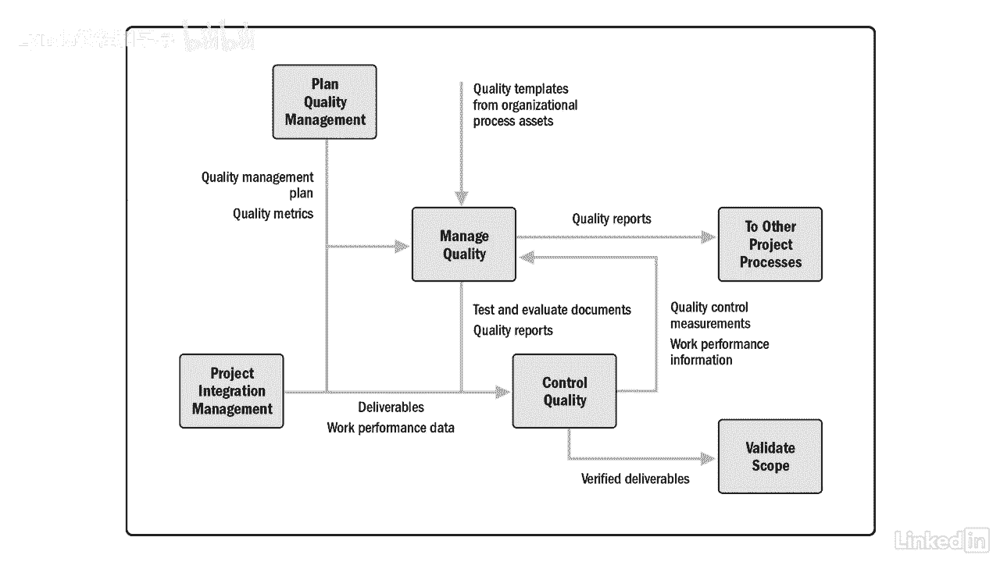

# 061-Lynda教程：项目管理专业人员(PMP)备考指南Cert Prep Project Management Professional (PMP) - P62：chapter_062 - Lynda教程和字幕 - BV1ng411H77g

艺术评论家约翰罗斯金曾经说过，质量从来都不是偶然的，它总是智慧努力的结果，当谈到项目管理时，没有什么比这更正确的了，这几天，你必须深思熟虑地努力将质量构建到过程和产品中。

质量管理知识领域包括过程改进活动，因为工艺和产品几乎总是可以改进的，质量管理有两个重要任务，一是确保流程到位，解释如何构建或创建产品或服务，例如标准作业程序或工作指示。

第二个重要的任务是确保产品或服务的质量，这是通过测试或评估仪器来完成的，比如在装配线上安装夹具来测试产品或目视检查，一旦工作被证明符合要求，然后输出是在其他过程中使用的经过验证的可交付成果和质量报告。

你可以在这里看到这个知识区域有很多ittos，我不建议大家都死记硬背，我的建议是了解这些过程是如何相互流动的，作为输入有意义的是什么，工具和产出，真正理解这些过程比在这里记住它们更有效。

您可以看到每个质量过程之间的相互关系，然后输出到其他质量过程中，您可能还会注意到，在此过程中执行集成的更改控制提要，这是因为变更请求可能是质量过程的结果。

现在您了解了质量管理的高级流程。