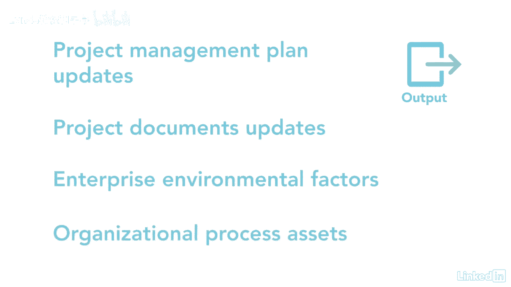

# 061-Lynda教程：项目管理专业人员(PMP)备考指南Cert Prep Project Management Professional (PMP) - P70：chapter_070 - Lynda教程和字幕 - BV1ng411H77g

作为项目经理，做领导是你的责任，其中包括建立你的团队训练，激励和激励他们成为最好的，他们既可以在一起，也可以单独，开发的团队流程属于执行流程组，并包括提高团队成员的能力。

它们的相互作用和环境以提高项目绩效，几个关键的好处是增强了人际交往能力，激励员工，减少员工流失，发展一个团队有各种各样的目标，首先提高团队成员的知识和技能，所以他们可以降低成本提高质量。

是通过在成员之间建立信任和协议来加强团队合作，另外，创建一个充满活力、凝聚力和协作性的团队文化，最后，授权团队做出决策并拥有解决方案，这个过程在考试中很受欢迎，你可能会看到一些关于团队发展的问题。

以及在开发的团队工具和技术讲义中讨论的激励理论，让我们复习一下你可能在考试中看到的内容，资源管理计划是这个过程的第一个输入，它告诉你如何发展项目团队，发展团队的培训战略和计划。

它还包括如何奖励和或纪律成员并提供反馈，项目的时间表和团队分配是其他输入，而且很重要，因为你需要知道团队成员是谁，他们什么时候入队，所以你知道什么时候开始训练他们，接下来是资源日历，它告诉您。

团队成员何时开始和结束他们在项目上的工作，团队章程，有团队操作指南，并说明团队将如何合作，剩下的输入是FS，行动方案和经验教训登记册，有八种工具和技术。

每一个都对建立一个强大的、有凝聚力的项目团队很重要，首先是人际交往和团队能力或软技能，也是考试最喜欢的题目，与你的团队良好沟通的能力将有助于他们的发展，其中一些人际交往技巧可能包括解决冲突，影响。

团队建设，动机和谈判，另一个工具是培训，它包括通过正式或非正式的培训来提高每个团队成员的能力，这方面的例子可能是在线培训，课堂辅导，或在职培训，或者OJT，共同定位团队成员也很好，如果可能的话。

一些组织使用作战室，在那里所有的项目文件，打印输出，会议，等都是通过在同一地点举行的，项目团队倾向于更好地合作，虚拟团队是另一种很好的获取资源的工具和技术，您所在的位置可能不可用，还节省了差旅费和成本。

通信技术通过提供以下功能帮助虚拟团队，共享思想的共享门户，文件，日历，还有更多的音频和视频会议、电子邮件和聊天，其次是认可和奖励，对于努力工作并表现出良好行为的团队成员来说，这是至关重要的。

有几个你需要注意的动机理论，为了考试，这些在弹球指南中没有涵盖，但我已经在开发的团队工具和技术讲义中介绍了它们，这是另一个最喜欢的考试题目，所以你一定要看看讲义，另一个工具是个人和团队评估。

这些工具有助于确定优势和劣势，他们还确定每个人如何处理信息，他们是如何相互行动和做出决定的，技术上的最后一个工具是会议，这个过程的一个主要输出是团队绩效评估。

重要的是要知道这些评估是针对团队而不是个人的，其他产出是变更请求，项目管理计划和项目文件更新，EEF和OPA作为项目经理的更新。

你可能并不总是得到团队成员，谁有必要的技能来执行时间表中的活动，因此，确保每个人都接受适当的培训是很重要的，你的目标是让你的团队像一台润滑良好的机器一样运作。

