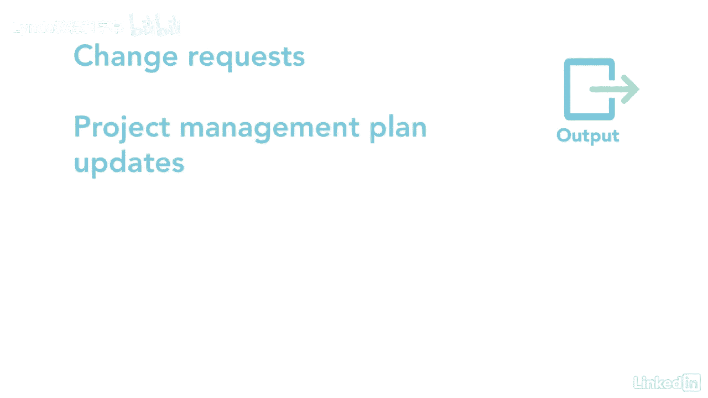

# 061-Lynda教程：项目管理专业人员(PMP)备考指南Cert Prep Project Management Professional (PMP) - P71：chapter_071 - Lynda教程和字幕 - BV1ng411H77g

管理一个项目团队对我来说很有趣，也很有挑战性，这是当项目经理最好的部分之一，此过程包括跟踪团队成员的表现，通过良好的沟通技巧和强有力的领导，确保每个人都能很好地合作，它还意味着解决问题或冲突。

并向团队提供反馈，以下是这个过程的ittos，让我们来看看你可能在考试中看到的，对于输入，让我们从资源管理计划开始，它告诉你如何管理团队，接下来是团队绩效评估，它们提供了关于团队如何执行的信息。

如果有问题，项目经理需要尽快解决这些问题，同样地，如果球队表现良好，项目经理可以提供奖励和认可，第三个输入是问题日志，已确定的问题位于此日志中，它显示了团队中谁负责解决问题，下一个输入是工作绩效报告。

提供项目执行情况的更新，所以可以做出决定或采取行动，例如，一个项目是否仍在进度中，我们的成本是否仍在预算中，另一个输入是团队章程，它提供了关于团队将如何做出决定的信息，处理会议，并处理冲突解决。

最后的输入是教训，学会了，注册和操作，这个过程只有两种工具和技术，让我们从人际交往和团队合作技巧开始来复习每一个，冲突管理是至关重要的，在与项目团队打交道时，这是不可避免的，团队会有冲突，因此。

能够尽快解决问题是项目绩效的关键，解决矛盾有五种方式，首先是协作解决问题，这是团队成员在一起工作得很好的时候，通过对其他观点持开放态度来解决问题，这是一个双赢的局面，接下来是妥协调和。

这是为了确保当有人妥协时，双方都有冲突的解决方案，他们放弃了一些东西，所以如果双方都妥协，这是两败俱伤的局面，即使他们同意妥协，直接武力是下一个，当权者做决定的时候，不顾他人，观点。

这通常是一个双赢的局面，在冲突管理中不鼓励，另一个是平稳的适应，当你指出每个人都同意的地方而不是分歧的地方时，为了保持团队的和谐，而且有提款无效，这听起来就像退出或回避这种情况直到以后。

这在脾气暴躁的情况下是最好的，也许有人大喊大叫，什么也没解决，然后是决策，其中包括谈判和影响组织的能力，其次是情商，然后是影响力和领导力，技术上的最后一个工具是pmis，这个过程只有一个主要的输出。

那就是更改请求，其他的是项目管理计划。

项目文件和EEF更新，管理项目团队对您的成功至关重要，学习如何解决冲突，好好沟通，提供反馈和领导将导致一个像井一样工作的高绩效团队。

