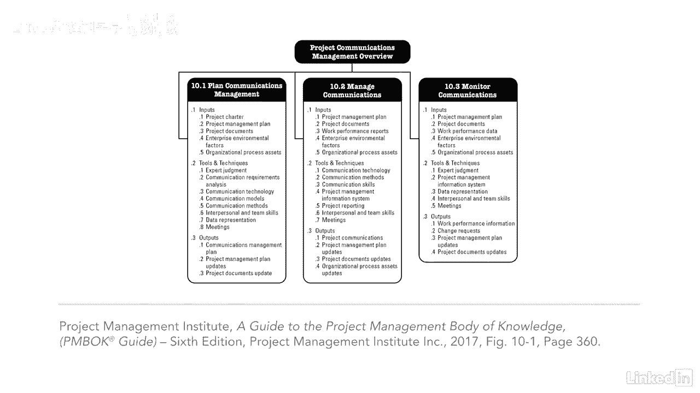

# 061-Lynda教程：项目管理专业人员(PMP)备考指南Cert Prep Project Management Professional (PMP) - P73：chapter_073 - Lynda教程和字幕 - BV1ng411H77g

项目经理90%的时间都花在沟通上，那是很多电子邮件，面对面交谈和打电话，但是你想想，花时间和团队讨论重要信息是有意义的，利益攸关方，供应商和职能管理人员，其实呢，工作日的每一分钟几乎都花在交流上。

这就是为什么这个知识领域对项目的成功如此重要，还有PMP考试，通信管理，包括，确保项目信息有效传达给利益相关者所需的过程，这分两部分完成，首先是制定一项战略，确保沟通对利益攸关方有效。

第二是实施这一战略，还有一些交流活动对你来说很重要，为了考试，首先是与项目内外的利益相关者的内部和外部沟通，外部利益相关者可能是检查设备安装的检查员，二是正式与非正式，正式可能包括报告或合同。

非正式的可能包括网站和电子邮件，接下来是层次焦点，意味着与管理层的向上沟通，向下到团队，与同行水平，然后是官方的，可能是时事通讯和年度报告，非官方的可能是临时的或不公开的对话，其他是书面或口头通信。

以及语言或非语言的意义，一个人的声音，屈折变化或肢体语言，在项目团队的沟通中经常会有误解，有一种方法叫做书面交流中使用的五个C，这有助于解决这个问题，我们再过一遍，首先是使用正确的语法和拼写。

有简洁的表达和措辞，第三个C是清楚的，针对读者的有目的的表达是连贯的，思想的逻辑流动，最后是用图形或总结来控制你的文字和想法，嗯，我对你不太了解，但是五个C可以帮助我所有的交流，与所有项目一样。

向利益攸关方提供最新信息的必要性，对项目的顺利进行至关重要，如今，每月更新一次涉众是不够的，或者通过仪表板，几乎需要立即做出决定，因此，让利益相关者参与项目审查和会议是必要的，您也可以使用当前的技术。

如移动设备或媒体来传达信息，所使用的通信类型应适合项目的需要，你可以看到这个知识区域有相当多的ittos，但是很多工具和技术都包括“交流”这个词，所以这些应该很容易记住。

这些天有很多东西进入项目沟通，这不是仅仅发送一封电子邮件或在网上发布更新那么简单，所以花点时间想想，你将把百分之九十的时间花在一个项目上。

