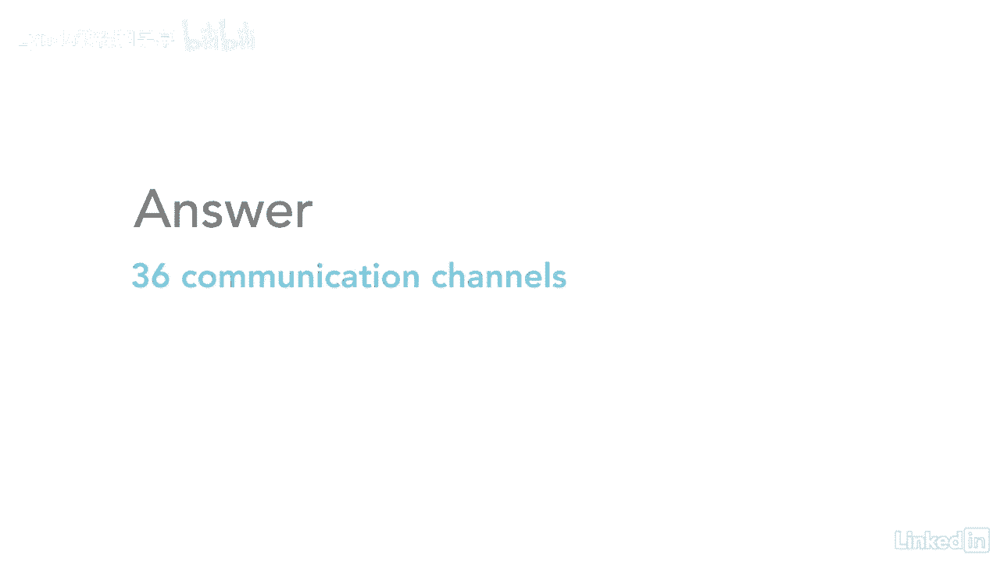

# 061-Lynda教程：项目管理专业人员(PMP)备考指南Cert Prep Project Management Professional (PMP) - P75：chapter_075 - Lynda教程和字幕 - BV1ng411H77g

既然我们已经在通信管理计划中讨论了通信，让我们继续看一些如何应用通信的示例，所以之前有几条规则你应该知道，你甚至试图回答问题，我现在就去看，所以第一个是每当你看到一个问题，它是这样开始的，例如，你呀。

七，如果一开始是那样，那么项目经理实际上并不包括在这个总数中，上面说你有一个团队，所以你们和团队是分开的，因此，如果您想计算涉众的总数，你会说是七点，加，所以这是第一条规则。

第二个是如果你看到这样的问题，上面写着，然后这将自动包含项目经理，然后总共有七个利益相关者，这就是你需要知道的，以便将其插入公式中，好啦，那我们继续吧，我想用几个问题作为例子。

我们可以把这两条规则应用到他们身上，看看结果如何，这里有一个问题的例子，你可能会在考试中看到，你现在的建筑项目上是这么说的，项目经理正在与其他七个利益相关者合作，两个新的利益相关者加入项目。

增加了多少新渠道，所以当你看到这样的问题，这意味着这个问题实际上有两个部分你需要回答，所以第一个是，你得弄清楚他们从多少个沟通渠道开始，所以在这个问题中，上面说你现在的建筑项目。

项目经理正在与其他七个利益相关者合作，所以如果你看到我们的第一个例子项目经理是分开的，你得记得把项目经理加进来，所以利益相关者的总数将是八个，计算通信通道的公式是这样的你将取n乘以n减去1，除以二。

所以在这个例子中，我们有当前的建设项目，是一个与其他七个利益相关者合作的项目经理，所以记住我们的第一条规则是，如果项目经理是独立的，然后您将添加项目经理和七个涉众，这样你就有八个。

所以如果我们把8代入这个公式，就会变成这样，所以我们有8乘以8减去1除以2，好啦，所以我们就有八个，除以二，等于五，六除以二，等于，所以你最终得到的是八个利益相关者的两个八个沟通渠道，所以第二部分是。

我们增加了两名队员，所以你首先要做的是我们有8加2等于10，你必须计算出十个利益相关者的总沟通渠道，所以如果我们把10代入公式，看起来是这样的，所以我们有10乘以10减去1除以2，好啦。

然后我们得到十乘以九除以二，结果是九十除以二等于四五，所以只要给你的团队增加两名成员，它从两个八频道变成了四个五频道，这是一个很大的跳跃，所以为了计算出团队中增加了多少额外的沟通渠道。

因为你加入了两名队员，你只要取四五减去二八，所以是四五减二十八，所以通过增加两个团队成员，你增加了17个频道，所以你有了，这是第一个通信通道的例子，好啦，现在让我们看另一个例子。

有关如何应用通信信道的公式，这个应该是比较容易的，因为你知道我之前讨论过的两条规则，让我们来看看这个问题，所以问题是一个项目团队有九名成员，有多少沟通渠道，所以记住第二条规则，在那里我说。

如果你有一个X数字的团队，你只需要数数，利益相关者的总数，所以对于这个，你有一个由九名成员组成的团队，所以你要做的就是把9代入公式，它看起来是这样的，我们的公式是n减去1除以2，所以你会有九次。

九减一除以二，你最终会得到九次，八除以二，结果就是，三十六，所以有了一个由九名利益相关者组成的团队。

你会有三个六个频道，所以这个比较容易，你只要把公式里的数字，解决这个问题应该只花你大约三十秒，考试应该很容易给你。

