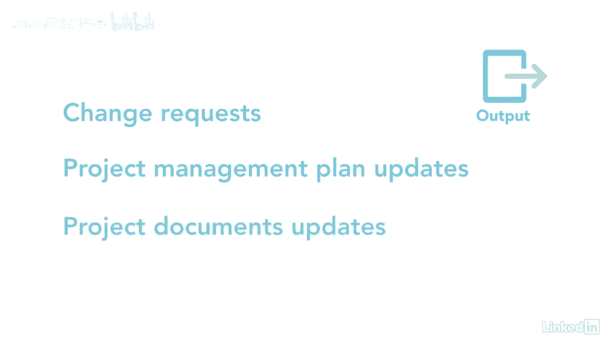

# 061-Lynda教程：项目管理专业人员(PMP)备考指南Cert Prep Project Management Professional (PMP) - P77：chapter_077 - Lynda教程和字幕 - BV1ng411H77g

一旦您与您的利益相关者进行了沟通，你可能会问自己，我一直在按计划交流吗，我是否应该调整每次交流的详细程度，有一个沟通计划是很好的，但对该计划的定期审查是必不可少的，重要的是要确保。

正确的信息被传达给正确的人，在正确的时间，监视通信过程属于监视控制过程组，并确保项目和利益相关者的沟通需求得到满足，让我们复习一下你可能在考试中看到的内容，这个过程有五个输入，让我们先谈谈主要的。

从资源管理开始，通信管理和利益攸关方参与计划，这些计划中的每一项都提供了关于利益攸关方和让他们参与的战略的信息，下一个主要输入是问题日志，它用于跟踪已为项目确定的项目，包括与利益攸关方的问题或挑战。

以及他们是如何解决的，另一个是已经分发给利益攸关方的项目通信，Word性能数据是下一个关键输入，并用于衡量哪些通信已经传达，它们有多有效，以及他们是否有正确的细节水平，其余的投入是经验教训，学会了。

登记册，FS和OPAS，其中一个主要工具是称为利益相关者参与评估矩阵的数据表示技术，这将查看利益相关者参与的期望与当前位置是否发生了变化，C代表利益相关者目前所在的位置，你希望他们在哪里。

目标是把它们移到想要的位置，第二个主要工具是人际交往和团队技能，这包括观察和交谈，与团队成员交谈是收集信息以更新涉众的好方法，再加上观察团队互动，允许项目经理解决团队问题。

剩下的工具和技术是专家判断会议和采购管理信息系统，工作绩效信息的主要输出查看实际传达的内容，计划中商定的内容，它还考虑利益攸关方对来文的反馈，通过听他们说什么是有效的或需要改进的，其他产出是变更请求。

项目管理计划和项目文件更新。

与任何监视和控制过程一样，确保利益相关者的沟通需求得到满足是至关重要的，因此，当您与利益相关者沟通时，一切都很顺利，可确定对项目的调整，导致更改请求，记住正确和及时的沟通。

