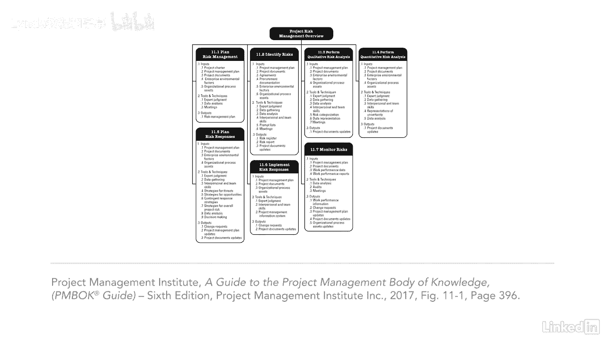

# 061-Lynda教程：项目管理专业人员(PMP)备考指南Cert Prep Project Management Professional (PMP) - P78：chapter_078 - Lynda教程和字幕 - BV1ng411H77g

我曾经有一个项目，预算是900万美元，当我们对确定的风险进行审查时，我们发现我们认为相对较小的风险，实际上，修复它的成本可能超过900万美元，这实际上会关闭我们的项目，不用说。

我们立即制定了一个计划来避免这种风险，项目风险管理包括识别和分析项目风险所需的过程，以及处理和控制它们的策略，风险被认为是项目中的不确定性，你可能知道也可能不知道如果风险发生会发生什么。

但尽早发现风险是很重要的，因此，团队可以决定如何处理它们，并请求风险准备金以防它们发生，风险可以对项目产生消极或积极的影响，风险管理的目的是增加积极风险的机会，并降低负面风险的影响。

识别个别风险的影响是很重要的，以及整个项目风险，可能来自个人风险的集合，组织现在需要扩大他们的重点，不仅仅是捕捉基于事件的风险，就像一个不合格的供应商，跟踪非事件风险，这些分为四类，第一是变异性风险。

它着眼于计划事件中的不确定性，比如错误比预期的多，或者生产低于目标，二是模糊风险，这是关于未来可能不确定的事情，一个例子可能是项目中的复杂性，三是项目韧性，它处理了一个项目从未知风险中反弹的情况。

项目小组可能包括未知风险的额外应急准备金，如果真的发生了，要灵活，最后是综合风险管理，这超出了项目，进入了程序或投资组合，这些类型的风险需要集体审视，所以组织可以在这里为他们计划。

你可以看到这个知识区有很多ittos，两个，准确的说是一个，而不是试图记住所有的，我建议理解这个过程是如何相互流动的，哪些对每个过程都有意义。

大家可以看到，风险管理涉及很多，这是我们将要涉及的最大的知识领域之一，你要特别注意这一章。