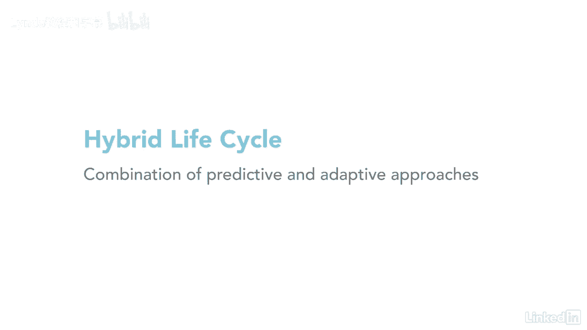

# 061-Lynda教程：项目管理专业人员(PMP)备考指南Cert Prep Project Management Professional (PMP) - P7：chapter_007 - Lynda教程和字幕 - BV1ng411H77g

我记得我第一次看到PIN机器人的感觉，E，我承认我有点被它的厚度吓倒了，所有被打包到章节中的数据，但我很快发现针盒被不同的组件分解了，更容易理解，一旦我读了材料，它们就像拼图一样拼凑在一起，管理项目时。

为了成功完成，必须有效地管理几个关键组成部分，pinbot指南描述了这些组件中的每一个是什么，为什么它们很重要，请看下表，了解关键组件的概述，关键部件是弹球的基础。

对这些组成部分中的每一个都有很强的理解将有助于你为考试做准备，让我们从项目和开发生命周期开始，项目生命周期是项目所经历的一系列阶段，从开始到完成，这些阶段可以按照它们可以重叠的顺序进行，也可以迭代。

大多数项目都经历一些通用的生命周期阶段，比如启动项目，组织和准备，然后你执行工作，最后项目结束了，项目的生命周期显示出某些特征，你可以在这里看到，我真的很喜欢这个形象，因为它很好地展示了。

在项目开始时风险和利益相关者的参与是如何高的，然后随着项目的执行而减少，成本和资源的情况正好相反，因为它们一开始很低，一旦执行开始，它们就会增加，开发生命周期用于创建和改进产品。

项目生命周期内的服务或结果，使用预测，迭代，递增，自适应或混合模型，描述开发生命周期的另一种方法是规划过程，建筑物，测试，并部署产品服务或结果，预测或计划驱动的生命周期是项目生命周期的一种形式。

有项目范围的，在生命周期的早期阶段决定的时间和成本，就像传统的项目管理一样，迭代生命周期是项目范围通常确定的生命周期，在项目生命周期的早期，但是随着项目团队对项目理解的增加，时间和成本估计会被修改。

所以迭代通过一系列重复的循环来开发产品，递增的生命周期是，交付品是通过一系列迭代产生的，每一个连续的迭代都是构建到最后一个迭代的功能，在那里所有的碎片被放在一起形成最终的产品。

一个例子可能是开发一个在线游戏，每次迭代都会产生游戏的一些功能，但是在所有的碎片组合成最终产品之前，游戏是不能玩的，迭代和增量生命周期通常用于敏捷项目，另一个生命周期叫做自适应。

它是指在迭代开始之前定义并批准了详细的范围，它也被称为敏捷或变化驱动的生命周期，我们有一个最终的类型，混合生命周期就像听起来的那样，它使用预测和自适应生命周期的组合。

与任何项目一样，由项目团队来决定哪个生命周期最适合他们，所以说，花一分钟，并思考一下您在团队中经历过哪些项目生命周期，你最喜欢哪一个，如果你不确定。

