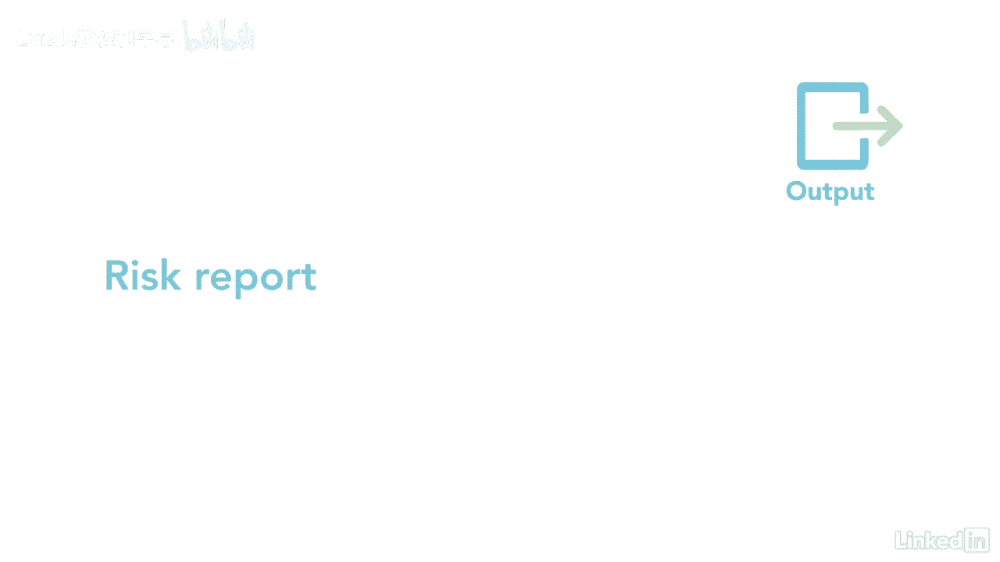

# 061-Lynda教程：项目管理专业人员(PMP)备考指南Cert Prep Project Management Professional (PMP) - P80：chapter_080 - Lynda教程和字幕 - BV1ng411H77g

识别风险是任何项目团队的重要任务，早点做这件事，团队可以决定如何在预算和时间表中增加储备，如果他们发生了，识别风险是一个反复的过程，因为它们可能发生在项目开始时，也可能发生在项目执行期间。

识别风险过程属于规划过程组，以及确定哪些风险可能影响项目的过程，并记录它们的特征，风险是任何项目中的不确定性，因为它们如何影响项目现在可能是已知的或未知的，让我们复习一下你可能在考试中看到的内容。

大家可以看到，这个过程有六种投入和六种工具和技术，第一个输入是计划，资源，这里有一个助记符，可能会帮助你记住计划，兔子真的很可爱，也很柔软，这些计划中的每一个都可能包括关于项目中不确定性和模糊性的信息。

风险管理计划详细说明了与风险有关的作用和责任，接下来的风险类别是三个基线，范围，费用和时间表，每一个都可能确定风险领域，成本和持续时间估计是下一个投入，对审查很重要，因为他们在项目中可能有最大的风险。

下一个输入是涉众寄存器，利益相关者可能有他们想添加到风险登记册中的风险，其他投入是协议和采购文件，从外部采购工作，公司有自己需要考虑的一系列风险，例如，承包商可能无法按时完成工作。

也可能是一些标准假设和问题日志，所需经费，文件和资源要求都应加以审查，因为它们可能会发现风险，最后的投入是经验教训登记册，EEVS和OPAS，第一个工具是数据收集技术，有几种技术用于收集信息。

首先是头脑风暴，这用于获得风险的详尽列表，另一个是面试，就像听起来一样，利益攸关方和专家接受采访，收集风险清单，还有一些检查表，其中有一系列需要考虑风险的项目，第二个工具是数据分析，包括根本原因分析。

这是当确定问题的根本原因时，然后可以制定预防措施，是文档分析，这有助于识别项目中的风险，根据文件编写得有多好，另一种工具叫做swot分析，代表着力量，弱点，机会和威胁。

研究小组使用这种技术来识别积极和消极的风险，最后是假设和约束分析，这将审查项目早期确定的假设和限制，看有没有风险，第三个工具是人际关系和团队技能，利用它的便利收集风险清单。

其次是使用具有预定义风险类别的提示列表，用于征求意见，使用风险分解结构就是一个例子，最后的工具是专家，判决和会议，有两个主要产出，首先是风险登记册，它将包括一份已确定的风险清单，潜在的反应和所有者。

下面是风险登记册中最小信息的一个例子，可以根据项目需求添加更多内容，最后一个关键产出是风险报告，这提供了关于总体和单个项目风险的信息。

剩下的输出是项目文档更新，风险登记册是风险管理知识领域其他进程的关键投入，所以首先完成它是很重要的，识别项目中的风险很重要，因为它允许团队计划应对措施，以防它们发生。

然后将与风险相关的时间和成本作为风险准备金相加，在某些情况下，风险可能大到足以关闭一个项目。