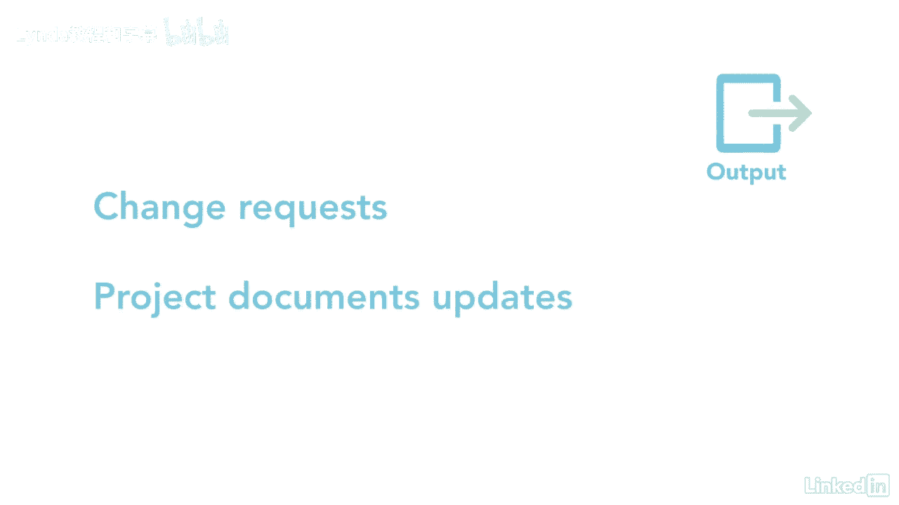

# 061-Lynda教程：项目管理专业人员(PMP)备考指南Cert Prep Project Management Professional (PMP) - P84：chapter_084 - Lynda教程和字幕 - BV1ng411H77g

一旦您有了针对所有已识别风险的响应计划，你可能想知道接下来会发生什么，嗯，你会认为这是个简单的答案，通常情况下，项目团队会花很多时间制定一个计划，但他们不执行，令人惊讶的是，这给项目增加了更多的风险。

实施风险应对措施，进程属于执行进程组，它完全按照它说的做，您在这里执行针对每个风险的策略，您可以看到此过程的ittos，你会很高兴知道的，这是我们将介绍的较容易的过程之一。

让我看一下你可能在考试中看到的那些，第一个关键投入是风险管理计划，风险登记册和风险报告，这些文件中的每一份都提供了关于正在考虑的风险的细节，其余的投入是经验教训登记册和行动方案。

一个主要的工具和技术是影响，项目经理应该利用他们的影响力让利益相关者对风险采取行动，如果真的发生了，另一个是与专家交谈，根据他们的反馈验证或修改风险应对措施，技术上的最后一个工具是pmis。

产出是变更请求和项目文件更新。

大家可以看到，这个过程相当容易遵循，通过执行团队制定的计划。