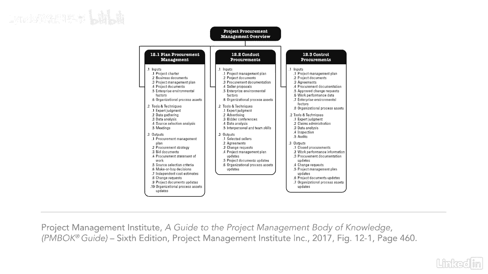

# 061-Lynda教程：项目管理专业人员(PMP)备考指南Cert Prep Project Management Professional (PMP) - P86：chapter_086 - Lynda教程和字幕 - BV1ng411H77g

采购管理是我在PP中苦苦挣扎的领域之一，因为我在起草合同方面没有太多经验，到那时为止，我的工作总是在研究这个知识领域后签署合同，我对合同变得更舒服了，我的目标也是帮助你变得更放心。

采购管理包括帮助您获得所需产品或服务的过程，从项目外部，例如人力资源或设备，它还教您如何监视和控制协议一旦到位，采购也称为协议，协议可以包括以下类型，合同，订购单，协议备忘录和内部服务级别协议。

项目经理不需要是承包方面的专家就能参与进来，但拥有这方面的知识有助于，通常会有项目团队的某些成员被授权进行采购，也可能是组织里的人，比如采购，订约和法律合同，将包括关于交付品和预期成果的信息，其实呢。

你需要知道的关于采购的任何事情都会在合同里，有两个关键术语要关注买方和卖方，买家可以是产品的所有者，分包商，收购组织或买方，卖方可以被称为承包商，供应商，服务提供者或供应商。

知道两者之间的区别对考试会有帮助，办理采购方式有进步，我看一下其中的一些，但我鼓励你在针盒里回顾所有的，当你有机会，第一个是管理采购的工具，就像建筑信息模型或建筑中使用的Vim，工程和基础设施领域。

它提供了一个发布采购信息的单一网站，所以卖家可以访问它并在网上申请，另一个是改变合同流程，提供国际公认的标准合同形式，使合同更容易管理，另一个有趣的是在项目中使用现场网络摄像机，然后。

涉众可以实时查看正在完成的工作，正如您所看到的，这个知识区域有很多ittos，与其死记硬背，我建议理解这些过程是如何相互流动的，哪些对每个过程都有意义。

每个项目都不一样，所以重要的是要记住你应该量身定做。