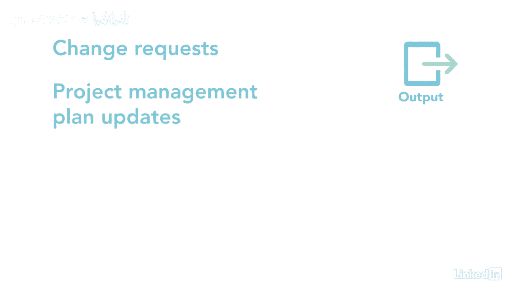

# 061-Lynda教程：项目管理专业人员(PMP)备考指南Cert Prep Project Management Professional (PMP) - P88：chapter_088 - Lynda教程和字幕 - BV1ng411H77g

我曾经做过一个项目，要把生产线转移到两家不同的公司，我问老板我们是怎么选择这两个地点的，她说他们经历了一个漫长的选择过程，那是第一次，我听说过一个挑选承包商的程序，不用说，这是非常有启发性的行为。

采购流程属于执行流程组，并解释了如何获得恒星响应，选择卖方并授予合同，这个过程比其他过程多几个ittos，所以让我来回顾一下你在考试中可能看到的，头两项主要投入是采购管理计划和采购文件。

这些提供了管理此过程的详细信息，同时处理投标文件，工作说明，费用估计和来源选择标准，另一个输入是从投标人收到的卖方建议书，团队评估，授予合同或协议的建议，接下来是范围需求的管理计划，通信配置和风险。

这些计划提供了选择卖方所需的信息，然后如何与他们交流，成本基线是另一项投入，并包括允许采购的预算，还有工程进度表，它告诉你采购活动何时开始和停止，另一个输入是需求文档。

其中可能包括根据合同需要满足的项目的细节，像执照或许可证，风险登记册对于跟踪与采购有关的问题很重要，其他投入是经验教训登记册，利益攸关方登记册，EEVS和OPAS，让我们来看看五种工具和技术中的第一种。

从痛苦的会议开始，这些是在准备投标或建议书之前与潜在卖方的会议，他们，确保，所有潜在供应商，对需要做的工作有明确的共识，他们也被称为承包商，供应商，或投标前会议，例如，假设你刚参加完一个竞标者会议。

你收到一封来自投标人的电子邮件，询问一个问题，当你提供答案时，答案必须给每一个参加的竞标者，他们必须同时收到相同的信息，下一个工具是利用提案评估进行数据分析，它检查更好的建议，看看它们是否完整。

专家判断是另一个很好的工具，可以用来评估卖方的建议，其次是广告，这样做是为了吸引更多潜在卖家的回应，可以在选定的出版物上做广告，贸易杂志，甚至在网上，最后一个工具是谈判，这些是在买卖双方之间完成的。

为明确工作范围要求，术语，目的是赢，赢得双方协议，这些谈判可能由法律或采购部门的人进行，这个过程的前两个输出是有意义的，他们是被选中的卖家，协议或合同，资源日历是另一个输出。

因为它们需要更新承包商的开始和结束日期，其余产出为变更请求，项目管理计划。

项目文件，和OPA更新，一旦团队决定外包一些项目工作，选择畅销书和合同是很重要的，使项目风险最小化，这就是这个过程派上用场的地方，它应用一个选择标准来选择畅销书，它还有助于合同谈判。

最终以这种方式选择卖家。