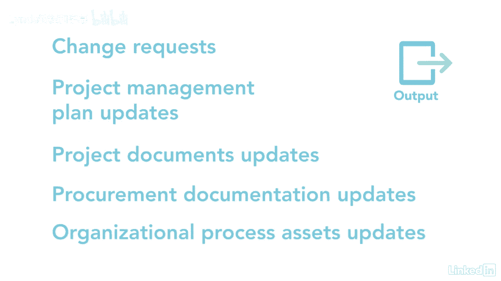

# 061-Lynda教程：项目管理专业人员(PMP)备考指南Cert Prep Project Management Professional (PMP) - P89：chapter_089 - Lynda教程和字幕 - BV1ng411H77g

采购合同一旦订立，是时候监视和控制他们了，看看卖家在计划中的表现，例如，发票是否正确提交并得到付款，还是双方都按合同约定履约，所有这些都在这个过程中被监控，控制采购属于监测和控制过程组。

它确保你在合同中同意的一切都真实发生了，比如性能变化，培养良好的工作关系，最后结束合同，这个过程是密集的，所以最好看看每一个，看看它如何适应整个过程，什么是有意义的。

头两项主要投入是采购管理计划和采购文件，这些提供了如何管理此过程的详细信息，以及工作报酬和工作绩效信息的报表，接下来是要求，风险和变革管理计划，这些列出了承包商需要满足的要求，如何处理风险和变化。

计划基线是下一个，如果有滑移，可能需要更新，就像当一项活动超过了到期日，额外质量报告，这表明卖方的程序是否不符合规定，风险登记册对于跟踪与采购有关的问题很重要，其他投入包括要求，文件和需求可追溯性矩阵。

这些可能包括每个合同需要满足的要求的细节，像执照或许可证，是表明卖方必须满足的条款和条件的协议，另一个关键输入是批准的更改请求，这可能包括修改合同条款和条件，最后一个关键输入是工作绩效数据。

这告诉你卖方的表现如何，其余的输入是假设，日志，经验教训，学习寄存器，里程碑清单，利益攸关方登记册，现在让我们继续讨论工具和技术，第一个是数据分析，包括绩效评估，这些比较了卖方在成本方面的表现，时间表。

质量和资源，根据协议，接下来是挣值分析，查找成本和进度的差异，最后是趋势分析，这将检查卖方当前的执行情况，它对完工时的成本进行了估计，索赔管理是另一个重要的工具，因为任何争议或索赔都需要立即解决。

接下来是检查，并包括对卖方工作的审查，这可能是对站点的演练或查看产品，另一个工具是对采购过程的审计，以确保一切按计划进行，最后一个工具是专家判断工作绩效信息是这个过程的第一个关键输出。

这通过查看交付品来显示卖方的表现，成本和技术性能，其次是封闭式采购，这表明工程已按合同规定完成，然后向卖方提供正式的书面通知，封闭意味着，交付品按时提供，没有未决索赔，所有付款都已支付。

其余产出为变更请求，项目管理计划，项目文件，采购文件和OPA更新。

记住控件，采购程序用于跟踪双方的业绩，以确保他们满意。