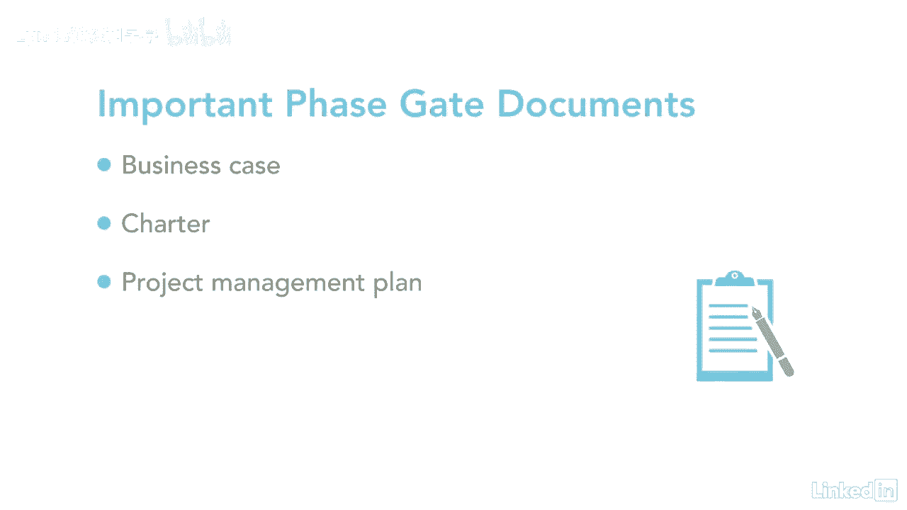

# 061-Lynda教程：项目管理专业人员(PMP)备考指南Cert Prep Project Management Professional (PMP) - P8：chapter_008 - Lynda教程和字幕 - BV1ng411H77g

当你想到项目阶段或阶段门时，我想到了什么，想想玩愤怒的小鸟，在游戏中有几个关卡要通过，每一关都需要你做一些工作，在你可以继续前进之前执行某些动作或活动，这类似于项目阶段或阶段门，在进入下一个阶段之前。

每个阶段都有其需要满足的要求，项目阶段是逻辑上相关的活动的集合，最终完成一项或多项交付品，项目阶段可以用各种属性来描述，包括一个名称，如第一阶段，第二阶段，和一个数字，就像有三个阶段加上一个持续时间。

比如一天或者一个月，其他属性可能是资源需求，也有一个阶段的入口或出口标准，例如，进入一个阶段需要所有的批准，所有可交付成果都已完成，项目也可以细分为不同的阶段和名称，如概念开发，设计，建造，试验。

和释放，除其他外，重要的是要记住什么，从一个阶段过渡到另一个阶段，这就是相位门发挥作用的地方，这是一个阶段结束时的回顾，在那里你决定是否进入下一个，或者在继续前进之前看看是否需要做额外的工作。

您也可以决定结束一个项目或程序，您可能听到的阶段门的其他名称可能是管理审查，杀点或阶段回顾，项目文档，如业务案例章程和项目管理计划，是使用这些相位门进行审查的关键。

随着项目的进展，相位门的重要性在于，是否有意义推进下一阶段，例如，你们还在开会吗，公司的目标是项目仍然有效。

