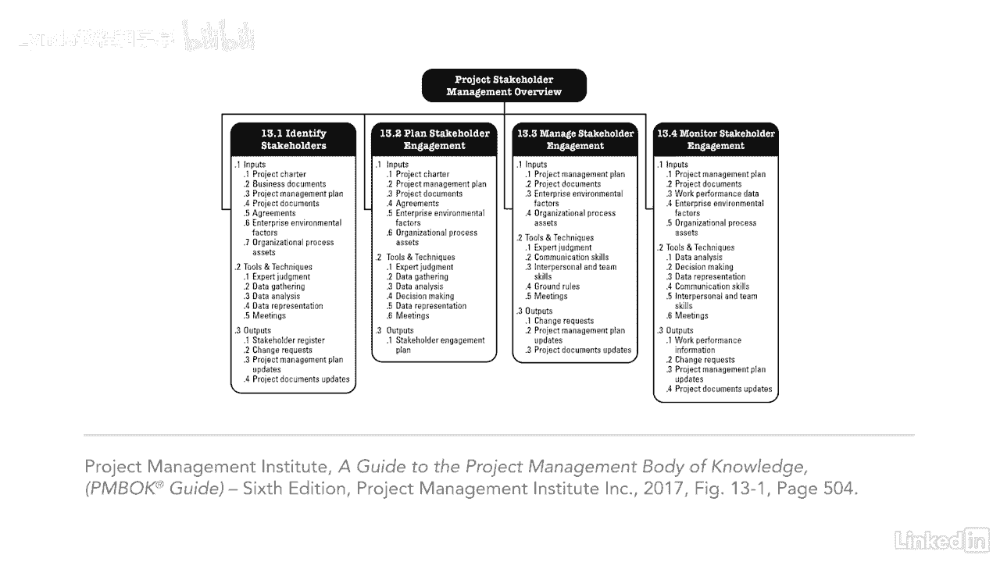

# 061-Lynda教程：项目管理专业人员(PMP)备考指南Cert Prep Project Management Professional (PMP) - P90：chapter_090 - Lynda教程和字幕 - BV1ng411H77g

任何项目经理的最终目标都是利益相关者的满意，随着时间的推移，我明白了如果我的利益相关者高兴，那我就高兴了，记住，没有利益相关者，就不会有项目要做了，你需要他们，所以你可以执行这些天的项目活动。

利益相关者不仅仅是组织中人员的一个子集，项目经理现在应该考虑监管者，游说团体，环保主义者或媒体也是利益相关者，该知识领域涵盖如何识别所有利益攸关方，一旦你这么做了，你需要分析他们。

找出他们的需求和期望是什么，然后您需要知道与涉众沟通的最佳方式，并让他们参与到项目中，最后你要确保，你已经做了你说过要做的一切来让你的利益相关者开心，过去，项目经理是让利益相关者参与进来的人，现在。

让你的所有团队成员都参与到利益相关者的参与中来是一个很好的做法，但这是由项目经理和关键利益相关者来决定的，谁参与了这个项目，团队中的谁将与他们交战，这个知识领域涉及很多，还有很多，而不是试图记住所有的。

我建议理解这些过程是如何相互流动的，它对每个过程都有意义。

现在您看到了高层的涉众管理，让我们来看看为什么这个知识领域如此重要。