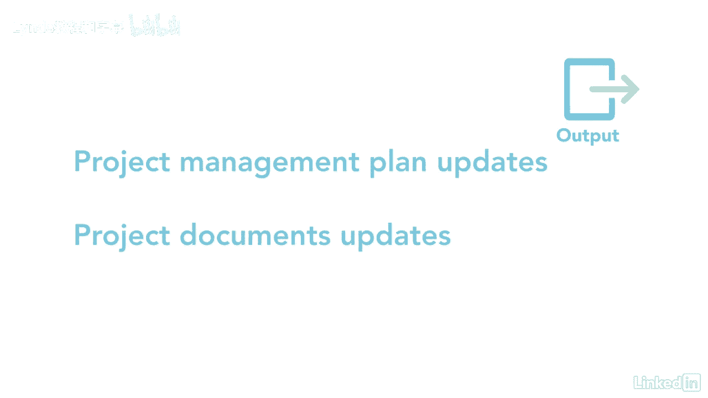

# 061-Lynda教程：项目管理专业人员(PMP)备考指南Cert Prep Project Management Professional (PMP) - P93：chapter_093 - Lynda教程和字幕 - BV1ng411H77g

一旦你确定了你的利益相关者并有了一个适当的计划，如何与他们接触，是时候真正管理他们了，管理的利益相关者参与属于执行过程组，在项目执行期间，项目经理应与利益相关者沟通，管理他们的期望。

处理潜在的关切并解决已查明的问题，下面是这个过程的ittos，我会检查那些可能在考试中的，所以让我们来看看这个过程的输入，从沟通管理和利益攸关方参与计划开始，为与利益攸关方沟通提供指导。

以及如何管理他们的期望，接下来是风险管理计划，它提供关于风险类别和利益攸关方对风险的容忍度的信息，其他输入是问题日志中的更改，变革管理计划和利益攸关方登记册，其余的投入是经验教训，学会了，登记册。

FS和OPAS，第一个工具和技术是沟通技巧，向每个利益攸关方提供项目信息，根据通信管理计划中的详细内容，然后项目经理通过对话接收反馈，会议，进度报告和调查，这种反馈可以用来改善沟通。

人际和团队技能是用来与每个利益相关者沟通的软技能，这可能包括冲突管理，接下来是团队章程中定义的基本规则，最后的工具和技术是专家判断和会议，这个过程的一个主要输出是更改请求，当项目经理与利益相关者沟通时。

他们可能想要改变，因此生成更改请求，其他产出是项目管理计划和项目文件更新。

管理利益相关者的参与是一项全职工作，但是当你的所有利益相关者都参与进来时，这可能是非常有回报的，彼此沟通良好。

