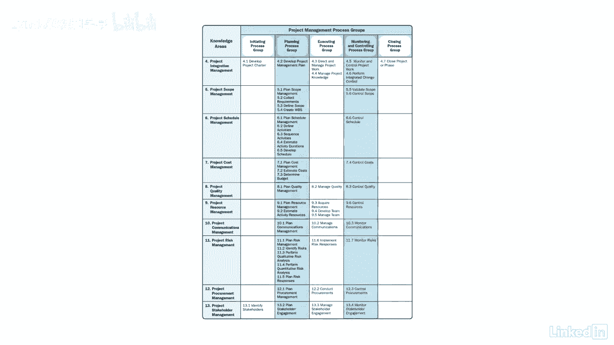

# 061-Lynda教程：项目管理专业人员(PMP)备考指南Cert Prep Project Management Professional (PMP) - P95：chapter_095 - Lynda教程和字幕 - BV1ng411H77g

理解PP流程以及它们是如何组合在一起的对您来说是必不可少的，在考试中取得成功，成为一名优秀的项目经理，我想和你再过一遍框架，并指出一些要记住的主要项目，当你看这张图表的时候。

您会注意到在顶部有五个过程组，左手边中间的十个知识区域是四个九个过程，此图表也被称为用于管理项目的框架，关于这个框架，重要的是要记住什么，不是必须使用所有的过程，但要根据你的项目定制它们。

挑选出最有意义的，一个小项目可能只使用其中的几个过程，但是一个大型的多年项目可能会使用框架中的每一个过程，了解知识领域以及它们如何适合于项目管理是很重要的，请记住，我们涵盖了每一个知识领域和每一个过程。

要完成的前两个过程应该是开发项目章程和确定利益相关者，因为章程授权这个项目，及早识别涉众是项目成功的关键，每当规划过程完成时，记住每一个都需要按照每个知识区域中显示的顺序完成，例如，用于计划范围管理。

按以下顺序执行过程，计划范围管理收集需求，界定范围，创造工作，分解结构或WBS，每个过程先于下一个过程，所以它们需要按顺序进行，启动进程组有两个进程，关闭进程组有一个，所以这些是最容易记住的。

尤其是下次考试开始时你会做的大脑倾倒，正在执行十个，紧随其后的是12个监控，用两个四个过程计划他的最后一个。

记住一个过程只属于一个知识领域，一个过程组能够回忆这个框架，尤其是当你绞尽脑汁。