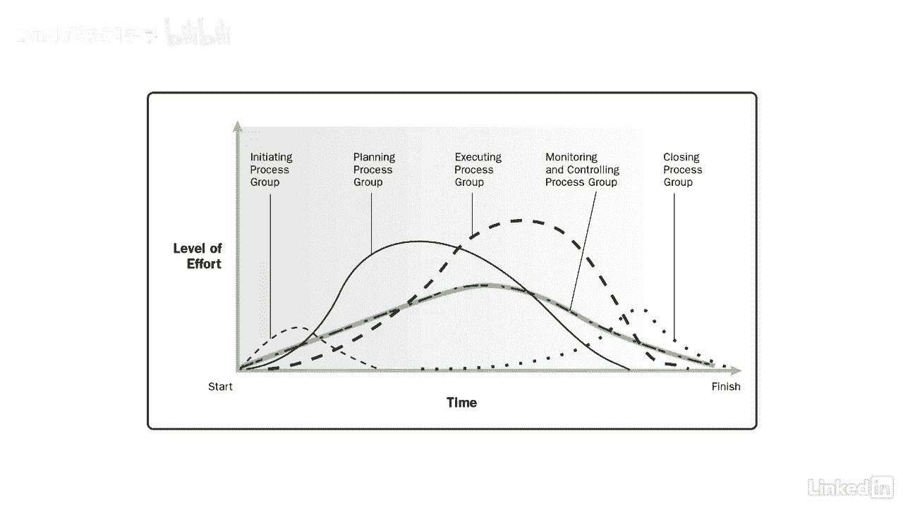

# 061-Lynda教程：项目管理专业人员(PMP)备考指南Cert Prep Project Management Professional (PMP) - P9：chapter_009 - Lynda教程和字幕 - BV1ng411H77g

如果你刚开始学习弹球指南，学习五个过程组的想法，十个知识领域和四个九个过程似乎令人望而生畏，但你很幸运，你让我帮你在这些区域中导航，从项目管理流程开始，项目管理过程是团队用来执行项目计划的过程。

每个进程由一个输入组成，输出，以及工具和技术，这些过程的输出可能是其他过程的输入，或项目或阶段的交付品，例如，项目章程，它是开发项目章程过程的输出，将投入到制定项目管理计划的过程中。

现在的过程一般分为三类，首先，在项目中使用了一次或在预定义的点上使用的过程，一个例子可能是确定利益相关者，然后是根据需要完成的过程，如计划风险应对，最后，我们有在整个项目中连续完成的过程，比如定义活动。

好的是，这些过程是全球性的，可以用于任何行业，所以你可以把它们应用到任何项目中，不管你在哪里，也不管你在做什么工作，弹球指南也只是一个指南，您可以选择哪些流程应用于有意义的项目，例如。

如果你有一个两周的项目，您可能不希望部署所有四个九个进程来管理您的项目，仅仅创建文档可能需要两周以上的时间，另一方面，如果你正在建造一艘新的游轮，需要几年才能完成，使用所有四个九个过程可能是个好主意。

项目管理流程分为五类，称为项目管理过程组或仅称为过程组，监测、控制和关闭，看起来所有这些过程组都小心翼翼地相互独立地工作，但事实是，它们在整个项目中重叠并相互作用，这是一个伟大的图形。

显示在整个项目或阶段中每个过程组是如何重叠的，如果你看左角，你就会看到，计划与监控同时启动，它们在整个项目中重叠，执行，然后开始，它在关闭前不久结束，每个过程重叠，直到项目或阶段结束。

另一种看待这一点的方法是，进程组不是按顺序运行的，当你接近结束一个阶段，下一阶段工作开始，就像计划然后执行，与此同时，监控仍在进行，甚至可能有一些活动在项目结束前关闭。

比如采购，正如您所看到的，项目管理过程是紧密相连和交织在一起的，了解每个项目之间的关系以及如何管理您的项目是很重要的。

