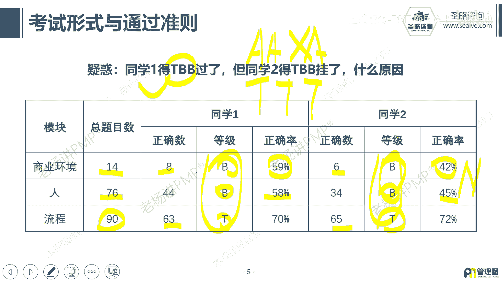

# 1-4.PMP考试成绩如何计算 - P1 - 圣略咨询-PMP项目管理 - BV1c1421m7wg

大家好，我是老杨，今天来跟大家一起聊一聊，关于偏僻考试成绩到底如何计算的问题，那偏僻考试成绩的计算方式呢稍微有点复杂。

我们来一步一步往下看，那最新的片尾考试呢，他把原来的计分规则从五大过程组，转变成了三大领域，从原来的200道题变成了180道题，还是中英文对照，只不过呢原来的200道全部是单选。

现在180道变成了单选加多选，证明了多选不多，大概有20道左右的多选，而且他会告诉你这个题目是选两项还是选三项，其实跟多跟单选没有本质区别好，那么五大涡轮组变成三大领域。

它是不是对项目管理造成了一个颠覆呢，其实没有啊，其实没有，那我们说原来的五大过程组，它是按每个过程组来进行计分啊，看每个过程组得的成绩怎么样，而现在变成了三大领域，其实就是把原来的五大涡轮组给他打散了。

重新再组合了一遍，你比如说什么是人呢，我们在这个项目管理过程中，我们说项目为人服务，最后也由人来实施，所以其实项目管理就是围绕着人在说事，那第13章相关方管理讲的是人啊，12章采购管理。

我们讲到合同的双方的关系，讲的人啊，第十章我们沟通管理讲的人，第九章资源管理，讲团队讲人，所以把这些的内容把它拉到了人这个部分啊，然后呢我们讲项目管理的，整个其实就在讲流程变更流程啊，问题解决流程啊。

启动的流程，收尾的流程，把这些把它归总到了流程这里面去了，然后我们讲项目他在做的时候，你要去考虑到组织内部外部的各种环境呢，商业环境啊，市场环境呢，法律环境呢你需要去考虑啊，那么这部分的内容呢。

我们把它统统归于商业环境，所以只是把圆的东西打散之后呢，重新组合了一下啊，好那么组合之后呢，现在的题目的分布大概是这样子的，人占42%啊，那流程占50%，商业环境占8%啊。

那也就是说按这个来比例来算的话，180道题在流程，这就是有90道题，同样四个等级水平，A表示非常优秀啊，T表示合格，B表示不及格，N表示太差了，那到底怎么样去计算呢，好我们来举个例子。

我们就拿这个流程为例，流程呢它有啊180占50%，应该是90题啊，那么它的ATBN，大概的计算方式就是这样子的，如果你在这个模块，你做题的正确率超过80%，那你就会得到一个A，比如说90题。

80%就是72，你超过这个得到A那如果是你达到60%，但是低于80%，也就是说你正确的提速，在54~71这个区间，你会得到T那如果你的正确的这个啊提速啊，它的比例低于60%，但是高于40%。

也就是36~53题之间，你会得到一个B，那如果你的准确率低于40%，太糟糕了啊，493 16，你连36题都没有做对，那你就会得到一个N太差了，我之所以叫它近似的计算方式啊，为什么叫近似。

因为这里面会有一个啊，大概5~8题不计分的这样一个操作，当然有人说，那这是不是不公平，其实是公平的，对每个人都公平，因为他的不计分的逻辑大概是这样子的，这次考试啊，所有的人做对的5~8题不积分。

或者所有人都做错的5~8题不积分，其实他主要是为了去调频一下通过率，对每个人都公平，这个其实可以忽略，不用去管它啊，好我们再来看两个极端的案例，就是有两个同学他们都是得到了TBB的成绩，但是同学一过了。

但是同学二挂了，这是什么原因，我们来看这张表啊，那三个域里面我们把题目分布一下，大概就是这样子的，180道题流程，这90道啊，人这76道啊，商业环境14道，那同学一，你看他的流程，这是合格的啊，63题。

那同学二他也合格了啊，happy同学一多对了两题，那么他们都是得到一个T的等级，好我们再看人这块，人这块的同学一，他的合格率是58%，而同学二的合格率是45%啊，那么他们两个都落在了B的区间啊。

那么在商业环境，这同学一做对了八题，而同学二做对了六题，他们一个准确率是59%，一个是42%，同样他们都是得到B，你会发现有这么一个问题，同学一虽然得到了两个B，但是这两个B已经非常接近于T了。

而同学二虽然也是得两个B，但是他的两个B是非常的接近于N，你只需要再错一个就是N，而同学一你只需要再对一个，它就是T，也就是说表面上看他们两个都是TBB的成绩，但是本质上他们这个成绩的悬殊是非常大的啊。

所以一个过了一个没有过啊，那么也就是说，我们需要让每一个模块都要达到一个，均衡的水平，那么最保险的情况就是你三个都是T那是B过，或者三个都是A是吧啊，B过就是你尽量不要得到B，那么得到N那就肯定不行啊。

基本上你只要得到N八九十%都会挂啊，那大概就是这样一个逻辑啊，好，这就是我今天给大家介绍的，关于PMP考试计算通过率的这么一个准则。

我们有机会再见。

