# 1.PMBOK第7版解读：项目管理新趋势 - P1：1.PMBOK第7版的发展背景 - 清晖Amy - BV1Km421u7UQ

今天晚上呢，也非常感谢大家抽出宝贵的时间来参加啊，咱们今天晚上的一个分享啊，是我关于对PMBOK第七版的一个解读啊。

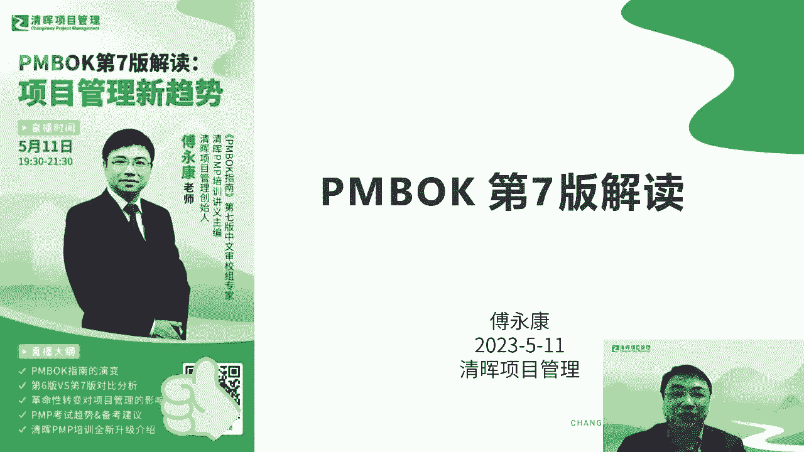

这个话题呢其实也也有两三年了啊，因为第七版的从他的这个写作到这个发布，其实基本上从19年到现在差不多3年啊，在这个期间呢其实也是呃全程的一个参与吧，啊那这个是我个人的一个简介，这个就不多说了啊。

如果轻微的同学应该对我会比较熟悉一些啊，那个费清灰同学可以大致了解一下，之前呢对于这个篇幅，第七版呢，其实我是有过几次的这个分享啊，有过几次分享比较重要的，我觉得有两次吧，一次是呃呃20年的10月份啊。

那是受这个华为的邀请，在华为的项目经理的论坛年度论坛做了一次啊，关于他的一个前前瞻分享，因为那个时候呃，片布跟第七版还没有正式发布啊，然后相当于提前做了一下准备，做了一个分享。

然后紧接着11月份呢在当年的PMI中国大会啊，这个大会已经隔了两年没开的啊，那是最近的一次中国大会，在那次也做了一次，关于PMBOK第七版的一个前瞻分享啊。

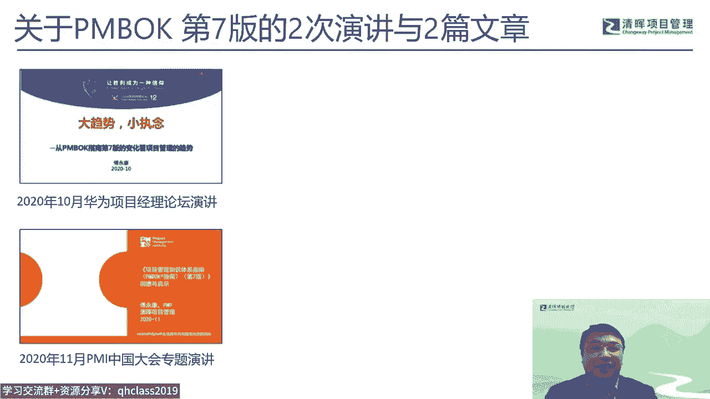

这个后来呢，也也因为有了前面的一些分享基础啊，然后后来这个业界也比较关注这个话题啊，然后后来也写了两篇文章啊，也是受这个项目金额，项目管理论啊，评论的这个杂志的一个邀请啊，分别在21年的1月份啊。

就他的第七，还有那个22年的222年的那个第七页，分别写了两篇文章，实际上这两篇文章对我来说呢，相当于是一个姊妹篇啊，然后因为因为PMBOK的它的本身的发布，它是对外的，这个包括自己的参与。

他也是逐步的在接触到它的内容啊，所以在21年的1月份实际只是写了，主要是写了他的这个八大纪效率这块啊，然后2年的这个1月份的，会会对他的一个原则部分做做些做些描述吧，尤其是他的那个价值的原则。

所以这是过去对于这个片布第七版的一些分享，那其他的分享呢，就主要会是在我们星辉的一些论坛上，一些论坛上做一些做一些分享。

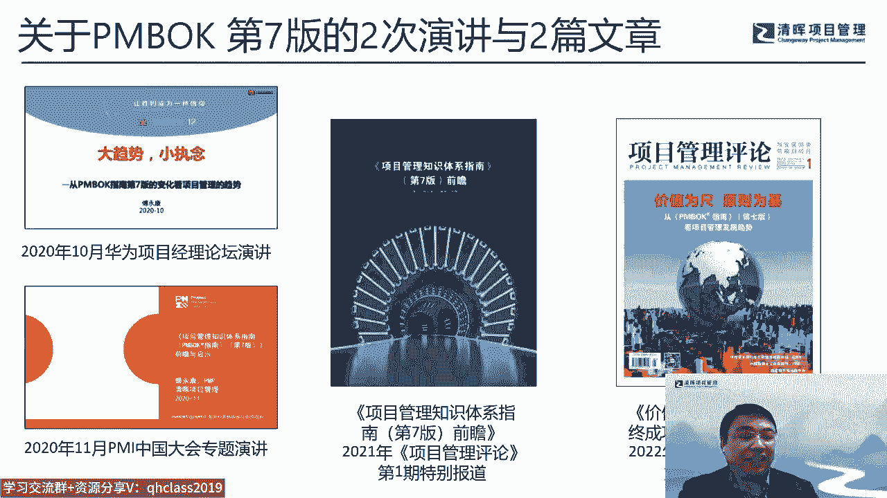

那今天的分享的内容呢，我想主要是也是分成三大块吧，一个是介绍一下pp和第七版的一个，发展的背景啊，包括自己的一个参与啊，第二块呢会介绍一下第七版的一些核心的内容，以及这个啊，我对项目管理的一些未来的。

一些发展的一些理解，然后第三块呢可能也会啊，有些队伍接下来要参加PMP考试的同学，可能会比较关心一点，就是涉及到PMP这个考试大纲的变化，还有他的一些学习的一些建议啊，那我主要是分这三块来来做分享。

那后面有些时间呢，也大家可以做一些互动的一个交流呃。

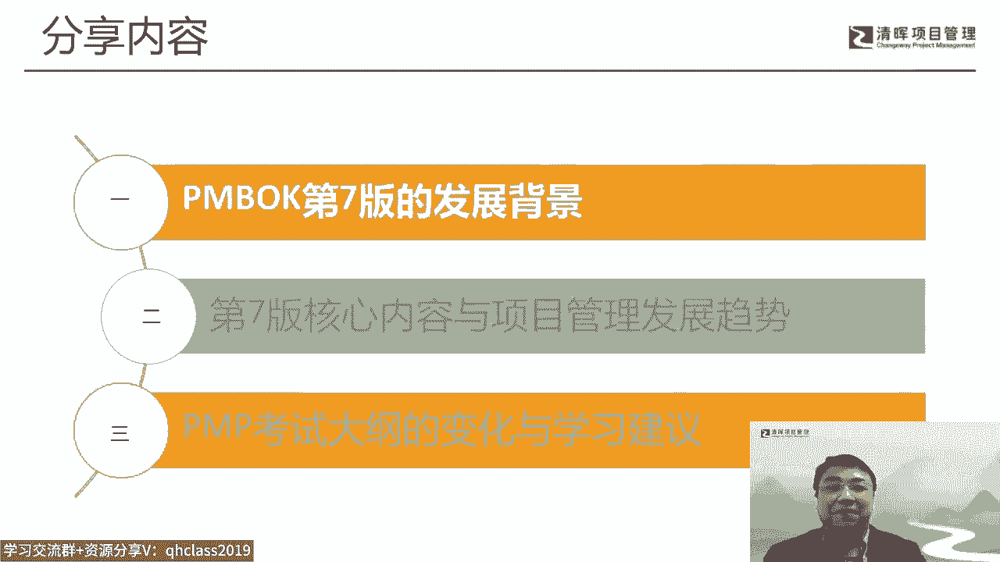

讲到这个第七版啊的这个写作呢，实际上他还是受他的一些历史的一个，一个影响的，因为我们第七版写作是在啊19年左右开始吧，那实际上再往前5年四年，那这里面其实也是业界对，他其实也是有很多的一些啊这个铺垫啊。

比如说比较重要的一本书啊，我觉得对后面这个第七版的一个写作，应该是起到一个很大的一个一个推动作用吧，就是克森纳先生在15年的时候写的，这个项目管理2。0，那这本书呢因为也比较有幸是我来做翻译。

把它引进引进到中国啊，那这个这个这本书里面的，其实在当时啊，我是觉得在项目管理界啊，他是比较破天荒地提出了一个很重要的一个，一个问题，就是无卡环境的一个项目管理啊，因为在之前其实在项目管理界。

其实谈乌卡的不多啊，可能过去更多的会在一些商业啊，在一些这个比如说创投啊，在在在风险投资这些领域里面会谈到股卡，但真正在项目管理这个领域谈的比较少啊，所以那一年15年应该算是无卡进度。

项目管理的一个元年了啊，那另外一块呢，他这本书里面特别会提到，价值驱动型的项目管理，那实际上这个观点呢就深刻地影响到了，第七版的一个核心的思想啊，就是以价值为导向来教辅项目项目啊。

所以这个是他非常大的一个，前瞻性的一些影响啊，那我们现在所处的时代。

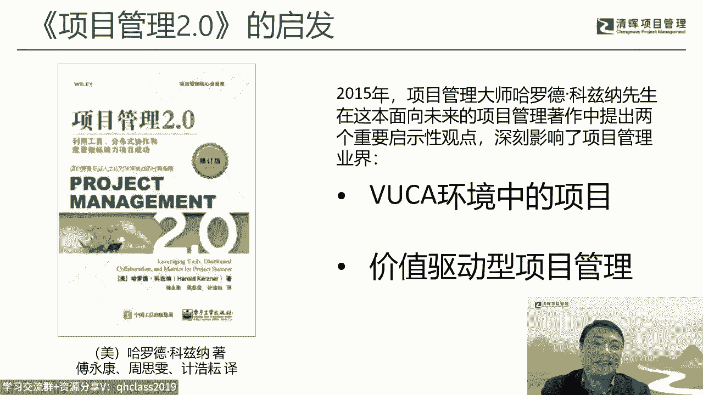

就像这个呃2。0所说的啊，就五卡的时代，咱们现在有个更呃也不叫更流行吧，但是也有很多人会提到一个词叫巴黎啊，巴黎时代从乌卡时代到巴黎时代，实际上这里啊这两个词呢，我觉得是反映出我们现在这个内外部环境啊。

或者说我们呃自己内心，对这个世界的一个认知啊，外部环境越来越无卡，越来越易变性，不确定性，福塔性模糊性啊，但我们其实从内心来说可能会有很多的脆弱，脆弱性焦虑感啊，会有一些非线性的这个这个状态。

也有一些对未来的不可知的一种，一种一种状态啊，所以在这种情况下，我们怎么去理解我们所处的世界啊，怎么去更好的去做项目，我觉得可能这些会会对我们有很多的一些一些，怎么说呢，会影响吧。

当然这些影响呢在遍布的第七版里面，他也试图的去反映出一些这方面的考虑吧，啊啊。

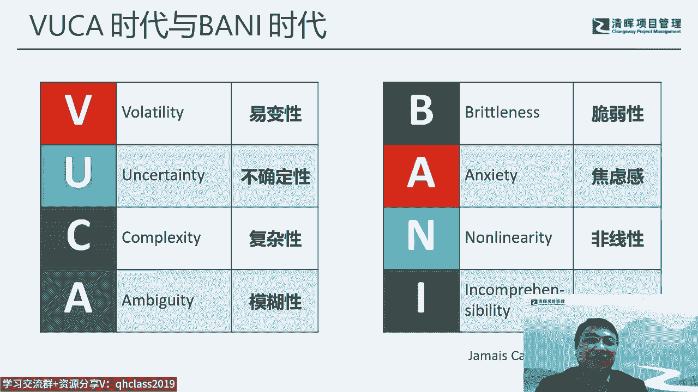

另外一块呢，我觉得是一个，我们现在面临的是一个叫数字化转型的时代啊，当然这个自由又有，现在也有很多会把它用人工智能的智啊，去替替代它，但实际上在偏爱来说呢，他其实这个这方面的呃。

这个关注其实也有来有久啊啊，在19年的时候，p mi其实就出了一个他的年度报告，叫未来的工作啊，那未来工作里面，这里面就特别会提到数字化的转型，以及对所谓的计算啊，这个这个技术方面的商业的这个这个能力。

主要是一个数字化的一个能力的一个体现，那正因为数字化的转型，使得我们现在就很多的项目的这个形式啊，它是发生了巨大的变化，因为我们过去传统一个行业就是一个行业，它有很多自己行业的一个门槛或者壁垒在。

但实际上从我个人觉得，实际上是从进入21世纪以来，就是有一个词是深刻地改变了这个世界，就是所谓的软件定义世界啊，所以各行各业，其实其实我们现在面临的都是被一些软件，被一些数字化的一些工具。

甚至未来我们更多的会被人工智能的，很多东西去去影响啊，在这种大的环境下，我们其实项目的整个这个环境啊，以及项目的比如说生命周期啊，这它的开发方法其实也就面临着很大的一个，跟过去传统的不一样的地方。

所以在这些不一样的地方，怎么反映在这个项目管理里面，那这是PI啊，作为这个全球的项目管理的领导的，或者说这个标准化制定的一个组织，他是会会深刻的去思考和和应对这个事情啊，所以我们看在第六版。

第六版是2017年发布的啊，在第六版发布之后，pm他也陆陆续续在发布一些新的标准，那我个人觉得有两个标准的，对于我们第七版的写作，它是起到了一个很大的一个起作用的，就是中间这两个啊。

一个是叫组织绩效管理标准，还有一个是收益实践项目的实践标准啊，实践指南啊，因为正好这两这两本标准也都是我们清灰，我我这我这边在牵头翻译这个在做的事情啊，所以对这两块内容会比较熟悉一些。

当然也是会比较印象会比较深刻啊，因为因为他确实这两本标准，对于我们第七版的内容，以及他的甚至包括他的写作风格啊，都发生了一个非常大的一个一个一个，促进作用啊，那另外一块呢是2019年的6月份啊。

这个PMI发布了他的新考纲，注意这个新考纲，其实发布的时间比我们预想中的要早啊，因为我们真正的在中国用这个新考纲做考试，也只是去年啊，去年才开始用，因为受这个疫情影响，实际上这个2019年之后。

受这个疫情影响，这个真的是有非常非常多的，所谓的无卡的这个变数在里面，所以很多的东西跟我们过去想做想象的事，完全是不太一样啊，那在19年发布这个新考纲的时候，实际上它已经是意识到这个这个未来啊。

PMBOK第七版的它的一个写作以及它的结构的，甚至包括他们内容的一些变化，那当然因为写作是在新考纲发布之后啊，所以考纲的这个这个内容结构，它某种程度上它是起到了一个启示的作用啊。

是一个指指南针的一个作用，所以它的这里面的一个结构的一个变化啊，以及比如说对敏捷的一个重视啊，我们很明显能看到对在第七版里面，他得到一个非常深刻的一个体现啊。

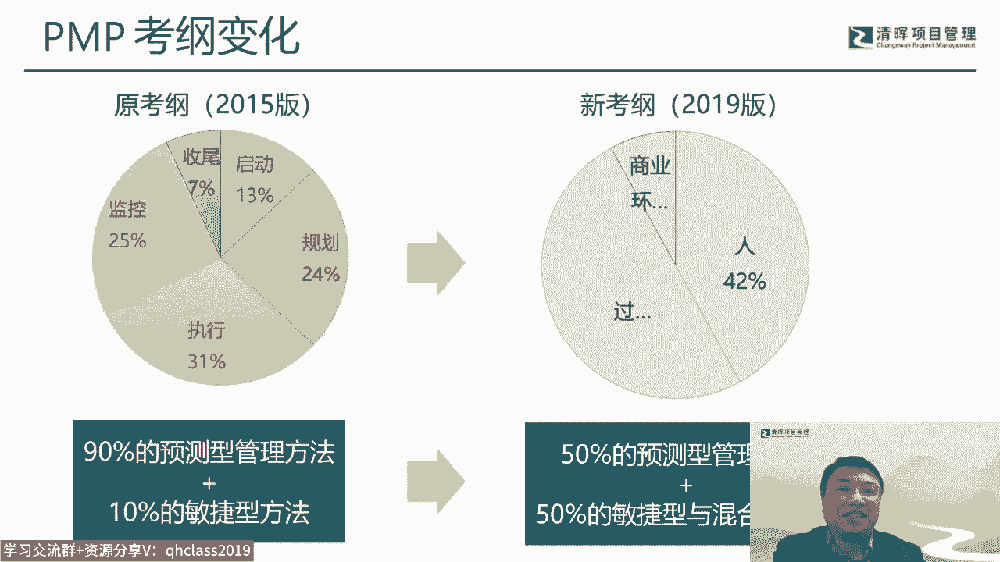

这个19年的10月份，10月份啊，是PMI，这个叫成立50周年的这个这个这个纪念日啊，所以TM在成立50周年的时候，他举办了这个，当然按惯例他每年会举办一次pm全球大会啊，当然在五周年的这个全球大会。

就显得特特别隆重以及特别有意义了，那我我我们清辉啊，我们也也也有幸去参与了，参加了这个这这次大会，因为对我个人来来这参加这次大会，还有一个很重要的一个目的，就是去要去现场了解一下。

PMBOK第七版的一个一个进展的一个状况啊，因为在在这个按照他的一个惯例来说啊，就正好正好这一年实际上是一个偏偏布的一个，一个，相当于是一个叫专业讨论的这么一个，一个一个一个年份，他会在这个PY大会上。

会做这个相应的一个研讨，所以这也是比较吸引我去的一个地方，那这次的大会呢我觉得有几个重要的变化，一个，首先最明显直观的就是，PMBOK的logo发生了一个特别大的一个变化，他变得特别明快啊。

特别这个既有既有年轻和时代感的，另外他有一个特别重要的一个口号啊，这个就是在他这个进门的这个展厅，最终核心的地方叫welcome to the project的一个norm，叫欢迎欢迎来到这个项目。

项目经济时代，那项目经济时代呢，PMI对他有个解释啊，叫从想法到现实在变革中的世界驱动成功啊，这也是他的一个slogan啊，那所以实际上在对从PMI的角度来说的，他在19年的50周年大会。

他其实一方面自身做了一个变革，另外一块呢他确实对未来项目项目管理，项目经济啊，这个这些这方面他也做了一个铺垫的，一个准备的这么一个工作啊，确实我呃，19年，我觉得是p mi的一个很重要的一个分水岭啊。

就告别过去，面向未来，当然这个面向未来的同时呢，他也正好是伴随着偏不可第七版的一个，改版的推出，那所以这几件事情都我觉得都是并在一起的啊，那在那次的这个PM大会里面，有有两天的这个专门的PMBOK。

第七版的研讨会啊，这个这个我也是这个正正好，因为去嘛，就其实目标就是参，就是要去参加这个这个研讨会啊，所以这个也是受益匪浅，那其实在那次研讨会上呢，其实看到的信息啊。

其实他确实来说还是比较超前的一个信息，那当时的camp其实还没有定型啊，所以很多的文稿啊，包括内容啊，其实跟我们现在看的已经是非常非常不一样的，都还是非常原始，非常这个还是怎么说呢，算是他的初稿吧。

那这左边这两位呢是这个片博格，第七版的两位主编啊，一位是那个CCR，一位是迈克啊，那新西兰呢它其实也是偏布的第四版，第六版啊，同时也是第七版的主编，所以他一个人兼了这个做了三版的，这个片布的指南啊。

是在美国来说，也是非常资深的一位项目管理的专家，那这个右边这位呢，他是一位非常知名的敏捷专家，说敏捷实践指南呢，也就是就是就是格雷夫斯MICHAEL啊，他这边编写的啊。

然后当时的会场也有一些这个意见版啊，其实供我们去看去，因为他是其实严格来说，这个这个会场是不允许拍照的，其实我这个也是也是反正私下里拍了几张啊，作为一个纪念吧，也是非常难得的一个一个纪念啊。

这里面也有很多的内容，其实我们看右边这个内容，跟我们现在看的PMBOK的这个内容，就完全是不一样的啊，所以他也是在吸取大家的这些，反馈的意见里面啊，当然这里面其中也有我的一张这个反馈意见。

然后然后这里面可能后面也做了一些修改吧，这个那所以我们来看这个片book指南，其实它有个演变的一个过程啊，从最早的雏形是在1983年啊，1983年的时候呃，pm的他其实推出了PB的一个原型版的。

叫EAEA呢，实际上是叫伦理标准，还有认证啊这三个词的缩写啊，它里面提到了六个呃项目管理的这个领域啊，其实跟我们后面见到的这个其实还是有，还是有很大的一个一个距离的啊，那真正的定型呢是从96年开始啊。

96年第一版是正式的定型，定型之后，基本上后面就基本上每隔4年这个更新一次，那唯一的一个变数是第六版啊，花了5年啊，花了5年是因为那次做的改版，内容实在是太多太多太大啊，然后加了大量的敏捷的那种。

所以他整个时间上，可能节奏上可能就就赶不上这个44年了，所以他推迟了5年，但是在在第七版的时候，其实尽管他做了巨大的一个变化啊，但是好在就是说它的内容相对来说，又又有了缩减啊，就不像D600那么厚了。

所以它还是能够感到回到这个4年的这个，这个节奏里面啊，所以我们现在看到的是第七版的一个一个发布，21年的9月到8月份正式对外发布吧，呃我们看这个从这个指南的第一版开始。

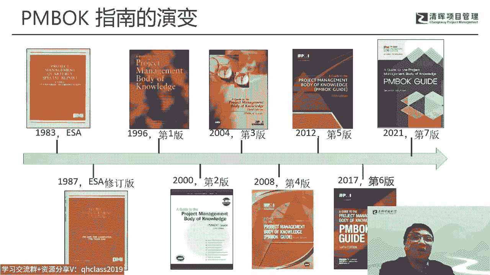

是让整个PMBOK的这个传统，或者说他的经典布局啊，其实就已经定型了，就是所谓的五大过程组啊，启动规划，执行监控到收尾啊，这五大过程组和知识领域，当然在最最初的版本里面是九大知识领域啊，所以我们过去呃。

又在在我当时学这个PMBOK的时候，还考编的那时候一个一个说法叫九五取证啊，九五取证，那九五几真的直到这个第五版啊，到12年的第五版发布的时候，这个才被打破，因为12年的时候。

第五版增加了较干系的知识领域，这样的话使得九五举证变成了实物举证，所以从实物从12年到现在十多年，这个实物举证就也是又变成了，印在我们脑海里的一个一个一个专有名词啊，那我们现在看到的这个。

这个上一个版本是第六版，第六版的，在相对第五版来说，其实变化我个人觉得并不像想象中那么大啊，并不像他这个页页数所体现出的那那那种差距，实际上它的核心这个这个叫实物取证，其实还是相对比较稳定的。

只不过个别的一些内容做了一些微调，最最大的变化，实际上它是要加大量的比填的内容啊，所以第六版呢实际上它是一个试图融合，这个叫预测型和敏捷型啊，预测融合这个所谓的瀑布和敏捷的，这么一个版本啊。

当然这个版本的就是对这个怎么说呢，从因为毕竟来说这两块还是还是有些差异的啊，所以从他写作来说，其实还是比较比较有挑战的一个一个工作啊，那所以为了配套这个第六版的发型，其实PMI的同时也推出了角。

并且时间指南啊，敏捷时间指南的这个目的呢，实际上主要还是配配套这个篇幅，和第六版的一个学习啊，和这个理解，那到第七版的就完全是不一样的啊，第七版，我们看他这整个结构就发生了一个翻天覆地的。

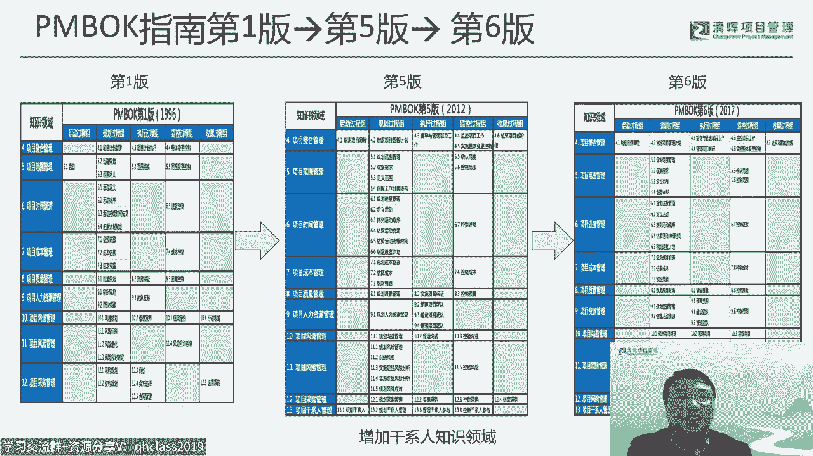

颠覆式的一个变化，这个是在，在我当时19年去参加这个研讨会的时候，一看到那个结构啊，我我我我简直是给震惊的，这个无语呃，这个这个无语这个就没法描述了，这个因为毕竟来说，过去十几年所面对的学到的这些。

所有的这个项目管理的知识，在第700年前就感觉到一下子完全坍塌掉了，变成了另外一个结，一个结构在当时来说，其实一下子很难去接受，就花了很多时间，很长的一段时间，才想把这个心情平复下来，来来来来来。

自己来看他这个这个内容啊，所以所以确实来说，有一个挺不太容易来去接受的，这么一个一个一个转变吧，当然这这种心情我后来一看诶，这个咱们偏PMI这个pm book里面，后来谈到的这个叫变革模型啊。

这个变革模模型里面其实蛮蛮，像这种当时的一种心情的一种理，那种那种变化的这个这个曲线啊，呃从第七版的这个和第六版相比来说，实际上它的内容就就完全变了，因为第六版是什么五大呃，呃五大这个过程啊。

五大过程中是他知识领域我们是这么排的，但在第七版里面，他就完全变成了叫叫所谓的这个，12原则和八大金效率，而且这个它的这个从细节来说，这个指南和标准的放在书里面的，编排的顺序也也也完全颠了个个啊。

原来是标准放后面，那现在是标准方，前面只能给他后面，所以它这个整个从内容啊，顺序啊就完全颠倒了，那这里面变的主要的内容呢，我觉得主要是几个啊，几几几个数字吧，一个是基于从原则来出发。

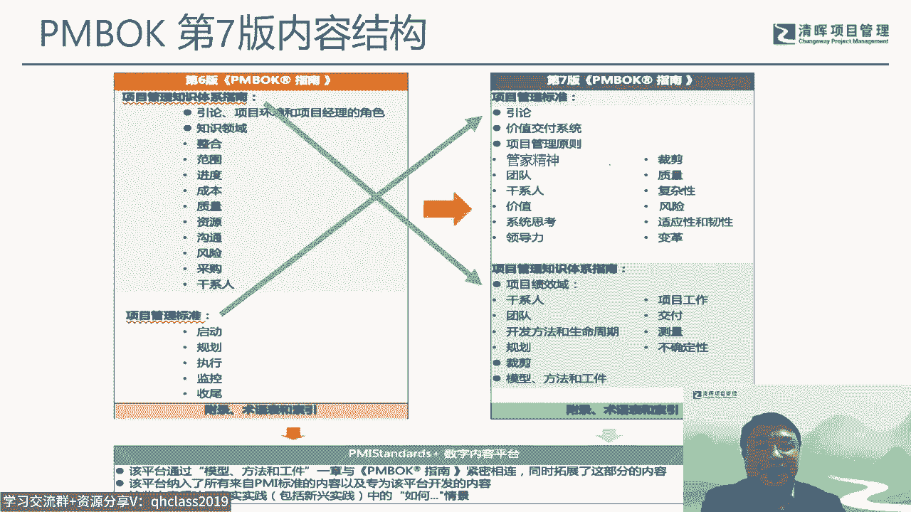

把这个叫所谓的五大过程组，它完全改成了这个12原子，就这样的话，他从标准的这个这个内容或者说写作来说，它就完全颠覆掉了，这个过去的这种这种，这种以过程为导向的这么写作法。

它变成了叫原则为导向的一个写作法啊，当然这个以原则为导向的，我也说的是前面从18年开始pi写标准，它其实就已经开始在在往这方面转，直播片布来说也是一个具体的一个体现，那第二块呢就是基于这个叫价值交付。

我们过去更多的强调是交付可交付成果啊，就所有的这个过程，最终都是为了交付可交付成果的演出而来收尾，那他是这么来来来考虑整个整个架构的，但是在第七版来说，我们更多考虑的是一种价值。

但价值呢就不完全只是说可交付成果，你还要考虑到他的一些这个怎么收益啊，这个这个真正的产生了所谓的outcome成果啊，收益啊，然后再到价值啊，所以他是需要需要这个进一步来考虑。

这个他的一个工作的一个对象和范围的啊，所以这样的话他就改用八大纪效益来进行一个，描述八字，所以这也是这两个版本，我觉得最所以核心的这两个两个大的一个，一个转变啊，那天籁呢对这个新旧版本的对比呢。

它其实也有一张表啊，这是在他官网上发布的一张啊。

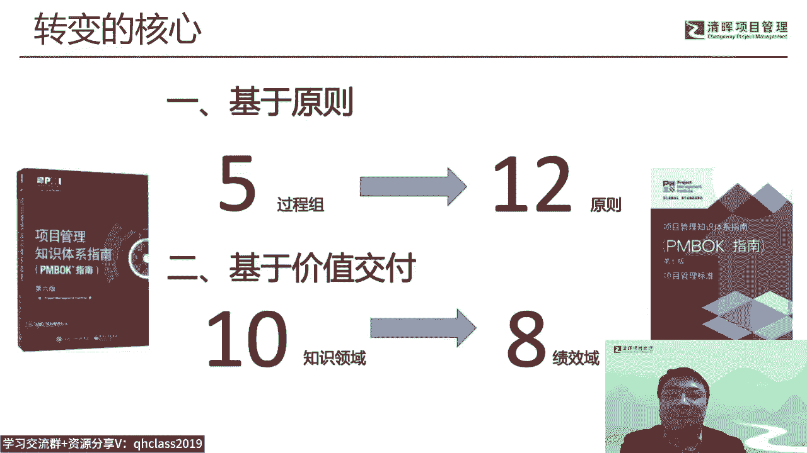

从偏爱的角度来来理解这个这个两个版本的，一个对照的一块啊，那么其实从总的原则来说，第六版它就是所谓的它是叫所谓的规定性啊，所谓的为什么叫规定性，其实他就强调了我我们要有ITTO对吧，这个输入做什么工具。

技术用什么，然后让输出什么，它实际上是用过程的这种方式，他强调是怎么做，它强调的是how，而不是Y啊，那从第七版来说，它更多强调就是Y的啊，就为什么要这样做啊，为什么要这样做啊。

然后他其实是用一些原则的东西，因为原则本身来说，其实它是一种比较比较高层级的，这个这个这个这个这个考虑的啊，所以所以它更多是用原则来来来引导，或者说来指导你这个这个行为啊，他是这么一个考虑具体的行为呢。

倒反而不是在第七版里面所特别强调的啊，所以它实际上所所有的具体的这个行为，它更多的是用工具啊，方法啊，它是用方法和这个工匠这个来具体来体现的啊，那从设计的角度来说呢，第六版或者说之前的所有版本。

其实都是IPTO啊，都是以这个过程，那这个呃第七版的更多就是用绩效益啊，用绩效成果啊，用绩效益的成果啊，来来驱动这个这个这个工作的一个开展，所以它整个设计的是不一样的。

但是环境来说应该都还是内外部环境都有啊，然后这个项目应用的这个要注意一下，他第六版之前的更多强调大多数项目大多时间，其实他这个潜台词是什么，就是说他所面对的这个项目的类型。

可能更多的会偏这个叫所谓的这个叫预测型啊，啊虽然第六版里面也加了敏捷的元素，但它总体来说还是偏预测性啊，那这样的话不是所有的项目都是预测性，尤其在现在所谓的数字化的时代，其实有大量的项目其实是敏捷型的。

或者说这种就是或者说其他的这种行，所以在考虑到这种变化，所以第七版呢它其实是刻意的弱化了，这个这个针对的适应性的这个这个这个方法，它更多强调的是所谓的叫全全频谱啊，就是从适应到预啊，从从预测到适应。

把它整个这个这个所有的这种项目的类型，生命周期啊，他都考虑到他是有这么一个考虑的，然后受众来说也是怎么说呢，也有变化，原来强调的是项目经理，但是现在第七版的其实除了项目经理之外。

他更多强调的是项目的一些重要的参与者，干系人，尤其是啊在我个人看来比更适合项目的领导者，就是一所以越往上走，其实对这个这个版本的这个这个接受度会越高，因为它里面确实有很多的会跟企业的行为啊。

企业的经营或者说领导者的这个这个思维，他会更加结合，更加much去啊，所以这里面的话对我们读者来说呢，其实某种程度来说，要有意识的去抬高自己的一个思维和认知啊，去才能更好的去理解第七版啊。

主要是这些法啊，然后当变更的话，这方面以前都是都基本上959叫九五集，真大食物谨慎，其实基本的框架它是不变的啊，只不过变的就是各个不同的这个过程的位置，以及它的一些IPT的一些具体内容。

但是第七版就完全是颠掉了，完全变掉，这里呢也跟大家也可以说一下，这个我们中文神教的这个事情啊，因为正好这个我也全程参与了这件事情啊，正好因为在国内呢，大家可能接触的其实是中文版，那这个中文版呢。

实际上也也是也也这个说来话长，也是一个里面也充满故事的一个事情啊，啊这里面呢最初呢这个项目偏不给呃，这个启动了，我呃感觉应该是在18年底19年初左右啊，来正式在启动，因为至少在18年的呃，78月份。

因为我当时去了一趟美国，和那个和那个叫咱们的主编CCI在西雅图，其实当时呃呃去过一次啊，其实那个时候他还没有提正式提这件事情，但是他他说可有可能他接下来会做这件事情，所以应该是在8月份。

他至少还没有正式来启动，这个第七版这件事情啊，所以差不多几个月之后来做，那么在19年的10月份的时候呢，是偏爱这个50周年大会，那这个大会的时候，实际上他已经是有一个初心版出来了，出新版出来。

所以我们在大会上其实可以看到出新版，来做一个相应的所谓的研讨，或者说相应的一些反馈的意见，在在在那次会上，然后19年一九年的12月份，这个中文神教组成立啊，这个啊，那我呢也是非常有幸地加入到这个。

这个中文史教主，因为中文神教主呢他其实是一个志愿者啊，pm还是一个特别强调志愿者文化的，所以做这件事情，他是没有任何的这个所谓的报酬这一说的啊，你要花无数的时间和精力来做这件事情啊。

所以也非常有幸跟我们另外三位这个老师一起，一起组建这个这个这个圣教主，应该是一起奋斗了两三年吧，这个这个前面疫情3年都都，大部分时间都耗在这本书里面呃，20年的1月份呢。

这个呃呃偏慢的发布了一个叫标准部分的，这个征求意见稿啊，这个呢实际上是是标准写作的，这个他所必需的一个步骤啊，就是任何的在美国来说，他做这个事方面他还是比较严谨的，就一个标准比较正式的这个成为标准。

他必须要经过这种叫所谓的公众，或者说这种专业的这种这种评审的，所以他是有个有个征求意见稿的，一个对外对对公众的一个发布啊，所以所以我们实际上是也也能够，从内版本的这个意见稿的。

可以看到当时PMI的一些写作的一些，思路的啊，当然最后这个这个这个意见稿，和最终的沉稳的这个内容，其实还是有很大的很大的不一样的地方啊，所以也也根据这个反馈意见呢，他们也做了大量的这个修修订。

那原原来我们计划是2月份在这个在在东京啊，当时那个都都什么护照啊，机机票啊都都已经去去准备的，结果结果大家也都知道这个呃，20年的这个1月份啊，就就遇到疫情啊，所以所有的这些全部全部取消了。

就未来就后来这3年这个就哪也没去啊，就从来就没出过国门的，都都是封闭在家里，那所以所以后面所有的工作，其实我们都是在线上来做的啊，所以因为我们做省教呢，其实它的前提是是要要美方的这个叫英文稿，要定稿。

定稿之后，因为这次的翻译呢，实际上他是请美国的这个翻译公司来翻的啊，先翻就是由翻译公司先翻成中文，但但是翻译的公司这个翻成中文，大家可可想而知，他的这个这个这个内容的一个一个一个专业度，吧对吧。

那所以必须要通过这个我们这个叫中文指教主，来对他的整个整个翻译的文稿，要以专业的这个角角角度，来给他做一个深交的啊，所以但是他因为因为这个定稿，它时间它是一段一段的。

它也不是说一次一次性全文读读读那个结束，所以它也是分了几批，那分了几批的话，实际上重要的我们第一年啊，20年呢其实主要是在做第二，这个第二部分就指南部分啊，这个这个省交，然后到21年的时候才进入到这个。

这个叫标准部分，就是12原则的这个部分的一个一个深交，因为这里面十二十二原则它的定稿，它是实际时间是比较晚的啊，因为这里面已经涉及到大量的这个，文本的修改的问题，那这个是我们当这个是我。

我当时的一个典型的一个工作场景，几乎就是这个他这个文稿一来。

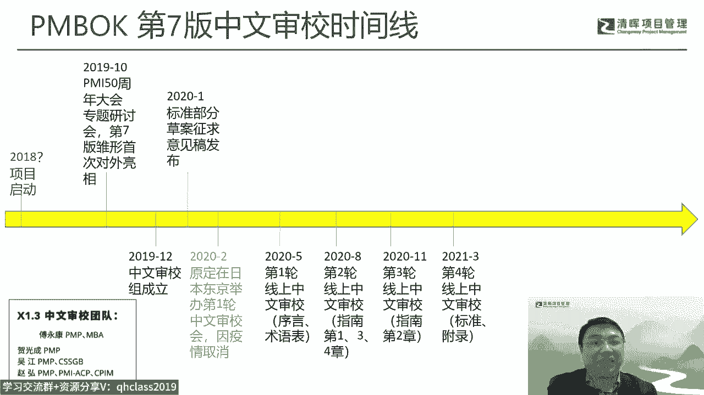

我们基本上是要呃一个月左右啊，就是每天晚上就就就得被固定，起码两个小时在做这件事情，其实还是花了，反正那那两年是花了大量的这个时间，都都都都在这上面呃，其实线下呢线线上的这个审稿其实有问题的。

就是很多东西他还是还是不能面，跟面对面没没法比，还有一点呢就是因为我们都是分段来深交吧，所以直到这个这个这个这个怎么说呢，就所有的段我们都都审完了之后，其实我们还缺一道什么叫叫全文的通稿时讲。

所以我们后来也争取了一个机会，所以在15年的啊这个啊21年的5月份，然后在北京p mi的办，中国中国总部办公室封闭了一周，专门来在那边做个前文通告审教啊，其实这个通告省交之后。

其实我们还是期待他有一个在印刷版之后，能够给我们在一个再一个过的一个关，结果这个实在等不及了，那8月份PMI就正式发布了他的英文版呃，应该差不多，同时也就发布了这个当时的中文版。

所以我们现在国内能见到的电子版的中文版啊，这个这个呃呃这个我这个其实是啊，当然这个店子吧我就不去评论，但是实际上是是差不多是我们那次全文通稿，神教之后的这么一个版本一个版本啊。

后面呢我们还是争取了两次的这个，这个继续深交啊，8月份呃，然后呃去年的3月份啊。

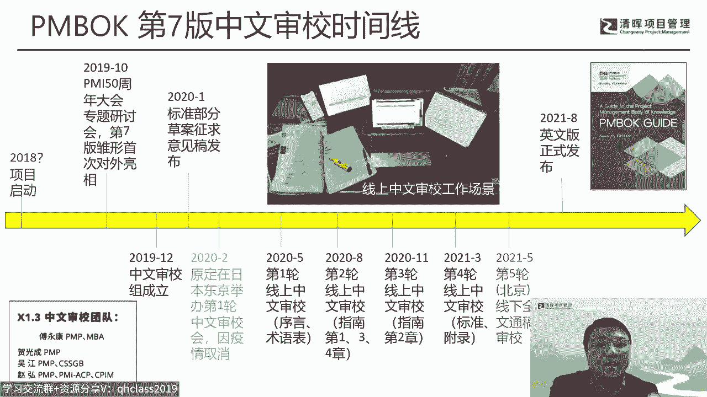

然后最好，但是让实际上怎么说呢，这里面还有一些其他的故事就不展开了，这个直到去年的10月份，这个中文版就正式引进啊，因为过去来说pm的PBOOK它都是电子工业出版社，在国内呃这个发脾这个这个印刷发行。

但是现在我们呃这个规则改掉了啊，这PMI反正也是变革，变革是加在一起，就把这个这个事情也变掉了，所以他现在实际上是美国的发行，中国的引进啊，所以我们现在真正拿到的这个这个书呢。

严格来说是一个美这个美方的这个，这个牵头来来印的一个书，而不是我们中国的国内出版社做的事啊，所以这个呃还是会有很多的一些一些，一些一些怎么说问题的啊，那第七版的我觉得有几个词，有几个术语也可以说一下啊。

就是因为作为一个标准吧，标准的它的一个最底层的一个呃，怎么说呢，这个这个从专业专业的一个角度来说，它其实就是术语啊，所以术语表呢是决定了你整个行文的这个一个，基础的啊，但是实际上这个术语呢来说呢。

在过去的呃几个版本里面的，都是都还是存在一些不一样的地方啊，比如尤其几个关键的术语啊，比如说像干系人这个术语啊，因为呃这个就就说来，又是一个一个非常非常长的一个故事啊。

这个因为因为早最早的是叫利害关系者啊，后来几呃几个版本是叫干系人，然后到第六版呢，就是反正也是也不知道咋的，怎么变成了相关方啊，所以实际上这个就引起了很大的一个一个，争议的问题啊。

所以相关方还有还有下面这个效益收益这个词，这两个词实际上在当时争议非常非常大，那那从我个人的观点来说，我是一直还是认为干系人士比较适合，是和中国的这个，尤其是PMI在中国的这个发展的啊。

所以我是一直非常立足，用干性人这个译法，因为确实管理这个stakeholder，你需要对到人啊，相关方的这个方在中国，其实方的理解很多时候就是一个部门对吧，那你你管一个干净的，你管到一个部门和管道。

一个具体的这个部门的负责人啊，这个，那那这种管理的这个颗粒度是完全是不一样的，对他的单系人管理的有效性，也是完全是不一样的，所以这个当然还有很多很多其他的这这一块啊。

所以实际上为了把这个相关方改改回干系人，我几乎花了一年时间啊，在在我20年的这个从进入到这个这个，这个这个这个神教主啊，那到最后达成一致达成共识，然后把它改为干系人，这个花了一件事情啊，这个这个对我。

但是我觉得是非常有意义的一件事情啊，啊另外一个词呢，这个这个也是我们这是一个很大的一个变化，就是outcome和这个deliverable这这这两个词啊，因为我们过去传统来说，这个可交付成果。

这个也是约定俗成的一个词啊，那问题是result和这个outcome，在过去的所有的版本里面就一直就没有区分啊，其实这两个词是混用啊，所以翻译的这个意思想到用成果就用成果，想到用结果就用结果。

所以他其实没区分它的意义，但是问题是在第七版就不能这样混在眼，因为第七版它对outcome，它是有非常非常明确的定义啊，也是一个一个核心的词，那那你这个词就必须必须要考虑到。

它和这个可交付成果之间的冲突，因为大量的句子会出现这个这个怎么说呢，交付可交付成果和成果，那这个就没法理解了哈，所以在这种背景下，我们把这个可交付成果改为交服务啊，这个也花了一点。

花了一点时间去去去去做这件事情，那另外我觉得有一个花时间的词，是这个stewardship啊，因为这个词呢实际上是第七版的一个核心词，那么第七版在12原则里面第一位啊，就是stewardship ep。

那实际上这个词呢反映的其实是是，我觉得是第七版的，它的一个很重要的点叫可持续发展，或者说或者说针对这种呃叫社会责，社会责任啊，这个这个他的他这方面的一个考虑，所以他特别用了这个词，那但是这个词呢。

因为中间还有一些其他的译法啊，但是怎么说呢，这里面我们还是要精益求精嘛，啊所以就针对他到底最后用哪个词啊，确实也花了一年时间在研讨啊，最后定下来是用这个这个管家精神啊，所以这点我还是比较欣慰的。

因为管家精神我觉得在中中文里里面，精神这两个字其实都是很正向，很积极啊，他能就怎么说呢，能够代表一种价值观的一种一种词啊，我觉得这种词其实应该是要多用啊。

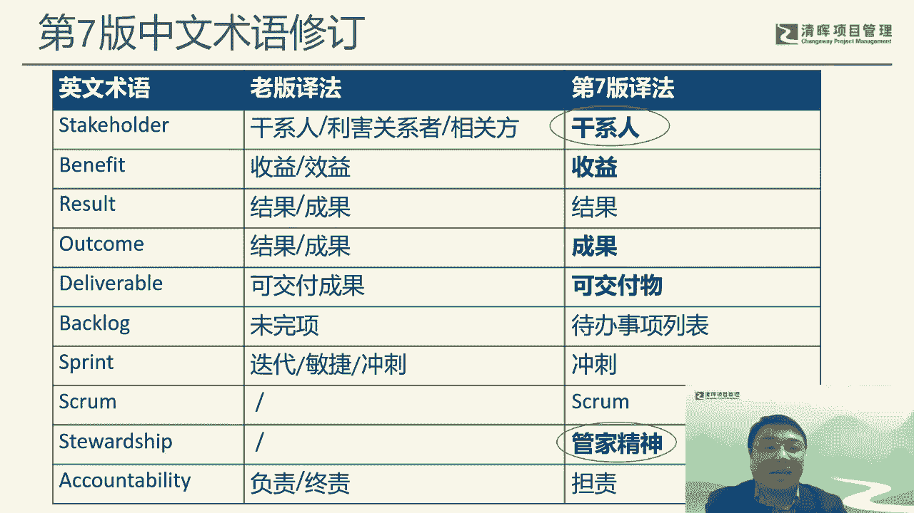