# 1.PMBOK第7版解读：项目管理新趋势 - P2：2.第7版核心内容与项目管理发展趋势 - 清晖Amy - BV1Km421u7UQ

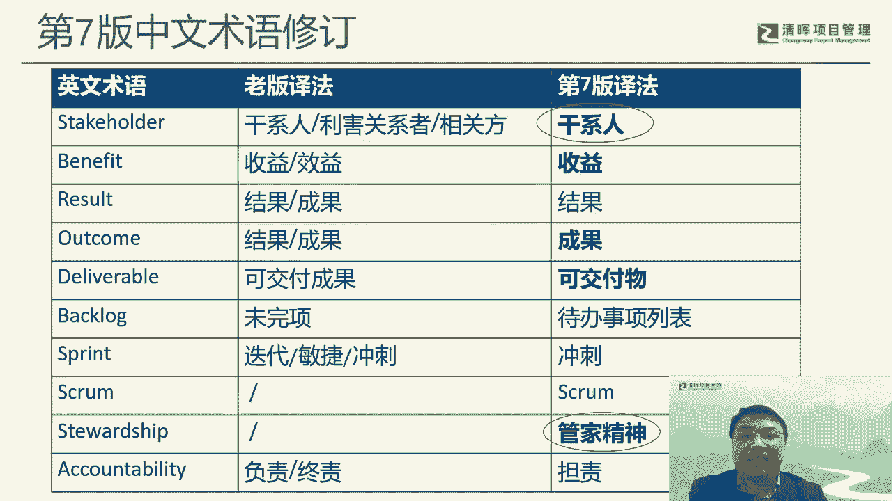

那前面介绍一下背景之后，那接下来就重点说一下他的啊，咱们这个核心的一些内容吧，以及这个我自己对项目管理的一些一些，趋势的一些理解啊，但当这个这个纯粹是一家之言呐，这个理解的东西。

因为每个人会有不同的理解，所以所以我想这个还是出国自身的一个角度啊，或或者说某种程度的代表清微。

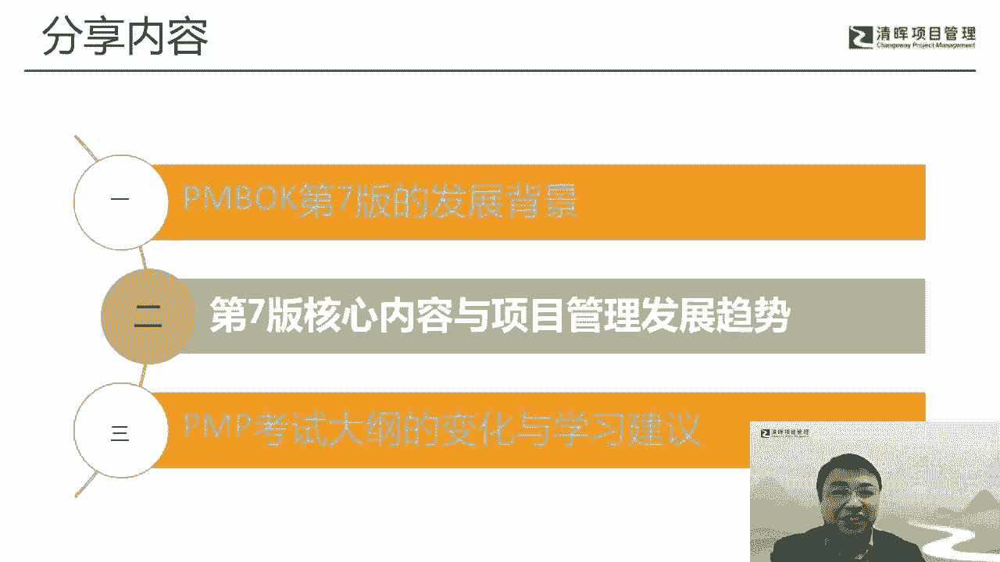

来来做一些相应的解读啊，呃首先我们看这个PMBOK，它现在PMBOK呢其实从他的大封面啊，这个里边呢它其实有两个小封面，那两个小封面对应的，这个这个PMBOK的两大核心部分。

第一部分呢大家看一下左边这点，他名字就叫项目管理标准呃，注意他左下角的这个标识，ANINGANING呢是什么，是美国国家标准标准协会的这个这个这个标识，他必须是要有这个NC这个标志啊。

这个才能才能被认定为是美国国家认可的，一个一个官方的标准啊，如果是没有这个标准的，只能算是意见，也是一家之言啊，你没有得到，这个就是美国政府层面的一个一个一个一个。

或者说这个行业的这个一个一个一个认同啊，所以这个标准的尽管说PMBOK做了很大的变化，但是最终他还是拿到了这个标准，说明最终他还是获得了这个这个标准的日子，当然这个某种程度来说，这个也是不容易的。

因为因为因为从他这个原型的发布对吧，20年的1月份到他，最后，我至少我我我们从中国神教主拿到了他的，这个这个正式的文稿来说，其实中间过了一年啊，所以在这一年中，我相信很多的时候。

可能就在做这个美国国家标准协会的，这个这个这个工作的啊，你怎么要拿到这个标准。

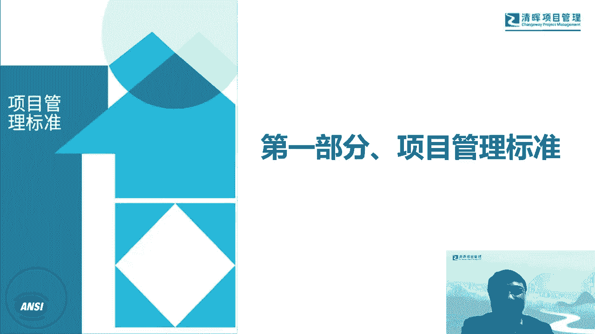

这是不容易的，那在这第一部分里面，其实主要是谈的是叫价值交付啊，这个事情啊围绕价值交付，我需要建立这个12个原则啊，所以价值交付呢，当然这里面这是PMI的一张pm里面的一张图。

他这张图呢其实我们还是似曾相识的，因为在第六版里面其实有类似的一个图啊，类似的图，但是它主要是描述的是项目的一种环境啊，但是整个环境来说，在第七版里面，它是侧重于叫所谓的价值交互系统啊。

所以围绕价值交付，我们需要去做相应的项目组合，项目，企业项目以及运营方面的一些工作啊。

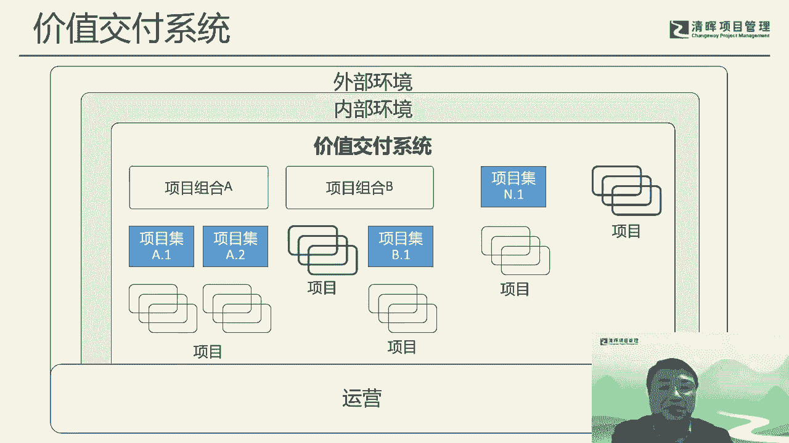

但是在做这个项目管理的这个工作里面，其实它的核心是所谓的12原则，12原则，那12原则里面的话，这里面其实我们是需要去去逐个的去看的，因为从学习的角度来说，你这里面都不能跳对吧，就是他既然列了12个。

你就得得对每个要去要去理解和领悟一下，但是为什么是这12个，不是另外一有一个其他的什么的，或者是三个是四个，或者说这12个里面会不会有其他东西，那这个我觉得我们就不去深究了，因为这就是最终的结果。

最终结果，当然这个过程肯定，他是也是做了一些所谓的专家选择啊，这专家判断啊，这做了很多的研讨啊，这这个是这些这些工作肯定是也是必须的啊，但最终给我们的结果，那就这12个。

说明这12个还是经过经过他们精心选择的啊，那从呃因为时间有限。

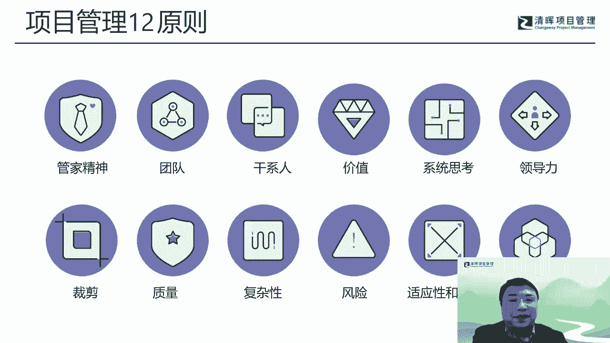

我这个今天晚上我就不多去解读这个，它里面的内容，就大家可以看一下他的这个结构啊，那这个这个这张表呢，实际上是他在每一个每一个原则的，这个从他的文字角啊对吧，从他的布局角度来说。

一开始他就会出现这么一张表啊，左边是对他的一个解释啊，右边的相当于是对它的内容的一个展开啊，他就起码当然再下面就是他的正文，当正文也都是围绕这个主题啊，这个这个原则来进行描述的一些一些内容。

当然这些描述的内容呢这里面其实也要看的，因为有些对我们来说是比较熟悉的，比如说有些内容，它会涉及到我们过去第六版或者敏捷里面，都很多常见的一些内容啊，当然有些就比较新啊，比较新，那比较新的话。

对我们学习和理解，其实就就就会产生一些障碍在里面的啊，所以我们其实还是要去要去看他的一个，怎么来说这件事情，比如说这个管家精神啊，要成他的原注意原则，它是是一句话啊，当然我们其实通常来说。

是把它提炼出一个核心词啊，就体现出一个核心词来来描述它，因为一句话其实很难去记这么一，这么长的一句话，尤其是二句话放在一起没法记啊，所以我们实际上是用它的核心值或者它的标签。

标签词来来记这个这个这个原则啊，那第一个就是管家精神，管家精神更多的是考虑到就是说项目经理，或者说项目管理整理，必须要有所谓的管家精神啊，当然具体来说就是具有这种政治啊，关心啊，可信啊，合规啊。

这种这种意识啊，以及在你的这个做项目的时候，你要考虑到所谓的财务，社会技术和可持续的环境意识，所以这一点来说呢，就是它和我们现在所所要求的这种也是G啊，或者说可持续发展啊。

这个它就有很强烈的一个一种对应关系，那另外从从这个职责的角度来说，因为过去我们谈这个项目经理，他和比如说和发起人和组织来说，它其实是一种所谓的委托代理关系，那委托代理关系。

下面的这种对于这个职业经理人的，你的这个他的这个职业道德，职业操守来说，他其实是是怎么说呢，就其实他这里面是是，是要通过一种关系来约定的，这种通过契约啊，通过这种合同啊，契约来来给他约定或者制衡的啊。

那这种某种程度，通过这种这种和契约的关系来约定，和你自己去主动去承担，所谓的这种主人翁的意识啊，这个还是很不一样的啊，管家精神某种程度来说，更多强调的是我们自己要有这种觉悟的意识。

这个这个能够超越掉一些所谓的契约关系，委托代理关系啊，能够能够更好的去为组织啊，为这个社会考虑啊，所以他实际上对对人提出一个很高的要求啊，这个可能也是未来对项目经理的一个，一个更高的职业要求。

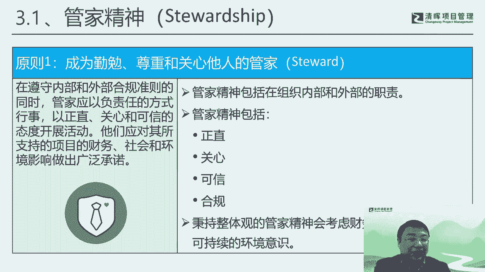

团队呢更多的是是他强调的是营造写作的项目，团的环境，他会有一个解释，然后包括这个项目的这块内容的一些展开啊，这个他都会都都会进行一些描述，但唐团队呢因为在我们呃这个这个第六版来说。

我们更多强调的是这个怎么说呢，是这个叫资源管理，人力资源管理里面，我们会很强调这个这个团队的管理对吧，那这个他是把作为一个资源来说，但在第七版里面有更多的，我觉得还是要用一种他是所谓的自组织，只管理啊。

他其实会会把一些敏捷的一些思想，带入到这个整个团队文化里面，所以他需要建立自己的一些本地的一些文化呃。

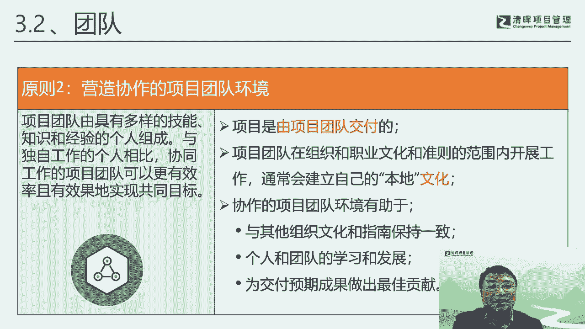

干系人呢，这个是我们项目管理的一个很重要的一个词啊，stakeholder啊，它是需要有很很有效的这个干性能参与，来做这个做这个项目啊，呃价值啊，价值呢，这个是是我们这呃第七版的一个核心的词啊。

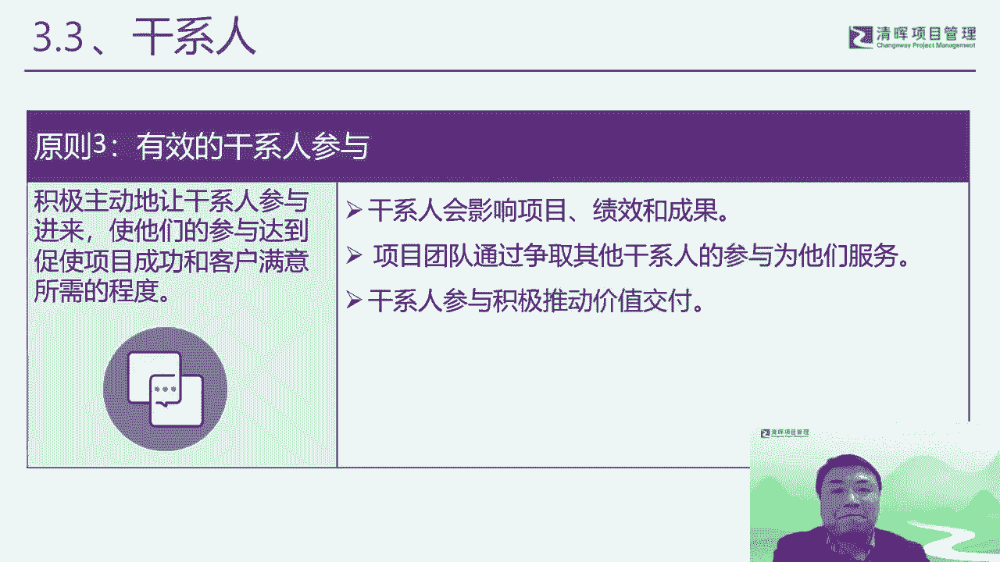

就是它它里面特别强调，价值是项目成功的最终指标，最终指标啊，当然为了达成这个价值，就是说你不光是说只是交付，所以他还是需要考虑到这个成果，考虑到受益啊，最终才会达到这个价值。

所以它是有一个逻辑关系在里面，但这个逻辑关系最早是在这个叫收益实现，管理指南里面，他会会做描述啊，然后整个第七版里面，实际上是把继承了这个这个观点。

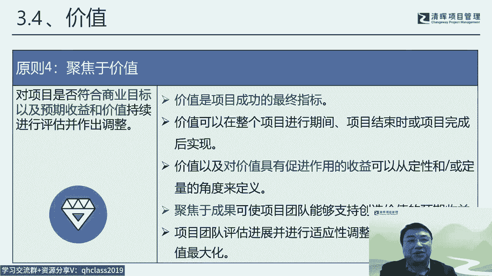

另外一个是系统思考，就是作为管理者来说，因为做项目他不是一个独立的事情啊，他是涉及到方方面面，所以它必须要有系统的整体的这个这个角度，去考虑他的所有的这个项目管理项目的要素啊。

然后通过对项目的整合来获得他的一个成功呃。

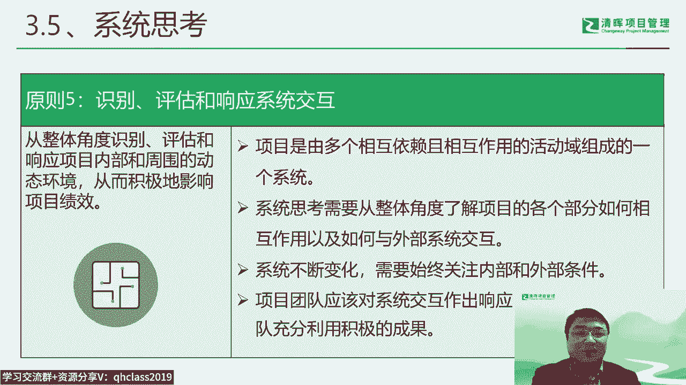

领导力，那领导力这里面也会特别提到，相当于这个领导者的一个作用啊，对于一个好的项目经理，不光是说管事，你还得还得怎么做呢，也你叫所谓的带领团队，带领团队，当然这个带领团队最核心的一个词。

就领导力的那领导力，你需需要让你的团队来追随你啊，或者至少你能够影响到你的周围的这个，干系人啊，所以这个从这个方面来说，就是这个这个对领导力就提出一个特别高的，一个要求，当然领导力也不是一成不变啊。

所以会引出这个所谓的情境领导风格啊，这个我们在第九版里面会看到的，一个一个一个内容啊，呃另外裁剪，裁剪这个任何项目都需要去做裁剪啊。

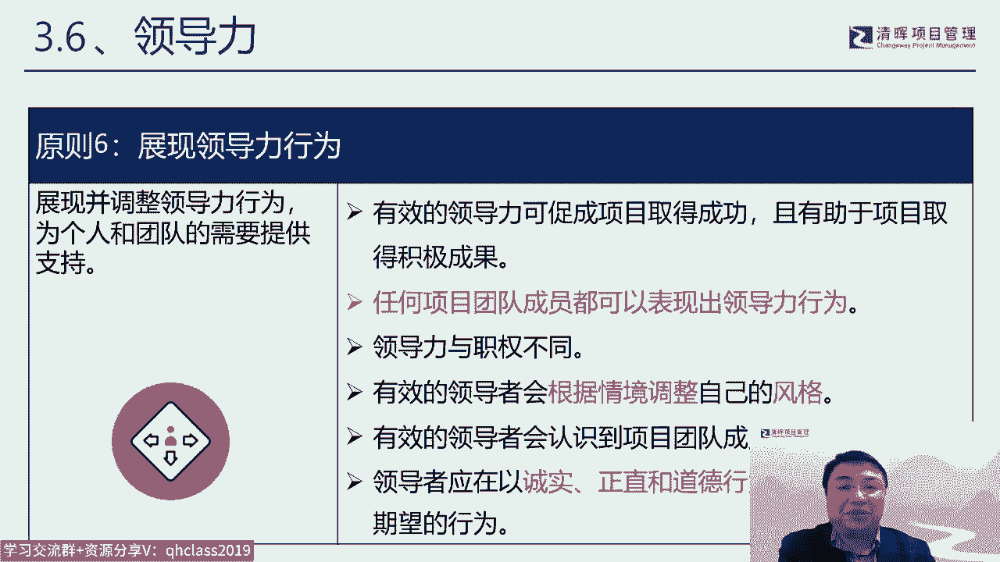

这个因为方法论都是一个相对大而全完整的啊，但是具体的用，必须要进行相应的一个量体裁衣啊，来来来做，然后质量啊。

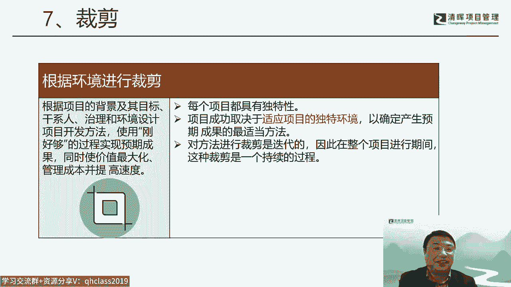

这里面也特别强调所谓的叫内建质量，因为质量呢他不是说等你到最后检查的时候，你才来去去去看到他质量质量，它其实按照我们过去来做质量三部曲来说，其实他是应该从前期规划对吧，执行到控制啊。

然后他其实在全过程里面都要考虑到质量，所以质量呢它是一个不是一个检查出来，它实际上是一种会计划出来的，是一种是一种设计出来的呃。

然后复杂性，复杂性呢也是是我们项目面临的一个呃，很重要的一个环境，这个环境呢，其实就是无卡时代的一个典型的特征啊，在乌卡时代我们就面临着一个复杂的环境，所以我们需要去了解这个复杂性的一个来源啊。

同时呢我们也要去了解复杂性的一种应对啊，所以所以这个对复杂性要有一个理解啊。

风险啊，风险这个这个在是我们啊，PMBOK第六版的一个十大知识领域之一吧对吧，所以在在第六版里面，其实它是完整的介绍了整个风险管理的全过程，但是当反而在第七版的，其实他虽然提的风险多。

但是其实他真正的在细节方面，其实他并没有展开啊，所以所以这一块呢我们像这里谈这个优化，风险应对，其实更多的会对应到我们第六版里面谈的，那几种叫机器风险，消极风险的这种不同的应对措施啊，应对。

但是很重要的一点就是说应对措施，你需要需要跟这个周围的环境，或者说跟项目的这个这个这个这个状况啊，需要结合起来啊，不是说只所以他在这种各种备选方案里面，你需要找到一个有效的一个。

更加具有这个成本效益的这种这种应对方案，然后是接下来是适应性和韧性，适应性和韧性的，这个也是所处的一个典型的一个环境。

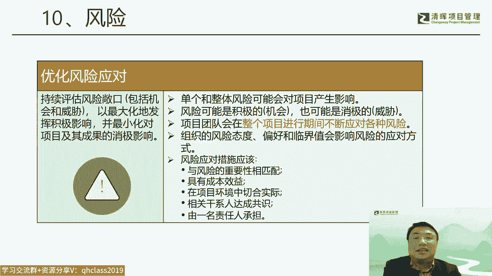

当然无论是对人也好，对组织也好，对项目也好，其实都是需要具备这种适应性和韧性啊，啊至少对人来说，比如说人的这个逆商啊，就是一个很典型的跟韧性是是有关的一个词，所以所以从这个从啊像我们团队来说。

他不应该去害怕这个这个这个这个外部环境的，这个，这个，更多的，他应该去拥抱这个所谓的适应性和和和任性，那某种程度来说也是一种拥抱变化啊，这个这个呃这个怎么说呢，这个叫叫叫克服挫折啊，需要需要有这种精神。

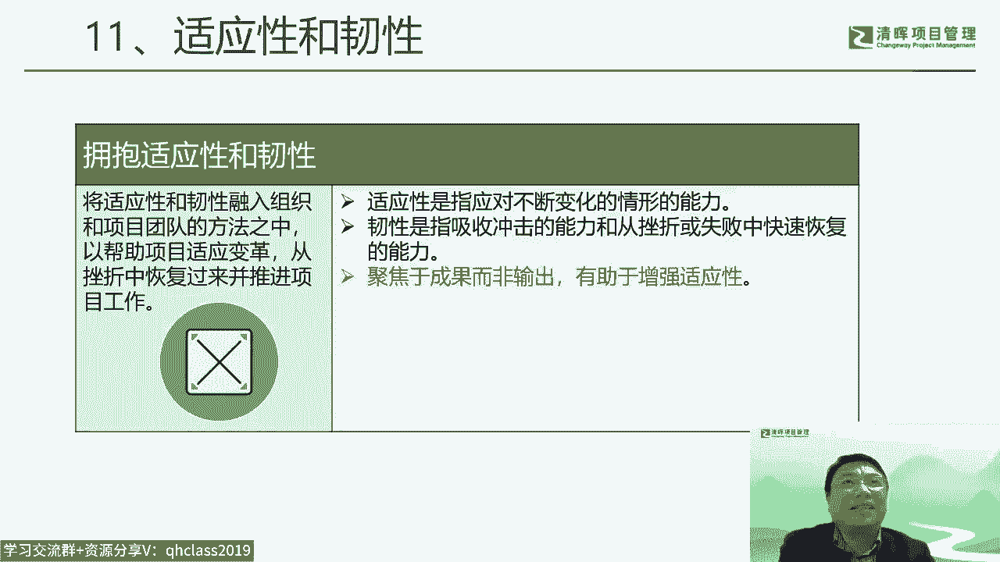

呃最后一个原则呢叫变革啊，这个这里的变革呢，其实主要是针对组织变革而言，因为我们知道项目它是呃变革，实际上某种程度来说它是项目的来源，是因为组织要变化，所以才会有项目啊，如果一成一成不变的组织啊。

这个一成不变的环境，我们就无从谈起这个这个这个项目的啊，按照过去我们理解，那就是一个运营的环境，就不是一个项目环境，所以所以对项目管理者而言，这个变变革，其实是它的一个这个生存的一个根本啊。

正是因为有变革，我们才会有项目这个职业啊，我们才会去去去去让这个世界变得更加美好啊，所以这个变革这个怎么说呢，会让我们走到一个未来的一个更好的状态，但这个状态就必须我们要用这个项目和项目。

管理的这个这个能力去做相应的准备啊，好那前面讲了12个原则啊，因为也不展开对我，但是呢就是怎么去理解这12个原则。

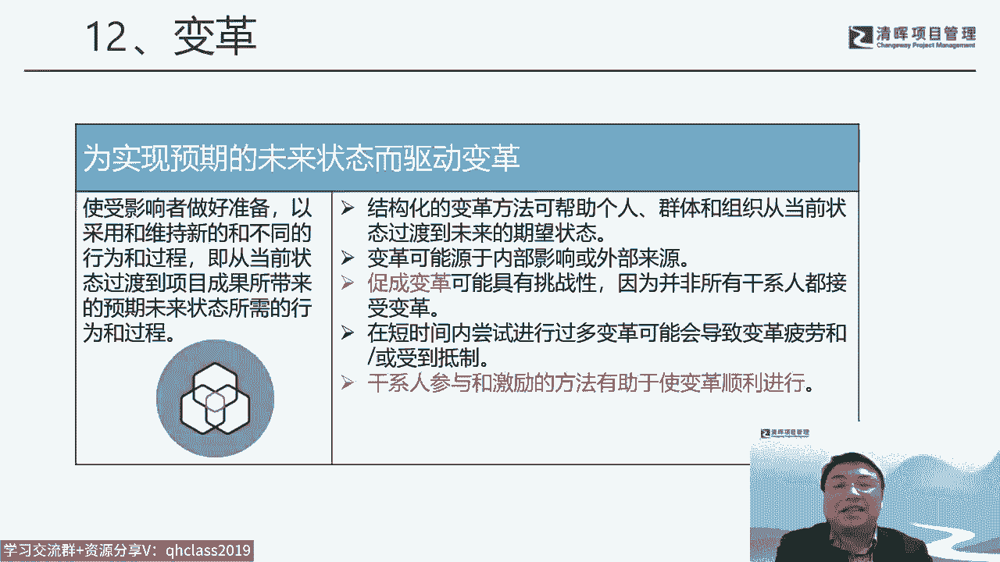

那我觉得这在这里也可以给大家做个分享，其实这个这个总结是是，我第一次给华为做分享的时候，其实就把这个框架提出来啊，因为在当时来看的这这一块呢，也呃也是也是相当于是个人的一个想法。

但是但是呃过了这几年回过头来看呢，我觉得这个想法应该还是还是没有错的啊，这至少我自己觉得，这个当时的总结应该还是到位的，就是就是我们是要做一个逻辑上的理解啊，否则上是12个原则，你摆在面前。

这个没有没有归分组，没有归类，其实你不大，首先是不太好记，第二呢，就是说他到底对项目管理的，哪些方面会产生影响，其实也是不好去做判断啊，所以做个做个分组，做个分类，我觉得对于我们理解这个原则。

理解他对这个这个项目管理的，这个它的一个影响和作用，我觉得还是还是有必要的啊，那这是这是我当时的一个分类，就是其实这里面12原则呢，有几个它其实是可以归为一组的啊，管家精神，团队干系人，还有领导力。

那他的一个共性之处是什么，都是跟人有关啊，都是跟人有关，都是对人而言，那另外四个呢我们看系统思考这个质量风险啊，还有裁剪啊，那这四个原则呢，是让它里面其实背后都是跟什么有关的，都是跟过程有关啊。

因为系统思考它是一个整合的，这个所谓的相当于要把那个那个叫40，九个过程吧，五大过程组，十大知名全部整合在一起，它其实这就是一个系统思考，裁剪也是一样，对过程对所有的工作，其实你要做裁剪。

那质量和风险本身就是在这个这个我们的这个，十大知识领域里边，所以所以这里面它都是有相应的这个过程，和这这个来体现的质量过程，风险过程啊，那另外几个词啊相对来说更加抽象一些价值啊，这个复杂性。

这个适应性和韧性以及变革，其实他的这几个方面的相对来说，他是站在一个更高的一个这个这个角度啊，去看项目，去看组织，所以他其实所对应的其实更多的是这种，所谓的商业环境啊，或者说有时候会把它说成业务环境啊。

其实这是一个意思啊，那所以人过程商业环境，使得我们可以对这12原则做一个做一个归队，做一个做一个分组，那当然背后的逻辑是什么，因为人过程，商业环境是我们偏僻考纲里面的三要素啊。

所以我们偏僻考试其实现在都叫3A3A嘛，对吧，现在因为这两天出成绩，很多人拿到3A非常开心，那就是因为他在人在过程，在商业环境这三个这个所谓的预里边，这个考试语里面他得到最好的成绩啊。

所以实际上实际过程里面，其实也是可以按照按照这三个这个考试的，这个域啊来做一个做一个理解啊，好这是12过程，那接下来我们看下下半部，下半部呢讲的是这个叫偏布的指南啊。

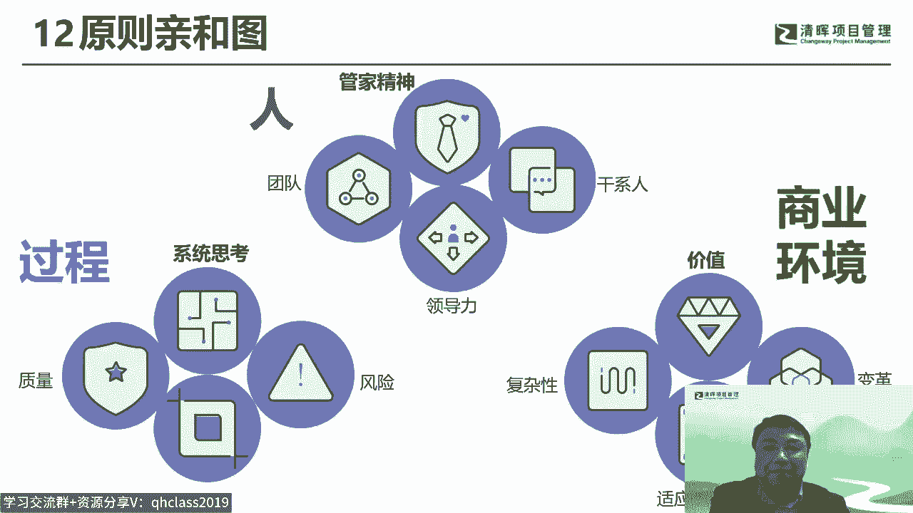

所以我们看左边这边，他的项目管理知识体系指南，所以他这个左下角这里面它有一段注释啊，这个注释注意，这里面的注释呢其实只有跟我们第一步相相比，什么他没有C那个标志的，正因为没有标志。

所以这里面他就必须要一段说明，说明什么呢，说明这个病这一段的内容，并不是经过美国国家标准协会给认可的，这个或者说官方认证的，这个这个那个这个只是仅代表PI啊，自己的这个这个这个专家说专家的意见。

那这个意味着什么呢，意味着是让这一块的内容的写作，它实际上是PMI相当于他的写这个这个专家组，编委会，专家组自己内部这个工作的产物，它其实并没有完全像那个我们前面说的标准，它在20年1月份。

他有一个对外公示的整个过程，实际上他并没有一个对外公示的作用，当然在19年研讨会上，他是有个研讨过的，但是他并没有所谓的公众的那种那种公式啊，所以这个也是叫标准和这个指南，这个很大的一个区别所在啊。

所以为什么这里面没有NC标志，当然这个这个大家就就还是要要要把它的内容，和那个所谓的前面的原则啊，要给它区分开，他有这么一个一个一个说明性的文字啊，大家了解一下，那下半部分呢其实核心呢是八大绩效率啊。

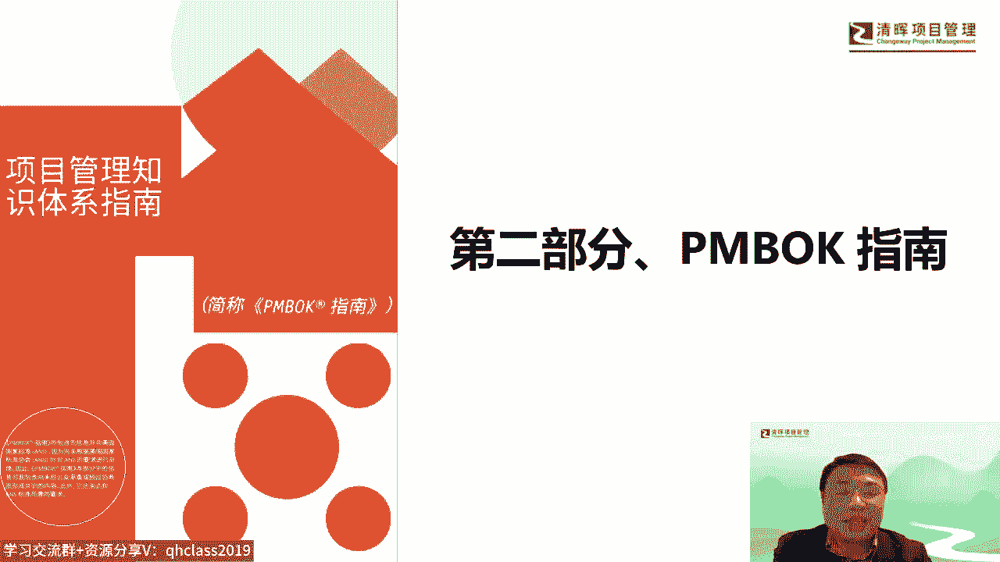

这个当时拔了就要去外面，我后后面还有裁剪呢，还有什么模型方法和工匠，但是它的最最核心还是这一块，那所谓的八大绩效益呢是指的是干系人团队啊，以及这些这个这八个技效益，那它和原则的关系是什么。

那PMI有一个说明叫原则指导行为啊，所以我们后面的这些八达西教育的，这个所做的事啊，它实际上是去上面的原则来进行一个指导的啊，所以他的比如说干系人管理，我们可能就要参考到比如干系人啊，或者团团队啊。

领导力啊，那些那些原则啊，这些原则会体现在我们这个干系人的管理的，这个这个这个具体的活动里面啊，具体事情里面，所以所谓的绩效益，它是一组对有效地交付项目成果，至关重要的相关活动。

当然这些活动它是受受这个这个原则，所所所所指导啊，啊另外呢这呃书上呢也特别呃，说的一段一段话啊，叫本版指南关注交付成果啊，注意这位交付成果这个成果是outcome啊，不是be livable啊。

不是那个可交付物啊，所以这个这个关注成果，而无论项目团队使用的方法啊，无论是瀑布还是敏捷，那就意味着我们这一版的，其实他没有刻意的去去强调说，我到底是要用瀑布还是要敏捷，其实他都把这个瀑布和敏捷。

都包含在他的这个手，所谓的这个这个方法里面啊，所以它实际上是一种具有更高的一个叫包容性，的这么一这么一本一本指南啊，呃干性能技效益，这个我们呃内容呢它也是有它的规律啊，注意他这个每一章。

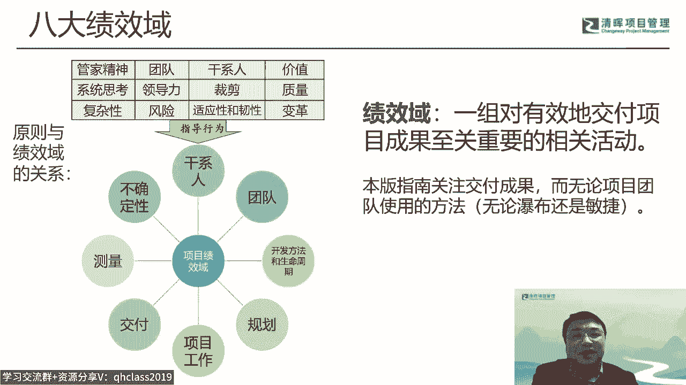

如果如果大家有时间，可以去看一下这个这个呃这个指南，那这个指南它每个季效率，它其实开篇啊，就是左这这张表格的左边这两个定义和成果，它会会作为一个开篇的这么一个一段文字，那在它的收尾结尾呢。

会有一个成果和成果检查啊，就就是右边的这两这两竖格啊，这两列啊，所以这样它会形成一个叫首通，通过成果来做一个首尾呼应的这么一个内容，当中间呢它就有这个本季效益要开展的，各种所有的活动啊。

他会做相应做相应的展开和描述啊，但是因为我们今天时间有限，就不不不去展开啊，这个这个那学习或者上课的时候，我们会会会稍微再再适当的展开一下，这一块的内容，那第二关呢是团队绩效与。

团队绩效应强调的是跟团队有关的，当然这里面成果我们可以看一下共享责任，高绩效团队啊，团队成员都要展现出这个相应的领导力，那对于这个这方面的成果，那我们就在在在工作的，比如说中间。

或者说这个或者或者结尾做总结的时候，我们就要做相应的一个成果检查，我到底做到没有对吧，我到底有没有建立到这种共享责任，到底有没有建立到这个高校的这个高绩效团队，对吧，到底到底有没有展现出证明道理。

我们可以根据一些方法测量手段啊，所以我们会有一些他有专门有个测量及效益啊，专门来怎么来测量这些成果啊，他会不会得到一个体现，那第三块呢是关于这个开发方法和生命周期啊。

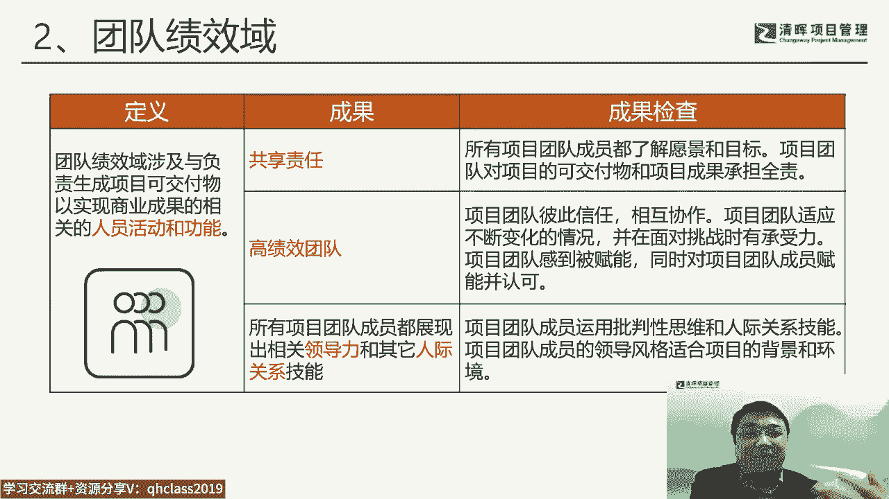

开发方法和生命周期呢，其实这里面主要会谈的就是，我这个项目到底要用哪种开发方法，当然这种开发方法我觉得很重要一点，就是它取决于环境，它跟环境是有关的啊，我到底是在一个是在一个瀑布的环境。

还是在一个敏捷的环境，是在一个变化的环境，还是在一个稳定的环境啊，其实这种不同的环境，它会影响到这个对开发方法和生命周期的，一些选择，会有一些选择呃，生命周期的连续体啊。

这个是是第七版里面专门画了一张图啊。

这张图呢其实就是给我们展示从预测到适应啊，就在这个所谓的连续体，或者我们有时候叫频谱啊，那在这个这里面啊，这种呃生命周期的这种它的不同的一个形态，实际上这一块呢，在第六版其实也做了相应的描述。

当然可能没没画这个像第七版这么多篇幅啊，那其实无非来说我们对应的也就是瀑布啊，或者所谓的预测型啊，增量型，迭代型，还有到敏捷这种适适应型，那其实大类来说，我们基本上这四大类啊。

只不过这四大类在整个这个频谱，或者说这个连续体中，我们所占的比重啊，它有从低到高啊，从大到小，这样它会有不同的这种这种这种体现啊，所以所以在这种在这个连续体里面，我们到底选择哪一种。

这个这个生命周期到底是用敏捷的方式来开发，还是用普通的方式来开发，实际上还是取决于它这个项目的特性，以及这个项目所处的环境啊，来来做相应的一个选择，然后是规划绩效与规划绩效益呢。

实际上主要是对应了我们的这个第六版的，这个怎么说呢，叫五大过程组里面的启动和规划啊。

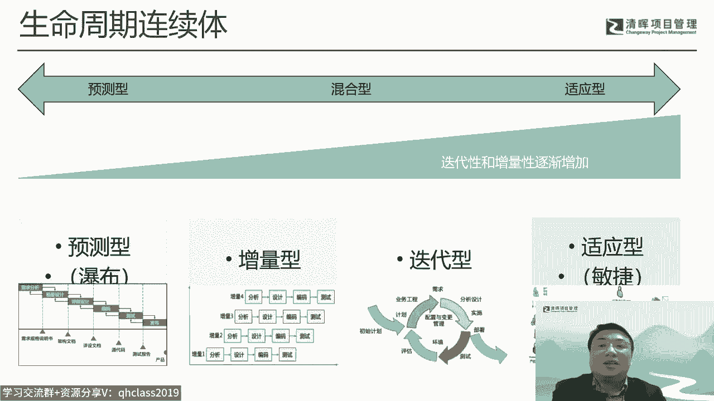

作为启动是在这个规划绩效一里面啊，因为在在第七版里面，没有专门的启动这一这个这个这个生命周期，或者说或者说这个这个过程组啊，所以启动的工作，其实它是并在这个规划里边的啊，所以所以相应的一些启动的工作。

以及所有的这个规划相关的工作，我们其实都在这个绩效一里面，都基本上都是能得到一些相应的一些体现的啊，然后项目工作绩效应呢，它其实主要对应的是我们五大过程组里边的，这个这个叫执行过程组。

以及这个叫变变更控制流程啊，以及这个这个这个整体变更控制流程，那个那个这个过程啊，这个过程，所以所以它的工作的内容，我们可以对应到这个这个，比如说这个这个沟沟通对吧，比如说质量，比如说采购啊。

这这这这方面的这种叫执行过程组里面的，这个工作，以及这个知识管理以及知识管理，那同时呢我们也要处理变更，处理变更，所以主要是这方面的一些内容，然后交付绩效应呢，交付绩效应。

因为在这里面谈的交付主要是交付，这个叫这个可交付物对吧，那可交付才才会进而产生相应的成果，以及收益啊，所以交交付的第一步，其实我们要产生出这个符合质量要求的，这个这个所谓的可交付或者说范围啊，这范围。

所以它对应的内容主要是什么，是范围和这个质量啊这两块内容，那这两块内容最这两大知识领域，最终会使得我们形成让客户满意，就是客户能够有效的验收，或者说客户满意的这么可笑服务啊，它是形成这么一个产物。

然后第七呢是测量，那测量呢主要是对应的这个，我们过去第六版里面的，这个叫叫这个叫监控过程组，那因为所有的工作其实在偏偏不，所有的工作来说，其实我们都还是要符合，一个叫我们称之为叫PTCA的。

这么一个这么一个逻辑的，因为PTC是我们基本的管理逻辑啊，所以有计划有执行，有这个检查，那从检查角度来说，其实就涉及到测量这这这个工作了，我们需要对我们的进展的情况对吧。

项目的这个甚至包括我们干系满意度啊，这个都要进行有效的一个测量啊，那最后呢是不确定性，绩效益不确定性绩效率呢在PMBOK第七版里面，主要是两块内容。

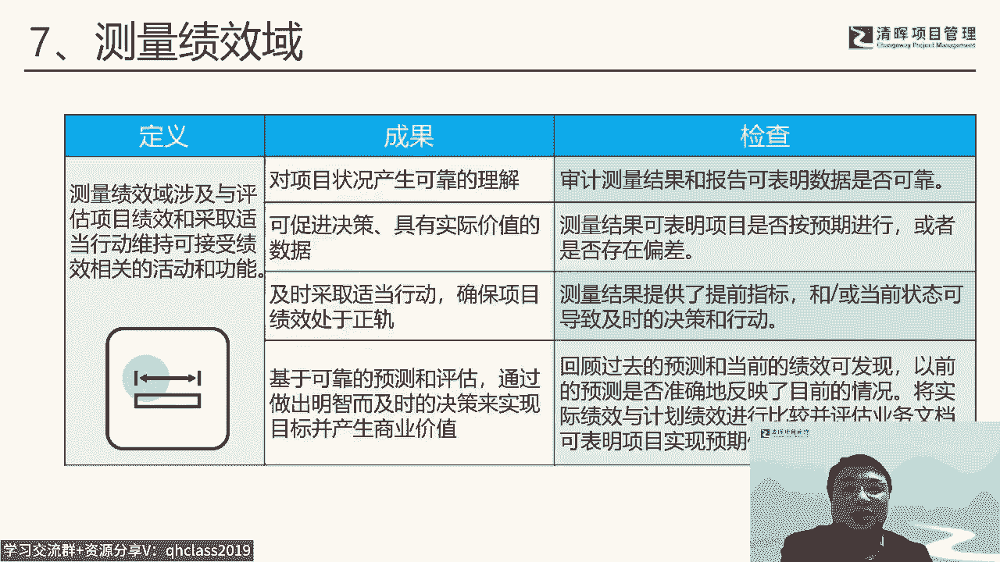

一个是对无卡啊，就是我们前面特别强调无卡是无卡时代，对五卡里面所代表的四个词，这个不确定性对吧，这个异变性模糊性，这个复杂性它是需要做一个展开啊，做一个展开和解释以及应对以及应对。

所以这里面占了他很大的一块天赋，另外一块呢其实就是风险管啊，就是风险管理，因为风险管理的风险的这个来源，就来来自于不确定性对吧，那怎么有效的去管理风险，那这个实际上在无论是在呃在骗，不过第六版也好。

甚至在第七版也好，其实管理风险都是非常非常重要的一个内容，因为项目成功当然我们靠计划就就可以来的，但是但是万一有有些东西跟你计划的，或者说你预想的不一样，那这里面就会构成一种一种风险啊。

这种风险那会就会容易导致项目的失败啊，所以我们需要有效的去管，管理好这种不确定性啊，讲完这个八大纪效益呢，这里面也给大家总结一下，就是这个我我个人对这个八大纪效益的一个，逻辑关系梳理啊，因为说这块呢。

我也看到外面也有一些其他的一些一些解释啊，但是这个我还是觉得，因为PMBOK没有给出官方解释啊，他偏不可，无论写原则也好，还是写绩效也好，他其实都没有去排序，也没有去归类啊，也没有去去讲。

去去更更多的去展讲述他们的逻辑关系，他只是讲八大街交易之间会形成相互的影响，那从相互影响来说，那这个彼此两两之间都会有影响啊，这这里面其实是一句空话，那无非就是说我们要怎么去去更好的去判断。

这个八大区效益之间，它到底应该是一种哪种的逻辑或者说框架啊，这个对于我们学习的理解，这个就显得非常重要了啊，至少我们在在沟通这八大街交易的时候，就有一个有一个说法啊，所以这一块我我当时啊3年前呢。

其实也也也做了一个整理啊，但现在来看我觉得也还是还是不过时的啊，应该还还是可以服务，至少我自己还是能够呃能够接受，或者说我自己能够认同的这么一个梳理啊，这个也也给大家分享一下，那首先呢我们做项目。

其实首先是还是要看它的一个整所处的环境嘛，对吧，那所以这个不确定性，那不确定性它是有高有低的啊，这个高峰高不确定性和低不确定性，它其实就代表了这个不同的这个，这个生命周期的一种选择啊。

所以我们通过这种不确定性的大与小，我们其实可以考虑相应的开发方法，与生命周期的一个一个考虑，但是无论你选你是选择哪一种，这个这个生命周期或者开发方法，无论你是选择瀑布还是敏捷对吧。

那从做事的这个这个原则来说，它其实是万变不离其宗的，因为PDCA是我们的一个根本的一个，底层逻辑啊，所以从管理也好，从从工作也好，PDCA你是不可绕过的，但事实上，这PDCA也是反映在我们这个。

把它记效益里面，所以我们会有规划及效益对吧规划，然后项目工作，项目工作会有测量，那测量会有相应的最后的交付，所以这个PDCA是可以通过这四个过程来，来做一个做一个这个这个体现的，同时呢。

我们也要考虑项目是是人做的啊，所以偏布和第七版有一句经典的话叫项目呃，为人实施且由人是私啊，就是项目是是为人来做的，但是也是由人来做的，那所以这里面我们必须要考虑人的因素啊，所以在这里面我们项目直接做。

当然是靠团队，同时呢项目是受到整个干系人去影，响到整个这个这个这个开展啊，所所以这样的话我们把这个八大绩效一一梳理，其实其实怎么说呢，我们可以看它所对应的内容啊，干性和团队其实对应的是人。

这个中间PDCA其实对应的是过程啊，以及这个下面这个不确定性开发方法，对应的实际上是一种商业环境啊，那所以这这三这三块又回到了，我们其实一开始所说的啊，PNP的考纲的变化啊。

考纲片我从过去的五大过程组变成了三大，三大义啊，或者说三大纪效一般，反正我他他没有直接说这个performance是什么，多名啊，它其实就是就是以多名这个词，那所以我们其实还是可以围绕这个PMP的。

这个考纲所代表的这个核心的内容啊，来来理解和分类啊，这个这个八大级效应啊，当然所有的这些工作开展最终的目的是什么，都是为了交付价值啊，所以最终的结果它是以价值为导向的啊，所以可以这么来做一个。

对八大纪效益的一个理解啊，好那接下来一章呢叫裁剪，裁剪在第七版里面，它是用四个步骤啊来来体现的，那是四个步骤会体现在这张图里面啊，是选择初始的开发方法。

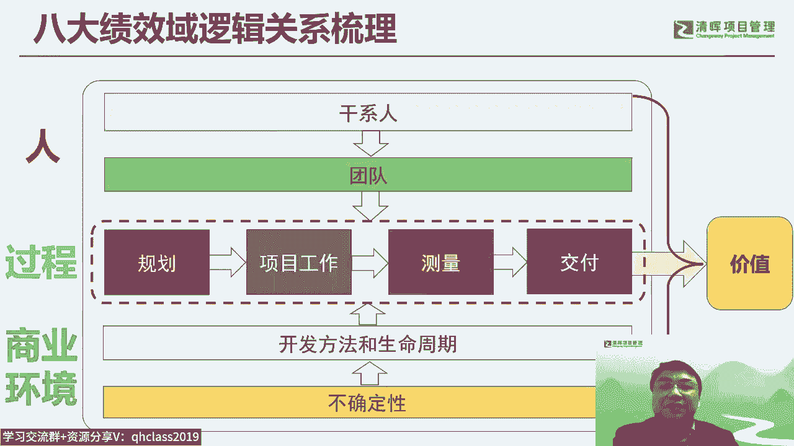

然后根据组织啊来进行裁剪，根据这个项目来进行裁决，最后实施一个持续改进，所以它背后其实也是一个pd ca的一个，一个一个一个考虑啊，一个考虑呃，另外呢我们可以看一下这个模型，因为呃这这这呃第七版呢。

它会专门有个叫模型方法和工匠啊，这个这个这个啊这这一章啊。

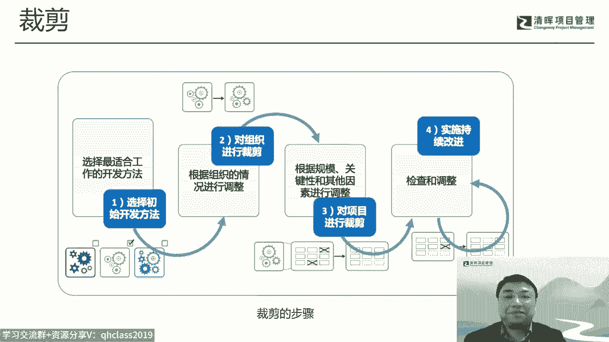

这一章里面就会对应到所谓的一些模型，因为模型呢是用来解释，解释这个这个事物规律的，这么一种一种一种怎么说呢，一种提炼一种表达啊，所以他这里面会根据我们的这个不同的也需要，比如说沟通啊，比如说激励。

比如说变革啊，复杂性啊，它都会做相应的一些模型啊，当然这些模型呢我们我这个怎么说呢，都是都可以对应到的是什么，是对应到它的一些原则啊，其实模型放在这里面，其实它是有我觉得还是有有些考虑的。

其实也其实严格来说，模型的这个它所对应的内容，其实更多的实际上是跟原则相关的，但是因为原则它是要经过这个所谓的NC的，这个这个这个这个这个这个评审的啊，所以他并不太容易把模型放到里面。

但是模型又非常有用，所以他还是放到这个指南部分里面，那这里面呃说呃怎么说呢，有几个模型啊，这个我觉得还是比较重要的，比较尤其是这个复杂性模型啊，因为复杂性模型呢它是很好的去解释了。

我们这个所谓的开发方法与生命周期的这个，这个这个这个选择的问题啊，呃胎息矩阵，还有这个CFM这个这个框架啊，这是两个经典的这个复杂型模型啊，在第七版里面也是也是可以，这个这个这个怎么说呢。

这个家里家里引用和参考啊，所以我们比如说像这个简单，我们可能通常是对应的是这种瀑布性的方法，但是到那种复杂混沌啊那种，那我们可能就要用的是适应这种方法，所以它还是有一有它背后的一些逻辑的呃。

方法呢是其实主要对应的是什么，是这个第六版的这个叫工具与技术啊，工具与技术，因为在第六版里面，我们实际上是对方对工具与技术，也做了一些分类。

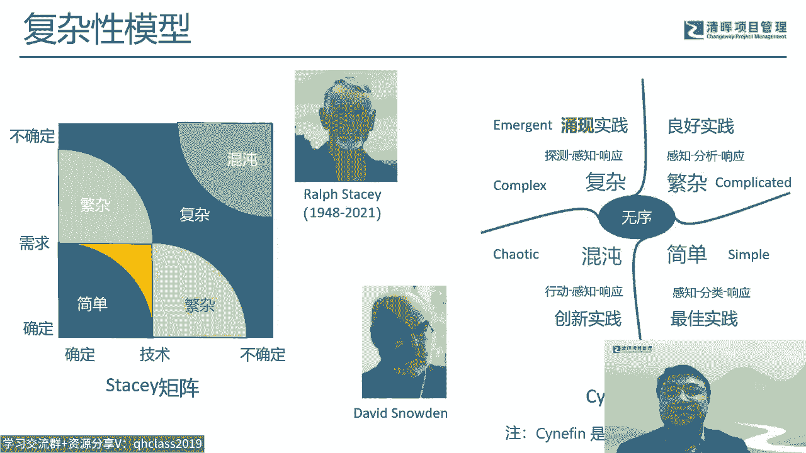

那第七版的其实也同样延续了这个方，这个这个这个那种做的分类，但是呢注意他在这个方法里面或者分类里面，它其实不展开的啊，他所有的这些这些内容，它只它其实是一种叫名词解释的形式，这个出现在这个这个正文里面。

所以如果你没有第六版，或者说没有之前的一些敏捷的这个学习基础，那其实你是看不懂这些东西的，因为它只是一个解释，并没有并没有场景，并没有把它放在具体的场景里面，或者放在一个过程里面去看啊。

所以所以这个这个也是我们拿到第七版，去看它啊，假如说没有这个这个前面的一些学习基础，所以他基本上你是看不懂的啊，因为因为你确实里面很多东西他没你没有学习，你就没法解释这个事情啊。

啊所以这里面我加了一列是什么叫叫第六版，敏捷还是新方法，那为什么加这类的，实际上是用来做一个对比啊，就说这个第七版里面提到的这些方法，到底哪些是我们已经学过的，哪些是是新出出来的啊，所以我们看方法里面。

这里面当然很长啊，我分企业给他给他罗列了一下啊，这么几十个这个方法里面，那像第一页有一个新方法啊，然后第二页也有一个新方法呃，当然其他的要么是第六版，要么是敏捷啊，敏捷里面也有很多的方法。

敏捷实践指南呢它里面有做的相应的一些定义，那那第三页会有两个问题，所以在这里面我们总共只看到了，有四个新方法啊，是在pp里面啊，其他的方法都是以前我们学过的。

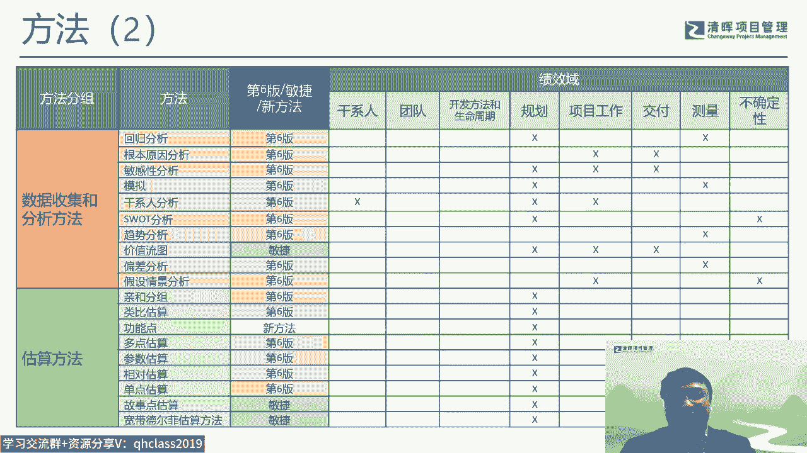

或者说至少是看过的啊，那有哪四个方法，一个是功能点啊，其实功能点严格来说不是一个新方法，因为这个功能点在软件。

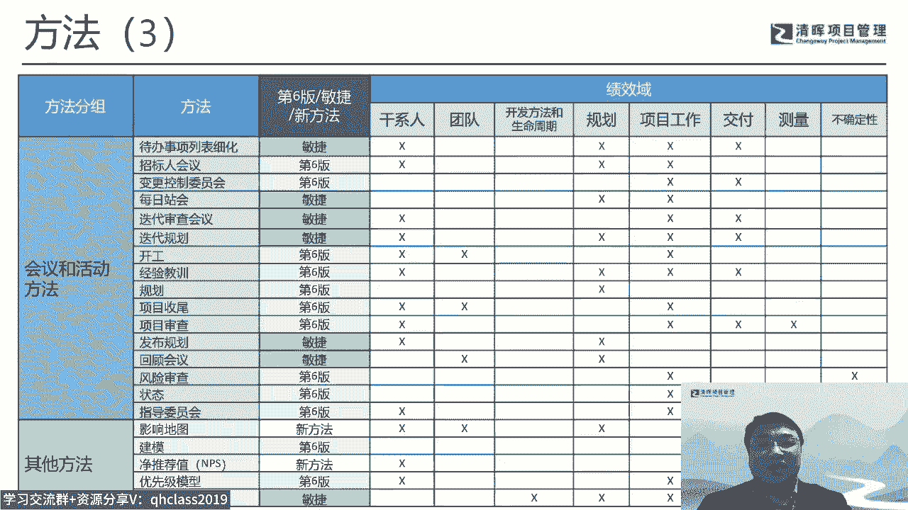

软件工程里面是一个是一个老的，不能再老的一个方法，那影响地图啊，影响地图是一个敏捷方法，然后净推荐值进退，推荐值也是一个很常见的一个商业的一个方法，所以今天净推荐值的引进的。

其实它是对应的这个所谓的成果，收益和价值的啊，就因为这里面涉及到很重要，涉及到一个干性的满意，甘心的满意，给你能能否否创造更多的商业价值，那这个进程推荐指定应用印度就非常有意义了。

呃包括这个产品生命周期评估啊，这个实际上是一个可持续发展，或者说环境的这个这个，这个这方面的一个一个一个方法啊，所以这个方法的引进，其实可以看到他对管家精神啊，对于这种呃可持续发展的一个重视啊。

一个重视，那最后是弓箭，弓箭呢其实对应的是是这个呃，第六版里边我们说ITT里面的输入，输出里面的这种这个怎么说呢。

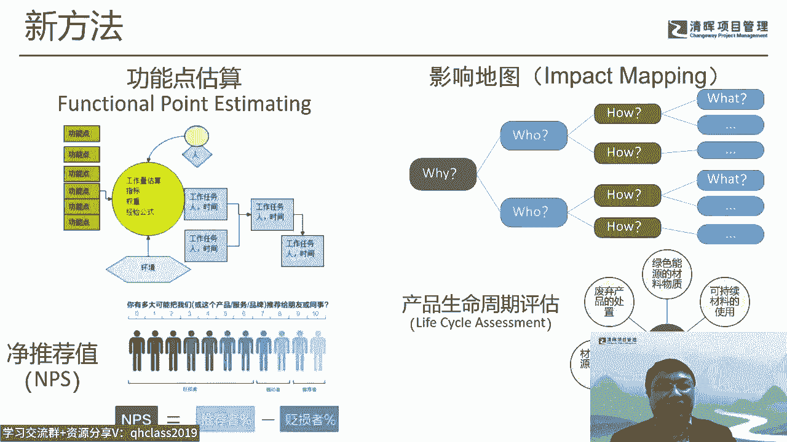

主要是对应了他的管理计划，对应了他的这个项目文件啊，这这一类的内容啊，它实际上是一个文档形式的这个体现，那在这里面呃，呃篇第七版也把它作为一些分组啊，什么战略共建啊，什么计划共建日志和登记册共建啊。

它都会对应到相应的以前的一些文件，那当然这里面也有一些新的啊，也有一些新的新的，主要会体现在战略空间里的，那其他的这这些空间基本上都是在第六版里面，都是有的啊，都是有的，包括可视化的。

包括这些什么报告啊，协议合同这些都都有啊。

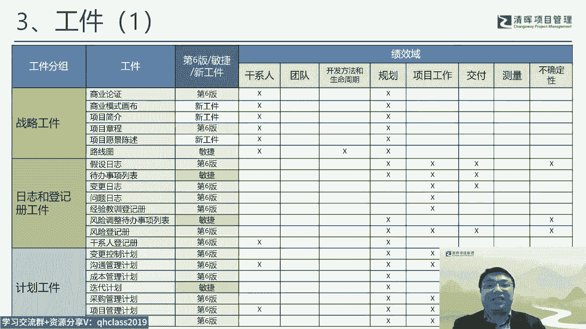

啊除了一个叫不确定交付和数量合同，这个叫IDIQ，IDIQ呢是一个非常不常见的一个合同。

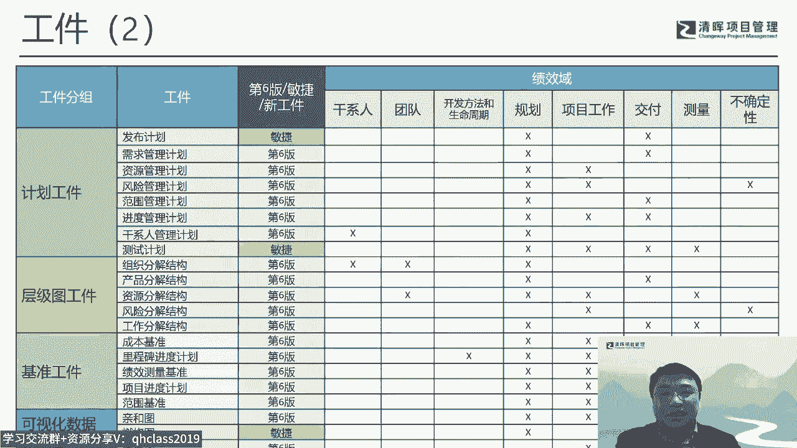

因为他这个只有在美国的政府采购里面。

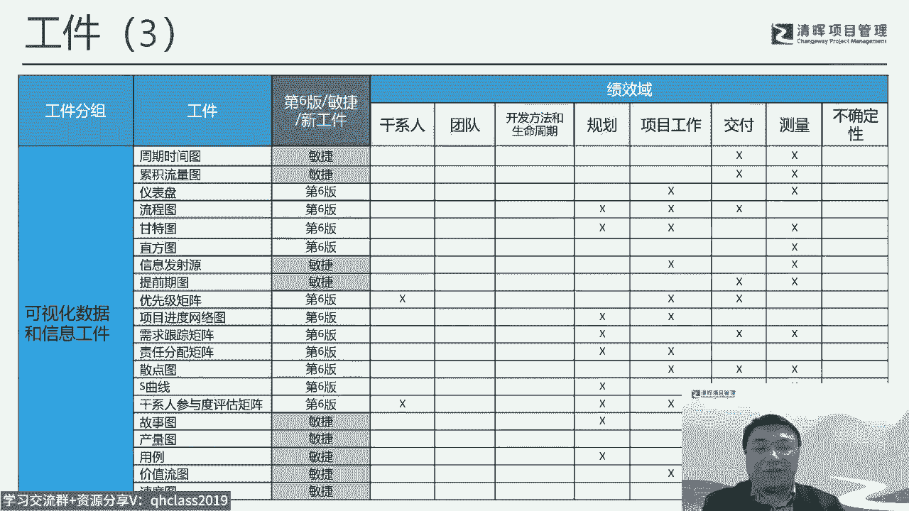

才会涉及到，而且而且都是非常非常小众的一个一个采购，采购一个啊，但是它它的背景是，因为它是在一个叫所谓的不确定的条件下，所以它是跟不确定性是有关的，这么一个一个合同啊。

当然现在也有一些商业组织开始也有一个动态，那之所以列这张表呢，实际上是可以让大家有一个印象是什么呢，其实啊这个在我看来啊，就是第七版的在知识点的原延续性，为什么说延续性的，就我们前面看的这些方法也好。

弓箭也好，其实他都是在过去的第六版里面出现过的，或者说实践指南里面出现过的啊，啊这个这个，所以所以他的这个啊敏捷实践指南里面出现过，所以他的这个那基本内容啊，其实我们都是如果是学过。

尤其是像像我们考过PMP的，其实都是有这个概念的，所以真正的新的东西啊，新的方法，新的贡献其实是非常非常少的，就少之又少的，所以呢这个有了这个，我说如果是有了第六版和敏捷的这个基础，那你再去看第七版。

那就会起到一个教室所谓的事半功倍的效果，假如说你都没有去学过第六版，也没有学过敏捷，你看第七版，几乎是我觉得是一个叫叫叫，有点像天方夜天书的那那那那那种感觉啊，因为里面太多的知识啊。

概念的你即使是是是没有基础的，你你脑海里也不会形成一种这个联想，也不会形成一种对应关系啊，所以你就很难去看看懂这个这本书啊。

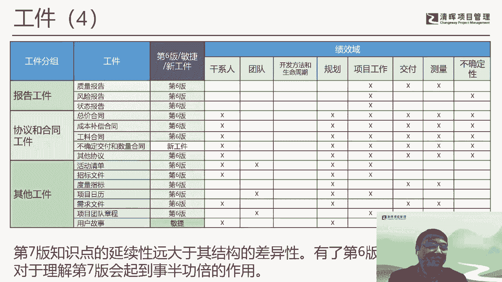