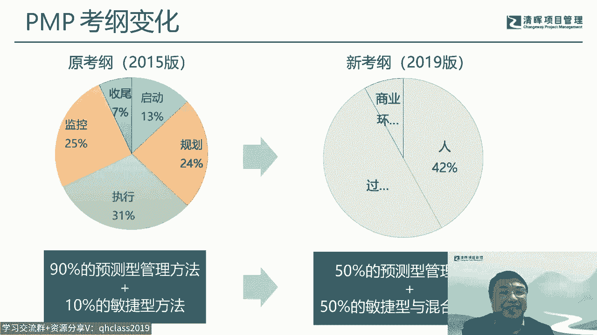

# 1.PMBOK第7版解读：项目管理新趋势 - P3：3.第7版对未来项目和项目管理的影响 - 清晖Amy - BV1Km421u7UQ

接下来也谈一下，就是在我个人理解啊，就是说第七版对未来项目和项目管理，的一些影响吧，呃其实第七版里面对项目和项目管理的定义，它目前来说是没有变化啊，目前没有变化，但是目前没有变化。

并不意味着将来它不变啊，因为实际上虽然定义没电，但它其实现在在第七版里面体现出的，他的一些呃一些内容啊，或者一些思想，其实他已经在变了啊，当然这里面变我们，我我我我我们可以来对照看一下啊。

比如说项目管理，我们过去跟产品管理，跟什么商业分析，项目及管理以及开发，其实它基本是是是分开的啊，在PMI体系里面它也是分开的啊，但是未来就未必是这样的啊，因为对项目的这个理解，包括项目管理的理解。

我觉得现在可能，未来都是有可能会发生一些变化的，比如说像对项目的定义，那科斯纳在那个项目管理化点里面的时候，就就15年的时候，他其实就重新做了一个定义啊，这个定义我觉得是非常非常有。

有有这个启发意义的啊，他是说项目是叫计划，实现的一组可持续的商业价值，那事实上在我们第七版来说，其实就是在围绕可持续，在围绕这个价值在在展开，虽然它定义没没没变。

但它其实核心的内容其实真的是已经发生变化，我们现在对项目的理解，其实就不光是一个可交付的这个概念对吧，我们更多的是要考虑它的一个成果，收益和和价值的问题，所以它的边界其实他已经在通过第七版在扩了。

那对于项目管理这个事情来说，其实也是一样的，项目管理就不再仅是说，这个项目内部的这些管理，他其实现在也越来越多的在在跨界，在跟商业分析，再跟产品管理，跟项目集管理，跟敏捷开发这个在在关联在一起。

尤其是我们第一啊，这个PMBOK第七版里面，专门把产品作为一个附录章节啊，作为附录，它其实它的重要性相当于就是一张了，在过去来说，就相当于是一个知识领域的，这这这这个重要性的啊。

所以产品管理很明显的项目管理和产品管理，我觉得现在是一种交融的趋势啊，就未来会越项目管理，会越来越涉及到跟产品有关的这种这种管理啊，因为因为未来也是产品化，也是一个也是一个长期的趋势啊。

尤其在互联网时代，很多的这个这种这种因为软件是特别容易来，来把这个这个怎么说呢，这种项目给他产品化的啊，所以这个是对未来的一些影响，那同时呢它也会通过一些变化来来来体现啊。

就比如说我们过去看这个项目管理，我们更多是从他的一个这个过程啊，这49个过程啊，五大过程呃，过程总是大致领域来看啊，但是未来我们可能更多的要去考虑到一些商业，商业方面的考虑，就是以实现商业价值为导向。

这个项目的边界不断的去完，当然从商业的角度，我们考虑问题的着眼点就不像过去啊，所以第七版里面会出现不少，这个跟商业有关的概念，尤其是商业画布对吧，商业化部，这个叫精益创业化部啊。

这些都是在第七版里面会特意去提到的啊，所以我们需要在脑海里面，除了项目本身之外，我们需要扩展到整个商业领域啊，所以这个是对我们来说，是一个是一个思想的一个扩展的。

另外呢从这个敏捷，比如说我们过去谈敏捷，可能更多强调的是项目或者产品这方面敏捷，但实际上从这个从未来来说呢，我觉得可能更多的是需要考虑到，整个商业价值的时间，那整个商业价值之间的过程。

我们通常讲的就不再是一个项目敏捷，我们更多的会涉及到这些业务敏捷啊，这里面就涉及到整个组织的变革，组织的适应性和韧性，这这这这方面的一个体现。

还有包括对这个变化啊，变革变化，因为我们过去面对变化，可能更多的是一种被动的去去面对啊，去识别，去被被动的去面对，去响应，然后通过变革流程啊，这个这个这个去去去去去应对它。

但是未来我们可能更多的去要去主动的去拥抱，去去驾驭啊，所以需要去更加敏捷的去面对这种未来的，不确定性啊，或者说风险啊，呃另外一块呢，我觉得是项目经理的职责会发生一些转变了。

项目经理呢就像前面提到的项目管理的，它的外延在扩，项目经理，可能他未来它所需要掌掌握的这个这个技能，其实它也是需要扩展的，就不再只是说只是我会偏布的，这这个49个工具，49个过程啊。

他需要更多的去掌握一些商业分析的能力，需要去扮演一个收益实现的啊，因为在传统来说，收益实现更多的是在项目级这个层面去考虑，但实际上未来来说，从项目经理就要开始要考虑收益时间，那同时你要跟客户来进行一个。

更好的一个沟通啊，因为这个你需要从产品的角度，从这个客户的角度去考虑，这个这个这个这个这方面的呃概念，同时呢你也要成为一个项目的领导者啊，就过去项目经理只是其实还是一个职业经理人。

但是你未必是一个这个这个所谓的leader啊，或者发起的角色，其实未来你更多是要往上走，而不是往而不是往下走啊，另外我觉得是有些思维是需要转变的啊，当然这些转变的，我觉得也在遍布的第七版里面。

会得到一些体现啊，比如说从这个员工思维，你可能需要转变为转变为一种管家的思维啊，那员工你只是把自己作为一个打工者管管家，你是上把自己作为一个主人窝啊，其实这个考虑问题的角度，和你做事的这个积极性。

主动性，但是完全是不一样的啊，当然当然这个这个这个不涉及到价值判断，不要说我我这里是不是傻不傻的问题啊，这个其实不是傻不傻，而是而是你有多大的能力，有多大潜力，你能承担多大的责任啊。

你你能扮演多大的一个一个主动性的一个行为，其实这些会影响你的发展啊，呃另外一块呢，要从这个任务思维转化为一种所谓的商业思维，因为过去项目其实它是一个发行，交给你一个任务对吧。

那你只是需要按照项目章程里面，把这个事情做完啊，把这个做完也就罢了，但是到现在来说，从第七版所反映的一种一种这个这个角度来说，你更多的你要考虑到它整个这个商业价值，所以不光是只是把事情做掉。

而是而是你要考虑你要做一个有意义的事情，有价值的事情啊，你怎么把它融入到你整个商业的一个，一个架构里面，那另外一块呢就是成果思维到这个价值思维，因为过去只是做我，我只要做可交付成果对吧。

但是现在我更多是要可交付成果，可交付最后所形成的收益和价值，你需要有这方面的一个延展的一个一个考虑，那过去呢我们可能也是一种线性的思维吧，把一件事情做掉，就是但现在可能更多的我需要就有一种系统。

所谓的系统思考的能力对吧，系统性的思维，因为项目的他受的周边的环境会越来越多，影响越来越大，那你在这种情况，你需要更好的去去考虑，这个整个系统化的一个一个一个一个考虑呃，还有一个是确定性到不确定性的啊。

因为确实在过去的呃，第六版或者说早期的版本里面，它更多的还是，尽管第六版已经开始引入大量的敏捷元素，但整体框架它其实还是基于一种所谓的预测型，或者说确定性的一个环境下，来考虑这个这个这个项目的啊。

但是未来其实我们是在一个无卡的时代，那就根本性来说，我们要要有一种不确定性的思维，在一个复杂的一个变化的一个时代里面，环境里面你怎么去把这个项目做好啊，所以我觉得这几个方面。

可能都是我们面临的一个转变吧，啊啊这张图呢其实是是有点早啊，稍微有点早的一张图啊，因为因为这个人才三角是是我们第六版的啊，这个PI这个这个呃把它写入到PM，其实人长三角最早的出现是在2012年啊。

周杰伦是非常早，10年前他就就已经出现了，但真正的写入它是2017年写入到，其实在到现在，我觉得都是非常有有意义的一件事情啊，尽管PMI的现在也又发布了一个最新的啊，去年呃，去年底啊。

今年初又重新发布了一个最新的，所谓的新的人才三角，但是我觉得这个现在人在三角，和旧人在三角没有本质的冲突啊，所以我觉得还是用这个还是比较好一些，呃另外呢偏慢的也其实也做了一个调查，就是市场急需的技能啊。

其实在这个人才三角相关的技能之外，他特别强调了一个叫数字化技能啊，数字技能啊，所以基于这两个考虑，我我我自己重新给他做了一个组合，这个组合呢当时也在PMI的这个这个大徽章，也做了一个报告啊。

就是人才视角啊，在家啊，还有一个家对那人在四角的，相当于是人才三角加这个数字化的一个技能啊，同时呢再加什么，加的是你的一个行业的技能啊，因为每一个项目，或者说我们每个人处的是一个不同的行业。

其实每个行业都有每个行业的一些一些能力的，或者说技能的要求啊，所以这当然行业那就就360行啊，当然现在可能是3万6000行啊，但行行都有自己的一些一些不同的这个，这个门道在里边的，所以我们每个人。

其实要结合自己的所处的行业来，再加上这个项目管理的这个共性的这个知识啊，那我们才能把真正的一个一个的项目给他做，落地啊，这是我的一个一个观点啊，好，那最后呢有点时间。

就谈一下，关于这个天体考试大纲的变化和学习建议，呃今年2月份的这个基金会呢。

在杭州当时召开了一次这个行业的一个会议啊，在这次会议上的，特特别邀请了这个美国的这个pi总部的专家，来做一个分享和对话啊，分享和对话啊，当然主要是谈的，其实也是跟这个最近PMI的一些呃这些变化。

包括第七版也好，包括一些考试的变化也好，那其中呢其实我问了问了这个在对话环节，我其实问了一个问题啊，我就说因为当时正好有个宣布是什么，是是说这个8月份起，这个PMBOK指南第七版。

将成为中国大陆地区的这个认证考试资料，就相当于是什么，就就第七版要进入到中国的偏僻考试，那我就问问了美美方专家一个问题，我说这个按照您的了解是偏，就是这个第七版在国外是什么时候，已经进入到这个考试里面。

因为它毕竟全因为中国的考试跟全球的考试，其实其实有些不一样的地方吧，你说我喝喝口水吧，呃相对来说呢，这个这个全球的就是国外的考试呢，在这种改版变化里面，它会体现的早，比如说我们这个最新的考考纲对吧。

192019版考纲，我们国内是去年的，去年去年9月份吧，就是唯一的考了一次试的，那那次才才开始用到这个，但是在国外呢其实前年就已经开始用了，所以相对来说国外的考试，它的变化比我们国内是要早的。

所以我也问了一下第七版在在在全球怎么样，然后这位专家的回答是说，这个全球已经开始陆陆续续出，有这个第七版的一个考试了啊，那行那那当然这个也没法再继续的去其中文，但我我自己也留意了一下，因为因为毕竟来说。

我们其实清辉是有很多海外的这个学院的啊，所以我们也在留意，就说他们在这一段时间，尤其从今年开始啊，从今年年底到今年这段时间，他们在考试的过程中，对题目的印象有没有很明显的一些第七版的。

因为按照这个美方专家来说，其实现在就已经开始在国外说第七版的，有些知识点已经开始进步了，但是他在考试的时候到底有没有，那市场给的结果是大家其实都是没有印象的，没有概念。

至少至少在他做至少做题的这个过程中，实际上是不太有这个所谓的第七版的这种，这种概念啊，所以对这个说法呢，其实我是觉得反正反正专家的说法嘛，这个也不能完全完全这个这个信以为真啊，所以这个还是报报一报。

一个批判的角度去理解这句话呃，然后PMI呢也发发在这个通知里面，其实它有一个呃有一个说明啊，有一个特别有个说明，说明呢这里面有几句话我觉得很重要啊，这个叫第六版的关键知识依然有效啊。

PMBOK的知识依然有效，同时呢正在开发过程组模型啊，过程组模型我回头会解释一下啊，然后呢，同时偏僻的考试呢是基于考试大纲ECOECO的，现在目前的考试大纲是不变的，那就意味着什么呢。

意味着第PMBOK第六版依然是有效的啊，这个从PMI的这个官方讲解释来说，这个是有效的，并不是说第七版来了，第六版就就就就就废掉了，那不是的啊，第二呢就是说目前的ECO就是考纲。

2019版的是暂时是没有变化的啊，那所以所以基于这个信息，我们可以做做出这两个判断，那这里面我就要特别跟大家解释一下，这个偏僻的考纲的变化。

这个我们前面也说了，偏偏不可能它是每4年会更换一期啊，会更新一下，所以过去从08年一二年，那17年当时稍微特殊一点，延了一年对吧，到21年，那基本上都是4年一变的这么一个规律。

中间稍微有个5年就这么一个变化，那偏僻的考试是一个什么样的变化呢，这个我可以给大家解简单展示一下啊，这个呢是早期的考纲啊，早期的考纲，早期的考纲注意它是分成六块，拿六块五大过程组，还有加一个职业道德啊。

职业道德就是责任，尊重公平诚实啊，这个p mi的这个四大四大职业道德，那所以它是分成六个模块的，分成六个模块，那我我经历的第一次改版呢，是在呃10年一零年的考纲啊，10年考纲，但在中国。

我是中国的这个使用始终会其实会缓一缓啊，它会慢一点，中国的直到2011年的9月份才正式启用，9月份那次考试才正式在启用这个新的考纲，那新的考纲呢，它是把那个职业道德就就拉掉了啊。

职业道德这方面的内容就相当于融内化，在这个这个五大过程组里面，几种微观执行监控收入，然后呢，它的比例的，每每部分的比例也在做相应的一些调整，然后经历的第二次考试，变化的是2015年的考纲变化。

但那一期具体在中国呢，我这个倒已经已经没有什么，也没花时间再去考考证这个事情啊，那最近一次是在19年啊，那就是我们这一次啊，这次他的这个改改变的事物是呃，是在这个去年的，应该是9月份的那次考试啊。

这个来正式来启用啊，是是这么一个一个一个一个时间，但注意在考纲的变化的中间呢，它其实是正好面临着这个偏布的版本的一，个变化对吧，那PMBOK变版本变化呢，它就会引啊，这个这个我是顺便再再说一下。

这个前面考纲变化的，其实会导致一个成绩的一个一个叫计计分体系，或者说计分表达的一个变化，前面最早的是六个呃，六大块的时候啊，他的最好的成绩是叫6P，因为他的他的表述是P是是优秀嘛，然后M是中等啊。

B是below，是是那个那个不及格的，所以所以最好的成绩就六个P，所以6P的这个能拿到6P在当时来说，那绝对是大神级的这个这个这个这个考生啊，所以这个6P也好，包括后面的5P就是能拿全这个P。

那绝对是高手中的高手呃，15年的考纲变化，会导致他的那个积分体系稍微发生变化，它就不叫P的，最早最高的叫A，所以我们其实从这个从后面一五，大概16年左右吧，就后面的得分，我们会看到他现在拿到的分数。

更多的是叫5A对吧，那到这个19年之后，就去年这个这个后面我们就变成3A啊，拿到三个A，那那就拿到这个最好的境界，但注意他这个中间呢其实还有一个什么呢，是一个叫叫中期的题库更新，题库更新呢。

它是是跟偏book的版本变化是有关系的，所以我们在12年的这个这个新版本出来之后，他这个在中期啊，就15~2010到2015年考纲变化，中期它会有个题库更新，那这个这个2017年之后。

他也有个题库更新啊，那个包括现在我们面对的其实223087，其实面临的一个是什么，是叫PMBOK中期的题库更新的问题，因为他题库更新了，就要把这个偏不指南变化的这个内容，它要反映在这个这个题库里面呃。

事实上在第六版到第五版到第六版这个更新的，其实其实变化不是特别大啊，不是像我们想象中那么大，因为它整个只要框架不变的话，还是五大过程组，十大知识领域的情况下，他其实怎么变。

我觉得这个这个这个都很难变到多少，但最多是尤其是会把一些这个过程组的，这个过程的这个细节，他可能会变一下，但他其实大的思想它其实是很难变的啊，那这一期变的可能就是，因为是有第七版的这个这个因素啊。

所以这里面，我们是要还是要慎重的去对待一下啊，呃至于下一期改版呢，其实按照他时间频率来说啊，2019这个这个过4年，基本上其实也是基本四到5年，所以就这个考纲会不会变，那其实如果要变。

我个人感觉也是这一点，这两年的事情要么2023年变，要么2024年变，差不多，应该是这两年左右就开始来做这件事情啊，那据说pm已经在考虑这件事情吧，但是呢这个这个变的是这次，如果这次考纲再变。

下一次考纲再变，那应该是一个大的变化，但是目前来说，其实我们还是处在一个一个老考纲的一个，一个时代啊，这个这个2019考纲的一个时代，所以所以我们这次面对面的变化，我相信不不会。

并不会像我们想象中的那种版本变化的本，那么变革式的这个这个颠覆性的变化，那应该还是达不到那种程度的啊，呃但是现在问题是什么，因为我们的这一版的新考纲的，其实在国内也只是考的第一次和两次。

因为今天是3月份的一次考试嘛，但3月份其实在消化，去年因为疫情绝大部分的这个省市都没法考啊，所以严格来说，其实我们都是指去年去年的这个这个考生，考过一次，那5月份算是第二次。

相当于就是说在国内真正的严格来说，只是经历过两次考试之后，我们就要变，就要就要开始再做一个中期改版，那这是过去从来不可想象的一件事情，因为过去每年四次这个雷打不动的，这个非常非常有规律啊。

但是但是疫情完全过去3年，是把整个中国的PMP考试节奏，这个彻底的叫叫支离破碎的彻底的颠覆掉了啊，但是我我还是还是很期待，就是说未来中国的这个反正也也都恢复正常，常态之后，还是回到每年。

比如说每年固定的每年四次的那种节奏啊，这个这个我觉得对中国的整个这个行业发展，是非常有益的，但过去确实来说影响比较大，呃我们看一下过去的这个考纲啊，2015年的考纲。

这个其实它就是按照这个五大过程组啊，然后每个过程组呢它会分成一些这个任务，然后任务里面会做一些描述啊，其实就按照这个任务来来来定它的一个题型啊，啊叫题题目的一个一个一个比例吧，他出的这个题目的。

也都是说尽量靠近这个里面的任务，当然这里面的任务呢其实不完全呃，完全的一个和我们所谓的过程啊，或者说ITTO绝对对应啊，其实但是它的核心的思想，其实还是还是相互相互对应的啊，因为偏僻的考试呢。

其实它是有它是有很多参考资料的啊，其实偏不只是只是一个核心啊，然后这是19年的考纲啊，19年考纲他发布日期是19年的6月份啊，6月份的一个发布，那他的考纲呢，实际上他这次做了一个很大的一个调整。

就是它把它变成了三三大块人。

过程和商业环境对吧，那每一个这个这个玉呢，它对应的任务有不同的任务数啊，然后每个任务后面呢，它有相应的所谓的呃enable的啊，这个叫促进因素啊，或者说有时候会把它翻译成其他的一些，表表述吧。

那这里面其实所所所谓的题目呢，其实它其实是要对应到这里面的任务，和这个促进因素里面的这些这些内容的啊，当然这些内容呢其实都是在，比如说从第六版来说，它其实完全就融合，融汇在那个第六版的那些那些内容里面。

对待这个是有个过程啊，那么多ITTO对吧，那都都都包含包含在里边，那所以第七版的变化到底对他影响有多大，我觉得这个东西还是要要要结合到他这个，前面的这个考纲本身来看呢，只要考纲不变。

其实这个版本怎么去变，影响都不是特别特别大啊，不像我们想象中的那么那么那么那么大啊，那这个再重复一下这个这个考纲的变化，我们过去是是启动的这个这个启动规划。

执行监控团收尾，到现在是人过程和商业环境啊这个三大部分，但这里面呢有一个变大的变化是什么，就是敏捷的内容啊，我们老的考纲呢是90%的预测内容，但新的考纲呢是50%的预测内容啊。

另外50%就是敏捷和混合啊，所谓的混合那就是既有敏捷，可能也有预测啊，或者中间的什么迭代增量啊，这些都都有可能在混在里面啊，呃另外我们可以看一下这个考试题型啊，其实在原来的考纲里面。

就是去年之前的考试，我们都是200道题，四选一，那去年因为考纲变化啊，所以他这个题目呢他其实做了一些，做了些这个这个怎么说呢，做了一些这个变化的，那目前在国内也就是2092303对吧。

230其实就目前来说应该是这三期的，我们用的都是这个考纲，那现在的考纲相当于是180道题啊，就是题目量减少了20道啊，但是呢题型呢它是丰富了一些，原来都是单选题啊，四选一的单选题。

但是现在呢每次考试大概有十来道啊，当然也有可能稍微少一点，也有可能多一点啊，就十道左右的这个所谓的多选题啊，所谓的多选题，那这个当成多选题的增加，肯定相对来说会会稍微感觉会增加一点难度。

但是毕竟他这个这个题目的数量，也也也缩减了啊，缩减的时间不变的情况下，其实某种的每道题给你的时间也多了啊，所以这个东西它是相互来抵触的，呃其实在国外来说呢，它有一种题型叫叫连线题。

连线题那个在机器上可以操作的，但是问题在中国的，因为都是纸笔考试，都标准化考试都是只能选ABCD对吧，所以像这种情况下，在中国现在来说，实际上是是把国外的机考题，转换为这个选择题啊。

不管是单选题还是多选题，他都先要做转换，转换之后，才能在国内这个这个以纸笔的方式来考试的啊，他是这么一个一个处理呃，那接下来就是2308呢，这里面可能就会面临一个这个，题库更新的问题啊。

题库更新的问题呃，但是不管他怎么更新吧，就说目前来说PMP的考纲其实没变对吧，那他的这个十本的参考书其实也是没变，因为现在的考纲官方严格来定义的参考书。

其实是偏布个第六版啊，就左边这个左上角这这这本啊，这十本书呢这个其实在国内基本都有发行啊，除了右下角的这本书，因为时间比较老之外，这个这个是啊这个这个没没没没有引进啊，没有引进，因为这个出版社引进它。

它也要考虑到它的一个销量的问题啊，这个没有引进，然后啊这这些书里面，其实我们呃其实也参与了其中的一本吧，这个就是呃呃上面的左边，左边第二本叫项目经理便捷手册，因为这本书呢是这个叫像美国项目管理支付啊。

他自己亲自亲自写的一本一本经典的一本书啊，这个他也是列在这个这个，这个这个是本参考书之一里边啊，呃但这次是因为改版的时候，其实我们就要考虑到第七版，因为第七版现在就是要进入考考纲对吧。

那相对来说就是第七版的内容，和第六版就相当于共同构成了，我们在偏僻的指南，这本书里面的可能都要去学习和了解的内容吧，呃前面也提到了，有还有一本书啊，就是现代篇啊，PMI正在做啊。

其实这个电子版已经发布出来了，叫过程组实践指南，那过程组实践指南，其实它是在第六版的基础之上来改改编的，一本一本书啊，那因为因为按照美国的这个这个规则来说，你第七版出来之后。

他的这个第六版从它的印刷版啊，就是纸质版，它就它就叫叫下架了，就不能再再印刷了啊，那但是第六版的知识又非常重要，或者说他又特别经典，就是当电子版，它可能还还是会保留的，但是这个纸质版没有了。

那万一有有人要看这个纸质版怎么办啊，所以它它那某种程度上，我觉得也是在在平衡这个矛盾吧，所以所以PMI呢大概应该是去年吧，就重新的，他把这个叫在第六版的基础上，他重新编了一本叫奖项啊，叫过程组实践指南。

那过程组实践指南，它的内容呢呃我看了一下，其实就是呃篇幅的第六版的前三章，这个呃前三段几乎是一字不动，唯一变的就是说那个人才三角稍微变了一下，变成了新的人才三角啊，其中把领导力改成所谓的影响力啊。

它也有这么一个一个变化，那另外是再加上这个五大过程组，那五大过程组的是有个过程一个不少啊，所以他基本上把所有的第六版的，这个核心的内容还是保留，但是他唯唯独没有的是是知识领域啊，因为我们过去第六版。

最核心的那种是十大知识领域啊，所以十大知识领域它消除掉了，但是十大知识领域的过程，它保留在这个五大过程中，所以PGPG它实际上是表，就是这么一个版本的一个一个一个的。

等他以后这个这个可能这个这个中文版能发行，大家有机会也可以看一下啊，其实从学习角度来说呃，学单学这本也是有问题的，也是有问题的，实际上最完整的我在我看来还是第六版，它是最完整的一个知识。

所以这里面我就也提出一个备考的建议啊，就是实际上包括我们的学习，其实也都是应该先学第六版，还有敏捷敏捷基础的一些知识啊。

也不仅限于说这个实践指南啊，当然敏捷实践指南是一个比较经典的一，个敏捷基础啊，在这个基础上再学第七版啊，所以所以这这个先后顺序是不能颠倒的，因为否则的话你只单拿到第七版，你是没法学，在我看来。

在我个人看来，其实第七版是一个没法单独学的，一个一个一个一个知识，你必须要有基础，你没有这个基础，你没法没法学，否则看到里面里面的这些东西，你没法没法对应，而且而且你也没有合适的场景去去描述，去教他啊。

不像在第六版里面，我们会把它放到过程的场景里面，去教那些知识点，但第七版里面是没有那种场景啊，它只是只有抽象的一些抽象的一些概念，抽象的一些描述，在一个很抽象的一个环境里面，就真的是很难学啊。

这是我的一个观点啊，但是呢这里面呢我们也看了，就是说第七版的内容其实呃虽然抽象啊，但是他其实从知识点的角度来说的，其实他还是继承了这个这个呃，这个第六版还有敏捷，还有敏捷的一些基础知识啊。

所以他们基本上是对第六版，敏捷的一些解构和重构啊，所以所以我们还是在第七版里面，大量能看到这些知识，问题是假如说你没学过这个这个第六版，或者说没学过敏捷，你你拿到这本你就没法没法看啊。

这这是他的一个很客观的一个现实的情况，那另外来说呢，我个人感觉，其实第六版当然他是一个很基础的指南啊，虽然虽然说的是专业人士啊，但是在中国来说，确实这就是我们学项目管理的一个基础。

他而且他是站在一个具体的管理者的视角，项目经理的视角来看这个管理啊，来看这个项目的管理，但第七版的在我看来，其实它本质上一个叫高级指南啊，其实我原来一直跟PMI是同时开玩笑。

我说这个第七版应该确切的名字，应该叫项目管理高级子弹啊，这个这个这个一点不夸张，因为他是站在某种程度来说，是站在高级管理者的视角来引导向，其实他很强调的是领导领导项目。

他倒不一定完全强调的是这个具体的管项啊，这是在在这个因为掌握原则对吧，掌握原则最最重要的是领导者，掌握原则，他再去看这个项目，他就会不会更加得心应手啊，所以这是一个很现实的问题。

然后呢再讲几个对个人认知吧，一个是第七版的，这个确实来说呢，第七版它这个架构其实是非常有价值的啊，非常有价值，他因为是能够站在一个更高的一个层面。

但是呢他反过来说，对初学者其实是很不友好的一个版本，因为它的内容非常非结构化和发散性，这个这个看这本书其实不太容易看的啊，因为确实他来说它就是一些罗列，包括很多知识，他就是罗列没有经过整理。

没有经过这个这个逻辑上的一个梳理，所以这个看起来非常非常费劲的一个，如果你尤其如果当你没有第六版的基础，你看这个几乎是没法看的，呃，所以他这两个两个版本，我觉得是一个某种程度来说，是一个父母的关系啊。

不是一个相互替代关系，并不是说第七版把第六版给替代掉了啊，我们说第六版可以替代第五版，第五版可以替代第四版，这个过去的版本都是替代关系，都是新版出来，旧版就可以扔进垃圾堆了啊，就可以扔进就可以烧掉了。

但第七版和第六版它完全不是替代关系，它某种程度它是一个互补关系啊，所以这两块的知识我觉得对于我们未来来说，都需要都需要掌握，打基础，用第六版打基础啊，这个要提升用第七版来提升啊，所以它各有各的定位啊。

呃那但是第七版的因为技能出来了嘛，所以他对这个很简，对B备考来说，他也也不可能排除排除掉啊，所以它还是一个必需品，呃但是对于那些考过的，尤其是我们这些年考过偏僻的同学们来说啊，这个我我倒是觉得是。

很建议大家也重新来看一下第几版啊，就它并不是一个纯粹的一个备考书啊，他其实某种程度来说实际上是提升我们的事业，提升我们的这个对项目管理的这个认知的，这么一个一个挺好的一个提高的书啊。

提高的书啊还是还是很有价值，尤其因为我们学过学过第六版，或者说考过，偏偏我们其实有有基础知识，那怎么来提高自己啊，第七版是很有价值的，但想想反过来说，第七版直接对那些初学者来说，这个肯定是有挑战的呃。

然后讲一下第一个人对第呃，2308期的考试的一个预测嘛，当然这个这个只这个只是个纯属个人的，这个观点啊，这个不代表任何官方，或者至少呃不代表p mi官方的这个这个说法了，因为因为所有的官方。

我们都是以基金会和这个p mi的观点为主吧，那因为我们就会去了解，我们现在清辉海外的一些学员的反馈啊，就是他只要在不在中国，近日这个这个在在国外考试的话，在海外考试的话，它其实都是这个是全球同步的啊。

就目前的考试下来，是对第七版的知识是没有感觉，因为做完题出考场之后，他其实还是会有一些印象，那就是专门比如说谈到第七版的，其实大家是没有这个概念，所以某种什么，也是因为在杭州那个那个那个对会会议上。

那个就我问的那个问题的，这个到底是真的还是假的，我就比较怀疑这个这个这个PMI的这个专家，可能也不是太了解具体的情况啊，某种程度来说，也许这个第七版的知识，并没有完全进入到这个这个考试里面。

或者说即便进入，但是他都不明显啊，非常不明显不明显的原因是什么，就是说因为考试的大纲不变对吧，只要这个大纲没有变，再加上偏偏布的第七版的，很多的知识的基础，是来自于第六版和这个和这个这个敏捷指南啊。

所以从目前来说，第六版的知识和敏捷的知识，其实它的重要性是远远大于第七版的啊，哪怕从考试来说，它也是重要性，也是也是也是这样的啊，是这样的，因为现在应该来说还没有大规模的使用。

所谓的第七版的知识去替代掉这个这个考虑中，第六版的知识，因为这个第一呢也没有这个这个必要，因为本身来说，PMP考试他参考的是十本参考书，而不是某一某一本特定的，只不过就说另外九本。

或者说另外八本的所有的这些知识精华点，都是被PMI的这个这个PMBOK和这个实践指南，给它吸收吸收进来啊，所以他们还是会会会体现在这些，把这些其他书的这些知识，可能还是怎么说做一个提炼。

并不是因为说他自己变化，他就完全把其他书的这些知识都变掉，这个也不是的啊，所以我相信这个呃，接下来的考试其实还是以第六版和敏捷为主吧，像我想至少从备考上，我觉得没有太没没必要。

有太大的这个这个担心和顾虑啊，因为这么多年的这个考试来说，其实偏爱在这个方面还是比较慎重的，也不会步子迈得那么那么大啊，呃另外呢我们毕竟从第2308期开始，其实不光是信，我，相信所有的这个这个机构。

都开始要把第七版作为，列入到这个教学体系里面啊，那所以我们也会专门的去教，这个遍布的第七版啊，早教这一块，当当今天的分享内容有些也是也也会写，写到这个讲义里面啊，这在直播会再进一步的展开。

那么后面三个月呢，我们也会紧密关注，这个我们的海外学员的一些考试的反馈，因为因为到底第七班有没有进入到，这个考纲考题里边，我觉得这个还是要需要一个持续观察的过程，因为只除非是我们2308考完了之后。

才能做确定性的一个判断，在之前我觉得都还是一个预测性的，一个一个一个一个一个判断啊，所以所以还是要紧密关注啊，看看有没有一些新的反馈呃，这里面会讲一下，我们就为自己的培训的一个升级，因为这是零三呃。

2308他既然要改这个所谓的第七版，要进入考纲，那必须要其实对我们来说，还是要要要很严肃认真的来对待的啊，啊，所以我们呃最近呢也是在做大量的这个这个，这个这个这个相应的准备工作，那个整个五一节啊。

这个前后大概将近十天，十十十天吧，十天我是封全封闭在家写这个第七版讲义，这个就唯一的一次是下楼去扔了一次垃圾，这个整个整个整整个五一节到7号，因为因为我我我我给我们团队的承诺是。

我7号晚上我要叫叫这个这个讲义，所以我是在7号的，应该是严格来说8号凌晨04：45啊，这个这个时间我也记得特别清楚啊，我是正正式的，把这个这个稿子发发给我们的教务主管，教学主管。

所以所以这个其实我们还是还是很很很很严肃，认真的在对待这件事情，当然这里面的是需要做做大量准备工作啊，但是我还是觉得就是呃怎么说呢，只要这个偏僻的这个这个这个怎么说呢，他这个考纲不变。

我觉得我们还是还是不要太太太焦虑啊，就是以不变某种程度来说，以不变应万美也是一种也是一种应应对方式啊，啊当然我们时间是要做一些调整的，因为这次这是很重要的一点是什么呢，是是是偏偏Poke的第七版。

我们是要纳入到教学里面，那教学里面的话，我们要做相应的一些一些内容时，因为时间有限，时间有限，我们肯定还是要做一些调整，那这个调整呢其实是指可以大家可以看一下，做一个对比啊，这是我们目前的一个教学。

第523057，我们都是按照这个教学来做安排的啊，这是星辉，这也是一个经典的一个教学安排，就五天的正假啊，正课，然后呢一次总复习，一次这个敏捷的串讲啊，还有一次这个这个答题的，这个这个这方面的串讲。

那这五天正课呢我们接下来可能会做一个调整，调整是什么，就说呃第六版的前三章，我们会把它改为全线上啊，全线上啊，因为因为本身我自己也是在带我们的这个这个，清辉的这个远程的一个录播班嘛。

所以我们会有一个全全前三天的，一个完整的一个录播的一个课程啊，这个就替代掉线下的这个再去再去讲啊，所以五天正课呢我们相当于就把第一呃，第一天的这个这个时间压缩，但是把腾出来时间。

是你给这个第五天的这个PMBOK，第七版的一个一个学习啊，一个讲解，当然这个中间呢，我们也会考虑到这个敏捷的这个敏捷，和这个第六版的一个时间的一个安排，所以我们现在目前来说是提出了这么一个方案。

当然这里面可能会有一个变数是什么，是我们其实最近因为在怎么说呢，现在也是一个叫乌卡时代啊，其实还是有一些不确定性的一些考虑啊，当然我们也会在听取一下我们的呃老师，还有啊学学员的一些反馈啊。

我们来看是不是要考虑备选方案，那备选方案，可能就是说我们到底在这个敏捷的这块内容上。

我我们这个时间的一个分配，是不是要做一些相应的一些调整啊，所以我们会有一些备选方案，但是不管哪种啊，我觉得5月底或者6月初啊，因为我们现在还是5月5月初嘛，5月5月中旬啊，对然后我们争取在这个月底。

下个月初左右，我们最终定下来，这个230巴西的一个政治方案，那其实这个方案怎么定不影响我们，至少不影响我们7月7月份之前的这个教学啊，其实这个不会影响的啊，所以跟这两个月目接下来67月份啊，6月份啊。

这个这个这个这个这个课程的预习，其实不受影响，但是我们还是会仔细去斟酌，对比一下我们这个教学方案啊，这个也是跟大家也提前沟通一下，其实我们昨天啊，前天前天，我们这个我们轻微的整个专职的讲师团队。

我们其实聚在一起专门研讨了一天，这个过了一下，我们这个这个这个这个整个的课件啊，整个课件啊，这个还是要交流下来，还是挺有收获的啊，那同时我们的讲义这最近也做了一个更新啊，我因为过去呢只有这个第六版啊。

是我们是把它以正式的纸质版来做，这个做讲义啊，所以我从下一期开始，我们就开始分把它分成上下两册。

就原来的这个第六版的讲义，我们是新讲义的上册，然后下次呢我们会把敏捷和这个PO的指南，给他单独做成下册，所以未来的轻微的学院应该是会拿到两本的，上下册的讲义啊，这个这两本讲义这个其实可以拆开。

上次单单独来来做，也是也是可以单独来用的啊，但合在一起就就更加完整，更加完整，是这么一个考虑的，呃最后呢也提一下这个这个呃，斯丹德加这个这个这个这个平台，其实pm在第七版发布的时候啊。

因为他的很多的内容都已经给他裁剪掉了啊，就是大量的这个什么方法工具啊。

什么都是以这个叫名词解释的形式，出现在PMBOK里面，其实它就完全没有展开，那没展开怎么办，那他其实配套的建了一个网站叫p mi，这个stand plus啊，这个这个这个网站。

它相当于把这些信息啊都放在里面，只不过就说第一呢，这里面所有的信息都是英文的，第二呢他要收费，这个收费就比较比较，比较这个这个这个这个这个麻烦啊，所以这一块呢其实对我们来说，如果是在PMP基础之上。

我还要进一步来学习，其实我们主要清灰。

主要还是通过这个清晖项目管理社区这个平台，在做这件做这件事情啊，因为我们通过这个公众号的方式，我们会把把这个很多的这个新的知识啊，这个这个都会都会以文章啊，或者说以专栏的形式给他给他展现出来。

像这里面我们两位老师，这个爱丽丝老师和那个袁辉老师，都分别写了两篇文章，来来来坐下来做一些这个这个这个这个解答，做一些解释啊，我觉得通过这种现代化的互联网的平台的手段。

其实也是能起到这个相应的这个作用的啊，好那时间有限呢，今天的分享就就就到这里吧。

