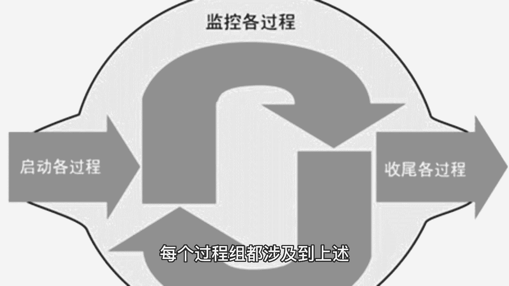
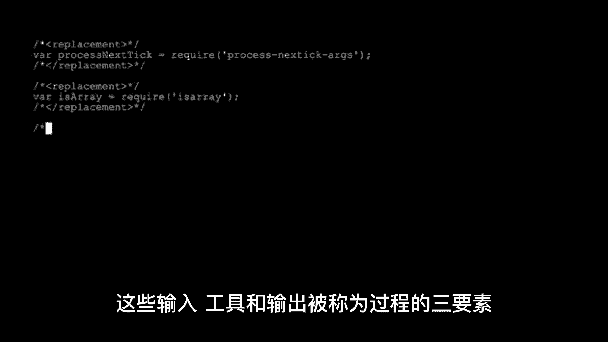

# 1、PMP项目管理基础概述 - P1 - 多拼科技君 - BV1wb411D77t

啧，pmp project management professional，是一种由美国项目管理协会，pmi颁发的专业资格认证，它基于一套被广泛接受的项目管理框架。

pandbox project management，body of knowledge，该框架提供了一系列标准流程工具和技术，用于规划执行和控制项目的各个方面，在pandbox框架下。

项目被定义为具有独特目标，一定时间限制和成本限制，通过执行一系列相互关联的活动，来实现目标的临时性工作，项目管理就是应用知识，技能工具和技术来满足项目要求的过程。

pandbox框架下包括以下十大知识领域，项目整合管理，项目范围管理，项目时间管理，项目成本管理，项目质量管理，项目资源管理，项目沟通管理，项目风险管理，项目采购管理，项目干系人管理。

这些领域被分为五个过程组，启动过程组，计划过程组，执行过程组，监控和控制过程组，收尾过程组，每个过程组都涉及到上述十大知识领域中的。

某些方面，并包含一系列特定的输入工具和输出，这些输入工具和输出被称为过程的三要素。

通过在不同的过程组之间移动，项目管理人员可以创建一个全面的计划，来完成项目，在项目执行期间，项目管理人员需要维护并更新项目计划。

监视和控制项目进展情况，并对风险和变更进行管理，他们需要协调和管理项目团队。

确保项目达到预期的质量水平，并与利益相关者沟通项目进展情况，在项目结束时，项目管理人员需要进行收尾工作，包括完成最终报告，释放项目资源，评估项目成功度，并在项目团队之间分享经验教训。

以便在未来的项目中得到应用，总之pmp认证是在pandbox框架下，对项目管理人员进行的一项全面的考核，目的是确保它们具备开展有效项目管理。

