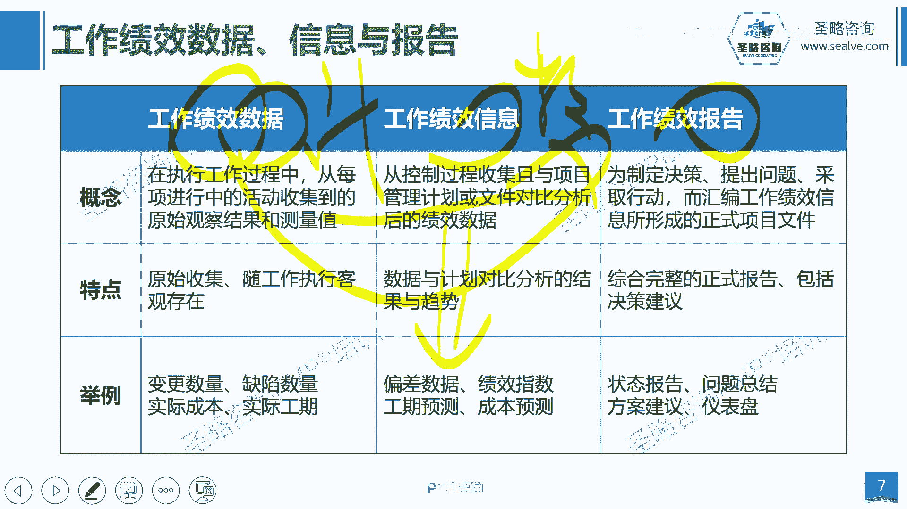

# 2-12.裁剪与项目绩效数据 - P1 - 圣略咨询-PMP项目管理 - BV1mH4y1V7HX

大家好，欢迎参加省略咨询PMP精讲课程。

我是老杨，这一讲我们来看看裁剪相关的内容，那么裁剪是什么，其实就是字面意思量体裁衣，你比如说我们要根据一个人的身体的体型来去，裁剪出适合于这个人的衣服，我们把多余的布料给它裁掉啊，那我们说做项目。

我们会学很多的工具和方法啊，你比如说第六版里面有100多个工具啊，有60多个输入输出也叫工匠，那我是不是在项目上都要统一去使用呢啊，那这是不一定的，就像我们在学驾驶的时候，你比如说我们在学驾驶的过程中。

我们会学很多的技能啊，比如说半坡起步啊，定点停车啊，啊侧方位啊啊，然后入库啊，还有过圆饼啊，S线啊等等，你比如今天你买了一辆小汽车，想要去接女朋友下班，你是不是一坐上汽车之后，就把所有的技能演绎一遍呢。

我相信肯定不会如此，你应该是什么，根据路况来选择合适的技能，比如说前面马路中间有一个坑，当时过元明的技能是不是就展示出来了呢，啊做项目也是如此啊，你说我们项目管理学那么多的工具，那么多的方法。

如果你今天只是做一个晚餐的项目啊，请别人吃个饭，你是不是要把这些工具全部跑一遍呢，那是没有任何意义的，我们讲的尽信书不如无书，所以我们应该根据你项目的特征。

选择合适于你当前项目的工具方法，模板或者是流程啊，当然我们在裁剪的时候，你也不能盲目的啊，不能啊什么啊随意的去裁剪，因为项目运行的环境它过于复杂啊，这里面会有很多的因素，限制着你的项目的灵活性。

所以我们在裁剪的时候，你要去考虑很多的因素去平衡它们，你比如说我们的交付的这个速度啊，有些需要尽快交付，而有些对时间没有要求，那你的成本啊，你的这个最终的交付的价值的功能啊，或者说你的质量要求。

或者说你要遵守的行业标准，和公司的一些规范啊等等啊，这些因素你都得要充分的去考虑，那么并不是说你想去裁就能裁的啊，有些时候你比如说我们要去采取某一个流程，我要去取消某一个评审会来节省时间。

但是我们的规定啊，流程里面行业规范它不允许取消这种评审会，那此时你就不能去取消，或者说我们有些文档啊，可能在根据我们的这个现实的这个，项目来讲的话，他可能没有存在的必要啊，它不产生什么价值。

但是我们的这个法律规范我的行业标准，它一定需要我们输出类似的文档，那你就不能去对他进行裁剪，所以裁剪啊不能盲目，不能随心所欲，我们要根据各种啊这个条件的约束，在这个框架之下才能去做裁剪。

那么裁剪呢我们有一些方面可以去裁剪，比如说第一个叫生命周期，那么生命周期也就是阶段的集合嘛，啊那阶段的划分方式，我们是不是可以，根据你自己的项目不同而调整呢，你比如说同一个项目老杨来做。

我可以划分十个阶段，而你做可能划分十一十二个阶段，那这个是不是根据不同的人啊来学裁剪，或者说不同的项目复杂性不一样，那我的阶段的划分也不一样，只不过是不管你怎么划分，他都始终遵循一个整体的标准框架。

这个我们在前面讲阶段的时候讲过，那第二就是开发方法，到底你选择敏捷方法，预测方法还是混合方法呢，这个要根据你的行业特性，根据你的项目特征来进行选择，如果你需要快速交付，那当然是敏捷最合适。

那如果你需要更可控的啊这个结果，那我们可能是预测更合适，那第三个就是项目的过程啊，比如说我是否可以增加一些环节，或者调整某些环节，或者减少某些环节，对于裁剪这个词儿啊，我们不能直接的去理解。

就是减掉多余的啊，也可能会去增加是吧，我们要根据我们的这个项目的特征，你比如说如果你项目的风险特别大，我可能要增加评审会的环节，那如果你在项目的风险很小，那我甚至可以取消风险评审会这个环节啊。

那再或者对于成熟的团队，我们的沟通方式可以选择轻量化的沟通啊，减少文档的输出，但是对于新的团队，我们可能需要去强化啊这个更多的一些规则，那么对于第四个人员的参与啊，你比如说我们的团队的选择。

我们的团队的授权方式，我们的协作规则，都可能会根据具体的情况而变化，比如说新的团队，我们可能更多的选择指令式的这种管理方式，那如果是成熟团队，我们可以让团队参与做决策，甚至是让他们自己去做决策。

然后就是对工具的选择，我选择什么工具，我到底用这个甘特图来做进度计划呢，还是用关键路径呢，我选择什么样的设备来自我的项目施工，现场去啊进行施工呢，这些当然可以根据项目的不同而选择。

以及最后就是方法和工匠，你的文档，你的模板啊，到底怎么去使用，这都是可以进行裁剪。

那么裁剪的步骤呢，比如说第一步，第一步呢我们首先是根据你的项目的特征，主要是项目的特征，选择适合的开发方法，选择适合的生命周期的划分啊，比如说如果是一个软件，我可能会选择啊敏捷方法，那如果是建房子。

那我首先选择是预测方法啊，那第二个是我们根据组织的特性，因为不管你选择什么方法，公司都有它的流程，比如说我们公司的敏捷跟其他公司的民间，它其实会有些区别的，那么我们公司的瀑布式的管理。

跟别的公司的瀑布式管理它也会有区别，所以我们要根据公司的标准流程，在公司标准流程的基础上再去做优化做调整，那第三步呢是要根据我们的交付物的特征，根据我们团队的规模啊，那如果是团队是小规模的团队。

那我们当然会比较灵活啊，我们的规则也定的少，那如果是大规模的团队啊，你上百人的团队，那你的规则可能就更多是地理位置不同，我们的虚拟团队，我们可能还更加强化一些沟通规则，或者是组织的一些文化啊。

那长期形成的一些习惯，那这些东西我们都需要去考虑，根据这个我们来去对啊，我们的人员啊，对工具，对一些管理方法都会要去做出一些调整，那最后呢是实时改进，因为裁剪它也并不是说一蹴而就的。

我们要根据团队的发展情况，根据项目的进展情况去进行调整啊，比如说我们在项目的早期，早期我们大家还不是太熟悉啊，那这时候我们需要更多的规则，那到了后期成熟阶段的时候诶，我们可以去减少这些啊。

什么模板的输出啊，沟通规则的定义啊，你比如说前期我项目的风险大，那我的风险平时会给开平台一些，那随着我们的风险呢，唉越来越啊，这个少我们的项目的信息越来越透明，那我们是不是可以考虑减少风险评估的环节。

所以你要根据项目的不同的啊，这个阶段也可能会去做出优化和调整，那这是关于裁剪啊，也就是说我们要根据项目所处的阶段，项目所处的背景，项目所在的行业，不同的人员的管理习惯来去随时优化和调整。

你项目管理的方法啊，你的工具的使用是吧啊，你的这个团队管理的这种方式，都可以可以去进行一个优化好，这是关于裁剪这个部分的内容，那接下来我们简单了解一下。

关于项目上的一些工作信息数据啊，我们说在项目管理过程之中啊，我们项目不是为自己而做的啊，我们是为别人而做的，为客户而做，为业务部门而做，为我们的管理层而做，那么这个时候你的业务部门。

你的客户就需要及时了解项目的情况啊，那我们需要去在整个项目管理过程中，不光是做事，还得要什么，还得要进行数据的收集，信息的汇总，报告的发布，那首先第一个叫工作绩效数据，工作绩效数据指的就是在项目中。

原始收集回来的数据，他没有经过任何加工，譬如说今天做了多少事是吧，今天花了多少钱，今天产生多少缺陷和bug，这叫工作绩效数据，那第二叫工作绩效信息，工作绩效信息它是加工过的信息是吗。

以计划诶为依据啊为导向，然后呢结合我们收集回来的数据，也就这个数据结合起来，然后分析一下生成的偏差数据，比如说诶我们计划今天完成十十个功能，实际只完成了八个功能，这就有两个功能的偏差。

那这个偏差就叫绩效信息，那么只要是计划跟数据比较得到的结果，都叫绩效信息好，那么第三个是报告，那我们听到报告这个词，我就知道报告用来干嘛，报告一定是用来汇报的，那汇报就会相对比较正式。

所以它比数据比信息会更加正式啊，同时他要完整他汇总的数据和信息的内容，第三他要有方案，我们给领导汇报，不能甩锅诶，领导项目已经延期了，延期了怎么办啊，这个时候你是不是得给出延期的解决方案。

把方案一并汇报给领导啊，然后你可以让领导去做决策，你不能直接说领导项目延期了，然后就走了是吧，所以我们的报告第一更完整，第二更正式，第三他加入了针对问题的解决方案的建议，那这是关于这三类数据的特征。

那么我们这里有一个流向图啊，其实我们可以简单的理解一下，比如说我们在干活的过程中，指导与管理项目工作，这是执行过程，干活的时候我们会收集数据对吧，那收集数据我们会去监控过程组，你比如说监控人有九大控制。

还有一个确认范围啊，就十大知识领域里面的东西吗，那么他们需要输入这些数据和计划进行比较，比较之后呢，生成我们的工作绩效信息，当然我这虽然叫九大控制啊，另外你要注意一下，其实在沟通风险和相关方这三个啊。

知识领域里面，它不叫控制，它叫监督啊，比如说控监督，沟通监督风险，监督相关方参与等等啊，那我们可以啊，这个简单的粗暴的理解为九大控制，那在这个经过监控过程的分析，就会得到工作绩效信息。

那么工作绩效信息呢哎进入到监控项目工作，这个整体的监控工程输出工作绩效报告啊，那这是一个大概的流向图，可以简单的了解一下好。

那这就是我们这一讲的内容。

