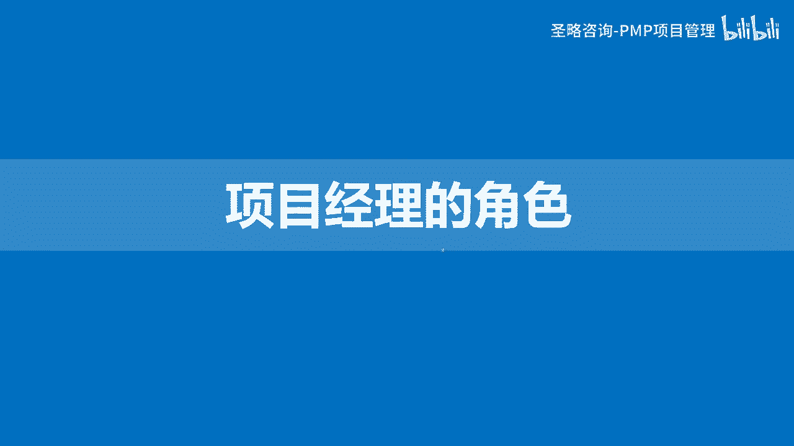

# 2-17.项目经理的角色 - P1 - 圣略咨询-PMP项目管理 - BV1VH4y137ao

大家好，欢迎参加胜率咨询p mp精讲课程，我是老杨，这一讲我们来看看项目经理的角色。

那么我们作为项目经理啊，我们要去带好项目，首先你得要把自己的这个角色给定位清楚，那么我们这个整个PBOOK上，对项目经理的角色的描述呢分成四个层次，第一个是两个角度，第二个是三个层面。

第三个是人才三角模型啊，第四个是五大关系，但是这里的人才三角模型呢，哎我们有两个模型，第一个模型呢就叫新新三角啊，第二个模型呢叫旧三角，我们先讲旧三角，就三角，其实是在2018年左右的时候开始提出来啊。

那么新三角呢，其实是从2022年开始提出来的，那我们新旧三角我们都来看一看，对比一下他们的这个区别，那我们一个一个来看。

首先我们来看两个角度，那么两个角度其实指的就是两个目标啊，我们说项目经理他要带领团队实现项目目标，这是他最基本的，我们要做好项目交付成果，项目以结果为导向嘛，对不对，当然做好项目交付成果这个重要。

但是它不是最重要的，那真正的重要其实是战略目标，因为我们前面讲过，项目需要帮组织实现商业价值，那么你如果只是交付了一个完美的成果，但最终这个成果没有给组织带来利益，没有给组织带来价值。

那其实这是一个失败的项目，所以我们不光得要埋头低头啊，看路还得抬头看天啊，所以就是两个目标，那么在这个过程中，我们要注意项目经理扮演什么角色，项目经理他不是亲自下场操刀干活的人啊，项目经理是一个领导者。

他是一个管理者，他是带领团队干活的人，就像这个演奏会的现场项目经理，他不是在下面啊，这些乐手什么啊，这个这个大提琴的小提琴啊，啊什么管乐弦乐，不是这些人，那项目地是站在这儿的指挥者啊。

就是他不是自己亲自下场干活，他是吗，需要带领大家干活，这个时候我们要搞清楚，项目经理需不需要懂技术啊，这个我们认为项目经理最好懂技术，但是它不需要精通技术，为什么具体的事不用他干，但是他要协调别人干。

如果你想真正的去协调好别人干活，那么你每一种乐器你都得多多少少懂一点，否则的话你是没有办法去协调大家，统一步调目标，一致达成目标的啊，好那么接下来第二个维度是三个层面做整合，因为我们前面讲过。

项目其实是在一个复杂的环境下运行的，那么在这个复杂的环境下面会有很多的冲突，有很多的矛盾啊，那么这个时候我们就需要去整合，那么就是要去协调这种矛盾，而这种协调矛盾呢其实就是一种整合的理念。

那么整合呢它分成三个层面整合，第一个在过程层面做整合，过程是什么，过程是整个项目的流程，过程是49个过程啊，什么收集需求定义范围啊，创建WBS，实施整体变更控制等，这都是过程，那么这些过程之间有关联吗。

一定是相互关联，相辅相成，相互制约的啊，每一个过程你不能孤立的去看待或对待他们啊，你比如说我随便讲一个客户，提一个增加功能的变更，那此时它会直接影响我们的什么范围目标，对不对，那请问它影响成本吗。

它影响进度吗，它影响风险吗，它影响质量吗，回答肯定的啊，是不是，所以我们不能站在范围的角度看范围，我要站在整个项目的宏观角度看范围啊，这才是在过程里面做整合，你要去在各个平衡。

各个相互冲突和制约的目标层面，去做综合的分析和平衡，最后实现整体目标的最优，所以在过程层面做整合，第二在认知层面做整合，什么叫认知，我们经常讲诶，我们要学习，我们要提升自我认知水平，什么意思呢。

就是加强学习学知识，整合知识啊，啊，我们要现在我们的这个社会每天在不断的发展，我们的技术月薪啊日新月异是吧，我们有不同，不断有新好的方法，新的方法出现，我们要去学习，去掌握。

把这些方法运用在项目过程之中，所以整合知识就是认知层面的整合啊，那第三个是背景层面整合是吧，我们的环境乌卡时代不断的变化，那今天政策变，明天技术变，后天行业标准变，这些你要不要了解，当然得了解。

你要把这些信息综合利用，看看哪些信息对你有帮助，用起来，哪些信息对你有负面影响，我要解决它，所以我们要去整合信息来确保项目的成功，这个就叫在背景层面做整合啊，那这是第二个维度啊。

在三个层面做整合，那第三个就是人才三角模型，那么我们这里面我们刚刚讲过，有新三角和旧三角啊，新三角项目管理专业能力，领导力，战略商业管理能力啊啊这是旧三角啊，新三角工作方式影响力，还有商业敏锐度。

那我这一讲我们先不讲这个新三角形三角，我们放到最后去讲啊，啊不是最后就是接下面的大概两三个视频之后。

我们再讲它，我们先还是讲旧三角啊，那么旧三角呢，啊。

这里面其实讲的就是我们项目管理的专业技能，你做好项目的能力，然后领导力，因为项目经理什么，他是带领团队实现项目目标的，所以你要发挥领导力，那战略和商业管理能力呢，指的就是我们需要去关注组织的战略目标。

我们要去关注组织商业价值的实现，所以这是旧三角，那新三角呢工作方式，能抓老鼠就是好猫是吧，你只要把项目做成，我管你用什么方法，那影响力我不光是领导团队，我还要影响客户，影响供应商。

影响其他一切能够为项目提供帮助的人，那商业敏锐度，我们要有商业洞察能力，我们不光是关注组织战略，我还要关注外部环境，其实这就是星球三角大概的区别，那这一讲我不展开啊。

这一讲我只是在讲项目经理的这四个维度，去对它进行一个定义，那我们下一讲才会去对三角模型再进行展开啊。

好那接下来我们来看第四个维度叫五大关系，五大关系指的就是项目经理的影响力范围，我们项目经理往那一杵，往那一站，你能影响到哪，其实你的影响力范围决定了你的啊，你的地位决定了你的这个未来，你的路可以走多远。

我们要不断修炼是吧，所以首先我们最近的关系是什么，我要影响团队，是项目内部，就是团队的关系，我要影响这帮人能够好好把事儿干成呗啊，这是最直接的影响力的发挥啊，那第二个是影响组织是吧，你想要把项目干成。

不是说你团队努力就够了，还要什么，你要考虑组织资源的限制，你还要考虑其他项目是不是抢资源，你还要考虑其他职能经理能不能帮你啊，还包括你的领导，那他们会不会给你支持，所以你要影响他们啊。

那第三跟行业的关系是我们的行业，行业的动态，我们的行业的技术革新，我们行业的标准，你要不要去关注，你要不要去去利用这些东西把项目做好呢，好，然后专业学科我们说做项目管理专业的啊。

那我们这个专业领域我们有敏捷方法，我们有商业分析的过程啊，我们有新产品开发的这些理念啊，我们有各种的工具啊，各种的领导力模型要不要学，你要不学，你怎么管好团队，不学你怎么管好项目是吧好，那最后是跨领域。

跨领域其实是一种推广，比如说我我们是IT行业的啊，或者说我们是金融领域的，我有一哥们儿是医疗生物医疗的，我还有一哥们是做航空航天的啊，还有一哥们做什么哎，做那个呃这个这个建筑工程的。

大家是不是每个行业自己都会有一些好的方法，好的方法是不是可以相互学习啊，我把我的贡献给你，你又把你的贡献给他啊，他把他的贡献给这个，这个就贡献给我，是不是大家形成这种网状啊，这种结构化这种网状的关系。

那么这样的话，大家是不是知识就在不断的相互学习，只有大家把这些知识相互去学习啊，那么我们的这个项目管理专业，是不是就会变得越来越成熟，项目管理这个学科这个专业越来越成熟。

那我们项目成功的概率是不是就越来越高呢，所以这就是跨领域，我们要去推广普及项目管理知识，这是我们项目经理的最终的中则啊，好，这就是我们关于对项目进这个角色的，四个维度的定义啊，两个目标也是两个角度。

三个层面做整合啊，然后呢人才三角模型里面的引导力，什么商业和战略管理的能力，还有什么项目管理专业能力，以及我们的这个这个五个关系啊，从内到外的五大关系，决定了你项目经理的路能够走得多宽，走得多远。

好这一讲我们就先到这儿。

