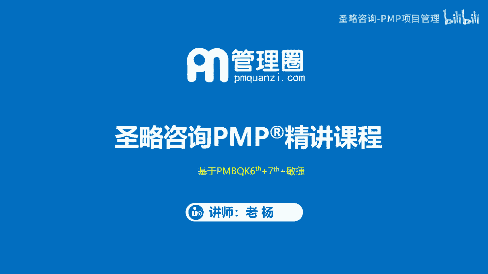
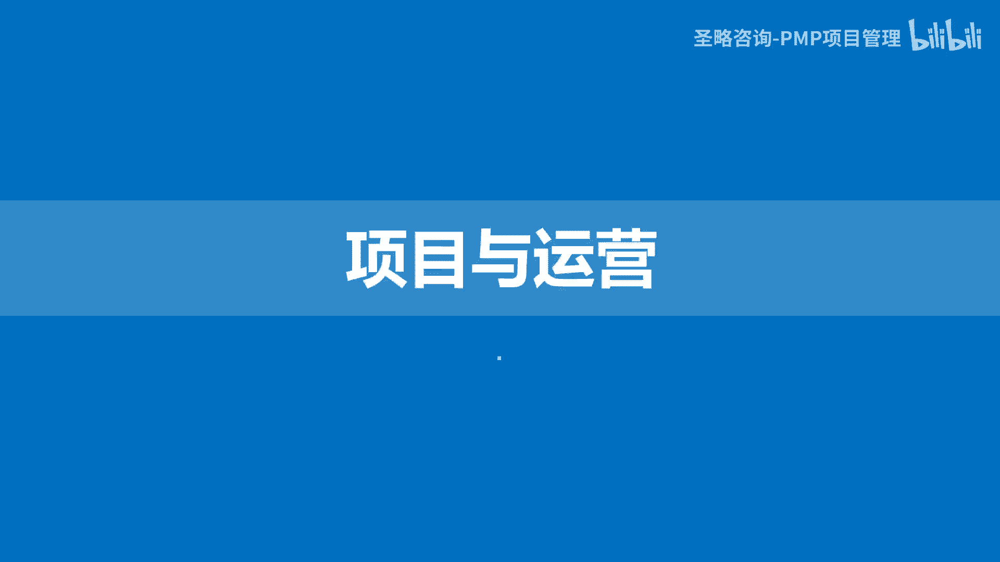
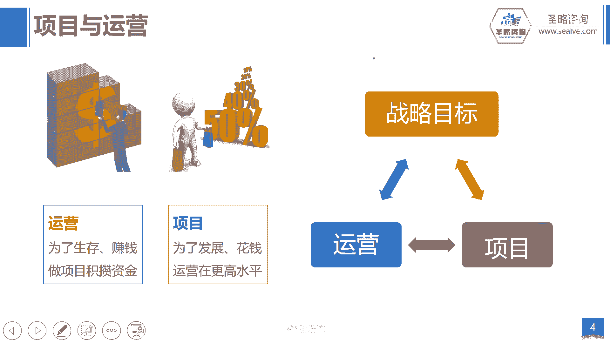
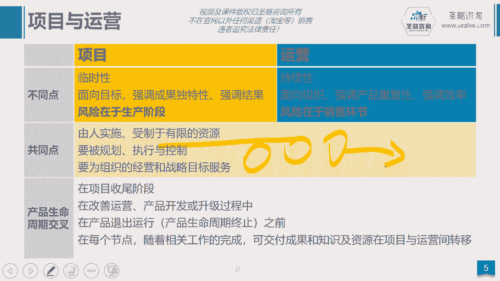
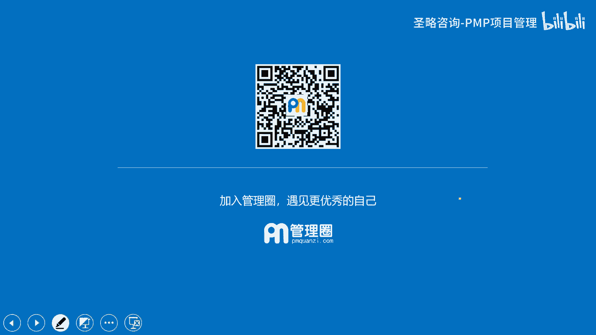

# 2-3.项目与运营 - P1 - 圣略咨询-PMP项目管理 - BV1JJ4m1W7Gh

大家好，欢迎参加胜率咨询p mp精讲课程，我是老杨，这一讲我们来看看项目与运营的区别，我们说对于企业来讲啊。

他需要靠两条腿来走路，这两条腿分别就是项目和运营，比如说我们拿苹果举例子，苹果这家公司他每天把订单下给生产企业工厂，然后呢工厂生产出产品，最后把它下放到各个渠道去进行销售，卖给消费者。

那这个过程是什么呢，啊我们相信大家应该能够判断出来，他不是项目，他是在做运营，那企业通过这种周而复始持续的过程，通过这个运营的过程来给企业赚取利润，好当然有一天市场它这个产品啊，这个IPHONE14呢。

可能已经啊这个被其他的竞争对手所超越了，它的功能呢已经满足不了用户的需求了，这个时候，苹果这家公司又开始投入大量的资金资源，去开发新的产品，譬如说开发出了新款的IPHONE15，那这个过程叫什么呢。

这个过程就叫做项目啊，我们投入一些资金资源，通过一个临时的过程去开发出一款新的产品，那么通过这个新产品的开发，这个项目来把我们的企业的运营水平从IPHONE14，把它提升到了什么呢。

IPHONE15的高度，然后又过了一段时间，可能又提升了IPHONE16的高度，所以你看项目跟运营，他们是不是一个相辅相成的关系，运营呢是持续的为企业创造价值，而项目呢是持续的。

不断的把企业呢推向一个更高的运营水平，让企业实现一个跳跃式的发展，当然不管怎么样，他们两者最终都是为了组织的战略目标服务。

那我们总结一下项目其实强调的是临时的，从今天开始，有一天要结束啊，同时项目强调的是追求独特的结果，比如说IPHONE14和IPHONE15之间，如果他们两个没有任何的差异性，消费者是不会买单的。

所以我要强调的是，15比14性能更强，摄像更清晰啊，强调的是独特性啊，好那么同时项目的风险在生产阶段，为什么呢，因为我这个开发新产品，它就会有一个风险，这个产品能不能开发的出来呢，因为我以前没有做过。

我能不能开发出来呢，所以很多的新产品研发项目半途中止啊，那么所以它的风险在于能不能做出来，而我们再看运营，运营强调的是个持续的过程，他当然希望市场一直需要IPHONE14这个产品。

它不断的卖一年两年3年十年20年30年啊，他希望这样子，当然他做不到而已啊，好，那么另外我们的运营强调的是一个重复的过程，在生产线下来的两台苹果14手机，我一定是希望他们通过仪器和肉眼。

都分辨不出来差别，一旦他们两个有差别，那就是废品好，那么运营的风险在于销售环节啊，他不会担心我能不能做出来这个产品，他担心的是我开发了我生产了那么多的产品，放在仓库，它能不能卖得出去呢。

这是他们的共同点，他们的共同点是什么呢，都是由人实施的，都受制于资源啊，都需要规划执行和控制，最终都需要服务于组织的战略和目标，好他们在整个产品生命周期持续交叉，你比如说项目结束的时候。

成果转移到运营过程，实现了一次交叉，运营水平不足的时候啊，运营转去新的项目开发，实现了一次交叉，而且我们后面会讲敏捷方法，敏捷方法强度是不断的，把一个大的项目拆成小小的迭代。

在每一个迭代或者是每个阶段结束的时候，去交付产品，给到我们的市场和用户啊，快速的迭代式的交付，所以那就实现了持续的交叉，所以在整个产品生命周期当中，项目跟运营呈现持续交叉的这么一个过程啊。

当然运营不是我们的重点，我们只是简单的用它来对比一下项目的特征。

好这一讲的内容就到这里结束。

