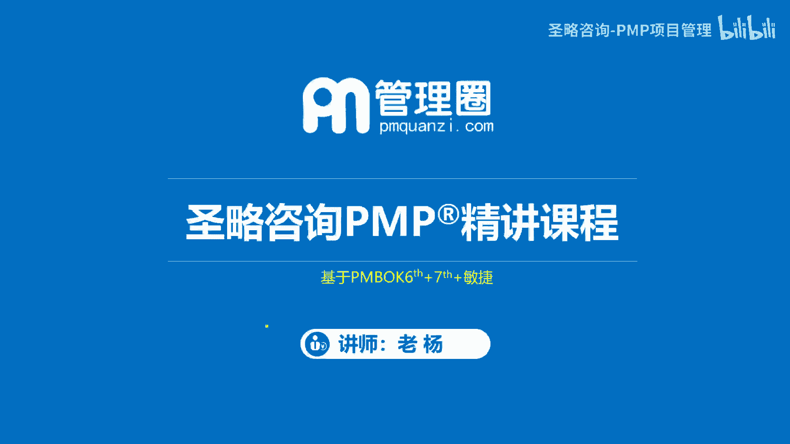
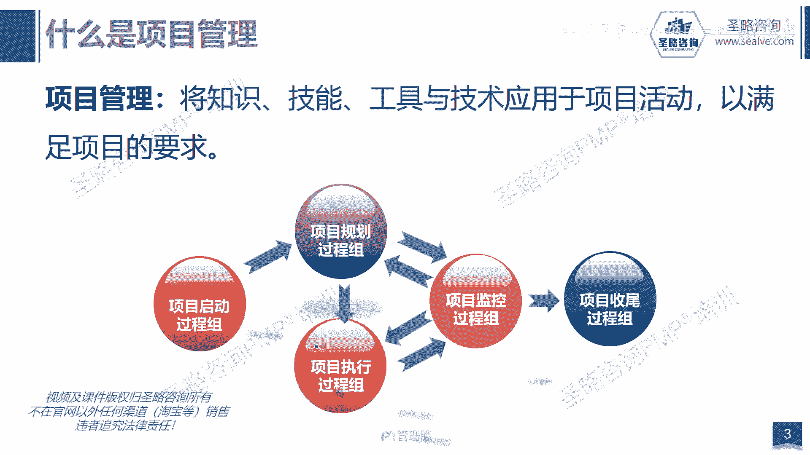
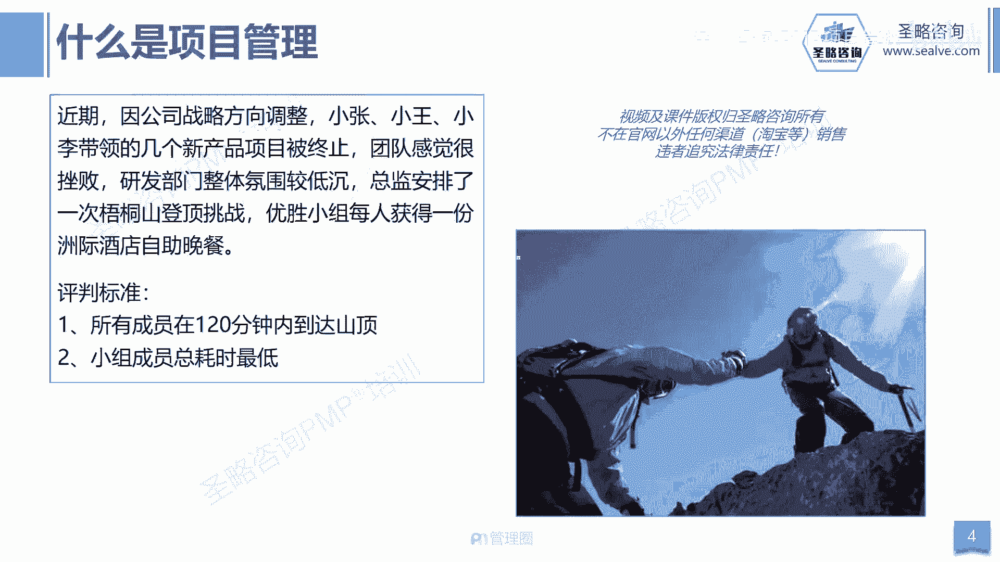
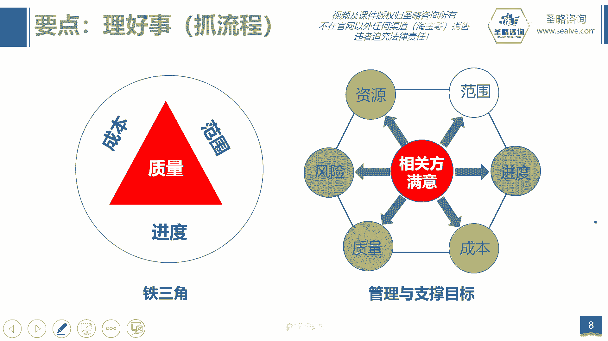

# 2-4.项目管理核心要素 - P1 - 圣略咨询-PMP项目管理 - BV15D421H7TA

大家好，欢迎参加胜率咨询p mp精讲课程，我是老杨，这一讲我们来一起看一下项目管理的核心要素。

首先我们来看什么是项目管理，PMBOK的官方定义，项目管理是将知识技能，工具和技术应用到项目活动，以满足项目的要求，那这里的知识指的就是，以往有没有做过类似的项目，有没有经验，那技能，各种软技能。

沟通谈判，人际交往，领导力，人际关系技能等等，那工具和技术，当然就是指我们在项目管理过程中，用到的各种工具，模板啊等等啊，像头脑风暴啊，像问卷啊，像访谈等等，把它应用到项目管理工作中。

满足最终项目的要求，这个过程就叫项目管理啊。

那其实我们在上节课讲到了项目的特征，我们说项目有临时独特渐进明细，其实你按这个特征来套的话，我们认为凡事都是项目，任何一件事情，你都可以用项目的方式来进行开展，那既然凡是接项目，那任何一件事情。

其实你都可以用项目化的思维来进行管理啊，反正最终就是啊这个在规定的时间之内，去按要求完成一件事情，最终获得相关方的满意，那么只要能达成这个目标，其实它就是一个项目管理的思维和逻辑啊，那当然了。

我们说对于项目经理而言，管好项目并不是件好，不是一件容易的事，因为你既要交付合格的功能完成啊，这个要求的功能，又需要去在规定的时间内完成它，同时又要控制好成本，那么又得要去满足质量要求。

最终你还得让客户相关方等等都满意，所以这个过程并不容易，那么既然如此的话，那我们就需要去抓住项目管理的。

一些核心的要点啊，那我认为啊，项目管理的核心要点至少从这三个方面入手，那第一个方面就是抓需求，我们说需求是万恶之源啊，那如果没有需求，其实也就没有项目，我们要去搞清楚用户的真正的需求，最终去实现它。

你的项目才能够成功，那第二个就是管好人，因为我们说其实需求再难管，那最终的本质都是人，也就是说需求其实最终是人提出来的，那么你如果想要去管好需求，那最终的目标当然是为了要管好人，那最后就是要你好事。

那么你好事呢，我们更多的强调的其实就是，平衡关系来去抓流程，那么这三个点其实就可以，对应到我们新版的PM考试的考纲，你看商业环境其实就是啊要搞清楚需求的本质，搞清楚企业目前面临的问题，去解决问题。

抓住需求，那管好人是不是人的维度占42%啊，那最后平衡关系，你好事你好事，其实就是抓流程，你比如说你要做好整合，你要去做好进度管理，你需要去做好需求管理，你需要去做好变更的处理，那这其实就是一些流程。

而这些流程我们统称为过程，那所以回归到我们的考点，就是8%的商业环境，42%的人以及50%的过程，或者叫流程，那么首先我们讲到需求，那么对需求来讲，那我们一般讲到需求就会提到这个市场需求，用户需求。

那么需求来自哪，其实需求来自于市场是吧，需求来自于用户啊，那么如果需求没有做好的话，你的项目注定会失败，那么讲到需求，我经常会拿这些案例，比如说苹果和诺基亚这个老掉牙的案例，那我说啊。

诺基亚曾经的手机霸主地位，而苹果呢作为后起之秀，他们两个的命运怎么样，诺基亚已经是销声匿迹是吧，而苹果呢是如日中天，那到底什么原因啊，是不是因为这个诺基亚没有抓住啊，这个需求呢。

其实我们并不能说诺基亚没有抓住需求，那么讲到需求，他只是在后续在智能啊，在这个这个呃智能手机时代，他可能掉了对啊，他可能没有去把握住用户体验，但是你说诺基亚他没有抓住需求吗。

其实他抓住的需求我可以这样讲啊，到目前为止啊，如果按单一型号的手机来讲的话，销量最高的其实并不是苹果啊，我们一直以为啊，很多人都以为苹果六是一个划时代意义的产品，苹果六啊就是神的存在。

但是啊其实诺基亚还有一款手机叫1110，1100就是这款手机，那么它啊他的是这个最终的这种销量总额啊，那么其实已经达到了2。5亿的啊，这个可怕的啊这个数据，而苹果六呢只有2。2亿的这个数据。

那么你说诺基亚他为什么做的这么好呢，因为我总结了一句话，我说手机该有的功能它都没有啊，而手机不该有的功能它都有，那其实它有些什么功能呢，它有的就是分组存储电话簿的功能啊。

它有的就是可以按分钟按秒来计时的功能啊，有人说这个算什么啊，这个独特的功能吗，我们以前家里的公用电话就有这个功能，其实它就是一个公用电话，它就是一个移动的公用电话。

那么他反而没有那些花里胡哨的什么听音乐啊，玩游戏啊，拍照没有啊，那么为什么这么简单的一个极简的手机，它能够抢占市场，就是因为它所面对的用户其实是亚洲的南部，那么亚洲南部呢其实就是穷在那个地方。

其实大家都没有钱，但是他们也需要社交，需要对外去交流，所以我们全村人可以一起买一部手机，而全村人一起买一部手机的话，那么就需要有隐私的啊这个保护，所以每个人打开这个手机，输入密码进去。

看到的是自己存储的电话号号码，不那么同时每个人去打电话，都会在自己的系统里面去计费，所以它其实就是一个移动的公用电话啊，那么他之所以成功，就是因为他抓住的那个市场的需求。

那么苹果成功其实他也是抓住了市场的需求，所以任何一个成功的项目，一个成功的产品的背后，一定是抓住了用户真正的需求，你才能成功啊，那么除了需求以外，第二个我刚讲过，其实归根结底啊。

那么需求他最终是由人提出来的，那么这个人在我们的项目管里面叫相关方，又叫干系人，注意啊，又叫干系人，为什么呢，因为第六版的PMBOK里面叫相关方，而第七版的PMBOK和敏捷里面都叫干系人。

那么指的就是跟项目有关的人，跟项目有关系的人啊，影响项目的人和受项目影响的人，那如果这么一分析，那就太多了啊，就像我们开篇我们讲到这个五大涡轮组织时候，我讲到了你找对象这个案例。

那么站在找对象这个案例来讲的话，你说有多少个相关方呢，你看啊你是相关的吗，啊你自己，那你的父母是吧，那你的女朋友是吧啊你的女朋友的父母是吧，他的同学是吧，他的同事也是吧是吧。

那么你的兄弟姐妹也是吗啊包括她的前男友，你的前女友，那她的沟都可能是你的啊，这个相关方或感性人，那其实包括很多的你可能都没有想到的，他最终都有可能会给你的项目造成障碍，你比如说今天在外面吃饭。

可能遇到一个路人甲啊，那么他对你的女朋友可能会看上了是吧，还展开追求，那他也可能会成为相关吗，所以相关方这个群体太大太庞大了，导致了我们特别难去管理它，而相关方的管理呢，他可能又决定了我们项目管理。

在某种意义上来讲，而相关方管理它可能决定了项目的成败啊，当然我们最终在第13章有专门的章节来讲，相关方的管理，包括在干性的技效率里面，也会有专门的干系人来进行一个讲解啊，好那么最后一个呢就是你好事。

你好事就是平和好关系去抓流程，那我们讲的项目的核心的目标就是多快好，省是吧，要范围多是吧，功能多，成本省啊，质量好，进度快啊，但是你想想不可能有这么好的事儿，天底下所有的好事都让你一个人给全占了吗。

那是不可能的，所以多快好省，我们需要去平衡啊，那么我们需要在其中去做出取舍，做出平衡，那么去理好这些关系，其实你好这些关系的背后也就是你好人的关系，而这些目标之间它本身也是同等的重要啊。

你因为有的项目看范围，有的项目看成本，有的看进度也看质量，那不同的项目他可能关注的点不一样，但是呢我们归根结底来讲，其实整体来讲每个目标都是同等的重要，我们要根据啊相关方的要求，根据组织的特性。

根据环境，根据项目的本身的特性来去平衡和取舍，这些关系，最终啊实现项目的目标，最终实现相关方的满意度，所以我们要抓住核心，第一个是抓需求，第二个你好事，第三个呢就是管好人好。

这一讲我们就先讲到这。