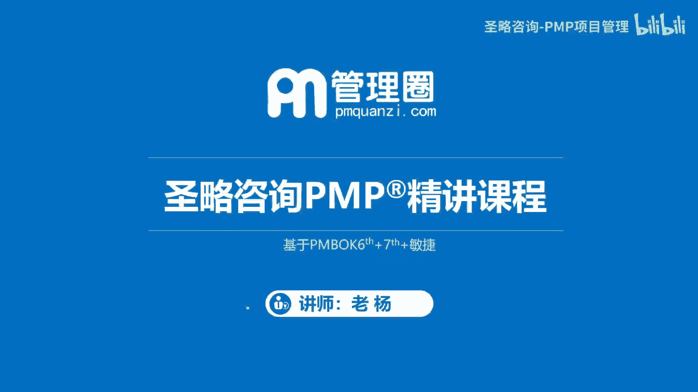
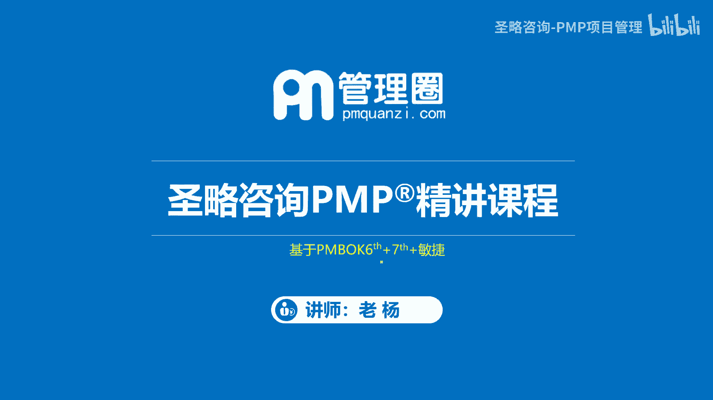
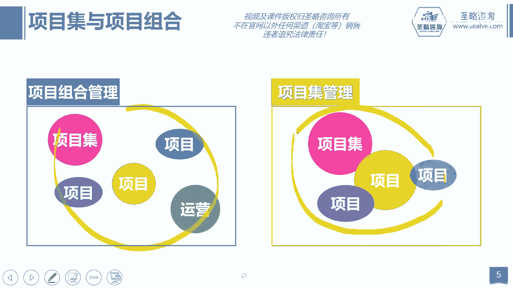
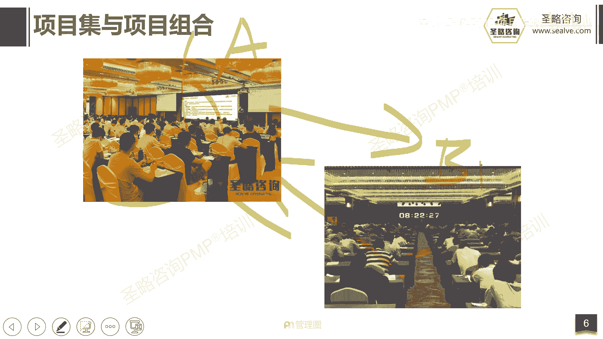
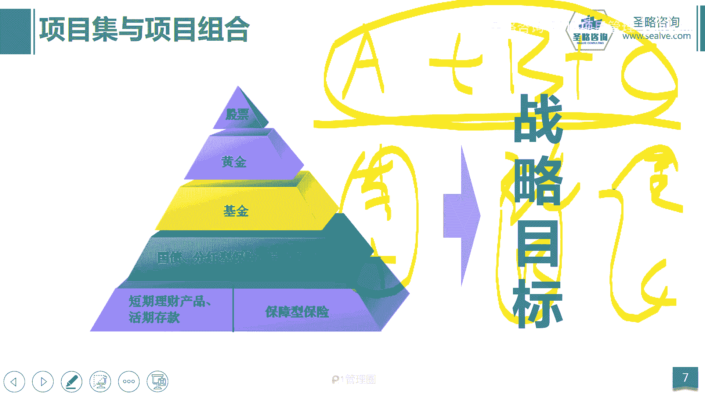

# 2-5.项目集与项目组合 - P1 - 圣略咨询-PMP项目管理 - BV1Rw4m127UC

大家好，欢迎参加胜利咨询p mp精讲课程，我是老杨。

这一讲我们来看看项目给予项目组合，那项目集与项目组合呢，它是比项目更大的一个单位，首先我们来看概念，项目集强调的是一组相互关联，被协调管理的项目或项目企业，也就是说可能会有多个项目。

哎我们在一起协调他们的内在的联系，而且关系最后呢实现我们最终的利益的最大化，所以它有三个特征，第一正确的开展项目，项目集或子项目，也就是说我们要去通过努力，通过做好计划。

最终去达成我们的每一个项目的目标，那其次呢我们管理它内在的关联性啊，也就是说唉他们内在一定是要有关联性，才叫项目集，第三我们要去实现1+1大于二的效果，也就是说我们假设啊。

哎我们这里这里有ABC3个项目，那A项目单独管赚50万，B项目单独管赚50万，C项目单独管也赚50万，我现在三个范围起来管他可以赚到200万，那就实现了1+1大于二的效果，所以项目级呢我们强调什么。

强调的是管理内在的联系啊，就是一系列相互关联被统一协调管理的啊，这样的啊，这个呃项目或项目集，所以它的关键词叫内在的联系，那接下来是项目组合，项目组和他是为了组织的战略目标而统一。

一起管理的项目和项目集，还有一些运营工作，所以它的特征是统一管理啊，那么最终我们需要在为了组织的战略目标啊，比如我们定的组织一个战略目标，那接下来呢这里面有很多个项目唉，我们来一起去管理。

那最终就是为了实现整个占用标，那这些放在一起管理的项目，它可以没有任何的关系啊，他可以没有任何的联系，他可能只是为了共享一下，组织的资金或者资源啊，或者简单简单来讲就是放在一起，统一管理而已啊。

所以它的特征正确的啊，开展正确的项目啊，那么什么叫开展正确的地方，就是我看哪个项目对我的组织战略更有帮助，我就选哪个项目啊，我怕确保我选择项目的正确性啊，或者简单理解就是假设我有ABCDE。

四个五个项目可以选，那我看哪一个项目对组织的战略最有帮助，我排一个专辑啊，比如说A排第一，B排第二，C排第四，那D排第三，E排第五诶，排完优先级之后，最后因为我资金资源有限，所以我最终选了AD啊。

D这三个优先级比较高的项目，而我放弃了一哈，还有这个D这两个项目，这其实是在干嘛，其实在做选择，做优先级的排序来排序的原则啊，就其实就是组织的战略，那最后他强调的是统一管理。

就这些项目放在一起统一管而已，他们可以没有任何的内在的联系啊，好他们的关系，那么不管是做项目也好，做项目集也罢，最终其实都是服务于组织的战略目标，而项目组合的更大一些。

因为它还需要直接服务于组织战略目标，他需要在为了组织战略目标而去，在项目与项目之间去做出一些取舍啊，那再往下是项目集，项目集里面有一系列相互关联的项目啊，好那么我们来看这张图，你会更加清晰。

你看左边这个就是什么，就是项目组合，因为这里面有很多的项目啊，甚至还有非项目的工作，他们统一一起管理而已啊，他们没有任何内在的联系，只是在共享资金，共享资源好，那右边这个就是项目集，你看它们之间有交叠。

有交叠有交叉，那说明他们是有内在联系的，所以项目集关注的是内在联系啊的一个管理，确保实现利益价值的最大化，好接下来我们来看案例。

譬如说我们现在大家跟我老杨一起，我们其实就在做项目，我们至少做两个项目，第一个你们和我一起，用三个多月的时间来去上课，来去复习，来去备考，这是一个A项目，就是偏僻备考的项目啊。

那其次呢等到我们考试日那天，我们还会花一天的时间去做一个项目，就是偏比考试，那这两个项目之间其实就是什么项目集，因为它不光是在共享你的资金，共享你的时间，他还在强调内在的关联性。

你比如说我们通过三个月的时间来备考和学习，是不是让我们的考试更容易通过，如果你没有学习，你直接去考的话，那你通过的可能性可能二十三十%，但是如果你跟着我一起用三个月的时间来学习。

那你通过考试的概率可以上升到八十九十，对吧好，所以以通过学习，让我们的考试目标更容易达成啊，它促进了他好，那么接下来呢我们说有人讲老杨，我想学项目管理，我说学项目管理可以啊，啊上课呗。

但是你你说你不考试，其实你会发现很难有人啊，现在在我们这个进入职场之后，还会花那么几个月的时间去努力的去学习啊，一个新的东西啊，你其实缺少一个动力，这个时候呢如果你交了考试费。

你其实就会有一个考试的动力，第一我交了那么多钱，我得通过，第二如果我没有通过我的同事，我的家人，我的朋友可能会嘲笑我是吧，所以我要好面子，那么基于这两个目标呢，接下来你说我好好的努力的复习。

那么其实在你复习的过程中，你会掌握更多的知识，掌握做到很多做项目的一些这个实践经验啊，所以通过考试这个目标又反而促进了你的学习，这两者之间就是相辅相成。

相互促进的一个关系，所以它是项目积，那另外我们再看我们经常讲的投资，其实投资叫投资组合啊，为什么呢，因为当你钱少的时候，你会在多个项目里面去做选择，比如说十只股票，我选两只是在股票，债券和基金里面。

我选择基金和股票，放弃了债券，那其实这是在做选择，那另外你统一管和单独管，带来的收益是一样的啊，你比如说你今天买一只A股票啊，然后再买了一只B股票，再买了一只C的基金啊，那这三个你是一起买统一管理。

那另外你另外一个小伙伴啊，这个小李就是小李，他买了一只A股票啊，小张他买了一只B股票啊，小小王他买了一个C的基金啊，他们你们三人加在一起买的，比这个你买的东西啊，和他们仨加在一起买的东西是一样的。

假设你们是以统一的时间买进，然后共同持有一个月，然后统一的啊掐着秒表的时间把它卖出，最后其实你可以比一下，你一个人持有的这三个产品赚的更多呢，还是他们仨加在一起赚得更多呢，其实是没有任何差别的。

都是一样，就是1+1=2的这么一个结果，所以这就是项目组合，它其实就是把一些的啊，可能不是那么相关的啊，没有省任何关系的项目放在一起统一管理啊，最后服务于组织的战略，那这就是项目组合啊。

所以我们再总结一下，项目及关注的是项目之间的内在联系啊，那项目组合呢其实只是统一管理，为了组织的战略目标去对项目做选择和做取舍。

好这一讲我们的内容就到这结束。

