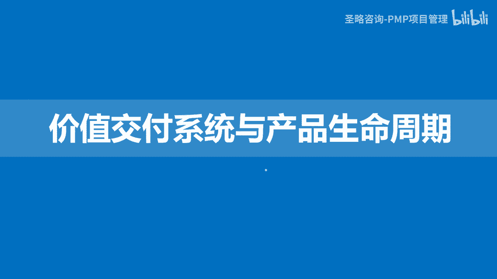
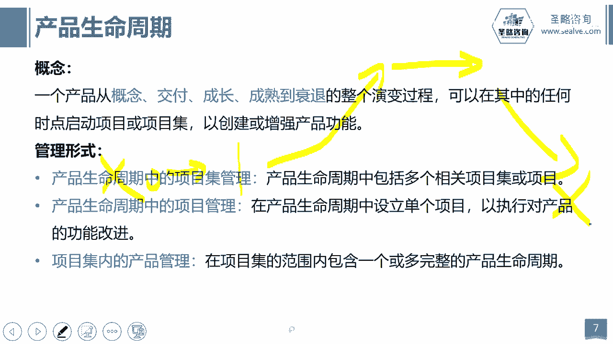
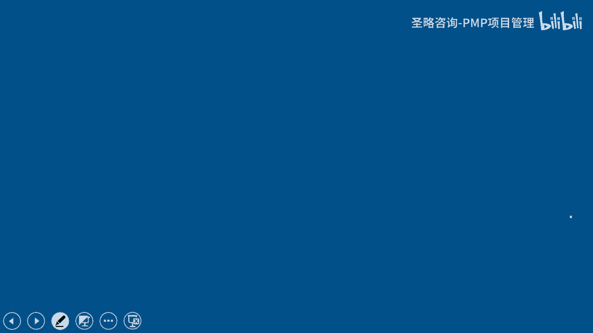

# 2-6.价值交付系统 - P1 - 圣略咨询-PMP项目管理 - BV1wJ4m1p7ka

大家好，欢迎参加胜利咨询P精讲课程，我是老杨，这一讲，我们来看一看价值交付系统以及产品生命周期，那么在讲这个课题之前。

我们先讲一个不是那么重要的概念，叫组织及项目管理啊，那为什么说它不是那么的重要，因为咱们考p mp组织及项目管理，其实离我们项目经理还是稍微有一点点距离，但是我们还是得讲啊。

因为它跟我们的整个价值交付系统，还是有一些关系的好，那么这个组织级项目管理它是为了干什么呢，啊譬如说我们在前面的内容里面，上面两讲里面我们讲到了这个组织变革是吧，我们说项目可以去驱动组织进行变更。

或者叫变革，但是你会发现，如果真的是由项目经理来去推动组织进行变革，是很难的，因为项目经理的确是他的权利，他非常有限，你如果是自下而上的去推动的这种变革啊，我们把它称为造反，其实很难啊，你很难推进。

那么你发现你推不进的，最终呢只会让我们的项目经理产生一些挫败感，就是无论怎么努力啊，最后都会被组织的现状给打回原形，为什么呢，因为我们讲其实真正想要变革，最好的方式应该是自杀，自上而下的一种驱动啊。

如果我们的组织层面，没有从战略层面去描绘组织的战略和愿景，那么你的变革是很难去推进的，所以OPM呢其实就是这样一种理念，它其实强调的是从组织的层面来去驱动，我们的项目组合。

项目及项目管理的这种规范流程的一个管理啊，那么这个就是组织及项目管理，他其实帮我们的项目管理，项目集管理，项目组合管理提供了一种框架的一个支撑，来去驱动我们的项目组合，项目集项目的一个这个更有效的。

目标的达成和管理啊，所以他强调的是组织层面的责任，那么项目经理呢我们可能层次还不是太够，但是我们当我们学完偏僻之后呢，我们需要去了解一下组织及项目管理这个课题，那这个我们就不深入的去讲解它好。

我们大概呢讲的这些内容啊，你看哎组织及项目管理也好啊，包括项目组合也好，项目级也好，项目单个项目管理也好，那我们再去捋一捋他们的关系啊，首先呢我们说其实刚刚讲过组织项目管理的。

他是强调从战略层面去驱动我们的项目组合，项目集和项目管理，它提供了一种指导框架，那么这种指导框架的指导之下，我们项目经理去推进项目就会更加的有序，更加的有效，更加的可控啊，那接下来项目组合呢。

强调的是为了组织的这种战略啊，去做项目的选择和取舍，排优先级，哪些项目要做，哪些不做，而项目集管理呢，是在我们已经选择好的项目之间呢，来去管理好他们之间的内在联系，以实现我们最终的价值最大化，那当然。

单一项目管理是为了努力实现最终项目的，特定的可交付成果和目标，那反过来呢我们通过项目目标的实现，项目及目标的实现，那最终又会啊去啊，这个匹配我们的组织的战略，帮助组织去实现最终的效益，创造价值。

所以这个时候我们就讲到了价值交付系统啊，那么价值交付系统其实强调的就是，帮组织创造价值的一个系统，或者叫一系列的战略业务活动，你项目组合也好，你项目集也好是吧，你单项目管理也好，包括你的产品和运营。

其实都是我们价值交付系统的一个组成部分，那么你说组织创造什么价值啊，无非就是给他创造一个产品能够解决问题啊，无非就是最终帮组织产生这个啊，这个利润呢产生市值的增加啊，产生你的声誉和口碑啊。

或者是提升我们组织的效率，生产力等等，这其实都是帮组织创造价值，那么我们项目及项目组合而成，运营其实不都是为了这个目标而而去努力吗，啊，好我们来看看价值交付系统，它的一个大概的运行逻辑啊。

你看我们首先有什么啊，首先我们想要帮组织创造价值，他要去考虑到我们组织内部，外部的各种环境来去确定组织，接下来3年或5年的一个发展战略目标，那么有了战略目标之后呢，接下来我们就开始通过项目组合。

来去进行决策和决策啊，决策什么呢，哪些项目能够帮助我实现组织战略目标啊，哪些项目呢对战略目标没有那么大的帮助，或者说哪些项目当前对我的战略没有帮助啊，喂奶可能会有，所以我要做优先级的排序和取舍。

那么当我们做完优先级的排序和取舍之后，我们就开始进入到项目和项目级的管理的环节，我们通过项目及经理，项目经理来去带领团队努力的去实现项目标，去交付成果，但是当我们把成果交付之后，你会发现你项目的成果。

它本身是不会产生价值的，就像你比如说我们苹果公司是吧，它开发出的这款苹果14或者苹果15，这款手机，当他把手机开发出来的这一刻，其实项目已经结束了，你的成果已经交付给运营部门了。

那这个时候他并没有帮你产生价值，那最终我们的价值靠什么来产生呢，其实是靠运营，靠我们把可交付成果交付给运营部门之后，运营部门去市场上去运行，最后去把产品卖给我们的客户啊，帮助组织去创造价值，创造收益。

所以我们通过运营呢，来去反向的去帮助我们的组织，最终实现我们的价值啊，那这其实就是一个整体的价值交付系统的运行，的一个整体的大概的一个逻辑好，那么接下来我们再看一个概念，叫产品生命周期。

那么产品生命周期是什么意思呢，其实我们前面讲什么，讲组织驱动变革的时候，我们讲过了啊，我们说产品死亡策略其实就是产品生命周期，一个产品它基本上会符合这么一个特征是吧。

从这个市场上还没有这个产品开始还没有啊，这个是没有的，那我开始为了去解决我们呃用户的一些问题，那么我们创造一个产品出来，我把它从0~1给他创造出来，当我们创造出来之后呢，这个产品刚开始进入市场。

其实人家是不了解它的作用的，你不了解它的功能的，那我们需要干嘛，我们需要去教育市场，让大家开始选择，我们让大家开始喜欢我们啊，慢慢的我们这个产品进入到成熟阶段啊，无所不知无人不晓，这种成熟阶段好。

当然我们希望一个产品，它可以一直留在这个层次啊，一直停留在我每天做的产品出来，都可以有很多人在去追捧牌子，对购买啊，但是你会发现这是不可能的，为什么，因为人的需求永无止境，人的需求会变。

不光是人的需求会变，还有外部的搅局者，就可能会有其他的对手，他会率先推出更好的产品，那我的产品可能被迫什么被迫啊，黯然离场，就是离开这个市场，最终它会以什么退出市场而告终，我们会用新的产品来替代它。

那这一个过程就是一个产品生命周期，那这个产品生命周期其实是强调的是一个产品，从无到有啊，然后到成熟，然后到慢慢的被人们抛弃，最后黯然的离开市场好，那么产品生命周期呢它也有一些管理形式。

比如说产品生命周期里面可能会包含什么项目，及啊，你比如说我们一个大型的楼盘的设计，给给水系统，排水系统是吧，然后电力系统这其实都是单个单个的项目，但是他们之间并不是孤立的给水排水系统是吧。

哎你的什么甚至是垃圾回收系统，包括电力系统，他们之间是有内在的关联性的，这多个系统之间其实构成了一个项目集啊，而它其实又是隶属于整个楼盘这个产品的，所以在一个产品生命周期里面，它可以包含项目级的管理。

那当然产品生命周期里面，肯定还会包含项目管理，你比如说我可以把这个产品的开发啊，当成一个单项目，我也可以把这个产品的开发，之前的市场调研当成一个单项目，我也可以把产品开发出来之后的市场推广。

当成一个单个项目，所以这就是产品生命周期里面，那个啊这个单项目的管理，那么另外在项目集里面也有可能会有什么，也可能会有产品的管理是吧，你比如说我们要开发一个这个，大型的这个社区啊，在这个大型社区里面呢。

唉我本来原本是计划啊，要去开发一个这个儿童的娱乐这么一个设施，这是一个产品是好，那么但最终因为当我们的产品上线之后呢，啊它不符合我们的法律规范，被迫下线啊，最后我又重新开发了一个什么一个这个会所。

这么一个产品，那其实在这个项目集里面，它就包含了什么，包含了一个啊从无到有，再到无的这个娱乐系统啊，当然还有一个从无到有啊，最终也可能会经过几年之后，这个会所他没有办法再继续营业了。

他也可能会再到无的一个过程，所以在这里面就包含有多个多个产品，所以项目生命周期跟产品生命周期，还有跟项目企业之间，他们其实没有一个绝对的界限，他们之间可能会是个相互包含与被包含的，这么一个错综复杂关系。

当然他们其实最终也就构成了，我们的最终的价值交付系统，它帮我们组织去创造商业价值。

好这一讲的内容呢我们就到这里结束。

