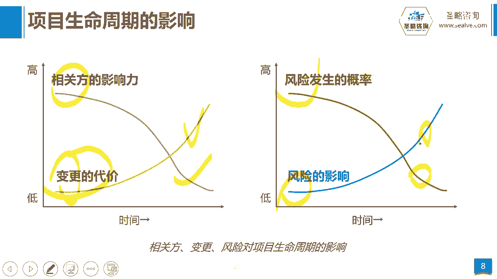

# 2-7.项目生命周期与阶段 - P1 - 圣略咨询-PMP项目管理 - BV13x4y167ab

大家好，欢迎参加战略咨询pp精讲课程，我是老杨，这一讲我们来看看项目生命周期与阶段。

那首先我们来看项目生命周期，它指的是一个项目，从启动到完成的一系列阶段的集合，他给项目管理提供了一个基本的框架，什么的基本框架呢就是启动规划开发，测试部署和收尾，那我们前面讲到的一个项目有启动是吧。

然后到收尾，它是一个临时的特征，而项目生命周期，其实临时就是在讲项目生命周期，它从启动到结束的一系列阶段的集合，比如一号启动，30号结束，这宗教经历什么呢，启动论证的过程啊，做计划的过程。

产品开发测试部署的过程，而还有最终收尾总结的过程，当然有人说哎呀老杨，那么怎么没有监控的，是不是漏了啊，监控当然有，但是监控他不是一个啊里面的框架，因为我们前面有讲过，监控要贯穿整个过程之中。

就说一个项目从启动开始一直到收尾，我们需要持续的去监控，以发现问题并解决问题，所以监控它不是划分在阶段当中的啊，他不会在生命周期中里面去做一个节点来划分，它应该是贯穿整个过程之中，那么讲到生命周期。

那么因为这里面提到了阶段的特征，所以我们来去看一看阶段又是什么阶段，它指的是一系列具有逻辑关系的，项目活动的集合啊，通常会以一个或多个成果的完成为结束，那么这个时候大家可以想象。

我们平时做项目有没有划分阶段，我相信一定会划分，那你比如说我做软件项目的时候，我会这么划分啊，什么概念阶段，可行性研究阶段，需求分析阶段和方案阶段，开发测试阶段，试运行，上线部署收尾等等。

这几个阶段是吧，我们都是这样划分的吧，那么你们的项目我相信也是万变不离其宗，那么只不过有些可能画得多一点，有些可能画的好一点，少一点嘛，啊那每一个阶段里面都有一些事要做，这些就叫活动。

比如说我们在做需求阶段，我们是不是要去跟用户访谈啊，我们是不是要搞头脑风暴啊，这就是一些具体的活动，从而去达成这个阶段的成果，每个阶段都会有这个对应的一个成果，那最终把所有建筑的成果完成的时候。

你项目是不是也就完成了呢，对不对，好，当然阶段的划分它可以因人而异，因项目而异，就是同一个项目，老杨来划分阶段可以划分十个，那你可能是划分阶段它只划分八个啊，或者另外的小李来划分它划分12个。

这个没有对错之分，为什么呢，因为阶段的划分它并不是一个刚性的要求，阶段的划分只是为了项目更加容易管控而已，那另外项目阶段的划分还跟项目的复杂性有关，那如果一个项目太复杂，我会多划分。

我甚至划分20个阶段，那如果简单，我可能划分六七个阶段就够了啊，当然我不管你怎么划分，那么你一定会符合一个框架，就是刚才讲的项目生命周期的框架，就是启动规划开发测试部署和收尾诶，只是在每一个小框框中间。

它到底有几个阶段的问题，比如说概念阶段，可行性研究阶段，这是属于启动这个框架里面的那需求方案，这个阶段属于规划这个框架里面的那开发，属于是开发的框架，那测试和试运行属于测试阶段的那部上限。

属于部署阶段的，那收尾属于收尾阶段，那它一定会最终会符合这里的六个部分，他一定会有什么关系啊，可能有的人他把规划里面都划分一个，划分成三个是吧，他把开发里面划分为两个，都有可能就是不管怎么划分。

万变不离其宗，它的整体的项目管理的框架结构是不会变的，那么阶段一般来讲会呈现这种顺序关系，但是它有可能是它有可能会有交点啊，啊为什么呢，因为我一个阶段结束之后，通过这个验收发现诶这个不对呀，不合格啊。

我要回去再继续做啊，是不是又出现了一个循环，所以他不一定会一个阶段结束，就一定会往下走，这时候我们要讲一个概念叫阶段的关口，那么阶段的关口是指一个阶段结束，到下一个阶段开始，中间这中间呢有一道关口。

这个关口里面其实有两道门，一个是关门是吧，一个是开门啊，好那么关是关上一个阶段的门，那么怎么决定关不关，就是看你上一个阶段的成果是否达成了要求，符合目标，符合标准，如果OK回答OK的话，那关上上一道门。

那是但是你要注意，并不是说我关上上一道门的同时，一定会打开下一道门，那下一道门开不开，取决于什么，取决于你项目当前的健康状况，取决于你项目跟组织战略匹配的这个程度，那如果你的项目出现了一些小问题。

我来纠偏纠偏，纠完之后呢，哎我在启动项目啊，再再开下一道门啊，先纠偏，那如果项目一切健康，一切顺利，跟组织战略还匹配，我当然继续开下一道门，那如果有些时候，你的项目已经出现了重大的问题。

组织的战略已经发生了变化，你的项目已经跟他不匹配了，那这个时候我可能要关门了，我不会再打开下一道门，所以我们把阶段的关口称为什么，继续启动项目或者是终止项目的，当然时间节点好，这是我们讲的生命周期阶段。

还有阶段的关口，那么阶段可以成顺序关系，一个阶段做完，做下一个，这个就比较保险，那当然还会有一些什么，像这个二和三之间的这种交流关系，他们两个有并行，就一个阶段没有完成，我就做下一个阶段。

但这种做法的话就可能会出现一些风险，我们讲的叫反攻的风险是吧好，那这是关于阶段啊，这个关口的概念，还有阶段生命周期的概念，那接下来我们再看一下在项目生命周期里面，你的资源和成本的一个投入的变化。

我们随着项目时间的推移，你看人和成本的投入是不是在缓慢上升，缓慢缓慢上升，然后什么唉急剧下降，就随着项目的结束急剧下降，但这个好理解，启动阶段不用投入太多资源，那规划阶段你会要开始投入精力和时间成本。

那大部分的股这个金钱啊，这个时间都投入在执行阶段，那随着你的项目要结束，要交付的时候，我们成本投入是不是马上就终止了，所以他这么一个关系，那另外我们再来看相关方变更风险，对项目生命周期的影响。

我们说啊随着项目时间的推移呀，项目相关方相关方又叫干系人，指的就是跟项目有关的人啊，跟项目有关的这些利益相关方，利益相关方对项目的影响力，也就是说它左右项目的程度，会随着项目时间的推移逐渐减小啊。

那为什么其实很容易理解，我们讲其实找对象也是一个项目，你比如说你假设你要去追求某一个女孩啊，所有的人都告诉你，她不适合你，你就放弃了呗，这个时候人家左右项目的能力是很强的，但是当你如果已经开始追求了。

你追求了三个月，五个月，花了一些代价了，这个时候很多人跟你讲，你们俩不合适，让你放弃，其实到这个阶段你是很难放弃的，因为我都已经投入那么多东西了，你让我放弃，我不甘心对吧，所以这些影响力它会逐渐减弱。

那变更的代价刚好相反，你早期人家说不要追她，我给你介绍另一个，那这个时候有什么代价没代价，但是如果已经五个月过去了，你都花了几万块钱了，这个时候人家跟你讲，不要追他，唉我给你换一个目标。

这个时候你是不甘心的，对不对，所以一旦这个时候你放弃，其实前面的这些时间，这些成本啊，投入都是你变更的代价，那接下来我们再看风险发生的概率，和风险的影响，它和时间的关系，风险发生的概率。

随着项目时间的推移啊，它会也是逐渐的减小，早期是风险的高发期，为什么呢，因为风险是不确定性因素，我早期对项目是吧，完全不了解是吧啊什么东西都不清楚，那当然就会有很多的风险啊，什么都有可能发生是吧。

但是随着我们的项目的推进，我掌握的信息越来越多啊，那么其实到了后面，我们发生风险的概率就会减少，那么当然风险发生的概率确实减少了，但是风险的影响它是跟它相反的，早期你不是项目。

我今天刚启动出现了一个风险，他说我项目黄掉了，那有什么影响呢，我都没投入多少资金啊，但是如果一个风险是，在我项目已经进行到一半的时候，你比如说哎我项目都马上要交付了啊，可能还剩一周就交付了。

结果呢一场风暴把我的这个服务器给我毁掉了，给我刮到啊，这个这个冲走了啊，那你说这个风险对我的影响有多大，所以越到项目的后期，那风险发生之后，给我产生的影响也是代价就会越大，所以这是生命周期和风险和变更。

和相关方之间的这种关系，那么这一讲我们的内容就到这结束。

