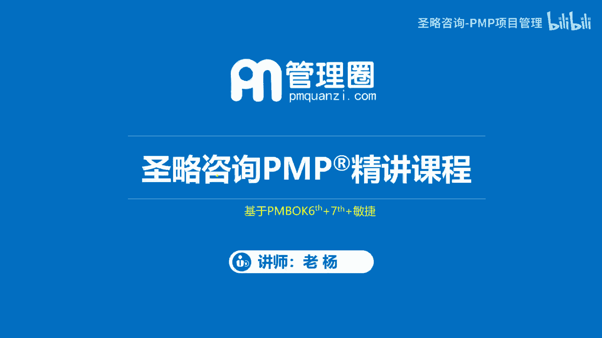
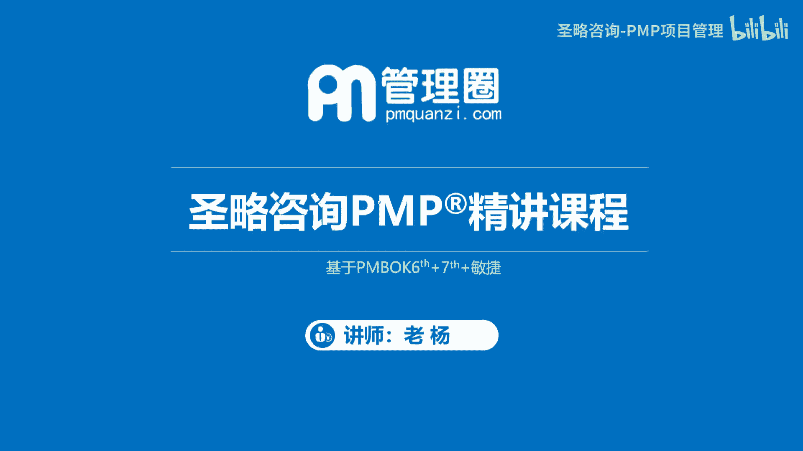
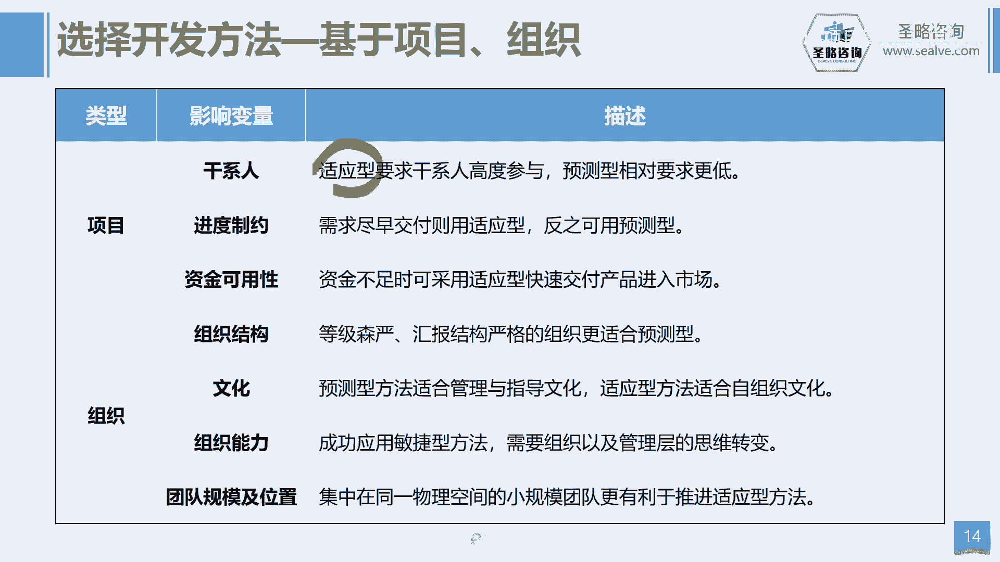

# 2-8.项目开发方法 - P1 - 圣略咨询-PMP项目管理 - BV1Ni421m7mk

大家好，欢迎参加省略咨询pp精讲课程，我是老杨。

这一讲我们来一起看一看项目的开发方法，那项目的开发方法呢总共是三大类型啊，当然严格来讲其实应该是五大类型，有预测啊，有适应，有混合，还有迭代和增量，但是呢在PMBOK第七版的里面呢。

它其实把迭代和增量呢，它把它归为了适应方法的两种形式，所以我们就可以理解为三大类，五小类，这样理解也可以啊，好那么我们讲预测方法，首先我们来看预测方法呢，就是我们讲的传统的瀑布模型啊，指的就是什么呢。

就像瀑布一样啊，他的这个需求啊从刚开始确定下来之后，就一直啊按需求往项目往前去推进，直到最后我们把所有的需求完成之后，一次性批量交付给客户，所以你们的做法是什么，首先会去收集完整的用户需求。

形成我们的范围基准，整体项目的范围目标，那形成我们完整的项目管理计划，然后基于这套计划的指导，一步一步的去做开发，去做测试，去做啊，这个上线部署啊，直到最后一刻，我们一次批量把整个产品交付给客户。

就像我们讲刚刚讲的瀑布是吧，瀑布的这个水呢，它从山顶一直往下流，他一一定要流到我们的谷底之后，他才能够结束，就相当于叫批量交付，那在整个管理过程中呢，我们强调的是遵循计划，按计划一步一步的走。

直到走完最后一步，而在整个过程中呢，我们要尽量的防止变更，也就是能不变就尽量不变，因为我们要强调叫遵循变更，那这种呢方法呢就叫预测性的方法好，那么再看第二种方法，第二种方法叫迭代方法。

那迭代的方法呢它强调的是什么呢，不断的去迭代与改进，比如说我们收集完需求之后，接下来呢我们会给方案，给方案，给到客户去确认，那么客户呢不断地去确认方案，提出修改意见，然后我再根据修改意见再出一稿方案。

然后再给客户去确认，反复的反复的去确认，直到客户对这个方案达成共识满意，然后我们就按这个最终的方案去进行开发，那这种方法呢就叫迭代，其实他这种迭代的方式呢，有点像我们原型的一种做法。

你比如说我们开发一个产品的时候，我们先做一个样品给客户去确认，那么客户基于样品呢，他会不断的提出新的意见，接下来我又基于新的意见再做第二个样品，再给客户确认，直到客户满意之后，我才会正式的去开发产品。

那这种方式呢我们把它称为迭代性的方法，它强调的是持续的改进，确保我们最终交付的这个啊这方案啊，它的正确性啊，好那么第三种方式叫增量型，那么增量它强调的是不断的交付，不断的增量交付。

比如我给客户去开发一个产品，我今天给你交一个功能，明天再交一个功能，后天再交一个功能，那这种叫不断的快速交付啊，好所以我们对比一下迭代和增量的区别啊，那么我们假设啊我们画一幅画，就像这样一个蒙娜丽莎啊。

这个这幅画，那如果是增量方式的话，比如说这个客户他讲哎呀我这个这个客人啊，这个三天之后就要来了，那你要把这个画过画这个画出来，挂在这个大堂啊，那这个呃挂在客厅啊，不是大堂，那这个时候呢，这个画师他说。

我这个画呢肯定没有办法在三天之内画完，我可能要两个礼拜才能画完啊，但是这个客户说我这个地方很空荡，如果不挂的话，那就很难看，那这个时候这个画师他这样讲，那要不这样，我们把这幅画把它分成三个部分。

我一部分一部分的给你画啊，比如我现在先画这下面的这个手的这个部分，我用三天给你画好，就可以先挂上啊，让客户来欣赏啊，那得在三天呢，我再给你画后面那个胸部的位置，在后面呢我再给你画一个头部的位置。

就是他在不断的给你交付啊，那这个就是一个增量式的那迭代了，迭代它在过程中其实是不交付的好，譬如他先画一个草图框架出来给客户确认，你看这个图的整体是这样子的，你有没有什么意见，那客户可能会提出一些意见。

接下来我把他的意见把它增加到里面，我接下来出第二个版本的这个方案，然后再给客户去确认，那么直到我们最后一版的方案去定稿之后，我们才能够以此去批量交付，所以其实迭代的方式它也是在强调啊，这个批量的交付。

只不过它是要不断的去完善啊，完善之后再去交付，他跟我们的预测是有区别的，那预测方法是提前把目标就定好，然后按目标去执行，而我们的迭代呢，它的目标其实是没有定好的，他是反复的去确认出我们的最终目标。

而是所以他们两个的区别在这啊，好那么接下来就是我们的这个适应性方法，那我刚刚讲过，其实啊这个在第七版迭代和增量，它其实包含在了啊这个适应性方法里面，也那么这样就好理解了。

就是适应方法它就是结合了迭代和增量的特征，就是它不断的交付，同时又不断的改进，就是我可能三天交付一个功能，然后交付的时候让客户提意见，我在下一次交付的时候呢，还会把上次提的意见作出啊，这个调整和优化。

把它加入到新的内容里面去，所以它是不断的完善和调整，同时也在不断的交付，所以适应方法它有它的特征，强调什么小步快跑，快速的迭代，然后不断的去这个交付增量交付价值啊，持续的改进，拥抱变更。

只是他是这个特征啊，好那这是关于适应性方法，那最后还有一种方法叫混合式方法，那混合方法就是把多种方式混在一起，譬如说我们有些产品啊，它的这个基础部分，它是没有办法去反复迭代的啊，你比如我们建房子。

你不能说我一栋28楼的这个大厦，我先交一层再交二层，不可能这样去干是吧，我的主体楼它一定是一次交付的，但是装修我可以慢慢的交付，我先装一楼哎，让你使用，我再装二楼，这是可以的是吧。

所以这就构成了一个什么预测和迭代和敏捷啊，和适应的一种结合，其实我们前面讲的适应性方法，它就是敏捷，方法就是敏捷，那么有时可以是前预测后敏捷，或者前预测后适应一样的意思啊，或者是前适应后呃，预测。

有些时候我不太明确我们的这个产品的方向，我先可以用敏捷的方法去试错，然后等我们确定方向之后，我再来用预测性的方式来去批量交付，也是可以的，当然这种都称为混合式方法，那么我们对比一下这些方法的特征啊。

你看预测方法呢，他的需求是固定的，因为我们提前把需求确定好之后，然后整个项目中就一次执行完毕，一次交付，而整个过程我们强调的是遵循目标啊，遵循计划啊，然后控制变更能够不变，就尽量保持不变。

而迭代呢他的需求是动态的，因为你在过程中反复的去跟客户，去确认他的想法啊，直到最后确认完毕之后，诶，等到所有的意见都全部啊，这个提供完毕之后呢，我再一次去批量交付，就是在整个过程他也是反复的执行。

因为他需要去根据用户的意见做调整，那当然交付还是一次交付的，那他最终的目标是保证我们最终的产品的方案，交付是正确的，那增量呢它的需求是动态的，今天交一个，明天又交一个，后天要交一个。

你可以需求不断的去提是吧，所以它是小规模的快速交付，而适应呢结合了迭代和增量的特征，我们又把它称为叫敏捷方法，而混合呢，它是啊这个预测跟这个适应的一种结合，可是前预测后适应或者是前适应后预测。

这都是OK的好，那么接下来我们再看一看，我们到底怎么样去给我们的项目去选择，开发方法呢，我们可以基于几个模型啊，第一个模型是比较经典的叫斯泰西复杂度模型，那么它有纵轴和啊这个横轴。

纵轴强调的是需求的明确与否，横轴强调的是技术方案的明确与否，那么这个时候如果啊如果你的这个项目啊，需求很明确啊，而且实现这些需求的技术方案也很明确，那就不要搞什么啊，什么迭不迭代的问题了。

直接就一次把需求收集回来，然后一次交付，用预测性方法就OK了啊，这叫简单的项目，那么有第二种情况呢是什么呢，就是我的需求可能不是那么的明确，就是我可能客户不太知道自己想要什么。

但是我们公司掌握了所有的啊这个技术啊，你不管提什么需求，我都有技术能解决它，所以这种方式呢我们把它称为叫繁杂的项目，繁杂的项目我们可以用呢，唉用适应性，因为我要不断的去给你确认需求。

然后不断的去帮你实现嘛啊，那么还有第三种情况就是什么呢，客户的需求很明确，但是我唉不像实试验，这些需求的技术方案不明确，所以我得试错，我今天用这个技术试一下，明天再用那个技术试一下。

最终找到一个最佳的方案啊，那这个时候也是要用适应性方式，那当然还有第四种情况，就是客户的需求模棱两可啊，就好像知道又好像不太知道啊，那然后呢我技术也掌握一些啊，但是我这些技术到底能不能服务这些需求。

满足这些我也不太清晰，怎么办呢，我们也需要去进行适应方法来进行试错，反复的去迭代和尝试去改进，那当然还有第五种情况是一种极端的情况，什么呢，就是客户完全不知道要什么市场，完全不知道需要什么东西。

那我们呢也一点技术都没有掌握，我们什么都不懂，那这个时候你什么都不要干啊，你就躺着睡觉吧，你躺平比做什么都强，因为你做啥做啥做啥就是浪费资源，所以干脆啥也不做，你躺着啊。

那就像我们有时候讲这个这个啊富二代是吧，那富二代其实如果你就躺着去吃吃喝喝去玩，你这个钱是花不完的，那最终呢就是被他们什么啊，自己想着各种创业，这个搞一下，那个搞一下钱，就糟践在这些地方去了。

所以你其实真正来讲啊，如果是躺着吃喝，完全是可以富过三代，没有问题的好，这是我们讲的开发方法的选择，那接下来就是这个讲斯凯西模型啊，那还有第二个模型呢叫什么呢，叫这个西内分西内分框框架。

那犀利分分框架呢，其实他的目的啊，是主要是刚刚要去帮你去，确定你的目前项目所处的一个情况，就是你到底项目遇到什么问题啊，目前所处一个什么阶段啊，因为在不同的阶段，或者说在不同的问题的面前。

我们的解决方案其实也是不一样的，那么但是你首先得要搞清楚它是什么问题，那西内分呢，在框架呢把我们的问题分成四种类型，第一种是显而易见的，很明显的，就硬币长的明显，你就直接可以用你的经验啊来去做决策。

我们通过感知感知什么，感知是了解情况吗，接下来是分类，然后就针对问题分类，然后响应就去执行了，你比如说我们项目的施工环境非常的脏乱差，极有极大的安全隐患，怎么办呢，马上做5S整理整顿嘛，那这就完事了嘛。

所以经验就直接可以干，那第二种情况是繁杂的，那繁杂是指我这个问题有多种解决方案啊，啊那么这些关系很复杂，那到底哪种方案更好呢，我不知道，所以我需要去先感知，先了解问题，接下来啊邀请专家过来做专家判断。

做分析，分析完之后，我们再来去做决策，选择一种最佳实践来去做出决策啊，你比如说我们的项目进度失控了啊，那需要采取合适的措施来去这个恢复进度，你可以培训团队啊，你可以加班啊是吧，那你也可以外包啊。

哪种更好呢，综合分析再做决策好，那么还有第三种是复杂的，对于一些未知的领域，他们没有明显的因果关系啊，也没有所谓的正确答案，我们怎么办呢，只能去试错啊，我们要通过看啊，测试啊。

我们需要通过敏捷方法去试错啊，那么快速的去尝试一下，发一个这个开发一个产品在市场上去试一试，看客户到底要不要这个东西，你比如说我们公司的市场份额开始大幅下滑啊，我们需要开发新的产品呢来抢占市场。

那到底什么产品能够发挥作用呢，我不知道，我要去尝试，不断的去试错，那么最终确定方案，那还有第四种叫混乱的，那混乱是什么呢，原因结果都不明确啊，那就是非常混乱的一种情况啊，比如说你公司遭遇了这个公关危机。

那客户投诉资方撤资，那这时候你是不是要快速行动啊，你要快速行动稳住局面啊，那么把局面稳住之后，再去尽量的过渡到复杂或者是繁杂阶段，再去想办法啊，那这就是你要在混乱中找到有序啊，找到规律。

那最后还有一种情况叫无序无序，那就是完全混乱，完全未知，你比如说项目的整体混乱啊，那么你团队开始冲突不断，沟通不畅啊，那么大家也不怎么配合，那在这种情况下你怎么办，你不知道问题出在哪啊。

所以你首先得先去分析问题，把问题给我定清楚之后，我看能不能找到啊，这些问题对问题做分解啊，不是分析问题，分解问题，把问题分的更小啊，你比如说团队冲突不断，哎我们可以把它拆成。

是不是团队之间这个大家彼此不够啊，这个这个认可啊，不了解啊，或者说团队之间出现了一些，技术上的一些冲突啊，唉我们把这些问题给它拆小一点之后再去啊，回看能不能对应到它属于混乱的，复杂的或者复杂的情况。

然后再去解决啊，所以其实他的核心在于什么呢，我们要去定义出你当下的局面，到底是属于什么情况，如果你不清楚你项目处于什么情况的话，你就直接去做事情的话，直接去做行动的话，那最终有可能会适得其反啊。

就这个意思啊，好这是我们讲的西内分这个框架啊，那接下来我们再来基于产品的考虑，那我们说基于产品，我们来确定我们到底选择什么样的开发方法啊，比如说你的这个产品它是想搞创新的，那搞创新。

当然啊我们就需要用适应性啊，因为创新从来没做过嘛，从来没有做过，需求不明确，你就没有办法用预测啊，你只能是啊快速数据需求小步快跑，不断试错，那第二是需求确不确定，如果需求确定，当然用用一次收集。

然后预测就好了，那需求不明确，只能是诶不断的收集需求，不断的去响应需求啊，那范围稳不稳定跟需求其实是一样的啊，然后就是变更的难易度，如果你的变更很容易，那就快速响应呗啊用用适应，那如果你的变更很难啊。

那个风险很啊，变更很很难的话，那我们就需要用整体变更控制流程，来对他进行控制，你变更第一步怎么办，第二步怎么办，第三步怎么办，那么因为它很困难，所以需要用更加严谨的方式来做控制，那还有第四个。

第五个就是风险，如果你的项目风险很很大啊，风险很大，你是没有办法去冒险的，所以我们要去做什么详细的规划之后再去做啊，以防啊这个风险发生，确保万无一失，我们才能开干，所以这个时候我们就会用预测方法。

那如果风险小一点的话，那就我们用适应快速试错，我冒点险也没关系嘛，对不对，那如果你项目的安全需求很高的话啊，你比如说我们做这个这个这个这个呃，呃呃这个航航天的这种项目，他对安全系数非常高。

汽车制造这种项目，那肯定就只能用什么预测方法，你不能说让消费者去试错吧啊，还有就是法律规范，有说法律他要求你必须有严谨的规划，你才能干，所以这个时候你只能用预测，那还有看根据交付选选项这种方案啊。

如果分模块交付，我们用适应性，如果你可以啊，这个分模块交付的，但是如果你的产品一定要什么批量交付，就像你这个房子啊，那这个时候你就只能什么用预测方式，这是基于产品来选择开发方法。

那其次呢我们选择不同的开发方法呢，它可能会有一些不同的特点啊，你比如说基于项目来讲啊，从项目层面来讲的话啊，那如果站在干性的层面来讲的话，如果是你用敏捷适应方法啊，因为你需要不断的跟客户确认需求。

然后不断的去验证，不断的让客户提意见，所以干系人参与项目的程度就会很高，那预测都预测性的项目呢，我们前期把需求收集好之后，整个过程中，其实干系人参与的程度没那么高的啊，所以你要看干系人。

他有没有时间来参与这个项目呢啊，那第二个是进度制约，如果你想要快速交付的话，那我就需要用敏捷，但如果你对公司没有这个要求的话，我当然就可以用预测，那还有就是资金，如果资金不足，我们用什么用适应性啊。

敏捷方法快速交付，主要核心功能进入市场之后呢，唉我在呃去回笼资金，然后然后再去开发后面的产品，这个时候你就用运用适应性就比较好，没有资金去做那么多的功能吗，好那么在组织层面的组织结构，有时候等级森严。

层层级汇报很严格的啊，你比如说像体制内的这种项目，可能更多适合预测啊，因为我们敏捷方法强调的是，大家一起面对面的交互式的这种沟通，我们是要没有层级关系才能够用敏捷，那还有就是文化啊，那么文化。

你要看看我们这个这个在组织里面的文化，它有没有，其实跟我们刚才的组织结构这种层级关系，它其实也是一种文化啊，那因为在敏捷中他要强调自组织，团队自己管自己，你不能对他发号施令。

那你要看组织的这种管理文化了啊，那还有组织的能力是吧，那么如果想成功的应用敏捷方法的话，那我们需要组织层面从上到下，要去转变这种思维啊，那传统这种层级汇报的这种理念啊，模式啊啊包括我们啊这个上传下达呀。

包括我们的命令式的这种方式啊，可能都要被颠覆掉是吧，那当然还要看团队的规模，那以及位置，我们一般来强调是吧，敏捷团队尽量是小规模的团队啊，五到十十个人啊，5~9个人，那然后呢大家尽量能够面对面的啊。

这个集中办公，那才是最好的一个效果啊，因为我们敏捷要想强调的是快，如果大家通过虚拟团队的话，那大家的这种响应呃方式跟不上的话，那其实你的效果也不是太好，当然啊这是一种这个原则，但实际上来讲的话。

我们敏捷照样会有虚拟团队啊，所以我们不能一概而论啊，好，这是关于我们选这个开发方法这个内容的章节。

我们就先讲到这里。