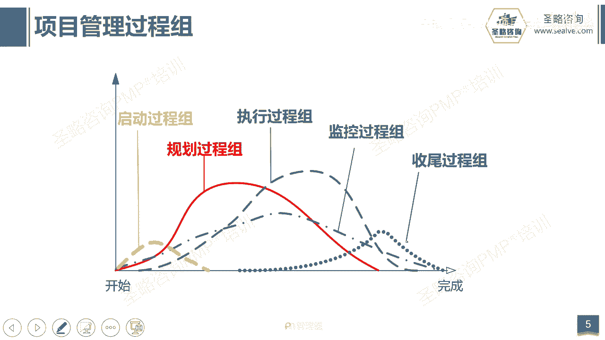
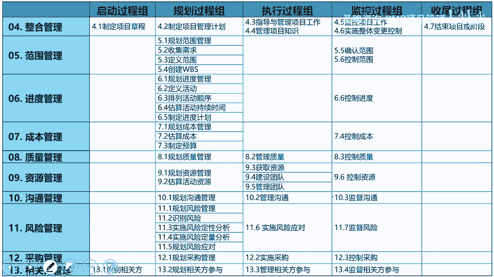

# 2-9.五大过程组与49个过程 - P1 - 圣略咨询-PMP项目管理 - BV141421R73C

大家好，欢迎参加战略咨询pp精讲课程，我是老杨。

这一讲，我们来看看五大功能组和49个过程啊，那当然五大功能组，49个人是属于偏不可第六版里面的内容，那么pm的第六版总共49个过程，其实每一个过程它都是一个结构啊，就是按这个结构。

这个结构就是输入处理到输出，也就是我们经常讲的ITTO什么意思呢，就是输入工具和输出啊，你看我们每一个过程都需要输入一些东西，然后经过一些工具的加工和处理，最终得到一些东西啊。

那你就就类似于我们譬如说假设啊，你今天想在家里自己煮个饭，你想要炒一个番茄炒蛋，那你需要输入什么，是不是输入的原材料有鸡蛋和番茄啊，那工具呢工具是不是就是这个炒锅啊，还有这么个锅铲。

那输出呢就是一盘色香味俱全的番茄炒蛋，那项目的49个过程，它也是这个逻辑啊，你比如说我们随便举一个例子啊，收集需求是范围管理里面的一个子过程，那收集需求它输入什么呢，输入当然就是相关方的登记册。

也就是人员名单啊，谁项目上有哪些人，我要搞清楚，我基于他们来去收集需求嘛，那工具呢工具是不是有头脑风暴，人多的时候头脑风暴嘛啊，那人少的时候访谈嘛啊，然后呢又是这个，有些时候我们可能人不在同一个地方。

我们可以发问卷，这是工具，那输出什么，输出就是需求文档哎所以我们就是按这个逻辑，那么也就是我们前面讲过，为什么我说你哪怕是一个小白，你只要啊真真的认认真真的跟着我们的这个，第六版的课程去学习。

你一定能够去做好项目啊，那因为他告他把整个项目管理的过程，拆成了49个子过程，那每一个过程啊，他都告诉你输入什么，需要些什么啊，然后你可以在什么场景下用什么工具，然后你得到什么东西就行了。

当然有人说哎呀输入输出特别多怎么办啊，我背不住，我告诉你一定不要去背，背也没有用啊，因为因为pp考试首先啊你背下来之后，pp考试他不会这样考，他肯定不会问收集需求，用什么输入啊，用什么输出啊。

用什么工具，没有这种弱智的考试一定没有啊，他都是给你一个场景，说你的项目出现了什么问题，你应该怎么办，所以你光去死背这种东西是没有用的，那而且现实工作中你背这个也没有用，所以我们要去真正的去理解啊。

我为什么这个过程需要这个输入啊，啊我为什么这个过程需要这个输出啊，那我在什么场景下用什么工具啊，所以工具记住它的特征就好了，输入输出你要结合这个过程，它是干什么的来理解，结合你的工作。

比如说制定项目当成这个过程，你干嘛的啊，立项嘛，立项一定要得到立项报告，也就是项目当成呗，所以输出就有了，那想得到项目章程需要什么东西呢，需要商业论证呢啊需要什么啊，这个这个协议啊，合同啊。

那这是不是就联系起来了吗，那有人说还有一些什么项目类计划啊，啊世界环境因素啊，组织和资产这些东西不需要你管啊，不用去记记也没有用，不需要记它，你只需要记每个过程的主要输入输出。

那主要输入输出是基于你对这个过程的理解，然后推出来的，不是背出来的啊，然后工具呢即特征，因为工具是通用的，每一个过程都可以用同相似的工具，比如头脑风暴，任何一个过程都可以用是吧。

哎所以但是他有些地方没有写，没有写，不代表他不用，所以我们不能去背，背是没有用的啊，我再三强调好，那么五大过程组我在这不再重复了，因为我们前面的课程里面，已经对他进行阐述过了是吧，启动立项做计划。

然后开展项目工作，然后监督整个过程，到最后结项收尾，总结经验教训，五大工程组，然后这个他们之间的关系啊，我们前面讲成本的关系已经讲过，其实他们没有明确的边界啊，启动其实啊就可以同步做计划。

做计划就可以同步开展工作了，那开展工作整个过程就开始监控了是吧，还在开展这一这个工作一段时间的时候，可能我的阶段成果就开始交付了，所以五大工程组，它其实没有明确的界限和边界啊。

他们之间是什么交叉交叠的这种关系。

那最后是49个过程，那49个过程，我们在后面会有这个推导的过程啊，我们会把我们会按这个这个规划执行啊，监控啊，这样子，这个项目的流程去对49过程，进行一个串联啊。

而且我们也会把第七版的东西呢给它串在一起，所以我在这儿不念这张PPT啊，这张P没有没有必要去练练，没有什么意义，但是我们一定要搞清楚啊，这个五大过程组，49个过程里面的这些逻辑关系。

那我们在后面的过程中会跟他去梳理这些关系，我们要把关系梳理清楚，来掌握一套做项目管理的流程。

好这一讲的内容我们就到这结束。

