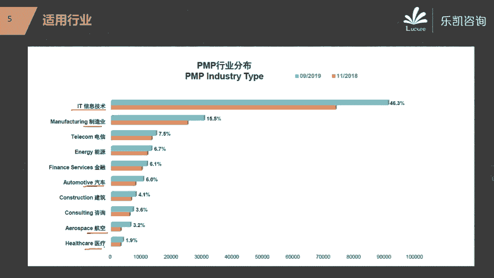
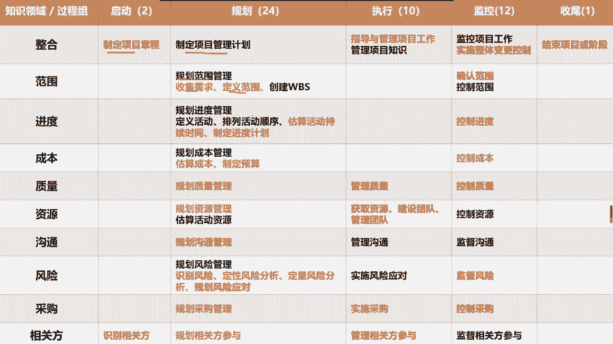
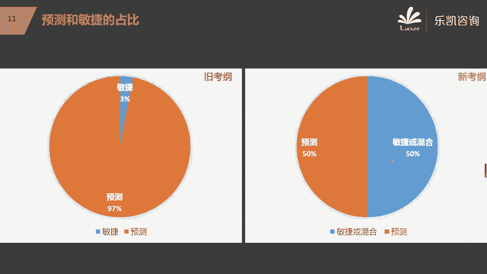
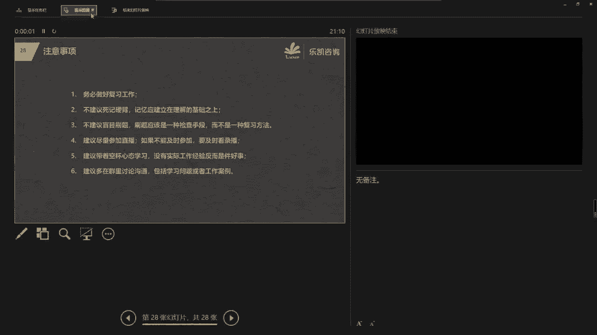
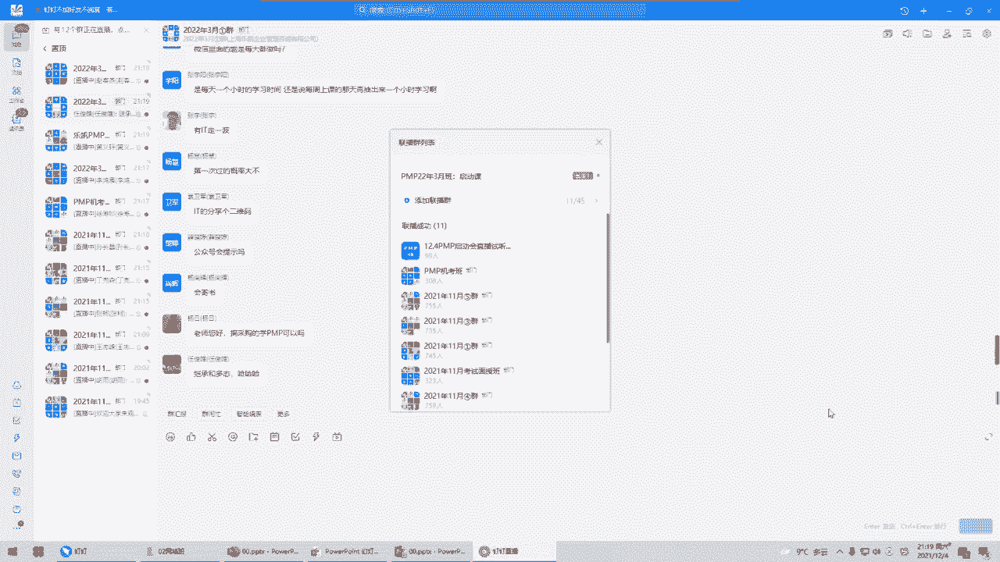

# 2022年PMP项目管理精讲课程-包含项目实战课程 - P1：PMP开课启动会-为什么要学习PMP - 乐凯PMP - BV11L4y1E7TC

大家晚上好啊，那个我们今天晚上呢开始这个3月份班的启动课好吧，首先呢很感谢大家能够选择乐凯咨询，然后跟我们一起来学习偏僻这门课程，那么我们今天的启动课的主要目的呢有两个好吧。

第一个呢是让大家先体验一下丁丁的直播应该怎么去操作，那么我们每次在直播的时候呢，呃有课的时候，每天晚上的07：45，我们会放音乐对吧，如果你进来之后能看到ppt，能够听到音乐，那么这就代表是正常的好吧。

那么每天的课前15分钟放音乐，主要就是这个目的，那么刚刚有人问可不可以点歌对吧，可以点歌啊，我人肉帮你点个，这个没问题好吧，这是第一个目的，那么第二个目的是什么呢，就是我们希望通过今天晚上的一个启动课。

让大家了解一下关于偏僻的一些相应的一些背景啊，包括我们考试会涉及到的新考纲的一些内容，以及我们后续的学习计划呃，整个的今天晚上的课程呢时间不会太长，大概在一个小时左右好吧。

所以今天晚上呢我们会主要的去介绍这么几块，首先第一个就是关于pp的一个基本的介绍，然后接下来呢就是新考纲的一个介绍，然后接下来我们大致的一个学习计划，然后我们的学习的目标这几个地方。

这节课大家不要记笔记啊，不要记笔记，大家就纯粹的去聊一聊好吧，因为启动课嘛不是一个正式的一个课程好吧，那么首先呢跟大家聊一聊关于pp的一些相关的内容，那么我相信大家来报名学习pmp包。

包括这个在咱们试听群即将要打算学偏僻的同学，多多少少呢对p mp都会有一些了解对吧，那么什么叫p m p呢，它首先它是一个缩写，它其实叫project management professional。

项目管理专业人士资格认证，那么这个认证是由美国的项目管理协会简称叫pmi，它推出来的，那么这个认证已经在全球很多的国家和地区得到了推广，应该说这个认证是项目管理这个领域里面认可度最高的一个认证。

他认可度还是比较高的，那么为什么在全球范围内大家都比较认可这样一个证书呢，因为这个证书他的项目管理的部分啊，他并不会具体的讲每某一个行业唉，有的人说我是学it行业的，或者我是做制造业的，我是做建筑业的。

那么我们都要学这个东西吗，这个是没问题的，因为pp它本身就不局不局限于某一个行业，它是把项目管理里面比较通用的部分全部都抽出来，形成了一个知识体系，那么曾经我们做过一个调查，是pmi做的做了一个调查。

那么比较用的比较多的是这么几个行业，比如说it技术行业，信息技术，包括我们的制造业，包括我们最近学员中出现的比较多的汽车行业，航空行业和医疗行业用的特别的多好吧，所以说这一块它实际上呢它针对于各行各业。

它并不是在讲某一个具体的行业，那么目前我们全球获得这个证书的，而且是一个有效认证的，有多少人呢，我们在前段时间拿到pmi的数据。

我们目前有123万是男的有效证书的啊，人数还是相当多的，特别是这几年学的人越来越多，包括我们很多的企业在招聘的时候都有这个要求，所以呢我们觉得这个认证还是值得去学一学，去考一考的好吧。

那么我们去考这个偏僻证书，主要的依据是什么呢，主要的依据是它对应的这一本项目管理知识体系，也就是大家拿到的那本很厚的书，第六版的篇bo，什么叫pinbox，它也是一个缩写，他说的是项目管理知识体系啊。

body of knowledge对吧，那么这本很厚的书，我说一下啊，大家现在拿到的应该是第六版，应该是第六版，这个是最新的一个版本好吧，那么这个知识体系它是普遍认可的良好实践。

也就是说我们通过对这个知识体系的学习，会发现这个体系里面所讲的内容在大多数时候适用于大多数项目，然后呢我们用它来做项目，能够提高很多项目成功的可能性，那么目前最新的版本是第六版啊，第六版。

那么大家在学习的时候，还是要以这个第六版的内容为主，那么整个一个知识体系里面究竟讲了哪些内容呢，我大致给大家介绍一下，其实我觉得很多同学应该多多少少应该听说过这些东西的，好吧好，我们看一下。

在这本书里面，它主要讲的是十大知识领域，五大过程组，49个过程，那么我给大家介绍一下啊，从第四章开始，因为这本书的1~3章它是一些基本的概念，那么比较重要的内容是从第四章开始的。

那么第四章开始他就开始讲知识领域，整合知识领域，然后第五章范围知识领域，一直到第13章相关方知识领域，那么一共是十大知识领域，那么这些知识领域里面会涉及到49个过程啊，这是从知识领域的维度去划分。

把这49个过程划分成十大知识领域，那么还有一个维度从过程组来划分，可以划分为启动规划，执行监控以及收尾五大过程组，那么我们后面在学习的时候会深入的去学习每一个过程对吧。

其实我在之前给晚期的学员讲课的时候说过，这个其实很简单，你就把它理解成49个学生在一个教室里面，那么它有两个维度，一个是他坐在第几排对吧，一个是他坐在第几列，比如说这个过程我们一般是这么描述它的位置的。

它属于整合知识领域，当然也属于规划过程组好吧，那么这个我们在后面学习的时候，大家会了解的比较清楚，那么今天呢我大致给大家介绍一下这几个知识领域，因为我们这本pb它是按照知识领域的顺序来讲的。

那么首先整合知识领域，它讲的是什么，好，大家要知道诶，我问大家一个问题啊，大家觉得项目经理是不是一定要技术出身啊，你们觉得需不需要项目经理一定要精通某一个技术吗，一定需要是从技术出身的吗。

唉我们觉得不一定对吧，你比如说我之前就职的好几家公司，有的人他之前就不是做技术的，那么大家觉得项目经理最重要的一个责任，或者说最重要的一个职责，他一定要做好什么，他可以不懂技术，但是他要懂什么。

或者说他一定要重视哪一个环节好，其实很简单，我们一定要重视什么呢，重视整合，当然有很多人说的沟通对吧，没有错，项目经理大部分时间都是用在沟通，而沟通的目的就是为了什么，就是为了整合。

那么究竟什么叫整合呢，比如说今天晚上我在家里，我吃的是什么呢，我今天晚上吃的是火锅，那么大家知道我做这个项目，我吃一顿火锅，我作为项目经理，我是怎么整合的呢，我安排我的老婆去菜市场买菜对吧。

我安排我的小孩儿去超市买饮料，我安排我妈在厨房里面把买回来的材进行加工，我安排我爸把锅电磁炉准备好，把水倒好对吧，我把这些资源全部都整合在一起，最终促成了这个项目，这个火锅就成了是吧。

你说我需要精通技术，说诶我一定要会挑选哪一家的羊肉卷好吗，这个不是我考虑的事，这是我的团队成员，我老婆要考虑的事儿，唉至于说要买什么饮料，这也不是我要考虑的事，这是我的团队成员，我小孩要考虑的事。

我把这些资源整合在一起，把这个项目通过大家的努力把它做好，这就是我们项目经理要做的工作，对吧啊，我看到有的同学很不屑对吧，说这是白嫖哎呀，我觉得这个不要说白嫖，这是一个很重要的整合的能力，知道吗。

没有我项目经理这顿火锅它就吃不成，就是因为我整合了协调了所有的资源，最终才把这个项目做成的，你光有一个人买羊肉卷能吃上火锅吗，他吃不上，是不是这个道理，所以我们一定要知道项目经理的重点应该放在什么地方。

那么整合知识领域，而整合这个知识领域啊，它主要讲的就是在我们整个项目层面上，我们如何最终做一些整合性的工作，好吧好，接下来范围知识领域，他在说什么，范围知识领域说的是我们究竟要做什么，对吧。

或者说换一个说法，我们最终要交付给客户什么，要有羊肉啊，要有牛肉啊，要有蔬菜呀，要有饮料啊，这些都是我们要考虑的，这个项目究竟要做什么，要交付什么，那么这里面就涉及到我们怎么去收集需求。

最终怎么把范围定下来对吧等等，那么这是范围主要讲的内容，接下来进度讲的是什么呢，进度讲的是要多久，我们任何一个项目，比如说吃火锅这个项目，你的这些工作都要安排人去做，那么接下来这个项目要做多久呢。

我们会发现有的事情可以同时做，有的事情必须要先后做，我们要把这个进度怎么样把它给排出来对吧，然后我们还要控制好进度，万一有东西延期了，我们怎么去纠正这个进度，这个是我们进度要考虑的问题。

那么成本知识领域讲的是什么呢，很简单，他讲的就是我们要花多少，对吧，哎这个项目我们要做这些工作，我们要投入这些资源，然后一共要花多少钱呢，我们要把这个成本基准给算出来对吧。

然后同样的我们还要控制成本在什么时候应该花多少钱，成本有没有超支对吧，说不定我们还要做一些预测，那么这个项目将来可能需要多花多少钱好，那么接下来还有质量问大家一个问题啊，说到质量，大家首先想到的是什么。

咳咳咳，我每一期在讲质量的时候啊，我都发觉其实很多人对质量的不是很了解，可能由于行业的问题啊，相对而言制造业的同学对质量就非常的理解对吧，但是有很多行业对质量的是不太理解的，那么我刚刚说说到质量。

大家能想到什么，马上有一个人就说说出来了，陈星宏就说到一个很专业的词叫qc好，什么叫qc呢，qc实际上就是我们常说的一些质量控制手段，比如说检查呀，测试啊，对吧等等。

但是大家要注意质量这一边其实我们分为两种，两个过程比较重要的一个叫管过程，要管好过程，一个就是qc所说的叫查结果，那么为什么我们要说这个东西啊，因为说到质量，很多人想的就是哎呀，我们要多测一测。

我们要多查一查对吧啊，包括我们做抽检等等，一定要防止我们有问题的这个产品流入到客户手上，这个要不要做，这个当然要做，但是大家要注意，我们要保证做出来的东西很好，其实重点不在于检查和测试，而在于什么。

在于我们的过程要做好，其实大家可以想一个问题啊，我在之前上课的时候就给大家举过一个例子，大家会发现在全国各地有很多的肯德基或者麦当劳的这个门店对吧，那么大家会考虑一个问题吗。

就是说为什么这么多家肯德基的店或者麦当劳的店，他们最终交付给我们客户的东西，它的味道几乎都差不多对吧，特别是像我们这种说实话不太挑剔的人，我感觉每家店吃出来的呢都一样对吧。

那么为什么他们能够做到这一点呢，因为他们对过程或者说对流程的管理，他们做得非常的成熟，所以在学质量的时候，大家会发现思维上会发现一个很大的改变，就是说其实质量并不是靠检查来查出来的。

而是要靠过程把它给做好的，如果你的过程把它做得好对吧，唉包括刚刚有人说到我们有一些体系，有一些标准，然后我们来遵守这个标准，一步一步的都符合要求对吧，遵守组织的政策流程和程序。

那么最终的结果它不太会有太大的偏差，好接下来第九章我们会接触到资源管理，那么什么叫资源管理呢，我们刚刚说的吃火锅，一个项目都需要资源啊，那么这个资源就包括了人力资源和食物资源对吧，那么第九章的资源管理。

它侧重于什么呢，侧重于人力资源，实物资源也有，但是主要的是人力资源，所以资源这一块他在说什么呢，怎么样去带团队，从一开始我们的团队成员去哪儿来，从哪儿来对吧，来了之后，我们怎么样让他变成一个团队。

而不是一个团伙，不是说人凑在一起，就是团队的人凑在一起，也有可能是团伙对吧，甚至有可能连团伙都不如，所以我们作为一个项目经理，一定要知道诶，我们怎么样找到合适的人，然后怎么样去提高整个团队的绩效。

让他们协同工作，然后团队里面有冲突，我们怎么样去解决冲突对吧，那么最终让大家相互依靠，平稳高效，真正像一个团队一样的，那么第九章侧重于这一块好，然后第十章讲的是沟通，那么沟通在说什么。

沟通在说的内容是传递信息，在我们偏僻里面，或者说在我们做项目管理的时候，我们都需要跟别人沟通，比如说比较典型的有例会对吧，唉每周开周例会，甚至呢阅历会包括我们平时会开一些专题会，包括我们会发一些周报。

发一些状态报告，那么怎么样来保证这个沟通是有效率的，有效果的，那么这是我们沟通知识领域所讲的内容，好接下来风险是我们第11章会学到的，那么风险在讲什么，风险在讲，我们一定要做好预防工作对吧。

要尽早识别风险，尽早去应对这个风险，我们有一句俗话叫什么呢，有钱难买，早知道啊对吧，有的项目他的失败很可能就是由于一些风险产生的，哎比如说我们做火锅，吃火锅这个项目。

你一定要识别到这个风险啊啊我在买菜的途中会不会有一些风险对吧，回来吃饭的时候用的电磁炉，用电方面有没有风险，如果你识别出了有一些风险，我们一定要什么呢，及时的去规划应对将来怎么样来，或者规避掉这个风险。

或者尽量的让这个风险的概率呢小一些对吧，所以风险这一块其实主要是做一些预防性的工作的，好吧好，接下来采购采购这个知识领域非常的特殊，为什么说采购这个知识领域非常特殊呢。

因为我们前面基本上都是站在某个角度，什么角度呢，叫乙方的角度，这个大家应该都懂的对吧，站在乙方的角度，我们怎么样交付客户需要的东西，那么在pmp学习的时候，很多人会有这样一个疑问，那么我是甲方。

我学pp要注意什么好，一方面你要知道乙方应该做什么，你知道乙方要做什么，你就知道将来你怎么样去管理的乙方，另外一个方面呢就是采购这一块啊，虽然其他章节都是站在乙方的角度，但是他也说到了。

诶有一些东西我的公司不生产对吧，那么我也要有我的供应商啊，我也要去采购啊，所以采购管理说的就是我们如何去管理我们的供应商对吧，包括我们的招投标怎么去做对吧，然后接下来我们怎么样去评标。

去选定我们的供应商，以及我们在供应商跟我们签订合同之后，他们在实施的时候，我们怎么样去管理供应商的绩效，所以采购这一块我们是站在甲方的角度在讲，我们怎么去管理我们的供应商，好吧好。

然后接下来最后一个13章讲的是相关方的管理，那么什么叫相关方呢，相关方就是指跟项目有关的各方，包括我们内部的公司的领导，包括我们外部的客户对吧，专家等等，这些都是相关方，那么相关方这一章也很重要。

为什么也很重要呢，问大家一个问题，你们觉得什么样的项目才算是一个成功的项目，我们有很多有很多人认为我只要交付客户所需要的东西，然后呢我只要做得很好，没有什么问题，工期呢也符合要求。

成本呢也没有超等等对吧，那么这个项目就是一个很成功的项目，而实际上我做了很多年的项目，我跟大家说一下，其实我觉得比较成功的项目是什么项目，比较成功的项目就是相关方都能够满意，如果说的粗俗一点啊。

我在以前公司里面跟项目经理聊的时候是这么说的，你要能搞定所有的人，所有的人你都搞得定，大家都满意了，这个项目就是可以的，是这个道理吧，所以说相关方也是比较重要的一个知识领域。

那么我们整本pmbok其实主要的核心内容就是这十大知识领域，当然换个说法也可以说是五大过程组，那么最根本的不管十大知识领域还是五大过程组，其实就是涉及到我们后面要讲的每一个过程，一共有49个过程好吧。

那么这是这一本第六版的pm box里面，它所包括的主要的内容，那么我刚刚在讲的时候呢，有的同学说我不是听说现在第七版已经出来了吗，对吧，哎为什么现在还是用的第六版啊，好那么关于这个问题。

我要跟大家说一下。

就是新考纲的这个问题，首先大家要知道啊，嗯本来呢在11月份我们会举办这个考试对吧，但是由于疫情的原因，这个考试被推迟了，所以呢第一次新考纲的考试呢没有考成对吧，那么不管怎么说。

大家3月份的班一定也是考的新考纲，但是要注意我说的是新考纲，而不是新教材，什么意思呢，就是说教材我们还是用的第六版的pinbo，我们目前涉及到更新的是更新的考纲，而不是教材，那么考纲有什么变化呢。

跟大家说一下啊，我们以前的考试我们是从五大过程组来划分的，一共有200个题目，200道题目对吧，然后呢五大过程组所占的比重是不一样的，所以大家如果去查一些相关的一些信息，会发现啊。

有人说什么5a就是五个过程组都考得非常好，叫5a对吧，按照过程组来划分，那么现在新考纲它划分的维度不一样了，它从三个维度来考察，一个就是过程，这个维度它的比重占50%。

还有一个就是从人员管理的维度来考察，占42%，然后还有一个就是从业务环境的维度来考察，占8%，所以说新考纲跟我们之前的考考试，他第一个区别就是它划分的维度不一样了，原来是五个角度去考察。

现在变成了三个角度去考察，这是第一个区别，那么第二个区别在什么地方，我们以前的考试预测型占97%，敏捷呢占3%，而我们现在预测型占50%，敏捷或混合各占另外占另外的50%，那么在这里有的人说什么叫预测。

什么叫敏捷，那么我大致的给大家介介绍一下好吧，什么叫预测，什么叫敏捷呢，这其实是两种项目管理的方法，举一个例子，我们去吃饭有两种吃法，我不知道在座的有没有做过餐饮行业的，啊啊如果有做过餐饮行业的。

应该会了解这种做法，一个叫机器，一个叫轿子，好我说一下它的区别在什么地方啊，比如说如果我已经约好了几个人，打算请他们吃饭，我一般会怎么做，我一般会选一个时间，选一家餐厅，甚至我把菜都已经点好了对吧。

所有的计划准备工作都做好了，那么接下来就按照这个计划好，在某一天我邀请这些人到哪个地方，然后餐厅负责按顺序把我的菜全部都上上去，然后大家一起把这个饭吃掉就结束了。

那么预测就是指我们所做的事情都可以有计划，我们用计划来驱动我们的执行，对吧，那么这也是哪一种类型呢，刚刚有同学说到了叫瀑布形，用计划来驱动的，那么这种项目管理的方式常见于很多的行业，比如说我们的制造业。

建筑业对吧等等，这种行业做项目，我们一定是有计划的，我们很多人会看到我们的施工现场，或者我们的一些其他的地方，都会有一些计划排出来，我们第一阶段做什么，第二阶段做什么，第三阶段做什么。

这个项目一共分几个阶段，最终把这个项目做掉对吧，而且在做的过程当中，还会根据计划跟实际去比较来判断我们究竟进度是快了还是慢了，那么大部分项目都是按照这种方法来做的。

但是大家会发现现在也有一些项目他不是这么做的，什么项目呢，特别是一些创新的项目，我们之前没做过的，比如说举一个例子，同样是吃饭，我跟我的朋友想出去吃顿饭，我问他吃什么，他说我也不知道吃什么。

这就是一种很典型的就是你连这个市场要什么，你都不知道，客户需要什么，你也不知道，那么你不知道你怎么办，你只能一点一点的去尝试啊，哪来的计划呢，所以我会跟我的朋友怎么办呢，到我们公司楼下对吧，去转一圈。

这样吧，我们边走边看，想吃什么吃什么对吧，好坐下来之后也没有什么计划的，我们先点饮料对吧，哎太渴了，我特别喜欢喝，想喝饮料，那么饮料先上对吧，然后接下来先点两个菜，吃的不够，再点两个菜，再不够。

再点两个菜，直到我吃饱为止就结束了，那么你说整个过程中有什么计划吗，没有什么计划对吧，我们只能根据我当下我的需求，我最需要什么，我就点什么就吃，吃到结束了，吃到饱了，那么就结束了对吧。

那么这种做法是很难用计划去驱动的，那么这种做法就是敏捷的，那么我们现在预测和敏捷包括混合啊，应该是各占一部分，所以现在的考试当中会有大量的敏捷题目好吧，那么有人说，那么什么叫混合呢。

我们有的项目啊有敏捷，有预测，这就是混合，所以混合呢实际上是两者都有，比如说我们做一个项目，前期我们要做一件什么事情呢，要做一些研发或者叫运营，啊这个技术究竟行不行，我也不知道。

我们要先看一看可行性对吧，我们可以用一些比如说专业的说法啊，加spike斯探，用刺探的方法去尝试一下究竟可不可行好如果我们刺探了发现之后，诶，这个技术上没问题了，那么接下来我们就可以按照什么。

按照预测型的排好计划，然后一步一步去实现好吧，所以说现在的新考纲的第二个区别在于什么呢，在于敏捷的比重大大的增加了好吧。

但是要注意的是敏捷的题目啊，他不是不会单独的另一块内容出来的，它是融合在这三个维度里面啊，融合在这三个维度里面的，所以说他不会孤立的所存在于某一个特定的领域好吧。

那么这一块呢大家也不要担心我们的敏捷这一块也会去讲的，正好借这个机会让大家去了解一下瀑布跟敏捷，或者叫预测跟敏捷，它的区别在什么地方，好吧好，那么另外考试方面跟以往也有一些不一样。

我们以前考试是考240分钟，也就是四个小时，现在新考纲的考试少了十分钟，230分钟对吧，那么为什么会少十分钟呢，因为以前是200道题，200道单选题，现在是180道题，但是有多选，很多人看到多选之后哇。

靠有多选了，好头疼的，但是我跟大家说一下啊，多选长这个样子，我们看一下啊，这个是单选和多选，每一道题目它都会有英文跟中文两部分描述好吧，那么这个是单选，多选呢注意看这里，他会告诉你这道题目是多选题。

而且有几个正确答案要你选出来，看这里英文这边会说choose for，也就是说这道题目里面这道题首先它是多选题对吧，第二这道题目选四个答案，明白吧，那么英文里面那中文里面也是这么描述的啊。

这道题目那后面有个括弧选几个，那么而且会告诉你你要选几个答案，明白吗，所以这个难度呢就相对来说呢要降低了一些好吧，那么有人说，那么180道题里面多选题有多少道呢，大概会在十到左右，明白吗，哎杨绍辉。

你说的是对的，多选题会明确告诉你选几个，而且呢题目不会太多，大概十道题左右，他不会统一的放到后面啊，它中间可能会加一道多选题好吧，那么另外呢原来200道题的时候呢，有25道题是不记分的。

现在180道题呢有五道题是不记分的好，那么我说一下什么叫这些题目是不计分的题目，不计分的题目，就是你做对了不拿分，做错了呢也不扣分，明白吧，那么问题是什么呢，就是这些不记分的题目是哪些题目呢。

你也不知道，也就是说真正积分的实际上不管以前还是现在都是175道题，是计分的题，那么这175道题我们要拿到多少分呢，按照以往的概率啊，按照以往的概率，我们要拿到106，那么关键是你做对106还不行啊。

有可能你做对的，他不计分啊，所以以前我们要求什么呢，要做到131分，要加上这25分，现在呢我们要求要做到111分对吧，也就是说你超过110或者以前超过130，基本上通过呢是没什么问题的好吧。

那么这个情况大家大致的了解一下，好吧啊，现在呢新考纲跟旧好钢的区别也就这些了好吧，那么关于考纲改版有几个注意点，我再次强调一下啊，首先大家一定要注意，虽然第七版的教材，它的电子版已经发出来了。

而且我们听说明年可能会正式的出版社会开始卖第七版的纸质版，但是不管怎么说，我们现在是改的考纲，并没有改教材，所以大家现在不要关心第七版好吧，特别是我们国内现在新考纲一次都没有考过。

一般是要等新考纲考过几次之后，我们才会用新教材，所以我预测明年至少明年的上半年，甚至有可能明年整个1年都没有第七版，什么事，明白吧，明年极有可能全年都是用的第六版，因为它在国内。

我们国内啊推地基版没那么快了，你你想想考纲的改版一次都没有考过，怎么可能直接去搞新教材呢，这个是不现实的好吧，所以说我们第六版的pmbok依然是根本依然是根本好吧。

然后我们五大过程组仍然是项目管理的基本的流程，这个一定要注意的好吧，还有人说今年没过怎么办，我刚刚说过啊，明年也不太会用新教材的，我说一下我以前pmi的规律是什么啊，以前pmi呢它是4年换一版。

一般是4年换一版，比如说第四版，过了4年换第五版对吧，再过4年换第六版，然后再过4年换第七版，这个是教材的改版啊，那么考纲的改版一般是在什么时候呢，一般是在中间这个位置改考纲对吧。

也就是说理论上改了考纲之后，还有一段时间才会改教材好吧，所以现在不要考虑新教材的事情，因为新的考纲一次都没有考过，一次都没有考过，那么你们接下来的考试啊，如果说11月份的推迟推迟到你们3月份一起。

那么也就是第一次考新考纲啊，那么新教材还早呢，所以大家不要担心关于这个教材改版的事情好吧，五大过程组还是比较重要的，一定要去看一看的好，然后敏捷这一块啊，敏捷里面的流派有很多，好吧。

那么敏捷里面的流派很多，大家需要干什么，需要了解敏捷的思想，而不是去深入的去了解敏捷所有的流派，这个是没必要的好吧，因为偏僻考试考敏捷，虽然他占50%，但是都是一些基本的敏捷的思想。

那么我们在国外有一些学员，他们今年已经参加了这个新考纲的一些考试，我们也根据国外的考试的一些情况吧，把重点都抓出来了好吧，到时候我们在讲每题的时候呢，会着重去讲这些东西。

那么这个是关于考纲改版的几个注意点，大家稍微注意一下，好吧好，然后接下来关于我们接下来学习的学习计划，大家呢稍微了解一下，那么这个二维码呢是钉钉的这个二维码，大家有时间的可以用钉钉去扫一下这个二维码。

订阅一下这个上课的这个日历啊，那么在上课之前会有提醒的，那么关于学习计划，我先说一下网络班，也就是我们直播的远程班，那么网络班呢一般来说每个星期呢是上一章内容，那么有的章节的内容很少。

所以呢个别章节我们才会把它合并，一般来说是每个星期就上一张，那么上的时候呢一般是星期一讲上半部分，星期三讲下半部分，然后星期六晚上呢会带大家看一看题目啊，讲一讲这个星期对应的相应的题目。

包括呢讲完题目之后还会讲一些我们以前做项目，遇到了一些真实的案例，做一些实战的分享好吧，那么网络班基本上每周一张，然后中途我们会分阶段做阶段的单元测试啊，这个就跟我们项目管理是一样的。

我们项目管理也是分阶段去管的对吧，在每一个阶段结束的时候，我们要检查一下这个阶段究竟做的怎么样，如果有一些问题，我们要及时地做一些调整，那么这个是网络班，那么面授班呢就是我们上海的这几个面授班。

上课呢是五天的课程，第一天1~4章，第二天第五章，第六章，然后第三天，第四天，第五天，那么也有四次单元测试啊，这是面授班的安排，那么具体的呢大家可以看教务老师，也就是班主任给你发的课表。

那么不管是面授班还是网络班，课程结束之后，我们会预留一个月的时间，那么这一个月的时间干什么，给大家做模拟和充值，好吧啊，那么刚刚有秘书可能是面授班的同学说，这个面授班的进度太快了，五天就学完了。

面授班它好处在什么地方啊，他现场的沟通效率是比较高的，这是第一个，第二个大家要注意，面授班是开通了网络班的权限的，也就是说如果你觉得唉一天学这么多，可能我个人掌握不了，那怎么办呢。

那么接下来你你可以跟一跟网络班的课，你也可以去上的好吧，那么一般来说呢面授班它的效率是很高的，因为大家在面对面嘛，对面对面的交流嘛，我们项目管理里面说沟通哪一种沟通效果最好。

面对面的交互式的沟通效果是最好的，所以面授班和网络班啊各有特点，相对来说网络班他可能稳扎稳打，周期要长一些，那面授班的互动的效果，或者说分享的东西会多一些。

因为面授班一节课是从早到晚有很多东西可以聊时间的，好控制，网络班呢就一个半小时，你讲不了太多，你稍微一展开呢，可能就会超时对吧，所以说各有各的好处，各有各的好处好，那么关于敏捷这一边呢。

我们是这么安排的啊，由于敏捷的流派比较多，在整个pmbok就是这本教材里面也很分散，而且考试呢它比较偏向于基础和基本的思想是，所以我们暂定我们3月份班是在2月20号下午直播讲解敏捷的内容。

那么我们会花半天的时间，根据考试国外的机考班的考试反馈的信息，我们会着重讲解scrum，特别是ram里面的3355，也就是里面的三个角色，三个弓箭，五个世界，五个价值观。

那么rap这一块是比较重要的一块内容，那么另外还有看板，我们也会跟大家介绍一下，好吧，那么这两块讲完了之后，还还有一些细节的东西，我们在题目里面再去带一带，那么敏捷基本上就不会有问题。

那么我在这个讲课之前，我先说一下关于敏捷这块的安排，为什么要这么安排，很多同学说现在新考纲的考试，敏捷占了50%对吧，敏捷跟混合占50%，为什么只安排半天的时间呢，因为其实敏捷呢重要的也就这些。

因为我们单纯的比如说ram的培训，大家可以了解一下那个单纯的敏捷的培训，一共也就两天的时间啊，而且还有很多是做沙盘的，所以真正的要讲的一些东西的并不是太多好吧，半天时间已经是足够了，好吧好。

那么我们按照这个计划啊，要稳扎稳打的去学，然后最后把敏捷再过一过啊，通过模拟，然后呢再做一些这个啊基础的一些巩固，那么接下来我们就直接去参加考试就可以了，那么关于考试的结果呢。

现在呢由于它是从三个维度去考察大家的，所所以现在已经不再有5a这个说法了，现在最多也就是3a这个说法好吧，那么大家考完试之后，除了通过了之后会拿到一个证书以外，我我们还会有一张成绩单。

那么究竟你能考到多少，那么大家要注意啊，这个你考几个a，这只是一个成绩，几个a不能决定你是不是通过的对吧，我举一个例子，比如说现在我们有三个人，第一个人呢当然是学霸级的，考了3a那么这个当然是稳过的啦。

最好的成绩了，好第二个人考了1t一个b一个n那么什么叫1t一比一个n呢，a呢叫above target高于目标，就是你这三个方面都非常好，那么就是三个a那么t是什么呢，达到目标target的。

那么他会给你打一个t，比如说人员你做得差不多符合要求，那么给你一个t过程，也差不多给你一个t对吧，业务环境做的还是差不多，还是给你一个t对吧，那么什么叫b呢，就是你这个方面做的不好。

below target，然后最后的一个n就是做的很不好，有待提高，need improvement，那么接下来有一个人考了一个t一个b一个n，这个人呢他通过了，还有一个人也是考的1p一比零。

就是红色的这个人他没过，大家能知道为什么红色的这个人他有可能不过吗，哎同样的是1t啊，这个成绩单一t1 b一绿色的过了，红色的没过，为什么好，很多人发现了，因为我们这三个维度啊，它的权重是不一样的。

你会发现绿色的这个人为啥能过，因为他替代了过程这个方面，那么过程这个方面他占50%的题目啊，那么也就代表他做对的题目比较多一些对吧，那么红色的这个人也有一个t，但是他什么地方做的是t呢。

业务环境只有8%，那么8%才有几道题啊对吧，所以说大大家要注意，其实最终决定你通过还是不通过的，并不是你考几个t几个b几个n，还是我们刚刚说的，你要做对多少道题目对吧。

否则的话你记在一些这个题目比较少的，比如说业务环境，你仍然是有可能有风险的，好吧好，那么最终考完了之后，如果通过了啊，你们会收到两个东西，只要考试一公布成绩啊，说你通过了，那么通过的人都有这张证书。

证书呢都是一样的，没有什么区别，那么除此以外呢，他会还会给你一个成绩单，那么这是我们国外机考班，他们在国外考试的学员，他的一个成绩单对，那么像这位同学，他成绩单就是这样的，他会告诉你啊。

你这三个维度都是above target，那么这也就是说他的成绩是一个3a的成绩，当然了，有人说，那么这个3a有用吗，这个3a呢说实话也没什么大用处，但是呢你3a嘛说明你学得好啊对吧。

证书嘛都是一样的好吧，唉证书都是一样的，那么关于这个考试通过率的问题呢，我觉得大家不用太担心，为什么不用太担心呢，因为我们国外一因为国外的学生啊，他机考就是在电脑上考试的，我们国内呢是要涂答题卡的。

所以我们叫国外的学员，叫机考班的学员对吧，那机考班的学员他考了新新考纲之后，我们发现呢其实通过率还是比较高的对吧，那么关于以往我们这边的考试的成绩呢，大家也可以参考一下，从18年的6月份。

我们用第六版开始，一直到最近的一次考试，就是今年的6月份，每一期考试我们的通过率，都在这边，对吧，那么这个通过率大家看一下，基本上都是在白95%左右在波动的对吧，那么最好的一次是19年的9月份。

达到了97。62%的通过率，另外还有一个呢就是以前从五个过程组来考察的时候叫5a，那么5a的这个成绩当时的占的比重是多少呢，你会发现基本上稳定下来，5a的人会考了一半左右，一般的人会考到5a的啊。

所以说关于通过率这一块呢，你不要去担心这一块啊，那么有人说，那现在不是用了新考纲吗，用了新考纲也是一样的，没有什么太大的问题的，这个不会有什么问题的，所以说关于通过率这一块呢，大家不要太担心啊。

考试毕竟他都是选择题嘛，最多就是有几道多选吗，好吧好，接下来我们说一下我们的学习目标啊，其实我觉得啊这个大家太关注考试啊，不是一个好事情啊对吧，为什么这么说啊。

其实我们我个人觉得我们来学习的目的并不是为了考一个证书，你会觉得这个偏僻的证书，我说我我是说过一句话，他是在全球认可度最高的一个证书，那么那我问一下你们觉得这个证书它的含金量高不高啊。

你们猜一猜这个证书含金量高不高啊，我说句实话啊，偏偏整数的含金量啊，我们本科毕业学士学位证书的含金量，你说哪一个高，我不说这个证书本身含金量高不高，那么我们对比一下好了。

学士学位这个证书就是本科全日制本科毕业了，能拿一个学士学位证书和偏比证书哪一个含金量高一点，用说呀肯定是学士学位证书，它的含金量高啊，对这种本科的学士学位证书含金量比这种培训的证书要高多了啊。

那么我问一下，我们有很多人都有学士学位证书啊，他们过的日子是一样的吗，现在有学士学位证书的人太多了对吧，包括很多企业都要求有什么学历证书啊，甚至要做博士啊，那么你就说都有学士学位证书。

大家过的日子一样吗，其实不一样啊，为什么会不一样，因为其实含金量并不是一个证书带来的啊，是要看什么，要看个人的，所以我觉得啊需学习是一个过程，证书呢仅仅是一个结果，我们过程要比结果要重要得多对吧。

同样是有证书的，就像我刚刚说的，同样都有学士学位证书，但是也有人住高楼，有人在深沟，有人光芒万丈，有人一身锈的，对不对，所以说真正有含金量的，并不是说唉我一个证书就怎么怎么样。

而是在你获取证书这个过程当中，你你究竟学到了多少，将来你在工作中能够用到多少啊对吧，毕竟对你的工作能带来多大的帮助，我看到有很多人都考了pmp，你会发现很多人说偏僻它是有用的。

但是也有人说偏僻好像学了之后也就学了对吧，所以说我觉得我我作为一个老师啊，我我也不会去说这个证书有多牛逼多牛逼，说你考到这个证书将来就一定怎么怎么样，什么升职加薪，迎娶白富美，这他妈都是扯淡。

没有人敢保证的，但是我会告诉你，你学的这个证书对你以后的项目管理的帮助还是比较大的对吧，我希望大家在这个过程中能够学到一些东西，所所以说我们在学习的时候要有一个正确的目标。

那么我们希望通过这个学习能带来什么呢，我觉得有这几点是我们要追求的，第一个，我知道我们有很多同学原来是做技术出身的，比比如说像我一样，原来我也是做技术出身的，写代码的，刚毕业先他妈写几年c加加。

然后再写几年菲律宾，然后又做移动端的开发，但是会发现后面太累了，精力跟不上了，新技术太多了，再学学不下去了，那么这个时候很多人会考虑什么，哎我要转管理了，因为年龄到了，再不转管理很难了。

那么技术转管理最大的问题在于什么，大家想一想，你一个原来做技术的，现在由于年龄的问题，我想转管理，问题在什么地方，有什么问题，问题在于你没有经验，你没有管过呀，你不知道怎么去管一个项目。

最简单的一个说法就是你面试的时候，别人问你，你心里是不是很慌啊，不知道怎么去回答对吧，那么这个时候怎么办，诶，那么我们可以通过偏僻的学习，你掌握管理的一些理论基础，包括我们会有一些时记得项目的一些分享。

让你去了解一下，你学了之后，你再去回顾一下你以往的项目，那问题可能出在什么地方，你虽然没有带过项目，但是你总会参与过项目吧，那么这个时候你学完了之后，你再回顾一下你以前参与过的项目，那哪些地方做得好。

哪些地方做得不好，你基本上心里是不是也有一些想法了，那么这个时候你在面试的时候，是不是就有的说了啊，面试的时候一般我们会怎么办，我们一般在面试的时候，我们得包装包装嘛，这个我实话实说的。

比如说别人招一个项目经理，你总不能在简历上写，我从来没有做过项目管理工作吧，你也会写一写我曾经带过什么项目吧对吧，那么接下来你再去面试的时候，再跟别人去扯一扯这方面的东西，你最起码要装得像一点吗。

这谁给你机会啊，是不是这个道理，所以说这个课程的学习对于我们转型的人来说是比较有帮助的，那另外一方面，有的人说我现在就在做管理的工作，那么学这个课程有没有什么好处呢，也是有好处的。

我们有很多人管理的时候，你会发现我们有很多公司都有一些完善的体系，包括我以前就职的很多公司都是有自己的一套体系的，那么这些体系是怎么来的，说为什么需要这些东西，他们之间有什么关系。

其实有的时候我们只知道用，但是不知道为什么，那么通过p的学习，我们会对整个的管理体系有一个全面的了解，唉比如说我们在做项目的时候，我们原来公司包括项目启动要做哪些对吧，计划阶段要做什么。

然后监控阶段要做什么，那么这些东西哪儿来的，其实你学完了pp之后，你回过头去啊，特别是在大公司认值得一些同学，你回过头去看一看你们公司的这些所谓的项目管理的一些体系，或者一些流程。

你会发现这些东西其实有很多跟pp里面是一致的，他们也是源自于偏僻，所以通过这个学习，我们可以对整个项目管理的知识有一个全面的理解，那么第三个好处是什么呢，我们通过对偏僻的学习。

更容易建立我们跟客户之间的信任关系，这一点我个人觉得呢是很重要的，我我印象很深刻的是，我在2017年的时候，我在成都做一个国家的试点项目，当时我那个项目有13个分包，有13个风暴。

那这13个风暴你会发现啊，项目这些分包公司的项目经理能力真的是参差不齐，你跟有的项目经理聊天的时候呢，诶就比较能够聊到一块儿，说什么他都明白嘶，但是你跟一些项目经理。

有的公司的项目经理跟他去聊天的时候啊，你感觉就聊不下去，比如说我问他，你这个东西怎么没出个变更啊，不知道什么叫变更变更单，怎么写他也不知道啊，比如说当我们在开会的时候。

说到什么范围蔓延啊等等这些专业的术语，他不知道，这个时候就会给我一个什么感觉，我感觉这哥们好像不专业啊，那么不专业，这个时候我会怎么办，哎我就会对他指指点点，那如果说我们学的项目管理这些知识以后。

你在在外面做项目的时候，你必然会遇到什么呢，遇到甲方的一些就是说甲方请了一些监理啊，或甲方请了一些项目管理，项目管理公司对吧，那我们叫代甲方或者叫代建等等，你跟这些人打交道的时候。

你你说的都是你们这个行业里面比较专业的术语，他们会有什么感觉，怎么会觉得啊，这哥们儿老法师啊，唉不得不要轻易地忽悠他，他们会更多地用一种平等的态度去跟你对话，是吧啊，有人说，那客户听了之后怎么办呢。

客户他也不是傻，客户一听哎呦，你说的东西都很专业嘛，客户虽然听不懂，但是客户有一个什么感觉，我会觉得小子也确实很专业，我虽然听不懂，但是我也要怎么办，我也要他妈微笑着点点头说一句，嗯得很有道理。

是不是不也就这样嘛，所你说你通过这样的一个学习，了解了一些专业的东西之后，你说出去就说出去之后，别人就更容易建立跟你的信任关系，接下来第四点，我们在学习的过程当中要形成一些社区，什么要形成社区呢。

所虽然说我们pp是把项目管理共通的部分抽出来的，毕竟我们还处在各自不同的行业，那么大家会发现我们群里面有一些同学可能跟你是同一个行业的，那么可以尽量的跟人家多沟通，多聊一聊对吧，特别是同一个地方的。

这个是很有好处的啊，我们这边已经很多次啊，很多次，同学之间相互去推荐一些工作啊，包括我们有一些同学公司要用人的时候，他会把他们的结缔发给我哦，我在朋友圈发一发好吧，这个对大家以后呢工作呢是有好处的。

同行业的要多交流，要多交流，好吧好，那么这个我觉得这四点才是我们在接下来这一段学习的过程中啊，需要达成的一些目标，而不是只是为了一个证书好吧，那么另外啊我也我也理解来学习的人。

其实大部分同学是没有什么项目管理经验的，所以呢除除了讲课以外，我说一下啊，从第四章开始，讲知识领域开始我会在每周六周六晚上，我们不是要做题吗，等把题目做完之后，周六晚上我会讲实战的课程。

那么这个时尚的课程它源自于什么地方呢，就是我说的之前做的那个国家的试点项目，第四章的内容把它切出来，第五章第六章的分别切出来，然后再讲完每一个章节之后，我会告诉大家，在章节里面讲的东西。

在我们实际做项目的过程中，它一般对应了什么文档，这些东西为什么重要对吧，甚至有一些地方可能跟我们偏，这里面我们国内做项目啊，跟这一块有一点是不一样的，那么什么地方是不一样的，大家要注意的好吧。

我会把对应的文档，拿出来给大家去看一看，那么希望呢这个周六的这个实战的这个分享，会对大家呢将来的这个项目管理呢起到一些帮助，当然这一部分我要说一下的，它跟考试是没有关系的，跟考试是没有关系的。

所以说如果大家觉得有时间的呢，我建议大家来听一听，如果说没有时间啊，不听也不影响考试好吧，但是讲我每一期都可以讲的，当时把这套东西拿出来呢，本来是我们我以前给企业做内训的时候去讲的。

那么我们把这一块课程呢也把它加到我们的学习过程当中了啊，所以说这个周六晚上的课，到时候大家呢可以去更一更好吧，好那么这是我们主要的一个学习的计划，包括我们的一个学习的目标。

接下来最后呢我跟大家说几个注意事项，大家他在整个学的过程中要注意的，首先第一点，一定要做好复习工作，这个第一点呢我改了一改，为什么要改呢，你我们公司的这个教育啊，销售啊，都吐槽我写的第一点。

因为我第一点呢本来写的是要预习，但是一定要复习，对吧啊，这如果我们公司的教务老师呢说这个不好，那么我就把它改成了，一定要做好复习工作，那为什么要这么说呢，你很多人啊，我在群里面，我默默的看你们聊天。

特别是3月份班的说我翻了书之后，看了之后头晕，我看不懂，句实话，你不上课直接看书呢确实很难懂，所以呢你自己去看书呢，我觉得意义是不大的，为什么用那这些东西呢，你上课的时候跟着我再去听一听。

本来听懂了之后呢，比较重要的是课后的复习，它比较重要，如果你一定要预习，那怎么办呢，要么后面叫教务老师把上一期就是12月份班的录播视频开给你们，看一看有没有有兴趣的看着视频去预习好吧。

你不看视频直接看苏南，说实话很难懂，难懂好吧，所以说比较重要的，我再次强调一下，客户的复习一定要做好啊，般来说我上课会把这些东西呢全部都讲懂啊，或者说我讲的东西你们听不懂，这个不是你们的问题。

这个是我的问题对吧，你上课听懂了之后，比较重要的是什么是复习，有人说怎么去复习呢，推荐大家一个方法好不好，不去复习其实很简单，那么每一个星期比如说网络班啊，每一个星期我们学到什么东西。

你自己把它讲出来讲一遍啊，如果你学的东西你能够把它讲出来，这就代表可以了，如果你讲到什么地方，你讲不下去了，那么就代表这个地方你不熟悉，那么你就要去巩固一下，没听说过这种方法叫费曼学习法，很简单。

就是把你讲的东西说出来，把你学的东西说出来对吧，你说到什么地方说不下去了，那么接下来这就是你不熟的地方，好第二点我不建议大家死记硬背，大家平时有工作，而且也不是年轻的小伙了。

我们有一些人可能跟我年龄差不多对吧，刚出头啊，只不过我出头的比较多一点啊，40开头了对吧，你们出头的可能少了一点，但是我们都是30来岁的人对吧，那么一般来说呢，我们对于对于我们这种年龄来说。

实话真的去背一些东西啊，很难背得进去，那怎么办呢，先理解理解好了之后，有一些重要的地方再去记一记，这样呢就比较轻好吧，第三个我不建议大家去刷题，因为我们有很多学生啊，很多很多同学比较爱学习。

到外面去买一些题目，买一些参考书，没有必要啊，没有必要明白吧，这个刷题我觉得做题我们这边有足够的题目给你们做，而做题呢是一个检查手段，是复习手段，是用做题来检查什么地方做得不好，你不能通过做题。

说通过做题来复习对吧，这个是不是一个好的方法，所以说不要去大量的刷题啊，然后第四点呢我建议大家尽量参加直播，当我在讲的时候，很多人很多同学说这是录播吧，啊啊不是录播，这是直播好吧。

这个为了给大家证明一下，看一下右下角的时间，2021年12月4号，现在是9。10分对吧，那么为什么你们觉得是录播呢，因为很明显看来在钉钉的直播的效果还是很好的，那么我也就放心了，那么不管怎么说。

我还是建议大家尽量要跟直播一一直播是大家一起学。

而录播是你一个人学，那么一个人学其实呢有的时候很无聊的啊，大家一起学打字，讨论讨论稍微要好一些对吧，所以我尽量呢建议大家尽量参加直播，如果你实在没有办法参加直播，那么那个时候呢再看录播，好吧好。

第五点建议大家要带着空杯的心态来学习，不管你们公司项目管理成不成熟，我我不管你自己带过多少项目，你来学习的时候要忘掉你所有的东西对吧，这一点也打消了很多同学的一个顾虑，说我以前没有项目管理经验。

我学这个东西会不会很累啊，不会的对的，因为有经验反而不是一件好事，我倒希望大家没有经验对吧，有经验的我也希望大家要带着空杯的心态，我们先看一看别人是怎么说的。

然后接下来可能我们有一些东西跟我们实际的工作呢一样，这个时候我们再考虑一下诶，为什么会不一样，究竟什么地方有问题，甚至我们可以拿出来讨论讨论都可以好吧，所以说我希望大家一定要带着空杯的心态好。

然后第六点我建议大家在群里面呢多讨论，不光是讨论题目，甚至工作中遇到的一些问题都讨论，大家相互聊一聊好吧，然后呢实在有问题的可以艾特我，我会出来大家一起去看一看究竟是什么问题，怎么去解决比较好一些好吧。

那么这是我们后面学习的一些注意事项，我希望大家呢要量的花最少的时间达到最好的效果，也希望大家能通过这个过程的学习，能够获得一些更多的东西好吧，而不是只是一张证书好。

那么今天呢我们要强调的东西呢也就这么一些那么一节试听课啊，其实呢大家呢随便聊一聊，对这整个的一个学习的计划呀，有一个大致的了解就可以了，那么从下周开始，下周一我们正式开始第一章第一章的学习好吧。

那么到时候呢我们就是每天晚上我听45分开始放音乐，然后八点钟开始上课，那么我们正式上课的时间呢一般是半小时，一小时，30分钟，因为太长了之后呢，大家也很疲劳，对那一般来说一个半小时，星期一。

星期三也是一个半小时好吧，那么后面我们就按照计划稳步的去推进，也希望大家呢跟着这个节奏好吧好，那么今天我们启动个就到这里为止，大家有没有什么问题的，有问题的可以留下来啊，没有问题的，我们就可以先撤了。

p m p的学习啊，有问题的可以留下来，没有问题的，就先这样好吧，我们下周再见，有人说开视频啊，开视频这个问题呢我就不开了啊，啊说实话啊，这个有的人呢有一个有趣的灵魂，有的人呢有一副好看的皮囊对吧。

那么我觉得呢我属于那种有趣的灵魂，这视频之后呢影响招生对吧，呃不太好，有人说在讲的时候会不会划重点，我说一下啊，在讲的时候，重点的地方我会提示大家的这个地方比较重要，我们一定要认真掌握。

留意一下就可以了，像我们以前学习一样，什么划重点，然后去背去去去怎么样，没有必要啊，重要重要的还是理解为主，这复习怎么讲出来这个呢，我觉得啊后面呢我会给你们做个示范的，应该怎么去复习，刘莎莎问。

如果上课都要听得懂pmbok要看到什么程度，再重复说一下啊，如果我上课讲的东西你听不懂，那不是你的问题，这个是老师的问题，道理来讲的应该是你不看书，讲了之后，你也能听得懂。

这当你有95%以上的是能听得懂的，有一些人可能听得到，有一些含糊，回头要去巩固的明白吧，他不会说唉呀，你不看书就上课，完全听不懂，我靠那我只能说这是老师出了问题，而不是你出了问题，我上课主要看讲义啊。

主要看讲义，有人说每天投入的学习时间大概是多少，我的建议呢，每天一个小时就是正式开课之后啊，都很忙对吧，不要花太多时间，每天一个小时就够了，多了也不好，您的问题我说一下啊，他说可不可以不看书。

直接直接听课，然后裸考不行的，你一定要复习的好吧，包括我们后面还是要用题目去练一练的，小黄说制造业的感觉跟it的项目管理不一样，是不是也可以学一样可以学的，举一个例子啊，我举一个简单的例子。

比我们在讲收集需求的时候啊，我随便说一点啊，收集需求有一个工具叫原型法，你告诉你，我们用这种方法来收集需求，有很多的好处，特别是可以减少反攻的风险对吧，那么你说它原型法它针对于哪一个行业呢。

其实每个行业都有，对于我们it行业来说，我们原形法很多人接触过，比如说用，原型对吧，对于制造业来说，什么叫原型法，比如说你们制造业在一开始做东西之前，我们可能会要做一个样品，啊这个就是圆形法线。

实际上虽然说每个行业我们可能具体的什么工具，它当然是不一样的，it有it的工具，制造业有制造业的工具对吧，但是方法啊是一样的，其实这些方法都叫圆心法，那么我通过这个例子想解释一个什么问题。

它不会深入到具体的某一个行业，他会讲一些什么呢，通用的这些东西啊，所以他不是说啊我只适合it行业，我只适合制造业，或者我只适合建筑业这样的，说每天复习的题目在哪里啊，等开课之后啊。

每天这个题目呢每天会有八道题的，每日一练的啊，这个大家不要着急好吧，我们讲完课之后一个半小时结束之后会有答疑的时间的啊，那个时候大家有问题的可以去及时的提出来啊，我连播的群比较多啊，可以看一下。

我一共连播了12个群的人比较多，有的时候呢可能看不到大家问的问题，那么这个时候呢通方法要么就是你再多问一次，要么就是什么呢，在微信里面直接问我好吧，你可以在群里面艾特我。

或者直接加我的微信也行，那时候加我微信的，我有的时候呢可能有点事情忘记了，通过了啊，有可能过期了，你就再加一遍好吧，反正有问题的，我的建议是都在群里面多沟通沟通啊，不要在钉钉里面。

因为丁丁我们只是用来做直播的，好吧，我先大家这个讨论都在微信里面，否则有两个地方啊，微信跟钉钉啊，切来切去太麻烦了啊，就只用来直播，然后看录播吧，其他的所有的讨论我们直接微信里面讨论。

但是每日一列的数量是固定的，都是八道题，关于这个刚刚有人说到的这样的复盘总结跟启动的部分这一块呢，你不要着急，这一块我会在星期六甲实战的时候去讲的好吧，有群的微信是有群的，嗯我我不建议多刷题啊。

因为为什么呢，我发现有很多同学有一个问题啊，有一个什么问题啊，平时呢可能花的时间比较少，不至于复习，然后它有一个很不好的做法，就是用一道题，得出一个结论，是一个很不好的方法，这么说啊。

因为在有的题目里面，abcd 4个选项里面，可能b选项最好，但是我换一道题目，换一个问法，可能原来你觉得这个答案呢它就不是一个最佳答案，我们在刷题的时候，有的人如果只刷题啊，他会得到一个结论啊。

这种情况我们应该选择这种说法，结果画了一道题目，还是选择这种说法，他就错了，为什么题目和题目是不一样的，在这道题目里面，可能a这个选项说的更加准确一些，所以说如果你用刷题来复习。

就容易通过题目得到一个错误的结论，这不是一个很好的复习的方法，建议大家复习，你就刚刚说的费曼学习法去复习就可以了，翟星叶问，难道题目的正确答案有很多吗，我随便举一个例子啊，说我这样说，翟同学啊。

你是哪里人，a地球人，火星人c土星人d，题目题选什么，我选a很明显是地球人吗，很多同学就通过这个题目得到一个答案啊，问你是哪里人，我就选地球人，对吧好，接下来又遇到一道题目，翟同学，你是哪里人。

选项有这么几个a地球人，国人，c美国人，就是其他国家的人好，这道题目你选什么，选中国人，那这个时候很多人就会吐槽了啊，什么题目选是地球人，为什么有的题目选是中国人，是不能去记答案的。

很多通过刷题来记答案，只要问我哪里扔，我他妈就选地球人，这个是不正确的，明白吗，你要看具体的题目，它是怎么说的，有的题目在这边是正确答案，有的题目它不一定是正确答案，我们要选择最准确的或者最合适的。

明白这个意思吗，所以我为什么一直强调不要通过刷题，刷题是一个检查手段，它不是一个复习手段，这个大家要注意了，不要到外面找很多的题目，特别外面有很多题目答案的一那答案，还有一些问题，还有呢题目都很老对吧。

比如说我以前记得有同学从外面找了一道题目，问我这道题目为什么选这个这个说法在书上都找不到，跟他说这个题目啊，我第一次见他的时候，猪肉才十块钱一斤啊，或者学pmp，我觉得你除了关注采购这一块。

那个地方呢你也可以去看一看，还是比较有对这个项目管理的这个方方面面还是比较有帮助的，采购这一块的，我们怎么去规划采购对吧，包括怎么去做招投屏售，包括后面供应商这边怎么去管理啊。

其实都是对采购来说都是比较重要的，没有卡，我刚刚找了一下音，跟asap学的内容是不一样的，重点还是五大过程组，十大知识领域对吧，或者说p m p它比较侧重于什么呢，于预测性，他是敏捷的一个认证。

也是p m i的a c p它主要是讲敏捷，但是呢a c p也是讲到敏捷的概念性的东西，总之现在呢不要去太担心啊，后面的这个稳扎稳打，不会有什么太大问题的啊，是将近四个小时，中途可不可以上厕所啊。

当然可以的啊，关于考试的这些事情呢，后面我们在考前会详细去说的，可去上厕所，但是同一个教室，同一个性别，只能一个人去说，我是男的，你也是男的，我去了之后，我没有回来，你就不能去，可以上厕所的啊。

一小时将近四个小时不上厕所，这谁受得了啊，就是说没考过，一般是什么原因对吧，一般来说95%的人都会过，还有少数的人，不过是什么原因呢，机构也有的啊，一个字忙啊，原因啊工作太忙了，没时间听课对吧。

或者家里事情太多了啊，时间复习太忙了吗，我觉得呢其实这个问题是很好解决的，因为每天的抽一个小时，我相信都能够抽得出来的，那么为什么我觉得每天抽一个小时能够抽得出来呢，以前跟我的同学说过一句话啊。

我我这一辈子最佩服谁，这辈子最佩服的一个人就是美国的，有一任总统啊，克林顿，那么我非常佩服这小子呢，美国总统的时候，他干了一件事儿，干了什么事儿呢，小三对吧，搞了一个什么拉链门，那个女女的女主角的名字。

我还记得叫莱文斯基，想一想啊，美国总统都有时间泡妞啊，我们一个普通的老百姓，每天抽不出一个小时来学个pp，不信了，你再忙，有美国总统那么忙吗，没有要求出很多时间啊，一个小时就可以了。

啊这个这个问题其实我觉得呢比较好解决啊，比较好解决，做题这一块我说一下啊，这个到后面我们会通过模模拟和平时的这个测试啊，来锻炼大家，基本上一道题一分钟，一，道题一分钟好吧，230分钟做180道题。

基本上也就是一道题一分钟了，因为这段时间你还要涂答题卡呀，还要去一下厕所啊，问问在哪里考试，我们这个后面啊，报名的时候你在什么地方就会报什么地方的考点啊，比你是南京的，那么就报南京的考点。

上海的就报上海的考点，这个无锡的有无锡的考点，一般是就近嘛，你在什么地方去报什么地方的考点，说这个pdu的问题，这个问题我说一下才发现偏僻证书考完了之后并不是一个结束，保证这个证书要一直有效。

那么里面会涉及到一个关于pdu积分的问题，它其中有一个条件就是要达到60个pd这个问题呢大家不要操心，好吧，这个pdu呢这个学分呢是谁给的呢，pdu是由pmi的注册教育机构一，权利来向你们发pdu。

那么这个机构是谁呢，乐凯ip机构，也就是说你现在如果有证书，有权利通过一些活动给你直接发放积分对吧，所以积分这一块一般是我们机构帮你们去解决的，你们就不要去操心这个事情了，好吧，强调一下。

千万不要到外面去买pdu，这个是很愚蠢的一种行为，第一你要花钱，第二有很多买的pdu会有问题，最后导致证书呢失效，所以这些东西呢你不要去花这个冤枉钱啊，有一些要花钱的早就跟你说了。

不可能让你这个学完了之后，说让你又莫名其妙交一笔什么钱，这个是一个做法，那叫专业发展单元，其实呢你就可以认为是一个积分，那么你要保证你的证书一直有效，3年要积满60个积分，我们会帮你们去记的好吧。

这个不要去操心啊，的活动有很多，比如说参加一些片的一些活动啊，一些分享的会会议啊，参加一些论坛啊，包括你们考完试之后写一些这个备考的经验啊对吧，给我写好评啊，不要这么说。

这个应该是每个人的这个备考的经验对吧，给后续的学员一些参考，组织过程资产这些都可以拿到积分的啊，你不用担心的啊，胡伟红，你说的是对的，pdu这个只要是注册教育机构，它不会有这个问题的。

线上线下的活动都是pd u的，我没有什么其他比较重要的问题，我们今天就先这样好吧，那如果有一些活动要参与的，我们会及时的去给大家发布这个信息的，可能是微信的群公告，或者说朋友圈来发这这些信息。

大家有时间去参加一下就可以了，好吧，你实在没有时间参加，在序正之前，你会续一下，这么对吧，训练之前跟我们说一说，我们有办法帮你们去解决的，所以说大家要不要去操心，那么等直播结束之后。

在群回放里面就可以看到了，我现在直播还没有结束，你们看不到，但是我结束结束了，你们就能看得到回放好吧，那么今天我们就先到这里，然后下个星期我们正式开始pmbok的学习好不好。

