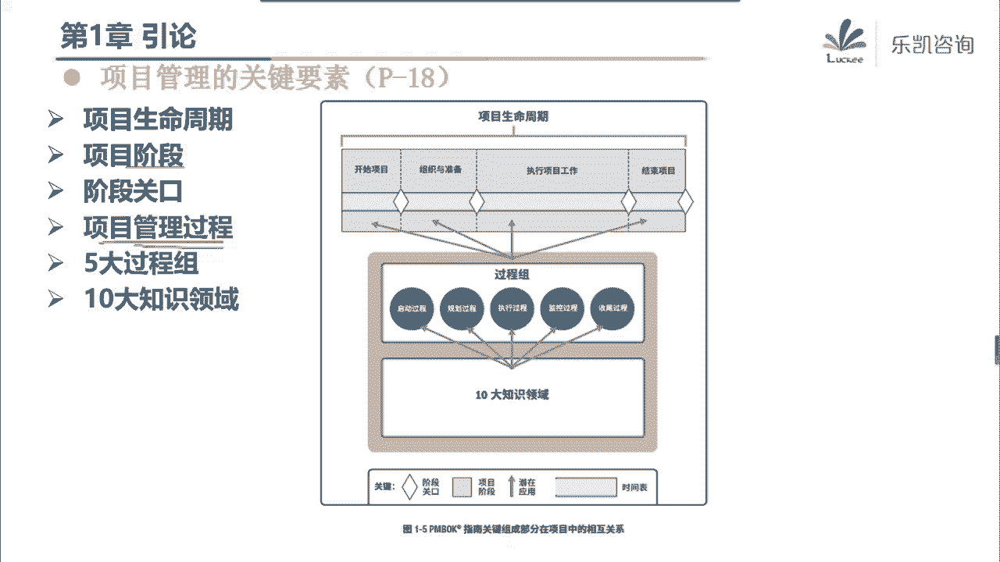

# 2022年PMP项目管理精讲课程-包含项目实战课程 - P2：第一章：引论 - 乐凯PMP - BV11L4y1E7TC

好大家晚上好啊，那个今天晚上呢我们开始正式进入这个偏僻的学习好吧，那么这一周呢我们主要的目的是学习第一章到第三章，那么我们今天晚上星期一呢，我们就先讲第一章叫引论，那么第一章什么叫引论呢。

就是引导大家来学习的一些论述，其实说白了就是一些基本的概念，那么大家在学的时候呢，对这些概念有一个基本的了解就可以了，那么如果说到考点啊，刚刚有人问他说第一章议论里面有没有什么考点是有的。

那么我一会儿再讲的时候呢，会着重去讲，好吧好，那么我们首先看一下第一章里面有什么内容，那么第一章的首先他在讲的时候，他说我们现在学的这个pbox就是项目管理知识体系啊，大家拿到的那本很厚的那本书指南啊。

pmbok指南它是一个指南，而不是一个具体的方法论，那么大家在学的时候呢，其实可以看那本指南，也可以来看讲义，那么我建议大家呢在上课的时候以看讲义为主好吧，那么讲义上凡是后面标的是个p几。

p几就对应了那本很厚的指南，那本书上的第几，那么为什么说这个很厚的这本书，它是一个指南，而不是一个具体的方法论呢，因为它里面只是说到我们做项目管理大致要做哪些过程，可能用到哪些工具。

但是他没有具体的深入到某一个行业里面去，就像我们在启动课，我举了一个例子，它里面可能提到了一些工具，比如说原型法对吧，那么他只是说原型法就是为了做一个模型出来来收集相关方的需求。

但是他不会说唉软件行业要用actual或者建筑业要做一个什么啊，样板房之类的，或者制造业要做一个样品，他不会具体的去说，他只会笼统的说一个啊，我们要做一个模型，用一个圆形法。

那么另外这本书呢只针对单个项目，我们学习的是单项目管理，我们不针对多个项目在一起的，比如说项目及项目组合，当然项目集和项目组合这两个概念我们在后面会有一些介绍，到时候大家看一下好吧。

那么另外我们这本指南它是一个普遍认可的良好实践，那么也就是说大多数时候还是适用于大多数项目的，然后呢用这个指南来做项目，能够提高很多项目成功的可能性，那么另外在这边我们要注意了解这个词的意思，叫裁决。

好问大家一个问题，说到裁剪，大家想到了什么，我最直接的想到的是什么呢，就是裁剪，像我们这种有点年纪的人啊，我们小时候衣服不是到商场里面去买的啊，那我小时候做衣服是怎么办呢，买布回来之后呢，去裁一裁对吧。

然后你需要多大的才多大，那么什么叫裁剪呢，大家会发现这本书里面讲到的内容很多，有很多的过程，但是这些过程是都要用的吗，其实不一定的，它是一个大而全的东西，那么我们有的项目可能只需要用到其中的一部分。

那么我们就把不需要用的那一部分怎么样呢，把它给裁剪掉，比如说好，对吧好，那么我们就用现在的例子来说，比如说我到超市去买啊，我到这个商场去买裤子啊，我身高是1米78，但是我要买多大的裤子呢。

我要买1米95，195的裤子，为什么，因为我呢比较胖，肚子比较大，但是我买了195的裤子，腰围是差不多了，有一个问题啊，这裤管太长了诶，有有半截还踩在鞋子下面啊，那这个时候怎么办呢。

明显那那块地方是我不需要的，那么不需要我怎么办，哎我会给卖裤子的小姐姐说，你能不能帮我把这个裤子给裁一裁，那么裁剪为什么需要做裁剪，因为我用不到，用不到的就要把它裁剪掉。

所以说我们不同的项目在用这个指南进行管理的时候，你要看你需要用什么，对那些不需要用的，那么我们就可以把它裁剪掉好，那么在这里我问大家一个问题，不同的项目需要裁剪掉哪些东西，它是一样的吗，不同的项目对吧。

同一套指南里面哪些东西需要裁剪掉它一样吗，很明显它是不一样的对吧，因为每个人的身高是不一样的，每个人的需要是不一样的，所以说我们不同的项目，它采取的尺度肯定也是不一样的好另外他一开始还强调了。

我们项目经理在做项目管理的时候，一定要有正确的价值观，我们要有责任，要尊重每一个人，要公正，要诚实，那么这个也是比较重要的，我们在后面做题的时候呢，会有一些题目就涉及到这些价值观，好吧，三观要正好。

那么这是一开始他讲的一些内容，接下来他就给大家介绍了什么叫做项目，那么我们在平时工作当中有很多事情呢，我们把它作为项目来处理，那么项目的例子有很多，包括我们生活中也有，比如说我们装修一套房子。

它也是一个项目，我们开发一种新药，设计卡车盖一栋楼，合并公司，它都是项目，那么什么叫项目呢，pmi给出来一个很简短的定义，他说项目是为了创造独特的产品服务或成果而进行的临时性的工作。

那么这个定义非常的简短，但是这里面包含的内容呢很多大家要注意理解好吧，那么这里面包含了哪些内容，首先第一个他说我们是为了创造独特的产品服务成果的，项目是独特的，那么产品服务或成果这个说起来太啰嗦了。

我们把它统一给一个说法叫可交付成果啊，可交付成果也有的地方把它叫交付物对吧，那么也就是说，项目是为了创造独特的可交付成果而进行的临时性的工作，那么这里面它的特点就很明显，首先项目的第一个特点就出来了。

项目是独特的，为什么是独特的呢，因为我们创造的可交付成果它是独特的，比如说我们在给客户做项目的时候，或者说我们在给客户装修房子的时候，哪怕我们是同一支施工队，但是由于我们客户不同，我们施工的时间不同。

当时的材料价格不同，这个项目它的本质上它都是独特的，所以说大家要注意，我们在做项目的时候，可能会存在一些重复的元素，但是项目的本质是独特的，就像我们常说的一句话，这个世界上找不到完全相同的两片树叶。

对吧好，但是独特这个特点很好理解，但是它带来的两个结果要注意的，第一个，由于每个项目都是独特的，所以我们项目会存在什么会存在不确定性，大家知道什么叫不确定性吗，啊我们每一个项目由于它是独特的。

所以它都有一些不确定性，什么叫不确定性，其实说白了就是我们每一个项目由于独特，所以它带来了风险，有人说的无法预知也对对吧，它是存在一些风险的，哪怕是相同的项目，你之前做的比较成功。

但是你可能现在你换一个客户对吧，哎你有可能做的不是那么的顺利，所以第一个独特性带来不确定性，第二正是因为独特性，所以我们在一开始说的那个词啊，为什么不同的项目可以做不同的裁剪呢。

这也是因为每个项目都是独特的，所以它裁剪的尺度是不一样的好吧，所以独特性它带来两个影响，一个是它会带来不确定性，有风险，第二个由于是独特的，所以它的裁剪的尺度是不一样的。

那么我们项目社会的创造独特的可交付成果，什么叫可交付成果呢，说白了就是我们这个项目要交付的一些东西，那么可交付成果它是一个统称，他说在我们做项目的任何一个过程阶段，或者整个项目完成的时候。

我们要交付的东西它都叫可交付成果，而比如说一份计划，一份图纸，包括我们最终的一个成品，它都叫可修复成果，那么可交付成果它是独特的，另外要注意一点，好这个地方大家要稍微注意一下。

可交付成果必须具有可核实性，那么为什么说我们项目做出来的东西必须要可核实呢，问大家一个问题啊，不管是我们软件行业的还是制造业的，或者其他行业的，我们东西做出来之后，能不能直接交给客户，跟客户说。

哎呀我们已经做完了，你拿去吧，直接去验收或者直接去用，可以吗，这个其实是不对的对吧，我们感觉好像我们应该要做一件事情，做什么事情呢，好田金龙说了，我们要做质检，在启动课的时候，也有同学提到这个词叫qc。

对吧，什么叫qc，什么叫质检呢，比如说我们软件行业需要做的测试，我们要测一测吧对吧，包括我们制造业可能要做一些检查对吧，或者呢如果批量很多，我们要做最起码要做抽检吧。

那么类似这样的一个做法来保证我们是符合质量要求的对吧，所以说我们最终做出来的可交付成果一定要具有可核实性，那么为什么要讲这个特点啊，那么主要是为了区分这两个词，一个叫核实，一个叫验证，那么什么叫验证呢。

说白了就是要交给相关方去验收，那么大家要注意可交付成果做出来，我们首先要具有可核实性，核实完了之后，我们才能够交给相关方去验收，或者说验证好吧，这个顺序不能乱的，所以我们一直强调。

可交付成果一定要具有可核实心，那么另外这里面呢还有一个细节，他说什么叫可交付成果呢，就是我们在某一个过程阶段，项目完成的时候，必须产生的独特的并且可合适的叫产品服务或者成果。

那么这里面就意味着可交付成果有可能是有形的，比如说诶我们要生产一个产品，这个产品一般就是有形的，但是也有一些可交付成果是无形的，比如说我问一下大家，如果大家来学pp是一个项目。

你们觉得这个项目的可交付成果是什么，最终这个项目我们交付了什么东西，其实最终这个项目我们交付的就是一个成果，这个知识对吧，比如说某一个行业，某一个领域的知识，它就是一个无形的成果，当然当我说到这边。

很多人就说了啊，交付的是一个证书，证书是有形的，太low了对吧，那怎么能说我们最终是为了证书呢，我们是为了知识，知识是无形的，那么证书是什么东西，证书只不过是这个成果的一个体现而已对吧。

那么这个项目最终我们还是交付的一个成果，好吧好，那么这是项目的第一个特点，独特性很简单，刚刚那句话说到，我们是为了创造独特的可交付成果而进行的临时性工作，第二个特点来了临时性，那么什么叫项目的临时性呢。

项目的临时代表有明确的起点和终点，我们一个项目他一定会约定好什么时候开始，什么时候解锁，而不可能说我这个项目随便做，不管做到什么时候都可以啊，没有这个说法对吧，他一定有明确的起点和终点，但是要注意。

虽然我们强调项目要有明确的起点和终点，也就是项目是临时的，但是临时性不一定意味着持续时间短，这个大家能够理解吧，有的项目它的时间是很长的，包括我有我们有很多的项目，动不动就是搞个10年8年啊。

包括一些市政项目，搞个23年都是有可能的，所以说项目虽然是临时的啊，只是说有明确的起点和终点，不是说项目的时间就短，另外项目是临时的，但是项目的可交付成果一般不具有临时性好这句话怎么去理解，举一个例子。

我们要盖一栋楼，这是一个很常见的土建项目吧，那么我们做这样一个土建项目，盖一栋楼，项目是临时的，可能盖个2年，3年对吧，楼就盖好了，那么接下来我问一下我们这个项目交付的可交付成果是什么东西。

那么盖这栋楼交付的可交付存款可不就是这栋楼吗对吧，那么可交付成果这栋楼它临时吗，他不临时，项目是临时的对吧，但是这个楼他临时吗，楼不临时啊，你怎么知道这个楼什么时候会炸掉呢，谁也不知道对吧。

所以说要注意项目是临时的，但是项目最终产生的可交付成果一般是持久的好吧，那么既然项目是临时的，项目就有结束的时候，那么哪几种情况下项目会结束呢，或者说哪几种情况项目会终止呢，大致有这么几种情况啊。

很简单啊，我们一起看一下第一种情况，当项目做完了，目标达成了对吧，那么这个项目就结束了呀，顺利完成对吧，或者呢有一些项目可能遇到一些技术的问题，感觉再也不会达成目标了，再也做不下去了。

那么这个时候大家也不要拖，项目也要结束掉，因为他没有结果了，明确已经做不下去了对吧，那么这种情况就不是一种很好的情况，那么再比如说项目缺乏资金啊，特别是我们前前段时间前几年对吧，很多地方在做楼的时候。

盖楼的时候啊，资金链断了对吧，到最后变成了一批烂尾楼，那么没有资金了，不可能再投入人力，在这一边缺乏资金，这个项目也有可能会终止，再比如说项目做着做着需求不存在了，没有这个需求了。

那么这个项目也有可能要终止，包括我们没有办法获得资源的时候，好这里我说一下，在我们项目管理里面，资源和资金其实是有一些区别的，什么叫资金，没有资金，那么资金跟什么有关，资金跟钱有关，没钱。

那么这个事情肯定做不下去，那么什么叫资源呢，资源它一般分为两种，一种叫人力资源，没有能力，或者呢一种叫实物资源，包括设备和材料，那么所以这边他说的是，当没有资源的时候，这个项目也做不下去了，对吧好。

那么最后一种情况就是法律或者便利原因终止的，这也是有可能的，比如说有一些地方我们法律上呢可能存在一种空白，后来呢法律健全了之后，这个项目被叫停了，这类项目都不能做了，那么什么叫便利原因呢。

我大致跟大家说一下啊，便利原因呢一般我们叫甲方便利，甲方便利，也就是说甲方会在一些特定的条件下结束这个项目对吧，i5 日俊，可能有一些疑问，什么叫便利原因，我举一个例子，比如说吴同学。

我现在有一套房子嗯，我这套房子呢要装修，而你恰好是装修公司的项目经理，接下来我跟你签一个合同，让你来帮我装修这套房子，你干不干，这是一个正常的项目啊，大人干了对吧，但是有一个问题啊。

就是我这个房子我刚打算装修的时候呢，我忽然听到一些小道消息，什么小道消息呢，说最近我们这边呢可能要拆迁，那么这个时候我就很纠结啊对吧，你说这个小道消息他是不是真实的，我现在无法判断，如果要拆迁。

这个房子就没必要装修了对吧，如果不拆迁，我就得装修，那么这个时候我可能会跟你签合同的时候，补充一个条件，我会这么说，我跟你签订一个合同，一共多少钱对吧，怎么去装修。

但是假如在装修的过程当中遇到房子要拆迁，要拆，那么这个时候我有权考虑到我的便利，我单方面终止这个合同，那么我终止这个合同，你不能说我甲方违约，明白吗，那么这个时候你就要去判断了。

你这个合同愿不愿意给我签，你如果愿意跟我签，如果不拆迁，那么这个合同就正常进行对吧，就正常进行了，那么如果说在做的过程当中突然遇到了拆迁好，那么这个时候我有权单方面终止这个合同，明白吧。

所以这个就是甲方可能会加一些便利的条件，好吧好，那么不管怎么说，遇到这些情况，我们的项目都需要去阻止他，项目是临时的啊，不管你做完了还是再也做不完了，我们都需要把它结束掉啊，都需要把它结束掉，好吧好。

那么这是下面的第二个特点，临时性，接下来，刚刚有人问了一个问题，他说我刚刚举的这个例子，甲方便利跟第四点客户要求终止有什么区别是吧，我说一下，甲方便利这个便利是在合同里面写清楚的啊。

所以我甲方要求根据我的便利结束这个项目可以吗，是可以的，那么第四条说需求不存在客户要求终止，不是客户刷宗旨就能终止的，他一般会涉及到什么，一般会涉及到双方的协商和谈判，没有那么容易了。

不是说你没有需求的，你想不干就不干了，那么这个合同还有什么约束的意义呢，明白吧，它里面是有区别的，是有区别的，那么不管怎么说，遇到这些情况就代表项目要结束了，好吧好，那么说到这一点啊，在做题的时候呢。

我们曾经有一道题目是这么说的，大家看一看这种情况下要不要终止，他说在做项目的时候，我发现客户那边，客户那边啊，有一个人，他抵制这个项目，就他不支持这个项目，就客户里边的大部分人都是很支持的。

但是就是有那么个孙子，他不支持这个项目，他一直在搞事情，一直在抵制这种情况，项目要不要结束，那么一般来说呢这种情况我们是不需要结束这个项目的啊，除了这几种情况以外，其他的一般都不太会导致项目的结束。

为什么呢，有人在抵制，我们要考虑什么，我们要考虑去搞定，他要管理相关方对吧，这不至于导致这个项目的结束啊，项目常见的终止的情况就这么几种好那么这是第二个特点，项目是临时的。

接下来他说项目其实还有一些作用的，什么作用呢，或者叫驱动组织的变更，他说我们公司或者说我们的组织可能当前呢是这么一个状态对吧，好接下来呢我们通过一个项目，我们可以开拓一个领域，或者说我们拓展了一个部门。

结果呢把我们公司变成了将来这样一个状态，通过项目来扩展了我们的一个业务领域，比如说我们乐凯本来是做偏僻培训的，对吧好，现在我做了一个项目，什么项目呢，我把我们所有的同学的一些求职的意愿。

外面的猎头公司做了一个对接，我开拓了一个新的部门，这个部门专门是协调我们的学员跟用人单位，包括跟猎头之间的求职关系的，那么用这样一种方式，我就成立了一个新的部门啊对吧，那么就把组织从当前状态啊。

促进变成了将来的一种多个部门的状态是吧，那么这个其实很简单，另外他还说我们项目还能够创造商业价值好，这一点大家一定要特别的注意啊，其实我们为什么做项目，很大一部分原因就是项目会带来商业价值。

那么会带来什么商业价值呢，比如说我们可以通过做项目来获得一些货币资产，我们能够盈利对吧，哎我们能够提高股东权益，我们能够多一些固定设施工具，或者多占有一些市场份额，那么这些都是我们的商业价值。

但是这些价值我们通常把它叫有形的价值，什么叫有形的，要么是你看得到的，要么是你可以用数据来进行量化的，但是有一个细节大家要特别注意，我们不挣钱的项目做不做，或者我们亏钱的项目做不做啊。

有很多人说到价值就想到什么呢，就想到钱，想到盈利对吧，但是要注意的啊，不挣钱的项目我们也得做的，比如说最典型的公益项目，我们是要做的，这个是不挣钱的对吧，包括啊这个刚刚有人说不挣钱，我还做个毛啊。

包括有一种项目，不知道大家听说过没有，叫标杆项目，好杨希文说到一个很专业的词叫引流，我们先看这个啊，你会发现有很多公司花了很大的代价，投入了很多的人力对吧，然后来做这种标杆项目，从这个项目来说。

它是不挣钱的，甚至呢还是亏本的，但是他为什么要做这种项目呢，好做了这个项目之后，你会发现四面八方的一些领导都会来参观，来参观了之后诶，感觉这个项目做得很漂亮，很不错。

那这个时候你忽然发现有很多的客户联系你们公司，都要做类似的项目对吧，那么像这种实际上就是一种标杆性的项目，它不挣钱对吧，但是我们需要做，做了之后，我们可以通过这个项目来引流，引进来更多的项目。

是这个意思吧，其实我们在日常生活中也有很多不挣钱的项目，但是我们是去做的，比如说刚刚有人说到的滴滴，滴滴在一开始挣钱嘛不挣钱，比如说京东的物流，他一开始挣钱嘛不挣钱，那么为什么要做对吧。

一开始你都不知道他为什么要融入资本，为什么要烧那么多的钱，为什么要有那么多的补贴，让我们用滴滴，到现在大家就发现了，我们出门的时候还会在马路边上招出租车吗，不会了，因为他已经改变了我们的出行习惯对吧。

它已经形成了一定的品牌，所以说有的时候我们为了商誉，为了品牌知名度，为了战略不挣钱的项目，我们也会做，因为这个项目它不在于有形的商业价值，它在于什么，在于这些无形的效益好吧，所以大家一定要注意商业价值。

它包括有形的，但是也包括无形的好吧，那么既然项目有这些特点，项目能够带来商业价值，那么所以项目管理就变得很重要啊，那么什么是项目管理这个呢，大家稍微看一看，这个不重要的啊，那么重要的是什么呢。

我们项目管理它难不难，项目管理它很难，为什么很难，其中有一个很关键的原因，就是我们要管理这些制约因素，或者说我们要平衡这些致病因素，那么平衡什么制约因素呢，比如说范围进度成本。

当然也包括质量资源风险等等，那么特别是范进城，大家都听说过的，那么为什么要平衡呢，因为这几个因素之间相互是有影响的，比如说，我随便画一下范围，进度成本，它的影响在什么地方啊。

我们就从它的这个交叉的点来看，比如说这一块，假如说我希望范围就是我们做的东西啊要多一些，然后呢进度要快一些，要做的东西多，要进度快，这导致什么后果啊，你想一想啊，客户的要求哎呀，我这个要多做一些东西。

而且呢你们进度要非常的快啊，不能延期，最好要能提前范围多，进度快，它的后果就是成本他一定会高，你没没办法的对吧，所以他的后果就是他一定贵，对吧好再看，假如说我们要进度要快，但是成本呢要低。

这会导致什么后果，而进度又要快，成本又要低，那么很明显范围就怎么样，就不能做的很多呀，你那么多东西要做，怎么可能进度要快，成本要低呢，很显然范围就会少，范围就很少，他肯定会影响范围，对吧好，再比如说。

如果我要范围做得多，成本又要低，那怎么办，你做的东西又要多，成本又要低，那么比如说我们在选择供应商的时候，就要仔细的去选择一个物美价廉的供应商，我们所有的计划都要排得非常的清楚，不能有任何的偏差对吧。

很明显我们做的就会慢，所以说这几者之间相互都是有影响的，不可能说我们只关注哪一个，那么刚刚有人说，那么中间这个我们客户通常讲的叫多快神，当然有人还说到质量要好，这几个能不能都做到，不能。

如果中间一定要写一个字，我一般会写这个字，做不到的对吧，我经常跟我们的项目经理说，大家一定要注意我们项目管理是一门科学，他不是一个神学，也不是一个玄学对吧，所以说中间这个能做到吗，我们是做不到的对吧。

我们最多只能怎么办，站在项目经理的角度，站在全局的角度去干什么，去平衡对吧，所以项目管理一定是很难的，我们需要去平衡这些相互影响的制约因素好吧，那么这个是项目的一些基本的概念，包括项目管理的难点。

那么接下来项目呢它其实就是一个我们现在学的项目管理，是一个单个项目的管理对吧，单个项目的管理的就像单个的人一样的，你自己管好自己就行了，那么如果有多个项目在一起，它是什么呢，好如果有多个项目在一起。

就是项目集或者项目组合，那么这两个呢不是我们学习的内容，但是有一个特点呢，大家要掌握对它的概念有一个基本的了解，好问一下大家啊，如果说我们单个的项目就像所谓的单身狗，自己管好自己就行了。

一个人吃饱全家不饿，但是如果有多个人在一起，这会变成什么，那么这会变成两种，一种就是变成家庭，那么项目级这个概念就有点像家庭的这个概念，那么什么叫项目级呢，他说我们有一组项目需要被协调管理。

那么这一组项目它的特点是什么呢，相互之间是有关联关系的，我们必须要强调什么，必须要强调相互之间要配合，要协调，比如说问大家一个问题，对于一个家庭来说，什么样的家庭才算一个幸福的和谐的家庭。

你说光我们这一代人，比如说夫妻双方工作很好，行不行不行，应该说还不够对吧，我们还要兼顾到对子女要花一点时间去陪伴他，对于老人要去花一点时间对吧，也就是说哪一个人好是不够的，相互之间要配合的。

要协调的啊对吧，那么这种就是项目级的关系，相互之间是有联系的，要协调好的，那么还有一种情况是什么呢，就是这些人之间是没有关系的，这有点像什么呢，像国家或者呢如果说国家太大了呢。

我们用一个小一点的概念叫小区，比如说我们住在所住的一些小区，它有无数的人，有无数的家，有很多人有很多家庭对吧，那么这些家庭之间需要协调吗，有关系吗，其实没什么关系，比如说我对门的邻居。

我到现在都不知道他们家里有几口人，他们姓什么，不打交道的，那么在一个小区里面，我们之间存在什么关系呢，只有一种关系，就是资源的争夺，比如说很典型的一种情况啊，小区里面有一个幼儿园。

这个时候幼儿园要开学了啊，你会发现有很多的小孩都要去读幼儿园，但是这个幼儿园招生的名额是有限的，那么这个时候怎么办，这么多小孩不可能都进去了，那么这个时候他一定会分一个什么东西。

一定会分一个优先级的问题，你比如说学校可能会有规定啊，哪一种小孩，比如说户口跟房产都在这个小区的，那么优先录取，然后返厂在这个小区的，但是户口不在这个小区的，你就要往后放一放对吧。

他一定会有一个优先级的问题，涉及到优先级的问题，涉及到我们一定要去想办法选择合理的事情去做，然后让我们的资源最大化的，让我们的回报最大化的，这种就是项目组合，项目组合之间不一定有什么协调的关系呢，好吧。

那么项目集和项目组合最大的区别实际上就是在这边，那么我用一个例子呢来看一看大家对这个区别呢有没有理解啊，其实这个很简单好，我们看一个例子，我们现在呢有一个酒店集团做酒店了。

我现在打算在三个城市盖三个酒店，当然除了盖三个酒店以外，还有我本身我这个集团的运营工作要做的对吧，但现在遇到一个问题，什么问题呢，我们这个集团的资金有限，资源有限，这三个酒店不可能同时去建的对吧。

那么我就必须要考虑哪一个酒店，它的优先级比较高一些好，那么问一下大家，这三个酒店项目在一起形成的叫什么，是项目组合还是项目集，那么我们根据刚刚讲的内容对吧，相互之间需要协调的这个叫项目集。

如果只是争夺资源，希望来根据优先级来进行正确的选择，让我们的收益最大化了，这个叫项目组合对吧，那么在这种情况下，我们就要根据刚刚的定义去看了，首先这几个酒店建酒店的项目之间有没有什么协调关系啊。

有没有什么关联啊，他其实没什么关联，那么他们之间更多的是什么关系呢，在争夺资源对吧，那么我们要考虑的是什么，我们要考虑的是优先级的问题对吧，优先先进哪一个，那么这个就是项目组合好吧。

所以说大家有没有发现，其实项目组合强调优先级，换一个说法，就是我们要强调选择要正确，对吧，选择要正确好，那么接下来再看，假如说我选择了在上海先把这个酒店先建起来，因为在上海把酒店建起来。

我感觉我的收益会最大化，好钢用在了刀刃上对吧，那么接下来建酒店的时候也有很多写作的，如果做过土建的同学，一定会知道该酒店肯定有涉及到弱电这个项目组，专门做弱电的，做消防的，做装修的。

包括呢酒店还要做信息化，比如说做我们i t的，那么我问一下这几者之间需要协调吗，需不需要协调，比如说做装修的跟我们做i t的要不要协调，做弱电的跟做装修的要不要协调好，讲一个很简单的道理啊。

虽然我们是做i t的，但是我们在这个酒店开始动工之后，我们就要参与进来，为什么，因为什么地方要留网络面板，什么地方唉要留这个，比如说监控的一些东西，这些我们都需要先安排什么，安排点位。

先要布线不好呢对吧，如果不协调会导致一个什么后果，人家把地板把墙面都装修好了，结果我跟他说，哎呀不行啊，这里我要放一个大屏对吧，放一个大屏之后呢，所以我墙上我要开个槽，我要再补一根线，行不行。

这就不行了呀，人家装修都搞好了，你再把墙面再破坏掉，或者再把地板再破坏掉，再布线，这怎么行啊，所以相互之间需要协调对吧，比如说我在做，我们有些项目是跟这个图鉴配合的，我一般会问他。

比如说你们装修天花什么时候要掉，在吊天花之前，我上面的线就要走好，包括无线ap的点位就要留好了，比如说做弱电的也要跟我们协调啊，哎弱电会问你这个墙面什么时候粉刷，或者地面什么时候铺。

把预埋的管子就把它埋进去啊，你不能等人家都弄好了之后，你再把地面凿开了呀，所以说这些项目之间是需要协调的，我们一般在项目现场会开很多的协调，会，大大把时间节点都碰一碰。

那么什么时候必须要把什么东西都做好，一定会有这样一个工作的，那么这些项目之间就叫需要相互协调，相互配合，明白吧，那么这种叫什么，这种就叫项目及项目集，那么项目吉他关注的是什么。

他关注的是项目和项目之间我们协调的方式要正确，他就不是选择要正确，而是方式要正确啊，那么当然最小的就是项目，那么项目你自己直接做好配合对吧，自己之间协调好项目也是方式要正确，所以说通过这个例子。

让大家知道项目组合跟项目级它的区别在什么地方，一个强调优先级序选择正确，一个强调什么呢，相互之间的配合方式要正确好吧，那么从实际上来说啊，项目组合它的层面应该是或者说它的体量一般来说要大一些。

然后接下来是项目集最小的呢应该是项目这个体量好吧，那么既然也很简单，项目组合有四个字，项目集有三个字，项目呢有两个字对吧，所以一般项目组合的体量要大于项目级，项目集的体量要大于项目。

那么不管项目及项目组合项目，它主要都是为了实现组织的一个战略的，好吧好，我回答一下陶艺秀的问题，他在问你们讲义上有没有这一页，我说一下讲义上没有这一页，因为这是一个例子。

因为网络班呢我用笔直接去画这样一个东西呢，太难画了，太难画了，所以我直接就把它做成一个ppt，做成坐在一页上面好吧，那么这个是项目集和项目组合，那那么另外呢我们刚刚在介绍项目组合的时候。

还说到一个概念叫运营的概念啊，这个概念呢大家呢跟项目呢稍微做一个区分，其实我觉得大家有很多人对运营呢还是有一些了解的，什么叫运营啊，运营跟项目不一样啊，我们说项目是临时的独特的啊。

运营呢它一般是一种重复性的工作，它是持续的重复的，比如说我用一个例子来说一下，大家就明白这两者的区别在什么地方啊，我们举办一场婚礼，算不算一个项目，那么我们就根据项目的特点去套啊，举办一场婚礼，临时吗。

临时的婚礼嘛能有几天嘛对吧，举办一下就结束了，独特吗，独特的，所以举办一场婚礼当然算一个项目对吧，好婚后的生活我们叫什么，其实结婚了之后的生活我们就叫运营，我们要经营我们的小日子嘛。

对那么运营它是一种什么工作，你会发现每天都是柴米油盐对吧，那么像这种持续的重复性的工作，我们一般就叫什么呢，运营好吧，那么项目跟运营我们一般用约定俗成的这种方法啊，项目是临时的，持续的是运营。

那么项目跟运营的实际上是有一些关系的，是有一些关系的，一般呢在我们项目开始的时候，项目开始的时候我们需要一些资源，那么往往我们会从运营那边调一些资源来做这个项目，那么项目做完了之后呢。

资源呢又会回到运营对吧，这之间会有一些关系啊，稍微了解一下就可以了，那么另外在这边讲义上还讲到组织级项目管理oppm对吧，刚刚好像也有同学问到的，这op m就是我们刚刚说的，它是一个框架。

我们整合了项目组合，项目集和项目一起来来实现我们组织的一个战略啊，这个呢稍微了解一下就可以了好吧，那么前面是我们讲的关于项目的一些基本的概念，包括我们顺带介绍了一下，像那么集和项目组合。

那么接下来我们看一下我我们项目经理要关注的，项目管理的一些关键要素好，那么这里面就包括项目的第一个项目的生命周期，首先问一下大家，说到生命周期，你想到了什么，说到生命周期你想到什么，其实说到生命周期。

我就想到生老病死，唉李晨说的很对对吧，从生到死这样一段过程，这就叫生命周期好，那么接下来有一些概念我们就不用去背了，什么叫项目的生命周期，能够理解吗，人的生命周期就是从生到死吗，那么项目的生命周期呢。

大家说得很对，就是项目的开始到结束哦，为什么项目它具有生命周期这样一个说法，因为项目是临时的，大家还记得吧，那么既然项目是临时的，他总有项目的开始到结束这样一段过程啊，对吧好。

那么接下来什么叫项目的阶段呢，问一下大家，我们管这样一个项目是怎么管的呢，比如说今天星期一，在今天一开始，我就安排我的团队要做一个项目，在星期五结束的时候要交出来，那么我们一般会怎么管呢。

你说我直接星期五需要一个结果行不行，那么我们一般会怎么做，我们一般会分阶段，比如说星期一做完了，我看一看做到什么程度了，是不是符合我的预期对吧，然后星期二星期三，比如说星期三下班的时候我再看一眼。

然后星期四下班的时候再看一眼，然后到星期五结束，那么也就是说我们为了让这个项目可控，我们一般会把项目怎么样对了，切成一段一段的分阶段来管理，那么这一段一段的叫什么东西，就是项目的阶段啊，这个太简单了。

那么我们看一下pmbok里面他是怎么说的，他说什么叫项目的生命周期啊，项目的生命周期就是从项目开始到结束，所有的一系列的阶段，这就组成了一个项目的生命周期，从开始到结束，然后分成若干个阶段对吧。

那么另外他说第一段跟阶段之间的关系可以是顺序的好，什么叫顺序的啊，顺序是这样的，我第一个阶段做完了，接下来进入第二个阶段，第二个阶段做完了，接下来进入第三个阶段，这个就是顺序的啊，那么还有可能是交叠的。

什么叫交叠的呢，他说有的时候可能会这样，我第一个阶段还没做完，差不多了，第二个阶段呢提前一点时间开始了，那么第三个阶段呢也提前了一点时间开始，他可能有一些重叠的部分，交叠的也可以吧。

好另外他说还可以是迭代的好，什么叫迭代的，迭代的是这样的，我们有一些项目很特殊，他说我这样，我呢先做一个版本出来，这是第一个版本，然后呢我去看一看有没有什么地方要调整的人，接下来呢再来一个版本。

第二个版本优化了第一个版本，再来一个版本，第三个版本通过不断的迭代，最终把这个项目呢给做掉了，那么这也是可以的，那么这些概念都比较简单好，然后接下来pm报告里面提到说项目的是阶段和生命周期。

其实呢每个项目呢它都会存在，但是我们可以把它总结成一个叫通用的生命周期，好我解释一下什么叫通用生命周期啊，举一个例子，这一页也是我做的一个例子啊，大家讲义上的没有，你看一看，看懂就好了。

比如说我们有很多的项目，人这一生是一个项目，我可以把它分成若干个阶段啊，我们软件的项目也可以分成若干个阶段，大家来学pp也可以分解成很多的阶段对吧，那么这些阶段你会发现不同的项目。

不管是阶段的数量还是阶段的名称，它都不一样，那么我们做项目管理，我们要把它的通用的部分把它给抽出来管理，那么接下来我我们怎么去管理呢，好我们把这些阶段都总结了一下，我们发现不管是什么项目啊。

g上它的阶段呢分为了四大类啊，哪四大类，第一类叫开始这个项目，有一些阶段是为了开始的啊，这个时候只是做一些立项的工作好，接下来第二阶段就要组织于准备做一个准备性的工作的，那么第三类阶段是真正在执行的。

最后呢是结束这个项目的这四类好，那么我们来随便找一个看一下是不是符合这种特点，比如说人这一生在学前刚出生的时候，我们认为它是开始，然后从幼儿园开始，一直到读书到大学毕业，这一段学习的过程。

我们可以认为是组织与准备能够真正去工作，为社会创造价值，我们认为是执行到最后的退休，我们认为是结束，包括大家来学pp这个项目，是不是也可以概括成这样一个通用生命周期呢，比如说咨询算是开始对吧。

组织与准备啊，我们要开始报名了，在准备接下来学习复习模拟是在真正的执行最后考试了，那么项目到了结束阶段，那那么也就是说我们把不同的项目，它的生命周期的阶段，把它总结成通用的生命周期，一共这四个。

要开始项目阶段，组织与准备，执行和结束，那么大家想一想，我们见到的项目是不是都可以分成这么几个部分，刚刚开始立项，然后做一些准备工作，然后接下来去执行，最后去结束这个项目。

然后接下来在这样一个过程当中有一个什么特点啊，我说一下，在整个项目生命周期过程中，我们的人力投入或者说成本的投入，它是缓慢增加到执行的时候达到最高，然后在结束的时候呢迅速回落的。

啊那么这样一个特点为什么会存在呢，因为在一开始启动的时候，或者开始的时候，在做准备的时候，我们一般投入不是那么大，在执行的时候确实投入达到了最高，那我在结束的时候为什么会迅速回落呢，好问大家一个问题啊。

我我们大多数项目在项目快结束的时候，或者我们有一个专业的说法，在项目收尾的时候，那一般是希望快一点还是慢一点，我们项目该做的都做完了，接下来这个项目要结束了，这段过程我们希望快一点还是慢一点。

希望快一点对吧，为什么呢，慢了之后呢，夜长梦多，所以理论上我们希望收尾要怎么样，要快速收尾，你说你拖拖拉拉的啊，反正我做完了，我慢慢等，就有很多的禁锢在里面，比如说开火一会儿让你加个东西了对吧。

比如说我遇到的最扯淡的一种情况，注意甲方的领导换人了，我靠这个就很头疼了，对所以收尾我们强调快速收尾，那么既然是快速收尾，这个时候我们资源它的回落相对来说就比较迅速一些好吧，那么这是第一个特点。

第二这个特点他说在我们整个做项目的过程中好有些风险和变更啊，风险就是不确定性，变更的就是一些变化，在一开始的时候呢是很高的，那比如说我们经常做项目遇到这种情况啊，高图标写的东西对吧，到了项目现场一看线。

实际情况跟这个里面好像变化挺大的，甚至有的时候我们的设备可能都要做一些调整，一开始的时候呢风险和变更都是比较大的啊，包括我们我再说一个很简单的项目，咱们家里装修对吧，一开始肯定主意都是很多的好。

随着这个项目执行下去，一直到最后快要收尾，快要结束，这个变化还多吗，这个变化就不多了，对，因为所有的东西基本上呢都已经固定了啊，都已经固定了，你要改呢也都不太会改了，风险呢也不会那么多。

因为项目都已经越来越明朗了，风险也是在逐渐变小的好，还有一个叫相关方的影响力，什么叫相关方啊，就就是跟我们项目有关的各方，比如说我们公司的领导，包括我们的客户，阳光发的影响力，它会有一个什么变化。

相关方的影响力也是越来越小的，比如说在在项目一开始的时候，大家知道领导跟客户是什么要求吗，那么一开始的时候领导跟客户是什么要求要都很高的，哎呀这个项目一定要做成一个标杆项目对吧，一定要有亮点。

一定你要解决什么什么问题，一定要怎么怎么样好，随着项目执行，相关方的影响力会怎么样啊，会越来越差，为什么不，因为这个项目已经成型了，已经明朗了，领导跟客户呢有的时候呢也会认清现实对吧。

那这个时候你再做到那种东西呢不太可能了，对相关方的影响力也会越来越低，那么这是一个方面，那么从另外一个方面来说啊，大家要注意，我们刚刚说变更是越来越少，风险呢也是越来越小的对吧，但但是一旦出现变更。

变更带来的影响它是越来越大的，就是说我要变，我就说家里装修好了，装修一开始你没有设计装地暖，一开始变更行不行啊，反正还没装修，等你家里面地面砖都铺好了，到最后了，你忽然跟装修公司说不行。

我要装一个地暖行不行，我靠那这个时候影响就很大了对吧，所可以说变更越到后面，它的影响呢是越来越大的，这些东西呢都比较简单，我相信呢大家稍微听一听的，基本上都能够听懂，好吧好，接下来我们介绍另外一个概念。

刚刚讲了项目的生命周期，接下来第六版pm报告里面加了一个概念，叫开发生命周期，我解释一下什么叫开发生命周期啊，他说在我们项目生命周期里面啊，有一些阶段是跟可交付成果的开发相关的啊。

那么这些阶段就组成了开发生命周期，比如说我们刚刚讲到项目的生命周期可以划分成多个阶段啊，那么其中比如说这两个阶段跟我们的可交付成果的开发直接有关，比就是说软件行业里面的最典型的编码，建筑行业里面的施工。

或者在制造行业里面的生产，那么这些阶段就组成了开发生命周期啊，他说那么开发生命周期呢有几个类型，可以一是预测型，可以是迭代型，可以是增量型，可以是适应型，也可以是混合型，好大家要注意。

目前考试仍然会有这样一个考点，而且是必考的内容，大家大家一定要理解这几种类型的区别，所以接下来我会详细讲一讲这几种类型好吧，那么什么叫预测型呢，我们先看第一个，从它的这个字面意思来说，什么叫预测性。

就就是我做这个项目呢，我是能够预见到要经过哪些阶段，要怎么做的，我脑子里面是有这样一个概念的，我有很多的传统项目，比如说建筑业，制造业的都是用的这种预测型，那么预测型也叫瀑布型，也要用计划驱动。

我举一个例子啊，比如说如果你现在让我开发微信这样一个软件，所以我现在对微信功能还是比较了解的，所以我会怎么做呢，我会排一个计划啊，我先把需求定下来，一要做聊天支付，朋友圈摇一摇，漂流瓶，收藏对吧。

需求确定清楚之后，接下来再做好设计工作人，然后再让团队去开发测试，最后试运行上限好，大家有一个新的微信不用一用了，那那这种项目的特点就是我们都是可以排除计划，然后按照计划按部就班一步一步的去做的。

那么接下来大家想一想，如果我们要用这种方法说做项目之前，我们有一个排好的计划，然后根据计划一步一步去做，那么必须要有一个什么前提，环艺轩说得很对啊，他说我感觉这种做法呀一般适用于成熟的公司啊。

或者比较成熟的行业，为什么呢，因为这样来说就像冯文静说的这样有经验啊，很了解啊，所以就说如果你要用这种瀑布型的或者叫预测型的，用计划来驱动，我们必须充分了解产品有厚实的行业基础。

比如说最典型的有哪些行业呢啊建筑业，你放心，借建筑业做项目，他一定有计划对吧，一定有设计图纸，然后有计划按照计划一步一步的来，比如说大部分的制造业，一般也是有一些生产计划的对吧。

还有一些有人说到it行业，it行业呢，一般我们传统的it行业，比如说一些大型的集成项目，政府项目，像我以前做的政府项目也是要有计划的对吧，实际上的大部分项目都是用的这种叫预测性，预测型好，但是我问一下。

有没有可能我们对这个产品不太了解，有可能吗，也有可能的，那对这个东西不太了解，我们就要摸索啊，那么这个时候就没法排一个计划呀，这个时候就不能用预测型了，那怎么办好，我们看一下其他几种类型手。

我们看迭代型，那迭代型是怎么做的呢，比如说同样是开发微信，我换一个做法，假如说我对微信不了解，我这样做，我先把第一个版本做出来，比如说聊天支付，朋友圈摇一摇，漂流瓶收藏，我需求设计开发测试上线。

先上一点的版本，那那这个一点的版本有什么特点啊，这个聊天啊做的很简单，只能发文字，朋友圈也是一样的，只能发一句话，然后摇一摇也是很基础的，漂流瓶也是很基础的，那就像这种先做了第一个版本。

然后接下来呢哎我及时的让客户去用，用了之后收集反馈，然后接下来我再去细化，在原来的基础上细化一下，变成了二点的版本或者1。1的版本啊，然后接下来我再把它整个的细化一下，最终形成了啊。

最终的一个版本交付给客户，那么大家要注意这种方法，它的特点是什么，并没有按部就班的按计划去做，它需要通过版本不断的迭代来达到最后的一个结果啊，那么这种我们就叫迭代型生命周期，迭代型开发生命周期。

那么迭代的特点，那么看这张图，大家应该能够看得比较清楚对吧，迭代它并不是一步到位，一次交付的，他需要通过一系列的重复的循环来达到一个什么后果，达到一个什么结果，从模糊到清晰的一个结果。

这就是迭代不断的细化，不断的细化，那么除了迭代以外呢，还有一种做法也会存在的叫增量型，什么叫增量型呢，这样吧我们先做其中的一部分，把它做好，那没有问题，等这一部分做好没问题了。

再捕捉这一部分啊啊然后再捕捉这一部分，一知道整个的完成，每次呢先交付一部分对吧，先做完一部分，那么增量型跟迭代型最大的区别在什么，一开始并不是一个完整的，他只是做了一部分对吧。

它强调从部分到整体一点一点地加上去，比如同样做微信，我可以这么做，先做聊天和支付，做完了之后呢，再加朋友圈跟摇一摇，撞完了之后再加漂流，平衡收藏，一点一点的增加，渐进的增加，那么增量型也是一种做法好。

那么除了分量和迭代，其实考试中考的比较多的是适应性，二适应性才是我们说的敏捷好，大家注意听啊，要注意，很多人会有这样一个问题，敏捷和迭代和增量有什么区别，好吧，那么我们说一下，敏捷在做的时候是怎么做的。

第一步，把所有的功能统放到待办事项列表，你就统一放到一个地方，然后干什么呢，注意他要做一件事情，按照优先级排序，他要去排序的究竟哪个优先级最高，那么优先级最高的把它拿出来一部分先做，比如说举一个例子。

我们现在觉得明那个微信要做这么多功能机，接下来我们根据市场的反馈，发现哪一个东西的优先级最高呢，好发现朋友圈的优先级最高，那怎么办，接下来我可能安排一个很短的时间，一般是2~4周，在2~4周里面。

我们就优先做优先级最高的，比如说朋友圈这个东西做完了之后，立即去给相关方去演示，演示了没有问题，我们就推向市场，那问题来了，如果2~4周演示了之后，是那个客户提了一些意见，说我要再细化细化，那怎么办呢。

那么接下来我就要看了，如我有什么要细化的，要优化的，它重不重要，如果它仍然是优先级最高的，那么下一次我仍然去优化朋友圈，也就就是说这里面有一个迭代的概念啊，那么问一下大家。

这个迭代跟我们之前讲的迭代它的区别在什么地方，我朋友圈先交付啊，如果有什么需要优化的，而且大家觉得优先级也很高，那么我就再把朋友圈在下一次做的时候再优化一下，这个其实就是朋友圈的迭代。

那么这个迭代跟之前的这个迭代有什么区别呢，你会发现之前我们说的这个迭代，它是整个项目先迭代一个版本，再来一个版本，而我这边并没有对整个项目迭代，我是说朋友圈现在市场上很需要这个功能对吧。

那么接下来如果要优化的，而且很重要，下一次我优化的是什么，就是朋友圈，他只是做这样一个迭代，那么接下来如果说朋友圈做完了之后没有问题怎么办呢，好你看剩下来的哪一个功能最重要，如果说朋友圈做完了。

剩下来最重要的功能是摇一摇，那么接下来我下一次我就做摇一摇这个东西，下一次的2~4周交付这样一个增量，那么这个增量跟我们之前讲的增量有什么区别，没有，发现我们之前讲的增量并没有强调什么呢。

并没有强调优先级的问题，啊那么我们敏捷里面它的增量是真的什么东西，它特别强调价值交付，增加的一定是最有价值的或者优先级最高的一个东西，对吧，你朋友圈做完了，接下来我们发现摇一摇最重要。

那么下一次我们就真摇一摇，好接下来再看哪个优先级最高啊，比如说下一次我发现有一个功能优先级很高，我做摇一摇的时候啊，我忽然听到这样一个说法，现在有一些软件推出了一个功能，叫附近的人，这个功能很好用。

那么我现在正在做摇一摇呢，我会跟产品经理说什么呢，这样你把这个功能呢放到这里面去排优先级，你会发现原来这个功能里面有没有附近的人啊，没有，但是现在市场上就是需要这样一个功能办理，怎么办呢，好不要着急。

把这个东西放到这里面排优先级，然后接下来等我摇一摇做完了之后，我再看是这不是剩余的里面附近的人优先级最高，如果是，那么接下来我就做附近的人，好在做父亲的人的时候，我又收到一个消息。

说现在国家的法律法规允许做漂流瓶这个功能了，怎么办，没关系，因为漂流瓶我还没做呢对吧，该做的我早就做了，交付给市场去验证去了，像这一种漂流瓶还没做呢，那么没做嘛就不做了呀对吧。

你敏捷这种方法就特别的灵活，非常能够响应市场的变化对吧，那么敏捷在我们考试当中出现的是比较多的啊，也是我们pp里面所说的叫适应型生命周期，那么有一句话是这么说的，适应运行生命周期它属于敏捷的对吧。

它里面有迭代，有增量啊，有迭代有增量，那么在考试的时候，适应型生命周期其实就是说的敏捷，那么敏捷的特点是什么呢，它有迭代有增量，但是他强调用较小的增量去快速迭代，一次交付一定是交付最有价值的功能。

这是敏捷的一个特点，而且呢每一次交付的时候，官方都要来参与的，像客户啊都要来参与演示的对吧，有什么问题会及时的去反馈，然后市场上有什么变化，我们会快速的去响应，所以敏捷这种方法它有它的好处。

就像我们有人说的，它是一种小步快走的做法，这几种生命周期的类型啊，大家要注意，其实它里面没有谁好谁不好，那么我们在考试的时候呢，也会有一些选择让大家进行啊，啊比如说问大家一个问题。

比如说我们公司有厚实的行业基础，这个行业已经干了好多年，现在接到这个行业里面的一个项目，我们最好用哪一种生命周期去把它，你项目把这个项目给完成掉，我说到有厚实的行业基础，不用丰富的行业经验。

那么就做这个行业里面的一个项目，那么想都不要想直接选择预测性计划来驱动，因为预测型这种呢相对来说呢成熟唉，我们也行业经验也比较成熟，解决方案也比较成熟，相对来说它不会有那么多的变化，假如说换一个说法。

现在我们在做一个创新项目啊，他没有我要响应市场的变化，而且呢我们希望能够快速地推出部分功能，让这个市场先用起来获取客户的反馈，那么这个时候你选什么最好的，其实就是敏捷或者叫适应性好吧，那么在考试的时候。

这两种考得特别的多，一般再说考生命中心类型的选择，要么就是预测型，要么就是适应性对吧，而我我们中间讲的迭代和增量，三种类型大家理解意思就行了，那么为什么我们一般不太说迭代和增量呢，大家想一想啊。

在做项目的时候，有没有可能有哪个项目做迭代不增量，或者只做增量不迭代有可能吗，咳那一般不太可能，如果你要用迭代和增量，一般的我们是迭代和增量混用的，所以在考试里面，其实我们学习的时候。

只要区分迭代和增量，它是不一样的，它的区别在什么地方，实际在用的时候呢，不太会用这种真的迭代的方法，好吧好，那么接下来还有人说，那么什么叫混合型呢，我说一下混合型啊，核心球其实就是预测和敏捷混在一起了。

混合型就能预测和敏捷混在一起，那么我举一个例子给大家看一下，他说可能会存在什么样的混合，一个项目有软件，部分还有呢硬件的采购部分，硬件这一部分采购我们是可以排计划的，很明确的，他用的是预测型。

那么软件这一块呢可能我们要不断的调整啊，我们要应对变化，所以我们用的是敏捷，也叫适应型，对于整个项目来说，它就既敏捷又有预测，不可能出现什么情况呢，比如说我们有一个项目技术呢不明确。

所以在前期我们要做一些技术的，做一些技术的研发，在这个阶段我们用的是敏捷等技术上确定没有什么问题了，后续真正开发的时候，我们用的是预测也是有可能的对吧，包括刚刚李晨说到的大瀑布，小敏捷也有可能啊。

比如说诶我一个这项目本身它是瀑布型的，其中有一个阶段里面我用的是敏捷的方法来开发的对吧，那么所以什么叫混合型，无非就是预测型跟敏捷都会涉及到，那么这个就是混合型好吧。

那么五我用这几个例子呢帮大家来看了一下，什么叫预测，什么叫迭代，什么叫增量，大家讲义上呢也有对吧，预测型就是用计划来驱动的，叫预测，然后迭代更增量，一定要明确它的区别，一个是在不断的重复来从模糊到清晰。

一个是在渐进的增加，由部分到整体对吧，那么这一块了解概念的区别就可以了，然后接下来敏捷，什么叫小的增量，快速迭代，频繁交付对吧，应对变更，我相信通过我刚刚的那个例子，大家应该有一个了解了。

那么这系统生命周期啊，大家一定要注意预测性和敏捷的特点好吧，那么这个叫开发生命周期，当然后面还讲到一个概念，叫产品生命周期，这个概念呢大家呢了解一下就可以了，那么什么叫产品生命周期呢，我们看一下概念。

他说一个产品从概念到交付到成长，成熟到衰退，整个一系列的阶段叫产品的生命周期啊，产品的生命作息范围是很大的，他哥项目生命周期是有一点联系的，那么我把这两者的联系讲一讲，大家就明白了啊。

说我们现在呢有很多产品都已经见不到了，我不知道大家有没有听说过一个产品叫小灵通，做这个产品吗，就在很早以前啊，在手机刚开开始的时候，还有这样一个东西叫小灵通，它跟手机类似。

但是电话号码呢是一一个很短的固定电话的号码，那么这个东西现在还有吗，不存在了，那么我们回顾一下这个东西，它整个的一个产品生命周期，他肯定有一个概念阶段，比如说有一些企业提出来这样一个概念。

固定电话太麻烦了，我们可以在这个基础上呢啊搞一个什么小灵通对吧，好，有了概念之后，接下来干什么，我们确定要做了，接下来我们就要立项，然后接下来我们要设计啊，要怎么怎么样让你想要制造。

最终把这个小灵通把它给做出来啊，这一段过程是什么，这一段过程就是我们说的项目的生命周期，开发这样一个产品，那么开发好了之后，项目生命周期结束了，产品有了，接下来要干什么，接下来我们可能要量产。

要推向市场，包括那么还要干什么呢，我们可能要升级版本啊，一直到最后到现在小灵通还有吗，没有了，到从这个市场上退出，这整个一个过程是这个产品的生命周期，所谓对产品的生命周期也是一样的道理。

从产品的概念一到最后产品最终消亡在这个市场上再也见不到了，那么这是产品的生命周期，那么从这样一张图里面，大家会发现其实是产品的生命周期里面会包含项目生命周期，比如说刚说我们做小灵通的时候。

一开始它就是一个项目，到后面升级也可以当成是一个项目，所以说产品的生命周期啊，一般来说要大于项目的生命周期，它可能会包括多个项目生命周期，好吧，这个是这几个生命周期啊，项目的生命周期。

开发生命周期和产品生命周期，当然生命周期里面还包括一些细啊细节的东西啊，比如说啊刚刚说了生命周期可以分成多个阶段啊，阶段的划分呢其实呢要看每个项目的不同啊，每个项目这个习惯不一样。

它划分的阶段的数量也是不一样的啊，包括我们在阶段跟阶段之间有这样一个说法，叫阶段关口，这个概念呢稍微了解一下，一个项目划分了多个阶段，在阶段跟阶段之间，我们一般有一些审查点。

这个阶段做完了能不能进入下个阶段啊，这里面会有一些阶段的关口来审查，我们会做一些决策，是不是可以进入下个阶段，所以这个检查点我们一般把它叫关键决策点，或者叫阶段入口，进到出口，像最基本的概念呢。

我稍微带一带啊，大家稍微了解一下就可以了，好吧好，那么前面都是讲的这些阶段的东西，不需要你全部都记住，但是呢你要能够听得懂啊，听懂了就可以了，好吧好，接下来是定周期，到这里就结束了。

那么关键我们要考虑在生命周期这个过程当中，我们项目经理应该怎么去管项目，那么这里面就涉及到我们的项目管理过程，也就是五大过程组和十大知识领域，好那么为了管理过程和阶段之间的区别。

那么我用一个例子来说一下啊，这一块其实不是很重要，但是很多人不理解，所以呢我详细的去讲一讲。

举个例子来看一下啊，我直接现场去画一个例子。

教大家，假如说我们要把人这一生作为一个项目，觉得可以划分成哪几个阶段啊，一声对吧，看成是一个项目的话，我们街上怎么划分呢，我们可能会这么划分，那么几块吗，好有人说了，出生，比如说四岁。

这个是开始阶段刚出生嘛，刚开始对吧好，接下来有人说幼儿园小学中学大学对吧，我们把它合并合并吧，再说22岁大学毕业吧，这个我们认为叫组织啊，这一阶段，对吧好，接下来22岁毕业了，工作工作分为哪几个阶段。

唉有人说我要创业，或者我去小公司再去大公司对吧，我们合并一起来说一说，20岁到65岁执行是我们的工作阶段对吧，65岁到100岁，这是什么阶段，我们就按照项目的通用生命周期来说，这个其实就是结束阶段了。

退休了，好假如说我们粗略的分一分，就分为这么几个阶段，那么接下来大家，那么这个医生你打算怎么去管理他呢，定周期它是从时间的维度划分成了这四个阶段，那么你怎么去管理它呢，一般会这么管理。

比如说这个阶段我们一个阶段一个阶段的来管对吧，好吃的时候，我觉得啊我们首先要有一个仪式，启动了这个阶段，这个阶段开始了，唉我要去干什么呢，我要去规划规划，这阶段我打算怎么怎么度过呀，要做一些计划吧。

最好有一些计划排出来，这个阶段做哪些要花多长时间，接下来计划做好了之后怎么办呢，我就按照这个计划去执行，一直到这个阶段，该做的目标全部都达成了，那么这个阶段的收尾收掉结束掉，当然在做这些东西的过程当中。

我们还要做好什么呢，做好监控，我们第一个阶段的好，接下来4~22岁怎么办呢，好如果我们有一个项目经理，我们要管理这个项目怎么管，比如说我们的父母是项目经理，我们这个阶段也要启动，比我跟他说。

唉呀你现在开始读幼儿园了，你是读书了，你就不是一个小孩了对吧，有一种仪式感启动之后，接下来我要规划一下诶，我这个小孩儿接下来应该在这个阶段做哪些事情啊，唉比如说我是读幼儿园，小学中学。

大学还是读完中学就出国，还是怎么怎么样，那肯定有一个计划出来啊，接下来但我就要按照这个计划让他去什么呢，去执行啊对吧，那么最终这些工作都做完了，这个阶段也就结束了，当然在做这个阶段做的工作的过程当中。

我们也要做好什么呢，监控说有没有出去鬼混啊，有没有早恋对吧，会影响我的阶段的目标，接下来22岁到65岁，这个阶段怎么去管他呢，好学毕业了，接下来你参加工作了，首先我们启动工作，这个阶段，从现在开始。

你作为一个纳税人创造价值了，那么接下来我要规划一下诶，你这个工作阶段怎么办，是先去大公司待一段时间，然后再去去创业，还是你直接就去创业，招生于扎根于某一个行业对吧，好规划好了之后。

接下来按照这个计划去执行，直到这这个阶段结束，收尾收掉，那么在全过程的时候，我们也要做好监控，那么在结束的时候退休一样的启动这个退休阶段，然后画一下这个阶段我要做什么对吧，是跳广场舞呢。

还是去钓鱼还是怎么样好，接下来来按计划去执行，最终收尾这个阶段，当然全过程我们也要监控，也就说你会发现我们在管的时候的阶段都要去管理，那么如果说我们刚刚讲的生命周期是按照时间的维度来划分的。

那么我能不能管理工作，规划执行监控收尾，它就是从管理的维度在对每个阶段都要进行管理，那么五个启动规划执行机构收尾，我们叫五大过程组，那么教程组跟阶段的关系是什么关系啊，是这种关系啊。

生命周期这个阶段实施的过程当中，五大过程中不断的在管理，每一个阶段不断的在重复好吧，所以阶段跟过程中是不一样的，那么接下来来很多人就有一个疑问，那什么叫过程组呢，包括在启动课的时候。

也有人会问究竟什么叫过程组，他说就是很多过程划分出来的小组好，可以看一下，书上有这样一张图，我们下个星期学的重点也是pmbok的重点，我们说过pmbok里面一共有49个过程。

那49个过程我们可以划分成五组，就是启动规划，把执行监控收尾竖着去划成了五组啊，当然我们也可以横着来划，叫十大知识领域，那么在启动课的时候呢，我说过，其实每一个过程就相当于叫这里面的每一个学生。

他有两个维度，从过程组他说与一个维度，从知识领域它又属于另外一个维度对吧，就像我们学生在教室里面，他坐在第几排，第几列，那么讲到这里，有人就会问一个问题啊，啊每个阶段都要重复执行五大过程组。

是每个阶段都要重复执行这49个过程嘛，那么每个阶段都要做这么多工作吗，不，因为我们在做的时候会做什么工作啊，开始我们说到一个词叫裁剪，对吧，就是说每个阶段虽然我们会重复执行五大过程组。

但是不代表五大过程跟组里面49个过程都要做，我们要根据需要去裁剪好吧，那么从下个星期开始，我们就会深入的去学习这里面呢每一个过程，那么过程呢就包括输入什么东西，然后呢通过工具和技术得到什么输出啊。

这个呢到时候呢我们会详细的去讲啊，输入是input的，工具和技术，to和technology，输出就是output，这也是所谓的tt，这是我们从下个星期开始讲的内容，也是pm里面的重点内容好吧。

那么当然讲的时候我们是按照十大知识领域的这个顺序去讲的啊，这个呢大家稍微了解一下五大过程组合，十大知识领域，在后面呢我们会以这个为重点，当然在我们做项目管理的过程当中啊，我们监控的通监控。

我们也要根据绩效来接监控项目的进展，所以说在一开始呢，他也介绍了三个东西叫工作绩效数据，工作绩效信息和工作绩效报告，这个东西呢我一直是这个观点啊，关概念大家不要死记硬背去把它理解清楚就可以了。

那么我用一个例子来说一下，这个例子很简单，说我这个人比较胖啊，减肥我想去健身，所以我就去健身房，要去办一张卡，当走到健身房的第一件事情是什么，不凡的小姐姐会叫我去测身高体重，做体测，这个时候测下来。

它就会告诉我身高一米七八，体重95kg，那么这种数据我们就认为叫工作绩效数据，也就我们pm包括里面所说的原始的观察值和测量值，是的通过观察，通过测量就得到了叫工作绩效数据，那么拿到这个数据对我来说有用。

其实没什么用好接下来他又帮我做了一件事情，他帮我算了一个东西叫bmi指数，要买指数是怎么算的，去除以身高的平方算出来是29。98，好这种数据，但是我们把它称之为工作绩效信息，好呼吸跟原始的数据。

大家能明白区别在什么地方吗，他的工作绩效数据是原始的观察值和测量值直接就看出来的数据，而这边的bmi指数为什么叫它工作绩效信息呢，因为它是通过分析得到的，唉就像有人说的，通过加工计算得到的。

那么这种经过分析加工计算得到的数据，我们把它叫工作绩效信息啊，pm box里面他说数据进行整合分析就得到了工作绩效信息，很简单吧对吧好，那么下来拿到这个信息对我来说有什么影响吗，没有如何影响。

因为我也不知道bmi指数29。98究竟他妈是个什么意思，健身房的小姐姐给我拉了一张单子出来是一份报告，报告上是这么写的，目前的bmi指数29。98，在属于肥胖，容易患高血压，高胆固醇，高血脂动脉硬化。

我一看，我靠，这他妈跟我体检报告上的东西啊，简直一模一样对吧，我感觉我活不过3年好，他给我一个结论，什么结论赶紧办卡，然后赶紧锻炼，最好呢安排一个私教给你专业的指导，那么这份东西叫什么好。

这一份东西是一份书面，不管是纸质的还是电子的，总之它是一份什么，是一份报告，有了这些信息之后，把信息汇总进去，形成了一份报告对吧，那么这个东西就叫工作绩效报告，那么工作绩效报告是用来干什么的。

就是希别人能够制定决策，采取行动的一份报告，所以说这三个东西啊不要去背啊，用这个例子去理解一下，最基础的是数据，数据分析得到了信息，把信信息汇总起来，形成了一份报告，然后让别人去形成决策。

或者呢引起关注好吧，而这几个我们在后面管理项目的时候会用到的，那么另外在管那你项目之前，我们也有一些文件是需要参考的，这些文件叫商业文件，这些文件这可能不是我项目经理做的，是之前已经有人。

比如说发起人负责了，我们在做项目之前也需要去参考，那么比如说这里面有两份文件，一个叫商业论证，商业论，这也叫经济可行性研究报告，他说的是什么意思，他说的是当初是怎么提出这样一个结论，项目是值得投资的。

清楚了为什么这个项目是值得投资的啊，这里面可能有一些财务的数据，有一些财务的指标来证明，论证下来这个项目是值得投资的，那么还内部文件呢，就是效益管理计划，它会描说我们将来在什么时候取得什么效益。

包括怎么去衡量这个效益，那么这两个呢大家先了解一下，我们在下个星期讲第四章的时候，会详细的去讲好吧，那么当然啊在做项目的时候，我们还要关注项目的成功标准究竟怎么样，这个项目才算成功。

不一定说哎呀我们的范围进度成本满足要求就算成功，或者说我们赚钱的就算成功，我们可能还有其他的，比如说相关方满意度啊等等各种各样的要求，所以标准我们一定要跟相关方达成一致好吧，那么第一章呢它比较琐碎啊。

内容也比较多啊，主要就这些内容，那么第一章大家要重点注意的是什么呢，就是我们刚刚讲的开发生命周期的这几种类型的一个区别好吧，大家课后如果有疑问的，可以多听一听回放，至于其他的东西。

你会发现都是什么东西呢，都是一些这概念性的东西对吧，听懂了就可以了，倒不一定要背考点，在第一章就只有这一个这一块一定要弄懂好吧，那么今天的课程呢我们就到这里为止，接下来大家复习的时候可以去看视频的回放。

或者呢大家可以看钉钉在丁丁的这个网盘里面，173月份班的这个文件夹里面啊，重要知识点1~3章的内容，包括到最后13章的内容，大家可以看这些重要的知识点，重点的内容我都帮大家整理出来了。

大家可以去看一看好吧，那么实际上1~3章偏概念偏的比较多一些，考点就只有一个开发生命周期的类型可以刷，再去看一看，好吧好，那么今天的课程我们就先到这里为止，接下来在刚刚讲的过程当中。

有没有什么概念理解不清楚的，大家可以留下来，我来答疑好吧，第一章概念比较多啊，说实话没有什么很重要的东西，你我没有听明白了，刚刚，钉钉上也是一样的，看盯盘啊，问了一个问题，他说我刚刚在讲敏捷的时候啊。

说到一点说，分多个冲刺的多个sprint，我们在后面讲敏捷的时候会讲sprint这样一个概念，冲刺一个spin的做朋友圈，做好了之后，我演示发现朋友圈的有些问题问题，但是呢如果说这些小问题优先级不高啊。

下来怎么办啊，优先级不高，那么这些东西也作为待办事项，放到这里面去排序去排队啊，那么优先级不高，就不要先做他先做优先级最高的哎，比如说你觉得聊天优先级比他还要高，那么我就先做聊天，意思吧。

我们可以把每一次spring里面存在的一些问题，待办事项仍然要放到剩余的工作里面去排序的，排优先级的，我们一定要保证按照先级的顺序先做最优先的事情，好吧好，那个完成分问优先级是谁规定的。

我们后面再讲敏捷的时候会说有一个人专门负责优先级的排序，这个人叫product owner，产品负责人，这个我们后面讲敏捷课的时候会详细的去讲，特别是ram里面的335，一个问题。

他说敏捷里面的迭代和增量跟普通它的迭代和增量有什么区别，那么这个问题呢我单独的说一下啊，敏捷里面有没有迭代的概念呢，它是有迭代的概念的，但是就像我们刚刚说的，如果朋友圈需要迭代，我们也仅仅是迭代朋友圈。

而不会迭代整个项目，那么我们刚刚讲到纯粹的迭代这样一个概念，它实际上是对整个项目的一个迭代对吧，所以说敏捷只是对其中的这这里的东西做一个迭代，相对来说速度比较快，那增量是什么区别啊。

我们一般在说增量的时候，第一，同调，增量的大小，那我先做这一部分，然后再增加这一块，你究竟是增加多少呢，我们不强调质量的大小，第二个我们也并没有过多的去强调一个价值的问题，敏捷里面它是怎么做的。

敏捷里面它强调增量第一要小，优先级要高，或者说价值一定要最大，所以敏捷迭代它是一个快速迭代，它迭代很快，因为只对一部分进行迭代嘛，然后量呢较较小的增量啊，是最有价值的增量，它跟普通的迭代和增量的区别啊。

所以敏捷里面有这样一个说法啊，小的增量，快速的迭代，每一次交付最有价值的东西，我说一下啊，并不是说增量多了，价值就小了，而是我们增量多不了，一开始可能大家不太理解啊，到后面讲敏捷你们就理解了。

因为我们敏捷每一个sprint，时间一般来说呢是固定的，举个例子啊，两周我们要完成一个spring，两周我们一定要产生一些一些东西出来的对吧，那么大家就要想了，如果我把时间固定了，我的团队成员。

人员也是固定的，那么一旦时间固定了，团队也固定了，这就意味着什么，你明白吗，第一个冲刺，我说好，就两周的时间，唉我就七个人的团队去，我们要考虑什么问题对了，那么我们能少工作，也就是固定的啊。

总结它跟我们的预测型的是不一样的，它是进度固定了，成本也固定了，接下来我们要选择什么，我们要选择范围，我们做哪些事情，就这个这个就像什么呢，这个就像一个背包一样的，这个包就只能放这么多东西。

因为它的容量是固定的，那么你只能放这么多东西，你就要考虑犯什放什么，比如说你一共就一个包，这里面有一堆东西让你搬，其中有钻石，那石头还有一些沙子先装什么，你是不是就只能优先装一背包，优先级最高的东西啊。

把钻石看一看，能装多少，装多少，先他妈把钻石全部钻进去对吧，敏捷在这里面，由于它强调必须在一个固定的时间里面，比如说两周的时间里面要交付一些东西，可以用户去演示，那么我就不可能把所有的东西啊。

一个两周的时间全部做出来，我只能做什么价值最大的，优先级最高的，所以我才说啊，比如说举个例子，我们先做朋友圈啊，做完了之后，接下来再看优先级最高的是谁，那么再做下一个，黄金难问了一个很好的问题。

他说那么在敏捷里面有没有可能出现这种情况，这时呢是做到朋友圈也是在两周的时间里面去做本来的优先级最高，结果呢在做的过程中忽然发现有一个优先级比朋友圈还要高的东西，出现了一个叉叉叉功能。

它比朋友圈的优先级还要高，那怎么办，这时候怎么处理它，对吧，唉这个问题确实问得挺好的，手，我说一下，在总结里面这种情况不太会出现，为什么吗，敏捷里面不太会出现这种情况吗，你想啊。

为什么我们每一次的spring我们都强调用一个比较短的时间，一两周，甚至一周为什么，因为时间一短啊，每一次周期很短，就不太会在这么很短的时间里面产生这样一个很优先级高的功能对吧，就像我在敏捷的时候啊。

讲敏捷的时候，我讲过一个笑话，有什么功能比这个那更重要，必须要在这么短的时间内做调整呢，你你是活不到两周吗，是活不到一周吗，对吧，你问问你的客户，你一周吗，我一周之后再做，你就来不及了吗。

不太会出现这种情况了，那有意思吗，所以敏捷他为什么把这个频率放得很快，就是为了能够快速的应对变化，你一般我们敏捷里面的做法是什么做法呢，在我做的时候，你如果有什么功能，你放到这里面去排序。

反正我很快就把这个spring做掉啊，下一次我就在做你说的优先级最高的，好有的人说，那么假如我就是这样的啊，就绝对啊，我就是有优先级非常高的东西，就是要做，上来说我们要放到后面去排序。

在十既做敏捷项目的时候，如果一定遇到这种问题要调整怎么办呢，好实在要调整，我们有一个原则，还刚刚说的例子，我现在这个包的东西，这一包东西装什么，我已经确定好了，我已经钻进去了。

我准备把这一包东西带给客户去，结果我已经在走了，你忽然跟我说，有一些更重要的东西要往里面装，那么这说你觉得应该怎么办啊，实际做敏捷项目的时候，如果真正遇到这么极端的情况啊。

你装新的东西进去就意味着什么规则，我们要把其他东西扔出去，包的大小是固定的对吧，所以我们有一种极端的做法，就是在整个团队允许的情况下，整个团对评估下来可以的情况下，那么我们实在不行啊。

遇到这种很极端的情况，扔掉一部分东西出来，放入一部分东西进去，但是要保证还是这一包，那么情况出现的很少啊，为什么说很少呢，就是因为敏捷，它每一个spring它的底，它的周期很短。

一般来说我们不太不太有必要这么去做，没有什么必要对吧，因为呢快了一周，就要就会处理你的东西了，没有必要说一定要在这一周里面做一个什么改变是吧，那么这些敏捷的内容呢，大家先放一放啊，就是大家先放一放。

我们后面再讲敏捷的时候呢，会讲到这一块好吧，像这些东西现在一般在敏捷做的时候呢，不太有有这个必要性，所应意识要这么改啊，没有太大的必要，这一块呢其实主要是基于预测性的，pp讲完了之后会统一的去讲解敏捷。

另外一种变化，另外一种做法，有人问了一个问题，他说开发生命周期包含在项目生命周期里吗，是的你的这个说法是对的，我们来看这个概念，什么叫开发生命周期啊。

开生命周期他说的就是在项目生命周期里面有那么一个或多个阶段，由于它它跟可交付成果的开发有关，所以给了他一个说法，叫开发生命周期，帮大家总结一下，正好这个陶同学问了这个问题。

我把这几个生命周期一起来帮大家总结一下啊，收最大的应该是产品生命周期，是从产品有这样一个概念啊对吧，然后接下来真正要做了好立项，比如说设计呀对吧等等等等等等，最终把这个产品最终交付出来。

另外一个颜色来帮大家画一下，从立项到最交付这一段实际上是什么呢，这一段实际上是项目的生命周期，对吧，那或者说一个产品生命周期里面可能会包括多个项目生命周期呢，因为交付完了之后。

在这一点上项目生命周期是结束了，但是生命周期没有结束啊，这个产品刚交付，他后面还需要什么呢，比如说做一些版本的升级，唉比如说我们可以做一些改造，最后产品退出市场，生命周期才结束。

而这边的升级和改造也可以作为项目去做，所以说一个产品的生命周期，它可能包括多个项目生命周期对吧，那么产品生命周期的概念比下项目生命周期可能要大一些好，接下来项目的生命周期里面可能会出现这两个阶段。

这两个阶段直接跟产品的开发是有关系的，那么这这个阶段就组成了什么呢，组成了开发生命周期，所以说他们的关系是产品呢生命周期要远远大于项目的生命周期，一个产品生命周期里面可能有多个项目的项目生命周期。

而一个项目的生命周期里面可能有多个开发生命周期，它是一般来说啊是这样的一个范围，相产品的要大于项目的，要大于开发的，这个能够理解吗，这三个生命周期，那么会不会存在等于呢，这个当然也会存在的啊。

比如说我项目做完了，产品交付了，结果呢这个产品没人用也就结束了，而这种极端情况下也可以，那一般来说呢是产品的大于项目的，大于开发的这样一种观还行好吧，所以这些基本的概念呢大家可以去稍微看一看。

那么另外刚刚还有同学问了一个问题，他说这五大过程组启动规划执行监控收尾哪个比较重要啊，这么说啊，没有哪个比较重要，这个说法都很重要，又不说哪个重要，哪个不重要，都很重要。

相对来说可能有一些过程中他做的事情多一些，有的过程中做事情呢小少一些对吧，但是重要的都很重要，你说缺了哪个呢，好像都不行，二说啊，你说这五个过程组哪个重要，不启动行不行，不启动不行啊，这怎么行啊。

不规划肯定不行，不执行也不行对吧，不监控不会失控的，不收尾也不行对吧，你这个东西就就像你这个问题就有点等同于问一个小孩儿，你爸爸好还是你妈妈好多好，命周期为什么要单独提出来，王小虎问了一个问题啊。

其实我觉得我建议好吧，我的建议是，我们讲义上啊在讲项目的生命周期的时候，把这个类型把它给划掉了，为什么它给划掉了呢，因为我们认为类型你只要掌握开发生命周期的类型就可以了，我给这什么建议呢，嗯。

项目生命周期，开发生命周期，请不要把它区分出来看啊，他讲这样一个说法，它的概念去入手，我们什不叫项目的生命周期，就是从这个项目的开始到结束对吧，那么这里面划分成了若干个阶段，要开发生命周期呢。

比如说诶这两个阶段跟我们可交付成果的开发有关系的，那么它这两个就形成了一个开发生命周期，那这两个啊也形成了一个开发生命周期好，那么我问一个极端的情况，假如说我这个项目啊没有什么其他多余的工作。

没有前期的什么可研阶段，没有前期的什么论证批复等等这些阶段啊，就是诶我就要做这样一个项目，然后你就把它做出来，我项目里就这么几个阶段，而且这几个阶段都是跟可交付成果的开发是有关系的好。

那么那个时候会出现一个什么情况啊，你会发现开发生命周期跟项目的生命周期在很大程度上就是重合的，啊所以说我不建议打硬生生要把它区分开来，说哎呀什么叫项目生命周期，什么叫开发生命周期，没有必要。

因为我们考试的重点主要是考察什么开发生命周期的这几种类型，你把自己这种类型区分了就可以了啊，而项目生命周期跟开发生命周期，我觉得没有必要做一个一定要做区分，因为第六版刚刚加了这样一个概念。

在以往我们根本就没有开发生命周期这样一个概念，所以这两个东西呢我不建议大家说要花太多的时间说，想明白他们之间究竟有什么区别，无非就是成为给了一个定义而已，复习我后面会建议的，但是1~3章的没什么建议。

因为一过三章它都是一些概念，你说这个概念有啥好复习的，你大致想一想项目有哪些特点啊，你可以对照这个来复习嘛，就是我在盯盘，放了我上课用的这份ppt，那你就这个来复习嗯，什么叫独特性，有印象吗。

什么叫零失信对吧，当然进进明细，我们现在还没讲到，第四章会讲，商业价值只上课是怎么讲的对吧，然后项目组跟项目集有什么区别，什么叫项目的生命周期，什么叫阶段，然后这几种类型大致有什么区别对吧。

你根据一个为，哦我知道这个是什么意思就可以了好吧，1~3章都是概念性的东西，不要花太多的时间，要我说开发生命周期的类型，是不是就是方法，一般我们不说方法，一般我们说这个生命周期用哪一种生命周期对吧。

懂就是内心吧，我的建议呢有时间你就把树叶看一看，没有时间了就直接看讲义也可以，啊这个题目呢我们会有的什么题目，你们就做什么题目好吧，不要去额外的多做，太紧张了，其实这个东西没那么难。

这个通过率就知道不会那么难啊，我觉得两个极端都不要有，既不要说唉呀，我完全不复习对吧，也不要说我花大量的时间去复习，都不要每天稍微花一个小时去看一看就可以了好吧，然后那个无印标问的这个问题。

财务指标在我们后面会讲到的，因为它设一到计算，我们在第七章讲成本的时候会一起去讲，对的开发生命周期我们只分类型，至于阶段每个项目都不一样的，这个第一次上课啊，特别是第一章概念呢特别的多。

所以呢大家可能觉得听着呢稍微有点累好吧，到后面呢就会稍微轻松一点，因为概念这一块啊，没办法不讲嘛，到后面呢又不知道对吧，都讲嘛，又觉得这个概念太多，大家呢只要稍微听懂，有个印象就可以了好吧。

今天的课程我们就先到这里啊，如果大家有什么问题的呢，可以在群里面再提出来。

