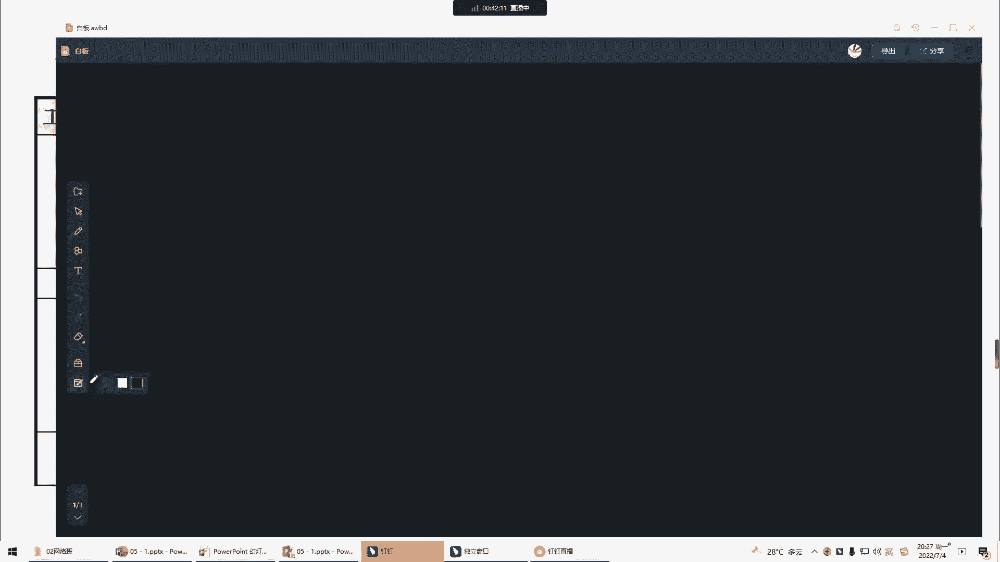

# 2022年PMP项目管理精讲课程-包含项目实战课程 - P7：第五章-项目范围管理-上 - 乐凯PMP - BV11L4y1E7TC

好，各位同学晚上好，今天晚上呢我们一起来学一下项目的第五章，项目的范围管理，那么我们今天呢先学其中的一部分好吧，那么从今天开始，我们就开始深入到很细节的，比如说范围啊，进度啊，成本这几个地方的管理。

那么大家在学的时候呢，可以多去体会一下，实际上跟我们实际的做项目呢，是非常的贴近的好吧，那么项目的范围管理，首先大家要知道范围是什么意思，那么什么叫做项目的范围呢，其实就是说我们这个项目啊。

最终我们要交付什么东西，那究竟要交付什么，那么在pp里面他是这么解释的，他说什么叫做项目的范围呢，项目范围管理它包括做且只做所需的全部工作，那么我们是为了交付可交付成果，那么交付给客户一些成果。

我们就要做相应的工作对吧，但是他提到一点，大家要注意叫做且只做，那么也就是我们所谓的叫all和only，唉该做的都得做，而且我们只做这些好，那么接下来就要考虑一个问题了。

那么如果说我们在做项目的过程当中，我们希望要比如说客户希望我们要多做一些，或者呢我们要少做一些，那么如果要多做或者少做，我们应该怎么办，那么我们第四章，上个星期讲了一个很重要的过程。

大家应该印象很深刻对吧，练了很多类似的题目，如果你要多做或者少做，那么一定要先走变更流程对吧，这个是逃不掉的好，然后他说另外呢范围包括两重含义，那么大家要注意我们后面讲的范围，一般不区分这两种范围。

因为我们的项目的范围就包括了这两种，一个叫产品范围，一个叫项目范围，那么这两者的定义呢，大家不要去记对吧，稍微理解一下就行了，什么叫产品范围呢，就是我们的产品服务或成果，也就是可交付成果。

最终交付给客户的东西，我们必须要具备的特性和功能啊，比如说我们最终要交付客户一个包子，那么这个包子有什么特性，有什么功能，而我们最终要交付客户一个茶叶蛋，它有什么特性，有什么功能对吧。

那么这种东西是产品范围，它是由需求文件来决定的，那么什么叫项目范围呢，我们做这个项目是为了交付一个包子，那么为了交付这个包子，我们就必须完成相应的工作啊，啊比如说我们要去安排人员，我们要去买一些材料。

我们要去做对吧，那么这些所有的工作叫项目范围，那么项目范围，我们所有的工作是由什么来决定的，有一个东西会告诉我们我们应该做哪些，它就是项目管理计划，所以说我们用产品的需求文件来衡量，产品范围的完成情况。

用项目管理计划来衡量项目范围的完成情况，对吧，那么我们后面再讲的时候，一般不做区分，这两者之间呢也有一些联系，比如说你要做什么产品，就决定了我们要做哪些工作，对吧，你要做包子，那么有包子要做的工作。

你要做茶叶蛋，那么有茶叶蛋要做的工作，那么项目范围呢，就是我们的那些工作最终是为了什么呢，而是为了实现这些特性和功能的，是为了服务于产品范围的，那么这两者是有很紧密的联系的。

但是呢这两者之间并没有说一个变化，一定会引起另外一个东西的变化，比如说我的项目范围变了，我做了工作变了，我的产品范围一定会变吗，其实不一定，对吧，举一个例子，我在做包子的时候，我要买面粉。

那么买面粉的时候呢，我本来是到指定了一家店去买的，这个时候呢我多做了一些工作，什么工作呢，我多比较了几家供应商对吧，甚至呢我如果有时间我还去搞了一个招投标，那么你说这些工作是不是多了呢，肯定多了。

但是问题是产品的范围，也就是这个包子的特性它变了吗，他其实没有变，所以说工作多了，特性不一定变，那么反过来说我的特性变了，工作就一定会多吗，也不一定的，那么这里这边有同学会不理解。

你做的东西的特性都变了，难道工作会不变吗，也会有这个可能的，比如说我之前我记得在给面授班讲课的时候，我们教室里面正好有一堵墙，我就举了一个例子，我说呢我现在呢要你做一个工作，就是刷墙。

那么我给了你一桶黄色的油漆，你把这堵墙刷成黄色对吧，好接下来我忽然改变了主意，我给你一桶红色的油漆，你把这个墙刷成红色，那么特性是不是变了变了，一个是黄色，一个是红色，但是你做的工作变了吗，没有变。

反正是刷这堵墙对吧，所以说这两者的一个的变化，不一定引起另外一个东西的变化，那么关于这两个概念，大家稍微了解一下就行了啊，考试不可能考这个东西，在我们实际做项目的时候呢。

一般我们说的范围也就是这两者都有好，那么接下来篇报告里面还说在范围管理里面啊，我们的预测型生命周期跟敏捷的管理方法，是完全不一样的，那么这一块我们在后面会挑一个时间，着重给大家去解释一下。

在发展趋势和新兴实践里面，他收到了一个东西，他说需求啊一直是项目管理中的重点，看到这里呀，其实很莫名其妙，我们这第五章在讲项目的范围管理，怎么讲着讲着莫名其妙来了这么一句，说需求一直是项目管理中的重点。

这个范围和需求有什么关系啊，为什么讲范围会讲着讲着讲到需求去了，好发明说说需求跟范围不分家，这句话究竟是什么意思啊，我们平时做项目，其实范围说的并不多，对吧好，有同学说需求就是范围。

那么我们讨论一下需求跟范围有区别吗，有区别的啊，我举一个例子，比如说我现在跟大家说一句话，我要一瓶，可乐，好我问一下可乐是我的需求还是范围，我们很多做项目的同学，客户往往会提这样一句话对吧。

哎我要一个什么东西，我要一个什么东西，这就认为是我们的需求，那么这个究竟是需求还是范围呢，好很多人认为是需求对吧，告诉大家，其实在我们p m p里面讲的是很细的，这个并不是需求，可乐是一个什么东西。

可乐它是一个我们要交付的可交付成果，那么可交付成果一般是什么呢，不叫需求，叫范围，那么什么叫需求呢，大家注意，其实需求并没有任何的指向性需求，它仅仅是一种需要，那么怎么去描述需求呢。

好我们应该这么去描述，可能是它渴了，所以他想喝点东西对吧，那么这才是一个真正的需求好，那么有人说你无聊不无聊啊，你把这个事情搞这么复杂干什么呀，实际上是有意义的，比如说我们在做项目的时候。

往往会发现可乐这个东西现在缺货买不到对吧，那么但是如果我了解到它的根本的需求，是他渴了想喝东西，那么也许我可以有什么有其他的替代解决方案，比如说诶我现在呢可乐缺货对吧，我知道你渴了。

那么我给你一杯奶茶行不行呢，其实说不定也可以也能够满足需求对吧，实际上客户并不关心，你究竟交付的是可乐还是奶茶对吧，你只要跟客户定义清楚了就可以了，客户说哦，我有个需求，我渴了，那么我想要可乐。

你说可乐缺货奶茶行不行，客户说ok没问题好，那么大家把范围达成共识，那么最终我们书面把它记录下来，那么t m最终我们交付一杯奶茶，这个是可以的对吧，当然也有一种情况，客户不是为了口渴。

客户说我本来想要可乐来干什么呢，烧鸡翅啊，要煮可乐鸡翅，你说我可乐缺货，给你一杯奶茶行不行，没听说过用奶茶烧鸡吃的对吧，所以说我们最终交付什么，也就是说我们的范围跟需求是什么关系。

其实刚刚有很多同学说到了一句话说，为什么讲范围，我们必须要先讲需求，因为需求决定了范围，什么样的需求就决定了我们可能要交付什么，可交付成果对吧，所以说我们这边才有这么一句话。

需求一直是项目管理中的重点好，那么这里面他说在做需求的时候，我们会有一个人叫商业分析师，有的公司有这样一个职位啊，缩写叫ba business analysis对吧，有这样的人来负责专门的需求管理活动。

那么如果你们的需求有专人来负责，那么项目经理就很简单，我只要确保什么呢，按时按预算把这些需求实现，满足这些需求就可以了对吧，当然也有很多公司可能由于人手不足，或者呢这个人员配备不是很齐全。

那么没有这样一个角色，那么这个时候项目经理也得这么去，用各种方法去收集客户的需求对吧，所以说其实大家会发现，项目经理的工作可能跟b a啊，甚至跟产品经理啊有一部分重合，那么重合在什么地方呢。

实际上就是重合在需求这一块重合的比较多，好吧好，那么接下来我们看一下范围里面的这几个过程，今天呢我们就讲两个过程啊，第一个过程叫规划范围管理，那么这个过程呢其实很简单，我们就直接把它带过就行了。

我们从第五章开始，每一个知识领域都会讲规划叉叉管理，比如说这边会讲规划范围管理，第六章会讲规划进度管理，也就是说我们做所有的事情之前，我们都要有一个什么呢，有一个计划，比如说我知道范围将来取决于需求。

我要去收集需求，所以我就要去自己盘盘算一下，将来需求怎么去管啊，我们要做一份需求管理计划，我们来描述将来怎么去分析，怎么去记录，怎么去管理需求对吧，当然最终我们也会交付可交付成果，这是我们项目的范围。

我们还会输出一份范围管理计划，告诉我们怎么去定义，怎么去监督，怎么去控制和确认范围，但是大家要注意啊，这个过程我们基本上就是一句话带过，在我们实际做项目的时候，关于如何管范围，和如何管需求。

我们说的非常的简单，说得非常简单对吧，这里面没有什么实质性的东西，为什么呢，大家要注意啊，如何管范围，如何管需求，都在说一个东西，就是，我们通过什么样的程序，什么样的流程来管范围，管需求。

也就是说这是我们之前在讲课的时候，提到的是哪一种计划呢，是一种指南型的或者是一种程序型的计划啊，我们怎么将来怎么管范围啊，啊要注意哪几个方面，我们将来怎么管需求啊，要注意哪几个方面好。

但是项目究竟有哪些需求，又有哪些范围，会不会写在这个指南行的计划里面呢，不会这就相当于我们之前在上个星期讲的，变更管理计划，也是一个指南型的计划，那么具体的变更，会不会记在变更管理计划里面呢。

他不会记得，他会记得变更日志对吧，那么这里面也是一样的，具体的需求和具体的范围，会记在这种管理计划里面吗，他也不会好吧，那么后面等我们讲完了之后，我们再回过头来看指南行的计划，为什么不记这些东西。

这些东西真正记在什么地方好吧，所以这个过程呢很简单，在我们实际做项目的时候呢，甚至有可能就不做了，一句话就带过的，那么我们接下来主要的是看这个过程，怎么来收集需求，因为需求决定的范围。

所以我们必须要清楚怎么样先把需求给收集好，那么什么叫收集需求呢，收集需求就是为了实现一下目标，来确定记录，并管理相关方需要和需求的一个过程对吧，那么需求实际上就是我们的特定协议。

或者其他的强制规范要求的，我们可交付成果必须具备的能力和条件，那么他说需求啊，包括相关方的一些需求，必须要以量化，而且要书面记录好，那么首先大家要考虑一个问题，我们在做项目的时候。

首先我们为什么要收集需求，我为什么问这个问题呢，因为我们在之前接触过一个东西叫项目章程，我们很多同学说，其实我们的招投标文件里面，我们的合同里面，包括我们上一节课。

上一个星期讲的项目章程里面都是有需求的，项目启动之后，那么接下来进入规划，为什么又要再收集一遍需求呢，这样做的目的是什么，对啊需求人家不是已经说了吗，在合同里面有啊，在招投标文件里面有啊，对吧。

甚至我们早期的商业论证里面都有商业需求啊，那么为什么在这边还要去收集需求呢，好有人说得很好，大家记住我们在pp里面说过，项目章程里面的需求是高层级需求对吧，包括之前的合同里面的。

招投标文件里面的都是什么呢，很概括的，大家如果做个项目啊，你们把合同打开，或者把你们的招投标文件打开，你会发现这里面的需求就是一句话对吧，而这一句话的需求，是无法指导我们去具体的实施的对吧。

就像我们王开南同学说的，是没有办法真正的落地的，所以我们必须要把这些宏观的概括的需求，要把它细化出来，所以我们才做了这样一个过程，要收集需求，收集的是什么，需求是具体的单一的需求，而不再是高层级的。

那么第二个问题，为什么我们强调需求要可量化，为什么呢，比如说我们有很多同学是做it行业的，给客户开发一个网站，客户有这样一个需求，网页的响应速度要快，我们有同学是汽车行业的客户，有这样一个需求。

说汽车的起步要快好，这样的需求描述方式好不好不好，为什么不好，因为它没有量化快多快算快，我认为打开一个网页，七秒之内能够打开就算快，但有的人认为三秒之内打开才算快对吧，汽车的起步速度多快算快。

我觉得只要我油门踩下去，他往前开了，这就快对吧，但是有的人说哦，我要我这个白鸟百公加速是多少秒，用这个东西来衡量是不是快，那么为了避免到最后啊，双方之间买方和卖方之间产生一些争议。

所以说最好在描述需求的时候，我们要用一些可量化的东西来描述，这样呢有利于我们后续的验收对吧好，那么接下来收集需求怎么去收集呢，我们当然要找人去收集，那么这边会接会先提到，我们后面要学的相关方登记册。

我们项目有许多相关方，那么要找这些人去收集需求对吧，包括我们也可以参考商业文件，参考协议输入呢，大家稍微看一看，那么这个过程主要是告诉大家，我们有什么方法来在项目上收集完整的需求，或者具体的单一的需求。

那么主要的是这些工具，那么大家要注意这些工具是很多的，并不是所有的工具都要用，我们要裁剪对吧，我们要不同的项目选择不同的合适的工具好，接下来这些工具我们一个一个去看一下，首先第一个工具头脑风暴。

头脑风暴这个工具呢我们之前讲过，其实并不陌生对吧，其实头脑风暴就是指我们要畅所欲言啊，我们在第四章的时候讲过，头脑风暴就是大家畅所欲言，有什么想法，有什么主意，随口就说出来对吧，我们不要质疑，不要分析。

不要批判啊，我们头脑风暴的目的是什么呢，获取大量的创意，也就是说我们追求的是数量，而暂时不考虑质量，那么质量什么时候考虑到后面再说对吧，你只要有足够的点子就行了，好接下来第二个叫反弹interview。

那么interview就是说直接跟客户去交谈，那么这是一种收集需求的最常见的一个方式啊，比如说我们项目已经开工，我们已经进场了，那么接下来我们要找，比如说特别是甲方的业务人员，我们要去收集需求。

那么怎么去收集需求呢，我们一般会约一个时间对吧，然后他们安排一个地方，我们去双方聊一聊，那么用这种直接的交谈来获取一些需求，这就是很简单的一个反弹对吧，但是这里面有几个细节啊。

大家在实际做项目的时候是要注意的，第一我们在做这种反弹的时候，应该在什么地方进行，哎比如说客户有一个业务部门的负责人，我们要找他调需求，他跟他的员工都坐在同一个办公室，那么我们走到他的办公室，脱张凳子。

坐在他旁边，跟他收集需求行不行，这个呢一般就不太好，为什么一般不太好呢，因为在这个环境里面有其他人在，他可能自己有一些需求呢，他想说，但是由于有其他人在呢，他又不太方便说对吧，所以这种环境就不太好。

那么这里面就有一个细节，我们反弹应该在什么环境下呢，好我们后面也会着重讲，大家现在可以了解一下，我们一般说在信任，保密的环境下开展对吧，最常见的是什么呢，就是在客户那边让客户安排一个会议室。

那么在这种地方去调研需求，那么大家呢其实就没有什么太多的顾虑对吧，那么另外第二点大家要注意，正是由于在这种信任和保密的环境下，聊着聊着有可能可以获取一些机密信息，比如说最常见的我在做项目的时候对吧。

聊到这一块的时候，那么人家会告诉我，这一块你们一定要多花点心思，为什么呢，您以后再跟他打交道的时候啊，特别要注意说话要直接，不要吞吞吐吐的，怎么怎么样对吧，那么在这种信任和保密的环境下。

就容易获取一些机密信息好吧，那么这两点也是反弹的一些细节，大家要稍微注意的好，接下来焦点小组这个工具我们也讲过，焦点小组顾名思义就是我们要找到一群人，找到这群人干什么呢，聚焦在某一个点对吧。

聚焦就是focus，那么教练小组就叫focus group，那么找到这群人聚焦在某一个点，比如说哎我们要想了解财务方面的需求，那我们跟谁开会，跟财务部的一些骨干开会，我们要了解销售部的需求。

那么找销售的人去开会，所以folk group焦点小组这种工具，我们往往是针对同一个职能，或者同一个领域的人来进行一些需求的收集，好吧，那么前三个工具其实我们之前都讲过的，这些工具。

刚刚有人说这个是要理解还是要背，我觉得这个不矛盾，你理解了你就忘不掉，比如说焦点小组，你看顾名思义聚焦在某一个点吗，那肯定是同职能啊，反弹嘛，聊一聊嘛，那么聊嘛，大家要在信任保密的环境下聊了头脑风暴。

那么接触的人就多了对吧，看到头脑风暴就知道是什么意思，这个人就不需要去背，好吧好，接下来我们没有学过的工具，我们一个一个看一下这些工具的特点，大家一定要了解，首先问卷调查，问卷调查这个工具来收集需求啊。

我们见到的太多了，我记得以前很多年前，我们走在路上可能会被小姐姐拉下来干什么呢，填单子啊，填一份问卷调查的表格对吧，现在呢由于移动互联网非常的成熟，我们在比如说微信啊，朋友圈啊都会看到啊，有一些问卷。

包括我们小孩的学校的老师也会发一些问卷，让我们去填，那么用这种方法来调研需求对吧，或者说收集需求，那么这种方法它有什么好处呢，好它的特点很明显，受众多或者多样化啊，各种年龄层次对吧。

我们都可以发问卷来收集他们的需求，然后呢快速完成调查啊，填一下问卷就行了，而且呢还不受地理位置的限制，地理位置分散的时候，特别希望用这种方法，比如说一家公司在中国的很多城市都有员工，那么我们要调需求诶。

地理位置分散，不可能到处飞呀，那怎么办好，那么我们就发问卷调查，然后最终问卷收回来之后，我们还能开展一些统计分析对吧，所以问卷调查有各种各样的好处，我们可以面向很多的受众，然后快速的调查地理位置。

风扇也不要紧，我们还能统计分析，这是我们偏僻里面介绍的内容对吧，那么考试最多也就考这些特点，但是我想问一下大家，在我们实际做项目的时候，如果你打算用问卷调查收集需求，这个工具有没有什么问题，有问题吗。

其实这个工具啊在实际操作的时候是很难的，为什么难呢，好省城同学说了，我们无法把握填这份问卷的人，他是不是真正的用心在填对吧，比如说举一个例子，我小孩的学校给我发问卷，那么这个问卷啊要不要认真填呢。

就要看了，如果说里面要填学生姓名，家长姓名的，我可能会花点时间填一填，如果是那种匿名的问卷调查，那么我要么不填，要填呢，就是随便点点，直接就填对吧，直接就上去了，那么我随便填一填就上去了。

你这个数据准确吗，你通过这个数据分析得到的结果准确吗，它就不准确对吧，所以大家要注意，将来大家在实际做项目的时候，如果遇到了要用问卷调查来收集需求的，大家一定要重视一个东西，重视什么东西呢。

就是问卷的设计好吧，那么问卷的设计实际上是非常重要的，那么接下来我举一个例子啊，这个考试不考，大家稍微了解一下问卷的设计。

我们一定要想一些方法，把这个问卷呢设计的更加合理。

比如说常见的方法是什么呢，要放这些东西叫互斥的问题，什么叫放互斥的问题啊，在一份试卷里面，你放几个比较矛盾的选项，因为问卷调查一般是选择题嘛对吧，比如说我调查王一番，小王同学，好有一份问卷是这样的。

首先第一题请选择你的性别，那么王一帆同学一看就是个爷们儿了对吧好，这边有一个男，一个女，他选了一个男性别是男的对吧，用手指按了一下，在男上面打了一个勾，然后接下来又加了很多很多其他的问题。

忽然第八题来了一道题，请问你平时喜欢穿什么好，有这样一个选项，裙子，对吧啊什么牛仔裤啊西裤，结果呢小王同学乱选勾了个裙子，那么我把这个问卷收集回来之后，我就很奇怪呀对吧，你作为一个男的。

平时又喜欢穿裙子，这什么操作啊对吧，我感觉这个好像这几个问题之间啊，就有一些矛盾对吧，当然我们还可以设置更多的对吧，一些相互矛盾的问题，那么设置这些互斥的问题，主要的目的是为了什么。

一旦我们发现出现矛盾的选项，那么最终大家要注意这份问卷要作废，不纳入到最终的统计，明白吧，那么这只是举一个例子，那么当然问卷设计还有很多的细节要注意的，比如说不能去引导他们去选择一些东西对吧。

怎么怎么样，那么希望大家如果在今后做项目的过程中，如果确实有这个需要，大家可以去了解一下，其实问卷调查它难是难在什么难，难是难在一个问卷的设计上，好吧好，这个工具其实很简单，我想大家都能够理解好。

接下来标杆对照，刚刚在讲的时候，有同学说标杆对照这个工具，我倒是第一次看到，我敢打赌，你绝对不是第一次看到，为什么这么说啊，我们先看这个工具他在说什么，其实偏僻里面的工具呢，我建议大家真的不要去背。

你就看他字面的意思，什么叫标杆对照，就是当我们不知道需求是什么，因为有的时候我们也不知道怎么做，不会做，那怎么办呢，诶没关系，不要说你不会，你可以抄啊对吧，那么你找谁抄呢，你想一想。

我抄作业总要找一个优等生去抄作业吧对吧，那么找谁呢，优等生就是一些标杆做的比较好的对吧，我总不能抄一个不及格的吧，我当然要超标杆啊，所以标杆对照标杆对照，说白了就是找一个做得很好的对吧。

比如说我这个行业做的很好的，那么我不知道怎么做，我怎么样，我去学习，我识别最佳实践，形成改进意见呢，举一个例子，我现在也是搞一个短视频的公司，我焯水啊，不是超水啊，不好意思啊，我标杆对照谁不用说抖音嘛。

对不对，在短视频这个app里面，抖音当然是标杆啊，所以我当然要标杆对照抖音，对不对，那么这就是找一个标杆来对照一下，再比如说那我以前特别喜欢的，我觉得第一个产品做的很好的一个软件，打车软件滴滴对吧。

移动出行，我不知道大家有没有用过一种打车软件，叫美团打车是吧，你说美团打车打开之后你有什么感觉啊，哎呀又说错话了，今天有点不太好啊，不好意思，我说的是某团啊，刚刚口误某团打车，我不知道有人用过没有对吧。

有一次呢我当年我用滴滴叫车的时候，我叫不到车，我老婆跟我说，你试试美团某团对吧，我说啊，某团现在也给我打车呢，然后我下载了之后打开一看，我靠这个功能跟滴滴减脂对吧，我不能说一模一样吧。

但是也有八九分相似，是不是，那么我觉得他们一定学了pg，用了这个工具叫标杆对照，是不是，所以说标杆对照，就是说我们找这个行业里面做的很好的，他是我们的标杆对吧，所以呢我们就对照了一下。

那么这个标杆当然可以是公司内部或者外部的，但是大家要注意啊，这个标杆不光是公司内部外部的，甚至可以是同行业的或不同行业的，好说到这一点，有人就会有疑问，你说我找一个标杆吧，当然是找同行业的呀。

你说我做短视频找谁找抖音对吧，啊我刚刚说的做大事的，你找谁找滴滴对吧，不同行业的怎么标杆对照啊，也有的大家一定见过，比如说tony老师理发的，他有一个绝招是干什么的，办会员卡对吧，那么我是开餐饮店的诶。

我觉得他们办会员卡干得很不错啊对吧，吸引客户来充值，然后呢充多少送多少，然后他们就经常跟这个店呢就绑死了，去哪儿去理发，我一个做餐饮的，哎我也可以搞一个会员卡呀，啊沈城是搞健身房的。

他说那么他也可以搞会员卡呀对吧，所以说大家注意啊，标杆对照也可以是不同行业之间的标杆对照，那么这几个细节大家要注意的好吧，内部外部的对照，同行业不同行业的好，接下来再看。

还有我们还可以通过投票的方法来选择需求，比如说一致同意，那么关于一致同意这样一个工具啊，有一个很典型的叫德尔菲，这个呢在我们篇报告书上没有，但是大家要了解，那么什么叫德尔菲。

德尔菲就是指当我们在确定需求的时候，我们找很多的专家，用匿名的方法通过多轮来最终选定一个需求，好吧啊，有人说文件分析这个讲不讲文件分析，这个太简单了，就是看看文件分析，分析招投标文件。

这个就没什么意思了，好吧好，接下来德尔菲我举个例子给大家看一下，什么叫做德尔菲。

为什么德尔菲能够得到一致的趋同的意见，比如说嗯我现在呢有一个需求。

什么需求呢，我现在呢觉得很累，我想出去找个地方玩一玩，那么我呢心里面也没有概念对吧，那么究竟找什么地方去玩呢，那么我做了这样一件事情，我找了，比如说三个专家，ab和c，对吧。

那么接下来这三个专家大家注意啊，我是让他们之间相互不联系的，那么这种不联系的方法叫什么呢，其实就是说专家相对于别的专家而而言，它是一种匿名的匿名的啊，就其他人都不知道另外一个人的存在好。

接下来我就分别找这三个专家要意见了，我打算去玩一玩，去什么地方，a专家说这样吧，我觉得海南挺不错的，有海有沙滩对吧，挺好的好b说什么呢，他说要不这样吧，有一个什么度假村挺好的，啊里面也有玩的，也有吃的。

环境也不错，好c专家说什么呢，哎我之前去了一个农家乐，我感觉还不错，对吧好，那么你会发现这三个专家的意见其实完全不知，有的选择了旅游景点，有的选择了度假村，有的选择了农家乐对吧，但是没关系。

为什么没关系呢，因为对于我来说，其实我心里是没谱的，不完完全没有方向，那么完全没有方向，在第一轮做完了之后，专家不是给了我这些意见吗，诶我就开始把这些意见收集过来，收集过来，我一看诶。

农家乐这个东西好像不错对吧好，那么在第一轮的基础上，我又给了一些条件对吧，第二轮的时候我跟他们说啊，我考虑了一下，我觉得还是想去像农家乐这样的地方去玩一玩，大家有什么意见好，然后马上a说了哦。

这里我龙江的，我知道的，在a这个城市有一个农家乐很不错的啊，b说在什么什么地方有另外一个农家乐，c说又有什么农家乐对吧，那么再把第二的信息收集起来，比如说我发现有的农家乐里面是可以钓鱼的好。

我再增加一些条件，那么如果我希望农家乐里面是有鱼钓的，怎么怎么样好，那么经过几轮之后啊，大家会发现随着多轮之后，渐渐的大家的意见就会趋于一致，那么我们可能最终选择旅游的地方，那么大家都是一致的，会保持。

比如说有一个农家乐可以钓鱼，可以怎么怎么样对吧，那么通过这种方法来达成共识，那么其实德尔菲这种方法它的特点是什么呢，就是有专家专家之间相互匿名，通过多轮的专家的反馈，不断的给予一些收集对吧。

然后再提出一些新的意见，然后通过多轮的方法最终趋同对吧，那么为什么说一定要匿名呢，好匿名的目的是为了一个为了消除偏见，为了消除瓶颈，因为如果你不匿名，大家在一起，有的人很强势，会影响到另外一个人。

那么关于这个工具，我们在第七章第六章讲实战的时候啊，我们会用估算活动持续时间来举一个例子，看一看究竟怎么样来趋同，好吧好，接下来除了一致同意以外，还有我们还可以用大多数同意的方法来确定，来明确需求。

什么叫大多数统一呢，比如说我们现在呢有一个方案，究竟是要做还是不做，什么叫大多数同意，就是少数服从多数超过50%的人同意，那么我们就同意对吧，那么大家要注意啊，如果你要用大多数同意这种方法。

那么一定要把决策小组的人数定义为基数对吧，那么你会发现，其实我们有很多需要决策决策的地方，用大多数同意的方法都是基数，比如说我们在一开始项目评标的时候，专家它一般是基数对吧，我们最终项目验收的时候。

我们在讲第四章的时候跟大家介绍过，验收的时候，专家一般是三个五个七个对吧，所以说我们一般要用奇数的方法，而不用偶数，用偶数呢会容易什么呢，产生平局，所以我们大多数同意的这种方法，一般是定义为基数。

那么什么叫相对多数呢，好大家注意啊，相对多数往往是选项超过两个，比如说我们现在有这么几个方案，a方案，b方案，c方案，b方案，那么究竟选择哪一个方案，同意a方案的40%，同意b方的30%。

同意c的20%，还有10%的人选择了地方，那么这个时候你怎么去决定呢，没有哪个超过50%，那怎么办好，没关系，选择一个相对来说比较多的对吧，那么这个叫相对多数，那么这些概念实际上都比较简单啊。

就是一个人做决策啊，这些东西我觉得大家只要看到字面意思，基本上都能够了解好，接下来还有多标准决策分析，我们在收集需求的时候，或者说我们在确定需求的时候，为什么要用多标准决策分析。

因为往往我们要考虑事情的多个方面，好举一个例子啊，为什么我们对需求要用多标准决策分析，比如说我现在呢有这样一个需求，就是我想按时安全地从家里面到公司，我呢有这么多可选的方案，第一个方案呢就是买辆车。

开车去上班，对吧，第二种方案呢好办张卡干什么呢，坐地铁去上班，第三种方案呢，我还可以买双鞋，买双好点的鞋，走路去上班对吧，那么究竟选择哪一个呢，好我要考虑的因素有很多，比如说我要考虑到舒适性，哪个舒服。

当然不止这一个标准，有多个标准的，还有什么呢，比如说我要考虑到时间，哪个省时间，我要考虑到安全对吧，哪个安全，当然我还要考虑到什么呢，唉有同学说的成本对吧，那么我有这么好几个标准要一起去统一的去考，虑。

要考虑全面，那么这几个标准之间呢，它的重要性或者说权重还不一样，那么对于我来说比较重要的是什么，首单起诉的就是安全，安全的权重很高，为什么上有老，下有小对吧，没办法，必须要注意安全。

那么在安全得到考虑的情况下，我比较关注什么呢，舒适啊，稍微舒服一点对吧，当然了，成本一些重要的最重要的是什么呢，就是时间稍微迟到一点，反正1年365天对吧，我是经常迟到的好，那么接下来怎么去判断呢。

每一个标准总分我们都定为十分，那么接下来我就在家里面去判断了，我是这么判断的，十分的总分，坐车它的舒适性能打几分呢，坐车还是很舒服的，起码能到能到八分对吧，那么坐地铁舒服吗，坐地铁不太舒服。

要走到地铁站，而且是很挤，舒适性五分，走路过去舒适吗，不太好，舒适只有两分对吧，那么时间上来说，买车呢不是很快，容易堵车，坐地铁很快对吧，走路过去是最慢的好，从安全的角度来说，买车安全性的不是很高啊。

坐地铁是最安全的，其次是走路，只要你小心一点都不会出事，那么成本的角度买车需要很高的成本，所以他的分数很低，办卡坐地铁少花一点钱吧，不是太多，最省钱的就是走过去了好，接下来怎么去判，怎么去算啊。

其实很简单，写到这里，可能很多人就明白了，其实我们只要把权重乘以得分就可以了，权重呢乘以得分，最终它是2。4，这边是0。5，这边是1。6，这边是0。4，然后累加我就会发现买车最终的得分是多少，4。9。

对吧好，同样的也是把这边的分数算出来去了一家，这边的分数算出来去了一家，然后我们找一个什么分数最高的，比如说我们算下来，实际上是坐地铁去办张卡，风速是最高的，那么我们就定下来，那么我们就坐地铁去公司吧。

也不要买鞋了，也不要买车了对吧，那么这种方法就是多标准决策分析，那么这个工具我们在这边啊，我们详细的讲一遍，后面遇到的所有的多标准决策分析，其实都是一个意思，没有什么区别，好吧好，那么除了这些工具。

我们还可以用一些图来帮助我们处理需求，比如说清河图，那么清河图是什么意思呢，它可以结合其他工具去使用，我们刚刚头脑风暴收集了一堆需求，我们可以通过清河图干什么呢，去分组分类啊。

比如说我们头脑风暴晚上吃什么，有很多人说吃啊，这个海底捞啊，小肥羊啊等等等等，那么好，我们把这一切抓起来，分一个组，火锅类的对吧，还有人吃什么日本料理，韩国料理等等啊，这个是料理类的。

我们可以把头脑风暴收集的东西，再通过清河图来进行分组和分类，所以它的关键词是可以分组分类，然后思维导图这个工具我想大家应该见过吧，我们有一堆需求，也可以通过思维导图干什么呢，它的作用是整合起来。

那么整合起来可以反映共性与差异，激发新创意，好举一个例子，思维导图我们一般是怎么做，假如我们收集了一堆需求，那么用一些工具啊，比如说x y呢等等对吧，然后把这些需求整合在整合一起啊。

第一类的包括什么什么什么什么，这一类又包括什么对吧，而这一类包括什么什么这一类又包括什么什么，把它整合成一张图，反映共性与差异的对吧，那么大家在平时的时候一定是接触过这种图的。

包括我看到很多同学啊在复习的时候。

他是这么复习的，第四章项目的整合管理，对吧啊，第一个过程制定项目章程，制定项目章程有什么输入，有什么工具，有什么输出，然后第二个过程制定项目管理计划，有什么输入，有什么工具，有什么输出对吧。

然后接下来哎呀这个指导与管理项目工作啊，管理项目知识，把这些信息都整合起来对吧，形成了一张图，所以它的关键字就是这些需求，我们也可以整合起来，反映共性与差异，激发新创意好吧。

那么这两个图呢大家可以稍微的去了解一下，接下来还有工具，名义小组，我们收集了很多需求之后，可以通过名义小组去投票啊，可以去投票，那么名义小组这个工具，我建议大家怎么去理解啊。

民意民意我建议大家可以理解成这个，人民的意愿，那么为什么说可以理解成这个东西呢，其实名义小组就是我们每个人手上都有一票，我们通过投票去选择那些最有创意的一些需求，对吧。

哎比如说我们刚刚不是头脑风暴不追求质量吗，那么我们结合民小组去经过投票去排序呀对吧，甚至我们排序的时候还可以封阻去排序，比如说呢头脑风暴收集了一堆好，我这一堆选出前十名，这一堆也选出前十名。

这一堆也选出前十名对吧好，然后接下来这一堆里面30进20，20进十对吧，有点像我们看到的一些选秀节目，那么通过这种方法投票和排序，来进行需求的一个选择，好吧好，接下来还有我们可以通过观察和交谈。

来收集需求，那么这个工具呢大家在以后的工作中，一定会经常的用得到，比如说我举一个例子，这个工具在什么时候会用到，往往在我们的相关方难以说清需求，或者不愿意清晰说明需求的时候，举一个例子啊。

我这辈子做项目遇到的一个最特殊的需求调研，就是我在成都做的一个项目，我在成都做了一个项目，为什么说他的需求调研很特殊呢，那个单位啊，那个政府部门，他有很多的科室，我们都要去调研需求。

那么问题是在调研到其中一个科室的时候，甲方的对接人跟我说，这个科室的需求调研，你要想想办法，我说老师这个有什么特殊的地方吗，他说是这样的，因为我们是政府部门对吧，那么我们需要向社会上的一些特殊人群。

开放岗位，那么这个科室呢，他里面的老师是一个聋哑人，当时我听了之后我就觉得有点难对吧，因为这个聋哑人这个调研需求啊，说实话，这个跟正常人就交流上面就存在很大的困难，那么我一时半会儿。

也没有想到一个什么很好的方法去收集需求，因为那个科室是干什么的呢，主要是管理一些档案，管理一些文件这种工作的对吧好，那么接下来我就到这个科室，找这个老师去调研需求，那么去之前呢，我就问了甲方的项目经理。

我说那你们平时是跟他怎么沟通的，他说平时沟通我们就用微信沟通啊，我想想也是要不我打字吧，好然后我就跑过去把电脑打开，把word文件打开对吧，我就开始打字啊，我说老师您好，我是某某某公司的项目经理对吧。

那么站在旁边呢是我的助理叫谁谁谁，那么今天那么我很荣幸啊，能跟你一起来探讨一下，你们这个部门的业务流程好，然后人家也给我打个字，但是你要知道啊，这个打字啊一上午就打不了多少字，这个需求调研太慢了对吧。

后来呢我就去吃午饭去了，吃饭的时候我就在想，这样调研下来也不是个事儿啊，那怎么办呢，好我忽然想到这个工具观察和交谈，我就跟我的助理说，这样你呢这两天啊你花个两三天的时间，你就做一件事，做什么事呢。

你就跟着这个老师一起工作，你看一看他平时日常是怎么工作的，是怎么整理这些资料的，然后主要要做哪些工作对吧，然后接下来你怎么样呢，你把他的这些工作流程梳理一下，然后写出来。

写出来之后再去跟他确认不就好了吗对吧，你只要跟他确认一下我们有没有问题，那么将来要讨论我们只讨论什么，我们只讨论有问题的地方就完了对吧，那么这种情况就是当别人难以说清的时候，我们需要进行观察和交谈。

而这边所谓的观察实际上就是工作跟随，你要跟着别人去观察对吧，那么什么时候叫不愿意清晰说呢，好大家注意我们有一些需求啊，在收集的时候，别人有可能是不愿意说的，明白吧，那么不愿意说他跟反弹是不一样的。

反弹我们是开门见山的，唉我想知道你有什么需求，你告诉我有什么需求，那么这边的交谈不一样，交谈就是别人不愿意说对吧，可能出于各种各样的原因，他不愿意把他的真实需求说出来，比如说我举一个很很简单的例子啊。

有1年我在广东做一个项目，我在广东做一个项目呢，我们这边呢是信息化项目，那么土建那边呢也有项目是安防项目，那么安防项目呢，他们在业主那边呢就做了一个东西啊，我们有的同学应该听说的，就是我们所有的网线啊。

走线的时候一般要通过一个东西叫弱电桥架，通过这个东西来放网线对吧，那么按照道理讲呢，我们信息化项目的网线也是走这个弱电桥架，但是毕竟这个弱电桥架呢是人家做的，我们要用就得怎么样呢，跟人家打招呼是吧。

这个是很正常的好，那么接下来我就叫我的项目助理，哎，你们也可以认为是线槽啊也行，那么我就叫我的项目助理呢，去跟土建那边的负责人去打个招呼，特别是跟他们负责这个安防的人打个招呼，我们马上要布线了。

我打算走你们的桥架对吧，有几根线走一走，那么实际上这个桥架里面走几根线难不难呢，复不复杂呢也不复杂，但是我的助理回来跟我说了，说了这么一句话，他说对方不同意，我说为什么不同意啊。

他说唉呀这个事情很难办对吧，因为我们的线已经走了，如果你们再走里面走线，万一碰坏了我们的线啊，万一导致我们这边出什么问题啊，这个东西啊就不好说了，到时候也说不清，是你们的责任还是我们的责任好。

你听到这句话，你有什么想法，人家没有说任何需求对吧，他也没有明说，但是我知道其实他们心里有一点不平衡，有什么不平衡呢，就是他讲的，我做的桥架，我凭什么给你用啊，让你走线啊，对吧好，那么我知道了。

所以在下班之后吃完晚饭，我就带着我的助理啊，到他们住的地方，我记得当时他们的现场的负责人姓陈对吧好，我跑过去进去，他还挺舒服，在吹着空调喝着茶啊，我跟他说老陈有没有时间啊，然后他说什么风把你吹来了。

好这个时候我就拿了两条烟，拿到两条音是这么说的，哎呀前两天我同学正好过来看，我给我带来两条音，你说这个烟吧对我来说呢太好了，我也不喜欢抽对吧，要么你拿着抽吧，是不是其实大家都懂是什么意思，就有一些需求。

其实别人他不愿意说清楚，但是你可以通过跟他的交谈来挖掘什么，还挖掘隐藏的需求，明白吧，挖掘隐藏需求，所以我为什么说交谈跟反弹是不一样的，反弹是我们直接开门见山的，哎老师你有什么需求，你说对吧。

我记或者我问你来答明白吗，但是交谈不是的，我谈的是这个啊，我说这个事情有点难办对吧，怎么怎么样，实际上它有别的隐藏的需求，明白这个意思吧，所以说观察和交谈这个工具，在我们做项目的时候可以解决这两种情况。

一种是难以说清的需求，还有一种就是不愿意别人不愿意说清的需求，我们都可以用观察和交谈来进行挖掘，挖掘这些隐藏需求，好吧好，接下来还有引导，那么什么时候需要引导呢，大家注意啊，我们在收集需求的时候啊。

往往有一种情况，就是客户那边的a部门和b部门，他们的需求之间怎么样呢，有矛盾，有冲突，对吧，那么这个时候就烦了，你说a部门说这个需求不归我们管，应该是b部门那边负责的，b部门说哎这个流程呢其实不是。

我们这边是a那边要做的，那么接下来你怎么去定呢，这个就很烦了对吧，所以这个时候就需要干什么，就需要去引导，那么引导一般呢我们是通过会议去引导，所以有个说法叫引导式研讨会，那么引导式研讨会的目的是什么。

目的就是为了协调相关方差异，协调跨部门需求的对吧，因为跨部门需求容易产生冲突嘛，所以我们才需要引导吗，好讲到这里，我问一下大家，还记得我们刚刚讲过同部门，同职能用什么工具吗，记不记得同一个部门。

同一个职能的，用什么工具，既然是同一个只能同一个部门，就可以聚焦在某一个点，叫焦点小组对吧，那么这边跨部门需求，我们可以把这两个工具结合起来，记跨部门需求需要协调的，用引导对吧，那么具体怎么去引导呢。

好p m p里面介绍了三个方法，在我们软件行业有一种方法叫j a d，联合应用开发或者联合应用设计，他的意思就是把软件的程序员或者技术人员，跟业务专家集中在一起配合对吧。

那么质量行业内也有叫质量功能展开q f d，那么敏捷里面呢是有用户故事，那么这三个大家稍微了解一下就行了好吧，那么我们在后面讲敏捷的时候，会详细讲用户故事，其他人呢稍微了解一下就可以了。

那么引导这个工具啊，我刚刚在讲的时候，我听到有同学在说，我最近做项目啊，就遇到这个问题，部门跟部门之间啊意见不一致，好在我今天学了pmp，所以我就掌握了一个工具叫引导，那么我就协调跨部门。

把不同的部门拉在一起开会，来引导他们达成共识，好不好，大家注意啊，pp里面是这么说的，但是用起来是很难的，为什么说用起来很难呢，第1p m p里面只说了，我们可以去引导他们达成共识。

但是具体怎么操作你要注意的对吧，因为我们说pp是一个指南，而不是具体的方法论，他告诉你唉有这样一个方向，你去引导他，但是具体怎么去引导呢对吧，这是第一个好，第二个说一说考试不考的啊。

你们以后做项目一定要特别注意的，我建议大家引导这个工具，如果大家将来想用的时候，一定要特别的谨慎，为什么要特别的谨慎呢，像这种跨部门需求啊，我在实际做项目的时候，我一般不去引导，大家知道为什么不去引导。

比如说客户那边的a部门和b部门啊，都是客户那边的这两个部门，他有矛盾，有需求，有需求冲突啊，比如说以前我给一家公司做过一个cr m系统，这家公司呢还挺有名对吧，在北京曾经以这家公司的背景拍了一个电影。

叫中国合伙人，那么这个时候呢，我到地下公司去做需求调研的时候，我就发现了一个冲突，销售部门跟财务部门之间需求是有冲突的，那么销售部门说什么呢，他说当我收到一个学员之后啊，我觉得这些东西呢我不要填。

我直接把他带到财务那边，让财务去填不就好了吗对吧，因为他们是也是搞培训行业的对吧，那么财务说什么呢，说当你接到一个学生，他们愿意报，我们愿意付钱的时候，合同应该你们先填好，填好之后到我这边来。

我才我只负责什么呢，我只负责收钱不就好了吗对吧，那么你说有道理吧，实际上呢好像都有点道理，那么但是你这个需求你得要定啊，究竟这个电子的合同应该属于销售部的流程，还是可以让合同部门按那个财务部门去填。

对吧好，那么遇到这种情况，你怎么办，跟大家说啊，tap里面确实有这样的一个工具叫引导，但是在实际做项目的时候一定要谨慎，我的建议是，如果没有什么特殊情况，最好不要去引导，大家知道为什么不要去引导吗。

因为你引导的时候，你就容易给别人一个感觉，对于a部门来说，他就感觉你好像在帮着b部门说话，对于b部门来说，他又感觉你在帮a部门说话对吧，一不小心就要得罪人，这还是给企业做项目对吧。

给一些特殊的部门做项目，更加容易出现这种情况，因为他们内部的关系错综复杂，但容易被别人当枪使，所以说我们学习归学习实际工作的时候，我希望大家呢要用这个工具啊，一定要谨慎，那么有同学问我。

那么我现在就遇到这个情况怎么办呢，好我告诉大家，我常见常见的处理方式是什么啊，我把甲方的项目经理叫过来，比如说我把罗雪梅罗老师叫过来，我跟罗老师说，罗老师是这样啊，现在呢你们各个业务部门的需求啊。

我都收集的差不多了，基本上都没什么问题对吧，只是有一个小问题，就是a部门某个需求跟b部门的某个需求呢，感觉有点矛盾，那么在我们这边呢，实际上这块业务流程究竟归属在a部门，还是归属在b部门。

实际上我们都遇到过对吧，都遇到过，这个还真不好说，在我们技术上实际上都能够实现的，所以呢我希望这样你们内部呢去讨论一下对吧，你们内部去讨论一下，然后最终是什么结果，你告诉我，那么我们这边安排人员实现。

后来进行后续的设计和开发对吧，这个都可以，也就是说不管甲方内部有什么冲突，我们希望最终他们有一个统一的出口，出口要唯一明白吗，我一般我做项目的时候，我不太愿意介入到他们内部，不太愿意进入他们内部。

那么我们内部也是一样的对吧，我项目经理我带来一些团队，那么不管他们意见是不是一致，最终以我为出口，我来跟你的甲方项目进行对接，对不对，那么你甲方也是一样，你们内部如果有不同的理解，你们有一个统一的出口。

让你来跟我对接，明白吧，千万如果说你没有什么十足的把握啊，我建议大家不要陷入到他们的内部，这样容易出事好吧，当然p m p里面是说了，有这样一个工具叫引导啊，什么j d k f d用户故事。

这个呢稍微了解一下对吧，有这么个工具，包括这几种就可以了，好吧好，接下来我们还可以通过一些图来描述需求，比如说系统交互图，那么系统交互图呢，实际上在我们做一些工程的时候呢，经常容易看到啊。

比如说我们机房工程对吧。

我们有很多同学是做机房这一块的，那么机房工程怎么去描述。

我们机房的这些东西呢，一般我们会有一个叫网络拓扑图是吧，哎用图会描述的比较清楚一点，比如说电信的光纤进来之后，首先接到什么地方啊，比如说接到我们的防火墙，然后防火墙过来之后接到核心交换机对吧。

核心交换机还是两台翻一足一辈的，然后接下来核心交换机又接到什么地方啊，什么什么楼层交换机啊，或者什么其他交换机，然后接下来又挂了什么什么设备对吧，用一张图把这个需求描述清楚，那么这个呢比较简单好吧好。

接下来还有一个我个人觉得非常好用的工具，就是这个圆形法，圆形法这个工具啊，我在之前做项目的时候经常使用，那么什么叫圆形法呢，圆形法就是我们可以做一个模型，那么为什么要做一个模型呢，大家要注意。

当我们在跟相关方聊需求的时候啊，可能大家脑子里面想的东西是不一样的，就是对于同一句话，我们想的是不一样的，比如说我脑子里面想的是什么呢，肉夹馍他脑子里面想的是汉堡包对吧，用文字描述实际上都是一样。

上面下面都是面，中间夹了一块肉对吧，哎我觉得他是在说肉夹馍，实际上他是在说汉堡，那么为了避免产生这些误解，那怎么办呢，好我们最好的方法就是用一个可视化的东西，来呈现一下。

我们用快速的一些方法来建造一些什么呢模型，比如说我们it行业有一些很常见的工具，actual，应该有同学用过吧，画圆形的一个很好的工具，它可以画高保证，低保证都可以对吧，移动开发里面有磨刀，对吧。

这种轻量级的包括什么，just in mind，我记得以前用过的对吧，这是我们it行业好，其他行业有没有原型的概念也有，比如说建筑业，你们这家建筑公司刚刚开发了一片小区，你们准备卖楼了，那么卖楼的时候。

你怎么知道别人喜不喜欢，你们提供的这些房子呢，对吧，你说你是精装修的，你怎么让别人知道呢，好一般来说他们会有一个东西叫样板房，对吧，他也不去跟你说，哎呀我们装修都是用什么材料，怎么怎么样。

直接带你去看就行了对吧，一般来说它会有一间房间，他都已经装修好了，你跟着售楼部的小姐姐去她那里看一看啊，这就是一个我们最终交付的样子对吧，制造业我们也有制造业的同学，你们制造业有没有原型法，有吗。

我们制造业有没有用过原型来处理些东西，对了李秋丽说了，有这样一个东西，样件或者打个样对吧，我以前也跟制造业打过交道，我在做项目的时候，有一些地方需要安装一些支架对吧，没有现成的，那么要制造业去做。

那么制造业首先给我打个样，让我看过来，让我看一下这个尺寸是不是符合要求，尺寸符合要求了，那么接下来怎么办呢，好他开始开模，开始批量生产，咳咳咳对吧，其实我们生活中啊也有很很很多很多的圆心法。

比如说我们家里装修，现在装修公司用什么展示来来来展示效果，用3d模型来展示效果了对吧，这些都是圆心法好，那么大家想一想，圆心法有什么好处，它最大的好处是这个可以减轻反攻的风险对吧。

它能够保证我们用一个可视化的东西，能够看得到对吧，很直观，如果大家有什么理解偏差，能够及早的发现，那么这样就能够避免，或者说尽量的减轻防空的风险是吧。

比如说我记得我在广东做项目的时候，关于设备的这个安装，我们也做了原型，用动画3d建模对吧，告诉业主唉，我们最终这些机械锁是怎么把这个东西。

卡进去的对吧，用这种方法能够很直观的表示，所以他能够减轻反攻的风险，那么这种工具啊，我建议大家在特别是做预测型的项目的时候，可以多用一用，真的是一个很好的做法，我们用圆形的工具基本上在后面反攻是非常少。

防空是非常少的，好吧好，那么收集需求有很多很多的工具啊，有很多很多的工具啊，有人说原型法跟标杆对照有什么区别，完全不是一回事儿对吧，标杆对照是指我们找一个做得好的，我们模仿他去做对吧，而原型法是什么呢。

是说我们自己先做出一个模型去跟客户去确认，原型实际上就是模型，那么你说模型跟标杆其实不是一回事儿，明白吧，好，那么收集需求有这么多的工具，那么这些工具我都解释了一遍。

我相信大家对这些工具基本上都有一个了解了，那么接下来大家要注意，在我们实际做项目的时候，这些工具你要去选择使用啊，需要选择使用，比如说我随便举一个例子啊，大家一定要注意的，我问一下大家。

你们觉得预测型的生命周期啊，就是说我们传统的项目用计划来驱动的，收集需求的时候，用头脑风暴这个工具好不好，你们想一想，我们用计划来驱动，那么我要收集需求，用头脑风暴好不好呢，其实我感觉我就不太会用。

头脑风暴这样一个工具，为什么，因为我觉得头脑风暴这种工具啊，他集思广益，畅所欲言，天马行空，他有点适合那种什么呢，创新的项目可能比较适合，那么预测型的项目，他用计划驱动，它是有严格的范围的要求的。

他不允许什么的，太发散，你太发散了之后，你又做不到，客户的满意度会下降对吧，所以说大家要注意，其实我们要根据项目的实际情况，选择合理的工具，而不是去乱用这些工具，好吧好。

那么我们通过这些工具最终收集的需求，得到了什么，好注意看它的输出，它输出了需求文件，那么什么叫需求文件，需求文件就是用来记录我们刚刚收集到的，所有的叫单一的需求的，那么这份文件。

它不但会记录我们收集的详细的需求，还会告诉我们这些详细的需求，最终是怎么样满足业务需求，什么叫业务需求呢，就是我们项目章程里面的高层级需求，也就是说实际上收集需求。

这个过程是把项目章程里面的高层级的需求，进一步细化的一个过程，对吧，那么我们通过这样一个过程，终于收集到了单一的详细的需求，那么输出的第一个文件叫需求文件，那么我们项目的所有的需求。

单一的需求都是记录在需求文件里面的，这是第一个输出好，第二个输出输出了什么呢，他输出了需求跟踪矩阵，那么需求跟踪矩阵是什么意思，比如说在我的需求文件里面，我们需求会这么描述啊，第一类什么什么需求。

然后1。11。2，1。3，一条一条的对吧，都有详细的描述，那么需求跟踪矩阵呢，他是这样的，他说我把需求啊，一条一条的把它的名称都列在这边，那么接下来我把业务目标放在这边，项目目标放在这边。

将来我们会做什么，对应的可交付成果都列在这边，那么用这张表格把需求对应什么目标对吧，有什么价值，对应什么可交付成果都放在这个表里面，建立起来关联关系，那么他说这样一个关联关系，接下来有什么好处好。

他是这么说的，我每一个需求都能够对应相应的业务目标，项目目标，所以就能够确保我每个需求都具有商业价值啊，他都对得上价值对吧，那么另外呢，我还可以在整个生命周期过程中去跟踪需求，那么怎么去跟踪呢。

好举个例子，如果我发现啊，我这边有一条需求，但是我没有对应的可交付成果，请问这出现了什么情况，哎明明当时我们收集到这样一个需求啊，客户说他口渴了呀，想喝点东西呀，结果我发现最终我们项目交付的理念。

没有一个是能喝的好，这说明了什么，很明显，这说明我们有一些需求怎么样呢，遗漏了需求没做对吧，那客户明明说他口渴了，想喝点东西，结果我发现这一堆交付的东西里面，居然没有一个跟跟跟他对得上，那么很明显。

你这个需求怎么样，简单的说就是你的需求没有实现吗，对吧，是不是有东西漏座了好反过来说，如果我发现我们交付的东西，里面有一个莫名其妙的东西啊，有一个成果，我不知道这个成果是用来解决什么需求的，好。

这出现了什么问题，莫名其妙有一个鸡腿，这个鸡腿是为了解决什么需求啊，我到那边去找，找不到好，这说明什么，好像多做了，有可能是什么，刚刚有同学提到一个词，我们下一节课会讲的，是不是范围怎么样呢，蔓延了。

是不是范围蔓延了对吧，怎么会有一个东西他不不解决任何需求，又做出来了呢对吧，所以呢，我们可以通过从需求到可交付成果的正向跟踪，以及可交付成果到需求的逆向跟踪来干什么，来在整个生命周期过程中跟踪需求。

保证没有多做的，也没有少做的，所有的需求都能够满足，所有的需求都能够得以实现，当然所有的需求都有价值对吧，所以说需求跟踪矩阵，它是一个可以说是一个映射关系表，把需求和这些东西呢关联起来。

将来去全过程监控的，那么说到这里，我就想问一个问题啊，那么这个过程输出的需求跟踪矩阵，一般会在哪一个过程中使用呢，是启动还是规划还是监控还是执行还是收尾，他既然要全生命周期跟踪需求，那么需求跟踪矩阵。

将来就应该是监控过程的输入，它是用来监控的，监控里不要多也不要少，每一个需求都有价值，都能够得以实现，好吧好，那么这个过程主要就输出了这两个东西啊，一个是需求文件。

一个是需求跟踪矩阵，那么这节课呢我们的主要内容呢就是这么多，好吧，我们其实就讲了两个过程。

第一个过程叫规划范围管理啊，做一些指南型的计划，没什么意思，大家可以不要花时间看这个过程，那么关键的就是讲收集需求，因为需求决定的范围，那么我们用这些工具来收集详细的单一的需求。

那么有同学说这些工具如果在考试中要考，他会怎么考呢，很简单啊，比如说他会这么考，公司现在有一款机器人的项目，公司从来没有做过，没有这方面的经验对吧，也不了解有什么具体的需求。

请问我们应该用什么工具来获取需求，那么你想一想，自己不会做，那怎么办呢，好像要标杆对照对照了对吧，再比如说我们在收集序的时候，发现这家公司有很多人在不同的地理位置，地理位置分散。

我们用什么方法来收集需求，问卷调查对吧，所以你把这些东西了解清楚了，这种题目呢其实都是很简单的送分题，好吧好，那么今天我们就到这里，那么今天讲的东西如果有问题的，留下来，我来答疑好吧。

没有问题的就可以先撤了好吧，这些工具不要去死记硬背啊，实际上理解了之后啊，你看这个字面意思就能够看得出来，好，我首先回答第一个问题，有同学说这句话是什么意思，收集需求的时候产生的需求。

文件和需求跟踪矩阵并不代表项目的真实范围，什么意思呢，好大家注意啊，我们这个过程叫收集需求，那么你要注意一下收集的需求都做吗，不一定的，因为有一些需求已经超出了我们的合同范围，对吧。

我们收集需求这个过程，我们更多的是关注把这些需求收集过来，那么收集过来之后是不是都要做呢，不是的，那么我们要做一件什么事情呢，好我们一般要做一件事情叫筛选，我们要去对需求进行筛选对吧。

所以呢这里才会有这么一句话，在这个过程得到的需求文件和需求跟踪矩阵，其实不是最终的，我们在下个过程定义范围的时候，我们会对这些东西进行筛选，究竟哪些在范围内，哪些不在范围内，我们要把边界定义清楚。

所以这里才说这边的需求文件和需求跟踪矩阵，不是真正的对应的范围，能明白这个意思吧，下一节课我们会讲啊，怎么样把范围定下来，怎么样去生成范围说明书对吧，正向跟踪和逆向跟踪呢，这个不是书上的内容。

大家了解一下就行，什么叫正向跟踪呢，其实我刚刚讲了啊，需求和将来我们要交付什么成果，一起放在一张表里面对吧，所谓的正向跟踪，就是值我每一个需求都能找到，对应的可交付成果，你饿了对应了鸡腿。

你渴了对应了雪碧，这个叫正向跟踪，从左往右的对吧，那么什么叫逆向跟踪呢，反过来说，每一个可交付成果，都是为了满足某一个需求的对吧，唉我为什么这个项目会交付雪碧呢，因为客户说他口渴。

我为什么最终会交付鸡腿呢，因为客户说他饿了，能明白这个意思吧，就是从需求可以找到对应的可交付成果，从可交付成果也能够找到，它是用来解决什么需求的，这就是正向跟踪和逆向跟踪，好有同学问了一个问题。

他说q fd怎么去理解这些东西啊，只要知道有这么个东西就行了，我们讲的引导里面有三种，一个叫jd联合应用开发技术和业务，在一起合作对吧，q f d呢是制造业上面的跟质量有关的对吧，叫倾听客户的声音。

那么这个呢大家可以如果有兴趣，可以去查一些资料，我之前呢我印象当中啊是这样的，他说有个有一个什么东西呢，叫质量屋，什么叫质量污染啊，这些东西不是考试内容啊，我先说一下啊。

他说我们在做这个制造业的项目的时候呢，是这样的，我们把需求列在这边，然后我们把要用的技术列在这边，对吧，然后接下来形成一个表格，那么接下来我就看了a需求用到了什么技术啊，比如说用到了这个技术啊。

这个技术必需求用到了这两个技术，c需求用掉了这两个技术，而d需求用到了这个技术，e需求运到了啊，这两个技术好，接下来他弄好了之后怎么去看呢，他说首先我们搭窗户，搭窗户是什么意思呢，横向的我们先打个风。

比如说a多少分，b多少分，当然就是跟技术有关的，比如说a是两分，b是三分，c是两分，d是一分，e是两分，好如果说得分最高的，说明什么问题，说明这个需求它使用的技术是很多的。

那么有可能这个需求是一个比较复杂的需求，我们也可以纵向打分，这个叫什么呢，画一个走廊对吧，好，假如说比如说这个技术分数是最高的，说明在这个项目中用这个技术用的也特别的多。

那么这个技术很有可能是我们这个项目的一，个关键技术对吧，然后还可以搞一个什么屋顶啊，来判断他们之间的相关性，这些东西呢如果大家有兴趣啊，可以去查一些相关的资料，在我们p m p里面没有什么很特殊的要求。

就是你知道有这么个东西就可以了，对吧啊，说到引导，有jd，有kfd，当然还有我们后面会讲的用户故事，use story，敏捷里面他描述需求的一种方法，这个我们在敏捷里面会详细的去讲，好吧。

好许昕问了一个很好的问题，他说有两个工具搞不清楚，一个是投票，一个是名义小组对吧，为什么搞不清楚呢，名义小组里面也有投票，而我们也有一个工具，就叫投票，有什么区别，我说一下啊，其实很简单。

名义小组他是人际关系与团队技能，他里面说到了投票，实际上说的是什么，说的是投票的这样一个过程，那么什么过程呢，实际上就是我们人手一票，经过一轮一轮的去投对吧，把一些结果投出来。

比如说我们所谓的中国好声音对吧，先是什么哪个哪个地区的海选，然后接下来又进入这些人中，又进到什么，比如说什么50进30，30进二，十，20进十对吧，他强调的是投票这样一个过程，它体现了人民的意愿。

人手一票对吧，那么这边的投票他讲的是什么呢，结果他要做决策，对吧，好人手一票，你去投了，那么最终怎么去决策呢，你是选一个最多的，大多数同意超过50%的，还是找一个相对多的，还是怎么样。

还是一致同意的对吧，他强调的是决策的，怎样去决策这样一个结果，而民营小组呢更多的是偏向于，人际关系与团队技能这样一个过程，你可以把它认为是投票，是需要一个过程去投票的对吧，那么最终票投好了之后。

我们只要有一个决策的结果了，究竟是一致同意啊，还是大多数啊，五分制嘛，这个只是一个做法，五分制就是投票的时候通常用五分制，一分最低五分最高对吧，名义小组的投票不一定是一次啊，他有可能要分好几轮投票。

清河图这个工具很简单啊，从它的字面意思来说，清河图就是相亲的，相近的，怎么样呢，分成一组，它是用来分组的，明白吧，举一个例子，比如说我来统计一下，我来统计一下啊，我们所有的学员学员是来自于哪些城市。

比如说诶这个毛恒之同学来自江苏王庭啊，比如说来自北京对吧，然后还有很多同学也来自北京的，然后有些同学来自江苏的，有一些同学来自上海的，好亲和度是什么意思，把相亲的相近的放到一组里面对吧好。

接下来北京的往这个框子里面扔，它是北京的，他是北京的，上海的，往上海的筐子里面扔对吧，这一堆里面把上海的扔进来，然后江苏的扔进来好，最终这一堆杂乱的东西就变成了那北京小组，上海小组对吧啊。

比如说广东的小组分组分类明白吧，先分好组，分好类之后。

接下来下一步我们再做后续的操作。

明白吧，那么你从他的字面意思来说，那什么叫亲和呀，相亲的相近的放在一起嘛，这叫清河嘛，所以亲和度，亲和度呢它的关键词就是用来分组分类的，好吧，德尔菲它实际上是通过多轮来最终达成共识的。

他跟投票是没有关系的，明白吧，德尔菲是跟投票是没有关系的，比如说我举个例子吧，德尔菲刚其实我们上课举过一个例子啊，对的刘建龙说的是对的，得分是需要主持人去收集专家的结果，然后再给予反馈。

通过多轮来引导得到的，那么比如说举一个例子，我下了课想跟我朋友去吃饭对吧，是什么，三个专家来做多少飞好，我想问大家几个问题啊，第一我为什么不先跟三个专家说，我有哪几个选择，而让专家来直接说。

知道为什么吗，比如说下了课之后，我约我的兄弟出去吃宵夜，吃什么呢，我为什么不告诉专家，诶，有可能有这样几个选择，你们帮我判断一下，我什么都不说，我只是单纯的去问了一下，我想吃宵夜，跟我到兄弟去吃。

你告诉我吃什么，大概要花多少钱，为什么，因为在一开始实际上我没有任何的想法对吧，我也不希望我说出来是什么东西，去影响到专家的想法，所以我希望不做任何的限制，让专家来说，比如说a专家说了。

我觉得两个人300块钱差不多了，吃个烧烤吧，这是a专家第一轮给出的意见好，b专家说，我觉得这样吧，你要买500块钱，两个人吃点小龙虾，喝点啤酒吧，c专家说，要不然400块钱去吃个火锅吧对吧。

那么在这个时候，实际上我脑子里是没有概念的，我也不知道我想吃什么，我只想听一听专家，他等他当时给我什么建议好，第一段来了之后，你会发现300 500 400未知了，那么我也了解了专家给我的建议。

那么在这里面我通过专家给我的建议，我可能慢慢的有了一些什么呢，倾向性，比如说我觉得诶，他刚刚说的这个小龙虾好像还不错，那么接下来我经过第一轮的意见，我组织第二轮a和c两个专家特别要注意啊。

我现在如果吃小龙虾去哪儿吃，大概花多少钱，那么a专家一听，哎呦，小子要求挺高的，小龙虾可不便宜啊，好那么有一个什么什么地方有小龙虾对吧，我估计你们俩人吃一吃啊，没个600块钱吃不下来，b专家说。

那小龙虾我刚刚就说了，小龙虾还是500好，c端要说吃小龙虾呀，小龙虾跟烧烤比起来不见得便宜哦，可能得需要600块钱哦，好你看一看，第二轮又有了新的信息对吧，那么在第二轮的基础上，我们可能再补充一些信息。

让他做第三轮，那么最终大家的意见可能就会逐渐趋同，变成了500 500 500对吧，所以通过这种方法啊，不断的去收集专家的意见，然后去单线联系给予一些反馈，然后进行第二轮，第三轮最终来趋同。

这里面其实他没有什么投票在里面，他没有投票，在整个过程中有投票吗，他没有投票对吧，从一开始我毫无概念让专家给出一些建议，然后接下来我忽然有了一些什么呢，倾向性对吧，原来我也不知道吃什么。

我突然觉得其中一个专家出的点子很好，那么在这个基础上，我又补充了一些要求，再让他们去决策对吧，然后再来他其实没有什么投票的概念在里面的，这里面有投票吗，没有投票，对吧，它是不断的收集反馈，收集意见。

然后再给予反馈，收集界给予反馈，啊有人说收集需求的时候，项目经理跟产品经理是一起开会收集需求吗，其实项目经理跟产品经理啊，这两者之间是有一部分是重叠的，明白吧，他们都关心需求。

那么至于真正收集需求是怎么去分工的，要看团队的人员结构，比如说像我以前做的项目，特别是我们做外地项目，没有一个全职的ba需求人员，那么项目这就得带着团队自己去收集对吧。

这个其实在我们项目上有很多这样的事情啊，不是每个项目所有的人员都能够配备到位的，那么这个时候怎么办，你只能项目经理带着团队去干去收集啊对吧，所谓的说我们有专人来管理需求。

那有ba来专门负责需求的相关活动，项目经理不要管需求，你只要按时按预算完成就行，这是一个理想化的状态，基本上项目经理对吧，一般的项目都是要管的，啊省城就是b是吧，那说明你们公司。

这个人员的配备还是比较齐全的，不是所有的公司都能够细分得这么清楚的，对的大部分都是项目经理论，或者呢项目经理带着助理去弄，是这样的，啊有人说第五章为什么没有启动过程范围，这边是没有不涉及启动的。

启动就只会出现在第四章整合对吧，立项是需要在启动过程的，还有第13章识别相关方，跟相关方去打交道，去识别他们是要很早就做的对吧，那么范围这边呢已经到了什么，做需求已经在规划了，所以他没有启动的过程。

如果没有什么其他问题啊，我们今天就先这样好吧，其实今天就讲了一个收集区的这些工具，大家呢课后呢如果有时间的，稍微的去理解一下就行了啊，理解这些例子，我觉得这些特点就能够记得住，好吧好。

那么今天我们就先到这里，我们星期三把剩下的定义范围，创建w bs以及确认范围和控制范围，再把它剪掉，好吧好。

