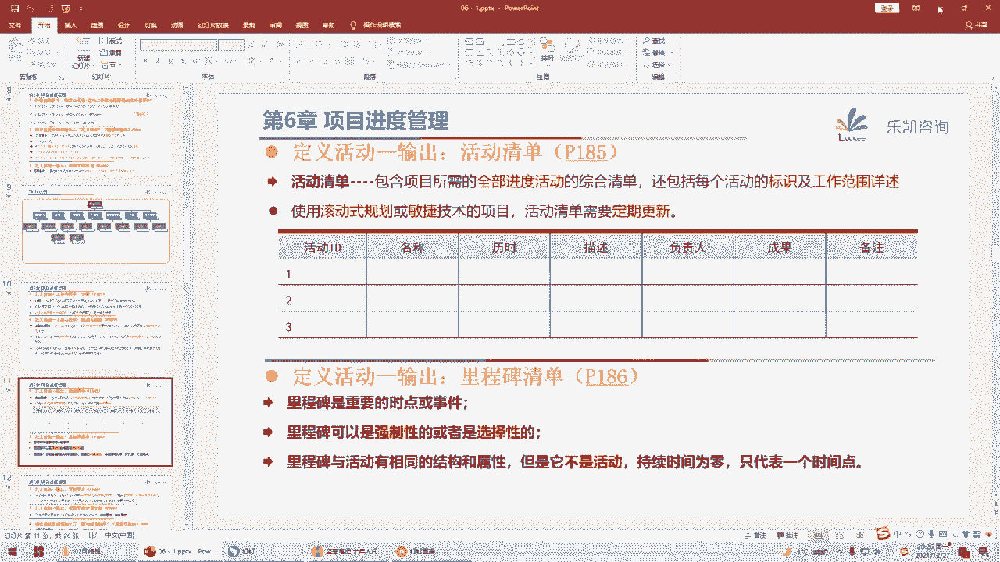
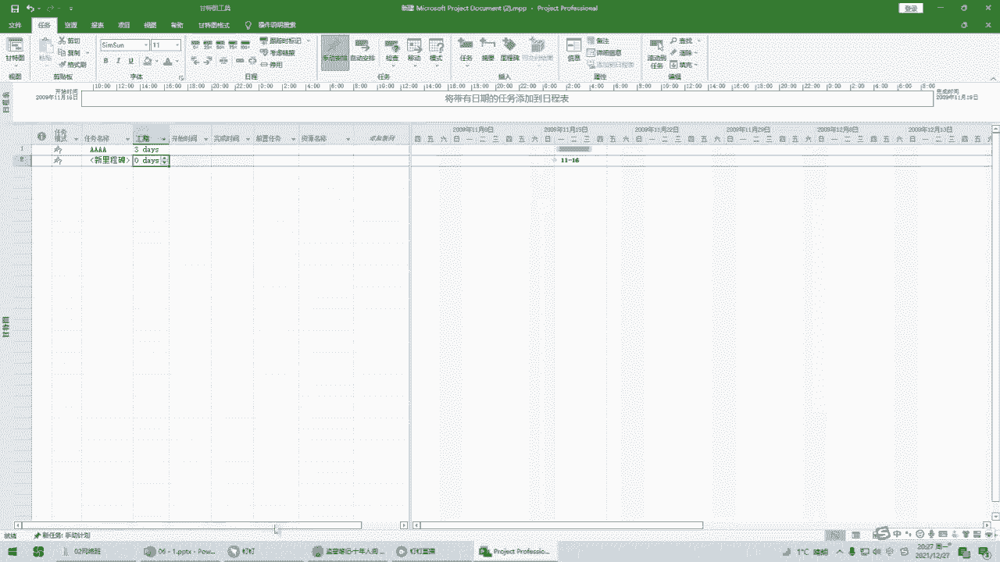
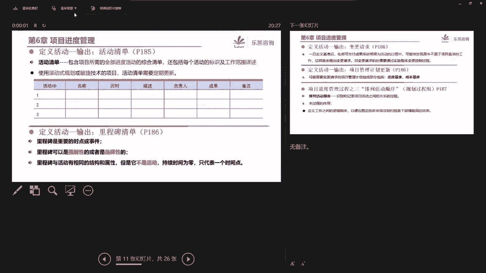
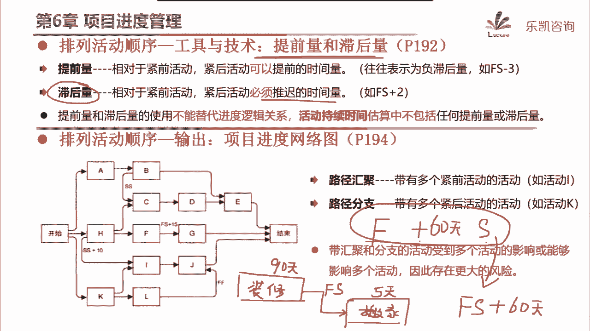
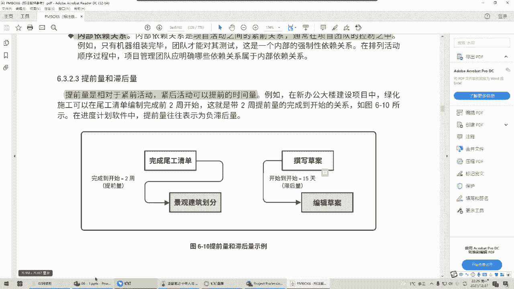
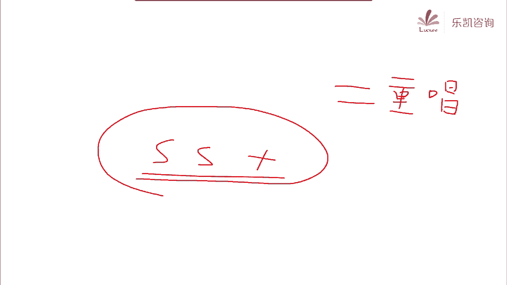

# 2022年PMP项目管理精讲课程-包含项目实战课程 - P9：第六章-项目进度管理（上） - 乐凯PMP - BV11L4y1E7TC

项目的进度管理，那么项目的进度管理这一章呢其实在学的时候呢还是讲的比较清楚的，那么在这一章的学习的时候呢，大家要注意一下项目的这个进度管理啊，它很明显它偏向于在讲进度这一块。

那么进度这一块其实跟什么有关系呢，跟工期是有关系的，说白了其实进度这一块跟什么有关系的，跟时间是有关系的，那么项目的进度管理，实际上呢在整个项目管理过程中，很多人还是比较重视的，那为什么比较重视呢。

其实因为很多人认为我们对项目的一个管理啊，主要就是对进度的一个管理对吧，包括这个很多人在讲到项目的计划的时候，比较重的也是一个关于项目的进度的计划，那么为什么很多人比较关心这一块呢。

因为这一块呢确实是比较难管理的，因为它不像范围，你说你范围多做了少做了那么少做了我就多做一点吧对吧，哎如果说说到成本，我们抄了还是怎么样，那么我们最多成本嘛上面吗在调整调整了。

但是进度这一块呢它也很难管，那么为什么进度这一块很难管呢，其实也是因为这个原因，进度这一块跟什么有关呢，它跟时间是有关系的，而时间相对来说它的灵活性是比较低的，因为不管你是什么人。

那么时间总之一天就是24个小时，他不会多对吧，也不会少，反正就24个小时一天，那么这一章在讲的时候呢，它主要是讲了我们这个进度是怎么来的，我们要选择什么样的进度管理方法，然后通过什么样的数据。

然后做一个进度模型对吧，那么根据这个模型在输出项目的进度计划这样一个过程，其实这个过程就是我们有一些人在做项目的时候啊，它这个整个的进步管理的一个全过程，从最基本的方法到填入数据，到计算总共的工期对吧。

那么另外呢在整个期间我们要保持进度计划的灵活性，那么关于敏捷里面的内容，我们后面这个加敏捷的时候再一起去看一下，那么我们先看一下进度的这几个过程，首先第一个第一个过程呢叫规划进度管理对吧。

那么我们上一节课讲这个范围的时候，说过关于范围的管理，说到了范围管理计划，包括在讲范围的时候说过他跟需求有关系对吧，然后说到了需求管理计划，那么我们规划进度管理一样的，我们也是为了将来就如何管理进度。

要提供一个指南和方向，那么也就是说这个过程他一定会输出一个管理计划对吧，那么这个计划叫进度管理计划，那么进度管理计划说的是我们将来如何去管进度，那么大家一定要注意，其实这个过程很简单啊。

它也是一个指南型的计划，说的是如何管进度，也就是说进度管理计划里面有没有具体的工期呢，没有具体的攻击对吧，进度管理计划里面是没有具体进度的，那么他这一章有一个好处，在这个过程里面就说到了。

那么进度管理计划里面包括什么东西呢，好他说包括像准确度啊，比如说我们这个进度要准确度要达到多少对吧啊，比如说工期我们估下来大概呢正-2天之内，包括我们进度的计量单位用什么。

那比如说我们去管理一个进度的时候，将来是以天为单位，还是以周为单位，还是以这个我们说的月为单位对吧，包括我们的控制临界值，那么在这边他就主主要说到了，他说我们在项目做的时候啊。

我们实际的进度不可能跟我们的计划呢一模一样的，他总会有一些区别的，那么关键是我们要不要去采取一些纠正措施，或者说一些其他的一些措施啊，来一定要跟计划保持一致呢，他说我们要采取措施。

但是也要看一下我们究竟偏差是多大啊，那么至于控制临界值我们要定多少对吧，这就决定了我们将来在什么情况下要采取一些纠正措施，比如说如果我们的控制力也值，我们用某个百分比来表示，用3%来表示。

也就是说将来我们的进度的偏差跟我们的计划比起来，如果偏差在3%以内，那么这个呢很正常对吧，多多少少总有一些偏差的，那么就不用管，但是如果说超出了3%，那么我们就认为这个进度呢偏差呢比较大了。

那么这个时候我们就要采取一些措施，那么实际上控制临界值就是我们上一节课在讲控制范围的时候，说到一个临界值，那么我们在之前管的时候，我们可以定一个将来采取纠正措施的一个临界值，说白了就是一个度对吧。

你超出这个度，那么我们就要去主动管理，包括我们进度管理计划，还说到了将来怎么去测量我们进度方面的绩效，用什么规则来测量，是由政治管理还是用其他的测量规则，那么也就是说我们刚刚在讲的时候说过。

进度管理计划里面，它是一个指南型的计划，说的是好，对吧，那将来我们怎么去管进度，那么刚刚在讲的时候，有人就问了一个问题，他说那么除了这个指南型的东西，真正记录一些东西的，有一些实际的内容的。

那么应该在记在什么地方呢，那么关于这个问题，大家不妨回忆一下我们上一节课讲的东西，范围管理计划也是一个指南型的东西，那么这个项目的范围，它实际上记在什么地方，大家还记得吗，还记不记得。

范围管理计划也是一个指南，那么项目的范围具体它记在什么地方，还记得记在哪儿吗，他肯定不是记在这个指南里面，他应该记在什么对了，范围基准里面，或者呢范围说明书也行，那么进度也是一样的，进度管理计划。

它也是一个指南对吧，那么具体的进度记在什么地方呢，它一定在进度基准里面，好吧好，那么第一个过程大家知道一下啊，我们只不过要一个指南，至于这个指南要不要做实际怎么去做这个呢，在实际的时候呢。

我们是基本上不太会去详细的去写这样一个指南性的东西，可能就是一句话带过了，好吧好，那么关于这个进度管理计划里面的绩效测量规则是正值，还是用固定公式法，这种我们在后面会详细的去讲。

那么接下来我们看第二个过程叫定义活动，那么在讲这个过程，大家先回忆一下我们上一节课讲的内容，我们上一节课讲了，一开始讲了收集需求啊，然后收集需求收集完了之后，要跟相关方把范围定下来，形成范围说明书对吧。

那么范围说明书里面主要记录了一些可交付成果，还有对应的验收标准，那么后来我们再讲这些可交付成果跟相关方达成一致，形成范围说明书之后，那么我们要怎么办，我们要便于管理的话，要去把它做一个分解。

所以我们讲的一个过程叫创建w p s，那么我们做了这样一个层级结构，wb s的最底层，大家还记得叫什么吗，哎我们把可笑物质和分解分解，分解完了之后，我觉得最底层已经可以交给某一个小组来负责了，对了。

这个叫工作包，对吧好，那么接下来我们要考虑一个问题，假如说他已经分解到工作包这个层次了，比如说在这一边分解到工作包这个层次，青椒这一层，那么接下来这个青椒怎么去来，怎么怎么去得到呢。

啊我知道要交付这些东西分解分解，比如说回锅肉，最终我们要最起码要准备一个青椒，那么这个青椒哪来呢，好我们家里面没有青椒，那么你青椒怎么来，你要到菜市场去买吧，对吧，那么买回来之后还不还不算。

买回来之后还要干什么呢，可能还要去洗一洗吧，洗完了之后你可能还要切一下吧对吧，你比如说通过这些叫什么动作对吧，我们说工作包是一个最终的结果，是一个名词，那么这个结果哪来的，结果是通过这些活动冻死得到的。

比如说我要去买买回来去洗洗，洗完了签一签就得到了这样一个我们所需要的青椒，也就是说工作包最终我们要通过什么得到，要通过一些活动，或者说一些动作能够得到对吧，那么接下来我们为什么要考虑这个问题。

说工作包究竟是有哪些活动得到的呢，因为这个就跟我们接下来的事情有关系了，比如说问一下大家，假如我们不考虑活动，我就问你青椒这个东西做一做，你们觉得要多久，比如说我随便找个人问一下啊。

哎比如说高山高同学要做一顿饭，其中有一个菜是回锅肉，我要准备回锅肉里面所需要的配菜，里面的青椒，你告诉我要多长时间，唉有人说我家里面冰箱里面没有现成的青椒了，那么你说我倾向要多长时间。

我当然要考虑我要去买，买回来切，切完了洗嘛，对吧好，有人说了，那么准备这个青椒，我估计要30分钟，对吧，那么同样的我问他，那么你准备这个算叶子要多长时间呢，有人说了，蒜叶子也是一样的。

我家里面没有现成的，我也要去买去洗去切的，那么到菜市场去买蒜叶子，买回来洗洗切一切也要30分钟，好那么接下来我问一下，那么我们回锅肉所需要的配菜一共需要多长时间，我可不可以这么说。

也就是说配菜这一块我一共需要60分钟，我能得到这样一个结论吗，有人说不对呀，那感觉他妈的你有点二啊，为什么呢，虽然说蒜叶子买一买要30分钟，青椒买一买也要30分钟，但是在实际上我们去处理的时候啊。

并不是说先去买算一次，买完了回来再去买青椒的，我们可以买这个动作，我们可以同时做对吧，在买的时候把双叶子跟青椒一起买了，也就是我们有的同学说的啊，黄宇轩说的啊，我有的动作可以并行啊。

虽然有的动作我们不能并行，但是有的动作是可以并行的呀，所以说这不应该是60分钟对吧，哎他说这样，比如说就拿这两个活动来说，我觉得买蒜叶子这个活动跟买青椒应该是并行的，买完了之后。

接下来你洗呢可能要先后洗对吧，切可能也要先后切，但是这里面肯定有一部分活动它是可以一起做的，所以说不应该简单粗暴的直接累加，那么也就是说当我们需要知道具体需要多少时间的时候，仅仅用工作包来计算。

这个是不够的，我们最好要把工作包再怎么样再进一步分成活动，然后我们再看活动，他们之间是一共是一种什么样的逻辑关系对吧，然后把真正的关系排好再去看，我们需要多长时间，所以说在我们算进度的时候啊。

到工作包这一层，我感觉还不够，我们要干什么，我们要把工作包进一步分解，分解成什么呢，分解成具体的活动，然后后面再根据活动它的关系再去计算，那么这个过程实际上就是我们定义活动要做的事情对吧。

那么我们pvp里面说什么叫定义活动呢，第一活动就是要识别完成这些工作包而采取的具体的行动对吧，那么本质上就是要把工作包分解成活动这样一个过程好，那么接下来问大家，既然第一活动是要把工作包分解成活动。

那么这个过程你们觉得输入应该有什么，这个过程就应该有一个很重要的输入啊，你要这个过程要做一件事情，把工作包分解成活动，那么很多人想，那么书不一定要有工作包了对吧，我肯定要看工作包啊。

那么什么地方有工作包好，马上有人想到了wb s对吧，那么wb是要看，那么wb是词典要看吗，也要看对吧，有人说范围说明书要么参考呢也要参考对吧，所以这个过程的输入就有包括wb。

包括wb s磁顶的什么东西呢，以范围基准作为输入哎，把范围技能作为输入，那么接下来然后我们再去分解分解成活动，那么他的工具就提到了分解好，什么叫分解，在这边的分解。

他就是把工作包再进一步分解成活动的这样一个过程对吧，那么作为一个项目经理来说，一个工作包需要通过哪些活动得到，项目经理不一定百分之百都清楚的，术业有专攻嘛对吧，所以我们在分解的时候提到过这样一句话。

他说这个分解应该由谁来做，那么要注意让团队成员来参与这个分解过程是非常有必要的对吧，因为这样做能够得到一些更好的更准确的结果，因为有的时候具体的工作包不是项目经理，他比较熟悉的或者比较了解的。

那么团队一起参与来分解，大家一起看一看这个工作包要划分成哪些活动，通过哪些活动最终得到这样一个工作包对吧，那么我们在上一节课讲的时候，我们说工作包最终要分析成活动，但是呢这个风景呢不是一步到位的。

因为最起码我们在讲范围的时候啊，连工作包都不是一步到位的，大家还记不记得我们在上一节课讲的时候说过，有的时候我们也没有办法一下子把它分解成工作包，有一个暂时没法分解的，只能先放一放，有待进一步规划的。

大家还记得叫什么吗，不一定所有的可交互什么都会有人工作包啊，对吧对了，有一些不能分解很详细的，只能暂时先放一放的，有待进一步规划的叫规划包，所以在这边也是一样的，我们在风景中活动的时候也遇到这个问题。

我们不一定说一步到位，我们可能需要干什么呢，需要渐进明细，那么这种不断渐进明细的方法就叫滚动式规划，滚动式规划好，那么接下来大家考虑一个问题啊，假如说我现在要做进度管理对吧，那么我要把工作包分解成活动。

原来呢我有一些活动是能够分解出来的，但是呢有一些地方不能分解，我就大致的先放一个规划包放在这边好，那么这个时候我们假如能做出相应的进度计划，我认为是一点的版本，那么随着我们项目的进行对吧。

信息越来越明朗，那么你原来没法分解了，我也能够详细分解了对吧，更详细了，那么比如说这个叫二点的版本，那么这个时候在我滚动式规划渐进明细的时候，就会得到一个更详细的一个新的二点的版本。

那么这个时候我们怎么让相关方知道呢，怎么让下官方知道我们最新的已经变成了二点的版本呢，那么我们以前说过渐进明细确实要渐进明细，但是当项目管理计划在你不断渐进明细的过程中，有了新的版本。

我们一定要经过什么流程，让我们原来的一点更新成二点呢，我估计啊在这个过程做的过程当中，他既然明确说到了滚动式规划这样一个工具，那么后续可能就涉及到什么呢，变更流程对吧，唉余文斌说的很对。

我们后续可能就涉及到变更流程，用新的版本更新老的版本，好吧好，那么这个是他的工具，那么通过这样一个过程，我们最终能得到什么，能得到一堆的活动，它就包括了活动清单，包括活动的属性。

那么比如说像这张表格就是我们的一个活动清单对吧，那么这里面就包括了活动的i d12345 ，那么活动的名称，比如说我们刚刚举的例子，青椒它包括买青椒对吧，切青椒，把这些活动都分解好，分解出来活动之后。

那么这个形成的一个清单就是活动清单，那么它有什么属性呢，我们将来还要分析每一个活动需要多少时间，谁负责对吧等等等等，这些都是活动的属性，那么除了活动清单，活动属性以外。

在这个过程还会输出一个东西叫里程碑清单，那么我们首先讨论一下关于里程碑这样一个东西，大家有没有听说过里程碑这样一个说法叫milestone，听说过吗，我想很多人应该听说过这样的一个说法对吧，里程碑。

那么大家知道什么叫里程碑吗，比如举一个例子，很多人都听说过里程碑对吧，那么你觉得我们如果人这一生作为一个项目来说，你们觉得我们人有哪些关键的里程碑，人这一生有什么里程碑，啊有人说了结婚。

是一个很重要的里程碑对吧，把补一方拉出去打对吧，离婚想啥呢对吧，能不能说点高兴的，结婚肯定是一个重要的里程碑对啊，有人说毕业也是一个里程碑对啊，有人说退休也是一个里程碑，哎等等，这些当然都是里程碑。

那么究竟什么叫里程碑呢，其实当我们没有办法解释的时候，我们就用一个例子来看一下所谓的里程碑本质上是什么啊，本质上就是一些重要的时间点或者事件对吧，那我们项目也是有一些里程碑的。

比如说当我们需求阶段结束啊，比如说当我们这个开发完成啊，比如说当我们上线等等，这些都是一些重要的实际点，都是一些里程碑，那么这些里程碑从哪来呢，他说我们里程碑可以是强制性的或者选择性的。

那么这句话我解释一下啊，什么叫强制性的里程碑，强制性的里程碑是怎么来的，它跟合同是有关系的，往往常见于合同的要求，比如说合同是这么说的，唉当我们项目多少天之后，我们要完成什么什么对吧。

多少天之后又要完成什么什么什么，这是合同里面的一些节点，而且这些节点往往跟什么有关，往往跟我们的付款是有关系的对吧，唉比如说你完成到什么，我们付第一笔款，完成什么，付第二笔款。

那么这些东西就是合同里面规定的里程碑是强制性的，必须要做的，如果你没有做到，你可能就涉及到什么的一些违约责任的，那么还有一种叫选择性的里程碑，那么什么叫选择性的里程碑呢。

就是说合同里面他并没有严格要求说一定要怎么怎么样啊，比如说合同里面说到了多长时间之内完成需求，多长时间之内完成设计对吧，要做好设计的评审，那么由于我是一个老项目经理，我觉得需求跟设计之间啊。

最好再加入一个东西叫什么呢，我加入一个里程碑叫圆形确认，因为我这个项目呢涉及到原型制作啊，我们讲过原型法对吧，那么所以我增加了一个里程碑叫原型确认，那么这个里程碑合同里面有没有，合同里面没有。

但是我觉得为了便于管理，从我的经验的角度来说，我认为的加了这样一个重要的时间点或者事件，那么这样可以吗，当然也是可以的，那么这种里程碑就是选择性的里程碑，你自己看着办对吧啊，有的时候便于管理。

我们需要通过增加这样一些里程碑来方便我们项目的管理，所以里程碑它有强制性或者选择性的，那么不管怎么说，大家一定要注意里程碑跟活动有相同的结构和属性，但是不管怎么说，里程碑它不是活动。

为什么强调里程碑不是活动，因为我们说里程碑它表示的是一个重要的时间点或者事件，所以它的持续时间非是零，那么我借助一个工具给大家去看一下啊，比如说我们最常见的啊。

你做进度管理用什么工具呢，我们最常见的比较简单的用project。

大家看一下活动跟里程碑有什么区别，那么这是一个很简单的进度计划的编制工具叫project，那么假如说我们现在有一个活动啊，比如说叫活动a，那么一般来说这个活动我们弄好了之后。

我们会设置这个活动大概要做多少天，他是有什么有持续时间的啊，比如说三天对吧，那么今天是星期一对吧，三天星期一到星期三三天，那么假如说我现在要定一个重要的时间点或事件安排一个里程碑，首先大家注意看这边啊。

在我们进度计划编制工具里面，这个里程碑它跟活动有明显的区别对吧，它没有一个横条，它只是一个点，而且它的持续时间默认是多少，默认就是零，因为它只代表一个关键的时间点或者什么或者事件好吧。

所以这一块大家要注意一下，里程碑它不是活动。

它只是一个关键的时间点和事件，它的持续时间是零好吧。

那么这个过程我们通过定义活动，最终就得到了一堆活动清单，活动属性以及我们的重要的时间点的里程碑清单，当然我们之前说过，由于涉及到渐进明细啊，所以在渐进明细的时候，我们可能需要提出变更请求。

对我们的计划进行更新对吧，那么这边也会输出变更请求，输出项目管理计划的更新，这个呢大家稍微理解一下就可以了，好那么接下来这个过程还是比较简单的，那么我们要考虑一个问题，当我们把工作包全部分解成活动之后。

我们要考虑什么嗯，你拿着一堆活动和里程碑，接下来怎么办啊，比如说我们刚刚举的例子，这个工作包我分解成了活动，买青椒，切金胶对吧，哎这个工作包我也分解成了活动，买蒜叶子起算叶子切蒜叶子。

那么这个工作包也分这个工作包也分大家封了之后就是一堆的活动，那么这些活动接下来我们要考虑一个什么问题呢，好有人说了，我们就要考虑一个顺序的问题，说白了就是哪些活动先做，然后再做哪些活动。

有没有什么活动可以同时做对吧，我们要排列活动顺序啊，所以接下来我们就讲到这个过程排列活动顺序，那么排列活动顺序实际上就是定义活动之间的逻辑顺序对吧，希望能够寻找到一个最高效率的一种逻辑关系。

那么这个过程它的输入在讲义上我们就不体现了，因为太简单了对吧，输入就是那一堆活动嘛，活动清单嘛，包括你准备清单嘛，那么关键是你怎么去排这个顺序呢，好它的这几个工具大家一定要理解的，第一个工具叫金钱关系。

绘图法，简称叫pdm，那么什么叫金钱关系呢，我解释一下啊，首先这个概念大家要知道，将来如果我们活动能够排好这种逻辑关系之后，什么叫紧前，什么叫紧后呢，其实很简单，所谓警前就是紧紧靠着这个活动啊。

然后呢在他前面的这个活动就叫警前活动，比如说我们看这个活动啊，活动c假如我们将来这些活动能够排成这样一种关系，你们能不能知道活动c的警前活动是谁呀。

好那么我们就根据定义仅仅靠着活动c又在他前面的是哪一个，那么很明显了，仅仅靠着c一定要紧紧靠着c又在c前面的，那不就是a嘛对吧，就是a好，那么同样的仅仅靠着c在它后面的就叫紧后活动。

很明显活动意义吗对吧，所以这个概念很简单，那么接下来我再问一下活动a它的颈后活动是谁，那么很多人会发现我们这样最终排出来这样一个图啊，开始跟结束是一个标志，它不是真正的活动，那么活动a他有没有警情呢。

他没有警情，活动a是第一个活动，他可以没有警钱对吧，那么颈后是谁呢，好我们看仅仅靠着a在它后面的有三个，一个是b，一个是c，一个是d对吧，那么同样的最后一个活动，他没有警后，但是他有警前啊。

好活动意他的警前是谁呢，也有三个，一个是b一个是c，一个是f对吧，那么所谓的颈前颈后其实就是这么简单，那么我再多嘴问一下啊，活动跟活动a之间有没有颈前颈后关系，a和e之间有没有所谓的颈前。

颈后说什么a是e的紧前或者e是a的紧后，有没有，没有为什么呢，因为a和e它没有直接的逻辑关系对吧，我们说紧前紧后一定是紧紧靠着他对吧，在他前面，在他后面是有逻辑关系的。

那么接下来我们就要考虑将来我们得到了一堆活动，我们怎么样去排列这种紧前紧后关系，那么大家注意看这张图啊，我补充了一张图，我们一个活动呢它都是需要一段时间的啊，那么需要一段时间。

它就有一个开始时间和一个结束时间，也就是我们一个活动总有start和finish对吧，那么如果说两个活动之间要有关系，实际上我们无非就是看两个活动之间，start和finish之间怎么去连一根线出来。

那么比如说举一个例子，我现在有两个活动，一个叫服务器到货，这个货要先到，然后还有一个活动呢，就是服务器到货之后，我们要上架，要调试服务器，那么这两个活动之间如果要连一根线，我们应该在哪两者之间去连呢。

我们觉得是不是这样连比较合适一点，我感觉啊把这两个连起来，那么这两个连起来代表什么意思呢，就是当我服务器到货，这个活动一定要结束了，分进去了，那么我下一个活动才能怎么样呢，才能start，是这个意思吗。

就这两个活动之间是有关系的，而且是什么关系，必须要等上一个活动结束了，下一个活动你才能开始啊，你想一想，如果服务器不到货，你怎么开始调试呢，没法调啊对吧，所以我把这两个一连好，那么我们后面在画图的时候。

当然不是这样去连，我们就划一根线，当然在线上面我们就明确地写清楚，前一个活动结束了，后一个活动才能开始，所以他们的紧前紧后关系是这种fs的关系对吧，那么接下来我们再看还有可能出现什么关系。

我们看这两个活动，老师讲课，跟学生听课，这两个活动有没有关系，我们看一下哦，好像是有关系的，那么大家觉得这两个活动的关系应该是什么关系呢，把哪两个字母连起来，好有人说了，应该是ss的关系。

这两个连起来对吧，那么在我们画图的时候，我们可能会这么画，这两个活动应该是这样，那么意味着什么，老师开始讲课，或者说当老师讲课这个活动开始，那么学生听课你也要开始了，对吗对的，老师开始讲课了。

学生就要开始听课，那么我们可以这样去安排，但是有人又说了，哎，那么如果我不这样安排，我这样安排行不行，用ff的关系好，能不能理解什么叫f ff，就是说当警前活动结束紧后，活动才能结束，当老师讲课结束。

你们学生听课才能解锁，这样连行不行呢，感觉也说得过去对吧，唉假如说我们要求严格一点对吧，特别是我们面试班，我老师讲课结束了，你才能怎么样结束听课才能走，我没有结束，你就不要结束对吧，这感觉呢好像也可以。

也没什么太大问题好，那么这里面问题就来了啊，在我们安排这种逻辑关系的时候，两个活动之间可能存在多种关系，比如说我可以说老师讲课开始，那么学生听课，这个活动开始对吧，那么我也可以有这样一个要求。

老师讲课结束，那么学生听课才能结束，对啊，比如说我叫室门口放一条狗，我不听，你们不能走，谁提前走，放狗咬他，我就有这样一个要求，可以吗，感觉也说得通，那么如果两个活动之间存在多种逻辑关系。

这个时候怎么办，好在我们pm包括里面有这样的一个说法，他说确实有可能存在多种逻辑关系，那么作为我们项目经理来说，不需要用所有的逻辑关系来描述这两个活动，我们要选择一个最合适的，比如说像这两个活动。

虽然存在这两组好像都说得过去，但是我一般觉得呢用这样一种方法比较好一些，或者用的比较多一些，把它建立成s s关系对吧好，我们再看最后这两个活动，一个是老师讲课，一个是学生在刷抖音。

那么这是一种什么情况啊，我说一下，比如说我们八点钟上课，很多同学呢，比如说07：40，7。45就已经等着了对吧，他在干什么呢，还没上课呢，他就在刷抖音对吧好，那么等到八点钟上课的时候，他就要刷抖音。

怎么样呢，就要停下来，那么大家觉得这两个活动应该建立一种什么样的逻辑关系，应该怎么领，好有人说了，我感觉好像应该这么去领啊，他说我感觉应该这么练，当老师开始上课了，我们就要停止刷抖音。

你们觉得这样说对吗，感觉是这么个道理啊，当我开始上课，那么你们刷抖音就要怎么样呢，就要停下来，这是一种同学表达的一个观点对吧，所以他觉得这两个活动之间我应该建立sf的关系。

当警前活动一开始紧后活动怎么样呢，你就要停对吧，但是呢也有人说你这个活动不太好排啊，这样排的不对呀，我这样排行不行，我把刷抖音这个活动呢放前面啊，讲课这个活动呢放后面，这样排呢不那么别扭，对吧，然后呢。

我用这种关系，s的关系，假如这个是a，这个是b，你们觉得是a正确还是b正确，我们仔细看一下啊，最后一种情况，a和b两种安排的方法，a正确还是b正确，大部分同学都认为是b正确的。

也有小部分同学认为a是正确的，首先大家要注意啊，a和b它是不一样的，我们仔细看一下啊，如果用a这种方法来排，它意味着什么，他说刷抖音这个活动讲课才能s，这种情况下，它的前提是什么。

也就是说我必须要等大家刷抖音结束了之后，我才能开始讲课，如果你刷抖音不结束，那么就意味着什么，意味着我没法讲课了，是这个意思吧对吧，如果你用a这种逻辑来安排这两个活动的话。

那么你的意思就是说当我刷抖音不结束的时候，我就没法开始了对吧，因为fs就代表前一个活动结束了，后一个活动紧后活动才能开始，这怎么行呢，你刷抖音刷到十点钟，我也不能上课吗，我感觉这个好像不太对吧对吧。

很多同学发现了这样一个问题，这个感觉不太对，那么我们再看一下b这种情况，他说只要我一开始上课，只要我一开始上课，那么你刷抖音就必须要结束，这样安排对吗，我感觉这样安排是对的，因为只要我警前活动一开始。

那那么你这个活动就必须要结束，紧后活动就必须要结束，这样一个逻辑倒是对的，所以说大家要注意这种情况，就是一个比较特殊的逻辑，叫sf这样一种逻辑好，那么我们日常生活或者项目当中有没有这样一种逻辑关系呢。

也有的，我举一个最典型的例子啊，大家一看就知道，比如说我们很多在小区门口或者在单位门口值班的门卫或者站岗的，对吧，我们肯定有一个什么呢，换岗，你觉得我们现在啊，比如说我这里有一个人在这里站岗。

比如说这是这一帮的，那么这一班的人什么时候能够结束呢，他下一班有一个孙子准备过来接班了对吧，那么你觉得这两者之间是什么关系呢，我感觉也是这样一种关系，就是只有等下一班的人开始工作了，他到这边了。

那么我上一班的人怎么样，你才能走对吧，那么他不开始你就不能走，所以这种逻辑关系就是一种很特殊的sf的关系，当然这种关系平时我们不常用那么紧钱关系，绘图法pdm就讲述了四种关系。

大家会发现每个活动都有fs对吧，排列组合也就四种，最常见的一种就是fs紧急活动结束了，紧后活动才能开始，那么比较少见的是ss和ff的关系，当然最不常见的就是这种很变态的关系，叫sf关系。

那么我个人的建议啊，在我们讲偏僻，讲理论的时候，我们为了完整性，我们当然也会讲到这样一种sf关系，但是在实际做项目的时候，其实一般我们很少安排这种关系，因为这种关系呢比较少见，弄弄的别人很不舒服对吧。

所以这种情况是比较少见的，那么这次活动之间如果存在逻辑关系这四种，所以我们在刚刚有了一堆活动之后，我们一定要把活动之间的逻辑关系把它给理清楚对吧，有关系的就排一排，最终要把关系逻辑关系把它给排好好。

那么排好逻辑关系之外，我们还要知道什么呢，还有一个工具，大家要注意一下依赖关系，所以我们有一个工具叫确定和整合依赖关系，那么有人说这个依赖关系跟逻辑关系有什么区别啊，我们看一下这个。

我们刚刚说的这两个活动之间是fs关系，这是一种什么，是一种逻辑，那我安排好这样一个逻辑，前一个活动结束后一个活动才能开始对吧，那么什么叫依赖关系呢，依赖关系实际上就是看他们究竟是不是这样一种很强的依赖。

必须要这么做，所以在我们讲依赖关系的时候，就讲了两对四种，我们先看第一对一对，它叫强制性依赖和选择性依赖啊，我们看一下什么叫强制性依赖，首先他说如果这样一种关系啊，是法律或者合同要求的。

或者由工作的内在性质决定的，好言外之意就是什么呢叫不能改，或者呢叫不能变，那么这就是一种强制性依赖或者叫硬逻辑硬依赖，就我们不但逻辑上要这么安排，而且这种关系我们无法改变，必须要这样。

比如说我举一个例子，什么是法律或合同要求的啊，我有两个活动，一个活动叫考驾照，还有一个活动是什么呢，开车，那么这两个活动是什么关系呢，好逻辑关系，我们一般是这么安排，是考驾照结束了之后，你才能怎么样呢。

开车考驾照没有考完，驾照没拿到手，你就没有办法开车好，那么这种关系我们能不能变呢，能不能调整呢，不能调整，为什么不能调整，因为这就是法律或者合同要求的，你必须要这样，如果说你没有驾照，你就敢开车。

会导致什么后果，会导致非常严重的后果，抓进去15天对吧，你不能违背了，那么这是一种法律或者合同要求，你只能这样了，只能这么安排了，你不能动的，那么什么叫由工作的内在性质决定的呢。

所谓的工作内在性质决定就是指只能这么做，因为本身它的性质上就说先要怎么样，然后才能怎么样，比如说我们看之前的这两个活动，服务器到货之后再上架调试啊，逻辑关系也是安排成fs关系好。

我问一下这种关系我们能不能改，能不能变，能变吗，这感觉也不能变啊，你说服务器到货不结束，你就去调试，你调什么东西呢，服务器还没到，你就去调怎么调啊，你一个人在机房对吧，服务器还没到，对着一堆空气去调。

这他妈也是很吓人的一件事情啊，别人一看感觉这小子有神经病啊，必须要这样对吧，你必须要等服务器到了之后，你才能去调试啊，那么这就是什么由工作的内在性质决定的，那那么像这种就是强制性依赖关系。

说白了就是不能变，那么我们p p里面也说到了，不能违背，只能这样对吧好，那么还有一种叫什么呢，叫选择性依赖关系好，什么叫选择信息来关系呢，他说我们基于最佳实践，我们安排的一种关系，但是呢你可以自由选择。

不一定要这样好，我举一个很典型的例子，早晨起床有两个活动，一个活动是刷牙，那么我还有一个活动，我也是早晨要做的啊，还有一个活动叫蹲坑，你说这两个活动之间是什么关系，你说他有什么严格的关系吗。

法律有什么要求吗，法律没有要求这两者之间有什么内在的联系吗，也没什么内在的联系，那么如果你一定要我排，怎么排呢，好我经常是这么排，刷牙和东坑我排成fs的关系，那么我为什么要排除fs的关系。

因为我觉得这是一种基于最佳实践建立这种关系，为什么，因为我觉得先刷牙，刷好牙之后呢，接下来在坐在马桶上蹲坑，这样比较好，你说先崩溃吧，再刷牙吧，有那个味道，你去刷牙，根据我的最佳实践，我一般不这么拍。

我一般是这么拍fs对吧好，那么接下来我问一下这种关系能不能调整，可以调整吗，可以调整的对吧，比如说举一个例子，当你早晨起床，发现时间已经来不及了，那么这个时候怎么办呢，好在极端情况下，我可能会这么安排。

刷牙嗯，我蹲坑，我这样排ss，当我开始刷牙了，我也要开始蹲坑，这个画面一下子就有了，就是一个人他娘的坐在马桶上刷牙，我开始刷牙了，我也开始蹲坑了，可以吗，可以。

请问这样一种安排有没有违背法律或合同的要求和合同的要求，有没有没有没有人拉你坐牢的对吧，唉有没有违背工作的内在性质，也没有，我一边刷牙一边蹲坑，怎么了，有问题吗，对好那么我问一下大家，我为什么要这么做。

一边刷牙一边蹲坑，这样做有什么好处啊，你会发现啊，这两个活动同时做的好处在于什么，原来刷牙五分钟，蹲坑五分钟，这两个加一加就要十分钟对吧，但是如果我坐在马桶上刷牙，同时做诶。

五分钟就把这两个活动全部都搞定了，这样做我们可以节约时间，在我们后面会讲这是一种什么快速跟进的方法，它有好处吧，好但是我问一下大家，我为什么在最初我们去排的时候，我们一开始排成了fs的关系。

只是后面为了节约时间才调整了，那为什么一开始我们要排成fs的关系呢，因为我们觉得一开始的这种关系是什么，是一个比较好的最佳实践啊，正常人一般来说会这么做啊，但是在极端情况下，如果确实时间很紧张的时候。

我们没有办法干什么，会做一些调整对吧，那么这样调整当然好处是有的，当然也有风险啊，我们后面会讲到一用这种方法硬生生的不遵守最佳实践，要这样调整会带来什么，会带来风险，为什么这样做有风险呢。

啧违背最佳实践的都他妈不太正常，反人类对吧，你坐在马桶上刷牙不觉得恶心吗，你不想吐吗，你本来想节约时间的，结果坐在马桶上刷牙一吐，吐了一裤子好了，这下不但没有节约时间，你还浪费了很多时间。

所以说这种做法我们后面会讲，最佳实践本来应该这么做，结果你硬生生要这么调，调，调好了之后就带来了什么，带来了风险，所以说选择性依赖关系啊，它是指我们本来基于最佳实践建立的一种关系。

但是呢我们也可以做一些调整的，但是这样去调整呢，有可能会带来一些风险的好不好，那么这一对大家要注意强制性和选择性依赖关系的区别，好接下来还有一对叫外部和内部依赖关系，什么叫外部和内部，注意啊。

这边一定有个细节，大家一定要注意，项目活动跟非项目活动之间的就叫外部依赖，要么活动之间的就叫内部依赖所，就是说这个内部跟外部，大家一定要注意是指什么内部，什么外部，他只强调一点是是项目的内部或者外部。

他不看在不在同一家公司，看是不是同一个项目对吧，比如说以前曾经出过这样一道题目，他说在一家公司里面有两个项目，一个是a项目，一个是b项目，一个是a项目，一个是b项目，a项目里面有一个活动。

它依赖于b项目里面一个设备的到货，请问这种依赖是外部依赖还是内部依赖，那么大家就要注意了，我们说的内部依赖和外部依赖是指什么，是指项目的内部和外部，那么你说a项目这项目之间，这很明显就是外部依赖了。

他虽然在同一家公司，但是他也是外部依赖，所以大家一定要注意这个内部外部说的是什么呢，项目内部和项目外部好吧，那么依赖关系一共是怎么这四种有两对，那么当然这两队呢可以随意的组合变成强制性，外部强制性。

内部选择性，外部选择性，内部说这种依赖关系我们也要关注的，为什么要关注，因为我们后面会看能不能调整，特别是涉及到这一对对吧，能不能调整好，接下来还有一个工具也要考虑的，就是提前量和滞后量啊。

我解释一下什么叫提前量，什么叫滞后量好吧，其实不要看书，书上讲的很复杂，我举一个例子好了，我现在有一个活动，装修啊，我们很多同学家里面会涉及到家里面的装修啊，那么装修完了之后呢，我们才会搬家。

那么这两个活动就很典型了，比如说我家里的房子装修要装修90天，商家要搬多少题呢，要搬五天，那么这两个活动是什么关系呢，一般来说我们是建立这样一种关系，fs关系，等装修结束了，我们才搬家。

但是呢在我们实际排计划的时候，要考虑到一个问题，紧急活动结束了之后，紧后活动能不能立即开始，比如说装修跟搬家，装修结束了之后，搬家能开始吗，其实我们大部分同学不是这么做的，很多人就想到一个问题。

什么问题，装修完了之后，家里面有甲醛啊，一要通风的，比如说我要通风两个月的时间啊，所以这个不是直接就开始后面一个活动的好，那么这两个活动应该怎么安排呢，我这样写啊，大家看是不是有道理啊。

领钱活动也就是装修结束之后，我必须要再等等多长时间呢，好比如说我们要等60天，要等60天，然后今后活动搬家才能开始，对吧，当警前活动结束了，还要再加上60天，比如说紧急活动第一天结束。

我们还要再加60天，到了61天之后，今后活动才能开始，是这个道理，那么你这样去写呢，感觉不太美观，那那么这种写法我们就把它优化成了另外一种写法，就这样吧，是紧前紧后fs的关系，但是中间要加多少天。

要加60天，要等待60天，这种做法叫什么，需要等待的时间，或者说必须要推迟的时间，我们把它叫滞后量，不是说后面马上就开始了，要滞后多少天开始啊，那么有滞后就有什么之后就有提前了。

我们也有一些活动不一定要等完全结束的，比如说a活动本来结束了之后才能做b活动，但是呢我觉得不一定要等到完全结束啊，比如说我们做需求和设计，不不一定要等需求完全结束了才能设计，我可以在需求结束的前几天。

我们就开始设计，有一部分是并行的，提前几天好，那么我们怎么写呢，比如说我们应该怎么写，原来是fs关系，但是在紧前活动结束结束啊，在他前三天结束前的三天，我们的设计就可以开始了对吧。

那么这种写法我们也可以把它简化，或者说美化成什么呢，是fs，但是可以提前三天用fs减三，那么这种叫什么叫提前量也是可以的对吧，那么这个就是提前量和滞后量，我们要根据实际情况进行一些安排好。

接下来给大家看我们偏报考书上的说法啊。

我们看一下关于极限量和滞后量好，大家看一下这张图，嗯介绍了什么叫体型量，什么叫之后量，对吧好，我们看这张图的左边半部分，完成围攻清单，景观建筑划分，他我可以提前有些提前量，那么也就是说它是fs要干什么。

减两周，这就意味着在完成围攻清单这个活动结束的前两周，我的景观建筑划分就可以开始了，这个图没问题对吧好，那么我们再看右边这半部分，大家有没有发现有什么问题没有啊，撰写草案开始我们编辑草案呢也要开始。

是不是同时开始他要滞后，要等待一段时间，他说并撰写草案，开始时五天之后我们再开始编辑草案啊，这个图有问题吗，没问题好，很多同学发现了有问题的问题在什么地方，既然是滞后量，不应该是减15天至之后。

就是要再等15天要加15，听到没有，应该是ss开始到开始加15，所以书上这边有一个小错误，要注意一下，啊好那么这个过程主这几个工具我们要理解清楚啊，pdm紧急关系绘图法，然后确定和整合依赖关系。

包括提前量和滞后量，那么最终这个过程做完了，我们就能够得到这样一张图，把活动的逻辑关系排好，叫项目进度网络图对吧，那么这张图告诉我们什么，首先我们看一下b和e和e之间没有写任何逻辑关系。

大家知道b和e之间是什么关系吗，所以我们有一种情况可以不写，默认是什么关系呢，默认是fs的关系，b和e之间默认的fs关系，你可以不写，那除了这种关系以外，其其他的关系你必须要写清楚，甚至包括质后量。

提前量的你都必须要写，不能偷懒，fs关系你可以默认不写好吧，那么另外呢要注意在这张图里面，我们看一活动，做完了做一做完了做义，那么对于一活动就相当于什么呢，一个路径汇聚点这个活动它的风险是比较大的。

我们要注意的，为什么，因为一旦b d出了问题，那么一活动就有可能受到影响，所以它的风险比较大对吧，我们也有一些活动，比如说h这个活动h做完了才能做，c才能做f a区叫什么呢，叫路径分支点。

这种节点风险也比较大，因为一旦他出事儿，有可能影响多个活动对吧，这个在我们将来管理的时候，汇聚点和分支点要稍微留意一下的好吧，那么不管怎么说，最终这个过程输出了项目印度网络图。

把活动的关系都把它理清楚了，好接下来我们有了活动吧，活动的逻辑关系理清楚了，形成了这张图，我要知道整个项目的工期，其实我们还要做一件事，做什么事情，一个活动要做多久啊。

有了之后我才能知道整个项目的工期啊，所以接下来我们要知道活动的持续时间，那么在讲这个过程之前，我们先讲几个定律，世界管理学有三个定律，第一个定律叫帕金森定律，这这是我们必须要清楚的。

那么什么叫帕金森定律呢，他说只要有时间，人们就会有意无意地做一些不必要的工作，造成范围蔓延，直到所有的工时间呢都用完好，这个定律说的是什么意思，举一个例子啊，就是说你一般早晨呢应该是八点钟出门啊。

二点钟出门呢，你九点钟到公司路上需要花一个小时，如果有一天你07：30就收拾好了，准备出门了啊，问一下大家，你会07：30就出门，然后八点半到公司吗，会发现有大部分人不会这么做，本来你说七点半出门。

九点到公司有一个半小时对吧啊，那个我本来应该就是八点半道呀，但是他会怎么办好很多人由于时间有的多，他会怎么办呢，他就会多做一些不必要的事情，比如说我老婆会干什么啊，我老婆就会做个面膜呀。

一个头啊对吧等等，刷个手机啊，也要磨磨蹭蹭到八点钟才出门，然后还是九点钟到公司，可以说只要有时间，他们就会多做一些其他的事情，他不会节约的对吧，那么跟这个类似的是什么呢，叫学生综合症。

什么叫学生综合症的俗称就是拖延症啊，比如说，典型的小孩儿，星期五嗯，小学回家做不做作业不做，我小孩就这样，晚上我问他，你作业做了多少，他会用一种看白痴的表情看着我，然后跟我说，今天星期五啊。

下之意就是你举手嘛对吧好，星期六问他，你作业做完了吗，他说唉呀，作业不多，我明天直接把他做掉啊，星期天上午还在睡懒觉，下午总算磨磨蹭蹭开始做作业了，一坐坐到晚上还要加个班，因为他再不做。

他们来不及了呀对吧，那么这种就是学生综合症，简单来说就是拖延者，那么这两种啊我们一定要注意在管项目的时候啊，估算活动持续时间，要考虑到这两个问题，那么除了这个帕金森定律，20世纪管理学还有两个定律。

一个是墨菲定律，一个是彼得定律，两个呢我们在讲实战的时候呢，跟大家可以再说一下，一个跟风险有关，一个跟管理有关好吧，包括学习曲线，这什么叫学习曲线呢，实际上就是一个说法叫熟能生巧好。

那么接下来我们考虑一下怎么去估算活动持续时间，那首先大家要注意啊，估算活动持续时间，就是要估算每一个活动要多久啊，这是我们做进度计划的前提，你有了活动排列，活动顺序，有了进度网络图。

还要需要知道每个活动需要多久吗，那么让谁去估呢，好pmp里面是这么说的，动的持续时间应该由团队中最熟悉具体活动的个人和小组来估，不是项目经理局估，最熟悉具体活动的个人或小组去估，那么为什么。

因为项目经理估它不一定准确，这项目经理比如说他了解这部分工作对吧，有的项目经理呢他不了解，因为项目经理不一定他懂技术啊，不一定懂细节啊对吧，这项目进来估呢不是不好。

最好让最熟悉的具体活动的个人和小组来估，那么另外大家要注意啊，有几个细节要注意的，他说，活动新增资源或者分配低技能资源，就需要增加沟通协调和培训，这有可能会导致什么呢，会导致需要更长的时间，是这个细节。

大家一定要注意啊，大家有的人在做项目的时候，有没有跟领导说过，我们人手不够不足，应该都遇到过这样的情况的，那么领导是怎么回复的呢，有的领导是这么说的，你人手不够是吧，这样公司刚来了一批实习生。

给你分配五个实习生，你们要不要，你人不够，我给你人啊，给你五个实习生啊，正好来了五个实习生给你，让他们一起帮你去做，那你总够了吧，要不要，就像这种啊，新增资源或者分配低技能资源了，他说不要。

为什么不要对了，很多人说他奶奶的，我不要，他来了之后，老子还要培训他，还要怎么样呢，还要去教他，我他妈还不如自己做呢，也就是说大家一定要注意啊，将来如果觉得这个时间我们的活动时间太长，我们想要压缩时间。

那时候家人不一定是一个好办法对吧，哎有的活动家人是可以的，但是有的时候呢家人呢他不一定行，为什么，因为有可能他技能不足，你需要额外的培训，哪怕他能力是有的，家人也不一定能解决问题的，我举一个例子。

抽一根烟要多久啊，我抽一根烟五分钟就可以了，好你说我抽一根烟五分钟，家人能不能缩短时间，我们现在听直播的有832个人，啊好我们一起来抽这根烟，你觉得五分钟抽得完吗，800多个人他妈抽一根烟。

五分钟你反而抽不完，为什么，但大家都会抽，抽满细一下就行了嘛，但问题是什么，你的协调也是需要时间的对吧，这个事情要注意一下，家人不一定永远解决问题，收益会递减，聚会缔结明白吧。

你们我说的959个人是总人数，我说的是现在正在观看的人数是834个人，好吧好看来资源也是一样的，加资源也不一定能解决问题好吧，这些都是我们要注意的要注意的。

另外员工也要考虑到员工的帕金森跟学生综合症的问题啊，那接下来怎么去估算活动时间呢，它的工具比较重要，我们看一下啊，这种方法首先我们看这种方法叫类比估算，什么叫类比估算呢，大家注意啊，这些工具比较重要。

考试考的比较多，但是呢又比较简单，一笔过来就是我们之前做过相似的活动，我们有历史数据b呢在项目信息不足的时候，特别是在启动的时候，我们经常用这种类比估算好，这笔估算，大家注意啊，俗称叫拍脑袋。

那为什么他俗称叫拍脑袋呢，举个例子啊，昨天，或者这么说吧，我们今天因为昨天是星期天对吧，我们今天去公司上班的路上花了一个小时，我要问你明天去公司上班，路上要花多长时间呢，好这个时候你想了。

明天我还是走同样的路线，还是用同样的交通工具坐地铁对吧，那么你说这个明天去公司跟今天去公司怎么样，就非常的类似，那么你要问我明天去公司要多长时间，由于它非常的相似啊，我们都是花的同样的路啊。

用了同样的工具，那么几乎就没什么区别，你问我明天要多久，我告诉你明天我到公司路上要花多长时间了，一个小时对吧，这就是类比估算，那么为什么我能够类比估算，能够一拍脑袋去告诉你呢，因为我有有这样的一个什么。

有这样的一个经历，我其实是有一些经验的，它是一种专家判断对吧，我我经历过的，那我今天去公司花了一个小时，明天也要一个小时对吧，另外它是一种整体估算，好，我跟大家说一下什么叫整体估算。

就是说当你问我明天去公司路上要花多长时间，我并没有考虑到细节，说我我从小区从家里面走到小区门口多长时间，从小区门口走到地铁站多长时间，然后地铁要开多长时间，下了地铁要走多长时间到公司。

这些细节我都没有考虑，又笼统地说了一下啊，估计一个小时，那么一样的，什么叫自上而下呢，大家就考虑金字塔这种为了自上而下，就是我站在上面整体的咕一咕，不考虑细节，一下子就告诉你了一个小时啊。

这种估算方法有什么特点，它的特点是速度快，最大的特点就是快，速度快，成本低，但是一不准的对吧，毕竟呢比较笼统对，所以类比估算的特点速度快，成本低，但是不准好，接下来第二种方法，参数估算，我举一个例子。

大家体会一下参数估算跟类比估算有什么区别啊，参数估算是这么说的，天呐我吃了一个包子，吃了一个包子呢，花了两分钟，接下来今天呢我打算吃五个包子，告诉我五个包子要多长时间好，马上有人就说了。

五个包子要十分钟，好这种估算方法它有没有参考历史数据呢，他参考了历史数据，但是它跟类比估算有什么有区别啊，区别在什么地方，它并不是完全类似的活动啊，只不过借助了历史数据，然后还要干什么，还要通过计算的。

比如说要考虑到统计关系，要考虑到相应的参数，要去算一算的对吧，这种叫参数估算，那么参数估算准不准就取决于什么，取决你的基础数据准不准，包括你的公式或者叫参数模型，它成熟不成熟对吧。

不是就是这样一种简单的几倍的关系好吧，那么这种叫参数估算，也可以通过这种方法来估一个活动的时间，好自下而上估算，什么叫自下而上估算呢，我们用刚刚的那个例子来说啊，要问我明天到公司要多长时间。

那么我告诉你啊，我从家你下楼走到小区门口要十分钟，我从小区门口骑个车子到地铁站五分钟，然后乘地铁呢要20分钟，下了地铁走公司，走到公司要多长时间呢啊，比如说要25分钟。

总共一起加一加累计算一算要一个小时到公司好，什么叫自下而上，其实这这种方法跟自上而下是反的，自下而上就是从细节汇总到整体好，大家注意这一这种方法是一种最准的方法，最准的啊。

从细节一步一步汇总到整体最方法，但是它准归准，它要有一个缺点，大家能明白自下而上的估算有什么缺点吗，准了，但往往这种方法对了，比较耗时，它比较慢，它比较慢一点，好吧好。

那么我们刚刚讲了比较简单的类比估算参数估算自下而上估算，那么这三个在考试中的考的比较多好吧，那么接下来其他的决议我们先不用看这个呢啊，什么意思，在敏捷里面的一种方法，会议就不用说了，对吧好，选方案分析。

我们讲了很多次了，多个方案去比较，比如说我到公司我可以坐地铁，我可以打车，不同的方案当然要不同的时间好，接下来还有两个工具也比较重要，我一个一个来讲啊，我先看储备分析，什么叫储备分析啊。

讲这个之前我问大家一个问题，假如一个活动估计要五天，活动你估下来要五天，那么这个时候你报给项目经理的时候，你报多少天啊，活动要五天对吧，项目经理交给你了，项目经理问题，你要多少天好，很多人说了。

我报七天，是说我多报了两天对吧好，我报给项目经理的是七天，我问一下，为什么你要多保这两天时间，啊，啊有人说我要留点空间，对董飞董飞宇说了，我要留点空间，人说练八分，为什么呢。

好很多人都打了一行字叫以防万一，以防万一啊，为什么我考虑到有风险啊，我五金不一定来得及的话，不能说得太满了对吧，所以我报了七天好，接下来我问一下这样的做法对还是不对，很多人说我做的是对的。

我也承认你们做的是对的，为什么，因为人要有风险意识，这个是对的，我不出在这边，问题出在什么地方啊，我要告诉大家，问题就出在帕金森，说为什么我要讲帕金森的道理，问大家一个问题啊。

请假如说这个活动你报上去七天，项目经理也批了建如果呢你考虑的这些风险呢，它没有发生，你用五天时间诶，真正就把这个活动搞定了，那么请问在这个时候你会跟项目经理说，我啊我做完了你会说吗，心里想靠。

还有两天时间，我摸个鱼不好吗，还有两天时间我调整一下，刷刷抖音不好吗，大家要注意，我们为什么要考虑到帕金森的问题，即不出在一开始，而是出在现在这种情况，明白吧，就是风险没有发生的时候。

说两天时间你也不会给别人，所以我们要考虑到这个问题好吧，当然从本质上来说，你当时预留的buff是可以的，没问题的对吧，那么关键就是说我们留了这个buffer呢，或者说留着这个储备呢要科学。

那么我们怎么去留这个储备，我们在故事性的时候要考虑到储备好，接下来我们学习一下什么叫应急储备，什么叫管理储备，说到应急储备跟管理储备啊，我补充讲一讲，当然我们后面讲风险的时候，还会涉及到其他的一些风险。

做事情一定要考虑到风险的问题，叫风险呢，就将来可能发生的概率发生的，那么这个风险呢就分为这两种，我们现在先讲两种啊，一种叫已知未知，一种叫未知未知，什么叫已知未知呢。

好我解释一下前面这个已知就代表这个风险，我们是想得到的，想得到的是后面这个位置代表什么意思呢，就是你想到了之后有没有什么手段能够主动管理呢，不你有什么好的办法能够主动管理，我举一个例子啊。

我一说大家就明白，一定往上上课一个半小时，不是说下了课之后，你约了你的女朋友去吃宵夜，觉得有什么风险吗，就会明白有一个风险，我们虽然说上课一个半小时，但是九点半不一定能准时的，有可能会稍微拖一拖的对吧。

这个没有办法控制的那么精确嘛，你说玩个五分钟，玩个十分钟也很正常对吧，那么这个风险是我们能够想得到的，因为讲课嘛有的时候总有一些偏差的对，那么这个风险我能够想得到，但是呢你说我要不要主动管理呢。

唉说用刀逼着进，说爱金老师，的要准时下课，不下课，我捅你这个不行的对吧，这个方法也这个风险也没有必要主动管理，拖一点时间又拖一点时间嘛，好那么像这种就是我能够想得到的，但是呢我也不想主动管理的好。

那么对于这种已知未知风险，我们怎么办，我们在估时间的时候啊，就要留一些buffer，说你约女朋友的时候，你要跟你的女朋友说什么时候出门啊，不要说九点半了，你就老老实实跟你女朋友说，这样吧，我们十点钟吧。

你多留个半个小时总足够了吧，针对这种东西在排计划的时候，你就跟他说得很清楚，我们计划十点钟我们出发，然后接下来后面怎么怎么样，那么九点半到十点中间这半个小时就是我们预留了一些八法。

这种储备叫什么叫应急储备，那么接下来我问大家一个问题啊，今天我上课九点半没有结束啊，估计九点半呢是结束不了，估计要拖个十分钟对吧，好那么这个时候拖了一些时间去，只需要你差不多十点钟才能出门。

在这种情况下，你要不要跟你女朋友说走变更啊，说啊，如果我确实上课拖了一会儿去，是需要你到十点钟才出门，这个时候你要不要跟你女朋友说，计划有变，我要走变更，那么不需要呢，因为在当初我们排计划的时候。

其实我们就是排了几点钟出门的，十点钟不出门，我们是预留了这部分时间的对吧，如果说他确实这个风险发生了，确实我们要十点钟出门，那么这也没有超出计划呀，也算按计划执行啊对吧，那么在这种情况下。

我们就不需要跟他说变更的事儿对吧，所以说硬基储备是真对已知未知风险，我们事先就想到的这个风险，而且事先就留了时间的，所我们项目经理可以直接使用，一般是不需要走变更流程的，风险发生了，那么就发生了对吧。

好是大家注意，还有一种风险，什么风险啊，想不到的，我一开始没想到，比如说我九点半下了课，稍微拖了一点时间对吧，到了十点钟，我打算出门了，这个时候突然好了，有一个客人来了。

唉比如说我有一个朋友忽然到我家里来找我，有点事儿聊一下，靠这种事情我没有想到啊，我刚准备出门，这孙子就来了，而且一把鼻涕一把眼泪的说，我遇到这个困难对吧，你一定要帮我靠，这种事情我哪想到了。

我事情没这个计划呀，这种就是我想不到的一种风险叫未知风险，那么既既然是未知风险，我当然也没有什么主动的管理的手段了，好那么我问一下，遇到这种情况，你要不要跟你的女朋友说计划有变，我要晚一点，肯定要的。

要变更对吧，要申请什么管理储备，为什么减一句话这么说，就是这种情况不在计划内，计划内，你肯定要走变更流程的对吧，所以大家先了解一下啊，应急储备跟管理储备它基本的一个概念，那么应急储备在计划内。

项目经理一般直接使用，那么基储备我们是需要做变更的，那么我们后面在下个星期讲成本的时候，会详细记得再去讲应急储备跟管理储备好吧好，那么利还有一个工具叫三点估算，大家一定要认真听。

因为考试的计算题集有可能考到三点估算的计算好，接下来我讲一下三点估算，到三点估算啊，估算活动持续时间的时候，考虑到风险和不确定性，所以我们有一种方法工厂，那么三点估算就是指我们要找到三个点。

这个活动最可能最乐观和最悲观的时间，啊啊啊，比如说啊他会这么说啊，再有一个活动，这个活动呢其实之前呢做过如果不止一次了，做了很多次了，那么我们通过历史数据来发现啊，这个活动最乐观的时候呢。

四天就把它做完了啊，第一关他花了16天才做完，那正常情况下做完的时间出现的次数比较多的是13天把它做完了，就这三个数据，接下来问你，那么你觉得这个活动你要留多少时间好，最乐观最悲观。

最可能接下来你怎么去算，有两种方法，三点估算，包括两种方法，我们先看第一种方法，无方法叫三角分布，怎么去算呢，很简单，算个平均值，比如在这种情况下，我们就这么算，16+4+13÷3，平均下来啊。

这个活动要11天，叫三角分布，就是我们小学时候算的平均值，那么这种方法在考试中不考不考，考三点估算，问的时候，他问你需要多长时间，我们默认不用这种做法，我们用另外一种做法叫贝塔缝补好分布是怎么做的呢。

他说我们这么去算最悲观，16加上最乐观四加上什么呢，好四倍的，最可能，除以六，这样去算对吧，那么算下来是多少天呢，10+52，72，72÷6，算起来等于12天，第一种方法呢我们叫贝塔分布。

首先看这种方法啊，大家能不能看出来这种方法它的本质是什么呀，不，公式是固定的，你就按照这个公式去算就行了，那么我们看一下这个公式的本质是什么，其实它的本质呢是这样的，第一关16天我取一个样本数据。

最四天第二个样本数据，然后我再取样本数据，这样33，13我把13呢取了四个，为什13区的四个呢，因为这个13天叫最可能它出现的次数比较多，我一共是不是取了六个样本数据啊，所以我把它除以的六。

其实它是一个加权，平均的一个做法，他是把最可能的权重放大了四倍，然后再算一个平均值，那么这个公式大家记住就可以了，在考试的时候一定要默认用这种方法来算好吧，好比如说考试就出这一道题目，一个活动最86。

最乐观是最狠的，13让你去算平均值，你要会算好吧，考试就考到这里为止，啊公式跟你说啊，是固定的，你把它记住就可以了，套不是去算就行了，考试就考到这个程度，最多他换一种说法，换什么说法呢。

好送你平均算下来需要12天，让你反过来算，最可能你也会算一样的套公式，最悲观16加上最乐观四，然后最可能是多少呢，不知道四倍的最可能x然后除以6=12，反过来推，把最可能推出来啊，好吧。

考试就是这个难度，那么接下来我补充讲一下啊，其实三点估算还有很多其他的作用，这部分内容呢能听懂就听懂，听不懂那就算了，好吧好一下，12天算出来，其我们会发现最终项目需要多少天，符合这样一种叫正态分布。

12天在中间，我为什么这么说呢，因为最终这个活动需要多少天，其实呢还是不确定的，但是我可以跟你这么说，在12天以内概率是多少，好大家看这张图啊，这个结果应该是在这样一个范围之内的啊，跟水平线无限接近。

那么12天以内完成的概率是多少呢，好看涂红色的这一部分在一个面积里面占多少，占51%，说12天以内完成的概率是50%，有没有可能超过12天呢，有可能真的超过12天的概率是什么呢，也是50%。

超12天就是右边白色的这一部分好，接下来我们还有一种说法在p m p里面啊，还有一种说法叫，啊标准差是怎么算的呢，把最悲观减去最乐观除以六，比如说在这道题目里面，最悲观是16，最乐观是四。

就标准差就等于二，要注意一下为什么要算标准差，如果标准差越大，说明什么，说明我们这个活动的风险就越大，假如一个活动最乐观，一天1万天，最乐观差距很大吧，标准差很大吧，好一旦出现这种情况就意味着什么。

宏宇说得很对，就这位置这他妈不确定性太高了，不一关跟最乐观差距这么大呀对吧，你这个也太不确定了，所以标准差越大就意味着这个活动风险得越大对吧，是第一个，那么第二个算标准差算出来它的作用是什么呢。

帮助我们进一步的分析其他的概率，经过数学统计发现有这样一个规律啊，均值就是平均值12天，中间这个点是12题，正-1个标准差，12天正-1个标准差就意味着是多少天呢，12天正-1个标准差也就是十到14天。

我们数学统计发现这个活在十到14天之内完成的概率是多少呢，好我们有一个统计值的是分之68。26或者二七，这个学过数学统计的应该会知道这是一个固定的值对吧，68。26，那么在平均值正-2个标准差。

也就是八六天之内完成的概率是95。46%，在平均值正-3个标准差之间，也就是六，这个时间完成的概率是99。73%，这三个概率是我们数学统计得到的结果，你直接有兴趣的记住就行了。

那么我们以前考试呢会考得比较复杂，我看一下大家会不会做这种题目啊，说他说一个活动最悲观16天，最乐观四天，最可能是三天，他要你算平均工期和标准差，这个比较简单，平均工期套公式12天。

标准差最悲观减最乐观除以六是两天好，接下来他会问你十到14天之内完成的概率是多少啊，那个时候你就看了工期是12天，那么十到14天就意味着什么，在均值正-1标准差吧，实际上就是在问你这个问题。

那么我们如果记住那个值，我们就马上能够反应过来啊，均值只是正-1个标准仓，不就他吗，十到14天之内完成的概率是多少，就是68。26%，这个很简单好，接下来再看他说14天以内完成的概率是多少啊。

再想一想啊，什么叫14天以内啊，三图14天在这儿是天以内，我觉得是不是这样啊，首先编的这一半50%都是14天以内的，那么除了左边的这一半50%以外，还有一部分是哪一部分呢，是这一步伐12~14之间的。

也是14天以内的，那怎么算呢，诶我忽然发现是这样啊，是天以内不包括了左边这一半50%，那个橙色的这一块是什么呢，不就是正-1个标准差的一半吗，百分68。26的一半除以二吗，所以我们就能够算出来啊。

14天以内我也好算的，这么算，50%加上68。26除以二，等于84。13%，好接下来如果他问你十到16天好看一下啊，十到16天有没有同学知道怎么做吗，十到16节应该怎么算，把这个图画出来，你就知道了。

十到16天之内完成的概率是多少，其实分成了两部分啊，一张图就是十到16天对吧，16天你分成两部分，你先算十到12天，十到12天是这个图的一半，12~16天呢是正-2个标准差的一半，那么我们就很简单了。

就把68。26%除以二，再加上95。46%除以二，一个是一个标准差的一半，一个是两个标准差的一半对吧，那算一算就算出来最终的结果是多少，那么刚刚讲的这些东西啊，跟大家说一下。

有些正确的去了解一下后面的这些东西，偏僻现在不考，我们在考别的考试的时候，比如说在考软考的时候，就会考到这边的计算好吧，那么偏僻，如果你你不想了解，最起码要掌握到什么程度，要掌握到这个程度。

小学2年级的程度是会算就可以了好吧，上面的这个是偏僻的难度，下面的有兴趣去了解一下好吧，那么通过这些工具，我们最终估出来每一个活动的持续时间，得到了持续时间估算，当然也需要有估算的依据对吧。

我们最终估算的时候啊，算出来的时间我们不一定是一个绝对的值，我们可以包含一些变动的区间，可以包含一些概率都可以好吧，今天的课程我们就到这里为止，稍微拖了一点时间，因为涉及到一些计算。

那么我们今天主要讲了我们从工作活动得到活动，然后排列活动顺序，然后估算活动持续时间，那么下一节课我们就会着重讲整个项目的计划怎么去排，那么下一节课的内容呢，我希望大家还是要认真听一下的。

虽然在考试中呢不是一个很重要的一个点啊，有一些有一些点呢是比较重要，但是呢总的来说呢不是很重要，但是呢下一节的内容就讲了，我们进度计划编制软件，它内部的原理是什么，我觉得作为一个项目经理。

应该好好好的去了解一下进度应该怎么排，然后怎么去调，好吧好，那么今天的课程有什么不明白的，留下来答疑好吧，没有问题的可以先走啊，刚刚讲的内容有没有什么不明白的地方，说三点估算这个是怎么提出来的。

三点估算的原子计划评审技术，大家看到part就是三点估算，好吧，这些东西呢其实是从军方的项目中首先用出来的，我很多东西啊，像part包括我们后面讲的正直管理啊，它的起源是在美国的军方，军方做项目的时候。

首先用了这些方法，大家有兴趣可以去查一些相关的资料，这个公式里面为什么是乘以4÷6，乘以6÷8，行不行，乘以8÷10行不行，记得我就不回答了对吧，公式是什么，就是什么，不需要去深挖。

这个说公式是怎么来的，说实话我也没有研究过它的起源在什么地方啊，有这个公式，你知道它的本质的，其实本质的含义就是做一个加权平均，刚问了一个问题，说规划进度呢也为什么只有输出，没有输入跟工具呢。

这个在一开始上课的时候，我就说过啊，讲义上的最重要的，没写的就代表不重要啊，问一个问题，他说关于应急储备啊，活动的应急储备是多少，应该如何表现，这很简单啊，七我们最终在排计划的时候啊，我举一个例子。

这里有两个活动，一个是aa做完了之后呢，做b，比如说a呢我们算下来要五天，b呢要三天，实际在我们报给项目经理的时候，或者说报给客户的时候，由于我们考虑到一些风险，所以呢流动性应急储备。

我们最终a报的是七天好，接下来b报了多少题呢，比如说我们b报的是五天，在我们进入计划排的时候，其实就不考虑到这个东西了，我们就直接a排七天，必排五天，但是有一点在活动的描述里面，我们要描述清楚。

七天为什么是七天，我们会有一些依据的，就是说我们虽然有估算的结果，但是我们也要说清楚，依据要跟别人说清楚，那这个活动本身要做五天时间，那考虑到在做这个活动会遇到什么风险对吧，如果说遇到这个风险。

我们可能需要多少时间，然后所以我们总共给这个a活动留了七天，就是在最终排计划的时候是直接排七天的，但是在我们跟别人去报这个估算的时候，我们有的时候是需要跟别人去解释的，就是这个七天是哪来的。

这个估算活动持续时间的时候，它会输出一个叫估算依据吗，这些东西会写进估算依据里面，问一个问题，他说里程碑，阶段节点，是什么，我说一下啊，我们之前讲过一个叫阶段的审查点，还记得吗，在阶段结束的时候。

有阶段审查点，阶段的决策点，其实审查点决策点有的时候在那个点点上，我们也把那个点就叫里程碑，在我们老版本里面在讲阶段审查点，阶段决策点的时候，就提到过几种说法啊，项目分成多个阶段。

这个点我们要做审查和决策，那么这个点我们就叫决策点，审查点，生死点也里程碑，这个点上确实正好有一些重要的时间点和事件，那么它就是里程碑事儿好吧，那么有人说的机械是什么，跟大家机械在我们pp里面叫什么呢。

就是基准，极限就是baseline，我们下一个星期就会讲进度基准，它是怎么来的，嗯，他就会讲有了这些东西，活动也有有了进度，网络图，也有了活动的具体的没这个活动需要多少时间也有了。

那么接下来整个项目的进度基准怎么把它定下来，这样说三点估算一般在什么场景使用，那他在一开始就说得很清楚啊，他说到不确定性和风险的时候，我们就要用三点估算，这个活动要考虑到风险和不确定性。

那么我们就会用三点估算，嗯，在项目初期建立baseline，这个初期啊我觉得说得不太准确啊，的基准就是这个best line，其实不是在项目的初期，按照我们项目管理里面应该是在项目的规划过程中对吧好。

那么接下来无非就是问你基准为什么要建基准，要建立记住吗，为什么要有进度基准，成本基准包括风险啊，包括这个范围基准，哇基准我们才能作为依据，做什么做偏差分析嘛，没有基准来，你回答我，假如我是你这领导。

我问你，你项目的进度是快了还是慢了啊，没有记住你怎么回答啊，定好基准，你告诉我这个进度是快了还是慢了，成本是节约的还是超了，多做了还是少做了，快与慢，多做少做，抄了还是节约了，是跟什么去比较，你转弯。

好连问了一个问题，他说完全没做过的项目，能不能用三点估算，我说一下啊，实际上三点估算它需要什么啊，不算你说哪儿来的最悲观，最乐观和最可能的，你叫什么，其实就是历史中的样本数据对，如果你之前没有做过。

确实没有这些数据的，你确实是需要样本数据的，如果你是一个陌生的，那就谈不上什么最悲观，最乐观，最可能是，说这个关于应急储备跟管理储备啊，这个我说一下啊，刚刚在听的时候呢，这个大家都没有听仔细啊。

啊为什么应急储备也是不能主动管理的，会需要主动管理的，大家要做，虽然说它是我们能够识别出来的风险，我们是想得到的风险，但是想得到的风险，我们也不一定需要主动管理，也不一定能主动管理，我举一个例子啊。

这两天的天气不好，明天早晨上班的时候可能会飘一些毛毛雨啊，那么像飘一些毛毛雨呢是有风险的，去上班头发会湿，那么头发一湿就会怎么样呢，就会掉头发，好我问一下，对于这个风险，我们一定要主动管理吗。

这个我能想得到，对吧没错，我是想得到的，但是是不是我想得到的风险都需要想办法去主动管理呢，要看的像我就不想主动管理，为什么，发都掉这么多了，再多掉的几个有什么关系呢，我认为这种风险对我来说。

我不需要主动管理，我根本就不care，不在乎你某某于熊猫冒雨，我该怎么上班，怎么上班，该怎么下班，怎么下班，什么带伞，还要去买伞，不存在，就是说在我们做项目的时候，我们明明知道一些风险。

但有可能风险太小了，我没有必要花那个精力去主动管你，发什么就发生了，那么除掉这种不需要主动管理的，还有一种就是什么呢，不能主动管理的，我们也只能留应急储备，那么举个例子，什么叫不能主动管理呢。

举个例子说一下啊，嗯，上班的时候，公司里面有一个女神，问题他说诶听你今天晚上要学pp，你一般学到几点钟啊，这个问题呢其实我觉得对于一些这个想法在心里面，为什么呢，女神呢比如说有的同学还没结婚对吧。

唉他建立男女朋友关系，那么他问你，今天晚上你要学偏僻，问你学到几点钟，这里面就存在一些风险，好注意这个风险，在这个时候注意啊，我们项目管理的风险里面分为两种，一个叫机会，威胁，那么问我这句话。

我认为是存在一些机会的，什么机会呢，他是不是今天晚上要约我宵夜呀对吧，那么我现在想回答，我想回答他，我学到几点钟，我本来想回答，我学到九点半，但是呢我不知道这个要不要拖堂，所以呢我留了个心急储备。

你说这个拖堂嘛，我也没法主动管理对吧，那怎么办呢，好我就跟他说，十点，那么你说我这边留的这个时间是什么应对风险的，那么这个风险我能不能主动管理，你说你能要求别人上课九点半。

不管你讲完不讲完就必须要结束吗，你没有办法提出这个要求，你没办法管对吧，有可能会讲到时间长一点，那么这个时候怎么办，这就体现了你无法主动管理，那么你就直接跟他说，哦对了，我要上课。

我要上到十点钟不就结束了吗，所以说大家一定要注意啊，其实刚刚有个别同学有这样一个，都在这边能道德风险不是都需要主动管理的，也不是都能主动管理的，所以这类风险叫已知，但是管理手段未知。

那么另外一种风险就更极端，连想都没想到对吧，那么它的管理手段当然也是未知的好接下来有天宇问了一个问题啊，我一起问一下大家啊，简单从这两个角度来说，一个是想得到吗，能主动管理吗，换必要主动管理吗。

好如果想得到的风险，我们叫已知风险，好想不到的呢叫未知风险，那学到了已知未知，看到了，但是没有办法主动管理，还有一个叫未知未知好，接下来我问一下，未知，想不到的，但是呢怎么管理，我又已知的。

有没有这种风险，我没想到，相当有这样一个风险，但是呢我还能主动管理他有吗，嗯都你仔细想一想，这个逻辑上正确吗，啊啊没想到这个风险，你还事先有一些办法来主动管理他，这个逻辑上说得通吗，发生了一个问题。

你老爹打电话给你，说你家里要拆迁对吧，这个事情我靠，想都没想到的，你事先有为什么主动管理的方法吗，没有的呀，这个逻辑上是不成立的，哪有这个未知已知风险啊，啊错误的，没想到你还有主动管理的方法。

逻辑上是不通的，好啊，有没有风险是已知的，而我也有办法去主动管理，怎么去管理它也是已知的，嘘，已知这个是有的，第11章要学习的内容，我举一个例子啊，上班我风险的时候我们会识别啊。

明天上班我们有堵车的风险，对于上海来说啊，基本上只要是下雨天必堵车，我们都有这样一个风险意识，明天有堵车的风险好，这是我识别出来的已知风险，我们我没有办法主动管理他，我能想到办法主动管理吗。

有的不管理啊，我们在第11章就会讲到，我们可以用减轻的方法做地铁，堵地铁呢一般来说不会堵，包括有人说我可以早一点出门，还有办法能够规避这个风险，知道我怎么规避这个风险吗，今天晚上睡公司，打地铺。

该怎么堵车，我睡公司了，总可以吧，那么这种叫什么是已知的，我们怎么去处理它，我们也能够定下一个计划，也是已知的，像这种就谈不上什么应急储备，这个就是什么呢，我们第11章要讲的规划风险应对。

怎么样去应对的计划，我们已知了，那么怎么去应对，我们也有谱了，那么现在讲的应急储备是什么，风险是已知的，但是呢不知道怎么办，那就多留点时间吧，如果你发生了吗，我反正也预留了时间。

这一块我们在第11章学风险的时候呢，我们再去看一看，等学到第11章风险，大家对这一块呢就比较了解一点，好吧，这个概念啊，这个应急储备根管理储备它有什么区别，稍微了解一下，下一周呢我们讲成本的时候。

还会详细的讲应急储备跟管理储备的区别，有什么问题没有，如果没有人问问题，我就提出两个问题，大家考虑一下好吧嗯，讨论一下这两个问题啊，第一个问题啊，持续时间不包括任何提现量和滞后量，大家能够理解吗。

有一些细节啊，你仔细去琢磨琢磨，虽然考试呢不考句话，活动的持续时间，不包括提前量和滞后量，这句话呢我希望大家要好好的理解一下啊，也是很多人容易犯的一个错误，好有人说理解，那么我用一道题目来说一下。

说装修90天啊，嗯，但是呢中间要滞后60天，加60要通风，马文杰问你一个问题，项目当中装修装了多少天啊，说一下在这个项目当中装的活动花了多少钱，好马文杰束了，装修就是这那么问题，搬家花了多少钱啊，补贴。

对吧，这就是活动的持续时间，不包括提前量和滞后量，我们问装修多少天，你只能说装修花了90天，你不能说装修花了150天，这60天是不能算在这个装修的里面的对吧，搬家多少天，你只能说搬家花了五天。

你不说搬了65天，我靠你家里面有啥东西要搬65天啊，有那么多金条要搬吗，是吧，这就是单纯的活动的持续时间，我问你是多多少天，你只能回答是多少天，你不要把这个体系量或者滞后量把它考虑进去。

这个是不需要都考虑进去了对吧，那么什么时候要考虑这个时间呢，好问另外一种问题，他你活动需要多长时间，他问的是你告诉整个项目要多少天啊，回答，那那我整个项目需要多少天，就是从项目开始到那么结束了。

那么这个时候没有办法，我只能告诉你，从开始到结束，一共需要155天，没，对吧，第一天看开始经历了155天，这个项目才能解锁，说到整个项目的工期，那么是这么长，但是对于一个活动来说，就这么一个时间好吧。

这就就是活动的持续时间，不包括提前量和滞后量，这句话哇好，另外还有一句话，提和滞后量不能代替逻辑关系，这一句话也是大家要注意的，我说一下啊，举一个例子是，两个活动，一个是a，需要时贴，啊，也需要时停。

两者之间的关系呢就是简单的fs关系，这个项目一共需要多少天啊，做完了作弊，简单的fs关系，这个预算很简单吗，20题吗，a做十天做完了，做b，我问一下我在排的时候，我能不能这样排，啧啧啧，也是实体。

我觉得你排fs关系呢太土了，我彰显我的个性，我这么拍，直接ss加十天，开始之后等十天b再开始，对吧，而且你看别人一看哎呦，有个ss加十，感觉好像高大上一点，嗯嗯，我用滞后量来取代原先的fs的关系。

可不可以，大家注意啊，不可以可以啊，就是有很多同学意识到了一个问题，比在实际做的时候，我发现a 12题，然后b呢还是花了十天，当初排的是fs关系，那么在这个时候你等a结束了才能做b。

所以这个最后整个项目的工期，理论上讲，按照道理应该变成了22点，a做了12天，做完了才能做b吗，按照正常的逻辑关系，fs关系就是22天，但是你没有这么排，你硬把它排成了ss加十。

我们看一下这种情况多少天，12题，在开始之后，十天一开始，排成s加十以后，这个项目工期变成了多少天啊，他开始十天之后，b就开始有就重合了啊，那么这个时候你这样排他仍然是20天啊。

原来你觉得这两个都是20天对吧，感觉没什么区别，只不过是国际关系不一样，所以你把它调成这样一种逻辑关系，这是错误的，一旦出现延期，你就会发现这两种已经不一样了啊，所以说大家注意啊，b不是八天。

而是b有两天跟a重叠了，好，硬生生把它排成ss加十，那么就有两天是重叠的，所以大家现在能不能明白这句话，你该是什么逻辑关系，就是什么逻辑关系，不要用极限量和滞后量来代替逻辑关系，这个是不对的啊，意思吧。

就你该是fs，就是fs，你不要搞个什么ss加多少，用之后量来取代本来合理的逻辑关系，这个是不行的，还是比较简单的，大家回过头去，有时间的话去看一看好吧，我们星期三呢讲这个啊，就涉及到一个顺推，逆推。

涉及到这个进度计划，编制软件的内部的原理，其实我觉得是比较有意思的，大家呢可以去看一看好吧，然后那个渣虐你，第五章有问题是什么问题啊，叫缝风镜的问题啊，外部跟内部和强制性和选择性没有任何关系。

两个不同的维度好吧，这等同于什么呢，人，它分为男人跟女人，这是一个也分为好人和坏人，你可以说我们有好男人，有坏男人，有好女人跟坏女人，但是你不能说为什么这个人又是男人，又是好人呢。

啊因为男人和好人之间并不矛盾，说跟刚刚那是一样的，强制性，更叫选择性，这是一个维度啊，跟它相对的是内部，这是另外一个划分的维度对吧，那我们有强制性，外部强制性，内部选择性，外部选择性内部。

那么强性跟外部内部之间并没有什么对立的关系，所以我们一般不说外部内部是不是建立在强制性跟选择性的基础之上，对吧，这是两感到不同的维度，我们有强制性，外部有强制性，内部也有选择性，外部选择性内部都可以的。

刚刚那个问题不是八天啊，我画一张我们后面会讲的甘特图，你们就发现了啊，图a是12题，之间是这样的，要十天，如果这两者之间啊4s加十的关系，工期是多少天，工期是20天，20天呢，那我们看一下啊，a等十天。

b就开始好，也就是说在这边a已经进行了十天，那么a还需要两天了，那么在b就开始了，b呢也开始了两天，也就是这两天a和b是重合的，那么接下来剩下的币还要多少天呢，还要八天，那整个项目实际上就是12+8。

算下来是20天对吧，要注意一下，刚刚孟井龙问了一个说的一个问题，我们看b要多少天，注意啊，还是那句话，直接不考虑体现链和之后两问，你必要多少天，b仍然是十天，第18天对吧，b要多少天还是十天。

只不过这因为有两天是跟a并行了，还有八天呢没有跟a并行，b还是十天时间，的一个问题，我相信这个问题呢也是很多人的一个问题，他说，我一个项目啊划分成了很多的阶段，我项目分成了开始阶段。

然后接下来什么什么阶段好，其中有一个阶段就叫需求调研，好需求阶段啊，然后设计，开发，直到最后的结束阶段对吧，那么接下来请问在这个阶段我们管项目是怎么管的，就是啊我们是怎么管的，杰克说。

生命周期的每个阶段都会怎么样，都会重复执行五大过程组啊，启动规划执行监控收尾在这个阶段都要做的，那么它的问题在于什么呢，他的问题，就那么这个需求阶段，跟我们管理过程组里面的收集需求究竟有什么关系啊。

问这个问题，做收集需求是我们程组里面的一个过程，我们第五章的一个过程叫收集需求对吧，但是我们有一个阶段就叫需求阶段，什么关系啊，多人认为诶是不是我们收集需求，就是我们通常意义上讲的需求阶段啊，注意啊。

管跟阶段是不一样的，我的建议是什么呢，你不妨把这个阶段改个名字啊，需求阶段，你就叫叉叉阶段，的名称，在这边的收集需求指的是收集什么需求啊，一阶段我们的需客户的需要是什么，我们整个项目的一个需求。

其实在设计阶段也有的，我不说需求阶段了，我就说设计阶段，设计阶段这个阶段怎么去做，启动这个阶段，那么启动就涉及到什么呢，我们需要制定项目章程，说项目章程不需要制定啊，那么这个过程我们可以怎么样呢。

你不需要做，可以把它裁剪掉对吧，我们后面13章还会讲识别相关方，那么当规划阶段哦，到规划过程中，我们要干什么呢，好等一下这个过这个阶段要做哪些事情，就是说这个阶段的范围是什么啊，那范围从哪儿来呢。

我们就要从需求说起啊，这个阶段客户有哪些需求，阶段客户的需求是什么，我们要出一些设计稿，要怎么怎么样，我们要把这个阶段的需求把它给搞清楚，然后这个这样的需求就对应我们这个阶段要交付哪些成果啊。

这个需求啊跟这个你说的这个需求阶段它不是一回事儿，我们在项目管理里面所谓的收集需求，就是指我们每一个不是都要重复五大过程组吗，那么这个阶段我们收集这个阶段的需求，这个阶段需要做什么。

然后我们需要交付什么啊，这个你能不能理解这个意思啊，其实最是把这个阶段看成是一个项目来做，有收尾对吧，都达成一个项目，这个意思啊，这里面说起来呢，确实这个，我们平时的这个理解啊有一些冲突对吧。

跟这个阶段容易搞在混在一起，这个管理过程啊只针对这个阶段，但还是能够理解的啊，比如说开始阶段我们收集需求，收集的是这个开始阶段的需求，我们这个阶段需要什么，要交付什么对吧，需求阶段也是一样的。

收集这个阶段的需求，这个阶段需要什么，要交付什么，然后这个阶段需要什么，交付什么，如果说做我觉得呢把这个概念搞清楚就行了，是用减号啊，事后量用的是加号，啊，a活动要五天，幺五天，a和b呢是fs的关系。

那么滞后啊，滞后的就是紧前活动结束必须要怎么样呢，必须要再推迟一段时间，要再等待一段时间，比如说a做了五天，好结束了之后，必须要再等待多少天啊，我肯定要有加号呀，那么书上这个边际草案和撰写草案。

我说过了，书上搞错了，那个应该是ss加15，而不是减，的时候特地翻到那一页对吧，问你们书上这个图究竟哪里搞错了，能不能看出来，再看一对，撰写草案，开始到开始的滞后量，应该用加号的，这边搞错了啊，15天。

讲这一块的时候，我记得上课的时候。

有一些同学说ss加多少，这个感觉不对吧，啧有遇到过这种ss加多少的情况呢，很常见的，我告诉大家为什么很常见啊，喜欢去k歌的，多人都喜欢的，大家有没有听说过一种叫二重唱，上音乐课的时候。

老师就会一首歌对吧，搞一个二重唱，比如说第一组第二组唱对吧，唱几个节拍，第二组，第三组，第四组再唱几个节拍，宋华说的射雕英雄传的主题曲啊，想是不是这样，男的先唱，等两个唉，女的在唱。

再比如说我们的什么黄河大合唱对吧，唱等两个节拍后，一组人在唱，这就是加滞后量的，当今活动开始，等一段时间紧后，活动也开始，如果这个不信，你们去回顾一下那首歌对吧，我记得这个啊，是罗文吧对吧。

罗文唱的罗文先唱了两个节拍，然后后面女生在唱的，简单的啊，大家这个客户呢稍微看一看，这实际上在星期三我们关键是进度计划怎么去排，排完了之后，接下我们怎么去调整这一块呢，相对来说比较重要一些，好吧好。

那么今天如果没有什么其他问题，我们就到这里啊，如果说我不明白的地方，在群里面，我们再相互的讨论一下，好吧。

