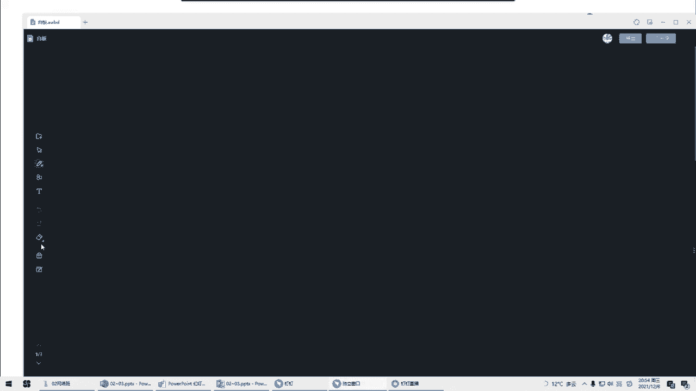

# 2022年PMP项目管理精讲课程-包含项目实战课程 - P3：第二、三章-项目运行环境、项目经理的角色 - 乐凯PMP - BV11L4y1E7TC

好大家晚上好啊，我们今天晚上呢继续往后讲，今天晚上的内容呢是讲两章内容，第二章和第三章，那么虽然是两章内容啊，但是实际上这里面的考点呢并不是太多啊，还是涉及到一些基本的一些理论。

包括对项目经理进行的一些介绍，那么大家听的时候呢，如果有目前仍然存在的考点，我会特地提醒大家的好吧，那么我们首先看一下第二章，第二章讲的是项目的运行环境。

那么项目的运行环境呢其实是说在我们做项目的时候啊，有两个主要的因素我们必须要考虑的，那么这两个因素呢分别叫事业环境因素和组织过程资产，那么大家对这两个概念，第一要能够有所了解。

第二在我们将来做项目的过程当中，一定要特别的注意这两个因素好吧，首先我们先看第一个叫事业环境因素，那么什么叫事业环境因素呢，首先我看到这个环境因素，我就有一种不好的感觉，为什么有一种不好的感觉呢。

大家觉得听到环境这个词，你有一种什么样的感慨，我们任何项目都会处在一个环境当中对吧，比如说在我们中国做项目肯定是所处在中国的这个环境里面，那么有很多东西就是你需要注意的。

比如说我们国家的有关的法律法规啊，包括我们国家的现在的一些实际的情况啊，对吧，说到环境我就想到一个东西，就是这个环境的好像我们没法改变对吧，就像很多同学说的不可控，那么我们有一句俗话是这么说的。

环境这个东西啊，我们一般不可控对吧，需要遵守，哪怕这个环境对我们是不利的诶，就像向明说的，改变环境不太现实，更多的可能我们要改变自己来适应这个环境对吧，所以说什么叫事业环境因素呢。

这种环境类的它的定义就是指我们项目团队注意是不能控制的，而且他们又会对我们的项目产生影响，限制或指令的各种条件，那么这些东西它会提高或者限制项目管理的灵活性，产生积极或消极的影响。

那么事业环境因素它分为两类，一个是内部的，一个是外部的好，那么我首先说一下啊，什么内部，什么外部，说白了就是我们所在的公司的内部和外部，我们公司内部有一些环境，那么公司外部也有一些环境，我们不可控的。

那么如果说的更准确一点，或者用一些专业的说法来描述呢，一般我们在p m p里面把公司这种东西叫执行组织，啊就是我们承担建设这个项目的组织执行组织对吧，内部的事业环境因素有哪些。

比如说我们公司内部有哪些是我们控制不了的呢，比如说我们一个组织，我们公司的文化，包括结构这些东西我们是控制不了的，我们公司或者说我们执行组织，我们的设施和资源的地理分布，这些基础设施我们是控制不了的。

再比如说我们公司所采用的信息技术软件好，这个呢在我们做项目的时候，或者说考试的时候用的比较多，什么叫信息技术软件呢，就是我们公司在公司层面上所采用的一些软件，比如说我们有的人的公司。

他用的财务系统是用的用有的系统对吧，唉有的公司呢用的是金蝶的财务系统，或者说我们有很多公司在做项目管理的时候，公司是有项目管理的平台的，那么有的公司用的是自己开发的一套项目管理平台。

像我以前的公司就是我们自己开发的，有的公司用的是肠道啊，有的公司用的是ga对吧，那么这些东西公司用什么软件来管理，你是没有办法改变的，没有办法控制的对吧，那么这种就是我们公司内部。

你必须要遵守的事业环境因素，包括我们公司内部有多少资源是可用的，我们很多项目经理在做项目的时候都在吐槽哎呀，一共公司就这么几个人对吧，人手不足啊，但是吐槽归吐槽，你能控制吗，你控制不了对吧。

在包括我们在做项目的时候，我们所选择的团队成员，也就是我们公司员工的这些能力，你说员工的能力我们能控制吗，我们也不可控对吧，这些都是一些事实情况，或者说客观的情况，我们控制不了。

所以说像这些东西就是我们执行组织内部，或者说我们公司内部的事业环境因素我们不可控，我们只能什么呢遵守唉，有什么用什么，只能这样，你不能说什么东西都觉得不合理，都要改变，很很很难啊。

我们项目经理很难去改变这些东西，那么在我们公司外部，也有一些事业环境因素是我们必须要遵守的，比如说最典型的有这么几个啊，市场条件，这个我们控制不了对吧，市场有的时候是一种强需求。

但有的时候呢就是一种弱需求，市场有好有坏对吧，再比如说法律法规的限制，我们是控制不了的，我们做项目要遵守相应的法律法规啊，有一些如果跟法律法规相违背的，或者说法律法规要求我们做的，我们就必须得做啊。

这个你是控制不了的，再比如说政府或者行业标准，这个我们也是必须要遵守的，你说你能控制得了吗，你控制不了对吧，好，再比如说财务要考虑的因素，我举几个简单的例子，大家应该就会明白。

比如我们做海外项目会涉及到关税，这个关税你能够控制吗，控制不了对吧，那么还有比如说突破膨胀的一些影响，比如说我们做海外项目，可能还涉及到一些汇率的问题，对吧这些汇率比如说人民币跟美金究竟是一比几的关系。

这个你也控制不了，那么像这些都是我们财务因素，我们控制不了的，再比如说物理环境要素最典型的是什么呢，比如说像天气啊这种这些我们都控制不了对吧，所以说像这些东西都是我们无法控制的，我们必须要遵守的。

在我们做项目的时候，我们都需要去关注它，都需要去关注它，那么刚刚在讲的时候，有同学问了这个问题，他说我觉得员工的能力啊，好像不应该叫事业环境因素，他说员工的能力不可控吗，他的能力不好。

我不可以去培训他吗，我不可以去提高他的能力吗，那么每一期都会有几个同学问类似的问题，在这里呢我再着重的强调一下，我们说事业环境因素最大的特点是不可控，大家一定要理解这个词的意思，什么叫不可控，不可控。

就是值，不是说你想怎么样就能怎么样呢对吧，那么再对比一个词叫影响，那么为什么要对比这个词呢，我问一下员工的能力会不会受我们项目的影响而发生改变，会吗，比如说我们通过项目员。

员工在我项目上学到一些新的东西，他的能力得到了提高，我的项目能够影响他的能力吗，可以的对吧，但是影响归影响，但是你不能说我可控，这是两码事，那么我举一个例子啊，我说一下这两者的区别在什么啊。

我往期也经常举这样的例子，你在马路上见到一个漂亮的小姑娘，你能控制她会爱上你吗，你控制不了，这个叫不可控，明白吗，但是你说我能够影响他，我能够恶心他吗，对吧，哎跑过去横为一手的说美女有没有男朋友啊。

你觉得我怎么样啊，我靠人家会觉得我靠有个神经病对吧，哎呀影响了我的心情，你没有控制他，但是你恶心了他，明白吧，那么我们并没有说我们不能影响员工的能力，我们只是强调我们不可控，你控制不了，明白吧。

那么这是第一个要注意的，那第二个要注意的就是有同学说什么叫商业数据库啊，好这一块呢我也解释一下啊，什么叫商业数据库，其实商业数据库呢这个呢在我们做题的时候，或者说平时接触的不是很多。

那么有的时候做项目我们会遇到，举一个简单的例子，在我们做项目做完了之后，我们一般会最终有项目的一些决算对吧，那么会结算一下，核算一下最终的这个项目是多少钱，比如说这里面有一些材料。

比如说我们做it项目好了，我们有综合布线，我们要用网线，那么这个时候你这个项目上一共用了多少箱网线，一箱网线多少钱，谁说了算，注意不是你说了算的，一般来说像我们做政府项目，它都有一个定额的数据。

就人家不接受你的真病，人家会定一个定额一箱，比如说安普的超六类线，他多少钱就是多少钱对吧，这也不是说哦，我给政府单位跟跟我的业主方去报，我说我一箱网线9万块钱不行的，人家说了900就是900。

就是说有一些东西它是定额的，该多少钱就是多少钱的，这个钱一般我们是没有办法去调整的好吧，所以这个呢稍微了解一下，那么不管怎么说，事业环境因素它最大的特点在于不可控，那么还有一个问题大家要注意一下。

我们在做项目的时候要考虑事业环境因素对吧，事业环境因素不但会带来一些不好的影响，但是也要注意，有的时候事业环境因素也会带来积极的影响，有人说诶，那事业环境因素什么情况下会带来积极的影响呢。

好我举一个例子，你会发现有的公司在做项目的时候，特别是做外地项目，它的出差补贴呀，比如说是210天，住宿标准是510个晚上，你说这个事业环境因素好不好，那么如果让我来说的话。

我就认为这个事业环境因素是比较好的，因为它的费用呢很可观对吧，而我们以前的公司他的出差补贴是多少呢，61天对吧，只有新疆西藏那种地区才是81天，住宿标准只有210个晚上对吧，那么这种呢就不太好。

再比如说有的公司除了交五险一金以外，还会帮大家交一个叫补充公积金对吧，比如说我们乐开，我们给员工除了交五险一金，还会交补充公积金，那么这个也是我们公司的规定，事业环境因素你必须要遵守的。

那么这个好不好呢，很显然很好对吧，再比如说有的公司在加班的时候，他是有加班费的，那么这个好不好呢，这个很显然也很好对吧，那么这些东西虽然是事业环境因素，但是会对我们产生什么产生积极的影响对吧。

所以说大家不要认为说我们不可控的就一定是不好的，也有可能是对我们有利的，是好的好吧，那么这是第一个我们要注意的，不可控的东西叫事业环境因素，那么还有一位呢也是我们要注意的叫组织过程，资产这个是什么意思。

就是我们的执行组织啊，说白了就是我们的公司在整个做项目的过程当中，所积累下来的一些资产，好我问一下大家啊，你们觉得在做项目的过程当中，我们的组织做了很多的项目，最容易积累下来的应该是什么东西啊。

唉我们公司做了很多项目，在做这个工作项目之后，最典型的能够积累下来的是什么，好对了，有人说得很正确，就是经验教训，这是一个最典型的组织过程资产对吧，那么大家可以想一想，那么这种所谓的组织过程资产。

它最大的特点或者说最大的好处是什么，最大的好处说白了就是有利于未来的项目，可以让将来的项目得到一些参考对吧，唉我们将来做新项目的时候，我们可以去参考以往的项目，特别是类似项目的一些经验教训。

避免一些坑对吧，就像李嘉玲说的，避一些雷，那么这些组织过程资产，我问一下，我们做新项目的时候必须要使用吗，其实不一定说到经验教训，大家就很清楚，经验教训不一定必须得要使用对吧，但是对你是有好处的。

你可以参考参考对吧，也就是说我们可以裁决，可以选择性的使用对吧，所以组织过程资产和事业环境因素最大的区别在于什么地方，事业环境因素是不可控，必须要遵守的，而组织过程资产呢是供你参考。

你可以裁决可以选择使用的，而且我们在做项目的时候，也要尽量的去多去积累这样的组织过程资产对吧，那么组织过程资产在书上介绍有两类，一类叫过程政策和程序类的，那么这一类呢往往不是我们项目团队能够积累的。

这一般是我们公司的一些成绩比较高的啊，我们后面会讲到一个叫po这样的一个部门对吧，来积累了，比如说我们的一些指南和标准的模板啊，一些流程程序啊对吧。

这些东西唉我们可以建立一些组织过程资产供项目去参考使用，那么我们项目能够积累的一般是这种叫组织知识库，比如说我们刚刚讲到的经验教训知识库，包括我们的项目的档案等等，这些都是我们可以项目中积累的好。

那么在这在这里问大家一个问题啊，我们在做项目的时候，也要去把我们项目中的一些经验教训啊，一些东西啊，要把它积累对吧，要把它放到组织过程资产里面，那么请问我们应该什么时候去更新。

或者说什么时候去积累这样的一个组织过程资产，在我们做项目的过程当中，什么时候要做这样一件事情，比如说总结经验教训，什么时候总结，那么这种问题大家一定要注意，很多人会容易说在项目结束的时候对吧。

而实际上我们应该说在全过程做项目的全过程，我们都要及时去总结经验教训，或者叫及时去更新组织过程资产好吧，全过程都要去这么处理啊，这个细节要稍微注意一下好吧。

那么事业环境因素跟组织过程资产它的区分还是很鲜明的，一个是必须要遵守的，不可控的，一个是我们可以裁剪，可以去参考的好吧，那么我要说一下啊，事业环境因素和组织过程资产，它其实是有一些交叉的。

有一些东西呢很多同学会发现问题，比如说供应商合格的供应商清单出现在组织过程资产里面，也会出现在事业环境因素里面对吧，那么有人就会问说哎，jim老师，我在看书的时候，在适应环境因素里面看到了供应商清单。

在组织过程资产里面也看到了合格的供应商清单，为什么，那么我先解释一下这个问题好吧，你要看他是怎么描述的，一般在我们题目中啊，他会做一些不同的描述，比如说我来考一考大家啊，如果我这么说。

在我们公司做项目选择供应商的时候，我们必须从公司的合格供应商清单里面进行选择，那么请问这一份公司的合格供应商清单应该算哪一种，是事业环境因素还是组织工人资产，我再重复一遍啊，在我们选择供应商的时候。

公司有这样一个规定，你必须从这里面进行选择对吧，你不能自己到外面瞎选的，那么这种是什么，这种你必须要遵守的，不可控的就叫事业环境因素对吧好，同样是供应商清单，我换一个说法。

我可以参考公司的合格的供应商清单，也可以项目经理根据他自己的一些资源自行去选择好，请问那么这个时候供应商清单我们把它看成什么，哎我们说你选购应商的时候，你可以参考注意这个这个词啊。

叫你可以参考组织的供应商清单对吧，也可以根据你自己的资源的情况，你做一些自己的选择，那么这个时候他就作为了组织过程资产，所以说你要区分这两个东西呢，关键就看究竟它是不是不可控的，必须要遵守的。

如果是它就是事业环境因素，如果只是可以给你参考参考的，这个就是组织过程资产好吧，关键要看他体现了哪一种含义，那么如果说在考试的时候呢，它一般来说不会考这种很纠结的东西，他会考一些很明确的。

比如说法律法规啊，这就是典型的事业环境因素，比如说模板啊，经验教训啊，这就是很典型的组织过程，资产好吧好，那么这是第一个我们要了解的两个因素，这是第二章的第一个点，大家要稍微了解一下。

虽然不会特地的考到，但是后面我们会遇到，好吧好，那么在我们的事业环境因素里面，有一个东西叫组织结构，这是我们第二章讲的重点的内容，那么也是现在考试有可能会考到的内容，所以这一块呢大家要听一下了。

我们项目经理做项目，我们要注意我们企业的，或者说我们执行组织的，它的组织结构是一种什么结构，那么这种组织结构大致呢或者说主要的分为三种，一个叫职能型，一个叫项目型，一个叫矩阵型。

那么我们分别看一下这三种有什么特点特点，大家理解了就可以了，好吧好，我们首先看职能型组织结构，也叫集中式组织结构，那么这种组织结构它的特点是什么，你会发现它是以职能部门来划分的，a不能b不能c不能。

那么每一个部门都有一个经理，我们叫职能部门的经理，简称教职能经理对吧，哎比如说技术部有技术部的经理对吧，销售部有销售部的经理，按部门来划分，每个部门都有一个职能部门的经理叫职能经理。

那么如果说在这样一种组织结构下面做项目，它的特点是什么，我们来看一下好吧，假如说我有一个项目，我需要各个部门各出一个人来做项目，那么在做项目的时候呢，没有明确的说有一个项目经理的职位。

那么这个时候我们往往会要让一个人兼职做项目经理，比如说我让职员a哎呀，这个项目你帮我定一定吧，对吧好，接下来会出现什么情况，假如说a有一个事情需要b完成，那么大家想一想，a让b去做，b会不会做。

哎我们按部门来划分的啊，我们有技术部，有业务部啊，有技术部，有销售部，有法务部对吧，每个部门都要出一个人，接下来呢好像诶让一个人来做一个兼职的项目经理了，那么现在我a有一个事情让b来做，b会不会做。

很明显大概率不会做，大家想一想，为什么大概率不会做，因为b心里呢他往往会有这样一个想法，你算老几啊，你凭什么给我安排任务啊对吧，我的绩效是谁说了算，我的绩效是我老大考核的。

我做你的任务对我的绩效有什么关系呢，对吧，哎就像阮凯说的，我手上的活多着呢，所以a去找b啊，b往往会说哎呀，我现在有点忙好，那么如果a找b这条路行不通，a呢，感觉问题有点严重，说这样你不听我的。

我找我到老大来让你做，让职能经理a去找b行不行，只能经理跑过去找b了，这个b心理想靠你，虽然职位比我高，但问题是老子不归你管啊，我也不是你的人啊，你凭什么你手伸的也太长了吧对吧，你指挥你部门的人就行了。

你看怎么手还伸到我们部门来了，所以这个时候b会跟a怎么说呢，哎呀领导不好意思，我现在手上的活儿有点多对吧，往往后面会补充这么一句话，什么话，要不你跟我的老大去商量一下吧，是不是往往很多人都会这么说。

哎呀我现在手上还有很多活，要么这个事情你跟我到老大去说一下，其实意思就是说我做不做，关键还要谁说了算，要我的老大说了算，所以最终在这种部门里面做项目啊，特别是遇到部门之间协调的时候，他往往是这样的。

a有事情要b做，他不会直接去找b对吧，他一般会这样先找他的老大a好，老大a跟另外一个部门的老大老大b去协调，说好了之后，然后老大b再把任务下放给他的职员，b用这样一种方式去做的，是不是这样的。

很多公司都是这样的吧，这就是职能部门的一个典型的特点，那么它的特点在什么，你会发现跨部门的沟通或者叫横向的沟通，它是非常差的对吧，部门跟部门之间的协调其实是很差的。

所以说职能型组织结构它的最大的缺点在于什么地方，就在于横向的沟通很薄弱，跨部门的协调很有问题，那么这种组织结构有没有什么优点呢，有这样一个优点吗，也有的，它的优点在于什么，首先大家想一想。

假如这是一个叫技术部，那么这里面的职员都是做什么工作的呀，都是做技术工作的啊，如果是销售部，那么这里面都是做销售的，那么同一种工种在一起，他们可以干什么啊，比如说大家都是销售在一起。

或者说大家都是技术在一起有什么好处，大家可以相互学习对吧，因为大家都是做同一个职业的，同一个职能部门的，相互诶，大家可以去聊一聊沟通沟通对吧，另外对了，有人说到了归属感很强，有很强的归属感。

哎我就是这个部门的人对吧好，另外职业路径也很清晰，从这张图大家能够很显然能看到，请问职员a他的目标是什么，他的职业路径或者说最终的一个目标，它应该变成什么，他应该在这个部门里面逐渐逐渐的往上爬。

最终变成什么呢，比如说我先做一个普通的员工，然后再往上做什么，再往上一直到这个部门的部门经理，所以它也有它的好处好吧，那么很显然在这样一种组织结构里面，对我们做项目来说有利吗，我感觉很不利。

为什么很不利啊，它的问题有两个，第一个就是我们刚刚说的横向联系很薄弱，第二个即便在这里面有一个项目经理，比如说a是项目经理，他最多只是一个兼职的项目经理，那么兼职的项目经理我们把它叫什么呢。

我们一般把它叫联络圆，说的好听叫联络员，说的不好听就叫传话筒对吧，你没有什么权利的，所以说这种组织结构啊，对于项目经理来说很不利，他的权利呢很小或者没有好，这个大家可以在旁边写一下职能型的组织结构。

项目经理的权力很小或者没有，这就是我们做项目遇到的一个最大的困难，大家想一想，做项目，我们项目经理希望权力是大好还是小好，这不用说，权力当然是越大越好，最好老子一个人说了算对吧，大家都听我的。

这是最好的，所以说这种组织结构啊，项目经理权力很小，对于做项目呢不是很有利，那么从另外一个极端来说，有没有哪一种组织结构权力很大呢，也有的，我们看这种叫项目型，那么项目型组织结构它有一个什么特点。

你会发现总经理下面直接管的是什么呢，是项目经理，然后项目经理就带着他自己的小弟一起去干活去了，那么这种组织结构它就没执政经历什么事儿啊，项目经理就直接带人啊，那么有很多公司就是这样的。

比如说这个叫项目一部，那么项目一部有项目一部的项目经理，a项目二部有项目经理，b项目三部有项目经理c对吧，他手下直接有人，而且这些人就归这个项目经理管，所有人都听他的话，那么这种组织结构就是项目型。

那么项目型的这种组织结构，它的好处是什么，不用说了，项目经理他一定是个全职的项目经理，他专门有项目经理这样一个岗位的对吧，而且项目经理的权力大小是什么呢，好这个旁边记一下，是大甚至全部。

那么在这里呢有一个细节我要跟大家说一下，有人说不对呀，在这个图里面，比如说在做项目的时候，a b c3 个人不是百分之百都听项目经理a的吗，那么他的权利就应该是全部啊。

为什么有这样一个略微保守一点的说法，叫大甚至全部呢，好那么在这里我解释一下啊，首先大家理解一下在项目型组织结构里面有没有职能部门，哎这个图里面是没有画，但是大家想一想，在这样一种企业里面。

用项目型的组织结构，有没有职能部门，有吗，一定有的，比如说有什么职能部门，有没有财务部啊，要不要人给你们发工资有吧，比如说其他的，像我们大公司经常会遇到法律问题，有没有法务部啊，把你们审核痛啊之类的。

有吧都有的呀，哎包括有人说的什么人事部，行政部啊，对吧等等，那么为什么在这张图里面没有把它画出来呢，因为虽然有这些部门在，但是这些部门对项目有没有什么影响力啊，对这个项目其实基本上没有太大的影响力啊。

也就是说跟项目呢其实没有什么太大的一个关系对吧，可能会有略微有一些小影响，但是几乎是没有什么影响，所以并不是说项目型组织结构里面就完全没有职能部门对吧，我们只是说这些部门很少参与项目。

所以项目经理呢他的权利是大，甚至到全部，那么项目经理在用这种组织结构去做项目的时候，他的权力就很大，对项目来说，对项目经理来说是有好处的，但是大家要想一想这个东西，这种组织结构有没有什么问题啊。

如果你要保证所有的人都归这个项目经理管，那么有一个要求什么要求就是这个项目里面所有的角色啊，都必须要有吧，所有的角色都必须要有，那么这个项目也是麻雀再小，五脏也要全吧，所有的角色都要有。

那么这个时候就会出现第一个问题，资源会出现重复配置好，我举一个很简单的例子啊，这个以前我们有一些学员不理解什么叫资源重复配置，我呢就真实地经历过这样一件事情，比如说有1年我在外地做项目的时候啊，在成都。

这座美丽的城市，但是我们公司有两个项目组，在成都做项目对在外地的，比如说a和b都在成都的，当时就发生了一件什么事情呢，因为我们在项目上呢有很多的文档是需要打印的对吧，那么如果在我们总公司呢。

反正公司有文艺式的，你去文印室打印就行了，有很多打印机，那么现在在成都都在外地，那怎么办呢，没办法，那么a项目组的项目经理呢，他就买了一台打印机，专门用来给他的项目上打印文档对吧，因为你在外地怎么办呢。

你只能自己买一台打印机了，好这个时候b项目的项目经理也有东西要打印啊，他到a项目上来打印文档行不行，你们觉得可以吗，哎有人说打印这个东西有啥关系啊，你打印嘛就打印一下吧，兄弟们。

你们不知道项目一人搜的时候要打多少文档啊，我们的打印费都要几千块钱啊，我靠要打一堆呀对吧，那么这个时候你说你比格三差五的就来我项目上，用我的打印机，用我的打印机去打印你项目上的一些东西，我靠。

你觉得行不行的，成本都是我的对吧，哎你爽了，你打印机也不要买，然后到我项目上来打印，打印机是我的墨盒，是我的溪谷是我的，他妈是a4 纸还是我的，所以打了几次之后，a项目会怎么说，a项目没有明说对吧。

他说有一次b来打一的时候，他说打不了，为什么打不了呢，打印机生病了，什么意思就不给你打了呗，好那么这个时候必想怎么办呢，没办法，我靠那没办法呀，老子也只能买一台打印机啊，对吧好，c项目也遇到这个情况。

他也只能买一台打印机啊，对吧好到最后了，每个项目都给我买了一台打印机，资源产生了重复配置，所以这是项目型的一个最大的问题，那么打印机这种遇到这样的问题，人也会有这样的问题，人也会有这样的问题对吧。

每个项目上都要安排这样的一个角色，那么这是项目型组织的第一个问题，资源会出现重复的配置，因为它必须要百分之百都归项目经理管啊对好，另外还有一个问题，其实刚刚有很多同学已经提到了。

与子文说这个怎么叫重复配置，你想一想，本来像打印机这个东西啊，应该是有一个公用的资源，是谁要用就来用一下，不用了就不用对吧，但是由于项目型的特点，资源要百分之百归项目经理管。

那么你每个项目是不是都得配一台打印机啊，那么到最后你三个项目不是有三台打印机了吗，是不是，这不就是重复配置了吗，那么另外还有一个问题，很多同学也发现了，他说我们在上一节课讲项目的时候。

说到项目有一个特点，什么特点，项目是临时的，大家还记得吧，那么项目是临时的，这个问题就来了，那么项目是临时的，万一这个项目做完了怎么办啊，那么我们项目做完了，我们后面下一个星期会讲，我们要收尾。

收尾的时候，我们要解散这个团队，那么你说解散掉这些人去哪儿啊，有人说，那么我去别的项目上行不行，这个好像不太行，为什么不太行呢，别的项目上不一定有位置给你呆呀对吧，因为别的项目它已经真正转起来了啊。

每个萝卜都有一个坑，在那一个萝卜一个坑对吧，也没你的位置，那么这个时候你去哪儿呢，你没地方好去了呀对吧，甚至我还看到刚刚有同学说到的，有的项目非常的坑，他坑到什么地步啊。

比如说我经常看到有一些公司在某个地方有一个大项目，可能要干个2年，然后他们的操作是什么，在当地招人干2年，干好了之后怎么办呢，对了很恶心的啊，做完之后直接裁员，全部都裁掉，就留几个维护人员就可以了对吧。

所以像这种就很不好，让大家有一种无家可归的感觉，就越是临近项目结束，越容易大家心里有这样一种担忧对吧，哎我做完了之后，接下来我去哪，我会不会就被这样干掉是吧，所以这种项目型的组织结构。

虽然项目经理权力很大，但也有他的问题，第一资源重复配置，第二团队成员往往会有一种无家可归的感觉，那么有没有哪一种组织结构能够解决职能型和项目型，它们各自的问题有吗，有的有一种组织结构是介于这两者之间的。

叫矩阵型组织结构，它分为弱举证，平衡举证和强举证，那么我说一下矩阵型组织结构，它的特点是什么啊，我们就拿中间这个来看啊，以中间这个为例啊，首先他是这样的，做项目的时候呢，还是从各个部门去抽人。

他还是有职能部门这样一个概念的对吧，那么每一个部门出了人之后，接下来他会有一个项目经理，第二部经理，这个时候他的权利呢会给予一些权利的，那么有了权利，他可以干什么。

他可以直接去要求他的船团队成员去做一些事情，那么用这种方法来解决我们刚刚的职能型横向沟通的问题，对吧，哎我让你有一些权利，你可以去领导他们，去指挥他们，去安排他们的一些工作对吧。

那么另外这个项目由于是临时的好项目，如果做完了这些人怎么办，那么很简单，比如说我做项目的时候，从b部门c部门各掉了一个人，你们两个听我的，我们一起做项目，项目做完了之后，你从哪个部门来的，还怎么样。

还回到哪个部门去不就好了吗，哎各回各家，各找各妈，你b部门来了，你还回到b部门，c部门来了，你还回到c部门，那么这样也解决了无家可归的问题，那么两个问题都解决了，但问题是这种组织结构也不是完美。

这个世界上并没有完美的工作，完美的结构，他的问题在什么地方好，我们看一下，假如用这种方法来做项目职员c他要不要听职能经理c的，要吗肯定要啊，我靠职能经理c是我的老大，我在这个部门，我老大的话我能不听吗。

以后还想不想混了，要听的，那么但是同时我又参与了这个项目职员c要不要听项目经理的，也要的呀，对吧，哎比如说公司已经安排了我们成为一个项目组，他是项目经理，公司要我配合他的好。

那么这个时候假如出现了一个情况，有一天项目经理给c发了一条微信，明天上午九点我们项目上要开会，你要准时参加对吧，刚收到这个消息没多久，他的老大c又给他发了一条消息，明天上午也是九点，我们有一个部门会议。

请你从项目现场回来参加，我靠这个时候职员c怎么办，我去哪儿啊，他就很纠结对吧，唉说到这个我就想到我们面授班有一个小字和武夷所，他说这有啥好纠结的，唉呀我就喜欢这种情况对吧，我只能经理司机说。

老大不好意思，明天我要到项目上开会，我项目经理说唉不好意思，明天老大叫我去开个会，我他妈两个地方都不去，我在家里摸鱼对吧，可以吗，诶感觉这个做法好像很奇葩对吧，要注意啊，这个呢开个玩笑是可以的。

你真正这样去操作行不行的，你一次两次也许可以，时间久了之后，万一被发现了对吧，你就扯淡了，所以这不是一个很好的解决方法，那么比较好的解决方法是什么，其实比较好的解决方法就在于究竟我应该倾向于谁。

或者说究竟谁的权利呢大一些对吧，所以有的公司呢它就比较聪明，他呢会明确的定义好项目经理跟职能经理究竟谁的职级要高一些，比如说我来举个例子啊，有的公司是这样的。

他说啊我职能经理呢实际上就是一个资源库或者叫资源池，平时呢这些人呢在我这边呢，我就给他做一些简单的培训对吧啊，包括就对他做一些指导，那那我做这些事情的目的是为了什么，就是为了配合我们公司的项目对吧。

我把你们这些人都培训好了，项目经理来什么，来我们这边来挑人，他来抽壮丁对吧，把人挑走，我存在的目的就是为了配合我们的项目，那那么这个时候项目经理的职级就比职能经理的职级要大一些，也就是说他在这种情况下。

项目经理的话语权就要强一些，那么这种我们把它叫什么呢，叫强举证，项目经理的权利要比职能经理略大一些啊，那么在这种情况下，如果有会议怎么办呢，好我们就跑到项目经理那边去对吧，那么有的时候是这样的。

他说我们这个公司呢是以职能为主的，比如说我们呢举一个很简单的例子啊，我们有的公司是做电商的，做电商的，那么电商呢我们运营部门有很多的事情要做啊，要找供应商要选择删评对吧，然后要发订单要怎么怎么样。

以运营为主的，但是其中也会有一些小项目对吧，那么这个时候你会发现可可能职能经理的权利就比项目经理要大一些，甚至在这边也会出现兼职的项目经理叫协调员算，虽然有项目经理允许你去跨部门沟通。

但是你最多的也是帮我去协调协调一些事情，那在这种情况下，职能禁止的权力仍然很大，项目经理的权利呢最多只要小，那么这种叫什么呢，叫弱举证，那么这个时候可能职能型的话语权，职能经理的话语权就强一些对吧。

所以说公司可以通过来定义项目经理的职级和，职能经理的职级究竟谁高，让我们的团队成员知道我们应该倾向于哪一方对吧，但是还有一种很恶心的叫平衡举证，也叫均衡举证，那么这个就他娘的很恶心了。

就是项目经理跟职能经理啊，权力差不多，基本上相同，可能稍微比他略小一点，一般我们叫小道中，但是基本上差不多，那么这个时候怎么办呢，我听哪个的，那么遇到这种情况就很恶心了，那么往往出现这种情况。

需要项目经理跟职能经理，这双方进行什么要进行协商，那么在我们后面讲课的时候，会发现项目经理跟职能经理之间经常要协商，经常要干什么呢，要谈判好吧，但是我说一下考试不考的内容啊，我说一句考试不考的内容啊。

如果我们很不幸在这种组织结构里面工作，我我是项目经理，只能尽力给我的权利，差不多，大公司也没有明确说随着职级高都差不多，这个时候我如果希望团队对我更加支持一些，你大家觉得我应该做什么事情，思考一下啊。

假如说我在这种组织结构里面，我跟职能经理呢差不多，权力都差不多，我那么我当然希望团队以我的项目为主了，那么我有什么方法能够让团队成员更加倾向于我项目经理呢，有人说到了一点，张萌说到了。

我们要跟大家搞好关系对吧，哎我人缘好，可以吧，可以的，我跟底下的兄弟关系更好一些，人家更愿意向我倾斜，当然可以，还有呢啊有人说跟领导搞好关系，诶，这也是一种很猥琐的做法，哎有人说。

虽然我们权力大不多差不多，但是大领导更加支持我啊对吧，那么这也可以啊，如果说的直白一点，就是汇报上来说，我可能跟领导经常汇报，跟他关系比较近，这也是一种说法，还有呢好有人说到了，我让团队成员集中办公。

那么我介绍一下啊，我也用过这种方法的，一般在这种情况下，我会把b和c这两个人直接带走，在什么地方呢，在我的项目现场，在甲方那边，我会找甲方要一间小办公室啊，我把b和c直接带到这边来，在现场干什么呢。

我们叫驻场办公，我跟公司我也说的很清楚，现在工期比较紧张，甲方的领导也比较重视这个项目对吧，所以我需要驻场办公一段时间，那么我为什么经常用这种做法，一旦驻场办公了之后。

接下来一开始可能只能经理c还会找职员c做一些事情，但是做了之后吧，他发现这个很不爽，你问诶你人去哪了啊，我在项目上呢对吧，哎呦那算了算了，我换一个人吧，久而久之，职能经理就不找c做事情了。

好接下来有人说，那么b和c凭什么跟你来驻场办公呢，诶我有我的方法，你在公司九点钟上班到我的项目上来，如果项目不紧张的时候，允许你十点钟到现场对吧，我尽量给予你一些宽松的环境，你该干的时候干。

该休息的时候休息好，那么有人说，那么这样久而久之，老大都把我遗忘了，以后升职加薪，还有我的事情吗，你放心对吧，你的后路我也帮你安排好了，什么后路，等这个项目做完了之后，你不是要回到你的原部门吗。

好这个时候就开始我的表演了对吧，我一般会做什么事情，我一般会写一封感谢信，这封感谢信的内容是这样的，我发送给职能经理c，另外抄送给总经理职员c，感谢信的内容是这么说的，感谢某某某经理，为什么要感谢你呢。

因为在我的项目上，你安排了谁谁谁到我的项目上来，在这个项目上他承担了什么什么方面的工作，他他做出了哪些成绩对吧，对我的项目带来了多大多大的好处啊，我对贵部门能够给我项目提供这么一个优秀的团队成员。

我我非常的感谢，对我希望后续我的项目中还有这样的机会，能够跟各部门的团队成员一起来合作，一定要注意啊，这封信要抄送给总经理跟这个职员c，你把人家后路也把它安排好，那么这样做你像不像你做的时候。

你也爽一点对吧，相当于资源都归你管，那么做完了之后，别人也知道哎呦，跟着这个项目经理干有前途是吧，所以说大家要注意遇到这种特殊的情况啊，大家一定要发挥自己的影响力，去尽量的去影响一些人，好吧好。

那这是矩阵型的特点，那么刚刚在讲的时候，有几个同学都在问一个问题，若举证跟职能型有什么区别，那么我说一下啊，它最大的区别就在于一个地方职能型最终实际上是老大之间在协调啊，而弱举证它允许直接跨部门协调。

那么这边的这个人为什么允许呢，你会发现他的权利虽然小，但是是有一些的对吧，我们一般把它叫协调员，协调员啊，所以他可以这么做，而职能型呢它不能直接去推的，因为它本身就只是一个联络员而已啊。

这一点有一点细微的区别，稍微注意一下好，那么这是常见的，或者说比较典型的三种组织结构，那么现在考试考什么啊，我说一下，现在考试他只考权力大小，那么权力大小怎么去记，给大家一个方法。

这张图是我补充的啊，那么这张图怎么去画。

我给大家演示一下，非常简单非常简单好吧好，权力大小，我们只要记一个叫平衡型，或者叫均衡型，只要记住均衡型的权力大小是小中啊，就是项目竞争的权利是小道中好，接下来把这个记住了，好把中扔过来啊。

那么它就是中到大，好接下来项目型它是一个什么权力大小呢，把大扔过来，那么它就是大全部，炸到全部啊，好接下来往左去推举证，很显然就比平衡性要小一些了，那怎么办，好，把小扔过来，获取证的权力大小就是小。

还有最小的叫职能型，你说弱矩阵都是小了，它是什么，很小甚至就没有，所以说你把中间的这个记住，你左边和右边也就同样记住了啊，那么最终就形成了这样一种情况啊，这个权力大小希望大家一定要注意的。

在考试的时候偶尔还是会考一下的好吧，另外大家在这两天做题的时候，可能会遇到一个说法叫紧密举证紧逆矩阵，它不是一种组织结构，好吧，没有讲过的，先不要考虑，我们后面呢会讲我们这个什么叫紧密矩阵。

那么除了这几种组织结构以外呢，其实还有一些其他的组织结构不太常见啊，也会有的，比如说有一种叫有激情或简单型，这个有点像创业公司，那么这种特点是什么呢，管理层次很少啊，工作划分很少对吧。

一般都是大家肩并肩工作，大家都是员工，你就是说一个六个人的创业公司，你说我一定要安排一个总经理，两个总监三，这个主管有必要吗，我他妈一共就六个人，你何必这样去分呢，没有必要对吧。

所以这种叫有机型或简单型，那么还有一种叫多部门组织啊，这个呢其实也把也蛮多的，比如说让我之前的公司在上海也，上海的总公司上市公司嘛，那么在其他城市呢，比如说我们会分为华南分公司，华南地区有分公司。

新占地区，成都有公司，那么西安还有其他的公司对吧，那么在其他地区都有一些分公司，那么一般分公司呢它是自己办自制的，他最多只是玩是我们的财务指标就可以了，那么这种叫多部门组织，还有一种叫虚拟性组织。

虚拟性组织呢在这个我们实际的做项目的时候呢，很少遇到啊，在一些美国的大片里面，经常会遇到什么叫虚拟性组织呢，就大家都不在同一家公司认证呢，大家呢这个本来就没什么交集好。

接下来有一个人说我想去做一件什么事情好，我就到外面去找，我找一个什么爆破方面的专家，再找一个开车开得特别好的，在找一个电脑高手对吧，哎这几个人都找好了之后，我们一起去干一件事情。

但大家比较临时的凑起来干一些事情，干完了之后，大家谁也不认识谁，远走高飞对吧，像这种就是虚拟性组织，临时把人召集起来，然后做完了之后马上就解散了一种临时组织，那么这几种呢大家稍微了解一下就可以了。

好那么第二章的第二个重点就是这几种组织结构，那么我希望大家能能够理解他们的优点和缺点在什么地方，另外主要的这几种组织结构的权力大小要把它记住，好吧好，接下来第二章还有一个需要讲的就是关于这个东西。

叫pm项目管理办公室，这也是我们项目经理会经常打交道的一个部门，我问一下在座的各位同学，我们公司里面有没有这样一个部门，叫project management office，项目管理办公室，如果有的话。

他们是干什么的，你们喜欢这些人吗，还是有部分同学说我们公司有这样的一个部门的对吧，有人说到了这些人是干什么的呢，是做一些标准化的，张晓娜说他们是做一些标准化的东西的，你们喜欢他吗。

有人说做质量体系的对吧啊，定标准的，张思雨就比较过分了，他说我不喜欢这些人，我私下都喜欢叫他是沙僧的弟弟对吧，唉你说的那个我就不说了，在直播的时候不敢说那个词对吧，改感觉有点像沙僧的弟弟啊。

不太喜欢这些人是吧，为什么感觉这些人老是在找我们，都找我的不痛快，那么我们看一下pmbok里面是怎么说的，他说我们有一个部门呢，其实它是一个永久的部门，项目管理办公室，那么它是干什么呢。

它是对我们的管理过程做一些标准化的东西，而比如说促进一些资源方法论工具和技术的共享对吧，包括制定，刚刚有人说他制定一些体系性的东西，流程性的东西啊，好那么这个部门在我们项目管理里面叫po项目管理办公室。

那么偏偏偏里面他说呢这个po啊实际上呢有三种程度的，分为支持型，指令型和控制型和指令型，我先跟大家说一下这三种对项目的控制程度，按照顺序来说是支持型，最小指令型，最大空控制型在中间啊。

支持型控制型指令型记的时候很好记，两个z一头一尾k在中间，他们是做什么的呢，大家还记得组织过程资产里面有一类组织过程资产叫什么呢，要做一些模板，要制定一些流程啊，要建立一些项目管理的规范对吧。

那么他们主要是做这些工作的啊，比如说一些流程定好加你在项目上做这件事情，要第一步，第二步，第三步做什么对吧，包括帮你们做一些模板等等，那么在我们pp里面这三种类型它的区别在于什么，实行它就是一个资源库。

你的项目呢控制程度很低，没有什么控制的，那么这种一般会怎么说呢，一般会说诶很多项目经理说我在写需求文档的时候，我没有模板，我不知道怎么写，那么这个时候去找他，他就会给你一个模板，让你看一看来帮助你。

但是呢他只是对你提供帮助，它给你了，你愿意用就用，不愿意用就算了，这种叫支持型，它就是一个资源库，我第二种叫控制型，控制型有什么特点，它不但支持你给你模板，而且还要求你去干什么呢，去服从。

就是说我以前公司的pm就是这种控制型，为什么叫控制型呢，你这也是很多项目经理不喜欢他们的原因啊，我曾经有这样一个要求啊，大家听一听，比如说我要写一份文档的时候，他会对其中的一些东西啊做一些约束。

一个文档页眉要怎么写，页脚要写什么，然后第标题几号字，正文几号字，行间距是多少，它都是有规矩的，包通过这个文档写好了之后，最终这个文档怎么去命名的，我记得以前我写一份需求文档。

除了前面有一串英文的代码之外，后面还要写几年6月几号，然后由谁写的，要有三个字母，三个字母啊，比如说刘志刚，那么就刘，啧那么如果不信你的名字是两个字，比如说叫陶鹏，那怎么办呢，好那么最后下划线跟陶。

两个词，那怎么办呢，如果你是男的，就加一个y，如果你是女的，就加一个x，一定要补足补足三位的对吧，就这种很麻烦，也是很多项目经理不喜欢的一个原因对吧，那么控制型的特点是什么，可以给你一些东西让你用。

但是还有一些规矩呢让你去遵守呢，是服从的好，接下来最后一个是指令型，指令型是什么意思呢，对项目的控制程度是最高的，他会深入到项目的细节，收入到项目的细节，项目上的每一件事情他都要管，型，控制型。

指令型这三个里面控制型跟指令型，很多人呢容易分不清楚，那么我说一下啊，方法支持型和控制型两个人一定是一头一尾，控制型是在中间的，如果要说控制型跟指令型有什么区别，我举一个例子呢，大家可能会稍微懂一些啊。

举一个例子，假如说我们开车到了外地，好呢，手机也没有信号，导航也用不了啊，这个时候我就到马路边上找一个人去问路，他会告诉我往什么方向开，那这个人是哪一种类型的，我们认为他就是支持型的，我问他。

他就帮助我，他对我没有任何要求对吧，你听他的也好，不听他的也好，都可以，一种就是支持性对你的控制程度是很低的啊，那什么叫控制型呢，好控制型有点像谁呢，有点像交警，你说你不知道路了，你问交警。

交警会帮助你吗，交警也会帮助你的，另外交警还会干什么，交警还会对你有一些要求啊，会要求你遵守道路交通安全法对吧，按假如说你什么闯红灯超速或怎么样，他会告诉你了，那么这种规范性的东西。

你要遵守的细节他不管啊，规范他是要管的啊，那么什么叫指令型，为什么说指令型对控制程度很高呢，就是类型有点像谁啊，有点像坐在你副驾驶的那个鸟人，比如说我的老婆，我在我家，我有一个原则，我跟我老婆出去。

我绝对不开车，我各位老婆出去一定是我老婆开车，为，为什么呢，因为如果我开车，我老婆坐在副驾驶，他的事儿特别多，什么都要管，叔叔刹车踩慢了，他要管踩刹车呀，距离差不多了，怎么这么慢对吧。

有的时候路上有个坑，其这路上那个坑也不大对吧，你说我压过去吗，就压过去了，这个时候它就会指指点点，那个坑那么大，你看不见啊，你不会绕一下呀，正常开也要管，我压个坑也要管，我什么时候踩刹车也要管。

就项目上的任何一些细节他都要管，那么这种就是指令型，它已经深入到你项目的细节了，这种控制程度特别高，在我们做项目上一样的，就等同于扣政治行，你只要遵守我们公司的一些规范中，守规范的流程就可以了。

他就管到这个程度对吧，而指令型呢，你项目上的任何事情，哪怕是我们后面讲的任何一个变更，他都要参与一下，都要指指点点，其它的控制程度是最高的好，那么这是这三种类型，大家稍微了解一下。

当然pm的主要的作用还是比较简单的，那么他是做一些最佳实践和标准的，它是提供政策程序和模板的，给项目经理提供一些指导和培训，包括做跨项目的一些协调对吧，包括做项目的审计，这都是pm会做的一些事情。

稍微了解一下就可以了好吧，那么第二章主要呢实际上是这么两个地方，一个是环境因素和组织过程资产，还有一个就是组织结构，tmo呢其实在考试中出现的很少，大家稍微了解一下就可以了。

好来我们看一下第三章项目经理的角色，我首先说一下啊，一章在考试中几乎没有考点，ipp里面的没有这个章节，第六版呢加了这个章节叫项目经理的角色，那么我们看一下pvp里面是怎么说项目经理的。

他说项目经理是一个什么人，项目经理是由执行组织委派领导团队实现目标的个人咳，说这句话有没有什么感觉，我感觉好像很牛逼对吧，因为项目经理是由执行组织委派啊，领导团队实现目标的人啊，我要跟大家说一下啊。

这句话你仔细体会一下啊，不执行组织委派领导团队实现目标的人，什么意思，咳咳咳咳咳咳咳，定目标，实现目标，两个是同一个概念吗，感觉这不是同一个概念对吧，一般来说定目标的人是谁呢，好地目标的是老大。

实现目标的人是谁，现目标的在我们香港的黑社会电影里面叫什么呢，叫马仔，就说我们一定要认清自己的情况，我们并不是一个权力很大的人，并不是一个大boss，并不是一个老板对吧，不是老大，最多只是一个马仔好。

另外还有一个问题，什么问题，一般默认我们所处的组织结构是矩阵型组织结构啊，大家注意看矩阵型组织结构，项目经理手上有没有小弟，没发现项目经理他们手上没有小弟啊，项目经理的小弟是哪来的。

是找别的职能部门怎么样，别的部门借来的，这个马仔呢还不是一般的马仔，这他马仔手下还没有小弟，这个小弟还是找人借的，找人借的，这里面就有点问题了对吧，小弟是不是对你很忠心，是不是都听你的，这就是这两说了。

所以说在这种情况下对吧，有这样一个马仔代理你所谓的团队来实现目标，有没有难度，有难度的，所以项目经理这个活儿不好干的对吧，需要谁需要我们这种受过专业培训的人来做项目经理对吧，要认识到它是有难度的啊。

项目经理跟职能经理是不一样的，职能经理由于职能部门是永久的，所以说我只能尽力，往往是永久的项目经理，还有一个问题是什么呢，就在于像经理，他虽说是一个经理啊，但是项目是临时的呀。

啊比如说有没有听说过这样一种说法啊，做项目的时候哎比如说罗政同学对吧，做项目的时候，罗同学在客户那边，我们往往称它叫什么嗯，罗总有个事情你能不能帮我协调一下，哎，罗总有个事情你能不能帮我申请一下对吧。

做完了罗同学回到公司，他娘的变成了什么小罗，小罗那个项目后面有什么事儿吧，你是吧对吧，哎小罗这里有一个活儿，你看一下你是不是接一下，因为项目是临时的。

往往项目经理有的公司有这样一个最有这样一个职位叫项目经理啊，但是呢这个实际他有项目的时候可能有一些权利，没有项目的时候呢，这个就比较难说，所以说大家一定要认识到，其实这个职位需要我们要做出一些努力的。

不是那么好做的好吧，那么偏僻里面他说项目这里无需承担每个具体的角色，但是呢我们需要具备这样的一些东西对吧，那么我在第一节课也跟大家说过，其实要么经理他应该是一个什么呢，整合者或者是一个协调者。

他不要具体的做具体的工作，但是一定要有协调的这样一个作用，那么另外在pp里面还说到这个影响力范围要稍微看一看，说我们项目经理在这些方面要影响这些人，比如说在项目层面上要影响团队。

要充当团队和发起人之间的沟通者，好它其人其实就是我们公司的某一个管理层啊，但我们要跟其他项目经理互动，要关注行业的趋势，要传递知识啊，包括我们要宣传这样一种项目管理方法，这些呢再稍微看一看啊。

我觉得说的呢都没有什么意义，现在我们pmi项目管理协会对项目经理呢是有这样一个要求，这个要求大家都可以听一听，要求我们项目经理具备这三个能力，一个叫技术，项目管理技能啊，什么叫技术，项目管理技能。

就是我们要运用项目管理的知识来让项目达到预期的效果，比如说我们要用什么资质呢，我们要会收集需求，我们要会制定进度计划啊，我们要会控成本，我们要会管质量，我们要会带团队，我们要会管风险等等，这一部分技能。

其实我个人觉得很简单，为什么很简单，这就是大家来参加培训学习，pp能够得到的一些知识，这些我们都会讲怎么去做，是有两个技能不是那么容易的啊，战略和商务管理技能好，大家要注意一下，这个技能说的很啰嗦。

实际上我总结一下啊，这东西跟什么有关，跟你所处的行业是有关系的，就是说我们最终肯定是扎根于某一个行业，我们一定要了解这个行业的趋势，包括了解行业的一些主要的业务，那么我经常跟我们以前公司的项目经理说。

其这项目经理不一定要懂技术，但是项目经理一定要对业务很熟悉，比如说你是做什么行业的，这个行业里面它的核心的业务是什么业务，由此什么专业术语对吧，业务流程大致是一个什么流程，你对这个行业要比较了解。

这个叫战略和商务管理技能，它对行业是有关系的，那么这一块需要大家怎么来获取，需要大家在平时的工作中要去好好的积累，去关注这个行业啊，那么最后一个我个人觉得是很难的，叫领导力技能叫领导力。

领导力就是指导基地和带领团队的能力，比如说打鸡血就是其中的一种，要是能够对团队打鸡血，然后你要有比较强的人际关系技能，你的情商要高对吧，抗压能力要强等等，这些都属于领导力技能的一个范畴。

那么这部分技能其实也是是需要大家不断的去积累的，说实话啊，可跟外面有一些书，比如说他说到的领导力的品质和技能，包括我们还有一本书专门写的就是领导力对吧，波斯大写了这本书，但是我说句实话。

这些这些东西呢大家可以参考，其是领导力，包括情商这种东西是很很难通过看书或者说听一两节课，诶我的情商就一下子高了不现实，名大家一定要在自己多去体会，那么我给大家提一个建议啊，因为我当年也是做技术出身。

像这种情商，包括跟别人打交道的一些能力，你找谁去学呢，如如果要学，你找你们公司的一个人，你们公司有一类人，这一类人人说人话见鬼说鬼话，你跟他在一起就觉得非常的舒服，这种人是什么人。

好在这个方面我们要向公司的销售去学习啊，钱就是跟销售学的，我们公司里面在销售里面有一些做得很好的销售啊，我跟他们打过交道，这帮孙子知道为什么你就觉得跟他在一起很舒服对吧，唉他是马屁精。

其实他还真不是马屁精，最起码他拍他拍马屁能够让你听不出来，就是说这个有的时候我跟销售聊项目上的事情对吧，你的痛苦他都理解对吧，就这种人他真的情商很高，大家可可以平时多跟销售打打交道，你看看人家销售。

因为我们在项目上有很多时候有这样的一个机会跟销售去配合对吧，你看一下人家销售是怎么样去说话做事的啊，多大家去学一学好吧，这些东西呢我个人觉得不是通过拿一本书或者哪一节课，就一项能够改变的。

这个呢其实很难，好吧好，那么接下来我们了解一下项目经理的几种权利，我们现项目经理在平时带团队的时候，可以用这几种权利来带团队啊，第一种叫专家权利，解释一下啊，什么叫专家权利啊。

加权利就是指我这个人很专业啊，我很专业，所以别人呢我说什么，别人就会遵遵循我对吧，或者听从我的建议，很典型的例子对吧，比如说既然说了钟南山教授，为什么抖音上每一次钟南山教授有一个什么讲话。

很容易就成一个热门，为什么一对于疫情方面，他是一个专家，所以我们信他的，而别人说的呢，我们都是半信半疑对吧，都是一种很强的专专家权利，那么专家权利啊，大家呢通过学习pp来建立这种专家权利。

哎你们有没有发现一个现象啊，我是深有这个体会的，比如说我跟甲方主方啊，包括跟这个其他的一些人在开会的时候，其实呢对项目管理呢其实不是很精通甲方爸爸嘛，他们不一定懂管理的，那么在跟他们开会的时候呢。

项目管理经常蹦出一些专业术语啊，说这个我们要走变更流程啊，就是说这个我们不能这么做，这样做的会造成很大的范围蔓延，对吧啊，比如说我们现在当前的项目进展是这样的，我们的进度s spi是多少，cpi是多少。

进度是是怎么样，成本是什么样，所以我们当前的绩效怎么怎么样，甲方爸爸听得懂吗，他他妈听不懂啊，但你要知道当别人听不懂的时候，他心里再怎么想啊，心里在想哎哟老师说得一套一套的感觉怎么样，感觉很专业啊。

当一个外行听到一个很专业的人在说这些东西的时候，他会怎么办，对吧对了，成作用就说了，他也就只能笑一笑嗯说得很有道理对吧，实际上看过他他懂什么呢，他什么都不懂，但是他也只能什么呢，点点头嗯，很有道理是吧。

这就是一种专家权利，所以我们项目经理呢在后也要尽量的去使用这种专家权利，好吧，这是一种很好的权利好，另外还有三种权利，这三种权利呢是跟我们的职位有关系的，好，比如说有一种叫正式权利或者叫法定权利。

也叫合法权利，是什么意思呢，因为你是项目经理啊，所以你云你有这个权利去做一些签字批准啊，这就是职位直接给你带来的权利啊，这是权利，合法权利，法定权利，那么由于有这些权利，所以引申出来两个。

一个是你可以给团队成员做奖励，当然你也可以做惩罚，那么奖励权利和惩罚权利也是我们的职位带来的权利，好一个问题，三种权利里面，大家觉得哪一种要谨慎使用，它的效果最差是哪一种，能看得出来吧，注意啊。

惩罚权利要谨慎使用，特别现在团队在年轻化，我们很多小孩儿对吧啥呀，人家不吃这一套，几年零零后都要出道了对吧，你跟零零后去管理他们的时候，说你去做，你不做的话，我扣你的绩效怎么怎么样。

人家根本就不甩你的对吧，又不吃这一套，所以这种惩罚权利容易带来什么呢抵抗，所以大家一定要谨慎使用，一定要谨慎，都是用好吧，好好，这种权利很特殊，叫参照权利，那么什么叫参照权利呢。

啊比如说由于一些这个人的吸引力建立起来的信任，说这个比较典型的是什么呢，啊像有的明星对吧，我一直很奇怪啊，我老婆买的那个所谓的那个叫什么对吧，好像是叫那个玩意儿，就那一瓶破水对吧，有什么好的。

好几次想跟我老婆说实话对吧，你不要受明星的影响，人家明本来就皮肤白，皮肤痰，对不对，人家用什么都是一样的，你去花那么多钱买一瓶sk t其实没什么鸟用，我好想这么说啊，但是我又不敢说对吧。

其实为什么我老婆她要买这种东西，他不就是无非由于别人的吸引力嘛对吧，他参照了这个明星吗，唉他觉得好像我用这个东西是不是皮肤也会很白很弹，其实呢这个我这就是一种参照权利，对吧好。

那么参照权利还有一种很特殊的权利啊，我们俗话叫狐假虎威，也是一种创造权利，创造权利，虎威是一个什么情况，我举一个例子给大家听一下啊，真实经历过的一个例子，以前我讲参照权利，以前我看了参照权利都没有感觉。

后来我就由于这个例子一下子就想到了参照权利，我们项目经理出差，我们公司的部门秘书给我们订机票，秘书给我订的机票都是他们从浦东机场出发的对吧，甚至有一艘订机票还需要中转一下的，实在受不了了。

他们部门的领导跟我是大学同学，而且是同一个宿舍的，所以我就做了一件事情，我找了一个机会跑到他们部门同学说了，唉呀一这么多年了对吧，想当年我们在大学的时候怎么怎么样怎么怎么样好。

这个时候旁边正好有一个吃瓜群众问了一句啊，你们是大学同学啊，我说对啊，我们还是同一个宿舍的大学同学呢，好艺术，听到了这个事情之后，我记得很清楚啊，我去成都，我收到的消息，我的机票是从虹桥机场出发的啊。

时间出发呢时间点很好，下午四点钟，大概三点多不到四点钟的一趟飞机，到了之后到成都直接吃晚饭，时间是非常好的利，让我最惊喜的是什么，我的团队上的几个小伙在等飞机的时候。

突然听到飞机上那个广飞机场的广播里面在叫我的名字，我说这什么情况，我一看机票，这探险的居然是商务座啊啊但是春秋航空啊，但是你要知道春秋航空他也有商务做的，你那时候就感觉自己像个人一样诶，大家都在排队诶。

你们几个人就拿着包，然后上了一个车子，人家先把你送到飞机上，先上飞机对吧，然后到了飞机上之后，你会发现其他的航空都是有饭吃的，春秋航空没饭吃对吧，做过春秋航空的，像我们这种项目经理都知道的。

春秋航空是没有饭吃的，但是商务不做，他是有饭吃的，感觉自己站起来了对吧，我做了这么多年的项目，距离今天总算他妈扬眉吐气了，好为什么，因我用了参照权利，所以说其实创造权利，还有一种说法就是狐假虎威。

有1年真的出了这样一道题目啊，他是这么说的，项目心理跟ceo是邻居，而且关系特别好，所以成员呢就比较服从项目经理问你，项目经理用的是什么权利，这就是参照权利，你说白了就是虽然我不牛逼。

但是请你参照参照我背后的那个人，这也是一种倡导权利，好吧，那么这几种权利呢大家要有一个了解好，另外下在带项目的时候也有不同的风格，比如说有的项目经理是放任性，放任型的团队，自己折腾，无为而治。

做一个甩手掌柜，那么这种管理风格有好处，有利于创新，但是也有不好的地方啊，它容易会造成团队或者说项目的失控啊，这是第一种风格，发热型的，第二种呢就是我经常使用的一种叫交易性。

交易行呢就是我给你定一个目标，接下来我就看一看你有没有达成目标，达成目标就给你奖励是吧，那好有奖励，做得不好，啥也没有，多劳多得少劳少得不劳不得对吧，什么叫例外管理呢，做得特别好，你就是一个例外啊。

人到公司停车都要给钱，犹豫你做得特别的突出，所以我奖励你安排了一个免费的停车位，你就是一个例外对吧，这种都叫交易型，是第二种，那么第三种叫服务型，服务型呢，好服务型就是处处为团队成员着想。

关注他们的成长，学习发展人际关系，团体合作，支持跟他有点类似的叫仆人士的管理啊，这什么叫服务型，那么我们现在其实有很多公司都在逐渐转向于服务型，包括我们敏捷里面啊，也会强调服务型啊，服务型好吧好。

比如说不断地折腾，通过促进创新和创造来提高追随者的能力，那么这里面有一个细节呢，我要说一下，也是很多同学课后会问的一个问题，他说放任有利于创新，通过促进创新对吧，那么这两个究竟哪个有利于创新呢。

说到创新的当然是放任型，它的木到底不是创新，它是通过促进创新来提高能力啊，这个稍微了解一下好吧，好背力型这种人很典型的啊，跟饱满热情洋溢，充满自信，说服力强，就是总会给团队打鸡血。

有的时候讲一个演讲对吧，哎大家听了之后就会热血沸腾，这种就是魅力型的，当然还包括交互型，交互行，那么这这些东西呢大家稍微了解一下就可以了，其实并不重要好吧并不重要啊，大致要知道一下有这么几种管理的风格。

好吧好，那么最后还有几句废话要跟大家说一下，为什么说要说这是几句废话啊，我在学习的时候，我很讨厌那种纯粹的概念啊，说这边的项目经理最重要的角色是整合，给我发技能合作，要跟团队合作。

然后他说整合出现在三个层面，过程层面要整合啊，我们说过有49个过程要整合，不同的人有不同的认知，在认知的层面要整合人，包括背景层面也要做整合对吧，但是由于整合是一个系统行为，是一个人类行为。

它有不明确性，所以它会很复杂，这一的内容跟大家说一下，大家不要去背，如你们在平时做每日一练的时候，遇到这些题目做错了就算了，因为纯概念的题目在考试中几乎是考不到的，对吧，你了解一下啊。

大致有这么几个层面要做整合，包括他们很复杂就可以了好吧，第三章和第二章就这些内容，那么我帮大家说一下，大家课后要着重看什么地方，环境因素跟组织过程资产它的典型的例子要看一看，那么什么叫典型的例子呢。

就是我在上课讲的时候，用框子，用方框圈出来的那几个也很简单，大家要看你想，那么另外组织结构中项目经理的权力大小没必要清清楚好吧，那么我们后面再讲的时候，我们默认都是用的矩阵型组织结构。

就是项目我们经理手下没人，而且还要跟职能经理去谈判，去协商，要争取一些资源的，那么另外po的三种类型稍微了解一下，然后pmi的人才三角就是我们要强调哪三方面的能力，要注意一下好吧。

那么这些地方要着重看一看，其他的呢大家稍微花一点时间啊，随便地过一过就可以了，那么总的来说1~3章概念偏多好吧，那么也比较简单，那么从下个星期开始，我们就会进入49个过学习。

那么那个时候就比较重要一些好吧，那么今天的课我们就到这里为止，然后星期六星期五啊，我们就会给一个叫周练习啊，勾练习的一共有40道题，四道题呢它的范围就是这一周讲的内容，这一周是讲的1~3章的内容。

大家呢可以去做一做，然后周六晚上我们会讲这40道题，我希望让大家我先说一个标准啊，免得大家呢自己呢搞不清楚道题，我希望大家尽量考到28分以上，40道题的周练习啊，尽量考到28分以上，允许你们做12道题。

那么考到28分以上，按照我们以往的学习的情况来说，超过28分就算掌握的还是不错的了，也不要低于24分，如果你连24分都考不到，说明你这个要么是没有听完整，要么是这个没有完全的理解，好吧。

我先把这个标准说一说，大家以28分为目标，当然有人说刚刚有个，所以说我就错了四道题，36分，叫什么叫学霸，大家不要由于有36分的而产生任何的焦虑对吧，学霸是干什么的，学霸这种人生下来就是用来学习的。

一学习一边羞辱别人，对吧啊，这个呢不要给大家造成一些焦虑啊，这些人不要管他啊，一边要求28分就可以了好吧，那个由于这两天我们的这个做题系统啊，正好在维护，维护好了之后呢。

我们有这个移动端的app要上线的啊，所以说这个这两天老师会发pdf，大家做一下，到时候自己对一下答案，看看对多少道题目，好吧好，那么今天我们就先到这里，接下来今天的有问题的，我们留下来好吧。

就可以先撤了，几道题一分嘛，70%的正确率啊，超过28分，我觉得就算还算可以的了，课程有没有什么没有听明白的地方了，如果有的话，留下来好吧，没有的话就可以先撤了，这个复习啊。

你就对照这个盯盘里面的这边的重点去看一看，因为1~3章的没有什么太重要的内容啊，后我会带着大家来复习的啊，这道题应该在周五的时候就会发出来，一个问题，他们的这个职责是不一样的。

他们的参与的人也是不一样的，一般是一个我们公司内部的执行组织内部的一个部门，as you虽然没有po，但是他有类似的一些人承担了这个职责，比如说这个叫质量管理部门等等，对吧，他的这个目的是管什么呢。

是制定一些标准的流程规范模板的，一般是我们企业内部的一，那么我们组织过程资产里面有一类大家还记得吗，叫政策流程和程序类啊，这一类其实这一类就是po来维护的来维护的，那么ccb呢它是专门管变更的。

这个我们下个星期会讲，他跟模式不一样，他只管变更，说pm的人才三角，这个呢很简单片，因为我们项目经理现在要具备三种能力，第一类就是我们技术项目管理技能，就是我们偏偏要学的内容，多去收集需求啊。

怎么去排进度啊，接下来怎么去管成本，怎么去管质量，怎么去管团队等等对吧，这就是我们偏僻民要学的内容，那么这一部分技能很简单，和商务技能，它是跟行业知识是有关系的，例子我在很多年前做项目的时候。

这家公司做一套crm系统就涉及到一个模块，就是财务模块，财务模块，当你要做财务方面的东西的时候，你一定要了解这一块的行业的知识，比如说如果你不了解啊，会对你做项目造成很大的困扰。

比如说他们一般会说我们这笔凭证或者这一笔分录，我们是借什么对吧，想借什么带什么对吧，什么有借必有贷，借贷必相等，你说这个东西对于我们一个做象征说我哪知道啊，但是没有办法，你既然做到这个行业。

你对这个行业就一定要清楚，再比如说你做医疗卫生行业了啊，做汽车行业的，你对这个行业里面的一些很专业的东西一定要了解的，包括这个行业的趋势对吧，因为这个我们都会扎根于一个行业，其实我问一个很简单的问题啊。

我以前都是做政府的it项目的，到现在我到一家建筑公司做建筑行业的项目经理，你们觉得我能做吗，哎我是一个it公司的项目经理，然后现在我不想在这个行业干了，我去建筑行业做项目经理行不行。

真的就是那个行业里面一些专业的东西，专业的术语我根本就不懂，不是说完全不能做，但是一定会花费很大的代价，要花费很大的时间，所以说大家应该听说过一句俗话叫什么呢，叫跳槽要穷三个月，转行了。

转行他们要穷3年的，换行业跨度是很大的，所以说其实我光有很多东西啊，可能大家不清楚，现在还不清，等你到了一定的年纪，你就会发现，其实我们确实要扎根某一个行业，一定要了解它的行业的知识好吧。

那么最后一个就是领导力技能这一块呢，说实话就不是一两句能够说得清楚的，这个有关系，这个呢需要大家不断地去自己去体会啊，有问题啊，我觉得我这个人就是这样，我的情商就是提高不了，觉得我的情商就是很低。

我跟人打交道嗯，你叫我跟客户去搞关系，我搞不了，对吧啊，今天客户穿了一条新裤子，你叫我去夸他一下，哎呦哎这个刘老师，你今天穿的裤子真漂亮，我夸完后脚回家，我要吐三天，有这样的人吗，有的我想说一句啊。

你觉得你这一块很难得到很大的提高，你应该怎么办啊，入手你自己尽量的要去有一些提升，另外啊也要注意，其实呢我们每个人都有每个人的特点啊，每个人都有自己的道，如果说你从这个方面你感觉行不通，很难提升。

那么怎么办，那么可以把其他方面把它做得再好一些，比如说在这个方面做得很好，对行业也很了解，然后在这边呢尽量稍微提高一点，我觉得啊我们不强求每一个人真的都要这样统一的标准，因为每个人都是不一样的。

每个人之间都有个体的差异对吧，你不能要求每个人都会哎呀，见人说人话，见鬼说鬼话对吧，没有必要，如果你实我是说你实在觉得你自己不是这个料，你觉得你搞关系搞不了，那怎么办，也不要，我这个没有前途或怎么样。

你把其他方面做好，我不会你说话，我事情能做好，然后呢我能够协调好，我最多少说两句总可以吧，所以说我觉得这一块呢倒不是一个问题啊，本身这一块其实人这一生都在不断的学习的过程当中对吧。

所以说我觉得这个人不要有什么压力，我做技术的时候，我也很少跟人打交道的，我也很害羞的，我是一个内向的人，对你做了几年项目之后，你自然而然的就变了，就不要去担心这一块啊，有一个同学发了很长的一串。

问了一个项目生命周期跟生那个开发生命周期的问题，我说一下啊，玉行点行，增量型和适应性，我们只讲开发生命周期做区分，项目生命周期我们不做区分啊，考试也只会考你这几个类型啊，不要想太多。

因为我在上一节课答疑的时候说过一句话，实际上如果我们做一个很小的项目，就是为了开发一个东西的，那么开发生命周期跟项目生命周期就有一个很大的重合，所以我建议大家一定要把这两个把它剥离开来来看好吧。

我只要会区分这几种生命周期的类型就可以了，强调的一些地方大家稍微花点时间上课，没有强调的呢，其实我觉得意义不是很大，温馨问了一个问题，说诶这个是多音字啊，是读西还是读芡啊，如果过了这个跟我说一下啊。

考试的时候呢，它会用屏幕来告诉你它是什么类型的，比如说啊我举几个例子，大家来判断一下，这么说，项目经理和，嘶嘶，有一些同学天生就是做项目经理的料对吧，我说那个是多，我读书还是读怯对吧。

呃他都可以看你的心情对吧，这就是一种高情商的体现啊，啊假如说有道题目再说和职能经理在讨论资源的一些问题，问你这是哪一种组织结构，它给你几个选择啊，职能型举行项目型，还有一个乱七八糟的选项。

我们刚刚说的紧密紧密矩阵好，这个时候你选哪一个，你跟职能经理在讨论，那么这个就不用说了，一定是举证型能行，不需要讨论，你没有什么讨论的意思了，职能经理说了算，项目型也不需要讨论，项目经理说了算。

他的权利大到全部对吧，另外一个紧密矩阵呢是一个凑答案的，凑数据的，只有举证盛行，才涉及到两个人要协商，要谈判对吧，好注意到以前呢有一道很有争议的题目啊，他是这么说的，他用了一个词，只是，职能经理。

事情问你这是什么类型诶，b若矩阵，强举证d项目型，我当初特别有争议，职能行个弱举证应该没有人选择，为什么，因为项目经理既然能只是职能经理，说明他的权利要远远大于职能经理。

那么这道题目当年为什么出出来之后很有争议呢，c和d会选，有d的，那么选c的原因是什么，选c的原因是说项目你能够指示职能经理，说明项目经理权力要大一些，而且又出现了职能经理这个东西。

所以应该是举证里面的强举证，但是也有一种说法是选的d答案，地板说项目经理能够指示职能经理，说明项目经理权利要远远大于职能经理啊，而它仅仅是一个中道，大略大对吧，平衡矩阵小到中略小略大。

你要达到只是这种程度，你只能选择项目型，嗯，解释关于职能经理的问题呢，就是我上课说的那个细节，大家仔细想一想，下行的组织结构里面职能经理这个正确吗，就说了诶，像不行，组织结构里面哪有值得经理呀。

好回忆一下我上课讲过的一个细节，项目型组织结构里面究竟有没有职能经理，或者说有职能经理，他正常不正常啊，正常的，只不过他很少参与项目，对项目的话语权很小对吧。

所以说这道题目当年我们给的答案要选择项目型比较好一些，选择比较好一些，项目型能够达到只是这样一种程度，当然大家放心啊，现在的考试不会考到这种纠结的东西了，他说的还是比较清楚的。

所以这一块呢大家不要去担心，现在这种怪题啊已经很少了啊，是比较清楚的，其实在考试的时候，他会告诉你一些信息的，然后你就根据这个信息去判断它究竟属于哪一种组织结构。

这种题目在考试当中180道题里面最多就考一道题，一档，考点是很少的啊，就最多要么不考，要考就是一道题啊，比较明确的告诉你权力大小，你去选一个，不会有什么纠结的，是，你问了一个问题，关于商业数据库啊。

商业数据库我在讲课的时候举过一个例子，就是我在做项目的时候，可能涉及到一种东西叫定额，标准的，比如说像我们以前做政府项目就遇到这种情况啊，借多少钱就多少钱，它是有一个标准的，我记得当时好像是用的安普的。

那时候还不是用的超六类线，用的安普的超五类一些，那么感谢人家订阅了订好的900，记错的话好像是安柏的错误类型，就你也不要说你买的东西贵1200啊，人家不认得，定死的就这么多。

像这种呢就是你没有办法改变的，只能不可控的，你只能遵守的这个叫数据库，这些东西呢我上课没有强调的，大家呢稍微了解一下啊，稍微了解一下画框，画方框的这些东西比较典型，buffer项目预留八分。

这个这个buffer这个东西呢跟后面的这个储备有关系啊，问了一个很好的问题，他说偏僻里面有一个东西很奇怪，政策他为什么属于组织过程资产解释一下啊，这个政策跟我们平常了解的政策呢不是一回事儿啊。

刚了解的政策呢，比如说一个国家的政策，或者说呃公司一些政策，它有点像制度这一种的，而我们p p里面的政策呢，比如说比较典型的叫质量政策，其实是我们可以参考的，为什么这么说呢。

因为我们做项目有一个很特殊的地方，不一定是我们公司项目，有可能是abc 3家公司一起去做项目，那么你a有a的质量政策，b有b的质量政策，c甚至还没有质量政策，那么大家一起做一个项目。

究竟按照谁的指南政策呢，好那么在这这种情况下，项目经理可以以自己公司的治安政策为组织工人资产，然后参考他为这个项目来制定这个项目独有的质量政策啊，所以在这种情况下，政策一般我们作为组织过程资产。

可以学到第八章的时候啊，大家会了解到这个政策跟我们通常意义上讲的政策呢，稍微有点不一样啊，一突然意义上讲的可能是讲比如说这种制度性的东西比较多一些，没有什么这个，说职权越大，事业环境因素会变小啊。

事业环境因素它是一个客观存在的啊，是控制不了的，一般来说正常来说项目经理他都没有这个能力能够改变环境对吧，比如说像我们做，我想我经常遇到的公司的一些报销流程啊，一些采购流程要多长时间啊，包括我们做项目。

政府采购要多少个周期，这些东西我们都控制不了啊，一般来都不可控，项目经理能够改变这个环境，这个是不现实的啊，为什么其他问题我们今天就先到这里了好吧，有什么问题大家在群里面可以相互讨论。

或者直接艾特我也可以，然后大家客户呢稍微花点时间啊，把1~3咱们看一看，星期六我们用40道题记题目，再帮大家复习一下好吧，那么这一周由于都是概念，所以星期六我们就用题目复习一下，没有什么实战。

我们的实战，但要讲的内容，我们从下个星期的星期六开始啊。