# 2022年PMP项目管理精讲课程-包含项目实战课程 - P4：第四章-项目整合管理（上） - 乐凯PMP - BV11L4y1E7TC

好大家晚上好，我们开始上课啊，今天开始呢我们学习这个十大知识领域好吧，那么十大知识领域呢我们要开始学习每一个过程了，那么还是比较重要的，所以大家一定要认真去听好吧，那么在讲之前呢。

首先跟大家说一下我们在整个p p里面常见的这几方，那么在我们整本pvp啊，pm包括里面啊，一共呢有三方，那么这三方的大致跟大家介绍一下，首先有一方呢叫买方，那么什么叫买方呢。

买方就是指我出钱去买某些产品服务和成果的那一方对吧，那么在我们偏僻里面就要买方，那么在我们实际工作中的大多数时候，我们把它称之为甲方啊，甲方或者呢我们有的地方叫业主方或者叫建设方对吧。

那么另外一方呢就是甲方爸爸他出钱了，要买我们的东西，那么我们要交付东西给他吗，而我们要做出来给他，那么这个时候呢这一方我们把它称之为卖方，就是卖给甲方服务或成果的或者产品的。

那么这一方在我们实际的工作或者在平时的生活当中，我们一般把它叫乙方啊，也叫承建方，那么这两方之间是甲方和乙方的关系对吧，那么另外在乙方做项目的时候，比如说乙方给甲方做一个项目，他需要一些设备。

需要一些材料，他自己不生产，那怎么办呢，唉比如说我们给政府做一些项目，虽然我们是it公司，是集团公司，但是我们的服务器交换机，我们公司不生产，那么这个时候我们就要去找供应商去采购对吧。

所以乙方在做项目的时候，他有可能有一些东西需要去找他的供应商去采购的，那么这个时候乙方就变成了甲方，而乙方的供应商相对于乙方来说，它就变成了乙方对吧，所以乙方跟供应商之间又形成了一个甲方和乙方的关系。

那么我们整本书主要是站在哪一个角度呢，大家要注意一下，我们主要站在这个角度啊，这边那么一方面他说到了我们给甲方做项目，应该做注意哪方面的工作对吧，应该做些什么东西，那么另外一方面他也说了。

我们在管理供应商的时候，我们在采购的时候，我们作为甲方，我们需要做什么好吧，所以我们大多数时候都是站在乙方这个角度的，只有第12章采购的时候，我们才变成了甲方，所以这一点大家要注意一下。

那么另外我们在后面的学习当中，我们都在不断地讲每一个过程啊，一共有49个过程，那么这个十大知识领域里面，每一个过程的学习，大家要注意这三个地方，第一这个过程的定义是什么。

比如说我们接下来第一个要讲的就要制定项目章程，首先我们要了解什么叫制定项目章程，然后接下来要了解诶我们为什么要做这个过程啊，这个过程的作用是什么呀对吧，然后最后就是我们怎么来做这个过程。

怎么来做这个过程，就涉及到每一个过程的i t t，那么i t t o实际上我们在上个星期已经讲过了对吧，就是说我们做这个过程有它的输入，输入就是指我们做这个过程，我们需要依据什么或者参考什么。

或者呢我们要审查什么东西，那么通过工具和技术进行加工，然后最终得到什么输出，那么这是每一个过程它的一个核心的一个股价，我们只要抓住这个东西，那么这个过程的大致的内容我们就能够比较清楚一点，好吧好。

那么接下来我们开始第四章的学习，那么第四章呢它叫项目的整合管理，那么我首先说一下这一章实际上比较简单，那么有一部分同学在学这章的时候呢，他觉得好像学了之后感觉没有学到什么东西，感觉很空。

那么为什么会出现这样一种情况呢，那么关键就在于大家对这个词要了解，整合好，大家明白什么叫整合吗，还记得我们在启动课我举过一个例子对吧，我说我们要做一个项目，就是我们马上要吃一顿火锅。

然后我说作为项目经理，我会怎么办，我会安排一些成员去买羊肉牛肉，安排一些成员去准备好锅和拖线板，安排一些团队成员而去准备好一些洗啊切啊，这样一些工作对吧，那么什么叫整合呢。

其实你会发现这一章他不会去讲一些细节的东西，他只会讲什么，我们怎么去所谓的整合，就是我们怎么去组装一些东西，我们怎么去合并一些东西对吧，其实整合就是把一些东西组装起来，合并起来。

或者我们怎么去统一一些东西，所以说在这一章的学习里面，它不会深入到一些细节，他只会讲哎我们哎就像冯建坤说的，我们怎么把一些零散的东西把它给组合起来对吧，或者合并起来，那么这就是整合的一个意思。

所以大家在学习的时候一定要注意啊，在这一章它不会涉及到具体的细节，那么偏僻里面呢是这么说的，他说在项目管理中，什么叫整合，整合兼具统一，合并等等等等这些行动，那么这些行动呢要贯穿始终，一定要贯穿始终的。

那么项目的整合管理由谁负责，他说必须由项目经理负责，而且不能被授权或者转移，那么大家一定要注意，我们在做项目的时候，我们有一些工作是会进行授权的，大家知道授权有什么好处吗。

其实我们项目经理在管项目的时候啊，并不是所有的事情都是亲力亲为的，我们可以授权一些小组，甚至授权一些个人去做一些事情，那么授权的目的大家知道是为了什么吧，我们在日常生活中，日常工作当中。

我们也会把一些工作授权给我们的下级去做对吧，好冯俊员工说是为了减轻工作负担，那么这是其中的一个目的对吧，因为有一些东西呢说实话不一定要我们自己去做的，我们可授权团队学员去做好，那么另外为什么我们要授权。

啊提高工作效率，其实这个跟刚刚说的也差不多对吧，好冯文静说到了一点，说培养我们的团队成员，培养培养新人，那这个呢我觉得才是一个主要的目的，大家要注意啊，我们有的时候要考虑授权，是因为是为了什么。

因为我们的团队呢是有层次的，我们一方面呢要减轻一些工作，要合理地分配任务，另外一方面呢我们也希望能够让团队成员承担一些责任，让他们成长起来对吧，在我们公司里面有一句俗话，什么叫什么说法呢。

就是当你想要升职的时候，你一定要做好一件事，情，什么事情一定要找好你的back up，你想要升上去，前提是什么，前提是你这个位置能够交得出去，要教给你的培养的人，如果说你这个任务都工作都交不出去。

你怎么生啊，你最多升上去工作还必须由你来做，加量不加价对吧，所以我们在平时管理的时候确实会授权，但是这里要注意一下，整合是不能够被授权的，明白吧，整合是不能被授权的。

因为只有项目经理能够站在这个全局的角度，所以说项目经理对整合要负责任的，而且不能被授权的，当然项目经理对整个项目也要承担责任的，那么在我们每一个知识领域的讲解之前，他会不会介绍一些核心的概念。

包括发展的趋势和新兴的实践，那么在整合里面有哪些发展的趋势呢，他说我们为了更好的做整合，那么我们要使用一些自动化的工具，比如说p miss，什么叫拼miss呢，拼miss叫项目管理信息系统啊。

项目管理信息系统，那么用这些工具来干什么，来提高我们的效率，或者呢我们可以用一些可视化的管理工具，比如说我们后面讲敏捷的时候会讲看板等等这些东西对吧，可以促进知识的转移。

包括现在我们做项目人员的流动性和不稳定性所带来的一些问题，要解决它，那么我们要做好项目的知识管理啊，我们要做好知识管理，那么另外我们还要采用一些混合型的方法，那么这些发展趋势和新兴实践，大家稍微看一看。

那么我着重要讲的只有一点，就是在这里，现在我们要求要增加项目经理的职责，项目经理被要求介入启动和结束项目，特别是大家要注意一下，比如现在要求项目经理开展商业论证和效益管理，说到这里啊，问大家一个问题。

我们在上一个星期介绍过，在项目的是在项目之前，我们是有一些工作要做的，包括有一些文件是会有的，叫商业文件，其中就包括了商业论证和效益管理计划对吧，特别我们强调了商业论证是论证这个项目是否值得投资的。

大家还记不记得这些商业文件本来是由谁负责的，还记得吗，我们在讲课的时候曾经提到过一下那个特殊的人叫什么，这些文件本来应该是别人负责的，那个人很特殊对吧，那个人叫发起人，发起这个项目的人，我们提到过一次。

那么大家要注意，发起人要负责制定商业论证和效益管理计划，那么在这边整合管理增加了项目经理的职责，要求我们很早就要介入，甚至比如说要进行商业论证，首先我问大家第一个问题，这样做有没有好处。

本来在项目前期应该是发起人来做商业论证，来做效益管理的对吧，那么这个时候呢，我项目经理说唉，我最好的能够很早就要介入，在论证的时候，我就要去参与，有没有好处，有好处的，有什么好处，因为你介入的越早。

对项目的背景就了解的越清楚，对吧哎更早的接触项目，了解项目的一些背景啊，比如说像我以前在做政府项目的时候，有很多东西是需要了解的，这个项目究竟是谁的项目，它的资金来源来源于什么地方对吧。

最终验收是这个业主方自行验收，还是由他的上级主管单位，唉包括这个他是不是涉及到财政资金，比如说现在已经12月份了对吧，很多做政府项目的12月份会遇到什么呢，关账对吧，财政要观战的。

所以这些信息你了解清楚了，那么你对这个项目呢在执行的时候是有很多好处的，那么问题是很多人会有一个疑问啊，那么项目经理介入了，来开展商业论证了，那么这些东西究竟由谁负责呢，好大家要注意啊。

我们有两件事情要分开来说，举一个例子啊，马上这个月底元旦元旦要放假了，我们就说一个东西叫放假通知，放假通知一般是谁来写，写这份通知的人是谁，那么写这份通知的人，一般我们是由人事或者行政来写的对吧。

要么人死，要么行政去写这份方面放假通知好，那么我再问一下这份通知究竟是由谁批的，谁来p，最终批准这份通知的人，他并不是人事和行政，应该是应该是什么呢，你们公司的高级管理层，比如说你们的老板对吧。

按你们的这个管理办公室等等之类的去批，所以说大家一定要注意，在这边呢我们要区分开来，就是说做，和p是两码事儿，那么这边项目经理可以开展商业论证，也就是说项目经理可以做吗，他可以做的。

而且我们也建议项目经理最好要参与来开展商业论证对吧，那么为什么说商业论证最终由发起人负责呢，在我们pmp里面，所谓的最终由谁负责，就是指什么，就是指由谁来签字批准，最终签字批准，所以说发起人他是p对吧。

项目经理呢可不可以做，可以做的好吧，这是很多人的一个疑问啊，项目经理他做是没有问题的啊，那么这个是前面的发展趋势和这个新兴实践里面要注意的一个地方，那么接下来在每一个知识领域学习的时候。

都会提到一嘴在敏捷和适应性环境中需要考虑的东西，这一块呢大家可以先不用看，因为每一个知识领域都去讲一点，太碎了，我们一起在敏捷的时候统一去讲，好吧好，那么接下来我们先看第一个过程，制定项目章程。

那么制定项目章程是我们pmp里面的第一个过程，首先我们了解一下什么叫制定项目章程，他说制定项目章程就是编写一份正式批准项目，并且授权项目经理使用组织资源的一份文件的过程啊，就是说这份文件啊。

它实际上是第一我们要批准这个项目，让这个项目名正言顺对吧，第二我们要授权项目经理，让他有权利动用组织的资源，说白了他就是一个什么很重要的授权的文件嘛对吧，那么大家在平时的这个工作当中，不管是做过项目的。

还是参与过项目的，有没有听说过项目章程这么个玩意儿，我估计很少人会听说这么个东西对吧，在我们国内做项目啊，实际上很少提到项目章程这个东西，那么为什么我们平时做项目没有讲到这个东西呢。

说没有哪个公司说到有项目章程对吧啊，有的公司可能有少数的，大部分都没有，因为我们在实际的时候，它不叫项目章程，但是它有其他的类似的东西，比如说啊我以前的公司一开始会有项目的立项书。

啊他一份文件叫项目的立项书，那么一般我们在做政府项目的时候，到了甲方的现场，也就是说实际上我们现实生活中类似的这些文件，其实就等同于我们的项目章程对吧，那么项目章程就是让我们的项目名正言顺。

让我们的项目经理名正言顺，那么我们在上个星期讲课的时候，大家会发现我们默认在矩阵型组织结构，项目经理手下是没有人的，我们要人必须要跟职能经理去协商，去谈判对吧，要一些资源，你凭什么找别人要资源呢。

别人认识你吗，你是谁呀对吧，所以说我们一定需要这份文件好，那么接下来tmt里面是，他说项目章程是在执行组织和需求组织之间建立伙伴关系的，那么我问一下大家，大家知道什么叫执行组织吗，什么叫需求组织呢。

其实很简单啊，所谓的执行组织说的更准确一点，就是指我们乙方的这个团队，对吧，执行的人实际上就是我们乙方项目经理带领的这个团队，什么叫需求组织呢，那么我们执行出来的东西谁需要呢，说白了其实就是甲方。

也就是客户那一批对吧，实际上这句话的意思就是说，他是在我们的团队跟客户之间来建立一个伙伴关系的，那么他说经批准的项目章程意味着项目的正式启动，好我们说项目我们要开始做，万事开头难对吧。

那么怎么样才算你这个项目正式开始了呢，项目章程一旦获得批准，就意味着项目正式开始了，或者说正式启动了，那么有人就会问了，那么项目章程需要谁来批呢，好p p里面有这么一句话，要注意一下。

项目是由项目以外的实体来启动，那么大家考虑一个问题，项目能不能由项目经理来启动，能吗，能不能让一个项目经理来起这么一个项目，大家注意，不能，为什么，因为我们项目经理是一个什么人。

项目经理是带领团队实现目标的人，你一个带领团队去实现目标的人，你怎么能去启动这个项目呢，那么启动这个项目的一定是什么，项目经理带着几个人对吧，带着一个团队，他们一起去干什么，去实现目标。

那么启动这个项目的人一定是在项目以外的对吧，比如说在我们书上就介绍了，我们可以由项目集高于项目层面的项目级，或者呢po对吧，以外的人来启动，那么最常见的是一个人叫发起人，发起人呢很简单。

顾名思义就是发起这个项目的人物好，那么问一下大家，你们觉得在我们公司里面能够启动这个项目，或者说能够发起这个项目的人一般是谁呀，谁能够发起一个项目，谁能够启动一个项目，好有人说销售。

但是有很多人说是老板高管对吧，哪一个正确，大家一定要注意，往往是我们的管理层，而不是销售，大家要注意啊，为什么说不是销售啊，因为销售他只不过是在外面去联系一些业务，最终决定这个项目更不更做不做的。

他不是销售，最终拍板决定要做这个项目的永远是我们公司一些有职权的人，很很多时候是我们的一些高级管理层对吧，销售他最终也是不能决定的，所以说发起人他一般是有一些职权的，那么刚刚有人就问了一个问题。

他说那么我们公司可不可能出现这样一种情况，这个项目是由我们老板发起的嗯，另外在做的时候，我们老板也要冲锋陷阵，作为项目经理，两种身份重合不可能吗，好大家要注意，即便有这种情况，我们也要分开来说。

怎么分开来说呢，就是当你一开始发起这个项目的时候，你老板的身份是什么，身份是发起人的身份，但是一旦项目启动了之后，在执行这个项目的时候，带团队的时候，他的身份是什么，身份是项目经理的身份对吧。

所以说在这种情况下，他的身份也是要分开来说的对吧，那么我们不考虑这种比较特殊的情况，正常来说在一个公司里面，应该是管理层拍板做这个项目，然后项目经理带着团队来做这个项目的，这个大家要明白好吧。

所以发起人是什么人，往往是我们乙方的项目经理，这个公司所在公司的某一个高级管理层，好吧好，那么接下来我们用一道题目来练习一下啊，我看大家理解了没有，看一下这道题目，a公司承接了b公司的一个外包项目。

注意b公司在这里是甲方，那么a公司是乙方，它承接了b公司的一个项目，对吧好，接下来谁负责给我们乙方的项目经理，a公司的项目经理来提供项目章程，大家看一下选哪一个啊，大部分人呢还是做对了啊。

嗯这道题目呢应该是选择a公司的发起人了好吧，一定要注意一下啊，一般来说我们的发起人站在乙方的角度，站在乙方的角度，能够发起这个项目的，一定是自己本公司的一个发起人，拍板做这个项目。

所以这道题目应该是选择a选项好吧，相对来说还是比较简单的一道题目，那么这道题目我再改一改，a公司承接了一个b公司的外包项目对吧，这样谁负责提供项目章程好，我把选项也改一改，a改成a公司的项目经理。

b改成b公司的项目经理，然后c和d不变，大家看这道题目问的是谁负责提供项目章程，我们应该选谁，或者说谁应该负责批准项目章程，一个意思啊，提供也好，批准也好，选哪个。

你会发现这个时候大家在做题的时候就出现了一些混乱对吧，各种答案都有好，我们看一下这道题目啊，为什么呢，因为回到我们刚刚的这句话，项目的启动不能由项目经理启动，一定是由项目以外的实体来启动的。

我们启动项目的人可以是项目及项目管理办公室发起人，甚至是职能经理，但是唯独不能是项目经理对吧，那么项目章程应该由谁来提供，可以选a公司的职能经理，但是不能选择a公司的项目经理，d是可以选的。

其他的是不能选的，明白这个意思吗，所以说大家一定要注意，其实总结来说，在我们pp里面发起这个项目的人是发起人，发起人跟项目经理理论上应该是同一家公司的，然后呢项目也是由发起人来启动。

一定要项目以外的人来启动，一定要注意的好吧，那么下面他说了，项目经理应该参与项目章程的制定，接下来刚刚有人就问了一个问题，他说你不是说项目经理不能批项目章程吗，那么为什么这里有一句话说。

项目经理应该参与项目章程的制定呢，还是一个问题啊，项目章程，项目经理能不能做，能做吗，注意啊，项目章程，项目经理是可以做的，而且在大部分情况下都是由项目经理颁发起人做的对吧。

但是我们一直在说项目章程由谁来批，你做是可以做呀，但是p就轮不到你了，还是发起人来批，明白吧，这个做和p不是一个概念，所以不要受这句话的影响，好吧，项目经理要参与项目章程的制定。

以便对项目呢有一个基本的了解，越早越好对吧，他对早是没有要求的，但是他对一个时间点有要求，他说最晚必须在规划开始之前好，大家知道为什么吗，为什么最晚在我们进入规划的时候，一定要有项目经理。

我们回忆一下啊，项目是由发起人批批准启动的，发起人负责启动，对吧，发起人负责发布项目章程，接下来启动完了之后要干嘛对了，要开始干活了，那么启动完了之后，接下来要规划，要做一些计划呀。

那么用一个简单的例子来理解一下啊，比如说今天晚上下课，我想揍冯建坤对吧，你看他冯他的名字，冯建坤吧，坤哥我感觉很霸气，我就不服这个我就想揍他，那么这个时候谁负责定目标。

启动这个项目往往是老大启动这个项目，我们定了一个目标啊，下了课我打算揍逢剑锋对吧，我就不信所谓的坤哥对吧，我就要揍他，发起人定了这个目标之后，接下来具体的一些准备性的工作，实施的工作由谁来做。

一般会由马仔来做，比如说我们埋伏在什么地方，我们要准备麻袋还是准备绳子，还是要怎么怎么样，这些事情需要老大去做吗，不需要让谁去做，到这个时候就必须要马仔去做了，这也是为什么我们p m p里面有这个说法。

最晚我们强调必须要在规划之前明白这个意思吧，所以说对碗是有要求的啊，越早越好，我们前面讲过，最早甚至在商业论证的时候，项目经理就可以介入下来了，对吧好，这是第一个问题，大家要注意了，对完有要求。

另外还有一个问题，刚刚也有人问到了，他说那么我们这个项目经理啊，那么为什么在很早的时候做项目章程的时候，在做商业论证的时候就已经有项目经理了呢，实际上这个道理呢也很简单。

就是我之前我们的其他学员经常举的一个例子，我们在结婚之前叫我们的另一半，我们也叫老婆，虽然我们没有办结婚证，为什么我也叫他老婆呢，因为在我心中，他就是我的唯一对吧，我将来就是要跟他过日子。

他就是我的老婆对吧，那么只不过还没领证嘛，那么他也是准老婆那么一样的，在商业论证的时候，那个时候为什么商业论证我们也要求项目经理参与呢，这个项目经理也是准项目经理，好，这些道理都很简单啊。

大家能够理解就好了好，接下来他说我们要通过编制项目章程来确认一件事情，确认什么事情，我们要确认我们这个项目是符合组织的战略的，那么说到这个词，我想多嘴问一下大家，对战略，这个词是怎么理解的。

什么叫战略啊，我们执行几啊，不管是项目对吧，还是他高一层的项目级，甚至更高一层的项目组合，我们都要符合组织的战略，战略是什么好有人说得很好，他是一个很很远的一个长期的目标对吧，长远的一个目标。

长远的方向对了，战略就是一个什么呢，一个很长期的目标，那么为什么我们说项目一定要符合组织的战略，因为如果你不符合组织的战略，对组织来说是没有帮助的对吧，那么这个项目就不值得做。

所以我们要通过编制项目章程来确认是符合组织的战略的，那么他说不要把项目章程看成是合同对吧，项目章程他就是项目章程，那么合同呢我们在达成一些合作协议的时候，我们会用另外的合同来达成协议。

那么这是对项目章程的一个基本的介绍，好接下来问大家一个问题，现在大家对项目章程的定义大致有了一些了解，如果我现在要求你写一份项目章程，你觉得项目章程里面应该包括什么，啊我现在要做一个项目。

我要正式批准这个项目授权项目经理，所以我现在要写一份项目章程，那么这个项目章程里面，你们觉得应该包括哪些内容呢，谁是项目经理对吧，因为要授权项目经理，还有呢啊有人说了，还要包括项目的名称，项目的目的。

项目的目标对吧，因为我们要正式批准这个项目吗，这些信息你要有啊，好还有人说了，还有这个项目的一些时间要做哪些内容范围对吧，进度啊，范围啊，包括成本啊，都要有好，大家说的都对啊，但是有一个问题我问一下啊。

除了我们刚刚说到的目的目标，什么成功标准等等，包括项目经理是谁，发起人是谁对吧，那么另外有一些同学提到的范围，进度成本等等这些东西，我问一下，如果要写这些东西，它是详细的还是概括的啊。

我们当然要体现项目的范围，下面的一个进度成本对吧，可能还包括一些其他的风险等等这些内容，那么这些东西是详细的还是概括的呢，应该来说我我们为了立项的时候来写，这些东西，一般都是概括的对吧。

或者我们用一个词来说叫很宏观的，所以在pp里面呢也会提到一个词叫高层级的，比较宏观，比较概括对吧，那么如果大家都理解了，可能要包括这些内容，接下来要做这份项目章程怎么去做呢。

接下来我们去看一下这个过程的输入，因为我们要得到一个东西，一定要有什么，一定要有原材料，那么做这个项目章程的输入有什么呢，首先第一个输入就是商业文件，特别是其中的什么呢，商业论证啊。

因为商业论证在我们之前是论证了这个项目他为什么值得投资对吧，这里面就包括了一些我们做这个项目的商业需求，包括在论证的时候啊，大家要注意说到为什么值得投资，可能我们会涉及到一些成本效益分析好。

什么叫成本效益分析呢，其实它的字面意思就是做这个项目的成本是多少，投这些成本做这个项目会带来什么效益，那么我们在分析的时候，可能会涉及到一些财务指标，我们后面会讲到，比如说投资回收期对吧。

或者净现值等等这些东西啊，那么在这些东西里面，我们是可以去参考一些东西的，来做出我们的项目章程，但是这里面有一个细节要注意一下啊，商业文件是在项目之前由发起人就负责做出来的。

那么现在这个项目正式启动了对吧，我打算要正式启动，要开始做项目章程了，有没有可能商业论证或者说商业文件这个东西啊，很早就做好了，过了一段时间呢，好这个时候项目要启动了，那么在之前的时候呢，做商业论证。

这个项目是值得投资的，但是过了一段时间到现在做项目章程的时候，我忽然发现诶，怎么到现在这个时候我仔细想一想，我怎么感觉不值得投资了，有没有这种可能啊，比如说在两个月之前已经做好了商业论证。

发行人已经完成了对吧，那么结论是这个项目值得投资，接下来我们开了一些会做一些准备，过了两个月，我们打算正式启动，这个时候我项目经理忽然发现卡政策有变化呀。

比如说我本来还想再开一家培训机构做中小学的培训的，结果呢就在这两个月，国家发生了一些发布的一些政策，说我们要做双减对吧，校外培训受到很大的影响，你会发现现在有很多培训机构怎么样都不做了对吧。

好结果两个月之后，当我启动这个项目的时候，我忽然发现我靠由于这个政策发生了变化，这个项目好像不能搞了，有这种可能吧，所以说为了避免出现麻木的去启动一些项目，我们在这个时候要干什么，大家一定要注意。

我们在这个时候一定要去审核，我们要对商业文件啊做定期的审核，那么在审核的时候，如果发现他是有问题的，项目经理能不能改呢，大家要注意啊，如果我们在审核的时候发现有问题，我们是不能进行修改的。

那么有人说为什么不能进行修改呢，因为我们有一个很基本的原则，谁可以改，一般来说谁能够批，谁才能改，那么这个东西呢，项目经理他根本就之前不是大批的，他也没有这个权利，所以你遇到问题你不能改。

那么这个时候不能改怎么办，你可以提出相关的建议，比如说我要跟发起人去建议一下，哎呀老大，这个项目现在好像对吧，感觉这个论证有点问题，你要不要再考虑一下，这个是可以的好吧，项目经理不能改。

但是可以提供建议的，那么这个输入我们是可以参考的啊，商业文件，特别是商业文件里面的商业论证，这是第一个输入好接下来还有一个输入，我们一般在做项目的时候都会有一些协议，特别在做外部项目的时候。

我们可能已经签订了一些合同，那么这个东西也可以给我们参考，就说合同里面就涉及到了一些总体的一些预算对吧，或者说整体的一些工期的一些情况，那么通过参考这些东西也可以帮助我们来把这份项目章程制定出来。

大还有两个输入在我们的ppt上我们不写，那么大家要要注意一点，我们的讲义上面并不是所有的输入都写的，有一些不太重要的输入呢，我们就不去写了，大家也不要花什么时间。

比如说这两个输入事业环境因素跟组织过程资产，其实我们在做任何一个过程的时候，都要考虑到这两个输入好吧，那么主要的输入就这两个商业论证和协议，那么刚刚有人问到一个问题，做万隆问什么叫谅解备忘录啊。

他奶奶的，我刚开始项目，我要谅解谁呀，好注意啊，这个谅解备忘录不是要去谅解谁，他其实是协议的一种，他说的是在双方相互体谅，相互理解的基础上，我们一起形成了一份备忘录，这个是协议的一种形式。

它也是一种协议，那么我们在外面比较常见的就是做外部项目，它的另外一种叫合同，好吧好，那么这两个输入我们可以参考，那么参考了之后怎么去做这个项目章程呢，有的同学说我参考了之后，我还不知道怎么做，那怎么办。

那么我们就可以借助一些工具和技术好，接下来我们看一下我们可以通过哪些工具和技术来做项目章程，首先第一个技术专家判断，什么叫专家判断，就是请专家来跟我们一起判断判断，那么大家要注意什么叫专家。

他说只要你有专业知识，有任何经验技能和培训的任何小组合个人他都是专家啊，大家要注意啊，在我们pp里面，什么人叫专家，他的要求是很低的，或者说门槛是很低的，只要你有任何经验，哪怕受过培训的，他都叫专家。

这不由得让我想起了我在2015年年末，2016年年初，我在广东省做项目的时候，我的一个感慨，当初我在广东做项目的时候，我们去外面吃饭，你知道外面的老板一般叫我什么吗，他一般叫我靓仔。

你说我这样的人能够叫电仔吗，人家老板叫你证明我长得帅吗，其实不是这个意思，为什么呢，因为他他娘的叫任何人都叫靓仔，然后呢我在做项目的时候呢，人家叫我什么，人家叫我，如果我没有记错啊。

那个发音我大致的印象叫白狼，我还不知道什么叫这个是什么意思啊，搞了半天叫大佬，那么这个大这个我真的是一个大佬吗，也不是啊，我只不过是一个马仔项目经理啊对吧，就包括我们这个像我到外地去做项目的时候。

我一般叫甲方叫什么，我统一啊，不管年龄大的，年龄小的，我们都叫什么呢，都叫老师对吧，其实是一个道理啊，其实是一个道理，你说甲方的那些人叫他们是老师吗，他们也不是对吧，我们统称就叫老师，那么一样的。

在我们p p里面，什么叫专家，你只要有经验，哪怕受过培训，说的白一点，就是你只要能给我提供帮助的，就是专家对吧，所以这个专家判断啊，其实这个专家大家要知道他是什么意思啊，人人都是专家好吧。

那么专家判断这个工具就很水了，很简单就是哎呀来帮我看一看嘛对吧，这是第一个很简单的工具吧，那么接下来还有什么工具呢，好我们再看我们可以通过一些工具来进行数据的收集，那么我们专门有一类叫数据收集技术。

这个呢大家可以不用记，关键要记什么呢，要理解它具体的工具是什么啊，比如说头脑风暴在我们做项目章程的时候，可能有一些事情呢，我们需要大家一起出出主意，那么怎么去出主意呢，有一种方法就叫头脑风暴对。

那么这个工具我相信很多人都听说过，或者很多人都用过，比如说我们来头脑风暴一下，明天早晨去上班，我们早饭吃什么对吧，那么在头脑风暴的时候，我们要做什么事情，我们要畅所欲言，就是说你不要有任何的顾虑。

不要有任何的这个担心对吧，你想到什么说什么，我们要求不质疑，不分析，不批判，不反对对吧，为什么我们不要去质疑，不要去批判，不要去反对你，就像李晨说的，明天早晨早饭吃海底捞啊，要不要去批判他。

不要去批判他，不要去反对它，为什么，因为如果我去批判它会带来一个什么副作用，就是别人听到了之后啊，听到你的批判之后，他心想我靠这个这个里程啊，白熊对吧，说早晨要吃海底捞，结果他被批了一顿。

我本来还想说明天早晨搞瓶啤酒的，我我靠，照这样的话我也不敢说了对吧，万一说出来被你喷一顿，我靠这个我觉得不太好，那么我就不说，那么这样就会打击别人的积极性，所以说我们一一般不要去批判。

一般我们要求畅所欲言，所pp里面讲到我们可以做什么头脑风暴，做好了之后再做什么创意的分析计算，一般来说在数据收集的时候，我们是不做分析的，畅所欲言，那有人说这样做有没有用的，好告诉你们是有用的，为什么。

因为在这个过程大家一定要注意我们在追求什么，我们在追求数量，我们需要一些想法，需要一些思路，所以说我们先不管你是合理的还是不合理的，我们要鼓励你说出来，我们要的是什么，要的是数量，而不是什么呢。

而不是质量，至于说这些东西它是对的还是错的，是合理的还是不合理的，这个质量问题我们暂时是不考虑的，我不希望有足够的数量，有足够的思路，足够的创意来帮助我们提供一些解决方案，所以说头脑风暴这个工具啊。

一定要保证畅所欲言好不好，接下来再看焦点小组，那么大家要注意，有很多同学在微信上问我，他说jim老师，我们这些工具要被骂，我说不用背，那么为什么不用背呢，因为这些工具大多数从字面意思上就能够看得出来。

比如说焦点小组是什么意思，焦点小组的意思就是我们要找一些人聚焦，聚焦在某一个点，所以它才叫焦点小组，那么什么叫聚焦在某一个点呢，比如说，我们在做项目的时候，我们可能要考虑到这个项目有没有什么法律风险。

那么这个时候怎么办，我们就找这个领域的，比如说法律方面的一些专家，比如说啊我们找一个律师对吧，或者呢再加上我们公司的法务部的一些同事对吧，都是这个领域的，我们就聚焦在这个点去讨论一下对吧。

那么这个就叫焦点小组，focus group，聚焦在某一个点，那么p p里面给出的定义就是，我们要召集相关方和主题专家来讨论相关的议题，好这个时候大家会发现一个词，它不叫专家，它叫主题专家。

sm e subject matter expert，那么主题专家就有点等同于我们通俗意义上说的专家，某一个领域的或者某一个他比较突出的一些人对吧，那么我们找这些人干什么，聚焦在某一个点来进行讨论。

白了就是开一个焦点小组的会议，对吧啊，英文叫fox group，聚焦在某一个点的一个小组嘛，唉所以这些工具从字面意思去理解一下就行了，包括我们还可以跟别人进行直接的交谈，我们取访问方法。

也可以了解一些制定项目章程所需要的一些数据或者一些信息啊，那么在做这些事情的时候，我们还要去干什么，还要去关注一些人际关系与团队技能啊，有人说这个主题专家的全称是什么，对吧，这个呢稍微了解一下啊。

subject matter expert，这个大家可以到后面去书，后面有一些这个翻译的啊，全程可以去看一下啊，主题专家，那么通过这些工具之后，接下来干什么，我们肯定需要一些人际关系与团队技能。

比如说我我们要开会啊，我们有一些意见不同，要去干什么，要去引导啊，所以还有一些工具也是比较常用的啊，人际关系与团队技能，那么比较典型的包括这么几个工具，引导我们先讲这个工具，那么什么叫做引导呢。

你会发现在我们做一些决定，或者在我们定一些目标，或者定一些成功标准的时候，可能大家意见不一致，那么遇到意见不一致的时候，我们希望干什么，我们希望他们最终能够达成一致。

那么从不一致达成一致需要做什么工作呢，通俗地说就是要引导啊，引导大家来干什么，来最终达成共识，那么这个工具其实也比较简单，那么说都要达成一致，我们就用引导这样一个工具，那么讲到这里呢。

有人就会问一个问题诶，那么不是上面还有个工具叫冲突管理吗，冲突管理也可以达成一致，那么这两个工具有什么区别啊，我说一下啊，引导它侧重于我们最终要达成共识啊，那么冲突管理呢它的侧重并不在于达成共识。

他但是说我们再去讨论项目章程的时候，由于意见不一不同，我们可能有不同的观点，可能会导致一些什么呢冲突，那那么它的重心在于我们怎么去解决冲突，那么最好的一种解决的方法。

当然就是我们后面第九章会讲到的合作达成共识，但有的时候我们可能也需要去缓和包容对吧，所以冲突管理也有可能帮助我们达成共识，但是它侧重于冲突这个方面好吧，那么这两个工具都比较简单，包括我们做项目章程。

还要开一些会议对吧，那么要开会议，大家就要注意要做好会议管理工作，那么这些东西呢都比较简单，我大致说一下，大家了解了解是做好什么会议管理，他说要注意不要把不同的会议混在一起开。

一面对面的会议效果是最好的，对吧好，如果你没有办法面对面开会，我有时候也可以举行虚拟会议，大家知道什么叫虚拟会议吗，虚拟会议就是指不在一起，那么我们用什么来开会哎比如说我们用视频会议。

用电话会议这种方式对吧，来开会，这个也可以，那他说会议呢我们要保证会前有明确的议程对吧，会中呢不要跑题，会议后呢特别是强调要有会议纪要和行动方案啊，这稍微看一看就行了啊，讲到这里啊，每次讲到这里呢。

我都想讲一些这个我平时做项目用到的一些小技巧，比如说我以前做项目的时候啊，这个会议纪要我在什么时候会写会议记啊，我呢有一些改进，我一般喜欢在会前，我以前去写会议记啊，有人说我靠，你这个操作有点邪门啊。

你会前还没开会写啥会议纪要啊，好我问一下大家，会议纪要汇钱能不能写啊，给大家看一个模板好吧，这个随便聊一聊啊，我觉得这些东西可能对大家呢稍微有点有点用，嗯这个就是一个常见的一个会议机啊对吧。

它包括会议名称，谁主持的，然后出席的相关方是哪些单位的，是什么人，什么时间什么地点对吧，可以写吧，都可以写的对吧，然后会议上要讨论什么内容，你也是知道的，这个基本上也也可以写的对吧。

会议内容大致也能写一写，那么关键不能写的是什么啊，不能写的是在会议上我们形成了哪些决议，以及会议上有哪些是味觉的问题，这些是不知道的对吧，那么我会以前呢我会把这一块东西都写好。

那么到了客户那边在开会的时候，我会做一件事情，做做什么事情呢，就是我一边在开会的时候，一边有形成的决议，我就让我的同事，比如说我的项目助理啊，或者说其他人帮我把这篇文档把它给补齐，那那么大家要注意啊。

我这样做的目的是什么，是我为什么要用这种方式，因为我希望能够做到一点，哪一点呢，就是会议开完之后，我的会议纪要要立马能够打印出来，打印出来干什么，刚刚的会议纪要最后有一栏是什么呢，叫签字栏，赶紧签字。

我项目经理要签字，接甲方，有甲方的项目经理，我们也俗称叫甲方的对接人，你也签字好，为什么要立即签字啊，你会发现有很多项目经理呢是这么做的，他说我开了会，开完之后，我回去整理会议记啊。

然后我再用邮件发给你们好，你会发现邮件发过去之后会出现一个什么后果，就是别人他们永远都不回复，然后下一次你在开会的时候呢，别人忽然否认了之前讨论过的一个问题，别人忽然反悔了对吧，这个时候你生气诶。

之前上一次会议不是已经说好了吗，人家说啥时候说好了呀，这个还没定呢，好你就吐血了对吧，所以说我往往是这么做，立即会议纪要出来，我签字，然后你签字签完之后，我带走以后，如果你有什么变化怎么办。

那么我告诉你，首先我们之前我们是怎么决定的对吧，那么我们已经照这个去做了，接下来如果说我们要调整怎么办，那那么我们走变更流程，我们后面会讲到的对吧，你不要给别人这种反悔的机会啊。

说这个之前我们只是会上提了一提，我我还没有最终确认的啊，这种事情呢最好不要发生好吧，这个呢稍微稍微了解一下，稍微了解一下，那么至于一些更多的内容，有人说怎么让客户去签字，录音行不行。

我们在周六讲实战的时候，我再去讲这个问题，好吧，录音是不行的啊，最终我们做出一份项目章程，那么最终p p里面做了这样一个总结，项目章程是由项目启动者或发起人发布来批准项目的，来授权项目经理的对吧。

当然也包括整个项目的目的目标，项目的成功标准，如果说有其他的都总结成两个字，哪两个字呢，包括这里的可交付成果啊，都总结了两个字叫高层级的或者叫概括的啊，概括的就这里面啊可能会提到我们整个项目的需求啊。

进度啊，总体的预算啊，但是它一定是高层级的，或者总体的比较宏观，比较概括的好吧，那么除了项目章程以外啊，项目造成的内容是比较重要的啊，大家一定要记住整个项目的目的目标，成功标准。

退出标准和所有高层级的东西都在项目章程，那么张总是一副层级很高的文件，明白吗，那么这是我们第一份的输出项目章程，另外还有一个东西会输出的叫假设日志，那么什么叫假设日志呢。

假设日志里面就记录了我们所有的假设条件和制约因素，一开始我们就要记了，那么什么叫假设条件，就是不需要验证都是正确的，真实的因素啊，说得简单一点啊，如果你要理解，我建议你这么去理解。

这其实就是做项目的一些其前提条件，而且这些前提呢我们一般默认它是成立的，比如说我问大家一个问题，我们这一期是2202022年的3月份班对吧，从理论上来说，你们这一期什么时候考试，应该是明年的3月份考试。

如果考pmp是一个项目，大家知道这个项目如果要正常进行，它的前提条件有什么吗，或者说我们应该基于什么样的一个假设呢，你们3月份要正常的举办考试，然后你们参加考试通过p m p，这是一个项目，对吧好。

如果要让这个项目正常的进行，那么我们一定是基于一些假设的，假设什么对了，很多人就发现了，假设疫情是可控的，那么基于这个假设，3月份的考试才能正常进行。

否则的话你看11月份这一期到现在考试还没什么消息对吧，那么接下来我问一下假设条件，我们也要把它记录下来，放到假设这里面，那么假设条件有没有可能不成立呢，不可能的对，那么假设条件不成立，就会导致什么。

导致对我们的项目带来一些威胁，一旦假设条件不成立，就会给我们的项目带来威胁，另外在假设这里面我们还要记录一些制约因素，就是对我们项目产生一些限制的因素，比如说最典型的就是合同的一些要求。

而这个项目必须要在六个月之内完成，而这个项目的预算不能超过多少，多少钱，是对我们项目带来限制的，那么有的时候也有一些东西可能够消除这个限制，那么这种我们叫什么呢，叫机会，所以说假设条件不成立。

会给我们项目带来威胁，而制约因素放松了，就会带来机会，那么威胁和机会在我们项目里面统一，你称了一个说法叫分，因为我们第11章讲风险的时候，就会说到假设条件和制约因素的分析，好吧好，那么这是第一个过程。

制定项目章程就这么多内容，接下来我问一下大家，在这个过程我们整合了什么，唉有的人说是是第一件事情对吧，做项目章程，这个我理解的那问题是，这个过程为什么要放到整合管理呢，放到第四章呢，它整合了什么东西呢。

吃这个过程更多的是做了一个什么整合呢，背景的整合就是在项目之前，我们有一些商业文件，有一些协议，那么我们要整合这些信息来干什么，来最终启动这个项目，把这个项目呢你先对吧，正式确立地位。

把它给整合出一份项目章程，那么接下来启动的整合做完了，接下p m p里面就讲了规划的整合，制定项目管理计划，那么在讲这个过程之前，我首先问一下，大家觉得做项目我们为什么要做计划。

比如说我们做项目需要做计划吗，那为什么要做计划呀，很多人说计划做了没有用，计划赶不上变化，你做了有啥用啊，很多人说了，我们做计划的目的是为了管理控制，为了把控对吧。

唉为了我们可以监督我们的项目的一些进展的情况，唉我觉得大家说的很对啊，很多人还是有这样一个想法的，我们为什么要做计划，其实很简单，假如没有计划，那那么我作为比如说我作为一个公司的高级管理层。

我问你项目经理，这个项目是快乐还是慢了，这个项目的成本是超了还是节约了，你做的东西是多做了还是少做了，还是刚刚好，来看一下所谓的快和慢，所谓的成本的超支和节约，所谓的多做还是少做。

这这些都是跟谁去比较的，其实这些都是跟我们的计划去比较的，如如果你连这份计划都没有，你怎么去说你这进度是快还是慢啊，你的成本是超还是节约呀，你的范围是多做了还是少做了呀，对吧。

你根本就不知道这个项目的一些情况，所以说计划它是让我们进行比较的对吧，是一个我们比较的依据，好刚刚有几个同学说到了一个词，他说什么叫比较的依据呢，就是我们项目的一个baseline，什么意思呢。

偏僻里面经常说到了叫基准，很多人说什么叫基准，其实就是一个比较的一个依据，要通过这个依据以他为损伤对吧，我们看一看究竟是节约了还是超了，快了还是慢了，多做了还是少做了，他是我们的一个参照。

所以我们必须要有计划好，接下来再问大家一个问题，那么大家觉得我们做项目需要哪些计划呢，只是说到计划，很多人想到的是什么计划，很多人想到的是进度计划，进度是快了还是慢了，实际上除了进度。

我们还有很多的计划，比如说我们在成本投入的计划也是需要的，我们范围的一些计划也是需要的，包括我们的沟通，我们的人员管理都需要计划，那么这些计划我们最终要把它整合在一起，好吧好。

那么接下来我们看一下这个过程，制定项目管理计划嗯，大家来跟我一起读一下这个过程的定义啊，他说什么叫制定项目管理计划，他说这个过程是定义准备和协调项目管理计划所有的组成部分。

然我把它们整合成一份综合的项目管理计划的过程，也就是说这个过程是干什么的，是把所有的组成部分综合起来变成一份东西，叫项目管理计划，那么我们看一下书上的这张图啊，我刚刚说过，项目管理计划包括很多的方面。

比如说我们有进度的计划，我们有范围的一些东西，我们有说成本的基，我们有质量的资源的沟通的风险的，采购的怎么管，相关方的这些都有计划，从第五章到第13章对吧，都有很多的计划。

那这个统一的项目管理计划是哪来的，他说我们要把所有的组成部分，他过来一起干什么呢，整合成一份综合的项目管理计划，把它汇总起来，那这个整合这个词，我觉得啊换成另外一个词就更加明显。

我我们要把这些所有的组成部分，把它一起装订成一份综合的项目管理计划好，所以接下来问大家一个问题，请问这个过程你们觉得是在规划的开头做，还是在规划的坐一坐，我要等所有的组成部分都有了。

等这些东西都有了之后，我统一把它装订一下，这就是我这个过程做的事情，我这个过程只负责什么呢，只负责装订，在规划的开头做，还是末尾座，要注意啊，实际上这个过程是规划的末尾座啊。

你必须要等这些组成部分都有了之后，最终干什么，我们再统一把它给装订起来，所以所以说这个过程它不会讲实际的，或者说很详细的具体的一个一个计划，他只讲了一件事儿，我们要整合。

这也是为什么放在第四章叫整合知识领域里面的一个过程，对吧，那它属于整合知识领域，虽然它属于规划过程组，他为什么放到整个知识领域，他需要把所有的东西装订在一起，对吧好。

他说项目管理计划可以是概括或详细的对吧，它需要足够强大，要不断地应对变化，然后呢最终我们要基准化，要基准化，那么我们说什么叫基准化，就是我们我们要形成依据，那么基准化的意思是什么，这些计划啊。

最终我们要形成所谓的基准，也就就说大家要一致的认可，一致一致获得认可，那么一旦大家都认可了，这份计划定下来了之后，能不能随便改，大家要注意所谓的基准化，它代表了两个含义，第1+1致认可了。

第二定下来了之后就不能随便去改了，如如果你要改，我们一定会通过一个严格的流程去改，否则的话会导致计划的混乱啊，这就是基准化的一个意思，那么另外他还强调我们这份计划要渐进明细，是我们项目的一个特点。

那么什么叫渐进明细呢，好我举一个例子，我们就拿其中的进度来说，拿进度来说啊，问大家一个问题，做一个项目，我们在排进度计划的时候，会不会把详细的每一天一开始全部都把它把它给拍出来啊，一天都安排好。

都拍得很细，什么不可能的，对，那么我们一般在排计划的时候会怎么排呢，好我们不会这么排，怎么排到后面啊，动不动就要调整，很累，没有必要，那么我们排呢是这么排的计划，就拿进度来说，我们首先有一个一点的版本。

近期的工作我们把他戏拍，远期的工作可能就排的很粗，甚至呢我们只放一个东西，我们后面会讲到，就放一个里程碑，发一个女生杯就好了啊，发一个女生背，那么接下来等到后面信息呢比较明朗了诶。

第一个阶段洗牌也做得差不多了，下一个阶段我也可以把它细化出来对吧，更远的我们可能还是一个里程碑，这个是可能1。1的版本，那么我们通过这种不断的逐渐的细化的方式，让我们这个项目的信息越来越明朗。

这是一从禁忌民事的方法，当然那么有就是说你的计划不是从一点变成了1。1吗，那么那个时候我们需要通过更新计划来保证计划永远是最新的，那么我们刚刚说过，更新的时候一定要经过严格的流程去更新好吧。

这个我们后面加呃，星期三会讲到变更流程，那么计划应该具备这样一些特点好吧，那么这个过程实际上没有什么很重要的内容，他就是把所有的东西呢把它整合装订在一起啊，这过程的输入我们一起来看一下。

要这个过程我们当然可以参考之前已有的项目章程，那么另外这个输入大家能够理解吗，其他过程的输出，他说其其他规划过程书出的所有的子计划和基准，都会作为这个过程的输入，所以它有一个输入叫其他过程的输出。

能够理解吧，因为他是做的一个整合吗，你其他过程所形成的子计划范围的进度的成本呢都拿给我，我在在这边干什么，统一做装订嘛，我做绑定在一起就好了嘛，所以它有这样一个输入，叫其他过程的输出。

特别是其他规划过程的输出，好杨维民所不能理解，我说一下啊，一张图我们要做这个过程需要什么，需要它的组成部分，各种子计划对吧，那么这些子计划和基础哪儿来，在我们后面讲的这些过程都会产生一些子计划对吧。

都会输出一些子计划，那么其他规划过程的子计划，也就是其他过程输出的子计划都要给我干什么，然后把它给装订起来嘛，对所以说这个过程的输入靠什么，要靠后面这些过程输出的所有的东西还是比较简单的啊。

然后接下来我们看一下，那么要做这个过程需要什么工具呢，暴风暴焦点小组反弹冲突管理引导会议都很简单，我们刚刚都有了，都讲了，好这个工具叫核对单，你要做这个事情啊，最好有这么个东西叫核对单。

英文叫checklist，这个东西呢其实我们很多人都用过，只不过他不知道这个名字叫核子丹，那我一说大家就明白啊，我们很多特别是我们的女同学，公司上班的时候，喜欢在电脑屏幕上贴一张纸啊。

张纸里面列的就是今天要完成哪些工作啊，当我完成一个工作，我就打一个勾，我完成一个工作，我就打一个勾，不要checklist的一个合理单，那么大家知道用这样一种方式有什么好处吗。

但是当我们工作很琐碎的时候，我们可以通过这个核对单啊，来干什么好，它最大的好处是来避免遗漏对吧，来给我们提醒，避免遗漏一些东西，因为我们这边要整合其他所有规划过程，输出的子计划和基准东西太太多了。

那么为了避免遗漏，我可以用这样一个东西对吧，来防止这个问题，所以这个核对单其实很简单对吧，check list我想大家都见过好，除了这些工具以外，在这个过程有一个考试中的重点，大家一定要仔细的听一下啊。

这个过程做完了之后，有一个会议很重要，考试百分之百会考到的，kick off会议开工会议，我建议大家怎么去理解开工会议呢，我个人的理解就是把开工我换成一个字叫开干，开干，那我为什么叫开干呢，你想一想。

这是规划的最后一步，我们把所有的计划都装订好了，都定下来了，那么也就意味着我们的规划怎么样结束了，那么规划一旦结束，我们要进入什么，我们就撩起袖子开始执行了，要开始干了对吧。

所以开工会议所记得那就是开干会议，它是规划的最后一件事情，那么大家一定要注意这个会议什么时候开始规划，即将结束的时候开，也就是说它是规划的最后一步，归到最后一步好吧，那么另外在这个会议上我们要干什么。

要传达项目的目标，获得团队的承诺，产品您相关方的角色和职责，那么更重要的是要获得相关方对项目管理计划的一致认可，好说到这里，我问大家两个问题，第一个问题，那么章程是谁批准的，和章程谁批准的，记得吗。

我们刚刚讲的第一个过程，项目造成对了，是发起人批准的啊，项目章程是发起人批准的好后来项目章程是高层级的，由发起人来批准西具体的项目的项目管理计划，最终整合的这份计划由谁批准，要注意啊。

项目管理计划不是由哪一个人批准的，法方要认可，乙方要认可其他，比如说我们国内做项目涉及到了其他的第三方，什么监理方啊，专家啊都要一致认可，所以项目管理计划是谁批准的。

大家要注意是由主要相关方法是跟这个项目有关的，各方就叫相关方对吧，那么各方都要一致认可甲方方，乙方甚至包括我们的专家组都要去批准的好吧，大家一致要认可这份项目管理计划好，那么刚刚在讲的时候，有人说。

那么这个k客服会议是不是就是我们的启动会议呢，好大家注意啊，都会这个说法呢其实有一些歧义，他有可能是说的是做项目章程的开会的那个会议，也有可可能是做项目管理计划的这个会议。

以前老版本呢也确实翻译成了启动会议，但是大家要注意，现在新版本我们统一把它叫开好吧，那么在考试的时候，我建议大家看一眼英文，当英文说到的k卡密听一定就是这个会议，就是我们现在讲的开工会议。

这是规划的最后一步必须要做的，一定要开这个会议的好，接下来过程的输出就很明显了。

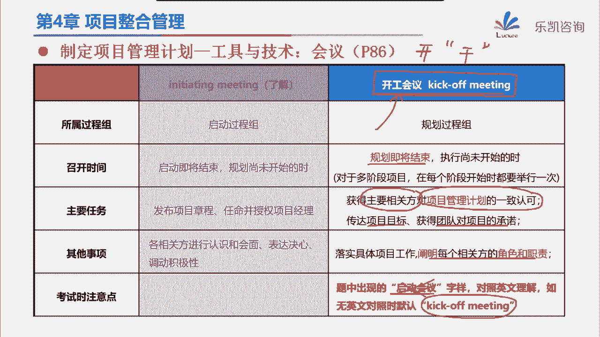

他就输出了这一份综合的项目管理计划，那么这综合的项目管理计划就包括了18个组成部分，那么这18个组成部分啊，大家现在呢时间可以去记一记啊，有时间可以记一记，那么后面我们会详细的去讲每一个计划。

它是怎么来的，那么大家呢大致了解一下这18个组成部分。

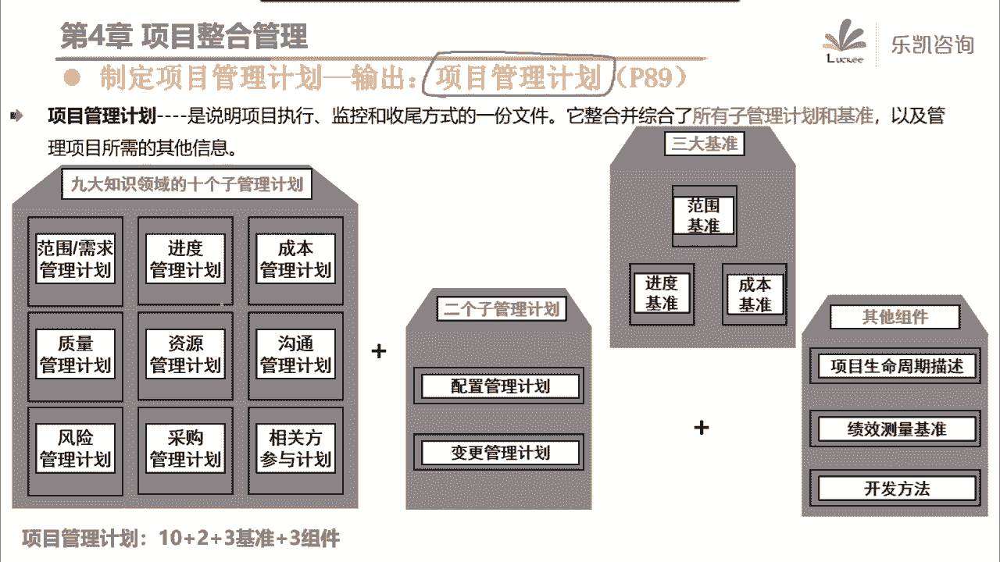

除了这几个，逐渐以外它里面的计划呢大致分为两类，一类叫指南型计划，一类叫实体型计划啊，单行计划就是说将来我们会有一些计划说如何去做一些事情，而实体型计划就会说这个东西具体是什么内容，比如说举一个例子。

我们后面会讲进度管理计划。

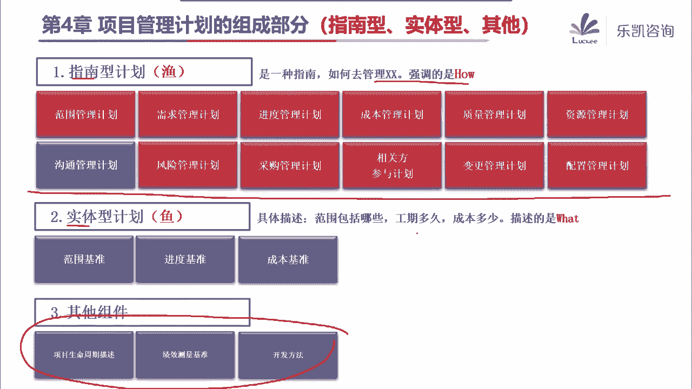

大家一定要注意啊，带管理两个字的就是指南型计划，他说的是我们如何去管进度，包括我们用什么工具啊，我们的精确度，准确度到什么程度，我们用什么计量单位等等，它不不会说这个项目的进度究竟是怎么安排的啊。

是一个指南告诉我们，如何去管进度，那么另一种呢叫实体型计划，进度基准就会有我们这个进度具体是什么。

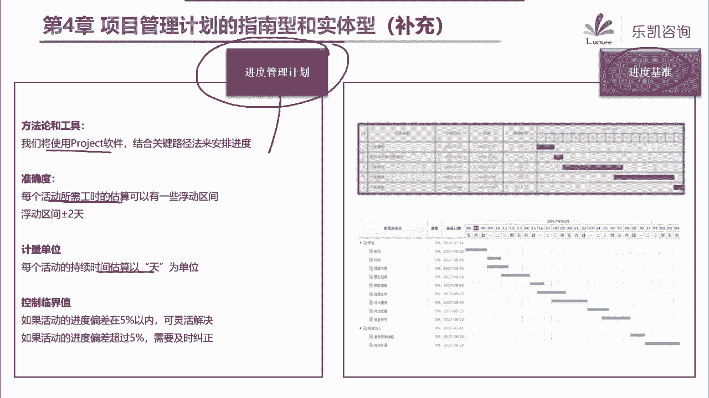

那么这两种计划在后面讲解的时候，我们再去仔细的一个一个去看，那么但对于这个过程来说，我们只要知道一件事情他是干什么的，他就是做了一件整合的事情。

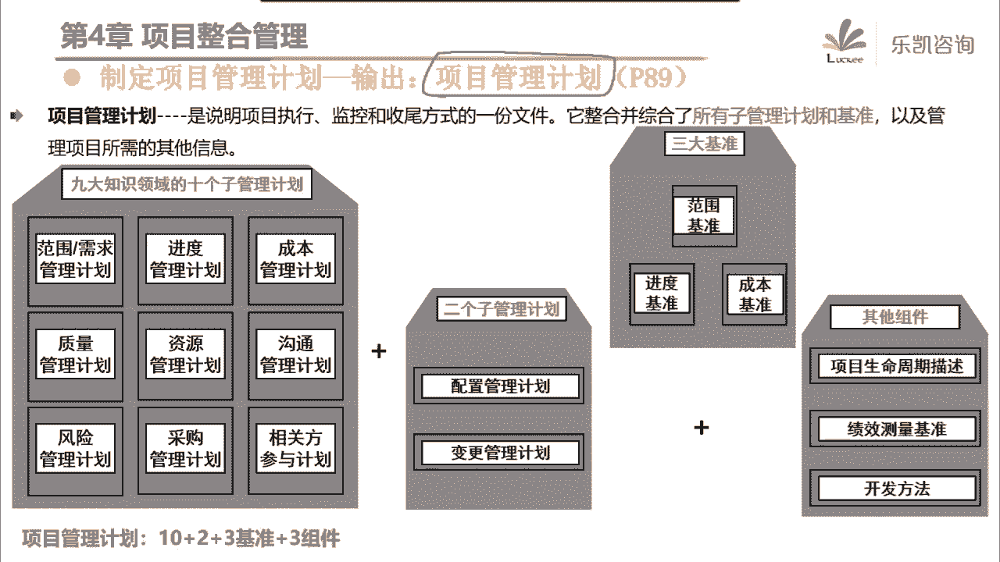

把这些计划全部都装订起来，然后开了一个天康复会议就结束了。

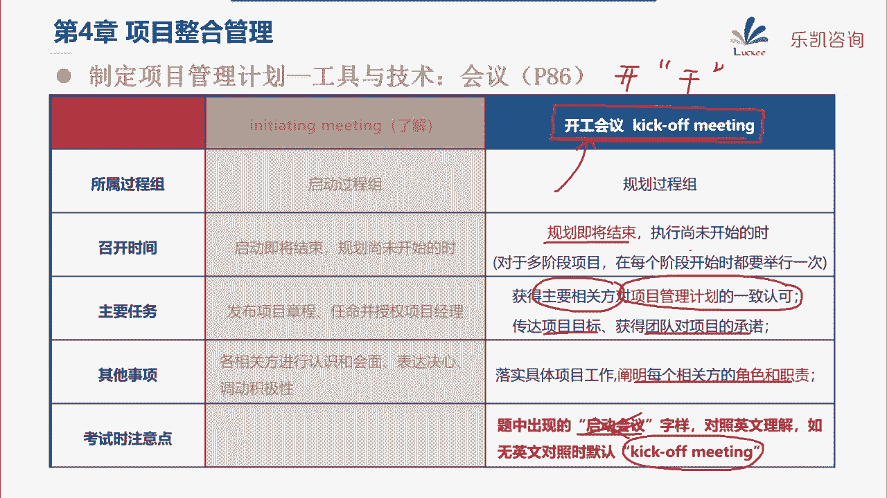

好吧好，那么接下来规划整合讲完了。

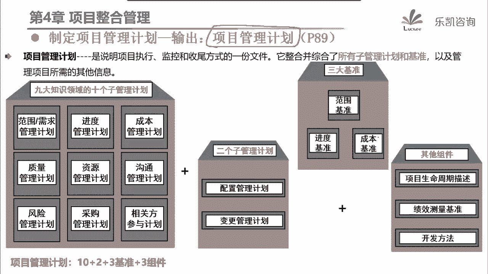

接下来执行，我们看一下对了，还有这边我补充说一下啊，这两天做题的时候，可能有人会问我怎么去区分项目管理计划，或者说还有一个东西叫项目文件啊，肯定会有人问这个问题的，在我们后面学习的时候也会接触到这两种。

那么项目管理计划是指我们刚刚说的啊，中要大家一致认可的，开最高负会议，大家一致认可的，那么还有一种文件就是我们在做项目的过程中，我们用来指导我们具体工作的，那么这种文件呢我们叫项目文件。

它不需要大家批准了，那么这都涉及到哪些文件修改，需要批准，哪些文件修改不需要批准，那么大家可以参考书上的89页，先暂时十了解一下具体的我们下一个下一节课，星期三我们可以说好吧。

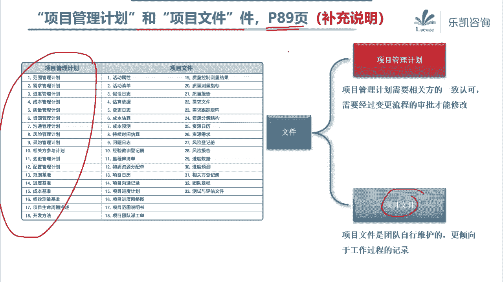

那么规划了整合实际上就是这一个过程，把所有的子计划整合成一份综合的项目管理计划。

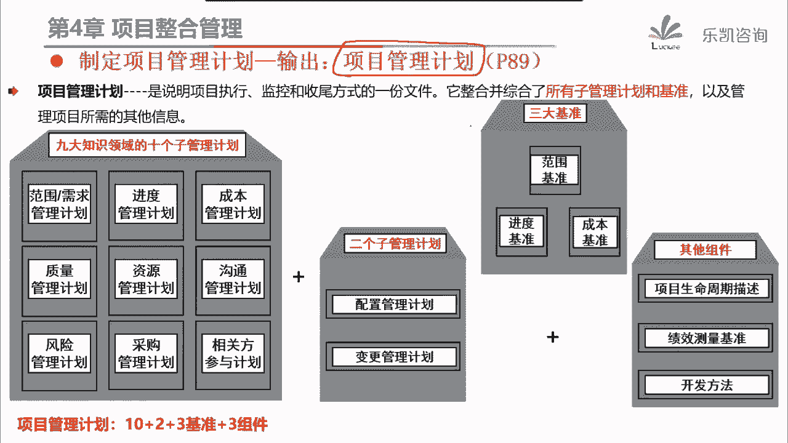

其实就是做了一个很简单的专利这样一个事情，好吧好，接下来我们再看一下执行的整合，第三个过程指导与管理项目工作，首先我们看一下这个过程他在说什么啊。

他说啊过程就是为了实现目标领导和执行项目管理计划中确定的工作，并实施以批准的变更，谢大家，你们觉得在执行的时候，我们要做什么，刚刚讲了，启动这整合是把背景的信息整合在一起，做出一份项目章程对吧。

那么规划的整合说了什么呢，所有的子计划整合在一起，形成一份综合的计划对吧，执行整合整合了什么呢，唉为什么执行你也要考虑到整合呢。

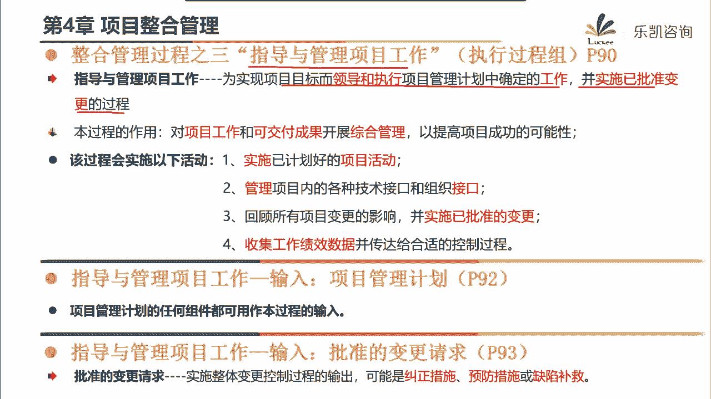

在执行的时候本来应该做什么工作啊。

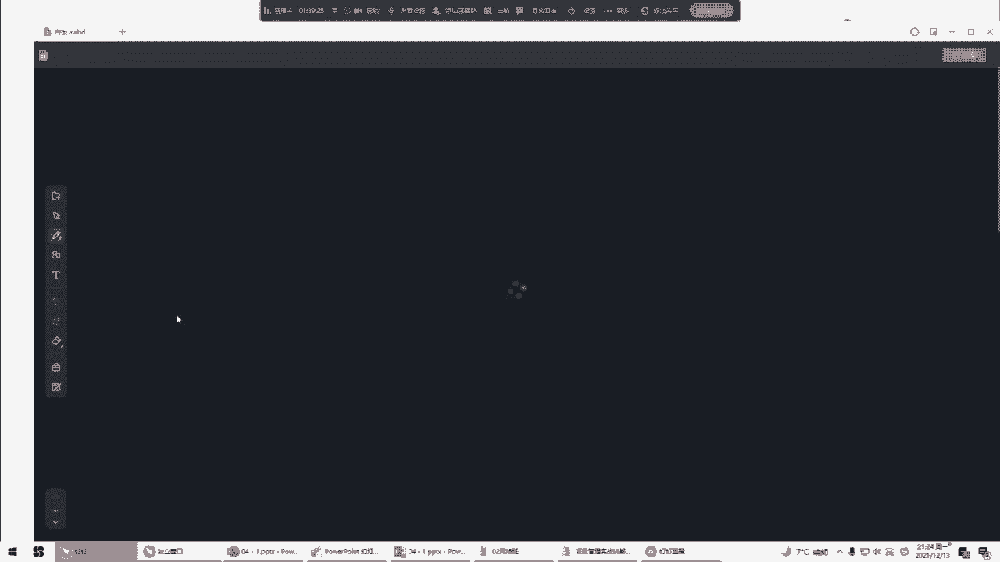

应该包括这么几个工作啊，我们要不要人啊，行吧，我们要招兵组建团队吧，我们要把资源拉过来，形成一个团队吧，好我们要不要设备和材料来执行啊，要买一把吧，啊对吧，哎我们还要其他的一些东西吧。

那么我们这个过程你会发现并没有讲这些东西，说资源，不管是人力资源，实务资源哪儿来啊，讲一件事情，最终这些东西是为了干什么，中这些东西是为了执行来做出什么东西呢，做出可交付成果，所这个过程他什么都没有说。

他只是说了啊，最终其实我们做这个过程的目的是为做项目管理计划中确定的工作，如果有变更，实施批准的变更，然后把可交互从我做出来，它就是一个整合过程。

那么从这句话里面我们就能够知道这个过程它有两个关键的输入，既然要按照项目管理计划中的事情去做，那么它的输入一定有项目管理计划，既然计划可能会发生变化对吧，那么批准到了变化，裂变获得了批准。

那么批准的变化我们专业的说法叫批准的变更请求，我们要拿过来做，那么这两个输入是必须要有的啊，那么这个过程怎么去执行，我们可以借助一些工具，我们在一开始说到了借助拼命工具对吧。

那么这个工具我们叫项目管理信息系统，这个呢稍微了解一下就行了，我们很多不是有这样的系统，那么通过这些工具来帮助我们来执行这这些工作，那么它里面包括跟印度有关的进度计划工具。

这个呢我们可以理解成像project这种工具对吧，授权系统有点类似于oa系统，保证工作正确的时间，正确的顺序来执行的，包括信息收集与发布系统，我们可以认为是邮件系统配置管理系统。

那么做it的可能会知道一些，比如说版本控制等等这种系统，那么这些工具综合起来就是项目管理信息系统，屏蔽式系统来帮助我们提高功能，做效率的，那么包括在执行的过程中，我们要开一些会议。

那么最终这个过程是为了什么好，就是说我们这个过程最终要整合出可交付成果，把可交付成果做出来对吧，所以说这个过程主要的目的就是我们要把独特的并可核实的，可交付成果把它给做出来，就这么个事情。

然后要注意的是，可交付成果也包括项目管理计划的组成部分，那些计划包括我们的一些图纸，也是我们的可交付成果，好吧，这一点稍微注意一下，那么在执行过程中，我们还有一些原始的数据我们要收集起来。

那么这一些原始的数据是什么呢，原始的观察值和测量值就是工作绩效数据啊，这些数据我们要收集的，后面我们要进行分析的，那么另但在执行的过程中，如果遇到问题怎么办，好问题我们统一记录在问题日志。

记住在问题是指我们有一个文件专门记录所有的问题的，那么问题日志里面就包括主要的内容，有问题的描述是什么啊，一旦遇到问题，我们会安排这个问题由谁负责，我们希望在什么时候能够得到解决对吧。

那么所有的问题我们都会把它记录到问题日志好吧，那么另外在做的时候，如果你发现啊需要调整，那怎么办好，这个时候我们也有可能会输出变更请求，我们要提交变更的，那么病请求。

所谓的变更实际上就是跟原先的计划不一致的地方对吧，那么变更它包括纠正类的变更啊，措施预防措施，缺陷补救或者更新这四种，那么这四种呢其实很简单，纠正措施是我们发现有一些问题有些偏差，我们事后去做纠正的。

那么预防措施是没有发生偏差之前或者没有发生问题之前，我们事先进行预防的，缺陷补救呢是专门针对质量的啊，比如说我们做的时候发现做的东西有问题，我们需要重做啊，或者叫反攻，包括如果我们的计划直接要调整。

我们要做更新率的变更好吧，那么这个过程输出的变更请求包括这么四种请求呢，在我们下一节课会经过一些流程去获得批准，那么就是我们执行过程的一个整合，它最终是为了输出可交付成果，包括呢这个有问题。

记住在问题日志有变更，提交变更请求，好吧好，那这个过程呢其实内容不多啊，就这么一点，那么刚刚有几个同学说，我怎么感觉听的有点懵，我说一下啊，这个不是其他的问题，我再次帮大家过一遍，今天我们讲的内容。

我们今天讲的是什么，知道吗，一开始我们再看一下啊，今天讲的叫整合管理，要整合整合的意思就是指我们不讲细节，我们只讲需要整合的点啊，那么比如说我举一个例子啊，开始我们做什么。

一开我们把商业文件协议这些信息拿过来整合成什么，整合成的项目章程，这个过程大家听完了之后还是比较明白的啊，运行信息整合成一份项目章程，让这个项目正式启动立项，对吧好，接下来很多人会觉得。

接下来我们就要讲规划，每一个计划怎么做，但批文报告里面他并没有讲每一个计划怎么做，他又讲范围的计划怎么做，进度计划怎么做，成本怎么做，他直接讲了什么呢，他说你先别管这些计划怎么做啊，我告诉你啊。

到最后这些计划都会把它拿在一起装订，并在一起变成什么，变成一份综合的叫项目管理计划，不管你的进度也好，成本也好，范围也好，所有的计划最终都会给我给我干，装，订成一本综合的项目管理计划，然后装订好了之后。

我们马上开了一个qq会议，那没问题了，规划就结束，我们就直接开干，所以在规划这个过程，他讲了什么，他只讲了两个字，就是装订，而且他提醒你将来要装订的东西很多，为了避免遗漏，他介绍了你一个工具，还记得吗。

checklist，那么你说这个过程有什么实际的内容吗，没有他就告诉送你，最终我们要整合成一份综合的项目管理计划对吧，你整合的时候为了避免遗漏，注意用好这个工具check list，然后整合完了之后。

我们就开个会，开个keoff规划了，整合就结束了对吧，然后接下来讲执行的整合，你的整合本来要讲什么，我们怎么去把人物色好，组建好团队，怎么去把设备材料安排好，怎么去把其他的东西安排好对吧，他这些都没讲。

他只讲了一件事，他说当你你人力物力各种条件都具备了之后，我们干什么，最终我们要把项目管理计划里面规定的内容把它给做出来，所以我们最终要做出可交付成果，是我们执行最终的一个目的，整合了所有的人力物力资源。

然后把可交付成果做出来，那么如果在做的时候有问题怎么办，你要把它记录清楚，记录在问题日志做的时候，你觉得这个计划不合理，要调整，那怎么办好，那么你要提出变更请求，要变更这个计划的要提出变更请求，对不对。

所以说大家仔细一看这这这几张图啊，没有讲具体的细节，我在一开始我就说了，有少数同学会觉得这节课讲讲完了之后，感觉都是说了一些很虚的东西，实上确实很虚，因为他没有讲细节，他只讲了什么，他只讲了这些整合叠。

那么在讲义上我画了一张图。

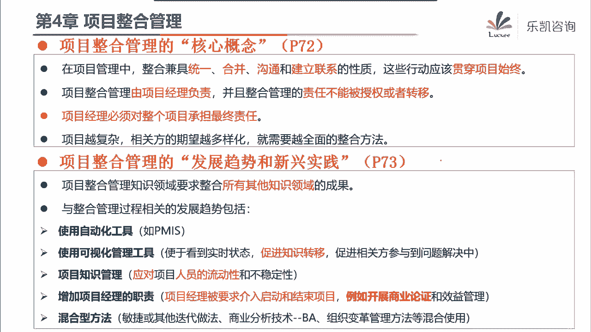

大家可以看一下啊，张图实际上才是我们真正做项目的一个顺序，先启动，然后接下来做各种各样的，比如说先收集需求，有了放，可以在定进度再算成本对吧，然后到质量资源风险好，一直做完了才做制定项目管理计划。

大家注意，你看这张图的位置，今天我们讲的内容，这三个过程在什么地方啊，三层是启动的整合，然直接就跳到了规划的整合，然后直接就跳到了我们执行的整合的第一个过程，指导与管理项目工作，他只讲了这些整合的点。

他没有讲里面具体的其他的细节整合管理在以前叫整体管理，说就是从全局角度告诉你很高的层次，告诉你整个项目启动，我们主要要做什么规划，主要要做什么执行，主要要做什么啊。

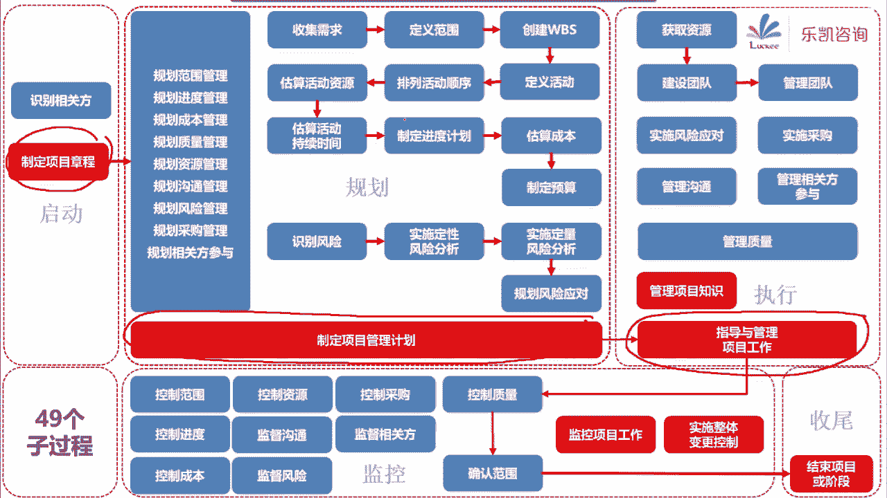

这张图来说，我可以这么说啊，我们整本书的49个过程做是为谁服务的，启动最终是为商城服务的，所有的规划过程最终是为了干什么，最终是为了做出这样一份计划，所有他执行最终是为了什么。

是为了能够保证把可交付成果做出来，所以这些东西最终都是为了整合，都是为了整合，大家一定要理解好整合的意思，第一节课它的层次，第四章他的成绩是很高的，他不会讲很多细节的，那么接下来很多人问。

第三个过程它的输入跟输出很快啊，和输入有批准的变更请求，输出又有变更请求，他们有什么关系，好这个问题我说一下啊，正常来说我们的这个执行过程指导与管理项目工作是按照什么来执行，是按照计划来执行。

按照计划来执行，那么在执行的过程中，大家要考虑一个问题，计划一定是对的吗，有可能出现一些跟计划不一致的地方啊，原先我们做的这个计划，我忽然发现做不到，需要调整，有可能吗，有可能的所在。

这个时候我们要干什么，我们要提交一个请求，我们打算变更这个计划，我们就输出了变更请求，那么这个变更是你提出来之后就能改的吗，不是的，我们在下一节课会讲一个过程，叫实施整体变更控制。

那么这个变更请求我们将来会通过一个流程来管理，如果获得了批准之后，就变成了批准的变更请求，那么这个时候那指导与管理项目工作，这个过程就说了下管理计划要做的，那么变更请求获得了批准，也要做的。

所以能不能理解它的输入会出项目管理计划，另外如果项目管理计划需要变更，当变更获得了批准，我们也要做，有这两个，那么有了这两个输入，在做的时候有没有可能又出现新的变更呢，有可能的对吧。

那么这就导致了图层输入有批准的变更请求输出，可能会输出另外一个其他的变更请求，他输入有批准的变更输出，有其他的变更，所以说就会导致输入跟输出出现这样一个结果好吧，先不要问我们下一节课会讲，控制这个过程。

那么今天我们主要就讲了这三个过程，大家把这三个过程的内容一个一个的理解清楚就可以了啊，指导与管理项目工作就是具体的执行，把可交付成果做出来好吧，啊我再说一遍。

刚刚有人说的这个变更请求是不是有可能也不存在啊，有可能的，他如果没有变更吗，那么就不会输出变更请求好，我再说一点啊，包括黄泉风，注意听一下，我接下来说的话，再问一个问题，为什么要这么讲。

不按照启动规划执行监控收尾的顺序去讲而定，要首先先讲整合的东西对吧，那么这些东西都是一些很高层级的对吧，相之间可能都没有一些很紧密的联系的，你做完项目章程之后，并不是直接做制定项目管理计划。

制定项目管理计划是在规划的末尾才做的对吧，那么你为什么不按照制定项目章程，然后就讲其他的细节，然后再讲制定项目管理计划呢，为什么呢，好注意，有两个原因，第一个原因p。

希望在一开始让大家对整本知识体系的一个主要的东西有一个了解，从整整体上来说，我们启动要做什么规划，主要做什么执行，主要做什么监控，主要做什么，收尾主要做什么，对吧，先讲了一个成绩很高的。

可以认为是一个大纲，另外一开始就解释了这本书的顺序是很怪呢，为什么他后面直接讲了范围，道理讲其实并不是一下子把这些都做掉的，比如说确认范围是很后面才做的呀，为什么一下子一口气把进度全部都讲掉了。

那么其实在做进度的过程中，有很多跟成本是有关系的呀，那么后面又把成本一口气讲掉了，好大问一下这本书的顺序，它不是按照做项目的先后顺序去讲的，它是按按照知识领域的顺序去讲的。

一开始就解释了他为什么要这么做，因为我们有的人在公司专门管需求，那么他只要重点的去看这一块就行了，对他的工作没有什么帮助的，我们有的人专门管进度，那么就看这一块就行了，我们有的人专门管风险。

你们就看这一块就行了，所以pmbok的顺序是按照知识领域它来分的，先讲什么知识领域，后讲什么知识领域，而不是我们实际做项目的顺序说啊，我们要先做项目章程，然后接下来先做什么计划，再做什么计划。

最后再整合成什么计划，它不是到这个上去，那么也就是说大家后面在学的时候应该怎么去学好，现在的困难在什么地方啊，每一期学员都有同样的问题，你们现在的困难在于我怎么感觉这几个过程没什么联系啊。

俗你讲的东西我怎么串不起来呀，不要想着把这几个过程串起来，因为他们本身之间并不是有严格的说先做什么后做什么，明白吗，他们本身的顺序就是很跳跃的，你跳跃的东西怎么去串呢，那么你应该怎么做呢。

我们今天讲了三个过程，把这三个过程掌握好，后面再讲几个过程，把这几个过程掌握好，然后再讲其他过程，把其他过程掌握好，每一个过程，当你都掌握好了之后。

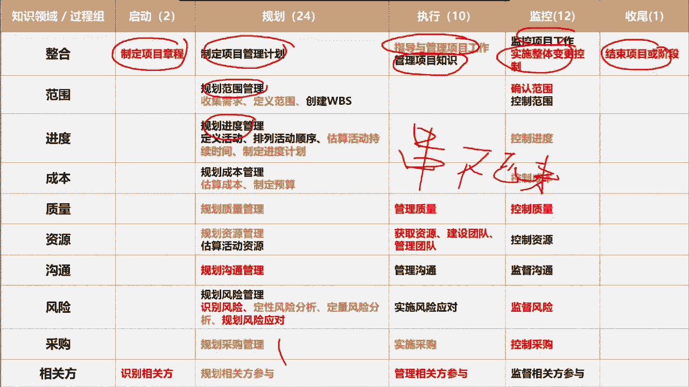

我们在最后才会把这49个过程，按照这样的顺序，帮大家从头到尾把它给过一遍明白，所以说在学习的时候，我们抓住单个的过程，过程跟过程之间有联系，我们学到什么地方能串的，我会帮大家去串的，现在不要想着串学习。

不要急于求成，他不是说今天一讲完啊，我全部都懂了，今天只讲讲了49个过程里面的三个而已，你把这三个搞懂了就行了，好吧好，那么今天的课程我们就到这里为止，接下来在刚刚讲的过程当中，三个过程而言。

有什么不明白的，留下来答疑，嗯，那这三个过程啊，有什么不明白的，留下来打一，理解整合啊。

说我们在讲义上工作，授权系统里面有一个词叫镀金，这个词怎么去理解这个呢，我们在讲第五章的时候会详细的去讲，简单的来，还说什么叫镀金呢，就是客户没让你做的，你莫名其妙帮他做了，想讨好他的这个叫镀金。

你说40几个过程都是项目经理在做吗，应该怎么说，49个过程都是项目经理带着团队去做的啊，炮他一个人是做不了的，温博问什么叫基准，怎么去理解基准，我这个例子啊，不去工地呢。

我就看到工地上有一个工人在捡钢筋，钢筋它是怎么解的呢，啊有很多的钢筋，保证每一段钢筋都是1米5，怎么减的，他首先用尺子量了1米5的钢筋，先剪了一段啊，后面要解了之后是怎么解到这一段为基准。

根很长的钢筋拿过来，我拿这一段拿过来，在这里框框切一刀，然后再把这段钢筋往这儿一放，再宽汤切一刀啊，这是什么，这个就是基准，基准呢基准就是一个比较的依据，一个参照，那么为什么说我们的计划最终要基准化呢。

因为计划我们需要得到大家的一致认可，那么那我们就以计划为参照，通过跟计划的比较，我们就能够明白我们的项目是快了还是慢了，那么所为的快与慢节约和超支是跟什么比较。

你当然要根据我们事先定好的计划去比较啊对吧，所以说基准是什么意思，其实就是一个比较的依据，就是说这个什么叫工作绩效数据啊，工作绩效数据就是我们在做项目的时候，其原始的观察值和测量值，比如说我举一个例子。

做一个项目，这个项目呢分五天，比如说很简单，每天要搬100块砖头，计划吧，每天搬100块砖头，最终我要搬500块砖头啊，项目好，在我们实际执行的时候好，我会得到一些什么原始的工作，气象数据呢，我会。

计划来说，在第二天下班，我要搬200块砖头，实际上到第二天下班的时候，我发现整个团队一共只搬了180块砖头啊，是原始的观察值或者测量值能够直接得到的，那么这个就是工作绩效数据好，那么很多人可能会问。

那么我这些数据要了有什么用，因为将来我们要对这些数据进行分析，通过对这个数据进行分析，你能够发现这个项目有什么问题，要搬200块砖头啊，实际上我们的工作只搬了180块砖头，这意味着什么，好一分。

我们就会发现这个项目到目前为止进度慢了，路慢了，我们要办，要要干什么，我们就要想办法要调整这个进度，比如说我们可能您要考虑赶工，要加班，要么你加人对吧，总之要想办法恢复这个进度，明白吗。

所以说在我们执行的时候，为什么要收集这些数据呢，收集这这些数据最终是为了分析项目的绩效，切原始的观察值和测量值，就是我们的工作绩效数据，意思吧，而我们刚刚说的这个是什么东西啊，我们的计划是一个基准。

而我们实际做的是什么东西，是记得工作，那么实际的工作跟计划去比较，就会发现什么快乐慢了呀，他问了一个问题，他说基准包括几个，记住我们在后面会讲啊，方所谓的基准呢有三个基准范围方面的基准，进度方面的基础。

还有成本方面的基准对吧，那么明确那叫基准的。

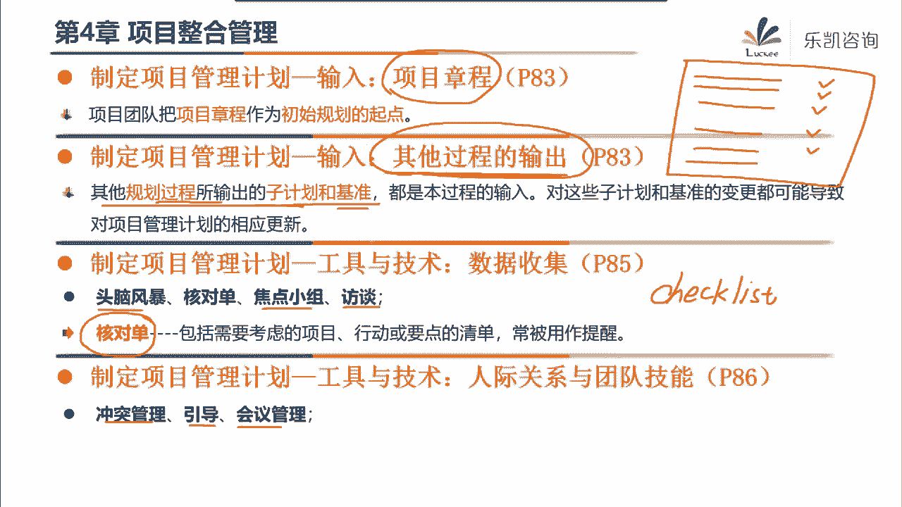

就这三个范围，基准进度基准成本基准，那么实际上呢其实整个项目管理计划我们虽然不叫它基准。

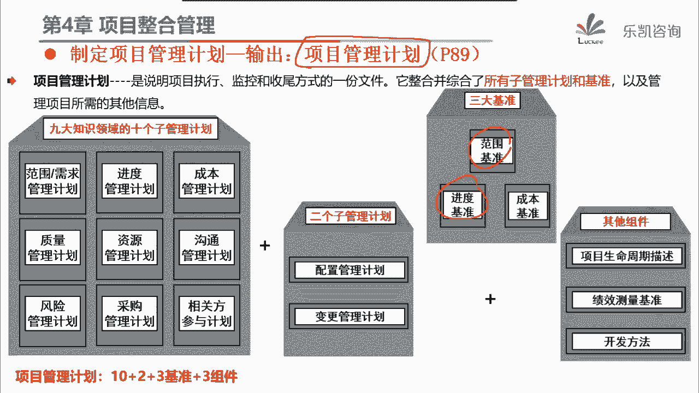

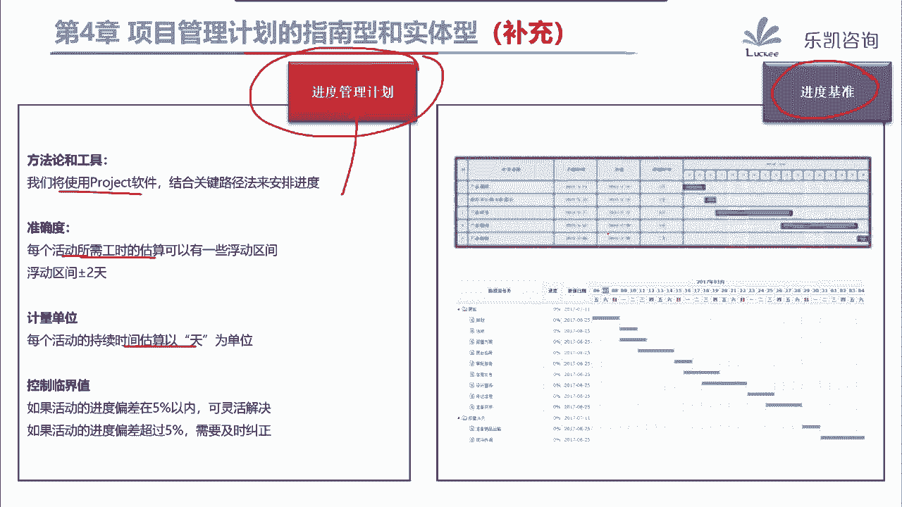

但是我们也会把它基准化。

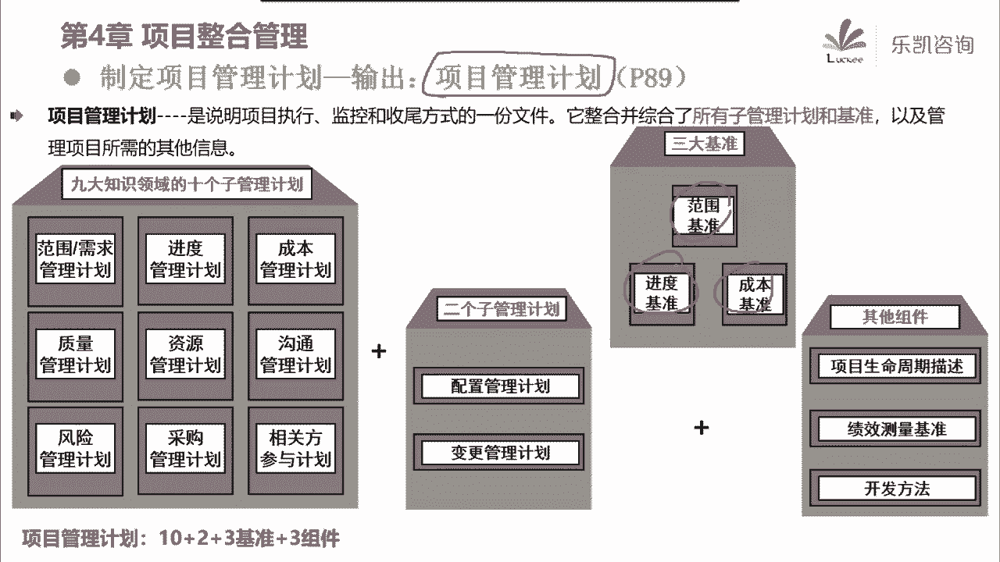

这种话呢我们刚刚说过，其实我们要获得主要相关方的一致批准，现在整个项目管理计划也需要得到一致的批准和认可，也就是说这些东西都是我们的依据，是不能随便改的，如果你要改，可不可以改好，刚刚有人。

难道基准就一定是对的吗，有没有可能你当时由于一些信息不明朗，导致你的基准是不正确的，好一旦发现基准有问题，或者项目管理计划有问题，能不能改，能改对吧，但是我们反复说，一定要经过某一个流程的控制。

他一定要经过某一个流程的审批，才能允许你改，这个很好理，因为大家都一致认可了，你怎么能随便改呢，你要改一定要经过一个严格的流程审批的，嗯，先不要着急，知道有这么个东西，我们第五章才会讲到范围基准。

交付成果作为输出的，就只有这个过程，直到与管理项目工作执行过程能输出了，可交付成果啊，其实可交付成果的种类有很多，包括这个我们的这个所谓的产品啊，中间的产品，包括这个党一些图纸，这些都叫可交互层管。

单一点就是将来你要交付给客户的都是可交付成果，地方说这个改这个严格的流程是怎么定义的，这个我们下一节课会讲啊，下一节课会讲七变更，他要经过什么流程好，王唱飞问了一个问题。

他说这个上级管理计划在这一次讲的时候讲了没有啊，感觉怎么都没讲啊，好跟大家说一下项目章程的输入，我们只强调了商业论证，而上文件里面确实包括两个，一个是商业论证，一个是效益管理计划。

那么为什么不讲效益管理计划计划，我们在上个星期大致提到了一下对吧，就是说这个项目我们将来要怎么样去衡量这个效益，那么为什么在这边不再强调呢，有两个问题，有两个原因，他在考试中的比重很少。

音效益管理计划在很多项目上跟项目经理没有什么关系，为什么这么说，我问一个问题，效益是在什么时候产生的啊，效益在项目结束的时候有没有效益，能干一个电影院，电影院的效益在什么时候产生，比如说能盖一个核电站。

核电站的效益在什么时候产生，开发一个网站，网站的效益在什么时候产生，大家会发有很多项目在项目结束的时候，他并没有效益，是在什么时候产生的，是在后面的运营的过程中才会有的对吧，你你说电影院。

电影院这个效益什么时候产生，电影院盖完了之后，他并没有效益啊，他在后续使用的时候运营的时候，它才会产生效益啊，对吧，和盖完了有效益吗，没有效益在后面运营的时候才会有效益啊。

所以说为什么我们并不强调效益管理计划，因为有大量的项目，其实在项目结束的时候，它并没有效益对吧，你要看将来什么时候实现效益怎么样，怎么样去衡量效应，那个时候项目早就已经结束了对吧。

所以说相对来说商业论证比较重要一些，而且在考试中出现的比较多，那么效益管理计划，大家知道有这么个东西是个什么概念就可以了，我再次说一下啊，我他没有说这个过程是在收尾做，我刚刚说的是项目管理计划。

这个过程你看一下它的位置，这个过程啊描述它的位置，我们一般从两个维度，它属于整合知识领域对吧，横着的位置，那么纵向上来说，它属于规划过程足，那么我刚说的这个过程，我没有说他在收尾的时候做啊。

我只是说它在规划的尾巴上，注意只规划这个这一组过程的尾巴，他做的事情是什么，是把其他过程输出的东西一起拿过来装订对吧，所以它在规划里面，它是规划的最后一件事儿，一旦他做完了，开了qq会议。

那么接下来就到了执行，是吧，规划的尾巴上，而不是在收尾的时候做，这个要搞清楚了，问题没有嗯，问了一个问题，执行的整合都是有形的，可交付成果吗，不一定的，也无形的，可笑无成果。

他投入的人力物力最终都带来一个什么可教物存活，举办了一场婚礼，你说可笑不存活是什么对吧，这个我们就说了，可交错，我就是这种婚姻关系，它也是无形的，一般来说这就是可教授，我是一种提供一种服务的。

它大多数是无形的，包括国内的，比如说我们学习pmp这个可交付成果，他也是无形的，不太明白明白这个无印彪问的这个意思啊，实际上经常会出现某一个组成部分尚未确定，但是必须要启动执行。

其实说的就是项目管理计划的渐进明细嘛对吧，这确实不会有那么细的，没那么细的，我们的成本也是分阶段投入的，所以在一开始不一定能够了解具体的成本投入，启动会在规划的节点，这句话是什么意思啊，我没有看明白。

想问这个执行是在制定项目管理计划，做完了就执行对吧，是想问规划在什么时候开始吗，还是什么意思啊，在什么时候开始，其实很简单，规划在什么时候开始，这个问题其实就等同于启动，在什么时候结束啊。

接下来你告诉我哪，完成意味着启动结束，回答吧，既出现了就意味着我们这个项目已经启动完了，kick off，kick off是规划的事情啊，跟启动没有关系，对了，项目章程获得了批准，获得了批准。

看这句话就意味着项目的正式启动，其实后面再加两个字，就是就意味项目正式启动完毕，获得了批准好的项目经理，项目也立项结束了好，接下来项目经理开始负责规划，嗯嗯启动到规划其实是哪一个节点。

项目章程获得了批准，获得了发布，然后划和执行是哪一个节点是可靠，会议开完好吧，那么刚刚有同学问到，那么启动会以什么时候开，我再一次说一下，现在第六版已经没有启动会议这个说法了啊，因为启动会议是有歧义的。

在老版本里面启动会议，它对应的两个会议啊，章程的时候，项目章程发布和批准的时候开一个会，这个会议呢在我们讲义上也有，大家可以看一下，这边已经灰色背景覆盖掉了对吧，叫initiative meeting。

那么以前呢k告诉媒体也叫启动会议，所以就出现了两个启动会议，给大家带来了困扰，那么现在第六版改版之后没有启动会议这个说法了，这个会议呢也不强调了，他只讲k靠谱会议，这个叫开工会议对吧。

那么如果说大家做题的时候遇到启动会议，那么一般我们把它认为就是说的k卡服命题规划最后一件事，考试的时候不太会出现这种情况啊，考试的时候呢，这个它有中英文对照的，你直接看英文就可以了，询问了一个问题。

我们来看一下啊，他说，管理计划，我们管理计划的子计划啊，别的你就要理解我们今天讲的项目管理计划这个过程，制定项目管理计划是怎么制定的，我们项目中有很多的子计划。

导致此计划装订在一起就变来一份综合的项目管理计划，如果项目管理计划是一本书，那么其中的某个子计划就是其中的一个章节啊，对吧，其实我们后面第五章开始会讲很很多的子计划，比如说范围基准范围管理计划。

进度管理计划，成本管理计划等等，那么最终他们把这些子计划装订在一起，变成了中综合的一本，这一本我们叫项目管理计划，因为我们今天讲的制定项目管理计划，我们一个词啊，还记得吗，就叫装订了这个过程做什么事情。

就是将来有了这些子计划之后，把它装订起来，就做了一个绑定的事情对吧，那么工具我们也只讲了一个，的东西太多，为了避免遗漏，所以我们要干什么，要用checklist来提醒我们要装订，哪些不要漏掉。

所以我说这个过程其实很简单，他只讲了专利，只讲了一个过一个工作就是整合工作，所以整合它其实很虚的，合并起来就叫整合，问说怎么样去理解项目管理计划要足够强大，观点大家认同吗，做项目的时候。

如果你的计划你感觉排下来刚刚好一件好事儿，为什么，因为在我们做项目的时候，你在排进度，排成本的时候，你发现诶进度刚刚好，一天不差，一天不少，我排的计划跟客户的要求正好符合的，成本算下来正好一分不多。

一分不少，这玩那不是一件好事，为什么，一旦有风吹草动，你这个计划就会无效啊，为什么说计划要足够强大，说得直白一点，就是你要经得起折腾啊，因为实际来说，计划是很难一成不变的，它总会有一些变化的。

那么一旦出现这些变化，或者说出现一些风险，你怎么样让你的计划能够应对这些问题呢，所以说我们要求项目管理计划要特别的强大，唉你不能说唉我拍下来刚刚好，往往我们会有一些储备在里面的。

而这个储备呢就是大家现在说的叫buffer，叫冗余对吧，后面我们会讲到相应的应急储备，包括管理储备，你说的是指哪里没有讲到，那中文叫核对单啊，说什么叫项目章程对吧，以前做的一些东西叫不叫项目章程。

我给大家看一个例子啊，上课的内容结合实际去理解一下，这衣服就是我以前公司的项目章程，那么我们以前的项目章程立项是在我们的pp 4系统里面立项的，那么我把系统里的东西呢，把这份文档导出来了。

大家可以参考一下，像书或者叫项目章程里面会写什么内容呢，他会写我这个项目名称，客户的名在什么地点实施，如果已经清他的合同，合同编号，合同名称，合同金额，对吧好，接下来你看它包括哪些东西啊，有没有有的。

但是他说得很粗，什么时候开始，预计什么时候结束，有哪些最关键的节点，那么这些关键的节点我们有一个说法叫里程碑，这就是项目章程里面所谓的总体里程碑，这是一个里程碑的进度计划，他只写了几个关键的节点。

特别他定了一些付款的比例，我们的成本一般我们做it项目都是说到人力成本对吧，唉什么时候投入多少成本，那么项目经理是谁，他的主要职责有哪些，然后项目主要有哪些可交付成果。

那么项目组主要的联系人其实就是我们主要的相关方有哪几个人对吧，那么这个项目主要的风险有哪几个方面的风险啊，后续在管理的时候重点要关注什么好，这个项目是谁来发起的，发起人签字，那么这就是一份项目章程。

你会发现他有详细的东西吗，他没有，他就是上课说的，他只有一些高层级的信息，很宏观的，很概括的，所以说项目章程里面有没有这些进度啊，成本的范围啊，有但是说得非常的概括，细的立项的时候也没有必要。

也不可能那么细，还是有的在盯盘里面都有的，大家可以到d盘里面去看一下，啊在我们星期六讲实战的时候，我都会一个一个给大家讲的明白吧，嗯都学了什么，我们实际做的时候可能会遇到什么文档。

我都会打开给大家看一看的，在d盘里面也会有好几套模板，大家可以去下载看一下，他说我们项目管理里面所谓的绩效有哪些绩效，其实所所谓的绩效的主要有三个绩效，一个就是范围的绩效，你多做了还是少做了。

第二个就是进度的绩效，快了还是慢了，第三个就是成本的绩效，那么特别是进度和成本，我们在后面讲第六章和第七章的时候，会有成本绩效指数，进度绩效指数对吧，进度绩效指数，spi，成本绩效指数cpi。

这个呢后面我们都会深入去讲，之后呢我们只是站在一个很高的层面啊，说到了我们这个项目重点，其实最终是要做好什么东西的整合启动，做什么整合规划，做什么整合啊，书呢要看每个公司的具体的做法。

像我以前的公司是在系统上面立项，然后呢只能直接在系统上去p的对吧，那么如果有必要向国家的一些示范项目或者一些重点项目，我们会开很多的会议的，所以不项目有不同的做法，那不管怎么说。

他最终一定要发起人最终来发布和批准，给我说一下，我们只讲第一部分，第二部分你仔细看一下，跟第一部分是一致的，没有多出来什么东西好吧，其实大家最省事的一个学习方法是什么呢，课讲的内容搞清楚。

把上课的东西抓住了就够了，上课没有讲的，就意味着他跟在项目管理当中不是很重要，而且考试也没有什么关系好吧，那些东西呢可有可无，如果说有一些要补充的，我会在实战的时候去补充。

实际项目中应该注意什么地方好吧，问的这个问题啊，我说一下啊，你问的这个问题呢不准确，我们应该这么说啊，我们看制定项目章程这个过程，制定项目章程最终是不是输出了项目章程啊。

啊这个项目管理计划的时候输入我们是不是可以参考项目章程啊，那么从这个各方面来说，我们可以这么说，制定下项目章程这个过程的输出在项目管理计划的时候作为的输入，之前说的一个过程的输出。

可以是另外一个过程的输入啊，表达这个意思啊，制定项目章程，这个过程，为什么他当然就输出了项目章程啊，规划的时候，由于项目章程里面有一些总体的宏观的一些东西，我们可以参考。

那么这个输出又作为为了制定项目管理计划的输入对吧，那其他问题今天我们就先到这里好吧，一开始接触这个每一个过程的学习啊，大家不要着急，所以呢我们一周呢也只就讲一张，像今天我们就讲了三个过程，制定项目章程。

制定项目管理计划，还要指导与管理项目工作，大家把这三个过程搞清楚就可以了好吧，那么下一节课我们会讲剩下的过程，然后再回顾一下整个第四章，它为什么叫整合管理好，那么今天我们就先到这里，如果有其他问题。

大家在群里面呢相互沟通，然后如果实在搞不清楚，直接艾特我好吧。

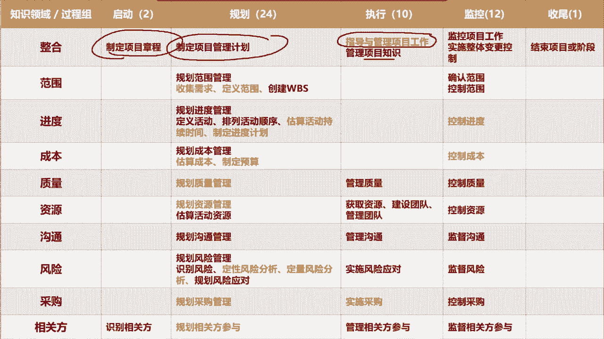