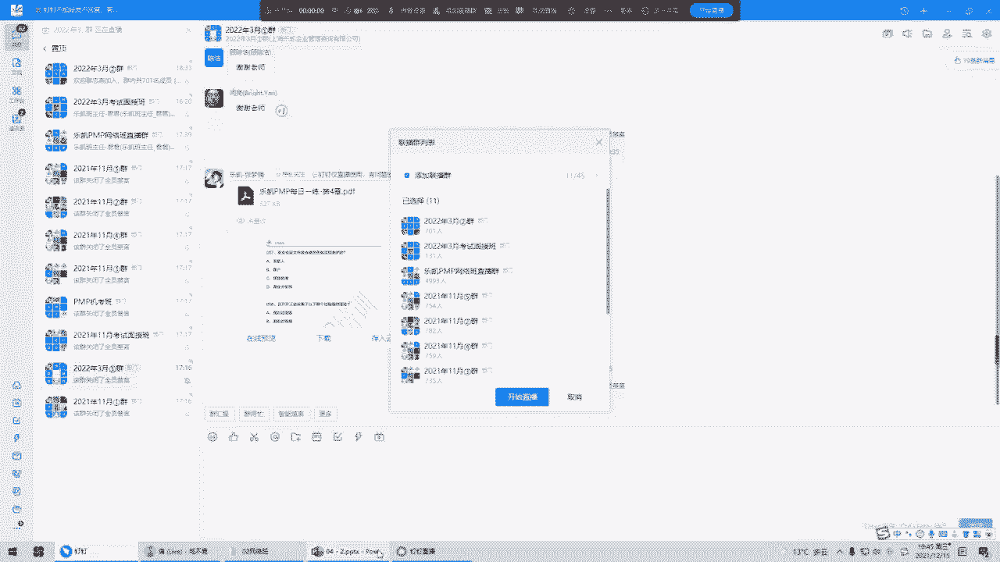
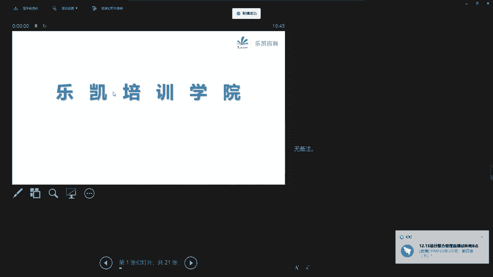
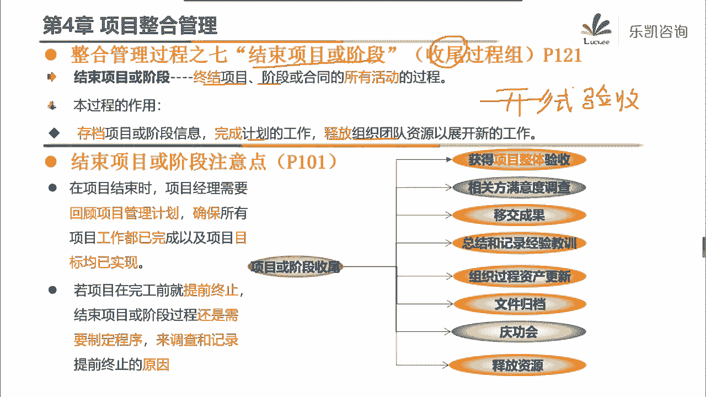
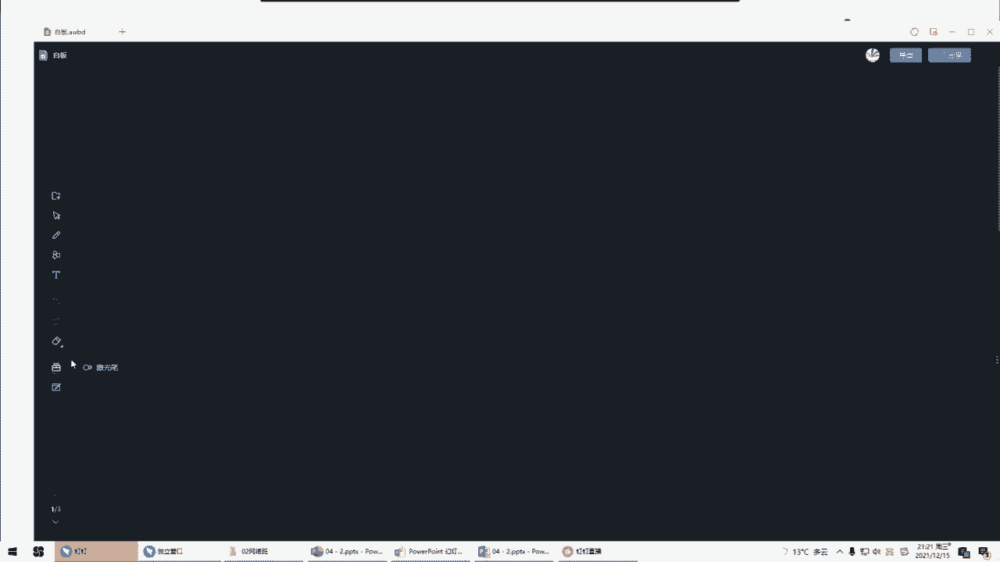
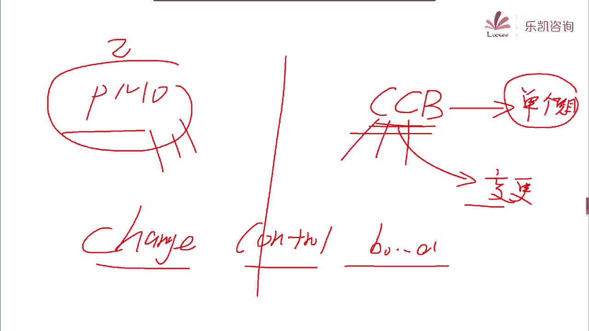

# 2022年PMP项目管理精讲课程-包含项目实战课程 - P5：第四章-项目整合管理（下） - 乐凯PMP - BV11L4y1E7TC

借一盏午夜街头昏黄灯光照亮那坎坷路上人影一双，借一寸三九天里日里暖阳，用着茫茫人间刺骨凉，借一泓古老河水，九曲回肠，带着那摇晃烛火漂往远，借一段往日旋律婉转悠扬，把这不能说的轻轻唱，被这风吹散的人说。

他爱得不深，被这雨淋湿的人说，他不会冷，无边夜色到底还要蒙住多少人，他写进眼里，他不敢承认，走过，接一波一血，黄昏都有斜阳，为这漫漫余生添一道光，借一句刻骨铭心，安日方长，若不得不天各一方。

被这风吹散的人说他爱得不深，被这雨淋湿的人说他不会没冷，无边夜色到底还要共出多少人，那些经验里他不敢承认，可是啊，总有那风吹不散的认真，总有大下雨也不能抹去的泪痕，有一天太阳会升起，在某个清晨。

一道彩虹，两，借一方乐土让他容身，借他平凡一生，海上的晚霞像年少的岸花铺在天空等海鸥线座塔，遥远的帆，任风浪太大，为梦再痛也不会害怕，远走的风沙区，谁的天涯终点，可曾在哪里见过她，时间的手抚过了脸颊。

他们谁都沉默不说话，我希望许过的愿望一路生花，故从那时的梦抵挡过风沙，指尖的樱花如视线，谁的笑话，疯狂的热爱，夹带着文雅，我希望许过的愿望一路生望向那雨中的人，藏在屋檐下，岁月在冲刷，美丽沧桑的喧哗。

安静的夜晚，你在想什么，云浮不下去，谁的天涯，春天可曾在哪里见过她，时间的手抚过了脸颊，他们谁都沉默不说话，我希望许过的愿望一路生花，不从那时的梦抵挡过风沙，指尖的樱花如视线，谁的笑话。

疯狂的热爱夹带着文雅，我希望许过的愿望一路生花，将大雨中的人藏在屋檐下，岁月在重刷，逆流沧桑的喧哗，安静的夜晚你才想起吗，我希望许过的愿望，一路生花，护送大师的梦，抵挡过风沙，指尖的樱花。

如是写谁的笑话，疯狂的热爱夹带着文雅，我希望许过的愿望一路生花，将那雨中的人藏在屋檐下，岁月在重刷，逆流沧桑的喧哗，安静的夜晚，你在想谁吗，安静的夜晚你在想谁，你说你想在海边买一所房子。

和你可爱的松狮一起住在哪里，你会当一个心情杂货铺的老板娘，随着心情卖着自己喜欢的东西，穿过越来越压抑，你变得越来越不像自己一个人，站在悲催的风里，玫瑰你在哪里，你说你爱过的人都已经离去，不要欺骗自己。

你只是隐藏比较深而已，玫瑰你在哪里，你总是喜欢付出的东西，请你不要哭泣，我们都只剩下一堆用青春愿去生的回忆，不，啊，你说你最近爱上了旅行，我知道你只是想逃避，宝贝现实和过去逃避一个最不真实的你。

一个人的路上只是在找寻，玫瑰你在哪里，你说你爱过的人都已经离去，不要欺骗自己，你只是隐藏比较深的日语，玫瑰你在哪里，你总是喜欢抓不住的东西，请你不要哭泣，我们都只剩下一堆用青春延续生的回忆。

玫瑰你在哪里，你说你爱过的人都已经离去，不要欺骗自己，你只是隐藏比较深的原因，玫瑰你在哪里，你总是喜欢抓不住的东西，请你不要哭泣，我们都只剩下一堆用青春编织成的回忆，用青春编织成的，回，嗯。

想放在手心就能够发光美丽，想放在脑海就能够翻云覆雨，从我想要收起，爱你到恨你，爱让每个人都有秘密，好像是每个人都拖着旧行李，好像是每个人都住在电话里，有人不常联系，有人似有此地应声不响。

我便记不起什么才是真理，我失恋快失忆，他们说爱过就可以伤和别离，说什么不会忘记说承诺，抱着练习听天遇见他却牵着新的伴侣，要讲什么道理，不想恋快，谁说过想在同流爱情用的道理，谁才是最后唯一，指尖才是传奇。

永恒的爱，藏在了许的白发里，说爱你，好像是每个人都拖着旧行李，好像是每个人都住在电话里，有人不常联系，有人似有似地，凌晨不少，我便记不起为什么在时间里我失恋快失忆，他们说爱过就可以操作别离。

说什么不会忘记说什么，保持一切，听天遇见他却牵扯情的伴侣要讲什么道理，我失恋快失忆，说过像才懂留爱己用的道理，谁才是最后唯一实现，才是传奇，永恒的爱藏在老去的白发里，说爱你。

别让虚无糖衣炮弹甜言蜜语散发自己，哄骗自己，也流着苦涩的眼泪，就在回忆折磨自己，学会忘记为什么才是真理，不是很亏之一，他们说爱过就可以伤和别离，说什么不会忘记说什么，保持联系。

因铁律圈套却牵着新的伴侣要讲什么道理，不失恋和失忆，说过像才同流，爱激动的道理，谁才是最后唯一，指尖才是传奇，永恒的爱，藏在老去的白发里，说爱你，好大家晚上好啊，我们开始上课。

那么这一周呢我们主要讲的是第四章项目整合管理对吧，那么上一节课呢我们已经讲了其中的三个整合的过程啊，包括这个启动的整合，制定项目章程，以及我们规划的整合，制定了一份综合的项目管理计划。

然后我们还讲了其中的一个执行整合指导与管理项目工作，它主要是为了做可交付成果的，那么今天还有几个直播过程，我们一起把它剪掉好吧，首先我们先看这个第四个过程，管理项目知识，那么这个过程他是在干什么。

他说什么叫管理项目知识呢，就是指我们要使用现有的知识，然后呢生成新的知识，那么这样做可以实现项目的目标，并且呢帮助组织来学习，那么做这个过程最主要的目的是什么呢，大家一定要注意。

我们平时在公司我们强调要做好一些，比如说记住经验教训啊，啊做好一些知识的管理啊，它主要的目的实际上是用于支持组织的运营和未来的项目和阶段，也就是说我们做这些事情都是为未来的项目或阶段来带来帮助的。

所以这些东西最终会纳入到什么地方，会纳入到组织过程资产对吧，那么为什么要做好知识的管理，或者说知识的整合，因为我们在第四章一开始的时候说过，我们现在人员的流动还是比较频繁的，那么人员流动频繁会造成什么。

如果你对知识管理的不好，会造成知识的流失，比如说我们经常看到有很多的项目啊，项目经理一旦离职了，或者说项目团队里面的一些人离职了之后，什么事情都不知道了，没有任何的记录对吧。

那么这将会对我们的项目后续的运营或者说运维带来很大的困难，所以说我们一定要做好相应的知识管理，那么在这个过程一开始呢，他首先介绍了两种知识，第一种叫显性知识，那么什么叫显性知识呢。

显性知识顾名思义就是指我们可以把它给写出来的啊，比如说用图片，用文字把它给记录下来的，那么这种知识的特点是什么，比如说大家拿到了这本pb，每个人都拿到了那本很厚的教材。

能够用图片文字把它写出来的知识都是显性知识，它的特点是分享，很容易想要学去买就行了吗对吧，但问题是由于缺乏情境可以做不同的解读，就是每一个人来看了之后，可能有自己的一些想法，他不一定理解正确。

那么这种知识是没有办法保证正确的理解或者应用的，所以这种知识他虽然传递或者说分享很简单对吧，但是不能够保证一定能够正确的理解，那么还有一种呢叫隐性知识，那么什么叫隐性知识呢。

这个呢稍微呢比显性知识呢啊听说的少一些对吧，那么隐性知识就是指比如说一些经验啊，或者说诀窍啊，这种很难把它给拿出来，说把它给写出来的对吧，很难把它写出来，那么这种知识我们平常要靠什么来分享。

我们要靠人际的互动或者说交流来分享，那么比如说举一个很典型的例子啊，我们有很多同学考了驾照，那么我们在考驾照之前，我们一定要学车对吧，找一个这个驾校去学车，那教练在教你开车的时候，教练是怎么教的。

有没有哪一个教练说哎，我把开车的这种方法把它全部都写下来，然后你就回去看书，看完书之后，你直接去考试就能够通过了，那么也许科目一是这样的，但是你后面的科目二，特别是科目三，我们在外面马路上开的时候。

教练怎么教，他不会写一份文档给你的，一般要通过什么，要通过人际交流和互动来分享这种知识，那么我们科目三是怎么学的，你在开车，教练在旁边跟你干什么，进行友好的交流对吧，唉时不时的问候你一下。

那么你也就学会了开车，所以这种是典型的隐性知识，那么我们在做知识管理的时候，一定要重视显性的和隐性的，我们都要很好的管理对吧，那么要做好知识管理，我们要关注什么呢，好大家一定要注意啊，这句话很重要。

不管在平时的工作当中，还是在考试的时候，我们都要注意这句话，他说知识管理最重要的一个环节就是我们一定要营造信任的氛围，然后激励人们分享自己的知识和关注他人的知识对吧，那么这是一个非常重要的环节。

我们一定要营造这种氛围，而且呢一定要激励别人去分享，那么问一下大家，大家平时在公司有没有类似的形式来分享相应的知识有吗，我们平时在工作的时候，有没有什么活动能够来促进我们分享这些知识。

好我们一般用什么方法，好有人说我们可以做一些培训对吧，哎我们可以看一些研讨会，我们开一些交流会对吧，这些其实都是分享知识的一种方法，好包括冯婷说了，诶我们可以开回顾会对吧，哎这些都可以。

那么接下来第二个问题问一下，你们觉得这种东西重要吗，重不重要，其实有很多人你会发现他很抗拒参加这种分享交流会的，他觉得好像没什么意义对吧，包括呢这个有一些人呢他也不太会愿意去分享这些知识。

那么实际上大家一定要注意啊，这个活动是非常重要的，我以前在公司里面啊，很多项目经理每个月都会开这样的会议，那么开建的会议的目的是什么，就每一个项目经理都要说一说他目前手头上的这个项目有什么地方。

你觉得是做的比较好的，或者说目前有什么地方是有问题的，是什么原因导致了这个问题对吧，那么接下来第一大家要避免这个问题，第二个要想一个比较好的方案，一起来克服这个问题，或者是解决这个问题。

那么这些为什么重要，因为我们每个人能带的项目是有限的，有一些问题我们没有遇到过，但是你难难难很难以保证说今后会不会遇到，那么你多听一听，其实对自己是有好处的，实际上我后面从这一周开始。

我们周六我会讲一些实战的一些经验，这些经验并不是都是由我一个人遇到的，也是由我们以前很多项目经理在分享交流的时候，大家一起记录下来的，所以这个是很重要的，那么当然有人说哎呀，现在有一句话叫教会了徒弟。

饿死了师傅对吧，千万不要有这种想法，有这种想法的格局呢是很小的，我这个之前在给其他班级的同学讲课的时候，我就说到了一点，我们这个年代的同学，其实我们跟我们的上一代人已经有了很大的区别。

因为我们的上一代人在一个企业或者在一个工厂，但是我们不是的，我们可能干个23年就走了，一帆同学问你一个问题啊，你觉得，有一天我们从公司离职的时候。

我们用什么来判断你在公司的这几年究竟是值得的还是不值得的，啊比如说我公司干了这么多年啊，接下来我由于各种原因我要离职了，那么用什么来判断这么多年你究竟待的是值得的还是不值得的，用什么来判断。

好刘胜男说看有没有找到好的下家对吧，那么我进一步再问一下，能不能找到好的下家，主要取决于什么，其实主要取决于你在这家公司学到了多少对吧，哎一帆同学说的很对，学到多少东西对吧，比如说你进一家企业。

当初进来的时候拿11000个月，唉你走了之后到了下家，或者说有人需要你31000个月，这个就是值得的，而1万~3万靠什么，就靠你这个公司里面积累的一些经验啊，提升了一些能力啊对吧。

所以这个呢我觉得大家一定要促进去分享，所以这个过程我个人觉得还是比较重要的，那么从考试的角度来说，大家一定要注意这句话好吧，那么接下来我们怎么去管理项目知识呢，这个过程首先说一下输入，大家稍微看一看。

输入有经验教训登记册，这个我们可以参考其他的输入呢，我稍微先放一放，因为我们后面会一个一个讲，这个呢也不是很重要好吧，那么比较重要的是我们怎么去做我们的知识的管理，那么它涉及到两个工具。

第一个工具就叫知识管理，好我们看一下什么叫知识管理以及怎么去做好吧，他说知识管理呢就是用工具和技术将员工联系起来，也就是说他强调把人联系起来，那么干什么，我们要整合不同人的知识，他提到了三个词。

我们要合作生成新知识，分享隐性知识，集成不同人的知识对吧，所以说这个知识管理它偏向于隐性知识的一种整合好，那么接下来我们怎么做好知识管理呢，能不能具体的想一些手段或者方法来做好知识管理。

那么这个呢考试呢不考好吧，那么我可以给大家介绍我平时用到的最多的两种方法，我们要做好人与人之间的知识观，那个知识的整合，除了日常的培训啊，交流会等等，还有两种比较好的方法，一种叫工作跟随。

那么什么叫工作跟随呢，就是说当别人在做的时候，你不会，但是你可以怎么样，你可以跟在后面去看一看，比如说我以前做项目，那么我呢是软件出身的，硬件我是不太清楚的。

那么有的时候我项目上有一些硬件的东西要弄怎么办，我不清楚，那么可能别的项目经理他手上已经用过这套东西了，那么我就到他的项目上去看一看，看一看他是怎么去解决问题的，怎么跟供应商去交流的对吧。

那么工作跟随说白了就是师傅在做徒弟怎么样呢，跟在后面学对吧，这个是最快的，别人在做，你在外面看一看嘛，那么还有一种方法是什么呢，好反过来叫跟随指导，这个也是我平时用的比较多的一种方法。

那么什么叫跟随指导呢，跟上面一个是反过来的，就是让徒弟去做，徒弟在做的时候，师傅怎么样在后面看，在后面盯着，比如说我以前做项目的时候，因为我们公司啊项目经理要带助理的，那么比如说我以前带了两个项目助理。

那么我做项目的时候，有一次我会让他们怎么做呢，项目交给助理去做对吧，包括日常的沟通，包括一些文档的这个撰写，都是由他们来做，那么我也不是说事情交给他们做，我就不管了，他们在跟客户沟通的时候。

我都要跟着的，因为我们在外地呢，我们有自己租的房子对吧，那么回去了之后我就会告诉他今天在会上什么地方什么说法，你说的是不合适的对吧，那么什么原因说的不合适，我们应该怎么说，那么就是别人在做了之后。

那么我们在后面呢去把它给指导指导，那么这种叫跟随指导，那么这两种方法实际上就是知识管理的典型的方法好吧，那么知识管理着重的偏向于人与人之间要联系起来，我们一定要合作生成新知识，分享隐性知识。

然后集成不同人的知识，这是一个很典型的工具，那么除了这个工具以外，还有一种工具，我们叫信息管理，那么信息管理这个工具呢就比较简单，说白了就是让人们把显性的知识把它给记录下来，或者把它进行分享。

它比较偏向于显性知识啊，比如说我们可以把它记到系统里面，记到经验教训知识库里面对吧，那么在记录这些显性知识的时候，我们当然也有一个小细节可以增加一些互动的要素，比如说我们在公司的内网发布一篇文章。

这篇文章可能涉及到某个经验或者某个小技巧，那在文章的末尾我们可以写一句话，以上是我自己的一些体会，如果大家有什么进一步的想法可以跟我去联系啊，比如说我的手机号码是多少多少。

那么用这种方法来促进从显性知识到隐性知识的一个延伸对吧，唉尽量地促进大家的交流和互动，那那么这两个工具是比较典型的两个工具好吧，那么其他的工具呢，比如说积极的倾听啊，引导技术啊，领导力啊，人际交往啊。

这些呢稍微看一看，基本上都能看得懂啊，也不是很重要，有一些东西呢我们后面会逐渐的去跟大家去展开好吧，那么目前学习的时候，大家稍微了解一下就行了，那么这个过程我们把这些知识整合出来之后，放到什么地方。

那么这个过程就输出了一个东西叫经验教训登记册，专门来记录经验教训的，做得好的叫经验，吃过的亏叫教训对吧，经验教训我们都要把它记下来，那么这份文件是在项目早期我们就已经创建好的。

你可以认为在项目很早的时候就有这样一份空白的文档，那么在整个做项目期间，我们要不断的去更新经验教训，然后最终把它纳入到经验教训知识库，作为组织过长的作为组织过程资产的一部分，对吧好。

那么接下来付爽就发现了一个细节，他说这个输出很奇怪啊，刚刚在讲输入的时候，以它为输入，然后接下来又把它作为的输出，这个是什么意思啊，大家能明白他这种写法的意思吗，为什么输入是他休松还是他。

其实这个很简单对了，因为这个在干什么，在不断的更新服务的经验教训登记册里面可能就记录了两条对吧，因为我们要以他为输入，叫利用现有的知识，然后我们通过跟别人的分享互动对吧等等等等一些操作诶。

从两条变成了比如说五条，对吧，所以他输入有经验教训登记册，输出又输出了更加丰富的经验教学登记册，那么这就是这个过程，前面的说法叫使用现有的知识，以它作为输入，然后又生成了新知识。

得到了新的经验教训登记册对吧，就是这样一个过程，所以这个过程呢很简单，就讲到一个整合，叫知识的整合，那么它也是属于执行过程组的好吧，这个也会贯穿整个项目啊，好接下来我们看监控的整合，监控项目工作。

那么这个过程呢它已经属于监控了，那么我们看一下这个过程它在整合什么，他说监控项目工作啊，是跟踪审查和报告整体项目进展，然后呢让相关方来了解项目的当前状态和未来状态的。

那那么这个过程主要是为了输出工作绩效报告的，那么说到这里问大家一个问题，大家还记得我们之前的课程里面讲，你要想得到一份工作绩效报告，那么你需要把什么东西整合在一起，形成一份报告，还记得吗。

我们去健身房的那个例子对吧，什么东西最终整合在一起变成了报告，好我们是这么说的，最基础的是工作绩效数据对吧，那么数据进行整合分析，变成了工作绩效信息，然后再把信息放在一起汇编或者叫整合，得到了一份报告。

那么他说这个过程的作用就是要做出这份工作绩效报告，那么需要作出报告，大家能看得出来它的输入是什么吗，你既然想通过这个过程得到一份报告，那么他的收入必然要有什么工作绩效信息啊对吧。

所以这个过程我们要做一份报告，它就有一个很核心的输入，叫工作绩效信息，那么输入就很显而易见了对吧，那么说到这里呢，很多人又会提一个疑问，他说那么我知道信息最终汇编成报告，但关键是少了一步啊。

在什么地方数据变信息没有说呀，是不是这个道理对吧，那么你只是说这边要把信息整合成一份报告，那么什么时候把数据变成信息的呢，接下来我带大家看一下这张图啊。

首先监控项目工作这个过程它是49个过程里面的一个对吧，那么接下来这个过程是把信息报告的，那么什么地方把数据变信息呢，好我们单看监控过程组这一组啊，我们之前讲过一个东西叫项目管理计划，计划有了。

然后我们在指导与管理项目工作，按照计划去执行的时候，当大家还记得一边执行，我们可以一边收集到什么原始的观察值和测量值，所以在执行的时候，我们会得到了实际的什么东西，实际的工作绩效数据对吧。

那么接下来大家想一个问题，我们在做的时候，执行的时候，我们收集到数据，我们把数据和计划去做一个比较，你会得到什么，比如说我们一个一个来看啊，我们把范围的计划跟我们实际做了，做出来的东西去比较。

我们就会得到一个结论，我们的这个目前的工作是少做了还是多做了对吧，那么范围的工作绩效信息就有了吧，再看如果我们把目前的进度跟计划去比较啊，一比较我们就会发现进度我们是提前了还是落后了啊。

那么一比较就得到进度的工作绩效信息吧，如果我们再把成本跟我们的计划去比较，就会发现我们当前的成本是节约了还是超了，那么就会得到成本的工作绩效信息吧，所以在我们后面第五章将控制范围的时候啊。

我们会比较得到范围的信息，将控制进度的时候，把计划跟实际去比较，得到进度的信息，想控制成本的时候会得到成本的信息啊，当然讲质量，讲资源，讲监督，讲风险，讲采购。

讲相关方都会通过比较得到各自的工作绩效信息对吧，那么接下来问大家一个问题，我们将来给别人汇报的时候，这么多工作绩效信息我们怎么去汇报啊，我们汇报哪一个，哎我们可以去比较一下，发现我多做了还是少做了。

进度是快了还是慢了，包括这个质量怎么样，资源怎么样，风险怎么样好，接下来怎么去汇报，单，单汇报哪一个是不对的，我们要把这些信息干什么，把信息都整合起来，形成什么，形成一份工作绩效报告对吧。

所以说报告是哪来的，是信息整合得到的，那么刚刚的讲解大家也应该明白信息是哪来的，信息是我们后面在各个知识领域的控制的过程，比如说控制范围，我们会得到范围的信息对吧，控制进度会得到进度的信息。

在第七章讲成本，第八章讲质量，第九章讲资源，第十章讲沟通，11章风险，12章采购三相关方都会得到各自的信息，然后都在这个过程做了一个工作，什么工作就是两个字整合啊。

把这些所有的杂七杂八的信息整合形成了一份报告，然后拿这份报告去跟别人去汇报，那么这就是这个过程的一个主要的思想，所以大家应该明白这个过程为什么把它放到第四章，属于整合知识领域，他在做什么的整合。

他在做信息的整合，把信息整合成了报告对吧，那么这个过程它的输入当然最主要的就是工作绩效信息啊，另外还有两个输入呢，大家可以先了解一下，我们在后面讲政治的时候会讲到关于我，我们除了对当前的信息的整合以外。

还会对将来做预测，我们可以对进度和成本做一些预测，这个呢稍微了解一下就行了，那么比较重要的输入，就这一个工作绩效信息啊，拿来整合，那么这个过程呢它的工具呢还有一个特点，他把所有的分析技术啊。

基本上都讲到了对吧，那么我们要形成一份报告，肯定要涉及到一些分析的工作，那么那这里面就涉及到我们怎么去分析信息来整合成一份报告，那那这些工具我带大家一个一个去看一下。

当大家尽量的去通过它的字面意思去了解，好吧好，那第一个工具叫政治分析，这个呢我们先放一放，我们第七章会详细的去讲政治的这一块，然后接下来偏差分析好，大家看这个字面意思，偏差偏差在我们做项目的时候。

要看偏差是把什么跟什么进行比，得到偏差，比如说诶我上一节课在末尾举了一个例子，我们有一个五天的项目，每天搬100块砖头，那么第一天下班的时候，你发现诶我们的团队就搬了80块砖头，进度慢了对吧。

那么所以很简单，偏差分析，偏差分析就是把什么把实际和目标去比较嘛，或者说稍微简单一点，就是把计划跟实际去比较对吧，看一看跟我们的基准有没有什么出入嘛，估计你是快了还是慢了，成本是几率的，还是抄了对吧。

这个就叫偏差分析，非常简单的一个分析工具，那么接下来趋势分析，看字面意思能够明白是什么意思吗，什么叫趋势分析，趋势分析就是值我根据当前的这个情况啊，我去预测一下将来的情况，比如说我再举一个例子。

我有一个项目，也是五天对吧，好第二天下班的时候，原计划呢要做两天的工作量啊，但是我发现两天过去了，他只完成了一天的工作量啊，那么按照这个趋势，大家能不能判断这个项目在做完的时候，一共需要多少天。

你花了两天时间，只做了一天的工作，一共是五天的工作量，那么这个项目一共要多少天啊，如果按照这个趋势做下去的话，那么你这个项目我算一算，估计要十天才能完成对吧，那么这个就是趋势分析，什么叫趋势分析。

就是根据我们过去能够收集到的一些信息，那来预测一下将来的情况，这个也很简单，这些东西在我们后面讲政治管理的时候，都会统一的去提到对吧，其实这个道理还是比较简单的好，接下来再看根本原因分析。

什么叫根本原因分析呢，root cause analysis，他说我们遇到一个问题，不要忙着去解决问题，首先我们要知道导致这个问题的根本原因是什么，是好问一下大家，我们遇到问题。

为什么要去做根本原因分析，要找到问题的根本原因，这样做的目的是什么，有人说到了，我们要治本，要对症下药对吧，否则的那就是白忙活，我举一个例子啊，比如说嗯，这两天下班回家之后。

你发现你的女朋友或者你的老婆老是找你的麻烦对吧，嫌你走路呢声音太大，嫌你吃饭吧唧嘴对吧，反正很多很多的问题，你遇到这种情况，你怎么办，你你说啊，那我走路轻一点，我吃饭文雅一点行不行不行。

它还会有很多的原因，他还会要有还会找很多的原因找你闹的，那那为什么呢，你一定要找根本原因啊对吧，今天12月15号了，抖音上面都已经开始买圣诞节的礼物了，点对吧，你到现在一直还没有任何的表示对吧。

你连问一问他喜欢什么，你都没问，你说他会不找你麻烦吗对吧，那么接下来如果说你不找根本原因，你回家，唉哟我老婆嫌我吃饭吧唧嘴儿对吧啊，我小声一点吃饭可以吗，我走路轻手轻脚的行不行啊，都不行，没有用。

最主要的是什么，你一定要问你想要什么，缺不缺什么，马上圣诞节了，我想送你一个礼物对吧，你要表态的，可以说我们遇到问题一定要找到问题的根本原因，而不要麻木的说，哎呦，我就单纯的解决这个表面的这种问题。

这个是不起作用的啊，我印象很深刻的一件事跟大家说一下啊，有一次我有我们有一个同学问了我一个问题，他说老师，我最近在给客户做需求啊，我觉得我的需求已经梳理得非常清楚了，但是客户就是不肯签字确认。

每次问他有什么问题嘛，也说不出什么问题，但是就是他不签字不确认，导致我后续的工作无法完成对吧，那你说老师这个可能是什么原因啊，我说那客户怎么说的，他说客户说还要再回去再仔细地梳理一下，那么我就问他了。

我说这个你不要去这个老是去梳理梳理对吧，你要想一想究竟是什么问题，那我能想到的是什么呢，我就问他，我说最近这段时间你跟客户之间有没有什么地方意见是不一致，甚至产生冲突的地方，他就告诉我了。

他说唉确实倒是有这么一件事儿啊，什么事儿呢，他说我们在需求里面写了，就就是将来啊我们这个系统上线的时候，要客户去录入一些他们的基础数据的，不过当时呢客户的业务部门就说了，说这个基础数据啊。

他们不想自己录，因为录一录呢可能要录一整天有点工作量的，他或者让他让就是让乙方公司，让我这个同学的公司去做，但我不想做，那那我这个我们这个学生是怎么说的呢，他说一因为这个事情呢应该让客户去录。

因为控系统的最终是交给客户去做了，所以呢这个事情呢就没有定下来，那么我说很有可能的原因不出在你的需求这一边，不是出在你的需求这一边，原因可能出在什么地方呢，就是这个事情上，我我说你呢自己呢去判断一下。

如果说你去帮他一起去做这个事情要多长时间啊，他说如果我们做的话，估计要半天时间就差不多好，那么我就跟他出了一个主意，我说这样你呢去跟客户说，这些数据呢将来我们会帮你们录入一部分对吧。

那么为什么我们要帮你们录入呢，因为将来系统移交给你们去做的时候，我们也要做培训的，我们就把这个录入这个基础数据的工作作为一个培训带，但是我们也要留下一部分让你们自己去操作一下的。

因为我们也要看一看你们自己能不能把它给录进去，对吧好，然后他就跟客户去说了这个事情，客户也表示非常的理解对吧，一方面你们也帮我们做了一些事情，另外一方面也确实你们要对我们培训我们自己的一线的员工。

也要去使用一下这个系统，看一看能不能操作好，那么最后这个需求果然也就把它切掉了，那么我想用这个例子告诉大家一个什么道理，到当我们遇到问题的时候，不要着急去解决问题。

而是一定要发现问题的根本原因在什么地方，你只有这样子去做，才能从源头上解决问题，而这也能够避免问题的再次发生，好吧，所以根本原因分析是我们一定要注意的，那么我想提醒大家的有两点啊。

第一这个工具到底大家都懂，但问题是很多人在做项目的时候啊，由于可能工期比较紧张或者怎么样，哎呀我把这个问题解决了就行了，不愿意找根本原因，这是第一个，大家在以后做项目的时候要注意的。

那么第二个要注意的是什么，在考试的时候，你一定要注意这样一个工具，我们有一种题目是很简单的啊，比如说这个题目是这样的，在题目中描述了一个问题，现在目前出现了一个什么什么问题。

然后接下来问你项目经理下一步做什么，那么选项没有四个，其中有三个选项都是撩起袖子直接干，对吧，直接干的，那么只有一个选项说我先分析一下这个问题的原因是什么，那么这个时候这种题目请你闭着眼睛选分这个选项。

那么这种题目就是我们所谓的遇到问题，那么什么叫三动一分析呢，就是遇到问题，接下来四个选项，有三个选项就是很盲目的去干，这只有一个选项说我要先分析分析的，那么这种题目就是送分的。

煽动一分析的题目一定要选择分析，好吧好，接下来再看备选方案分析，大家知道什么叫备选方案分析吗，说白了就是从几个备选的方案里面去分析分析，然后选择一个比较合适的对吧，来举一个例子。

小孩我小孩最近学习成绩不稳定啊，成绩不稳定，你想要让他的成绩稳定或者提高，你有什么方案啊，很多啊对吧，哎很多人说了，合肥说了，plan a plan b对吧好，我有a方案，a方案给他找一个家教辅导一下。

b方案给他买很多的参考书，c方案揍他，那么什么叫备选方案分析呢，我感觉这些方案都能起到一些效果是吧，那么当然我一定要在这些方案里面选择当下比较合适的一种方案，那么很多人可能会选择c一方案对吧，经济实惠。

揍他一顿，这就是备选方案分析，那么我们在做项目的时候也会遇到的，我们解决一个问题有多种多样的方案，我们要在多种方案里面进行选择啊，比如说考虑到施工难度，考虑到风险等等对吧，那么这种就叫备选方案分析好。

还有一个叫成本效益分析，什么叫成本效益分析这个工具啊，大家在什么地方见过没有啊，我们当时在讲商业论证的时候还记得吗，商业论证就包括商业需求和成本效益分析，实际上这个成本效益分析这个工具啊，我觉得很简单。

后面的这个解释呢，我觉得呢不要看啊，没有什么太大的意义，我问一下大家，我们做一件事情，我们要权衡这个事情要投入多少成本，然后又带来多少效益，好分析它所需要的成本和带来的效益，是为了帮助我们决定什么。

知道吗，诶做一件事情，我们要分析这个事情的成本，以及它会带来多少效益，然后来帮助我们决定什么，来帮助我们决定值得，还是不值得，对吧，说白了其实成本效益分析你想一想商业论证是不是也是这个道理对吧。

成本是这么多，要投这么多成本收益是多少，实际上就是来判判断哎，我花这么多成本带来这些效益究竟值得还是不值得，那么商业论证实际上就涉及到这一块对吧，当然成本效益分析不光是包括某一个点，值得还是不值得。

还包括什么呢，在我们逐渐增加成本的时候，我们的效益可能也是增加的，但是一定有一个临界值，再增加成本效益也不会有什么变化对吧，那么我们也要找到一个比较好的一个点，这个点是一个最合适的成本。

所以说这句话里面，我个人觉得啊，倒不是说一定要选择最低的成本，你可能要选择一个比较合理的成本投入，盲目的去投入，不一定能带来很多的效益的，那么所以这些工具啊，我觉得大家不要去死记硬背啊。

从它的字面意思基本上我们就知道他是一个什么样的含义了对吧，那么这些工具在我们后面遇到的时候，我们再稍微的过一过，就不会有什么问题，这个决策这个工具是我们下个星期会详细去讲的，现在大家遇到了，先了解一下。

我们有一些角色的方法可以帮助我们分析，那么最终这个过程当然是为了输出一份工作绩效报告，那么那这一份工作绩效报告在我们实际的工作，包括考试当中，有可能把它叫状态报告，就就是显示我当前项目状态的一份报告。

那个那么这份报告的目的是为了什么，那为什么要整合出这份报告呢，是帮助我们制定决策，采取行动或者引起关注的，所以所以说这个过程它为什么叫整合，它在整合什么，说白了就是把这些信息整合成一份报告对吧。

很简单的一个监控过程的一个整合，那么接下来还有一个监控过程的整合，我们看一下叫实施整体变更控制，那么在讲之前啊，我先跟大家说一下啊，这个过程是49个过程里面可以说最重要的一个过程，它非常的重要。

重要到什么程度，考试当中少说有二三十道题是讨论他，所以大家对这个过程一定要掌握得非常的清楚啊，在我们实际做项目的时候，这个过程也非常的重要，如果你做不好，会甚至导致你项目的失败啊。

那么这个过程叫实施整体变更控制，我们先看一下这个过程是干什么的，他说这个过程是是审查所有的变更请求，批准变更管理变更，并且对变更的结果进行沟通的一个过程，那那么我们这个过程他说这个过程啊只审变更啊。

审批变更对吧，它不会产生变更，也就是说它这个过程不提变更请求，他只会审批变更请求，所有变更的审批要通过这个过程来审批，那么在讲之前，我先跟大家说一下，在我们实际做项目的时候，变更是怎么处理的啊。

首先我们先了解一个词，这个词呢我们上一节课提到过叫变更，大家知道什么叫变更吗，我们实际做项目有什么事情可以称之为变更，对吧，所谓的变更是指和什么不一致的，我们把它称之为变更呢。

我们做项目都是由什么都是有计划的，或者都是有基准的，那么按照道理讲，我们要按照计划去实施，有的时候由于跟计划不一致啊，那么我们在上一节课讲变更的时候，讲到了变更的四种类型，大家还记得吗，我来问啊。

大家来回答，就是说当我发现我们的进度啊已经落后了，进度慢了啊，那这个时候我们就要提出一些变更措施对吧，输出一些变更来干什么呢，来把g这个进度啊恢复正常，那么我们提出的这种变更是哪一种类型的变更。

还记得吗，印度已经落后了，已经出现问题了，我希望把它恢复到正常，我要提出一些变更，比如说我要更多的人对吧，或者说要加班或要怎么怎么样，对了，要纠偏差的对吧好，如果说我发现诶现在呢进度成本都是正常的。

但但是由于月底啊，元旦要放假三天，这个元旦放假三天啊，到时候呢可能会导致我的进度或者成本的不正常，那么为了避免这个问题，我要求大家现在就稍微把工作安排得紧凑一点，那么这种变更我们叫什么，唉。

我们叫预防措施，问题还没出现对吧，我就提出一些变更来预防一些问题好，再比如说啊，将来的需求是造一座桥，客户的需求好，现在的客户想说，哎呀算了，造桥呢，这个好像不想要了，我把它改成挖隧道。

挖掘隧道需求都变了，这个就是完全把原先的计划或者基准把它给改了，那么这种就是更新类的，我们说更新是改了什么，改的计划，改的基准吗，更新一般改计划，当然哪种变跟跟质量有关，当我们做的东西有问题的时候。

要反攻，要做曲线补救，我们要提出变更对吧，那么不管怎么说，在在我们做项目过程中都会有各种各样的变更，那么遇到这些变更，我们应该在应该去怎么处理呢，好实际我们做项目是这么处理的啊，举个例子。

比如说客户说了嗯，我要加一个什么什么设备或者加一个功能，不过这个时候假如说客户确实确定了，他们要加，那么首先我们要把这个东西记录在变更日志里面，什么叫变更日志呢，我们有专门的一份文档来记录所有的变更。

一一条一条的，比如说这个变更变更编号是000001啊，随便举个编号啊，然后分类你可以分一下类别，因为基准都要更新了，增加了一些东西对吧，好变更大致描述一下，然后接下来几月几号，谁提交的一个变更。

当前是什么状态对吧，有又处理，如果再有变更，那么再往后记，除了变更日志里面记录一条一条的变更以外，那么对应的这一条变更还会有另外一份文档，莫文道呢叫变更请求。

我们有的地方很多人应该听说过这样一个词叫c2 change request，不过这个变更请求是干什么的，他就是详细的去描述这个变更的一些情况的，比如说这份文档就是我项目上的一份变更申请单。

那那这个文案是这么写的啊，我致某建立公司，现在由于什么什么原因对吧，我希望提出关于新增什么什么的工程变更，那接下来没有附件，附件一变更情况说明，附件二具体的实施方案，附件三涉及到费用的啊。

费用的情况对吧，然后接下来其他的一些东西好，然后这份文档首先我们承建承建方就是我们乙方签字敲诈对吧，然后接下来在我们实际既做项目的时候，我们国内的项目有监理的监理方要签字嚣张，像我这个项目有工程监理。

有投资监理，他们都要敲诈，那么后面还有一页一组方也要签字敲诈，大家都没有问题了，这个变更获批了之后才能去做，如如果没有这些东西的批准，这份文档都没有批掉，那么这个变更是不能做的。

一定要获得相关人员的批准，那么我们pp里面实际上呢跟实际的变更的管理是非常一致的，我们看一下pp里面他是怎么说的，好吧好偏僻点是这么说的，他说实施整体变更控制啊，是终贯穿项目始终。

项目经理对此负最终责任，没有批准的的变更才能纳入到修改后的基准当中对吧，你一定要批不批是不行的好，然后接下来他说了，你可以提醒了大家注意啊，这句话很重要，任何相关方，不可以提变更请求。

客户可以提供公司的领导，可以提，团队成员可以提，都可以提，对吧，也给口头提，但是他说到了一点，其中必须要以书面形式记录，问一下大家，为什么我们强调虽然任何相关方都可以提变更，可以考读题。

最必须要有书面形式的记录，要么你对吧，形成这样一份单子，客户去填，要么你项目经理呢把它填好，并且呢在变更日志里面把它写好，为什么一定要有书面的记录呢，项目经理也可以及变更对吧，那不管谁提的变更。

都必须要有书面的记录，那同学说了，我们要留痕，我们要有据可查对吧，唉主要是这个原因，就是说我们必须要有什么呢，正式的书面的文件要可追溯对吧，不是说你随便嘴巴一说，我们就做了，到后面呢容易产生一些争议。

那么这是一个原因，另我在做项目的时候啊，我还发现一个很奇怪的现象，不新鲜的，就是说当我们要求说这个变更，如果你实在要做，那么我们就以书面的形式记录，我给你个变更单，让你去填一填。

这个时候你会发现有很多人呢他忽然就没有变更的需求了，就发现在做项的时候，有一种人很讨厌啊，就这种人啊，他嘴巴一张，他妈的什么都想要，什么都想搞对吧，哎一会儿哎吴经理，这个我们能不能加一下这个啊。

唉那边能不能改一下呀，或怎么怎么样对吧好，这个时候呢你跟他说哦，这个改呢我们需要一些工作量的，所以呢我们要上会去讨论，我这里有一份变更单对吧，唉要不这个周老师你帮我填一下，然后我们再上会讨论讨论这个。

最后这哥们儿一听啊，这么复杂啊，我以为你稍微弄一下就行了的啊，这么复杂呢，这样吧，先放一放吧，非到这种人对吧，这种人他妈很多的，所以说我发现诶用书面形式记录啊，也可以避免一些不必要的变更。

其实有一些东西真的一定要变慢，就没有这个必要对吧，所以说我觉得用书面形式去记录比较好的方法，一方面是留痕的，对吧好，那么对于那些记录下来的变更，接下来我们要干什么，他会对我们项目的工期啊，就是进度啊。

或者说成本啊带来一些影响，那这个时候我们要评估影响谁评估，很显然项目经理带着团队去评估，这项目经理跟相关方一起去评估影响好是大家要注意在我们pp里面啊，项目经理只负责评估，评估完了之后。

究竟这个变更是通过还是不通过，做还是不做，不是项目经理决定的，那么谁决定呢，他说变根都必须由一位责任人来负责批准推迟或否决，那么这个责任人是谁呢。

好考试的时候默认有这样一个组织叫ccb变更控制的员会c cb，它是一个正式的组成的团体，专门负责审批变更的，那么有人说c c b究竟是哪些人组成的呀，好我简单的说一下啊。

我们国内做项目呢到很少听到有ccb这样一个说法，变更控制委员会change control board，但是呢我们现在呢其实有一些人已经充当了c c b的一个职责，好给大家介绍一下这些。

我接下来介绍的不是考试内容啊，大家稍微了解一下，哪方面一边一般会有人参与一个变更的审批，甲方的领导班领导和项目经理啊，我们乙方当然也会参与这个变更的讨论或者最终的决策的，那么一般是由哪些人参与呢。

七人和我们项目经理他肯定会参与的，那除了甲方和乙方之外，还有比如说在国内做项目，经常会遇到这种，大家应该有很多人听说过叫监理方，啊那么有建立方监理方式必然要参与的，我们以前这个做政府项目啊。

这个变更都会交给监理方做第一部的审批，还有什么呢，比如说甲方在做项目的时候，可能会找一些项目管理公司啊，我们可能找什么呢，代甲方，不过可能有一些专家啊，其实这些人凑在一起，最终一起来审批的这个。

那么这些人其实就承担了c c b的职责，所以说ab它不是由哪一方的人组成的，而是各方都有代表参与进来的对吧，他不倾向于任何一方，所以说在我们考试里面默认变更交给cc必须审批，那么审批完了。

他说通过就通过，他说不通过就不通过，那么如果说审批得到了批准，那怎么办，得到了批准之后，我们就要改我们的项目管理计划，那么如果没有得到批准呢，好要注意，没有得到批准，也要更新一个东西的更新什么。

就是刚刚有人问到的变更日志里面的一个状态啊，变更究竟是已经被批准了，但是最终被否决了，这个状态也要去更新的，所以说整个一个变更流程，它其实分为这么几步啊，帮大家总结了一下金刚流程，主要的步骤是这么五步。

这一块是重点啊，也是考试中的重中之重，那么这五步我们总结了一下，叫一季度二评估，三提交四更新五通知好，什么叫一记录，记录就是指任何相关方啊，你口头题对吧，不管用什么形式题，所所有的提出来的变更。

如果要走流程，首先第一步必须需要确保它书面记录，我们强调一定要书面化，那这个记录有两种可以，要么你项目经理去书面记录对吧，比如说记录在变更日志，包括衣服书面的变更请求都可以。

或者呢好这种说法也代表书面记录，就是谁提出的变更，提出变更的这个人提交正式的书面的变更请求都可以，那么不管哪种说法都变需要有书面的记录，一定要书面的，这是第一步，那么记录下来之后，第二步干什么。

一定要注意评估，那么你带着团队要充分了解变更，评估变更带来的影响，甚至要跟相关方去一起评估这个影响好，评估完了之后，第三步是提交好注意这你的提交我问一下是谁提交给谁啊，要注意啊，这里的提交是直行。

那么经理把变更和评估的结果提交给cc，一定是项目经理把变更和评估的结果提交给c c b啊，这个提交是指这两者之间的提交，我刚刚讲的诶，让一个变更提出者提交一份书面的变更。

请求大家能知道我们第一步的这个提交是谁提交给谁吗，不变更的提出者提交书面的变更请求给谁呀，是给项目经理的一，他要提交给项目经理，然后项目经理再去评估对吧，而这边的提交是指项目经理评估好了之后。

把跟带来的影响一起提交给c c b，所以这两个是不一样的，一定要搞清楚好吧，那么接下来提交给c c b之后，有可能批准，也有可能不批准，明白吗，一定要注意啊。

雕像同学一定要注意我们项目经理在理论上我们不去拒绝变更啊，去抵制病了，对大家不要觉得变更是一种坏事，其实要不要变更，主要看他有没有这个需要，是不是合理，所以项目经理他一般不负责拒绝。

还是批准项目统一把结果交给ccb，那么c cb最终有这样一个决定，是批准了还是不批准对吧，接下来不管c c b批准了还是不批准中，我们都要更新，那么要更新什么啊，要更新，如果是变更没有获得批准。

你最起码要更新那份变更日志或变更获得了批准，我们要更新我们的项目管理计划，因为有有可能会导致我们项目管理计划发生了变化吗，所以我们要更新项目管理计划的，那么最后我们还要把变更的结果通知受影响的相关方啊。

所以变更一定有这么几部流程，叫一季度二评估，三体交四更新五通知，好吧好，这流程大家一定要记住，我说一般项目上都是项目经理直接批准，我给负责任地告诉你，pp里面讲的东西跟实际的项目是完全一致的。

相目的变更一般来说项目经理都批不了，有哪一个人能够批得了啊，b做项目的变更一定是这几方都要审批的，特别是政府项目，是吧，一定都是要己方审批的，管理项目经理说同意就同意了，甲方同意了吗。

因为有很多变更是涉及到费用的，这个逼格要加5万块钱的钱，哪儿来啊，他一定是各方都要审批的，所以说他跟p m p是一样的，p m p里面只不过把这几方，现在这几方统一描述成了ccb而已，好吧。

所以大家务必要把这个步骤去要记清楚，变更对吧，实际做项目也是一样的啊，一处方一定要审批的，监理方也一定要审批的，可能项目经理一个人说了算的，这是不现实的好吧，变更一共有这五步，一定要记住的。

那么在考试的时候，经常怎么考，我说一下这种考法就是考变更的顺序，什么叫考变更的顺序呢，就是他先说一个场景，问你下一步做什么，比如说我举一个例子，什么经理一个变更，目前已经被ccb否决了。

接下来下一步做什么，描述了一个变更，然后后面加了一句，目前变更已经被c c b否决，干什么好，大家注意下一步要选择第四步更新，因为ccb否决代表什么呢，第三步已经做完了，而且否决了，那么下一步要更新。

刚刚有同学说都否决了更新，什么玩意儿，你觉得要更新要更新变更日志，这个变更里面的状态把它改成这条变更已经被否决了，然后更新完了之后还要通知提出变更的那个人啊，这个变更被否决了，歇菜吧对吧。

这种做不了对吧，所以这时候我们下一步要选择更新啊，比如说客户现在希望或者说甚至这么说啊，我给项目经理发了一封邮件啊，求项目经理增加一台设备，问你项目经理下一步应该做什么，给项目经理发了一份邮件对吧。

说我要增加增加一台设备，那么项目经理下一步做什么好，大家要注意下一步要选记录，这一对着客户提了一个变更请求对吧，那么有一小部分同学，个别同学选的是什么呢，评估为什么他选评估呢。

这也是是以前在考试的时候曾经出现了一道题，很多人犯了一个错误，他说邮件不代表书面记录了吗，注意啊，发邮件并不是正式的记录，我们所谓的记录是指一定要形成这份东西，或者明确说到记录到变更日志，只是发个邮件。

这个不是填变更单啊，这是两码事儿啊对吧，发个邮件，发个微信，这个不叫记录的，真正记录是要形成一些正式的文件的对吧，所以我们仍然要选择第一步记录，所以在考试的时候，第一种考变更的考法就是描述一个场景。

接下来问你下一步做什么，那么这种考法呢相对来说考的比较少啊，好再问大家一个问题，这次考了这个一个很简单的问题啊，我个人觉得比较简单，客户呢现在要求要增加，或者说要改变一个什么什么参数好。

接下来问你项目进行下一步做什么好，他没有记录这个选项啊，cd 4个选项分别是评估提交更新和通知，我提了一个变更对吧，然后没有记住这个选项啊，就这个问题其实很简单对吧，这做题要灵活，没有记录这个选项。

问你下一步选什么，你就按顺序来，没有记录，那么接下来就选这评估对吧，客户提了一个变更问题下怎么办，四个选项没有哪一个选项再说记录你们选择哪一个，那么你就直接选第二步评估吗，变更的顺序嘛对吧。

你就按照顺序来就对了，所以做题要灵活啊，有人说这个不对，没有记录啊，没有记录嘛，就选评估呗，这还有啥好说的，好吧好，还有一种考法呢就考得比较多了，你要不要变更，跟大家说一下啊。

凡是在考试中我要不要走变更，比如说有几个选项说不要走变更，直接干啊，题目不可能这么说，客户要求增加一些工作项目，郭经理也评估了这些工作呢对进度和成本不会带来很大的影响，问你接下来怎么办好。

不管题目怎么说，问你要不要做变更，你的选择是什么，要是变更题，只要问你要不要走变更流程，你的选择百分之百选三个字，流程，一定要走流程，题目中不是说了吗，不会对进度和成本带来影响啊，进度和成本带来影响。

有没有可能对范围技能带来的影响，有没有可能对其他的一些计划带来影响对吧，所以说你不要管他怎么说，反正是要走流程就对了，你换个角度想一想，一道变更题，在考试的时候问你要不要走变更流程，如正确答案是不要。

那么你想一想这道题他讲的考你是什么呀啊，一道废题吗，一道变更题问你要不要走流程，你忽然说一句，不要，那么这道题考察你什么没有意义的对吧，所以遇到这种情况，99。9%的题目都选择走流程啊。

你说不走流程的题目，说实话从考试到现在我还没有见到过，那么接下来还有考试的时候，有一些说法要代表他要理解它代表什么意思啊，比如说我们一第一个来看啊，这些都是在考试中出现过的，要求客户提交一份变更请求。

你告诉我这是第几部啊，客户说了，我要加一个东西，那么项目经理就要求客户提交一份书面的变更请求，这个是变更流程的第一步，一定要注意啊，这是第一步，很多同学都回答对了对吧，哎大家都回答的不错啊，都比较正确。

要求客户提交一份书面的变更请求，是指客户提交给谁呢，这边说说的是让客户给项目经理提交一份书面的变更请求，这个是第一步，第一步的好吧好，再看分析变更对进度和成本带来的影响，这个是第一步，不用说了。

画了个马甲而已，把评估改成了分析，这个是第二步啊，好我们再看创建一份一请求，也就是说萨西呢要创建一份书面的变更请求啊，说白了叫填写一份书面的变更单，这个是第几部啊，进一份书面的变更请求。

或者叫填写书面的这个变更单啊，第一步书面化，注意啊，这是第一步啊，跟请求，这是一份文档，形成一份书面的变更请求，或者叫创建一份书面的变更请求，这个第一步填一填，把它书面化好吧好，那么这两个说法是一回事。

还是处理变更请求，还是实施整体变更控制过程，这两个说法都是指的1~5部全部做一遍，记住二评估，三提交四更新，无通知，完整这一套流程好吧，1~5步，那么这些常见的说法，大家后面在做题的时候都会遇到的。

到时候遇到了再仔细看一下好不好，另外接下来我再讲一种比较特殊的情况，考试中基本上考变更，就是考到变更的流程，包括要不要走流程对吧，那么遇到变更，我们就是1~5步，是在这五步之前要做的。

我们从有同学把它叫第零步，那么这个呢也比较好理解，也比较简单，那么这些说法是什么呢，他说当有人提的变更之后啊，要向变更请求的提出者了解变更的具体内容或者变更的原因啊，那就是说在记录之前。

你主要先了解了解人家变更的内容是什么吗，或者了解一下变更的原因是什么吗，然后告导致他们我们变更要走什么流程对吧，防止不必要的变更，那么这种情况呢在考试中很少见啊。

那么如果出现了他确实是在这1~5步之前的，那么这个细节稍微注意一下啊，几年才考一次对吧，稍微了解一下就行了，那么变更流程比较重要的还是这1~5步好吧好，那么接下来工具这一块，我们现在已经不考了。

不需要掌握，我们在周六讲实战的时候，再跟大家介绍一下什么叫配置管理，好吧好，那这个过程最终输出了什么，我变更获得的批准就输出了批准的变更请求，那么这个时候我们要更新项目文件，要更新项目管理计划。

那么如如果病人被否决了怎么办呢，那么他当然这个输出就没有了，但是一定会有项目文件的更新，更新什么，那我们会更新变更日志的，好吧好在这里我回答上一节课，有一个同学提出了一个疑问。

他说你我们的这个变更对项目管理计划带来的影响，在更新项目管理计划的时候，这项目管理计划还需要再一次批准吗，啊比如说我更新，我这个时候需要批准吗，这个呢一般就不需要了，那么我们实际做项目。

我们有一些操作是可以把这个更新直接把它一步带掉的，我给他来解释一下啊，实际做项目怎么去操作它，我这里呢提了一个变更，填了一个变更请求啊，详细的内容也写了好。

接下来来我知道这个变更会对项目管理计划带带来影响，那怎么办呢，好大家注意实际做项目的时候，比如说如果对进度带来影响，我后面会有一个附件，附件一，变更对进度造成的影响，这个变更要做最新的计划。

变成了什么样子，二假如说对于成本造成的影响好，对成本带来的影响是什么，那么最新的成本的投入可能会变成什么样子，那么这两个附件是根据这个变更一起装订起来，交给ccb一起审批了。

那么一旦审批通过了之后怎么办，那么我就直接把最新的这两份计划更新进去就可以了，也就是说实际上在变更审批的时候，变跟带来的后续的计划的影响，或者说计划的调整也是一起交上去的，明白吧，不会说啊。

我先把变更劈了，然后再看变更带来什么影响，然后再调计划，再去批计划，不是这样的啊，是如果这个病非要做，如果对计划带来的影响有什么影响，然后一起就提交上去了，那么如果ccb各方都一致认可了，都批了。

那么这个计划可以直接去更新掉明白，所以这一块呢我大致跟大家说一下，因为有同学问到了，我觉得是一个很好的问题啊，变更主要就是这些内容，大家一定要对变更这五步具体是什么意思，一定要掌握的很清楚，好吧好。

那么今天还有最后一个过程，叫结束项目或阶段，过程呢实际上我们通俗的把它叫什么呢，叫收尾过程，首先呢它的名字很奇怪，叫结束项目阶段，数项目或阶段，那么也就是说其实收尾啊是指项目收尾，也包括什么呢。

阶段收尾，那么在第一节课的时候呢，我跟大家说过，当一个项目分成多个阶段去管理的时候，我们可以你把其中的一个阶段看成什么呢，就把它看成是一个小项目，所以不不不光是项目结束的时候要收尾。

阶段结束的时候也一样的要收尾，那么这个过程它叫结束项目或阶段，就是这个意思对吧，反正不管阶段收尾，项目收尾都叫收尾，那么这个过程的作用是什么呢，它就是终止项目阶段做的。

然后呢存档项目信息完跟计划的工作释放团队资源，可以开展新的工作的啊，结束整个项目或者结束这个阶段了，对吧好，当我们在下结束的时候，我们会有一个工作叫验收，那么首先跟大家说一下啊，这个过程结束项目或阶段。

他收为整个项目的，它是我们平时在做项目的时候，通常意义上所说所说的整个项目的验收，而这这个验收大家一定要注意它是一个形式验收，智商的因素它不是一个实际的因素啊，怎么说呢，如果说参与过项目的啊。

我问一下大家，第二部最终结束的时候一定要通过验收，我们一般会开一个验收会议的对吧，我们会邀请专家组过来来验证这个项目，那么大家能不能告诉我做过项目的啊，一般我们验收一个项目开业收费啊，省所有的文档啊。

我们一般要花多长时间，他的同学能不能说一下，就我们一般验一个项目专家组过来来组织专家验收，一羡慕多长时间，这么多钱吗，来说就是半天时间天就开个会就结束了对吧，不知道你们这个做的是什么项目啊。

这这个啊抄一下我我以前做过的项目啊，包括是政府项目，整个从验收从头到尾整个的一个过程啊，当然如果说一个月或者说一个星期的，你可能要包括了前期的一些准备对吧，那么只能是这样的，我来跟大家说一下。

考试不考啊。

大家稍微了解一下，就说我们一般是怎么念啊，当我们这边，做得差不多了，接下来我们希望要验收，一般来说我们乙方会做一件事情，我们会写一份申请，叫验收申请，啊比如说我们项目已经弄得差不多了。

然后甲已经都已经用起来了，而且已经运行了一段时间了，都没什么问题了，那么这个时候我们觉得已经符合验收条件了好，那么我们乙方会写一份验收申请，那么写行验收申请呢就交给甲方，这个时候就要看甲方的态度。

那么甲方如果同意验收，而且已经开始准备起来了，那么就意味着你这个项目马上就要开始验收了，如果说甲方不同意，那么就代表什么呢，就代表甲方可能有一些地方不满意，那么这个你一定要及时的去调整。

否则的话你这个验收呢就一直要拖着对吧好，接下来过一段时间，像我做的政府部门的一些项目，政府的项目甲方会发一份验收通知出来，一份验收通知里面就会写得很明确啊，我们定于几月几号在什么地方去验收。

那么甲方是哪一方，乙方是哪个公司，监理方是哪个公司，然后专家组的成员好专家族成员有哪些人对吧，那么这些人分别是什么什么什么什么人什么人，会议的流程大概是什么什么什么，首先由谁介绍什么怎么怎么样。

流程也会写得很清楚的，好拿到这个验收通知，你就知道了，验收的时间地点，会的流程，那么接下来乙方会干什么呢，段时间乙方要整理所有的项目的过程性的文档啊，我们包括我们的工程文档。

软件行业的开发那个一些设计文档啊，啊这个数据库啊，测试啊对吧，其他行业的，包括其他的一些文档，还有什么呢，还有项目管理类的文档，比如说我们曾经开了一些会议的会议纪要。

我们曾机组变更的一些变更的变更单对吧等等，全部都要整理好，然后干什么，拿到外面的打印店，包装打印就是这些能量全部都要弄出来，然后装订成一本书一样的，封面也是很厚的那个封面对吧。

然后要切割要切成像pb一本一本的，有点像图标文件那样的，然后所有的文件对吧，一本一本的全部都要弄好，而且但要打好几份，关键你要看专家组的成员有几个对吧，有专家组的成员一般是五个七啊，这种情况比较多。

一般都是奇数，大家知道为什么专家组的成员都是奇数吗，一个要么七个少的，我甚至进化有三个的，为什么啊，我们专家在验收的时候啊，人员都是奇数，因为他不可能搞一个偶数，说他妈搞八个人，然后四个人同意通过验收。

四个人不同意通过验收，这个这怎么搞啊对吧，所以一般是基础，那比如说你发现专家组是七个成员，那么我建议啊你这一套文档那时候最好呢打印十份，我们验收时候打印的时候啊，文档是很多的。

那么现在打印十份的一个专家手上要拿一份，要看的那么方那边要留一份对吧，一红方那边要留一份，你自己要带走一份对吧，其实多打一分的也不要紧的啊，总之呢不要少打，你多一点不要紧，好这文案都准备好了之后。

接下来干什么，到了验收的那一天对吧，说的那个会议室，你会发现有一个会议桌，这桌上七个专家的名字，名牌都在那放着呢，好接下来你就把你打印的这一堆文档，每个专家前面，放一点对吧，我一般呢在最上面这份文档啊。

我以前做项目啊，就是不是要交这个专家费吗，好最上面这份文档里面会加一个信封啊，分段我以前基本上是1000块钱左右啊，因为专家过来给你做评审是要专家费的，这个是合理合规的啊，然后专家来了之后。

我们那个专家嘛我们都认识的对吧，然后把第一本文档拿过来一翻，我看有个信封对吧，然后信封一拿往兜里一踹，他妈就他也懂得对吧，好准备好了，然后接下来一般是监理方，这专家是谁，请我说一下啊，行比较正规的。

其实并不是哪一方去请比较正规的，是在专家库里面去随机的去抽，钱我们是比如说唉甲方请几个，我们乙方请几个啊啊就可以了，那么现在比较正规的做法是从专家库里面去抽几个专家过来，那么也有一些地方呢。

这个比如说这个前2年啊，也没多久，就17年的一个项目，看了一下，其实也是我认识的那几个专家也是请的对吧，所以呢这个理论上应该从专家库里面抽对吧，现在呢这个抽的也也有的，那请人类也有的对吧。

然后接下来呢专家费专问题，我觉得啊甲方出就甲方出，如果甲方不出这个专家费，你就不要扯了几呢，除掉就算了，对吧啊，就不要只要验收了嘛对吧，这几千块钱对于一个项目来说其实不是什么啊，太重要的事情好。

接下来在时间到了之后，然后开始开验收会，首先监理方来读一下这个项目的情况，然后最终呢结论是符合验收标准，对吧啊，甲方领导可能说两句，那开始验收的时候干什么，项目经理会放一份ppt。

我们这个项目的目目标对吧，我们项目要介绍的内容，然后呢接下后来我们实际是怎么完成的，然后跟合同标准去对照一下，对吧啊，这个我们都已经完成了，总之把整个项目从头到尾都说一说好说今天说的时候呢。

这几个专家呢就一边在翻你的文档对吧，发你的文档，发你的文档之后，你说完了之后，接下来看专家就开始提问，比如第一个专家就开始问你，你这里面什么什么地方是从，甚至有可能说你这几个地方是做的不好的好。

那么这个时候专家说你什么地方他觉得做的不好，你应该怎么办，应该虚心接受，呃老师说的很有道理，这个我们在实施的时候呢，确实考虑到了这个问题对吧，我们会在后续把这边再做一个调整，要争辩，为什么说不要争辩呢。

有一些专家呢其实他们也是很水的，明白吧，一你这代码都不会写的人，你这跟我来说这个什么性能说什么说呢，对不对，但是人家是专家对吧，那我是的负责这个回答专家问题的，我就只能这么说。

有那么专家一个一个的都提问，提问好了好，接下来，让我们乙方的人全部都出去离开这个会议室，就然后离开会议室干什么呢，就是专家监理方跟业主方会议室里面讨论讨论什么，讨论你这个项目究竟是给过还是不过。

大家想一想到了这种程度，你的项目一点说你觉得是通过还是不通过呢，99。9%都是通过的，99。9%到这种情况下都是通过的，因为如果说业主方不想让你通过验收，他没必要这么折腾，为什么呢。

早在你这边体验收申请的时候，他就应该把你否决否掉了，如果说到这个程度，结果评论是不通过，我靠那还得了唉，开业收回的时候，不光有专家呀，甲方的上级主管部门也会派领导来的对吧，然后家族的这么大一堆人过来听。

你开了他们几个小时会最终是验收不通过，还有这种事情呢，所以到了这种情况，基本上验收都是通过的，然后通过了之后怎么办呢，好接下来会有人通知我们进会议室，那么进会议室，那个像我的项目上啊，我验收的几个项目。

这几个专家到他们的脾气的，我都知道的，叫进来，然后把word打开，或者打开之后先写四个字，专家意见，一般是他们会选一个专家组的组长的对吧，专家组的组长会宣布结果，然后呢会我我的项目上基本上都是他们口述。

我来写字啊，我们这个什么什么什么项目，那么现在几约几号开始的，到现在其实也已经基本上完成，那么专家的意见呢是原则上是通过验收对吧，然后接下来，要体现专家牛逼啊，好专家解释什么，什么地方做得不够好。

后续我们要做好调整工作，对吧好，接下来就是签字，然后我就发现了这个我这一生啊遇到一个最尴尬的一种情景，是就是在签字的时候不是要专家签字吗，加谁先签，不知道，相互谦让对吧啊，一个说张三先签。

一个说李四先签，但谁都不肯先签到最后，但有一个人总算行窃了，他现在这里张三对吧，李四一看，靠他妈你现在这里，那我怎么办呢，好李四他妈往后1000，李四对吧，然后其他人就现在下面王五。

然后前面他妈空了空白空了一大圈啊对吧，那么你也不管他签得有多难看，抓组长不一定是资历最老的呀，你要知道有的时候专家组长他不一定是资历最老的，有大学的一些老的教授啊，不一定是组长，一定是先签的。

然后签字前面就空了一块，这么大的一块，好然后接下来签字签好了，你也不管，然后拿到这个专家意见，然后到客户那边，让客户再出一份验收的意见，验收报告就结束了，所以说你会发现啊。

整个一个过程其实只是他真正去验了什么东西没有呢，他其实没有，其实他只是做了一个形式验收好，我为什么一直在说形式验收，形式验收，我举一个很简单的例子啊，有的时候在合同里面有这样一个要求。

比如说我们做i t的硬件，我们要求硬件设备要做到，比如说最简单的啊7x24小时，五故障运行对吧，那么我问你有没有哪个专家去验收的时候，跑到机房坐在那7x24个小时，然后去看一看究竟有没有问题。

没有的专家封了，在机房做7x24个小时，那他们要死人呢，是那么所以说他们验收的时候，他们靠什么呢，他们实际上在前期，的业务部门，他们都已经出一些意见啊，或者说叫试运行报告。

或者说叫一些业务部门的一些意见，他们只要看这些意见，觉得没问题，这边就不会有问题对吧，其实这个验收真正的验收在什么时候做，真正的验收在前期，他们就经验掉在这边的，整个项目的验收实际上只是一个形式的验收。

能明白这个，所以说我们看一下pp里面啊，他说的也是这个，他也没有说具体的可交互存货怎么验收，不通过的，一眼收手机上是我们下一节课要讲的，那么这边的验收大家要注意收尾的这几步，首先获得项目整体验收。

一般开个会就结束了，他说完了之后，我们要移交可交互成果啊，经验教训，然后更新组织过程资产，把一些文档归档好，最后一步释放资源，什么叫释放资源，实际上就是，团队，完了那么团队要解散掉了对吧。

那么这是说为黄色的，是比较重要的六步，第一步获得验收，第二步移交，第三步总结经验教训，第四步更新组织过程资产，然后这些文档你要带到公司去归档，然后接下来第六步解散这个团队，如果是举证型的。

那么就各回各家，各找河马对吧，好，还有两步，大家也要注意的，一有也属于收尾，但是呢不是那么重要，一个就是相关方满意度，相关方满意度调查也叫客户满意度调查对吧，然后接下来庆功会我们也有可能会出现的。

所以收尾的步骤是6+2，着重记这六部，包括他的好吧，这两步呢要注意也是可能存在的，那么另外这是项目正式通过验收了，万一项目提前终止了怎么办，如果项目如果提前终止，那么我们一定要调查。

而和记录提前终止的原因，这是第一步要记录原因啊，在第二步原来不是叫移交可交付成果吗，第二步要把已完成和未完成的都要做移交，那么后面34561样的做，一直到最都要做的好吧，只有第一步和第二步是不一样的。

那么里面的收尾也是说的这个意思，那么接下来我们看一下这个过程，它的输入工具和输出啊，那在整个项目收尾的时候的输入，首先我们看一下有项目章程哇，有项目章程。

因为项目章程里面明确记录了项目的成功标准和退出标准对吧，所以项目章程是一定要参考的，包括其他的什么商业文件啊，这个稍微看一看啊，这个不重要，要看一看是不是如果有效益，是不是取得了计划的效益。

包括组中国人资产里面也有我们项目或阶段的收尾的指南，这个我们也可以参考对吧，好，刚刚有人问了一个问题，他那么这个过程整合了什么东西呢，它整除了这个东西叫验收的可交付成果，那么这里面呢我先给大家说一下啊。

这什么意思，我们在执行过程做出了可交付成果啊，例子比如说我们是生产汽车的，我们执行阶段输出了什么可交付成果呢，我们输出了发动机，对吧，而包括这个其他的一些呃什么什么什么什么什么车座啊，什么方向盘啊等等。

这些都叫可交付成果，那么大家还记得可交付成果必须具备一个什么特点吗，第一节课强调可交付成果一定要具有可核实性，也就是说在执行过程输出的发动机轮胎，方向盘对吧，车灯等等啊，这些不是直接交给客户的。

我们要干什么，我们要做qc，所以我后面第八章会讲到，我们专门有一些qc人员来对可交互组合进行测试检查，保证它们质量是合格的对吧，然后自己内部检查没有问题了，变成了什么呢，好这个时候就不再叫可交付成果。

这个时候叫核实值得可交付成果，他自己核实好了问题了，我们怎么办，那么对于何时过的发动机啊，轮胎啊，车灯啊，就可以交给谁呢，交给客户去验收，那么这个验收注意是我们下个星期要讲的实际的验收。

把这些东西变成验收的可交付成果，也就是把它变成了验收的发动机，验收的轮胎，验收的车灯等等，对吧好，那么在收尾的时候检查一下这些验收的东西是不是都已经验了，把它们作为输入，然后把它整合起来变成什么好。

我们看一下它的输出，把它整合起来变成了最终我们交付的一个产品服务或成果，所以这边其实是把验收的可交付成果通过一个整个项目的验收，变成了最终的产品俘获成果的移交，把它移交给相关方，明白吧。

那么这个输入验收的可交付成果，在我们下下一节课就会介绍到，好吧好，那么它的工具有哪些呢，我们可能要做一些分析的，这个呢稍微看一看，包括我们要看一些验收的会议，那么这边pp里面也说了，在这个会议上。

我们要确认一下这一个一个的可交付成果，是不是在之前都已经陆陆续续通过了验收，如果他我们都通过了验收好，那么整个项目的验收就没有问题了对吧，那么这个时候我们项目验收验调，那么最终输出了最终的产品。

那么我们要移交移交给谁呢，好他说最终的可交付成果要从一个团队移交给另外一个组织或者团队，让他在整个生命周期过程中进行运营维护和支持，总之就是项目经理还管不管了呢，项目经理在这个时候就不能再管下去了。

项目经理可能要去接新的项目了，那么老的项目怎么办，也说完了之后，应该由专门的人员来负责后续的支持和运维好吧，那么最终当然也会输出一份最终的报告，那么在这个过程里面，市场更新的时候还有一个东西。

一份文件也要注意的，叫项目或阶段收尾文件，这份文件是能够表明项目正式完工，或者把可交付成果移交给他人的文件好吧，那么这个过程就是整个的一个收尾的过程，他做的是一个形式的验收。

那么这个过程在考试中比较重要的一个是收尾的这几个步骤要记住，包括它的顺序，第二注意的是什么呢，就是考试中常见的一些考法，那么我跟大家说一下啊，给大家一点时间说一下收尾考试的时候会怎么考。

首先大家要注意我们一个项目收尾是需要一段时间的，那么一有没有真正的完成收尾呢，有两个标志，哪两个标志呢，一个就是他明确说到了已经释放了资源，就是团队已经解散了，还有一个标志就是我们刚刚强调的这份文件。

已经有项目或阶段收尾文件了，那么这些代表项目呢已经正式的验收验证了，所以在考考试的时候呢，他会问你在我们收尾的时候啊，这不做什么，那么要分两种情况啊，一种情况就是目前还在收尾期间。

还有一就是符合这两种情况的，收尾的完成的时候怎么做好，我们先看第一种，假如或者收尾还没有完全结束，再收尾期间，这个客户发现有一个缺陷好，我们应该怎么办，为期间收尾还没结束的时候，发现了缺陷和问题。

项目经理是一定要管的，因为这个时候项目还没有结束，那么怎么管呢，有缺陷我们走变更流程干什么，我们做缺陷补救对吧，是必须要做的唉，走变更流程，做曲线补救好，不是发现缺陷，而是客户提的一个新的需求。

那怎么办，周围期间了，我们都准备验收了，这个时候客户跑过来说，我要加一个东西靠，怎么办好，有两这种做法啊，比较保险的做法，在考试中比较保险的做法还是走变更流程，马林注意啊，虽然在这个时候提新需求的。

不像一个人做的事情对吧，但是你项目经理的，你不要骂他，你怎么你走变更流程，让ccb去骂他，项目经理不要去拒绝，也不要去接受统一的交给ccb对吧，ccb在这个心里也会想，孙子都快验收了，你还提什么变更的。

你让c c b去骂他对吧，如果c c b脑子也抽住了，说要做，那么咱们就加钱走变更流程，最保险的就是走变更流程，那么还有一种做法是什么呢，也可以的，我们可以建议客户新开一个项目。

因为现在项目已经快结束了，唉这个时候那你又提了一个新的东西对吧，那么我们可以跟甲方说，哎呀，要不我们把这个项目先验掉，那么这些东西呢我们放到二期新开一个项目去做对吧，是可以的，一定要做啊。

只有新需求可以这么做，好吧好，这是收尾期间遇到这些事情怎么办，这是收尾结束，好吧好，接下来假如收尾已经完成，也就是说当题目中说到资源已经释放了，或者这份文件了，好这个时候客户发现了一个缺陷怎么办。

最后资源都释放了，团队都不在了，你说怎么办呢，项目你能管吗，他就管不了了，那么让谁来管呢，好说法应该叫让运维，那运维人员来解决后续的问题对吧，但是在考的时候，你会发现，统一都说了一个词叫运营。

我也不知道是他们翻译的有问题呢，还是对这个了解的有问题对吧，其实运维跟运营不是一回事对吧，那不管怎么说，总之呢你就说项目经理已经管不了了，要交给运营或者说知识部门后续去解决绝了，明白吗。

好如果这个时候他提了一个新需求，那怎么办，那么我们要建议他新开一个项目，反正项目经理，项目团队都已经解散了对吧，都不在了，那这个时候怎么办，只能建议他新开一个项目啊，所以说不同的情况要做不同的处理好吧。

这是第一个经常考到的问题，第二个问题就是在当前项目收尾的时候，公司要把你分配给了新的项目做项目经理，这个时候你要怎么办，好大家从在这种情况下，一定要优先保证你当前项目的收尾，不要急着去新项目啊。

因为我们强调收尾一定要快速收尾，你留下来到最后夜长梦多好吧，那么这两点是考试经常遇到的这种情况，那么大家一定要了解一下的，好吧好，那么第四章的内容呢就这么多，第三的重点简单，我把它也列在了这边。

那么最后呢我再帮大家说一下，第四章整合管理啊，我相信经过上一节课然在讲，今天这节课大家对整合应该多多少少稍微了解了一点，其实第四章的整合管理，你会发现他没有讲细节对吧，在起移动的时候，他讲了。

把背景信息，商业文件协议整合起来，我们做什么呢，做一个章程，这事情规划的整合呢，他没有说别的，他说等将来我们内心这些组成部分的子计划和基准都做好了之后好，那么我我们在这边会做一件事情，把它装订在一起。

整合形成一份项目管理计划对吧，然后开一个k cf会议，而且他还怕你有遗漏，还介绍了你一个新工具叫check list，核对单对吧，新的整合他讲了什么呢，他没有讲别的，说你的团队哪来，你的设备材料哪来。

什么都没说，他说反，但最终是为了要做出可交付成果啊，问题是只有变更，提变更请求吗对吧，反正你要把可交付成果做出来，另外不同人的知识还要把它整合起来，要及时更新经验教训啊，整合，那么监控的整合它讲了什么。

他说我们将来所有的工作绩效信息整合起来，形成一份报告，当我们需要跟别人开会汇报的时候，我们就需要及时地整整合当前的信息，形成当前的报告，去跟别人汇报，另外所有的变更。

变更都必须要经过我的变更控制流程去管对吧，它这两个的整合，然后在收尾的时候呢，他说所有业验收的可交付成果，我们一起省一下，开个会，开个店收费，如果都确实都没有问题，好把它整合成最终的产品服务或成果。

然后移交给别人对吧，四章的整合啊，他没有讲具体的细节，他在讲什么都在讲，我们重要的一些大的整合叠，那希望大家通过这个信息的学习，真正了解第四章在讲什么，他只讲了整合，怎么去整合。

那么具体的细节该怎么处理，在什么时候讲，从下个星期我们就正式的开始讲最初需求到范围怎么做，然后后面进度成本怎么来好吧，第四章是从一个很高的层面，整体的讲，你讲项目的启动直执行规划。

执行监控收尾的这个集中规划，执行监控收尾，它的一些整合性的工作，好吧好，那么今天的课我们就到这里为止，那么接下来大家有什么不懂的，可以留下来再稍微问一下好吧，再回去要好好复习一下啊。

这一周的40道题比较有难度啊，已经超过了考试的难度，大家呢可以稍微的这个复习一下，收尾的6+2，这个二是什么，你看讲义上啊，就是指这两部相关方满意度调查和庆功会这两步呢不是必须的啊，不是必须的啊。

问了一个问题，他说既然变更是由ccb决策的，那么为什么项目经理要对他负最终责任，你要注意啊，其实cb决策是决策，ccb是根据什么来决策的，而且真正决策的时候，我们一般要看一个叫变更控制会议。

在会议我们也要跟ccb把这些情况都讲清楚了对吧，从一开始的记录到最后的通知都是项目经理来做，由项目经理来负责的，我说一下啊，大家现在要理解这个pb他写的方法，张同学刚刚问了一个问题。

他说如果变更被否决了，项目管理计划要怎么更新好，我说一下啊，如果被否决了，那么就不会有项目管理计划的更新，不会输出批准的变更请求，只有在变更被批准的时候，才会输出批准的变更请求。

那否决了有什么好更新的呀，变更没有突破，那么就不更新呀对吧，这边它的输出只不过把可能的输出都把它给写出来了对吧，你可能参考的输入有哪些输出呢，只要可能存在的输出，他都会把它写出来。

而不是说一定要更新项目管理计划，就不需要更新，想明白这个意思吗，还在问这个问题啊，我刚刚不是就是在解释这个问题吗，也就没不需要什么更新啊，对的，在开变更会议的时候，项目经理肯定是要参加的，问了一个问题。

他说会不会在项目中出现频繁的变更，我跟大家说一下啊，因为呢大家要知道有这样一个概念，我问大家一个问题啊，例子在你做项目的时候，甲方领导跟你说了啊，刚刚是谁问的这个问题啊，我看一下啊。

比如说你在做项目的时候，唉住经理，我现在少两个移动硬盘啊，我要靠一些资料给你啊，就动硬盘，你能不能拿一个移动硬盘给我好，你回答我，这个时候你要不要走变更流程，让甲方的领导提个填个变更单。

然后上回去讨论一下，嗯，甲方的领导输了诶，我要靠一些材料定理对吧，我这边没有移动硬盘做经理，你帮我拿一个移动硬盘过来，用，把把那个八字去掉，当干脆的说不用，为什么这么大，这项目甲方交给你做。

人家叫你买一个移动硬盘啊，兄弟干掏钱买了，然后拿着发票到公司去报销，报掉不就好了吗，像这种东西需要走变更流程吗，那就不要走变更流程了呀，那么第二天又找朱经理了，诶，朱经理当然少一台服务器。

你帮我搞一台服务器好，你怎么办，要不要做变更流程，我一台服务器好几万呢，上10万呢对吧，各一个这才多少钱啊，我靠我帮你买台服务器，我疯了，肯定要走变更流程，那么通过在这个例子说明一个什么问题。

就是说其实在在我们实际做项目的时候，我们一不要走变更流程的，它是有一个什么，它是有一个度的，那么在我们后续做后续我们讲ppt的时候，大家就会遇到这个词叫控制，我们要提出控制临界值这样一个概念呢。

因为我们要知道实际跟计划不可能一点不差的，他多多多少少都会有一些出入的对吧，比如说进度可能会略微快一些，略微慢一些，成本会略超一些，或者略微的节约一些对吧，那么是不是说稍微有一些偏差，我们就要走变更呢。

不是的，我们要看它有没有超说出我们的控制临界值，有没有超出这个度的问题，如果说在这个以内啊比较小，比如说买一个什么移动硬盘这种呢，我们实际项目的时候就不不会说什么变更的事情对吧。

实际项目能够真正写变更单，能够上我们会讨论的这种变更往往都是很大的，变更名大到什么程度，我直接的其实就是大到要花很多的钱啊，很多的时间，人力的投入啊，一般来说呢我们做项目不会有什么几百个上千个变更。

我靠你这么多变更，到最后验收的时候，专看靠庄家，别怕呀，这什么项目啊，做了几千个变更，我靠明白吧，实际做项目不太会的，说那么如果考试的时候就问你客户要加一个移动硬盘，要不要走变更，怎么选呢。

第一考试不可能考你这个问题明白吗，他是管理的，第二记住我那句话，考试的时候闭着眼睛说三个字，走流程，其实理论跟实际呢是差不多的，差不多的，一下合肥问的一个问题啊，项目评估只是评估带来的影响。

我们不强调什么结果，项目经理在pp里面不说结果的事情，应当中的一个问题说监理方和代甲方有什么区别，pp里面的内容啊啊大致呢跟大家说一下，我肯定有甲方，出钱的俗称叫甲方爸爸。

乙方乙方呢就是一般公司帮甲方做项目的，出卖服务或成果的，对吧，好问大家一个简单的问题，甲方舒服还是乙方舒服，爽一点，甲方很舒服对吧，其实甲方的真的，我问一下你们家里面装修，你是甲方还是乙方。

装修你肯定是甲方啊，装修公司是乙方啊，那么公司帮你装修的时候，你舒服了吗，不负他对吧，操碎了心，甚至想揍他们，所以讲跟乙方呢都不是很舒服，而且在实施的时候呢会有很多的矛盾对吧，那就出现了第三方监理方。

对方是一个是应该是哪一方的角度呢，应该是站在第三方的角度，他要保证这个项目呢合理合规，那么监理方我们有四控三管一协调，应该是保跟这个项目不管是施工上还是资金投入上，都要确保持合理合规的对吧。

在一个中立的态度，但是呢实际上做项目啊，一般是偏向于哪一方，知道吗，他一般偏向于甲方，什么经理方实际上是偏向于甲方的吗，跟乙方做项目要签订合同的，他们之间有一份合同叫建设合同，一般我们叫建设合同对吧。

建设某一个项目，乙方跟甲方之间呢也是有一份合同的，他们这个这叫监理合同，的费用里面有一部分就是留给监理的费用，那么请经理要花钱呢，那么监理的钱是甲方给的，那你说经理的钱是甲方给的。

你说经理偏向于哪一方呢，他一般就偏向于甲方，那么甲方有的时候呢他很聪明，他觉得他跟乙方撕破脸不好，万一乙方要挑字呢，万一乙方在里面使一些棒子呢，所以甲方他们一般不会很直接的就是聪明的甲方啊。

他一般不会很直接的跟乙方之间闹得很僵，那么说甲方想要收拾乙方啊，想要给乙方提出一些要求，甲方会怎么办，甲方会，你有没有做监理房吧，如果有的话，我只是开个玩笑啊，不要生气啊，一般我想搞乙方。

甲方不会直接去搞乙方，甲方呢会一见你放一个眼神对吧啊，我给你一个眼神，去体会一下，那么接里番一看到这个眼神，他就有数了呀，然后接李方就过来对吧，妈的早已，那么我觉得呢聪明的乙方呢也要这么做。

你也不要跟甲方指对吧，用什么，你要用你学过的项目经理的专业的一些知识来跟监理方去打交道，比如说我以前有一个项目就是这样，甲方叫我加一个东西，那就是我上课给你们讲的这个东西。

这个变更单要加什么客流统计的这套系统，我他说按照最低的预算去算了，这个系统要加上去要7万啊，当时很生气，跟我说，这个钱会给他，你先去做吧，做完了之后，明年我们的开办费里面把这个钱给你们。

我靠我三岁小孩呢，所以我就跟甲方说报警，但是我们的连跟单要签字确认流程先走掉，那甲方他们连流程都不愿意走对吧，那这个时候呢就闹得很僵，然后他就给监理方使了一个眼神，然后建立方就懂了呀，然后在会议上。

这里地方就跟我说，哎呀要不你们就把它做了吧，这么大一个项目对吧，人家业主方也很支持好，这个时候你聪明的乙方你应该怎么做，你就直接问监理方，我当时监理方，我说你们监理方关于变更管理是怎么管的对吧。

立方也有四控，三管一协调，第一个控制就是变更控制，你能不能告诉我变更控制我们应该怎么管，是说你经理方认为这个变更我们这个项目上不需要管，我直接做，做完了之后，明年我说多少钱就多少钱，好借力放一。

因为他也怕了呀，那么借助监理方的嘴巴告诉甲方，这个确实要走流程对吧，有的时候不说话，我们乙方说了，甲方不信，但是经理方说了，甲方应该是信的对吧，所以一般不会有这三方出现。

那么还有一个代甲方是一个什么情况呢，他也要做项目管理工作对吧，监理方法确实有监理方案，他自己也要管啊，但是他又没有能力管，那怎么办呢，好甲方可以请一个叫专门做项目管理的项目管理公司来干，来做他的代表。

来管理这个项目对吧，这个呢我的很多很多说法，比如说什么戴甲方啊，对吧等等这些说法，所以说项目上的这些人啊，大家一定要注意甲方懂不懂项目管理，一般来说甲方是不懂项目管理的，但是他不懂没有关系。

他有他的左膀右臂，他有啊戴甲方啊，甲方代表啊，那么对于我们乙方来说，你要不要懂项目管理，懂为什么人家的作，我把右臂都懂项目管理，如果你不懂，他们就使劲地盘，你对吧，把你当软柿子捏，想捏成圆的就列成圆的。

想捏成方的就列成方的对吧，所以乙方你必须要懂项目管理，否则跟这些人开会的时候靠你，你怎么跟他去说呀，你，他说这一套理论我希望大家真的要去好好的去学一学，问了一个很好的问题。

他说项目管理计划属不属于项目文件，这个我说一下啊，这个要注意一下，那么管理当中有很多的文件，注意啊，我只说了两个字叫文件，那么文我们在上一节课讲的时候说过，文件分为两类，在有自己的名称。

有一类文件叫项目管理计划类，计划包括什么呢，我们上一节课说过了，它一共包括18个组成部分啊，有兴趣的可以去看一下课件，ppt上面的包括18个组成部分，那么除此以外还有一类呢，它有一个专门的名字。

它就叫项目文件，有什么区别啊，下计划的这18个组成部分，包括最终的项目管理计划，它是需要相关方一，就是说要相关方获得相关方的批准的，那么也就是说他不能随意修改，如果这些东西要改，必须要怎么办。

必须要用到我们今天讲的要走变更流程，你不能随便改的，你要修改的话，一定要走变更流程，通过变更流程来修改，而现文件类的呢，这个是指我们项目经理在做项目的过程中，自己或者团队一起写的一些自己使用的一些文件。

比如说比较典型的啊啊问题，我要把问题记下来，记在问题日志啊，经验教训我要记录在经验教训登记册，那么你想一想，我记一个问题，记一个经验教训，我需要他们批准吗，这个就不需要。

而且这些东西但更多的是给我们团队自己去使用的，那么这些相对来说就不需要那么严格对吧，你该记记就行了，所以文现分为了两类，一类是项目管理计划类，一类是项目文件类，好吧，这两类的这个划分啊。

在那本篇bo那本厚的图89页有一个表格，事实上我们是这么去说，项目管理计划是不能随意改的，要改要做变更项目文件呢，一般来说我们不强调变真的事情啊，你要改就改了，还是比较重要的啊。

这个大家一定要虽然说这个花草螺时间去预习啊，后续的复习呢还是要认真去复习的嗯，你问了一个问题啊，我说一下，他说在收的时候，组织过程资产的更新跟文件的归档为什么要分开，因为这两步它本身就不一样。

为项目不一样啊，这一边呢，组织过程资产更新是指我们把经验教训更新到我们公司的，组织过程资产，比如说知识库里面去对吧，那么除了把我们项目上的经验教训更新到知识库以外。

本身我们项目的那些文件要归什么叫归档呢，就是我们做完项目之后，那些所有的文档我们要统一放在公公司指定的位置，明白吧，那么我们可以放纸质的文档，放在公司的，比如说一些档案柜里面，那么如果说文档太多。

那怎么办，好这边要说一下啊，这个细节大家叫做项目，如果纸质的文档放到公司里面，没有一个合适的地方，那怎么办，在项目的过程中，那些重要文档最好都把它扫描出来，把电子等放到公司的服务器上。

一般我们配置库放到配置库里面，你如果不能保存纸质文档，你也要保存电子档，明白吗，因为有可能在项目后续会出现一些问题，到过的有一个项目项目做完了啊，一款呢迟迟没付，这个时候项目经你已经到别的项目上了。

对吧好，后来这一块就一直没付，甚至到后面要走法律程序了，那么这个时候就需要你提交文档，你当究竟做到什么程度，他们有没有签字确认，比如说验收文件有没有确认，有没有敲章，这些你都要拿出来。

到时候如果走法律程序，要去矩阵的对吧，这些东西都没有，你到后面就很麻烦，所以说文件的归党是归档好吧，有地方归档，你就归档，最好呢，我个人建议就是要有一份扫描的，用一份电子档。

所以说辅助国人自然更新跟文件的归档，它实际上是两码事儿，它不是一回事儿，我说一下释放资源是一定要做的，你项目做完了，团队肯定要释放掉，他们要回到原部门的啊，比如说矩阵型组织结构。

你从别的部门调到了人过来做项目，做完的项目，他们当然要回去啊，it行业里面c c b c c b有谁对吧，其实我刚刚讲的就是i t行业的，一样的，大家要知道ccb它一定是由各方组成的，甲方分管领导。

甲方的对接人，乙方发起人和项目经理，专家组监理方对吧，都要采it项目，也有的讲到我项目上的例子，就是it项目，项目就是啊大家一起聊一聊，签个合同去做了对吧，也有的前期的招投标对吧，中标了之后进场。

然后这个时候接里就有了，你要做开工报审，特别是我们里面也涉及到一些施工的对吧，什么综合布线啊啊包括这个立空调啊，你前期报纸的时候什么动火车，那个什么乱七八糟的都要有的，然后报损完了之后再去实施。

cb它是一个组织，各方都有代表参加的，明白吧，甲方会有人参加的，乙方也有，都会有的，他不可能由哪一方的人组成的啊，问一个问题，说ccb包不包括项目经理，我觉得这个不是一个问题啊，语言对吧。

只不过变更前期他的记录评估是项目经理负责，然后最终在要计入评估是项目经理负责提交给cc之后，一个人说了算的，甲方乙方理发都要一起讨论的，是一群人，好，评估好了之后，我们要召开变更的控制会议对吧。

在变更的会议上，我们说的上会是什么意思，就是在会议上不仅仅要读一下，宣读一下这个是什么一个情况，他评估出来是什么结果，然后各方的领导一起去讨论这个变更究竟做还是不做，对，做还是不做，定下来之后。

那么项目经理在负责该更新的更新，该通知的通知啊，变更像这种啊，或者变更控制会议啊，项目经理是必然会参加的，他不可能不参加的，群人不是拿一个人爱，他是一个团体，各方在里面的，没有乙方的人，这怎么行啊。

也不行的，组织ccb是怎么形成的啊，在我们实际做项目的时候，你跟其实不是项目经理，而不是项目经理在一开始去介入这个事情，在实际做项目时候，然后经理房完了之后再由业主方去审，审，完了之后。

那么各自敲章就结束了，但是有一群人承担了c c b的职责，po是不一样的，我说一下为什么不一样啊，第一从上来说它是不一样的，pm是干什么的，pm白了是公司来，公司里面有专门的这样一个组织。

更建立一些标准，什么标准呢，就是管理的一些标准的流程，或者包括帮你们做一些模板，pm一般是偏向于哪一方呢，一般是我们乙方自己公司有pm这样一个部门，或者如果有贴膜，也会有类似的部门。

比如说像我以前的公司有项目管理部来承担了这部工作，建模是用来建一套标准的体系的，那个那个我给大家应该是看过我们以前公司的这套体系啊，到这一章这一份质量体系，这里面的所有的东西由谁来建立的。

那每个体系里面有很多很多的文档对吧，那么这些东都是由我们的po来建立的，它的目的是为了让我们的项目管理更加的标准和规范啊，这是工作，当然也包括对项目经理提供。

对我们公司的项目经理来提供一些培训的工作对吧，完了ccb呢，只针对单个项目，每个都有他自己的ccb，那么ccb的作用是什么呢，它是解决这个项目上的变更的问题的，它几点更对吧，也不是乙方的人。

是由各方组成的，明白吗，pm一般我们说是站在是乙方内部的，他用来培训一下项目经理，做一些标准的文件模板的对吧，包括跨项目资源的协调，乙方内部的ccb呢，由各方组成，只为的是b变更，全称啊。

大家可以翻一下书，后面有全称的change，啧啧，变更控制委员会，他们做项目没有接乙方变更，就是甲方领导审批，其实我觉得有的时候项目没有监理发的，也不一定是个好事儿，整批嗯，单从他有甲方，有乙方。

这两方之间一定会有一些冲突的，问题是这个东西怎么批呢，应该让甲方来审批，应该双方去协商吧，甲方来说了算，这个就不太好搞了呀，其他问题我们今天就先这样好吧，大家在后续的复习的过程当中，如果有什么不明白的。

在群里面讨论一下，或者直接艾特我好吧，今天我们就先这样，然后星期六呢我们把40道题呢再讲一讲，讲完了之后我们再讲一讲，我们在实际做项目的时候，我们第四章所讲的这些内容。

可能有什么地方是pp里面没有讲到的，可以去了解一下，好吧好。

