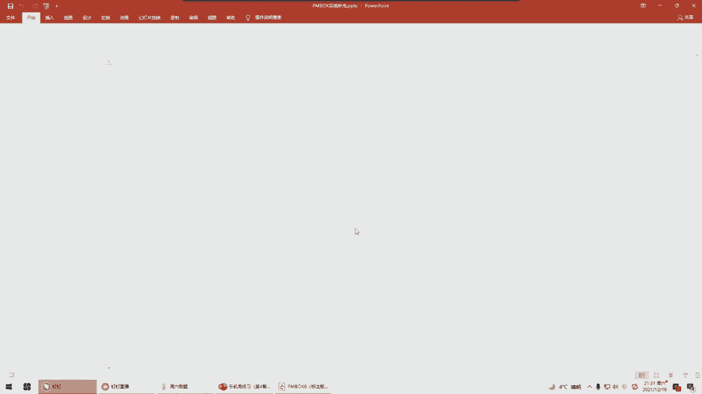
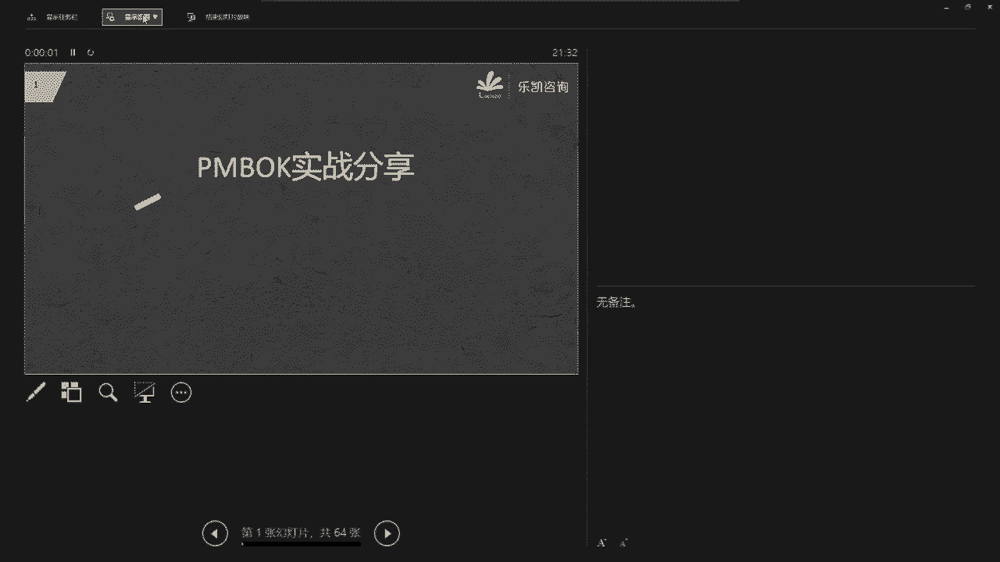
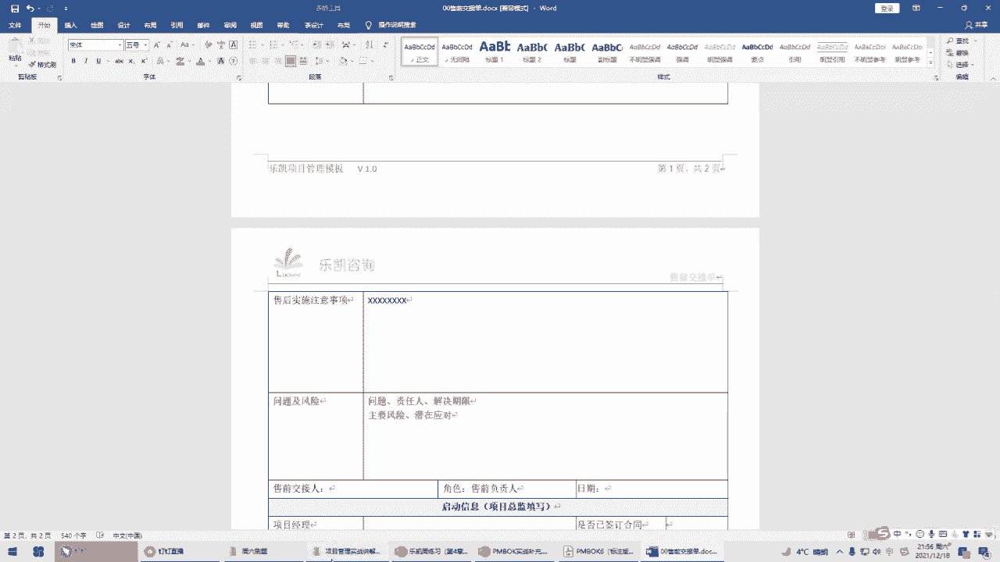
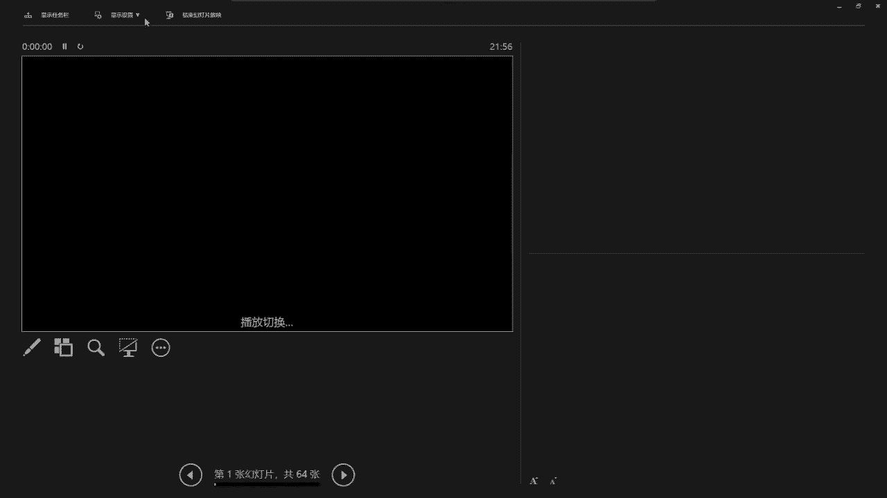
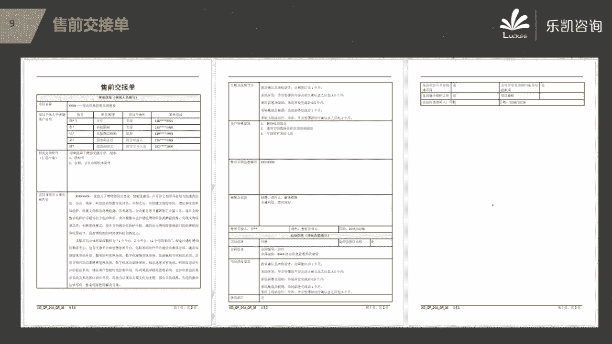

# 2022年PMP项目管理精讲课程-包含项目实战课程 - P6：第四章实战分享 - 乐凯PMP - BV11L4y1E7TC

好接下来我们这个聊一聊，关于我们是这个应该是这个星期我们第四章的学习里面，在实际做项目的时候有哪些问题，这部分内容我跟大家说一下啊。

跟考试无关，但是对你以后做项目呢会有很大的帮助，所以大家有时间的可以听一听啊，特别是这个现在考试出现这样一个情况对吧，你可以把时间集中在这个实战上面，我们上一节课呢讲了关于项目的整合管理对吧。

但是实际上呢在做项目的时候，还是有很多细节是需要考虑的，那么首先第一个就是项目经理跟商业论证的关系，那么在我们公司里面涉及到项目的这几方，但是呢我们可以分一分的一方呢持续的销售，销售就是不出去的。

联系客户的，那么还有一种职位呢，销售里面呢其实细分下来啊，授权也属于销售，但是呢很多地方呢会把授权独立出来，那么授权是写什么呢，比如说在项目之前我们要出一些方案的，那么授权呢一般跟方写授权的方案。

这种工作做得比较多，包括参与招投标，然后接下来就到了项目的实施团队，就是项目经理带领的这个团队，那么项目做完了之后，后续有指示，团队大致分为这么几块，那么在我们pp里面的第四章，一开始就说了一句话，说。

其实项目经理在项目的前期，我们就应该介入进来，包括做论证对吧，包括参与一些授权的工作好，那么在这里面问一下大家，大家平时在这个做项目的时候啊，参与这个商业论证的机会多不多，多么，其实不太多。

为什么不太多啊，因为一个很实际的情况就是我们项目经理其实平时项目是很多的，甚至有项目经理一个人要带多个项目对吧，所以说比如说像我以前我在做项目的时候，其他项目他们在前期运作的时候呢，其实不太会参与。

参与，都不太多的对吧，当然也有的人说唉我们参与的挺多的，那么如果能参与，那最好如果说本身我项目经理就有项目在贷，我可能还在外地呢，带外地的项目呢，你现在公司里面有什么新项目让我去参与社前期的论证。

我怎么可能呢，这个是不现实的对吧，另外还有一个原因是什么呢，就拿我以前的公司来说啊，我们以前的公司这帮人每年，去外面不管是有机会大于小啊，他们到外面去打标，去竞争这个项目。

知道他们1年招投标要参与多少个招投标吗，他们1年我们公司我们那个事业部啊，少说300个打底，300个太多了对吧，那么你说项目经理每个都去参与一下，这现实吗，这不现实啊，所以呢就会出现一种情况。

我们虽然说要尽量参与商业论证，但实际上项目经理很有可能没有那么多机会去参与商业论证，也没有那么多项目经理对吧，那么接下来我们要考虑的一个问题就是，那么如果说项目经理前期没有机会参与商业论证。

那么新项目开始我们应该干什么，大家考虑一下这个问题，其实这个问题是很常见的一个问题啊，就是说这个项目前期我没有参与对吧，直到项目中标了之后，或者说甚至签了合同之后，然后才把我叫过去。

那么这个时候我作为一个项目经理，我应该干什么呢，我首先第一步做什么呢，好很多人说了，我要交流，要了解背景啊，我要省商业文件对吧，基本上说的是对的，那么我们以前我在做项目的时候，我们有一个流程。

什么流程呢，我们一定要做这件事情，就是售前要有文档交接，明白吧，那么数学要交接的文档有哪些文档呢，我建议大家在一开始接受这个项目的时候，一定要看这几个文档，比如说招投标的项目啊，我们就以招投标项目为例。

首先客户那边的招标文件一定要看的，那么招标文件里面看什么，对于我们项目经理来说，着重要看这里面的技术要求和商务要求啊，比如说这个项目究竟要做哪些东西对吧，做到什么样的一个标准，然后商务要求。

比如说像其他的项目上的一些要求，什么进度啊，什么其他的要求对吧，这是客户的要求，我们一定要看的，那么除了客户甲方那边的要求，要看当时我们自己给他出的一个方案究竟是什么方案，我们也要看对吧。

招标文件是谁写的，招标文件一般是甲方写的，图标文件是谁写的呢，是我们乙方写的，那么可能有的人没有经历过招投标，那么我大致说一下，当甲方要一个东西，他有这个需要的时候，他会把自己的要求形成招标文件对吧。

然后让所有有能力做的公司，比如说用公开招投标的方式，那么让这些公司都尽量来参与招投标，那么你来参与你要带着什么来参与，你自己要给我出方案，你带着你的方案来参与这个方案其实就是投标文件。

那么我们找个时间组织专家评审来评标谁，比如说我们来打分，谁的分数最高，那么我这个项目就给谁做对吧，所以说甲方的要求是什么，我们当时乙方出的方案是什么，这个都要清楚的，那么如果说现在已经签订了合同。

那么合同我们也要看了好吧，那比如说像我这份文档里面，甲方的着重要看技术和商务要求，这是招标文件里面的，那么乙方的我们详细的实施方案，当时自己给甲方报的什么方案也一定要看清楚的。

然后合同里面要看什么合同明要看，比如说时间节点，包括付款是怎么付款的，履约保证，包括违约责任，这些都要去看一看，说一下刚刚有同学提出了几个问题，第一个问题李宇涵说的，你刚刚说招标文件是甲方写的。

图标文件是乙方写的，但实际上呢我发现我们做项目招标文件，就是甲方的招标文件，也是他们我写的好，我问一下这种情况正常吗，包括蒙瑞诚也说了对吧，甲方的招标文件都是我们写的，这种做法正常吗。

很多同学都说正常对吧啊，包括有人说老客户就是这样的呀，很正常啊，注意这种做法是不正确的，明白吗，如果你们出现这样的情况，请你把自己的嘴巴管好，千万不要到处去说明白吧，万一你在说的时候被别人录音了。

录像了，到时候你吃不了兜着走，这种做法是违法的，那么为什么这么说啊，你想一想甲方要做东西，他写一个招标文件对吧，按照道理来讲，你乙方应该出一个方案去参与投标，那么接下来你想一想。

如果甲方的招标文件是乙方写的，会出现一个什么样的情况啊，这会出现什么情况，好我举一个例子，比如说嗯，方文婧咳咳咳咳咳，小冯同学，我看他的名字啊，冯文静应该是一个女同学对吧，举一个例子，现在女同学冯文静。

他说我想找一个男朋友，那么你找男朋友，你要找什么样的，你得写一个要求出来呀，对吧好，接下来参与竞争的有谁呢，由我，啊有这个杨尚辉小杨同学，哎，还有这个李爽小李同学，然后我们三个人去参与竞争。

结果呢出现了这样一个情况，他的这一份要求是我帮他写的，你说这个时候会出现一种什么情况啊，你们想想想一想，其实就能够想明白了啊，小冯同学要找一个男朋友，人家要有要求，结果这个要求呢诶他娘的是我写的。

我把他写的这个要求，然后我还跟其他人去参与竞争，注意这个时候我的要求里面就会这么写，怎么写呢，第一我觉得我的男朋友应该比较威猛，身高要达到1米75以上，但是太高也不好，1米8以下对吧，体重要190公。

190斤以上，我写的这个要求都是以谁来写的，都是以我的标准来写的，你说这个时候我不中标，谁中标对吧，很明显我帮他写这个要求就会涉及到什么呢，我一定会有很多的控标手段，我来控兵。

当然我控标的手段不会这么明显，但是我一定会有一些控标手段的好，那么这个时候我们三个人去pk，你说谁会赢，在这种情况下，如果我都输了，我靠我还有脸混吗，对不对，所以这就会造成一种不公平不公正的现象。

明白吧，你觉得这个是法律能够接受的吗，你觉得你这个是合规的吗，很明显是不合规的，所以我再次问一下大家，如果你们发现甲方的招标文件是你们乙方帮他写的，你应该做什么，现在大家回答我。

你发现你们公司当甲方写的招标文件，这个时候你发现了你应该做什么，好告诉大家啊，应该分两种情况来说，当在考试的时候问了你这个问题，你应该做什么呢，你要说向有关部门检举揭发，注意啊，考试的时候问你选什么。

一定要选择向有关部门检举揭发，为什么大家还记得pp的第一节课，项目经理的价值观是什么吗，责任尊重，还有什么公正诚实，所以说在考试的时候问你做什么，向有关部门检举揭发，在工作中遇到这种情况，你怎么办。

装作不知道什么，甲方的招标文件是谁写的，我哪知道啊，我接手这个项目的时候已经中标了，或者说这个事情是收钱的事情啊，我也不知道啊，没有人跟我说过这个事情啊，明白吗，千万不要到处说啊。

假发的招标文件是我们写的对吧，哎你看我写的这个招标文件写的多好，我靠你这个事情一说出来很容易被人搞的，所以说这种话是不能说的啊，一定要注意的好吧，这是第一个，第二个有一些细节大家容易忽略的。

比如说刚刚在看合同的时候，比如说疫情这种东西，疫情这种东西啊，不是说所有的东西，你要看合同里面是怎么写的，所以这些细节呢都要稍微的去看一看的好吧好何应交，你说社会就是这样的，跟甲方关系好。

这个跟关系好与差没关系，因为这个是不合规的，会出事的对吧，轻则重新招投标，如果里面涉及到一些其他问题，重则坐牢好吧，所以这个一定要注意的，不是开玩笑的，那么我们前面接收到了这些文件之后，接下来做什么好。

我说一下我们以前在一开始会开一个会叫授权，授权交底会，那么什么叫授权经理会呢，就是我们授权的那堆人把这个项目交给项目经理去做，那么这里面一定要有一个交底的过程对吧，那在这个会议上干什么呢。

大家后面会有正式的文件对吧，然后销售传达一些高层级的需求，包括一些总体的要求，售前会干什么呢，在那个时候我们要求授权要讲一讲自己的方案，当时是怎么写的，然后我们项目经理要去听。

当然前期你自己要大致先看一看对吧，有问题要记录下来好大家明白能不能明白为什么在这个会议上，我们需要授权再次的讲一讲他的方案对吧，包括要做一些讨论，然后我项目经理一定要听，发现有问题我们要去指出来。

知道为什么吗，那比如说我们乙方写了一份投标文件，有方案好，在开会的时候，我请授权把方案过一遍，你这个方案是怎么写的，包括哪些内容，我项目经理听一听啊，如果有问题，我在会上我就要问你了。

你这这一块究竟是怎么考虑的，为什么要他说清楚，很简单，大家知道销售跟售前有一个什么最大的毛病吗，就这一伙人啊，有一个很大的毛病，就是容易过度承诺，什么叫过度承诺啊，就是说客户说了，我希望你们能够做到。

比如说80分好授权跟销售出了一份方案，这个方案里面写的是什么东西呢，到80分这算什么，我们公司他们能做到100分，对吧好，那么遇到这种情况，我首先问一下他们为什么要这么做，他们这么做合理吗。

比如说小黄同学对吧，就问候了这群人，哎呀，我觉得他们就是这种人对吧，怎么怎么样，但是大家要注意啊，他们这样做合理吗，他们为什么要这么做啊，大家注意啊，不要在公司内部搞对立，站在别人的角度去想一想。

我们要想拿下这个项目，是要跟别的公司干什么，是要去竞标的，要竞争的，你知道别的公司是怎么写的吗，我们在写这个照着图片文件的时候，有一项叫什么呢，叫技术偏离表，对吧，什么叫偏离表呢。

就是说客户有这样一个要求，如果你高于客户的要求叫正偏离，如果你符合客户的要求叫无偏离，如果你低于客户的要求叫负偏离好，你知道所有的公司在写的时候，他们的方案，他的偏离表是哪一种情况，起码都是没有偏离。

无偏离，甚至有部分的是什么呢，正偏离怎么可能出现负偏离呢，负偏离不就是想说我不行吗，那么你想不想接这个业务啊，要不要做这个单子啊，你公司上下这么多人要不要吃饭啊对吧，所以为了能够pk胜胜利。

他必须要写一些大的东西，或者说要稍微的吹一吹，有的时候项目经理像我们拿到他们写的这个方案，我脑子里面就有一个感慨，这他妈方案真的是我们公司能做的，我们公司能做吗，这是我们公司的团队能做的。

我们也有这个怀疑啊对吧，那么这个时候怎么办，就在这个会上，你要问一问收钱对吧，问一问授权和销售这一块究竟你们是怎么考虑的，那么你问出来之后就两种情况，第一种情况就是人家会告诉你啊，这一块是怎么怎么做。

怎么怎么做，怎么怎么做，我们在别的项目上其实已经做过了，如果你没有接触到这一块，你可以找哪一个项目经理去了解一下，那么这个就是很正常的对吧好，如果他说了，就像刚才有人说的，他就一句话，没办法呀。

为了中标，我只能这么写啊，好那么这个时候你怎么办，那么这个时候你就要跟他说清楚这一块可能存在什么，存在风险，到最后可能会造成客户的不满意，那么在这个会议上一定要当着领导的面把这些东西说出来。

为什么要当着领导的面把这个东西说出来，我发现有很多项目经理呢很傻，为什么很傻呢，给你什么项目，你就做什么项目对吧好，然后呢，销售跟售前就跟领导说了一句话，这个项目已经交给他们团队去做了，也没什么问题。

好到最后项目遇到困难是谁的问题，他们就一个结论，项目经理能力有问题，他管项目管得不好，你说你冤不冤对吧，所以说不要莫名其妙的啊，说所有的东西我全盘都把它接收下来，有问题。

在这个会议上一定要当着领导的面把它提出来对吧，一定要在会上说清楚好，说完了之后，接下来怎么办，我们以前一定会写这篇文章，叫授权交接单，好我给大家看一下这份授权交接单里面会写什么内容好吧，有的啊。

授权交接单里面包括哪些内容啊，大家大致看一下，首先前一部分是授权人员填写的，就我们公司是这样的，这个项目是什么项目，有哪些关键的相关方啊，那么在授权交接的时候，我交接给项目经理哪些文件。

这个项目的背景是什么，然后我们的工期节点是什么节点，然后用户有什么比较关注的点，或者说特殊的要求对吧，包括要注意什么好，接下来这个项目有哪些客观存在的问题，以及存在着什么风险。

这一块应该把会议上讨论的内容把它写进去，特别是他们为了招投标过度承诺的地方，为了中标过渡程度的地方，把这些问题和风险都要把它写进去好吧，这些东西都要写清楚好，写好了之后，这份文档发给谁。

这份文档开好会之后，你要发给所有的参会人员，包括你的领导，明白吧，好大家知道为什么在夏目，就是我项目经理接到这个项目的时候存在什么问题，我一定要把它写清楚，为什么要这么做，知道吗。

知道为什么我们一开始要把这些东西写清楚吗，就是我项目经理啊，我接到这个项目的时候，我就发现这个项目一开始就存在什么问题，我们在做项目的时候一定要注意的，现在存在的问题叫什么。

叫这个项目有一些先天不足。

对吧，我一般在公司里面就说这个项目有一些先天不足，什么叫先天不足呢，就是他不是我搞的，一开始就存在这些问题，那么这些问题我处理不处理的，我当然在后面实施的过程当中，我会跟客户去协商去处理的对吧。

但是第一领导要知道这个问题是客观一开始就客观存在的，这是第一点，第二点你销售也要注意，不要以为你这个项目交给我了，就没你的事儿了，我发现有很多销售有一个很不好的习惯，当项目上遇到一些困难。

我们需要客户需要销售去做一些关系啊，或者说去对吧，让销售帮我们去运作一下的时候，销售推三阻四，哎呀，我有别的项目在招投标啊啊我要去出差啊对吧，去拜访什么客户啊，我没时间。

他好像这个项目签了合同之后就没他的事了，那么在这个时候我们就要跟销售说清楚，如果以后在这些地方出了问题，我会推进，希望你们销售要配合我一起去推进对吧，不管是从实施的角度还是从商务的角度。

我们都要配合去处理好，你不要觉得项目交给我就结束了，明白吧，所以这些东西一定要有书面的东西，那么我们开完这个会发出这篇文章之后，接下来才到什么，接下来才到我们的项目的启动，那么项目的启动呢。

我们以前是在系统上面去立项，那个项目章程，在上课的时候给你们看过了对吧，那么我们启动的时候，除了项目章程，我们会写写什么东西啊，其实我们公司呢没有正式的一份书面的文件，只是在系统上立下。

以及我们的项目专用章，然后他的工作职责是什么，能做哪些事情，他有签字的，有这个有敲章的，那么另外一个呢就不太常见，叫项目的专用章，那么项目的专用章是什么意思啊，大家会发现我们以前做项目的时候。

比如说我在上课给你们看的变更单，我们乙方也要敲章的，监理方要敲章，客户也要敲章，那么要敲三，对于一个大型的上市公司来说，公司的公章，你能拿得到吗，这个公章是不容易拿到的，你比如说我们公司的公章。

它有严格的叫用硬管理，对公司这么多项目天南海北的，我靠这个公章放来放去的，这还得了公章，你要用，如果确实要用在系统上，要走流程，走用硬管理流程，走完流程批准了之后，接下来他会告诉你在几月几号到什么地方。

有人在那等着你，帮你去敲章，那么你说我们做一个外地项目，怎么可能直接去敲公章呢，好所以我们公司有这样一个东西叫项目章好，什么叫项目脏啊，给大家看我们公司的这个项目上的这个文档，这一个项目什么名称。

几月几号开始，计划几月几号完成，然后接下来他下面授权使用范围是这么说的，为了方便某某某公司在什么什么项目中及时与建设单位，这个建设单位就是甲方啊，甲方及时与建设单位，监理单位等等进行业务文件往来。

那么现在公司授权项目部领用项目专用印章一枚，那么他也说得很清楚，这个印章仅供项目组与建设单位，监理单位之间往来文件，相关技术资料以及现场签证等方面使用，不能作为签订经济合同，分包合同以及各种协议作用。

就是说这个公章是这个项目章是给你干嘛的，就是给你做一些文件的确认的，不能用来签订合同的对吧，那么这个项目章在开工之日起就交给你用了，在项目竣工之后要交回公司的。

那么项目章的用力就是上面这一圈是某某某某某股份有限公司，然后下面有一行某某某某某项目好，最后项目专用章，那么这个时候项目经理像我我就带着这个章到外地，带着我的团队去外地，明白吧。

那么这个项目章下面还有一份就是这份文档，在这份文档上面，你必须要加盖公章的，用你们公司的公章来授权这个项目的项目，当那么将来你去了外地，在外地做项目的时候对吧，你要做文件的确认，你敲什么。

你就敲项目章就行了，因为公司的公章已经授权了给你这个项目了，我们公司我以前的公司每一个项目都有自己的项目专用章，一个项目一个章，明白吧，项目结束交回去，他们怎么处理就怎么处理，所以说这个方面啊。

我觉得如果以后大家做政府项目的时候，可能会涉及到这一块的，那么当我们把这些都准备好了，有了立项利好了，专用章也弄好了，那么接下来也就意味着项目章程已经获得了批准，得到了发布了。

那么这个时候项目的启动才算结束对吧，但是要注意在这个时候还要做一件事儿啊，做什么事儿呢，这只能说我们内部的启动结束了，外部呢，我们在内部，公司内部都已经讨论好了对吧，该准备的都准备好了。

那么你总要第一次跟客户去打交道啊，那么各位你们想一想，你们第一次打算怎么去跟客户接触，好有人说开工会议，不要说开工会啊，我们p m p里面的开工会早来要在规划结束呢，那么在刚刚刚开始项目刚开始的时候。

你跟客户第一次接触，打算怎么接触，一般来说我们会约客户干什么，会开一个会对吧，我们不要说什么开工会对吧，但是我们知道我们第一次去肯定要去开一个会，那么一般来说我们通常叫什么呢，叫第一次的叫什么呢。

我们叫汇报，因为当然了，可能这个行业不一样啊，我们一般来说第一次要去找，因为我做政府项目要去找领导干什么呢，要去做第一次的汇报，汇报完了之后，接下来就是正式的动工了，对吧好。

那么接下来大家觉得这个事情应该怎么做，约时间对吧，约约时间什么时候我们去客户那边一趟，开个会，哪些人要参加这个会议呢，你打算带谁去，首先销售肯定要去的，因为客户你可能都没见过他是男的女的对吧。

高矮胖瘦你都不知道，销售肯定要去的，那么你项目经理要去了，然后项目上的一些核心人员，比如说技术经理啊，或者说帮你做项目助理的，最好的也去一下，然后到客户那边去开会，那么开会的时候你要准备什么，知道吗。

你跑过去就跟客户认识认识点个头，吃个饭就结束了，一般来说我们去既然是第一次，我们以汇报为由头跟客户见面，那么我们项目经理一般都会干什么呢，准备一份ppt，要做一份ppt了，那么我们的外部的这个启动。

我们一般会怎么办好，我们会做一个汇报，然后做好一个ppt，那么这个p p t里面会包括什么内容啊，会包括我们这个项目的建设内容是什么，建设的目标是什么，整个项目一个总体的进度是什么。

我们项目组的成员或者说组织结构是什么结构，还有在做项目的过程中遇到变更，我们打算怎么处理，那么在这里面要提及关于我们变更的处理的方法，还有我们将来打算怎么跟客户去沟通，比如说我们要定好。

我们有周丽会制度，那么我们将决定在每周的星期几我们开例会对，然后其他时间我们周报什么时候发送，包括有必要要开专题会等等，那么这些东西都要在一开始都要说清楚的，那么ppt里做好，做好了之后。

接下来就跟客户去开会对吧，把这些东西说清楚，然后另外最好的再提一下，那么接下来我们要开工了，要进厂了，那么进场开始工作的时候，我们近期的工作有哪些工作要把它描述清楚的，那么在汇报的时候。

把这些东西呢给对方的领导去讲一讲，那么讲完了之后，一般来说业主方的领导或者甲方的领导，他都会提一些要求的，那么这个时候特别是做政府项目的，要注意一下啊，领导的要求一定要认真听。

为什么说领导的要求一定要认真听，特别是政府项目，你问下面的人行不行，他们是没有什么思想的，所谓的行不行，是领导说行就行，所以领导的想法一定要认真听吧，听完了之后，接下来如果需要表态，你就表个态。

如果不需要表态，那么你就复述一下或者总结一下，然后接下来出一份会议记啊，好会议记啊，我上课的时候说过，这个第一份会议记啊，其实是比较重要的，那么我以前做项目，当我去客户那边开会的时候。

我第一件事情会干什么啊，我第一件事情会让我的项目助理去问清楚他们的打印机是怎么，连甚至啊我都见过做的很绝的，有的项目经理他妈带着打印机去现场，然后第一次开会，开会的时候，会议之前我们就写好了会议纪要。

在开会的过程当中，如果有修改了，就修改一下，因为第一次到会议呢，其实没有什么决策的，都是一些不痛不痒的一些东西，对吧好，当场把会议纪要打出来，然后交给谁呢，注意啊。

甲方那边一般会有一个我们所谓的叫对接人，那么这个甲方的对接人实际上就是甲方的项目经理，那么我们当场把会议记要打印出来之后，就交给甲方的项目经理去签字，明白吧，就项目经理我自己先把名字签好人。

然后接下来再交给甲方的对接人，比如说甲方的对接人叫冯文静，对吧好，我就在会议会场当着这么多领导的面把这份文件交给他，爱冯老师，这是今天的会议记啊，您过目，您看一下有没有问题，如果没问题的话，请在旁边。

你也签一个字，大家知道为什么在第一次开会的时候，最好要会议纪要上让他当场签字吗，这样做的目的是什么，你说第一次会议又没有什么需要决策的第一次吗，不就是大家第一次见面嘛对吧，哎我们把表个态。

领导们提个要求就开了这么多会，你说会议纪要里面有什么很特殊的东西吗，也没什么对吧，那么为什么要第一次开会，我就让他签字呢，这个也不涉及到什么很重要的东西，保留证据对吧。

其实啊最主要的目的在这个会议上签字，最主要的目的呢是让他养成习惯，大家要知道啊，我们在后期后续有很多重要的工作是要签字确认的，比如说什么工作啊，比如说在需求的确认，在设计的确认。

这些一般都是要甲方去签字的对吧，那么你想一想，如果说从一开始你就没有让他签字，结果等到了需求的时候再让他签字，他心里有个什么感觉啊，他心里会想靠，从来没签过字对吧，怎么突然他们到需求这边让我签字确认啊。

这小子是不是在里面埋了一些坑啊，我靠这个字我不敢签，是不是，但是如果说你在一开始就让他知道我们这个项目，我们的乙方公司是很专业的，他们从第一次开会，会议纪要都要签字对吧，那那么逐渐的他就习惯了以后。

对于亲子相对来说就比较好接受一些，是不是，所以说大家要注意啊，其实客户的习惯是需要培养的，是需要培养的，客户可以不专业对吧，哎客户可以这个怎么怎么样，但是我们要引导客户从一开始就要知道我们会议纪要。

我们重要的文件都是需要签字确认的，明白吧啊有的人说，那如果我交给他签字，他不肯签怎么办，你放心好了，在这种场合下面，99%的情况都会签字啊，你知道这是什么场合吗，这是第一次见面的会议啊。

甲方的领导也在我们乙方的领导也在监理方，一般也会在包括我以前做国家的示范项目，专家组也在人家当地的，比如说在成都，四川大学的教授对吧，中科院的社科院的都有人在在这种场合下面对吧，我也做得很正规。

拿过去给你冯老师签字，你冯老师在这个会上你不签，我靠，在刚刚讲沟通的时候，我们还说过要签字，刚说完给你签，你就不签，可能吗，不可能的，所以我做的项目在这个时候都很痛快的把字签了。

所以说这是一个很好的机会，一定要去培养他的习惯，那么就是在外部启动的时候，我们要做的一些工作，我觉得这样做的是比较好的，那不过接下来启动完了之后，你该进场的时候就进场到项目现场。

那么一般呢我们可能要准备一些爆伤要交给监理的对吧，比如说一些人员的资质要提交啊，比如说涉及到一些工程的对吧，特别是用火的，用电的对吧，比如说什么动火证啊等等，这个你该准备的该怎么准备准备准备对吧。

然后你就开始去干了，好郭元培问了一个问题，对方的领导要签字吗，注意啊，领导是不签字的，一定要注意项目经理让谁签字，让甲方的对接人签字，不要找他们领导签字，领导是不会拉下脸来签这个字的啊。

找他们项目经理就行了，好吧好，那么启动做完了，接下来进入规划，那么我们第四章的规划呢就做了一个整合，没什么好讲的对吧，执行也没什么好说的，整合都讲的很概括。

那么接下来监控项目工作讲了一个东西说我们要做报告，那么关于报告这一块呢，跟大家说一下啊，在我们平时管项目的时候，最常见的报告就是两个报告，一个报告叫周报。

还有一个报告呢就是每隔一段时间我们要做一次状态报告，汇报项目的一个总体的状态的，那么这两份报告呢我都跟大家说一下啊，首先我相信很多同学都写过周报，那么你们写周报包括哪些内容，能不能说一下。

比如说我们每周都要组织开一次周例会，然后呢开周例会之前周报要发出去的，那么周报里面大致要包括哪些内容，啊有人说写日报对吧，这个日报的说实话我感觉很耗时对吧，一般我觉得一周嘛对吧，说一说就行了。

有人说得很对嗯，本周的一些总结性的工作对吧，本周计划做什么，我做了什么，给大家看一份周报好吧，这是我以前做项目写的周报啊，嗯，首先呢周报写清楚几月几号到几月几号对吧，然后周报的第一页是什么东西呢。

项目的一个总体的状态，这个状态是随着你每一周的工作更新的，比如说当前项目总体状态是什么状态，这一周一共投入了多少人天，截至这一周为止，整个项目一共投入多少人听，那么这个项目有哪些关键的里程碑。

这些里程碑现在完成的情况是怎么样的，这是一个总体的概况，然后接下来就是好这一周计划做哪些事情，那么这些东西究竟做完了没有，哪些是已经完成的，哪些是未完成的对吧，然后下面就是每一条的详细的一个描述。

把它描述一下啊，好然后接下来下周我计划做什么工作啊，好另外还有一块就是重要的，目前我这个项目需需要协调的问题是什么，或者存在的风险是什么，这一块一定要写的，那么这就是一份周报，其实大家说的都差不多对吧。

无非就是这一周计划做什么，然后我实际做了什么对吧，那接下来下周我又是什么计划，然后现在我遇到什么问题，或者说我觉得存在什么风险啊，那么这一份周报做完了之后，接下来我们要发发给谁呢，要发给领导好。

发的时候应该怎么发，那么大家注意啊，我建议大家发周报要怎么发啊，要这么发，因为我那收到很多的周报，项目经理又发了周报，我看了之后很恼火，我往往收到一份周报，是这样的，某某某项目项目周报对吧，发起人是谁。

抄送给谁好，接下来邮件的正文，下面有一个附件是周报对吧，好邮件的正文，fy i，行不行，就这种项目经理给我发周报，发成这个样子，发一次我就骂一次他，你邮件的正文就三个字母啊。

sofyi for your information，然后接下来我怎么办，fy就是很简单的意思给你的信息，for your information，然后你要看怎么办呢，你自己去下载附件去看吧。

靠这样是不行的，明白吧，就因为有的时候我是用手机，用手机，我打开之后还要下载附件，很麻烦对吧，所以呢我建议大家发周报啊，不要这么发，你怎么发呢，要这样发，某某某某某项目周报对吧，然后发给谁。

然后抄送给谁好，接下来正文应该这么写，首先某某某领导本周的工作内容如下，这一周我们主要完成了123对吧，然后接下来特别是目前我存在什么问题，或者说我项目有什么风险啊对吧，另外要注意的。

每个公司都不缺提问题的人，但是缺什么缺解决问题的人，所以说你不要只写问题对吧，你问题要写，你最好写一写，我打算怎么去解决这个问题，那么在解决的时候我需要什么支持，还是说我需要人，还是说我需要什么。

这些都要写清楚的好，然后接下来详细内容请领导对吧，查阅附件，核心的内容一定要在正文里面体现的，因为领导有的时候很忙的，你没有时间仔细的看附近，他可能只会扫一眼你存在的问题，或者说风险是什么，明白吗。

你要吗，在提问题，提问题的时候，顺带带几个解决方案，让领导去选择一个对吧，我们常说的让领导做选择题，不要做案例分析题，要么就是说这个问题我打算怎么解决，那么解决这个问题需要持续性配合，对不对。

都要把它写清楚的，然后再去发明白吧，所以发周报一定要会发，不要乱七八糟的，就就给三个字母，另外还有一个细节要注意的啊，发给我们内部的领导和外部的客户的周报，很有可能是两份啊，明白吗，就我以前做项目。

一般来说每周写的周报啊，是两份周报，一份是发给我们领导看的，我们公司的领导机这个项目什么情况，存在什么问题，我需要怎么怎么解决对吧，还有一份是发给客户看的，这两份会有一些出入的。

因为有一些问题我是不能让业主放到领导看到的，比如说我举一个例子啊，你们公司现在人员比较紧缺，人力不足啊，说的问题是我们公司在这个项目上投入是不够的，我希望领导再给我投入什么什么资源。

不过这一份周报你发给自己的领导是可以的，你能发给客户吗，能在给客户的周报里面把这个问题写下，写上去，说目前存在的问题，我们公司人员投递人人人人员的投入不足对吧，尽管要投入多少个能力。

实际上到位了多少个能力，你能给客户这么写吗，我靠你给客户这么写，客户一看马上就要掀桌子来对吧，所以说周报有可能是两份，这个如果有必要，肯定是需要这么操作的好吧，那么这一份是周报。

那么接下来还有会议纪要呢，我们在上课的时候讲过了好吧，还有一份是什么呢，就是我们的工作绩效报告，那么工作绩效报告是什么呢，实际上就是我们所说的状态报告，给大家看一份状态报告的例子。

那么这是一份很简单的状态报告，就是每隔一段时间，我们往往是一个阶段快结束的时候，做阶段汇报的时候，我们会写这份状态报告，那么状态报告包括什么呢，就包括这么几个内容，首先第一个当前这个阶段啊对吧。

大致的一个完成情况有一个概述，然后详细的，像我这个项目有十几个分包，每一个分包他我们当前是什么情况，计划是什么，实际是什么，有没有偏差对吧，那么预计什么时候能够完成好。

然后接下来你会发现有的系统它的进度，就有的工作我们的进度是有偏差的，比如说确实落后了很多，这个时候怎么办呢，我会写偏差，它的原因是什么，什么原因造成的，我们这几个工作偏差这么大。

然后接下来那注意不光要写问题，还要写你打算怎么解决它，所以后面我写了偏差，我打算怎么去纠正，对吧，然后接下来还有我们可能会做什么变更啊，然后目前存在哪些风险，对那么一样的，目前这个项目有什么风险。

这个风险会带来多大的影响，那我打算怎么去应对这个风险啊，然后最后就是下一个阶段，我打算主要要做哪些工作啊，那么这份报告基本上呢是比较简单的一份报告就说清楚了，我这个项目当前是什么情况，存在什么问题。

怎么纠正，存在什么风险，怎么应对，然后下一个阶段我会做什么工作，把这个项目的状态描述清楚，所以说报告这一块啊，我大家呢可以去看一看，因为项目经理呢不可避免的肯定会写很多的文章和报道的好，接下来变更。

那么关于变更这一块，我跟大家说一下啊，该讲的呢我们上课都讲完，实际工作的流程跟我们上课讲的呢差不多，我们实际工作也一样，要停变更申请单的，那么关关键是什么呢，在实际做项目的时候，有一个地方是要注意的。

就是这个变更我们什么时候提，什么时候开会，那么大家要注意啊啊啊，在这一块一定要有一个注意点啊，我们开会不是，其实我们很多会议啊，在项目上，我们很多会议并不是为了讨论问题，我们更多的是在会议上来形成决策。

在会上大家表个态，究竟这个变更通过还是不通过啊，有人说，那你这个其他的工作在什么时候做呢，好大家要注意，其实我们变更在私下都已经协商过了，我不知道这一点大家能不能体会啊，比如说客户说要加一个什么工作啊。

所以评估了这个工作大概需要多少时间，多少钱啊，那么这个时候我应该怎么做呢，好在开会之前，我首先要私下去跟谁说呢，在我们国内做项目，如果有监理方的，我首先要私下跟监理方打个招呼。

哎比如说现在业主方那边提出来要做一个什么东西，这个东西呢我评估了一下，大概要多长时间多少钱，那么为什么要这么多钱，大致的这几个我大致跟你说一下，那那么一般经理如果觉得没有问题呢，他会说。

那么你也跟业主房先沟通沟通试试看吧，看看他们什么态度嘛，对吧好，然后我们再找业主方，比如说甲方的对接人，大家去聊一下这个事情，大家都聊得差不多了对吧，该谈判的该他妈讨价还价的。

实际上在下面都已经做得差不多了，然后接下来好，我们再组织会议，把监理方，把专家把其他人请过来对吧，然后开一个专题会议，针对某一个东西的变更，打算怎么做，然后需要多少钱，然后在会上就开始表态了，对吧好。

接你方找个泰，基本上唉是合理的，业主方表个态，他们没什么意见好，那么变更干大家敲章流程走掉，那么如果说你在开会之前不事先跟别人去沟通沟通，直接在会上把把这个事情提出来，比如说客户要加一个东西好。

你马上组织会议，说这个东西要多少钱，多少时间在会上把它提出来，这个时候会遇到什么问题，是，在会上直接说会有什么问题，知道吗，他就会造成各方都不满意啊，什么意思，监理方心里会不满意，为什么呢。

监理方心里想靠这么大的事情，事情都不跟我说一声啊，直接在会上就捅出来了，你让甲方怎么看我，监理方心里不满意对吧，业主方也不满意，靠这么多钱啊，这个东西我靠，我怎么决定，我考虑一下。

然后业主方说不定还会问一问监理方，诶，你们监理方知道这个事情吗，沟通过吗，所以在会上提出来，基本上百分之百是死的，对前一定要说的差不多了，然后在会上走个流程，表个态就结束了，明白吧。

所以这个细节一定要注意的，不是所有的事情都是直接拿到会上来讲的，在汇钱你肯定有很多工作是要做的，那么单纯的说变更流程，这个流程他没有什么问题的啊，我觉得书上的流程跟实际的工作几乎是一模一样的。

注意细节就行了，那么最后还有一个收尾，关于收尾这一块，我说一下啊，周围这一块呢，其实我在上课的时候，已经大势的讲了，收尾的流程，包括提验收申请对吧，包括甲方呢这是我的项目上，甲方在我提了验收申请之后。

发给我的一个验收通知，对人家会说的很清楚，通知在几几年几月几号开始验收对吧，然后接下来验收会议的流程，那么我们上午呢是甲方跟他们领导汇报，下午呢是我们组织专家验收，那人家也会写得很清楚。

什么公司几月几号几点到几点对吧，然后那包括会议地点在什么地方，谁主持仓会人员，专家组有谁对吧，比如说什么中科院的呀，社科院的呀对吧，包括等等等等等等，这些人都会跟你说好的，然后接下来业主单位是谁。

上级主管单位是谁，承建单位是谁，然后会议的流程也会说得很清楚对吧，然后接下来你去看验收会，那么在收尾这一边，在实际做的时候呢，有一个很大的难题，什么难题呢，其实我们在刚刚做题目的时候呢。

也说到了这个问题，你们觉得我们项目收尾这套程序走完了之后，最终也说完了，一说后续的工作应该谁做呀，问一下各位啊，如果有做过项目的，你们项目做完了之后，接下来项目后续的维护交给的声音，很多人说交给他运营。

那么关于这一点呢，我说一下啊，首先第一个我们在上课呢提到过一下，其实严格的说不应该叫运营啊，再说一下这两者的区别，一个叫运营，一个叫运维，就这两个呢是完全不同的，是那么什么叫运营，我说一下啊，举个例子。

比如说我现在帮京东还发了一个网站啊，就给他们做网站的，那做完网站之后，这个项目结束了，这个网站也上线了对吧，大家可以在网上登录京东去买东西了，什么叫运营的好网站上线了之后，他他一定会有人做什么事情呢。

我们要上传商品吧，然后客户登录我们网站选了商品，下了订单之后，我们要处理订单吧，我们要发货吧，也就是说用这套东西干什么呢，在进行经营性质的工作的时候，这叫运营，啊运用这个网站来干什么，来经营嘛。

来赚钱嘛，好我在用的时候，我忽然发现这个网站上有一个问题啊，之后呢报错或者点了之后没反应，好像出了bug，像这种网站本身出了问题，需要有人来处理吧，好那么这个时候让谁来处理。

一般来说就会由这家公司的运维来处理，来维护库网站，包括可能服务器啊等等各个方面都要去维护啊，都要去保养啊，对吧等等，那么其实运营跟运维是两码事儿，那那假如说我们项目做完了，理论上来简单应该是交给运维的。

唉或者像言上会说的维保都可以，问题是我们做完了之后，项目经理能够把这个项目这么简单的交给运维吗，学生这是很难教的，对吧，为什么呢，比如说第一种情况啊，很多公司根本就没有运维部门啊，交交个屁啊对吧。

连玉卫生间都没有，你怎么教，所以说有很多项目经理就变成了一种什么情况，就是项目做一个你的责任就中一分去做几十个项目，然后就有几十个项目的这个客户啊，不断的在打电话找你做后续的一些事情。

到最后就是你项目做的越多，你项目经理就越累，为什么呢，因为这个项目交不出去啊，只要不离职这个项目你就得管，这种做法呢是很累的一种做法，你做到最后越做越多，越做越多啊，人类的。

那么这个应该到应该怎么去处理这个事情，比如说李世民说我们公司现在就是这样，你就要注意啊，首先呢这个做法很不好，为什么很不好，你要让领导知道我，我们现在带的项目越来越多对吧。

我可能每天一要花到60%的时间干什么呢，去处理老项目，真正在新项目上可能只能投入40%的时间啊，我是深有感触的啊，我有一次我跟我的项目助理说，我说我那天一共接到了76个电话，就我接电话接了76个。

其中他们有53个都是老项目打给我的，好这个时候一定要跟公司提，这样下去肯定不行，那么我们建议是什么呢，对了要成立运维部门，如果公司有这样的条件，一定要成立运维部门，那么如果要成立运维部门。

如果公司有这样的条件，运维部门成立了之后，那么我就要注意一件事情，什么事情呢，一定要做好我们项目跟后续的运营的过渡，是说有了运维部门就能够解决问题的，一定要有过渡，那么怎么去过渡呢。

好大家一定要注意项目实施期间这种方法，一种是项目的实施期间，运维到人到项目上来参与这个项目啊，你知道什么时候一直到项目的收尾啊，这样做的目的是让这个人能够熟悉我们这个项目，那么最后这个项目移交的时候。

移交给运维部门的这个人，这种方法明白吗，就是在我实施期间，运维部门就已经派人到我项目上来了，然后至少在中期实施的过程当中，就有人来了，来了之后做完了这个项目移交给运维，那么这个人继续维护这个项目。

第二种做法呢我也见过，就是项目做完了之后，项目组里面留一个人到奥运维一下去待一段时间啊，那么这样做的目的也是把这个项目都给预备团队去负责，所过渡一定要把它做好啊，不管是运维派人到我项目上来。

还是我项目做完了，有一个人到运维那边去待一段时间之，一定要做好这个过渡对吧，一开始多多少少都有些困难，那么一般我们在项目收尾的时候啊，我也会跟客户说清楚的，我一般有后续维护的，叫第一联系人。

第一联系人我们可以联系运维上面的这个人，如果实在有问题解决不了，那么可以找第二联系人，或者说你联系不上这个人，找第二联系人，那么总之要配合把这个项目平稳的过渡给运维这一块，这是有条件的时候啊。

建议公司要成立这样一个运维部门啊，这部分也很重要的，也是需要人力的一因为我们有很多项目，它的运维阶段也是作为一个项目来做的，比如说典型的运维项目，运维1年给多少钱对吧，那如果说没有条件怎么办。

那这个就没有什么很好的方法，那以前曾经用过一个方法，就我们公司没有成立一个比较完善的运维部门，那么只有你项目经理管，那么项目经理管怎么办呢，啧我们以前的还好，有一个事情就是项目经理他会带好几个助理。

啊那接下来项目做完了之后，你让助理呢去联系一下客户，如果有什么问题，先让助理去解决，他本身以后也要作为项目经理谈谈，他也要需要了解这一块，那么让助理去帮你分摊一些工作。

那么你项目经理的还是集中到新的项目上，那么这个方法呢能够稍微的撑一撑，但是呢也不是一个长久之计啊，所以说我觉得这个你看你们公司现在是什么情况，如果说公司没有这样一个部门，那么你最好呢其他人帮你分担分担。

不要觉得现在哎我一个人能够搞得定，你到将来啊很有可能是搞不定的好吧，那么收尾这一块，第一个要注意这个问题，运维怎么去弄，第二个呢就是说我们收尾的时候，关于这个文档的归档，尽量归档归档什么呢。

归档纸质文件，如他说你项目做完了，纸质文件违法归档，那么你归档什么呢，把你的项目的资料扫描一下，把电子档把它归档给归好对吧，你该存档的存档，那么以后如果要查的话，还是可以查的。

那么第三个要注意的地方是什么呢，就是我们收尾一定要快，不要拖对吧，一拖呢就夜长梦多，说不您的客户再提一个新的需求，或者让领导再换一换，那就更加的头疼好吧，那么收尾呢主要的其实在上课的时候。

它的整个一个流程跟大家都说过了，也没什么好多说的，那么我们第四章我觉得我要补充讲的呢也就这些好吧，那么大家呢可以这个在钉钉上面去下载相应的这个模板好吧。

在钉钉上面有我这一套模板，也有这个其他的一些完整的模板，大家需要的可以到d盘里面去下载，那么我希望呢大家在这一次这一期的学习当中，既然当考试没那么急了，大家可以多聊一聊对吧，实实际工作中的一些问题。

就是我们每学到一张，我们都去看一看，实际工作中跟橡皮里面有什么不一样的地方，那么为什么会造成这种情况啊，包括我们有什么细节可能是p p里面没有讲到的，我们要注意的好吧，我们每周六都会有这样一个讨论的好。

那今天呢我们就先到这里啊，大家还有什么问题也可以在群里面相互的交流，包括如果有一些好的做法，我也很希望大家能够分享出来好吧，如果大家发现啊，我们这一期这样如过我们后续在讲的过程中。

大发现也有什么比较好的经验可以分享的，我欢迎大家分享好吧，那么如果说分享的我觉得是很有价值的东西，那么我会我会到公司去拍一些这个礼品，过年的礼品，然后呢我会啊我下周去跟他们讨论一下。

因为这个总同时调整的对吧，然后我昨天晚上也在一直考虑这个问题，我们怎么样把其实做得更好一些，所以呢我觉得我可能有这样一个打算，就是说我们要让大家来学着去分享分享一些经验。

然后如果说大家分享的东西还不错的，那么我会留出一些预算出来给大家买一些礼品，然后快递给大家好吧，那么我希望大家在这边虽然说是推迟了对吧，但不管怎么说，这段时间不光能够学到一些东西。

那么更多或者是怎么样把学到的东西应用到我们的实际的生活，或者说项目上去，好吧好，那么今天我们就先这样后续的课程的调整啊，我们会及时的去这个日程把它给发出来，包括后面我们举办了这个分享的活动。

究竟怎么来做，我们下周会把它讨论出来，好吧，到时候大家看一看，都叫我老师给我发的通知，好吧好。