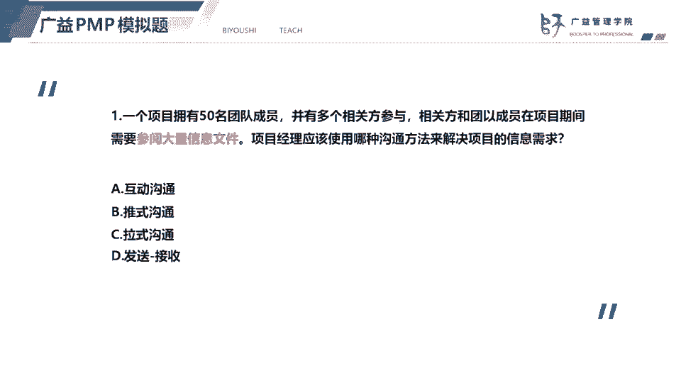
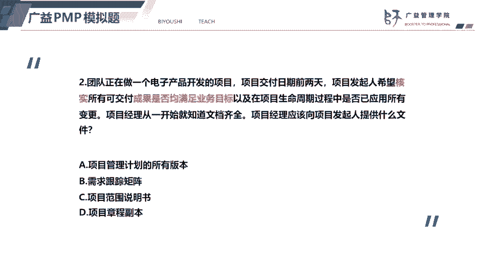
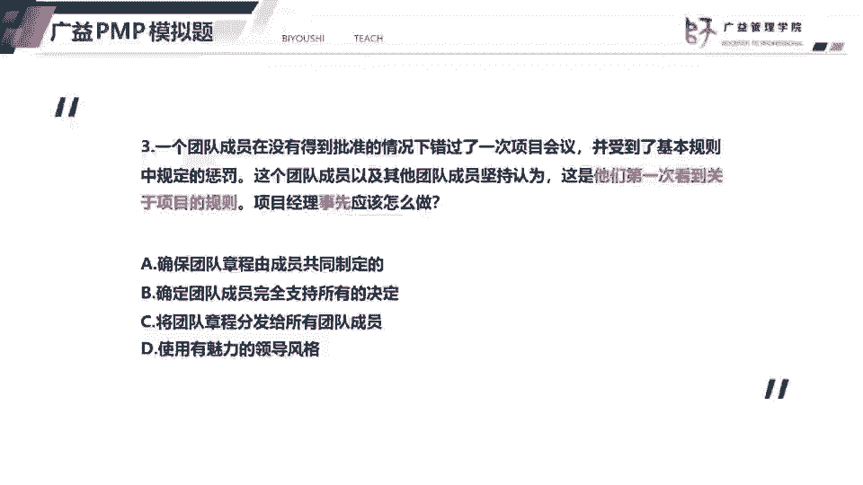
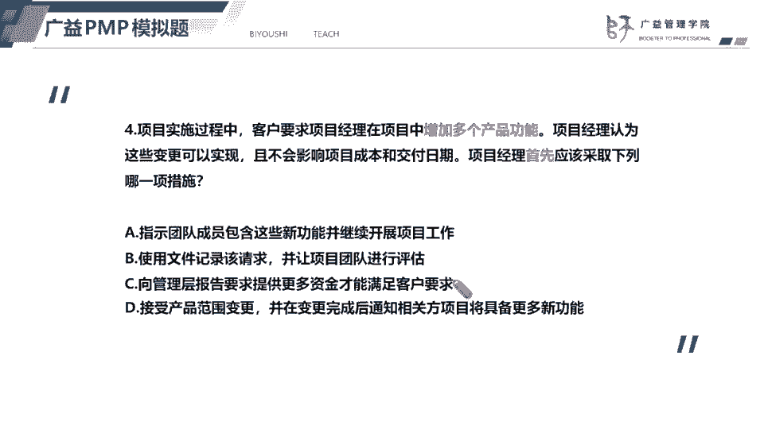
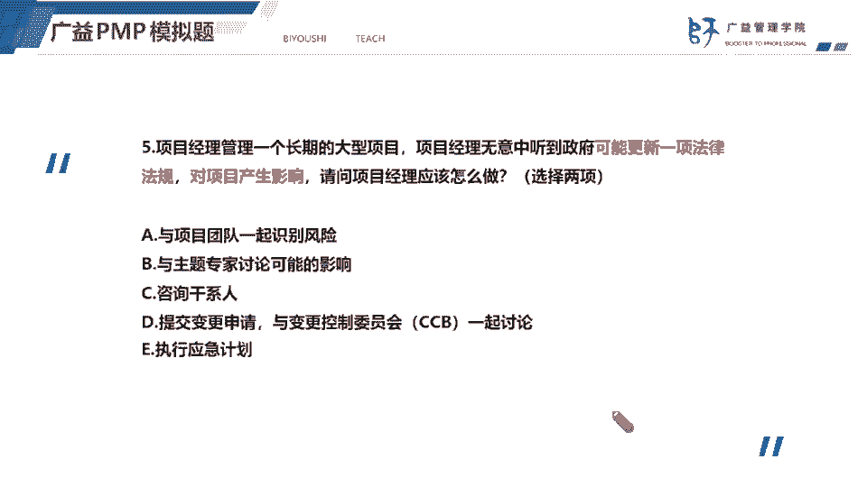

# 2023年PMP认证考试题目解题最新完整免费课程50题（1-5题） - P1 - 必有师广益PMP项目管理 - BV1MW4y1V7Bk

各位同学大家晚上好啊，我是广义学院的刘老师，我们对这个重点的题型进行一个讲解，在开始讲解题目之前呢，我想跟大家先分享一下这个解题的一个思路，首先呢就是我们要判断题目的时间点。

判断题目的时间点是属于启动阶段，还是规划阶段或者是收尾阶段，那么我们可以如何去判断项目的时间点，题目的时间点呢，关键词比如新项目识别相关方，制定项目章程，说明题目是属于启动阶段，如果是编制计划。

准备召开开工会议，说明它是属于什么规划阶段，如果是分析偏差四两个项目的绩效，那么说明它是执行阶段，如果关键词是可交付成果，移交调查相关方的满意度，那么说明它是什么收尾阶段。

那么我们判断这个题目的时间点啊，有助于我们去缩小解题范围，其次呢就是我们要注意题目交代了哪些信息，比如说项目类型是预测型项目还是敏捷型项目，或者是混合型项目，因为现在新考纲的考试呃。

项目的类型就会包含预测敏捷或者是混合型，首先是刚才说了，首先是要看看这个项目类型，其次呢是看问题是什么，注意题目交代了的问题是什么，是发生了冲突，还是向外方不满意，还是质量不达标。

又或者是说这个放这个可交付成果，没有获得验收等等，第三呢就是说我们要还要注意一下，题目中交代的制约因素，比如说题目明确告诉我们没有预算了，无法增加资源，那么我们就不可能去使用赶工。

如果题目告诉我们相关方，它就是没有办法来开会，那么我们就不可能选择那种，强制要求相关方来开会的，或者题目已经告诉我们是属于活动之间，是属于硬逻辑关系，那我们就不可能去选择快速跟进。

然后第三第三第三点呢就是说我们要看题目，让我们解决的问题是什么，有些题目呢他虽然说的是啊，团队成员因为发生冲突了，导致进度落后，但是呢题目最后问的，不是要我们解决进度落后的问题。

而是说如何去建设一个高绩效的团队，那么这一点呢大家一定要看题目，最后让我们解决的问题是什么，而且特别要注意，是说要求项目经理现在解决问题呢，还是事先要怎么做，或者是说将来要怎么做，这些呢都是有区别的。

好我们来今天看一下今天的第一道题目啊，今天的第一道题呢，他说这个项目啊有50多个团队成员，有多个相关方，而且呢信息量很大，题目问的是，用哪一种沟通方法来解决项目的信息需求，这道题的考点就是是沟通方法。

我们知道有三种沟通方法，一个是交互式沟通，也称为互动沟通，还有一个是退市沟通，还有一个是拉式沟通，那么不同的沟通方法呢也适用于不同的场景，首先呢这种互动沟通，他就是双方或多方实时沟通。

能够及时的获得反馈，一般情况下呢，就是有一些重要的事情需要商议的时候，比如说获得项目管理计划的批准，获得项目章程的批准或者变更请求的一个批准，我们都会使用交互式沟通，那么其次是推式沟通。

推测沟推式沟通呢，就是说我主动的把信息发送给对方，但是他有个缺点，就是推迟沟通呢，他不一定能让对方准时，或者说及时收到信息，对方也不一定能够准确地理解信息，推销沟通很典型的就是发邮件，写信等等。

还有一个是拉式沟通，拉式沟通呢它适用于啊沟通对象不明确，或者说沟通对象很多，而且需要发布的信息量很大的情况，拉丝沟通通常会用平台，比如说这个网络平台来，啊去发布信息嗯，举一个例子。

我们同学参加这个p mp考试基金会呢，他通常都是会通过官网和公众号来传递信息，这就属于什么拉丝沟通，因为考生很多，然后呢分布在全国各地，所以呢就只能通过拉式沟通的方式，来传递这个报考信息，回到题目中呢。

第一题呢他就要选择什么选拉式沟通，选c好。

我们看下一道题，下一道题题目告诉我们啊，这个发现希望核实所有的可交付成果，是否满足业务目标，那么项目经理应该向发起人提供什么文件，叫核实这个可交付成果是否反对业务目标呢，我们可以采用需求跟踪矩阵。

我们知道我们在收集需求的过程中呢，会把d把需求啊分别记录在需求文件，还有这个需求跟踪矩阵，而需求跟踪矩阵呢它有两个作用，也就是它是可以对需求进行一个什么双向跟踪，通过正向跟踪呢，我们可以防止需求被遗漏。

防防止需求被遗漏，确保需求最后能够交付，而反向跟踪的这个需求跟踪矩阵啊，我们就通过反向跟踪，我们就可以发现这个需求的来源，找到需求的源头，所以呢这题答案应该选择b需求跟踪矩阵。

需求文件和需求肯跟踪矩阵的，相对而言，需求跟踪矩阵考的更多一点，因为它能够跟踪需求的事情，跟踪需求的实现情况，防止需求被遗漏，所以答案就选择b第二个，那么选项a项目管理计划的所有版本，项目管理计划。

确定了项目执行监控和收尾的方式，但是呢它不符合这道题的题意，然后选项c这个范围说明书，范围说明书明确的项目的一个边界，它也包含了产品范围描述，以及可交付成果验收标准，但是呢他也不及这个需求跟踪矩阵呃。

是相对而言，叙述跟论据阵会更符合题意，而选项d项目章程，项目章程包含的都是高层级的信息，比如说项目目的项目目标，项目成功标准以及高层级的范围，进度成本质量的信息，所以没有办法核实是否满足业务目标。

好我们看下一道题。

下一道题，这个团队错过了会议，受到了惩罚。

但是团队成员认为什么呢，他们是第一次看到项目的规则，题目问我们项目经理事先应该怎么做，注意问的是事先，那么事先怎么做呢，其实就是让我们要避免题干中的问题，而不是让我们解决现在题干中出现的问题。

那么我们都知道基本规则，它是记录在团队章程里面，那么团队章程呢最好由团队成员共同制定，这样子呢更有利于啊，大家去拥护和认可团队章程的内容，特别是基本规则，大家一起明确基本规则。

那么大家也会更好地去遵守项目的基本规则，所以答案就选择这个a第一个，好，那么选项b，这个确确定团队成员支持所有的决定，支持所有的决定呢，这个有点不太现实，而且呢就是他不太符合提议。

选项c呢还还是由项目经理自己制定团队章程，然后发给所有的团队成员，那么选项c呢，如果题目如果说项目经理现在应该怎么做的话，那我们就可以把这团队章程，分发给所有的团队成员，但是他问的是事先怎么做。

事先最好是由团队成员共同制定，才能避免第一次看到项目的规则，那选项d强调的是啊领导风格的类型，那么这个不符合题意。

好我们看第四题，第四题，增加多个产品功能说明什么，说明就是要做产品范围变更，那么产品范围变更肯定就涉及到范围基准变更，所以呢项目经理要受理客户的一个变更请求，记住项目经理呢它是受理变更请求。

如果涉及到范围基准的变更，一定要有并能控制委员会，c c必须审批，如果没有涉及到范围基准的变更，可以由项目经理审批，项目经理呢不要直接拒绝，果实是忽略客户的一个变更请求。

此外项目经理一定要对变更进行书面记录，所以呢变受理变更请求的第一步，是记录变更请求，然后再评估变更影响，并将变更的影响告诉给这个提出变更的相关方，回到题目，项目经理。

首先应该做的就是b用文件记录变更请求，变量团队进行评估，也就是评估变更的影响，因为我们受理相关方的变更请求，我们要把它记录下来，然后呢记录这个变更的好处是什么，就是说防止变更被遗漏啊，记录了就有迹可循。

所以呢我们要记录下来，记录下来以后要评估变更的影响，并且把这个影响告诉给相关方，相关方听了以后，如果觉得他觉得影响太大了，那么他可能就会啊停止变停止要求变更，但是如果相关方坚持要变更。

那么我们下一步就是要把变更提交给c c，b区审批，cc b审批以后呢，我们还要及时的更新项目计划和文件，一定是更新计划和文件以后才会实施变更好，我们看选项a这个直接就要求啊，直接让团队成员实施变更。

这个肯定是错的，违背了整体变更控制的流程，选项c要求更多的资金才能满足客户要求，而题目中没有告诉我们增加多个产品功能，需要更多的钱，所以选择c被排除，选项d这个接受产品范围变更，然后呢在变更完成后。

告诉相关方项目将具备更多的新功能，这个也是违背了整体变更控制的流程，一定要走变更流程，一定要先记录评估，要提交审批，才能够实时变更，变更的题目呢在每一次考试过程中。

每次考试都会考到是一个非常重要的一个考点，所以大家务必要重视，而且呢变更一定要遵循这个变更控制流程好。

我们看第五题，第五题，项目经理管理一个长期的大型项目，他无意中听到可能更新了一项法律法规，对项目产生影响，可能你产生影响，说明这是什么，这是风险，大家一定要能够区分这个问题和风险，问题是已经发生的。

风险时还没有发生，可能发生，也可能不发生，它具有不确定性，而问题和风险呢他们也有一个关系问题啊，风险发生了，它就变成了问题，那么问题呢解决了，但是有可能会再次发生，也就是潜在的风险。

那我们能够让我们在题干中啊，一定要注意，凡是涉及到可能发生的可能产生的影响，那么它都是属于什么风险，我举个例子，进度可能会落后，它会风险进度已经落后了，它就是问题，回到题目当中来了。

我们知道这是一个潜在的风险，那么风险的话我们就要对风险进行识别，识别风险呢也就包括记录风险，我们不仅要记录风险，我们还要评估风险的影响，所以呢选项a和选项b是正确选项，因为这是一道多选题，考试的时候呢。

多选题还是会告诉你选几个正确选项的，而选项c呢，咨询干系人，项目工作应该有团队去完成，包括项目项目经理，也就包含这个团队在内的选项d提交变更请求，这个风险还没有评估影响，还没有制定应急计划。

就直接停掉变更请求，这个说法是错误的，而选项一执行应急计划刚刚识别的一项风险嗯。

