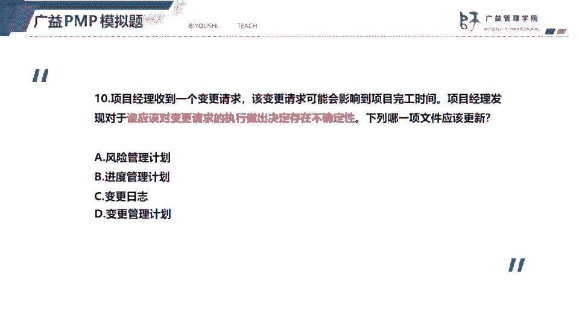
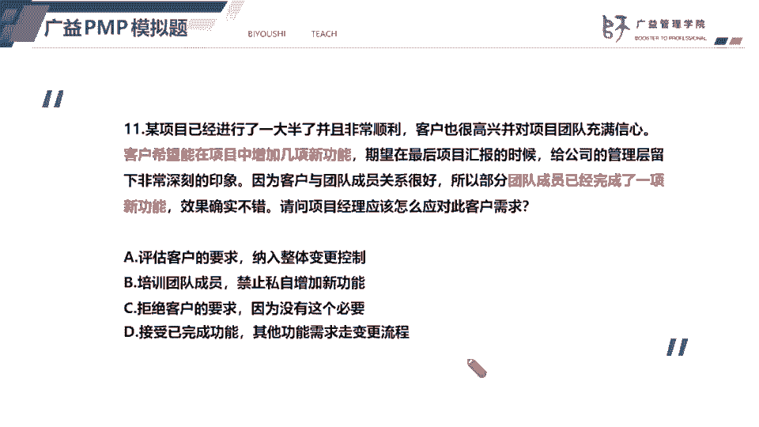
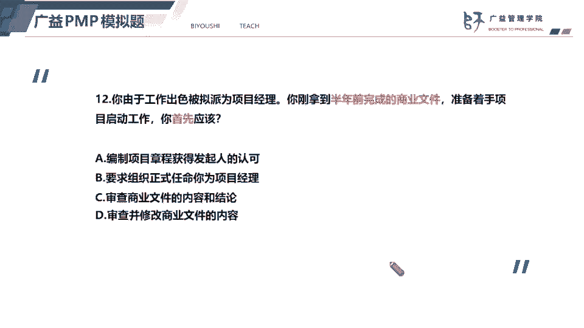
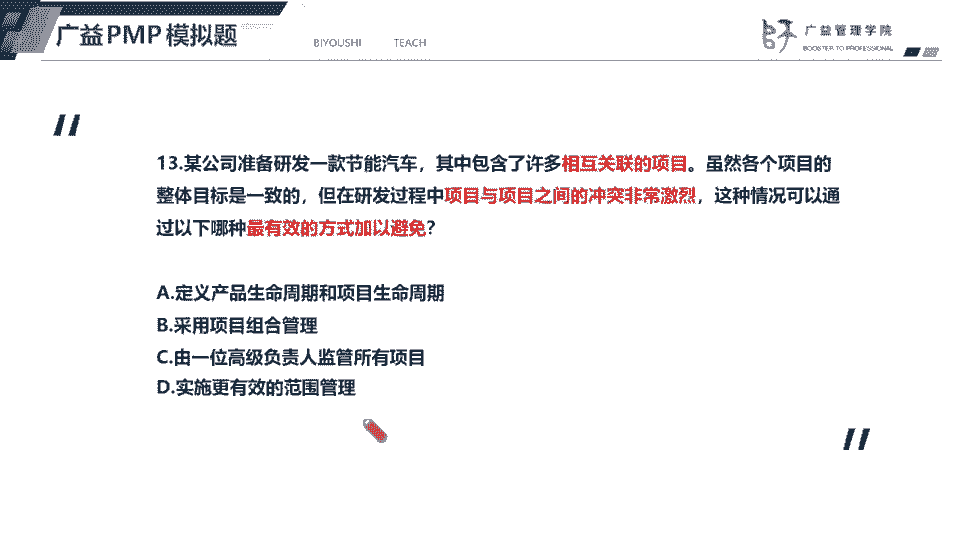
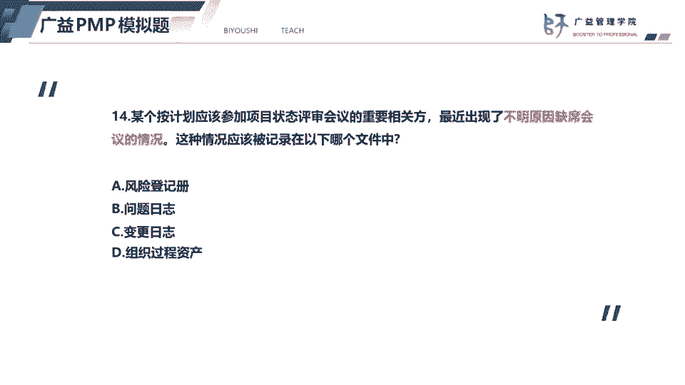
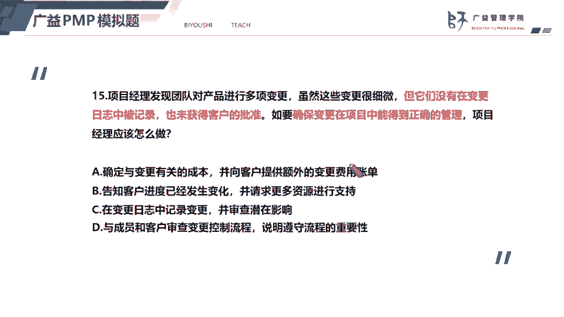

# 2023年PMP认证考试题目解题最新完整免费课程50题（11-15题） - P1 - 必有师广益PMP项目管理 - BV1EY41127ae

好我们看下一道题，题目呢比较长，客户呢希望增加几项功能，团队成员呢没有经过整体变更控制过程，直接实施了一项变更，直接实施了这项变更，那么项目经理应该怎么做，怎么应对客户的需求，那我们知道变更。

那被私信私底下执行完成了，那么项目经理依然要评估变更的一个影响，也就是说这个变更做了以后，会对项目整体产生什么样的影响，比如说会不会带来预算的一个投资，会不会有潜在的风险，会不会影响质量目标。

所以呢我们一定要评估，而且呢尽管你变更已经完成了，我们依然要补交变更手续，按照整体变更物质国产区走流程，所以答案选a，第一个，而选项b呢，这个培训成员禁止私自增加新功能了，这个呢是我们要先评估变更影响。

然后呢这个选项b是后面可以做的事情，但不是当前做的事情，而选项c我们呢就是一般就是这项变更呢，他其实已经做了，所以呢我们也没有办法去拒绝客户的要求，我们要做的就是补交变更手续，那选项d接受已完成的功能。

然后呢其他功能则需求变更流程，那么这道题呢就是它这个呢也是呃，选项a和选项a一样，我们要先评估啊，已经完成了一项变一项变更，我们先评估这个变更影响，然后呢纳入整体变更控制过程。

好我们看下一道题，题目告诉我们啊，已经拿到了半年前完成了这个商业文件，准备着手项目的启动工作，也就是说我们拿到的商业文件，我们要开始编制项目章程了，那么我们首先应该做什么呢，由于这个商业文件呢。

它是半年前已经半年前的商业文件，那么这个商业文件的内容是否仍然准确，商业文件中的一个结论是否仍然可靠，所以呢我们要先确认一下，审查商业文件内容和结论，所以答案选c，第三个。

那么选项a这个不是首先应该做的，首先应该确认商业文件的内容和结论，只有项目章程获得批准以后，选项d审查并修改下商业文件的内容，那么商业文件它不是属于项目文件，所以呢商业文件项目经理无权修改。

好我们看下一道题。

13题，题目告诉我们了，这个，项目包含了相许多相互关联的项目，而且呢项目之间发生了非常冲突的一个啊，非常激烈的一个冲突，相互关联告诉我们这是什么，这说明这是相互集，这个公司用应用了项目几个管理方式。

然后呢包含了许多的子项目，而且项目之间是有相互关系的，那么为了解决这个项目和项目之间的冲突，我们应该怎么做呢，所有的项目，所以答案选c，第三个，而其他的选项a选项，定义这个项目生命周期和产品生命周期呢。

都不符合题意，依然没有办法解决项目之间的冲突，选项b采用项目组合管理，那么项目组合管理呢，它是对项目，按照就先按照这个价值的优先级来划分，并且呢去分配资源，所以呢项目组合管理它。

它所管辖的项目不一定有相互关系，而选项d实施更有效的范围管理，就无法解决范围之间的一个冲突，所以被排除掉好。

14题，一个很重要的相关方啊，最近出现不明原因的缺席会议的情况，所以呢这种情况应该记录在问题日志里面，所以呢刚才说了，风险和问题是有区别的，相关方缺席会议，他就是一个啊问题，如果题目中告诉我们。

相关方缺席会议，可能会影响项目的一个验收，那么这种情况就属于风险。

好我们看下一道题，15题，这个项目经理发现了团队成员，直接的进行了变更，没有记录，也没有获得批准，最后题目强调的是，如果确保项目能够得到正变更，能够得到正确的管理，项目经理应该怎么做。

可能这道题呢会有嗯学员会选择这个c，但是但是呢正确选项应该是d是最后一个，因为题目中最后问我强调的是，要确保变更得到正确的管理，还是一句话，要形成共识，要达成共识，就如何变更，如何管理，变更达成共识。

只有变更，只有对变更形成共识，我们才能够得到，才能够确保变更得到正确的管理，所以呢选项d跟成员去审，跟成员跟客户一起去审查变更控制流程，说明强调这个变异可遵守流程的重要性，才能够确保变更得到正确的管理。

而选项c呢，这都是确保变都是说明了变更流程的重要性，后成员在后续面对变更的时候要做的事情，而选项a确定与变更有关的成本，它不符合题意，然后呢选项b告诉客户进度已经发生了变化啊。

这个题目中没有告诉我们进度已经发生变化了，所以呢选项a b不符合t1 ，而选项c呢他呢也不符合t e，他应该是变变更得到证据管理以后，要执行的一个步骤，所以答案选择d。

