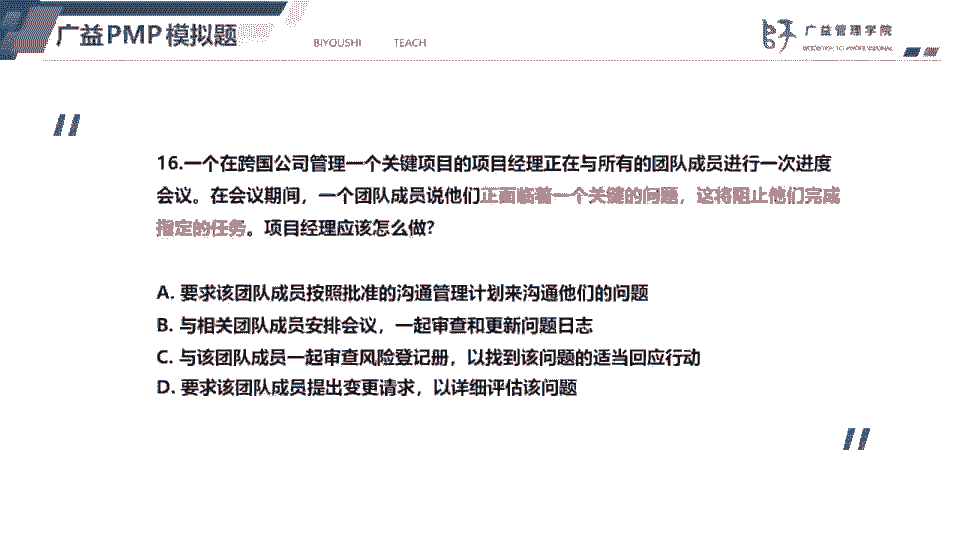
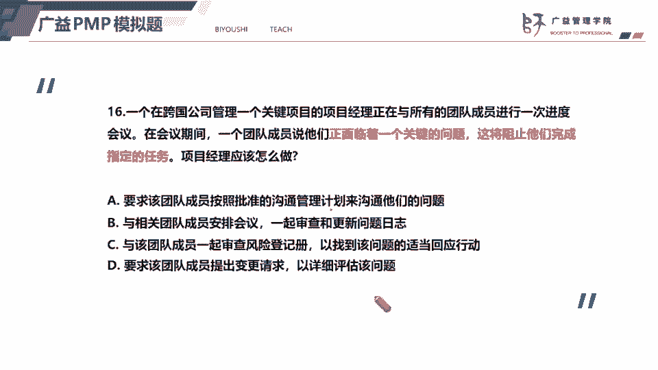
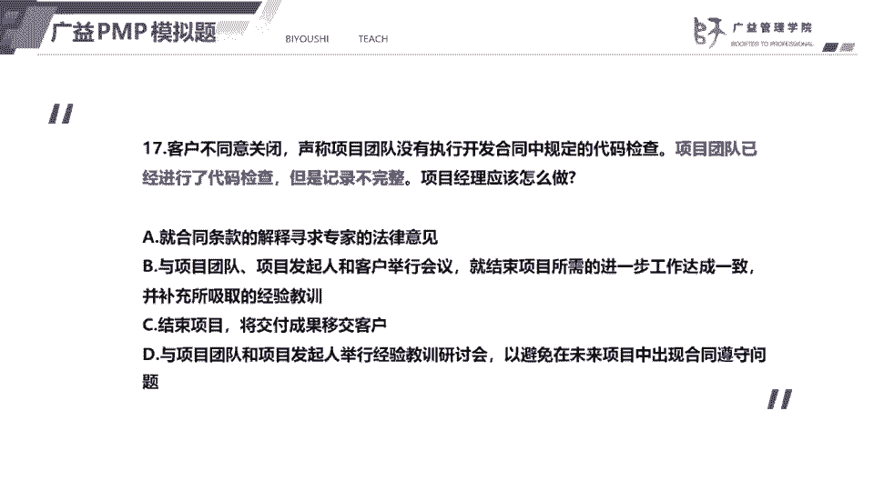
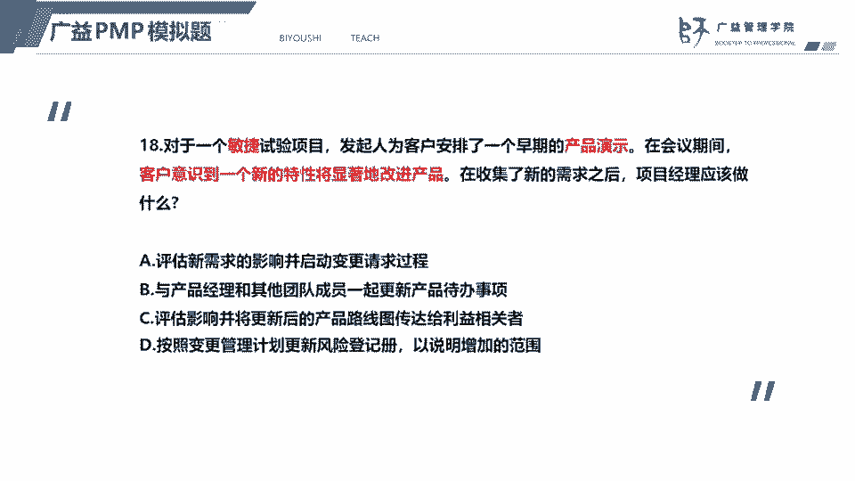
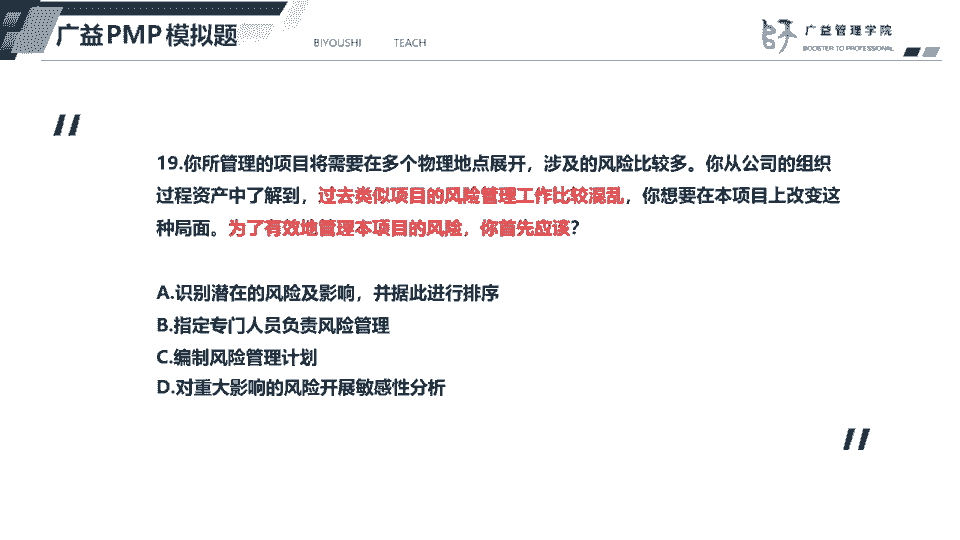
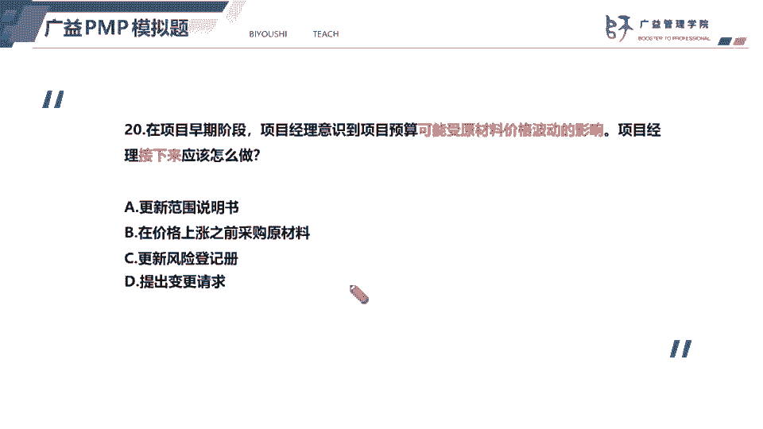

# 2023年PMP认证考试题目解题最新完整免费课程50题（16-20题） - P1 - 必有师广益PMP项目管理 - BV1rD4y1p7fh

好我们看16题，16题呢，一个团队团队成员的反应呢，面临的一个关键的问题，并且呢会阻止他们完成，正如啊这里呢，其实呢这里题目中大家有没有发现一个问题，也有一个风险问题，是以及正面临着一个问题。

而且这个问题呢可能会什么，阻止他们完成指定的任务，那么题目中呢如果出现了一个问题，并且这个问题可能会引发风险，我们一定要先解决什么，要先解决问题，因为问题是根源，我们解决了问题。

风险和潜在的风险呢可能就消除了，特别是单选题的情况下，我们要先解决问题，那么我们就是叫什么，跟相关成员，也就是相关成员安排会议一起审查和更新问题，日子遇到问题，团队一起去解决，并且将问题记录下来。

防止问题被遗漏，所以答案选择b，而选项c呢，就如我刚才所说，这个团队发发现了风险，虽然这个问题可能会影响，会带来一个一定的风险，但是我们要先解决问题，所以先将c被排除掉，而选项a，这个选项a说法不对。

因为呢没有告诉我们沟通管理计划，他没有说明团队成员没有题目，没有表明，成员没有按照沟通管理计划来沟通问题，所以排除掉，而选项d要求成员提出变更请求，以详细评估该问题，我们应该是先审查问题。

然后呢制定问题的解决方案，然后再提出变更清楚，因为我们的变更请求有四种形式，比如说纠正措施，预防措施，缺陷补救还要更新，那么皮肤变更紧凑是为了解决问题，我们的问解决问题的措施，以变更请变更的方式来提出。

并且获得批准，才能够实施好，我们看这个下一道题。

下一道题，客户不同意关闭，声称这个团队啊没有完成规定的代码检查，而题目也表明团队已经做了代码检查，但是记录不完整，那么项目经理应该怎么做，也就是其实也就是客户啊，我们跟客户发生了一些冲突。

我们面对这种题目啊，就是在收尾的时候，收尾的时候呢，可交付成果没有办法获得这客户的一个验收，当我们这个时候嗯，也可以看作是一个冲突，那么思维要解决这个冲突的话，最好的方式。

其实本质上还是要采用合作解决问题的方式，大家一起来开会，面对面的开会，把问题摆到桌面上，我们对于如何解决问题，要形成一个什么共识，这样子啊我们才能够双赢，所以呢答案就应该是什么，选b第二个跟团队。

还有邀请的发起人跟客户一起去举行一个会议，然后呢达成共识，并且呢题目现在还强调了补充经验教学，也就是吸取经验教训，因为代码检查做了，但是记录不完整，所以呢后续一定要避免这个问题，所以选项b是正确的答案。

而选项a呢啊，这个就是想通过法律或者是合同条款，想通过法律的途径来解决问题，但这种方式呢没有办法形成共赢，所以呢排除掉选项c结束项目，将可交付成果移交给客户，但是客户不同意关闭啊。

结束这个项目的前提是客户要同意验收，所以选项c排除选项d，这个呢应该是嗯嗯在客户获得验收以后啊，在首尾期间要做的事情，也就是经验教训总结嘛，但是不是当前要做的。

好我们看18题，这是一个敏捷项目，然后呢，发起人给客户安排了一个早期的产品演示，然后呢客户呢有一个新的需求，也就是新的特性在收集的提示，这道题就是考敏捷的一个变敏捷的需求变更。

那么敏捷项目呢跟预测型项目呢，它也是受理变更呢是有区别的，预测型项目的话呢，我们就会走整体变更控制流程，敏捷型项目呢受理这个新的需求的话呢，我们是让产品经理啊，也就是产品负责人把这个新的需求啊。

纳入到产品待办事项里面去，所以呢一般来说，敏捷型项目是没有整体变更控制委员会的，没有变更控制委员会c c b的，大家要注意好，那么回到题目呢，收集了新的需求之后呢，项目经理就应该跟产品负责人。

让团队一起去更新产品待办事项，所以答案选择b，因为这是一个敏捷项目，所以呢我们不走变更流，不走这个整体变更控制流程a被排除掉，而选项c呢评估影响后，将更新后的产品路线图，传达给这个利益相关者啊。

这个呢不符合这个题选项d，这个呢按照变更管理计划，去更新这个风险登记册，首先呢这个客户提出的一个变更啊，它不属于风险变更，其实不属于问题，它也不属于变更，本身是不属于风险，也不属于问题的变更。

只是一个可以说是一个需求，那么就不应该更新在风险登记册里面，也不可能通过风险登记次来去说明增加的范围，所以只要这个选项d也是不对的。

好19题，19题的题目告诉我们了过去项目的风险啊，比较混乱，如果在本项目上要改变这种情况，为了有效的管理这个项目的风险，你首先应该做的就是什么，应该是编制风险管理计划。

v字型项目非常强调按计划去开展项目，所以呢我们五大国分组里面，规划过程组会有24个过程，就是因为pmi非常强调预测性项目要做好计划，并且a好严格的按照计划去开展项目，所以呢答案选c。

第三个编制风险管理计划。

好我们看下一道题，下一道题，这个项目经理意识到，预算可能受到原材料价格波动的影响，可能受到影响，说明什么，这是一个潜在的风险，项目经理接下来应该怎么做，接下来识别到的风险。

接下来肯定就需要什么更新风险登记册，所以答案选c，第三个，选项a更新范围说明书，更新范围说明书，那么题目其实呢他说的是早期阶段，那么他们并没有告诉我们是不是执行阶段，如果是执行阶段，更新范围说明书。

那么范围说明书属于范围基准的一部分，是要获得c c b的认可的啊，也就是要获得c c b的批准，那么选项a呢，这个呢是不符合题意，然后呢选项b在价格上涨之前采购原材料，这个不是接下来要做的事情。

接下来应该先是，接下来应该是先更新风险登记册，然后评估变更影响，然后再规划风险应急计划，也就是说这个风险如果可能会发生，如果会发生，我们应该采取什么样的措施，写下d提出变更请求。

只是意识到意识到有可能会发生一个风险。

