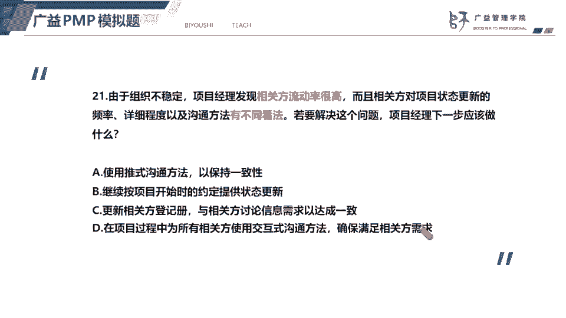
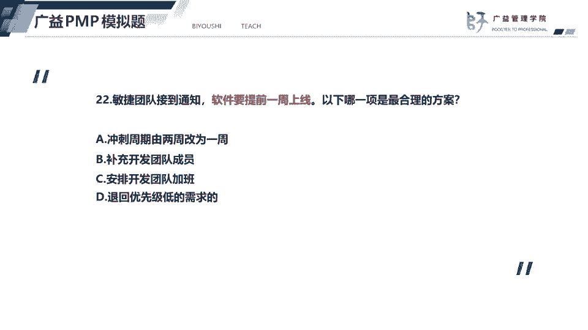
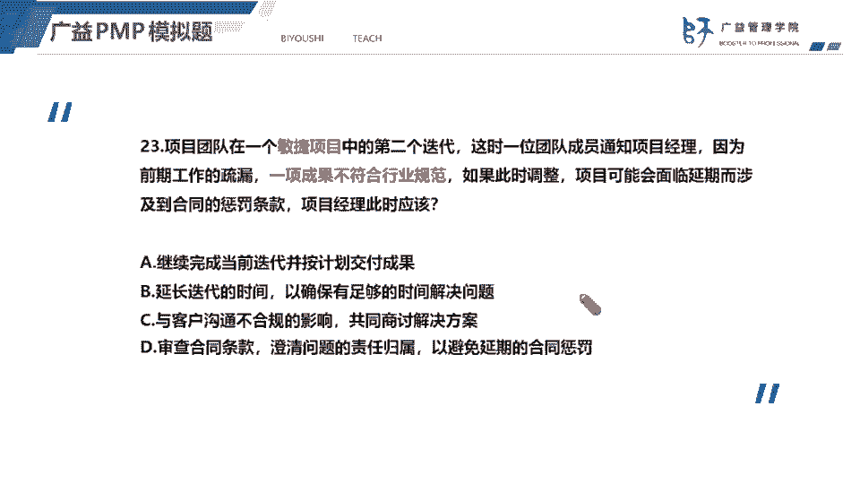
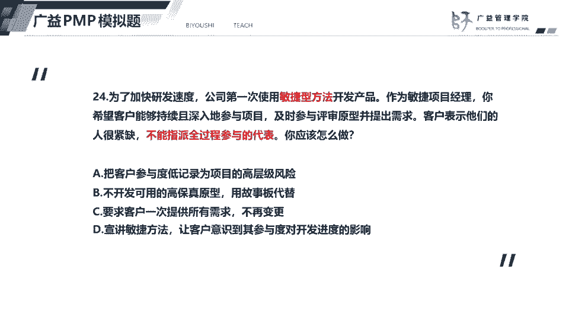
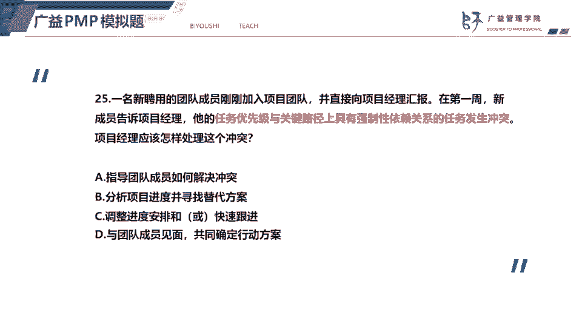
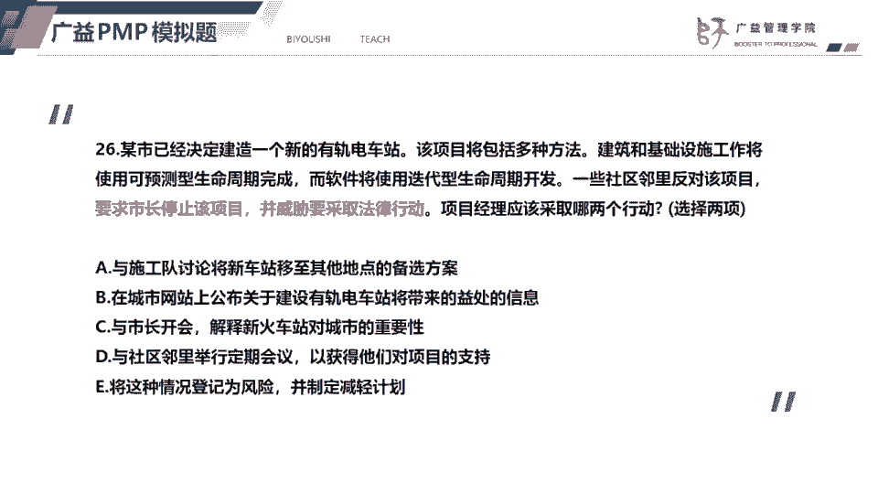
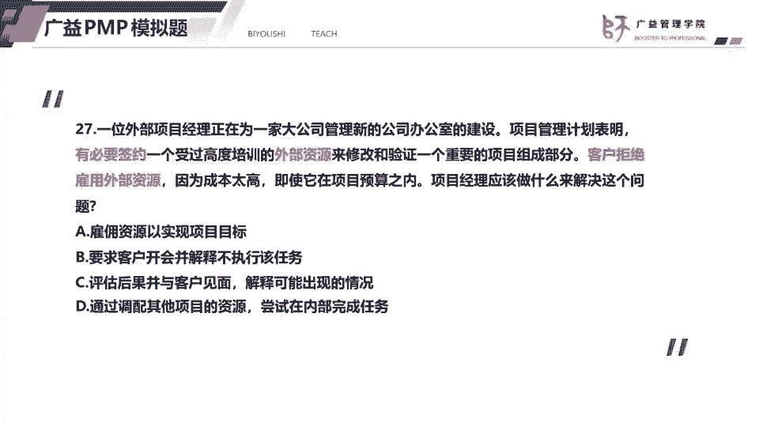
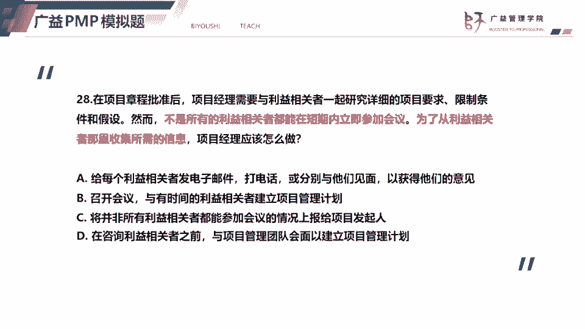
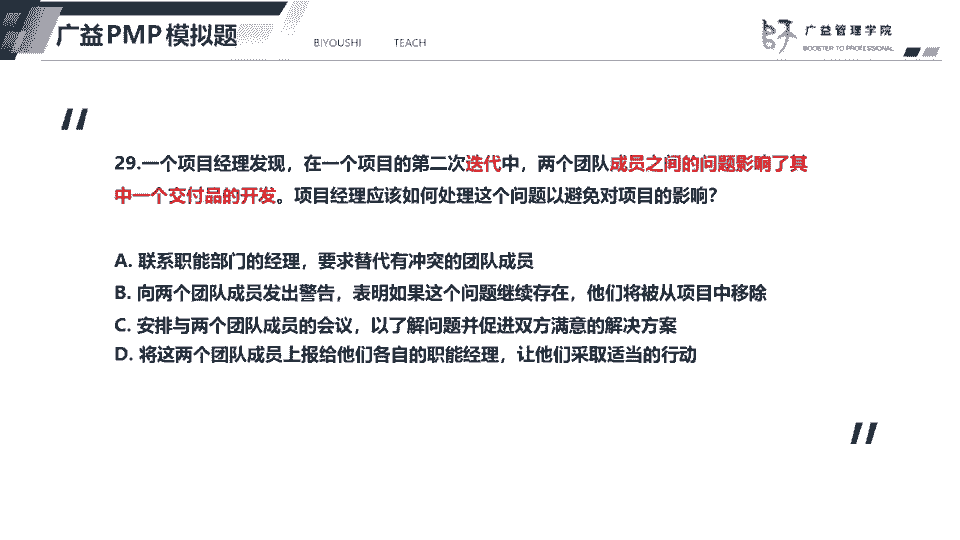
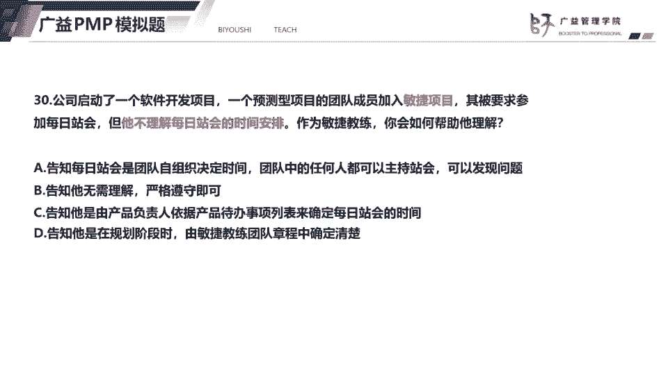

# 2023年PMP认证考试题目解题最新完整免费课程50题（21-30题） - P1 - 必有师广益PMP项目管理 - BV1rv4y1v7tH

好我们看21题，题目告诉我们啊，这个相关方流动率很高，说明相关方经常发生什么变化，而且呢相配方对这个沟通啊有不同的看法，也就是说如何去传递信息，如何沟通，没有形成没有达成共识，所以呢要解决这个问题。

就是项目经理下一步就应该什么，更新相关方登记册，因为相关方啊留发生经常发生变化，所以呢要及时更新相关方阵地侧，比如说相关方啊辞职了，或者说某个相关方调岗了，那么我们都要去及时更新相关方登记册。

题目呢也告诉我们这个相关方啊有不同的看法，所以呢我们要去达成一致好，我们看这个选项a使用推式沟通方法不对，为什么呢，题目中已经告诉我们，对于使用哪种沟通方法还存在不同的看法，没有达成共识之前。

我们不能直接使用某一种沟通方法，选项b按照项目开始时的约定提供状态更新，那么也没有解决题目中的问题，相关方还是存在不同的看法，选项d它也仍然是什么，使用交互式沟通方法，这个呢就跟选项a一样。

在没有形形成共识之前呢，我们使用直接使用某一种沟通方法都是不妥的，因为没有达成共识，也就没当然没有达成共识，都没有办法满足相关的需求，所以选项d不对。

好我们看到12题，一个敏捷团队啊，接到通知，软件要提前一周上线，那么像以下哪一项是最合理的方案，这里是一个敏捷团队，如果说这是一个预测型项目的话呢，软件要提前一周上线。

我们可以采用什么打工或者是快速跟进，但是呢这是一个敏捷型项目，那么我们就他就会有其他的一些其他的方法，敏捷新项目呢，如果因为敏捷项目，它是分为多个迭代器，每个迭代器有时间和时间和呢。

也就是说这个时间呢是不能改变的，一般来说它的迭代期或者说冲刺期呢，它就是两周或者是2~4周这样的两周过四周，那么这个两周就是两周不能够把它改为三周，估计是也就是说这个迭代器不能够延长，选项a被排除掉。

选项b敏捷团队的规模要保持稳定，敏捷团队一般就是5~9个人，他是一个小团队，但是呢成员具备各种技能，是体型人才，所以呢敏捷团队要保持稳定的规模，即便工作迭代期内的工作完不成，也不会增加人员。

那么题目中说软件要提前一周上线，那么敏捷团队也不会去增加团队成员，选项b排除选项c呢安排团队加班，这个呢是预测型项目的一个做法，也就是赶工，那么敏捷呢不提倡通过加班的方式来提前，来提前上线。

选项d退回优先级较低的需求，这个呢是敏捷提倡的一个做法，也就是说，如果我们当前迭代器的用户故事，没有办法全部开发出来，那么呢我们可以把那些无法完成的用户故事啊，退回到产品待办事项里面去。

像题目中呢这个要求提前一周上线的话呢，我们就把当前迭代器里面，用户优先级较低的用户故事，退回到产品待办事项里面去就可以了，所以答案选择d。

好我们看23题，23题呢，这是一个敏捷项目，这个题目题目告诉我们了，一项成果不符合行业规范，如果此时调整了，可能会延期，而且会受到合同的一个惩罚，项目经理此时应该那么结合选项的话呢。

我们就应该是跟客户去合作，达成共识，还是这个思路，也就是说出现问题了，我们要及时去跟客户沟通，想告诉客户这个不合规的影响，双方一起去讨论解决方案，所以项目经理应该是跟客户沟通，讨论怎么去解决。

所以答案选c，第三个选项a，继续按照当前的迭代计划去完成可交付成果，那么这种做法呢违背了项目经理的职业道路的，因为从我不符合行业规范，就必须要做出调整，所以选项a排除选项b延长迭代时间，我们知道啊。

迭代或者说冲刺它都是有时间和的概念，迭代器是不能够延长的，所以选项b排除选项d，审查合同条款，澄清问题的归属责任，避免延期，避免延期受到合同的一个惩罚，这个呢呃做法不妥。

首先呢就是那个敏捷宣传里面说到了合同，客户合作优先于合同谈判，因为呢合作是双赢，如果我们去通过法律途径去讲，审查合同条款来重开，找出这个问题的责任人呢，那么我们就会把这个问题激化。

而且呢就得不到双赢的效果，作者选项d排除，我们在pm b考试里面啊，尽量的选择双赢的做法，好我们看下一道题。

下一道题题目告诉我们，这也是一个敏捷项目，因为它使用了敏捷开发方法，那么项目经理呢，嗯项目经理希望客户持续参与项目，但是客户表示他们不能够全程参与项目，我们都知道敏捷新项目需要相关方。

也就是需要客户频繁参与项目，要求客户参加每一次的点开评审会议，及时获得客户的一个反馈，这样子呢有利于我们认清开发的方向，所以客户呢觉得他认为客户表示，他们不能够全程参与。

所以呢我们应该去引导客户参与项目，我们要告诉他，我们现在是使用的是敏捷方法，而敏捷的价值观，敏捷的理念是什么，让他意识到参与这个项目的重要性，所以答案选择d，最后一个。

好我们看25题，25题呢这个新成员刚刚加入项目团队，在第一周，新成员告诉项目经理，他的任务优先级，跟关键路径上的任务发生了冲突，简单来说就是任务和任务发生的冲突，项目经理应该怎么样处理这个冲突。

那么呢其实大家看选项啊，就是会发现选项a和选项d好像都是对的，但是呢不知道去怎么去区分哪一个是正确的，那么，从a和d呢，他们都是在解决冲突，但是相对而言选项d会更好，为什么呢。

因为这个新成员他刚刚加入项目团队，他对这个工作可能不太熟悉，所以呢这个时候发生了冲突，最好就是跟项目团队成员见面，共同确定这个行动方案，这个是最好的一个做法，而选项a呢指导团队成员如何解决冲突。

就是说他只是指导，但是相对而言跟成员去见面，采用交互式沟通，然后双方共同去确定行动方案，那么双方共同确定行动方案呢，也意味着项目经理在指导成员去如何解决冲突，所以选项d会更好，所以答案选最后一个。

选项b分析项目进度并寻找替代方案，那么项目经理呢，应该去跟这个成员一起找这个解决方案，而不是自己去制定一个方案，然后选项c呢，他这个，陈江西说法不对，为什么呢，题目告诉我们了，这个是关键路径上的。

他的那个任务啊是什么强制性依赖归依赖关系，强制性依赖关系的任务啊，是没有办法使用快速跟进的，所以呢选项c不对。

26题，其实呢我们从题目中可以看出，这是一个混合型项目，它既使用了这个敏捷方法，同时呢它也使用了这个预测方法，不过呢前面这一句话啊，前面这几句话呢都是多余的，而题目中的主干信息就在于。

这个有轨电车站遭到了这个市区的一个反对，他们威胁要采取法律行动，其他目经理应该采取哪两个行动，这是一道多选题，那么呢其实呢这道题的考点就是，相关方管理市区反对项目，所以呢我们应该跟这个市区进行接触。

然后呢对他们进行一个啊进行一个管理，引导他们去支持支持这个项目，尽量减少他们的一个负面影响，所以答案就选择d，第四个，因为呢这个市区呢他要威胁要采取法律行动，威胁说明他们还没有采取法律行动。

所以呢要将这种情况视为风险潜在的风险，并且呢要制定减轻计划，所以第二个答案就是e，最后一个作为本题的答案就是d和e，那么制定风险减轻计划呢，就可以包括比如说这个在城市的官网上，城市的网站上去发布信息。

通过拉丝沟通的方式去传递这种呃，电视这电池带来的好处，同时呢也可以去跟啊获得官方的一个支持，解释这个新火车站啊对城市的一个重要性，所以呢这个就是可以是包含减轻减轻计划，就可以包含b和c两个选项。

但是选项a呢，它是不是属于一种减轻的减轻的策略了，它是属于什么，它是属于规避，属于规避的策略，把这个心思在哪，建在别的地方好。

我们看下一道题，题目啊告诉我们，这个项目需要有一个受过高度培训的外部资源，但是呢客户拒绝使用这个外部资源，因为他们要节约省成本，那么项目经理应该怎么做，项目经理应该做的就是去跟客户沟通。

并且告诉他如果缺少这个外部的资源，可能会出现什么样的情况，会有什么样的影响，所以答案选择c，第三个，那么选项a呢，雇佣资源已实现项目目标，这个需要跟客户协商之后，取得客户的同意，才能雇佣外部的资源。

选项b要求可跟客户开会，并解释不执行该任务，这种做法不对，他只会激化双方的一个矛盾，而我们的选项d通过调配其他项目的资源，尝试在内部完成任务啊，项目经理呢，他是没有权利去调配其他项目的一个资源。

所以呢这道题的说法，这个选项的说法是错误的。

我们看下一道题，下一道题呢呃题目中有一个制约因素，就是他告诉我们的这个不是所有的利益相关者，也就是相关方或者成为干系人，他们不能够在短期内立即参加会议，又项目经理，又需要从利益相关者那里收集需求啊。

收集信息，那么项目经理应该怎么做，结合选项来看，那么就是应该去跟每一个利益相关者，通过拉式沟通或者是推式沟通的方式，来获得他们的一个意见，所以选项a的做法是最好的，所以答案选a，而选项b召开会议。

以有时间的利益相关制来收集他们的信息，那么就是相当于忽略了，这个没有时间参加会议的人，那么这个不妥，因为一定要跟不能够忽略去想，不能忽略这个暂时没有时间参加的相关方，一定要跟所有的相关方进行接触。

收集他们的信息，而选项c请大c呢是把情况上报给发起人，这个凡是呃直接把问题，把情况上报给管理层或发行人的做法一般不选，因为项目经理应该去想办法解决，如何如何解决问题，而不是直接就汇报发生了什么问题。

选项d选项d呢，这个做法不妥，因为呢它是什么，它是先建立项目管理计划，也就是说我自己先内部建立，先制定项目管理计划，后续再去跟其他的利益相关者进行接触，这种做法不好。

一定要在嗯建立下编制项目管理计划之前，就应该去先跟利益相关方接触，收集所需的信息，因为题目中已经告诉我，已经强调了，要解决的问题，就是从利益相关者那里收集信息。

好我们看下一道题，下一道题题目告诉我们了，这其实是一个敏捷项目啊，第二次迭代嘛，有些题目呢它会告诉我们这是敏捷项目，有些题目呢它可以通过关键词来告诉我们，这个是敏捷项目，关键词就包括迭代冲刺，产品经理。

还有这个啊燃尽图，或者是说这个看板，这些呢它都是属于啊这些是关键词出现的，说明这是一个敏捷型项目，好我们看题目，他们说两个成员之间的问题影响了一个交付，一个产品的开发，说明了就是两个成员之间发生了冲突。

那么这道题的考点就是要解决，就是冲突管理，那么中度管理我们知道，在没有特别强调的情况下呢，我们一般要采用合作解决的问题，这样子呢才能够实现双赢，达成共识，那么选项c安排与两个成员的会议。

然后呢就是面对面开会，然后了解问题并促成一个双方满意的解决方案，这就是合作解决问题的策略，而且呢他们是采用交互式的沟通，更加有利于解决问题，形成共识可以这样子讲，如果题目中没有特别的强调。

就是比如说他没有说时间很紧迫，那么我们解决这个冲突啊，一般都是用合作解决问题的策略，并且呢只要是采用交互式沟通的，他们一般都是采用合作解决问题的一个策略，好我们看选项a，选项a呢是换人成员发生冲突呢。

因项目经理应该去解决冲突，而不是直接换人，选项b那么将会发挥发出警告，那么也就是说威胁他们，他们将会从被相从，被将被项目中开除，这种做法不好不妥，除非是题目告诉我们，现在情况很紧急，进度很紧张。

那么成员之间的问题严重严重影响了这个工作，那么项目经理可以采用强迫命令的方式，选项d把这个冲突的解决，冲突的责任啊给这个职能经理，这个不行，项目团队成员发生冲突，必须要由项目经理来负责解决。

而不是把问题推给他们的职能经理，30题题目告诉我们。

一个在预测型项目的成员啊，加入了敏捷项目，那么作为敏捷教练，那么我们就应该指导他，引导他适应这个敏捷环境，团队中的成员都可以轮流组织战会，发现问题，所以答案选a，而选其，而其他三个选项呢。

选项b告诉他无需理解，严格遵守即可，这样的做法不好，因为没有帮没有回应题目中说的，如何帮助他理解每个展会的作用，选项c告诉他是产品负责人，这个不对，跟产品负责人，这个时间不是产品负责人去拟定的。

而且跟产品单位事项没有关系，选项d这个说团队章程中确定清楚，这个也说法也不对，他就15分钟的时间，而且呢这个是一个嗯可以说是公认的一个做法，所以呢我们为了帮助他理解。

