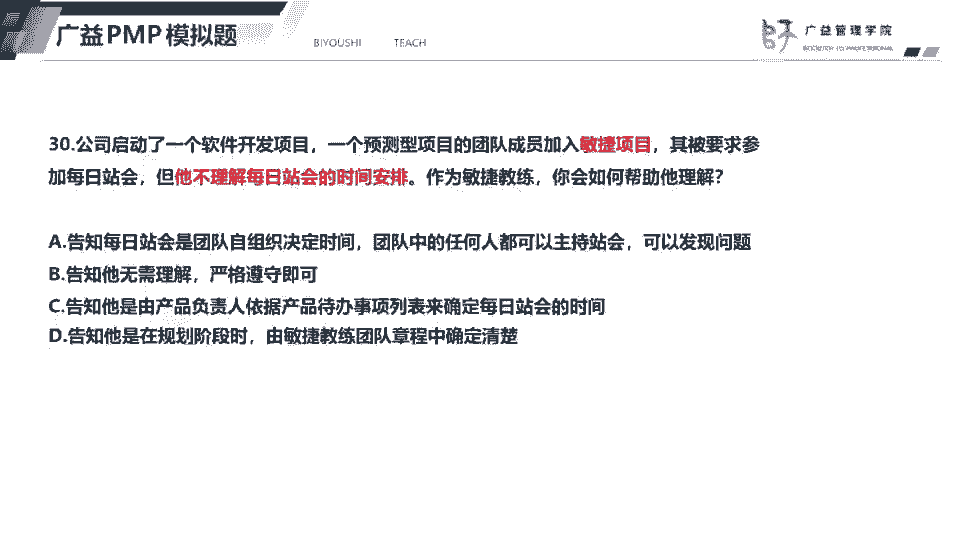
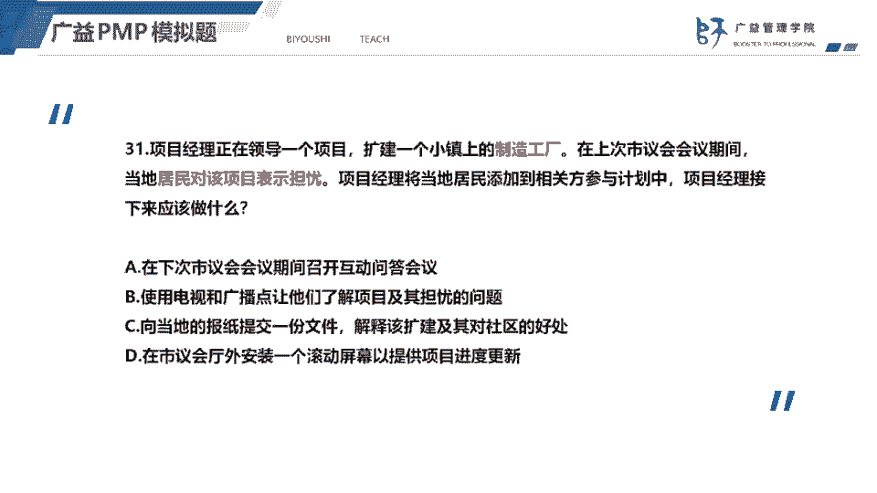
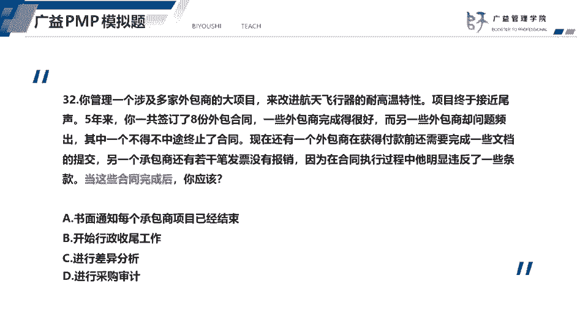
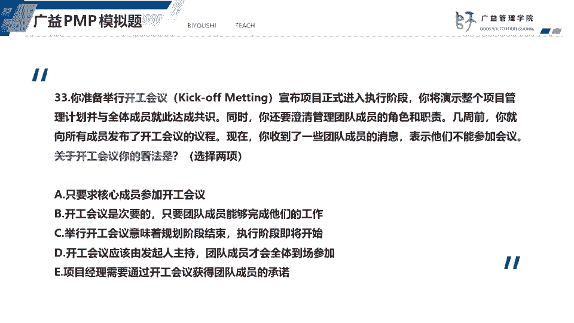
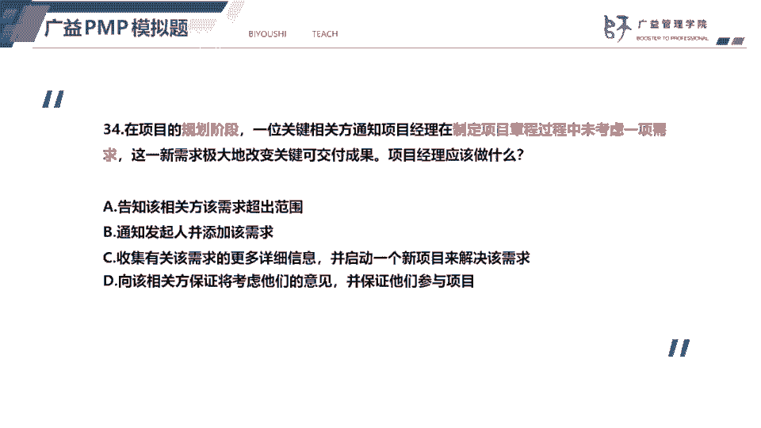
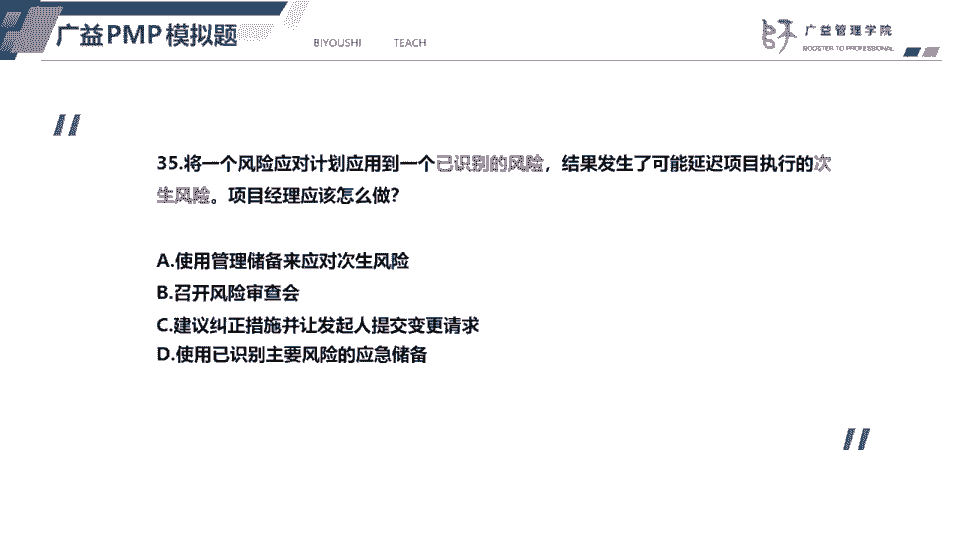

# 2023年PMP认证考试题目解题最新完整免费课程50题（31-35题） - P1 - 必有师广益PMP项目管理 - BV16R4y117BB

31题，31题呢，这个扩建一个制造工厂，引起了这个啊当地居民的一个担忧，那么项目经理呢为了管理这些相关方向，项目经理应该怎么做，那我们只要管理相关方嘛，我们的目的就是引导，适当引导相关方参与到项目当中。

来取得他们的一个支持和认可，尽量去减少他们的一个负面影响，那么结合选项来看呢，相关这个当地居民应该是对这个制造工厂啊，可能他觉得会污染着环境，所以表示担忧，所以呢我们以既然相关方表示担忧。

那么我们一定要关注他们担忧的问题，而且呢因为这是一个小镇上的居民，所以呢人员非常多，所以呢我们应该采用什么拉式沟通，采用拉式沟通的方式去传递信息，并且呢了解他们担忧的问题，让他们了解项目。

也关注他们担忧的问题，所以答案选择这个b第二个，那么选项a选项a在下次市议会议期间，这个市议会议啊是国外的一种会议，那么这个等到这种做法呢，等到下次市议会议期间，再去采用这种交互式的沟通的话呢。

这种做法存在滞后性，所以选择a排除选项c同样也是什么，它也是那时沟通的方式，它通过报纸来传递信息，但是呢他只解释了这个好处，没有关注居民担忧的问题，选项d它也是采用拉丝沟通的方式。

它只是通过拉沟通的方式来提供项目的进展，而没有解决成为这个居民担忧的问题。

32题，32题呢题干比较长，但是呢它其实意思就是说这些合同完成后，项目经理应该做什么，那么这些合同完成后，我们知道啊，合同关闭后呢，我们应该做这个进行采购审计，总结这些这一次啊采购管理工作的经验教训。

所以答案选择d，最后一个纪念采购审计，选项a书面通知每个承包商项目已经结束啊，这个不是项目经理去做的，而是采购管理员，这个教材上有明确指出，有采购管理员书面通知，每个承包商项目已经结束了。

采购已经结束了，选项b开始行政收尾工作，合同结束了不代表项目要收尾了，差异分析呢其实就是偏差分析，这个呢是在这是监控过程的工作啊，所以呢它不符合题意。

33题，你准备举行这个开工会议，但是呢有一些成员啊，说表示他们不能够参加会议，那么关于开工会议，你的看法是，开工会议呢它就是我们也称为开题会议，其实呢就是我们项目管理计划，已经获得了相关方的认可了。

我们即将进入执行阶段，那么我们召开一次开工会议，来介绍我们的项目管理计划，我们的项目目标获得这个相关方的一个支持，也让相关方知道我们的项目的一个方向，所以呢开工会议只要要求团队成员，到场参加。

并且要获得团队成员，获得相关方的一个支持，所以答案就应该选择c和e，也就是第三个和最后一个，选项a要求核心成员参加开工会议，显然是不对的，选项b不能认为是开工会，不能认为开工会议是次要的，这个说法不对。

而选项d开工会议应该是由项目经理主持，所以说法不对，好我们看下一道题。

34题，题目告诉我们，这是一个规划阶段，那么规划阶段呢，一个相关键相关方通知项目经理说，遗漏了一项需求，那么我们现在要做的，其实呢就是一般的结合选项来说的话，我们就是要跟向官方沟通，要告诉他们啊。

我们会考虑他们的意见，并保证他们参与项目，所以答案选择d，那么这道题如果我把它改一下，就是选项里面告诉你，告诉我们就说加一个，比如说我们把a选项改成啊记录变更请求，提交给cc b审批，能不能选呢。

是不能选的，为什么呢，因为目前是规划阶段，规划阶段呢，我们这个项目基准还没有完全确立，这个时候呢相关方有新的需求，那么我们其实呢是可以啊，不用走变更控制流程，可以分析这个新的需求的影响。

来考虑要不要添加到项目当中去，不需要走变更控制流程，因为是规划阶段，规划阶段如果结束了，那么所有的变更都要按照要严格，按照整体变更控制过去处理这道题呢，所以呢这道题因为告诉我们是规划阶段。

那么制定项目启动阶段遗漏了一项需求，那么项目经理可以跟这个相关方沟通，告诉他们，我们会考虑他们的意见，并保证他们参与项目，为什么会保证他们参与项目呢，前启动阶段，就是因为相关方没有很好的参与这个项目。

才会导致这个遗漏需求，所以呢我们接下来规划阶段，就应该积极的引导相关方参与，引导这个关键相关方去参与项目，选项a告诉该相关方查查需求炒作范围，此时呢这个范围啊还没有完明还没有完全明确。

所以呢不能说这个需求就朝九的范围，选项b不能够要求这个对象，不是不对，不是要东芝发起人去添加该需求，至少我们应该先评估这个添加需求的影响，选项c前面的说法是对的，收集更多的信息，关于这个新需求。

但是呢后面以至于去启动一个新项目，来解决该需求，项目经理哪有这个权利，所以选项c不对。

35题，35题呢题目的意思是啊，以识别的风险发生了实施的一个风险应对计划，结果发生了次生风险，次生风险是什么意思呢，自身风险就是说我们实施的一个风险应对计划，直接导致了另一个风险。

直接导致另一个风险发生啊，比如就比如说我们举个例子啊，我们进度可能会进度落后了，那么我们采用的嗯应急计划，就是赶工和快速跟进，但是呢赶工呢结果呢采用了赶工以后，结果可能造成成本的投资。

我们使用了就快速跟进，导致这个质量啊，这个质量问题出现了质量问题要反攻，那么这些呢进度落后，然后呢使用赶工快速跟进，造造成的这个风险就是属于次生风险，回答这道题，这个发生的次生危险怎么办。

然后我们肯定就是要评估，这个刺身风险的概率和影响，那么我们就可以通过风险审查会来审查这个词，从风险风险审查会呢他是监督风险的工具，他这个会议啊挺重要的，这个会议有很多内容啊，首先它会识别新的风险。

就比如说这个次生风险，它就属于新的风险，它会评估现有的风险，也就是以识别的风险，它会监测残余风险，残余风险，也就是说我实施了风险应对计划以后啊，这个风险得到了减轻，它就会成为残余风险。

同时呢它也不会评估这个整体风险的一个级别，此外风险审查会还会讨论，风险可能引发的问题啊，这个就是风险审查会的内容，此外风险审查会呢还会评估应急计划的有效性，比如说像这个应风险的应对应急计划呢。

他就嗯这个风险应急计划的有效性就不不够好，它导致了四重风险，那么风险审查会的内容比较多，建议呢同学们去翻盖教材，找到这个监督风险，这个过程详细的看一下风险审查会的内容，所以答案选择b。

我们看一下其他选项，选项a使用管理储备来应对次送风险，这个是不对的，这个次送风险应该用的是应急储备，而且呢使用管理储备，需要获得管理层的一个同意，选项c建议纠正措施，并向发起人提交变更请求。

可以建议纠正的措施，但不应该由发起人来提交变更请求，所以呢这个对象是错的，选项d使用以识别主要风险的应急储备，我们应该先评估这个嗯，就是应该先评估风险的影响。

