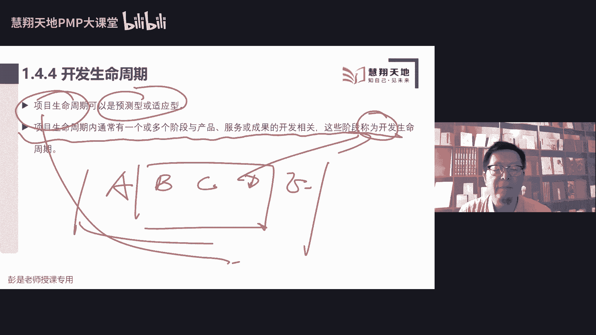
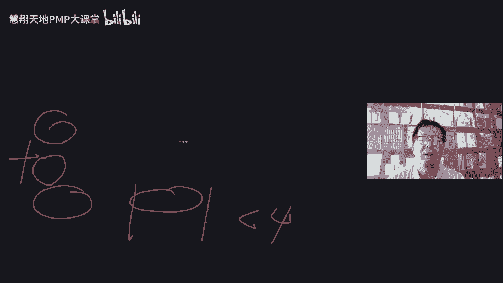
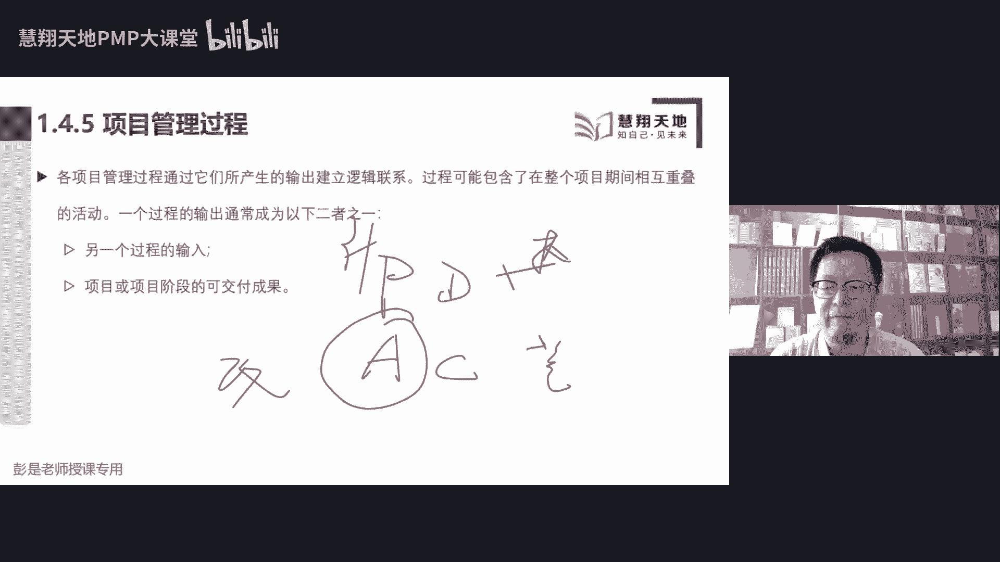
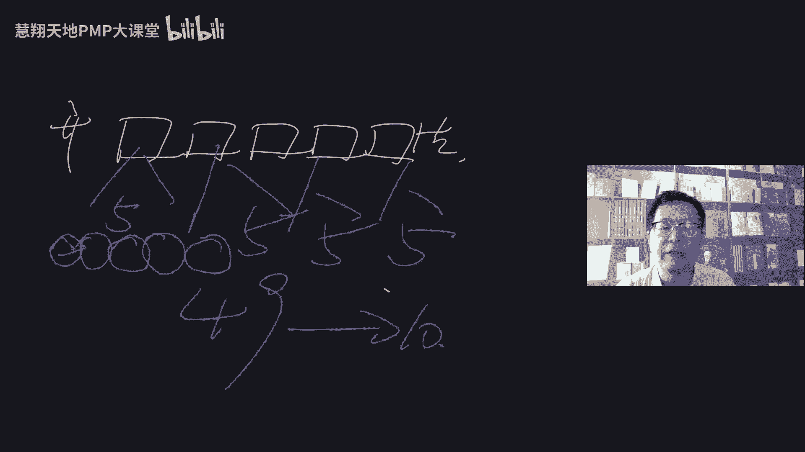
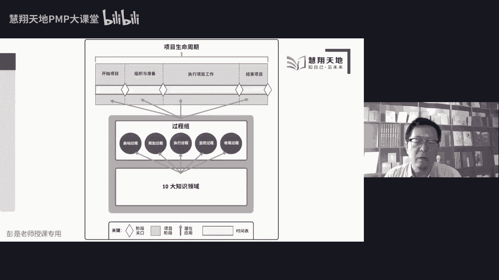
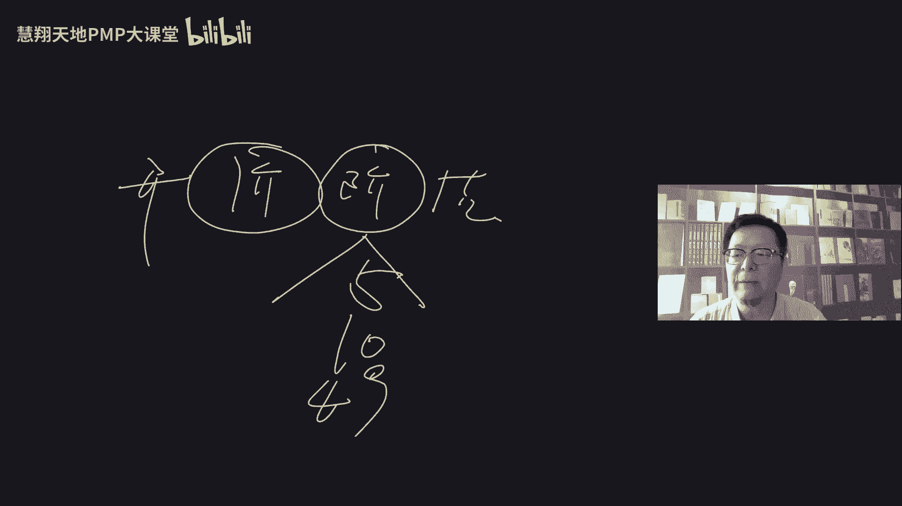
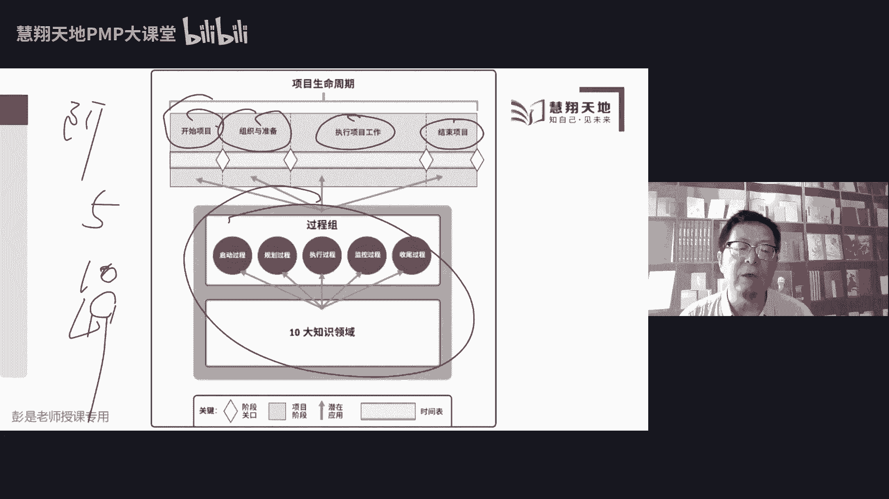

# 2023年最新免费第七版PMP课程 - 第四部分 - P1 - 慧翔天地软考 - BV1VF411C7MS

好再往下拉，那在不同的组织行业或者是工作类型之中，阶段关口可以被称为阶段审查，阶段门，关键决策点，阶段入口或者是阶段出口叫什么东西不重要，它有很多名字，大家不同行业，不同企业命名很可能不一样。

那考试的时候，基本上咱们现在PMP考试基本上就用阶段关口，这个这个这个术语，所以记住这个单词，记住这个单词啊，重要的事情说三遍，更换团队或者是项目经理，你想问啥呢，更换团队或者是项目经理，啥意思啊。

后半句呢，好再往下拉1。4。4，项目开发生命周期，这是由于是一个非常重要的知识点，讲这个知识点之前需要大家缓一缓，缓一缓，什么叫终止，什么叫终止，更换团队或项目经理，钟南山的钟。

就是这个项目咱不做了对吧，你换项目经理，换团队，可能就叫暂停，可能就叫暂停对吧，这个人不合适，我们先停一停，换个人，换个人，甚至可能甚至可能无缝切换对吧，换人换人的话，工作继续往下开展，很正常很正常。

看情况好，接下来我们又到了，重大利好时间，重大利好时间，15。21，咱们休息，休息到30，好了各位亲爱的同学回来了回来了，接下来我们继续下一小段课程了，这也是非常非常重要的一个知识点。

并且还会讲很多遍的，因为尤其是尤其是未来，我们要去判断区分什么情况下用传统的方法，什么情况下用敏捷的方法，就涉及到后面这一大堆知识点，好，接下来啊说填补个读起来不通顺，就是这样的，填补给的翻译还算好的。

还算好的，只不过他有些用词会比较慎重，会用的比较抽象啊，比较比较比较虚的，这些词大家读起来可能会比较辛苦，因为我们要把它转化转化为实例去理解它，犯困的同学，犯困的同学给大家想一想，提神醒脑的方法。

提神醒脑的方法就两种方法，一个叫物理攻击，一一个叫魔法攻击，物理攻击呢就是头悬梁锥刺股，这叫物理攻击，魔法攻击呢魔法攻击呢就是想一想，想一想工资，今年涨工资了吗，今年年底绩效能评多少呢。

年底有没有奖金呢，有没有要不要要不要买房啊，房贷有多少啊，要不要买车呀，车贷有多少啊，小孩要不要上学呀，有没有对象啊，有没有对象啊，什么时候结婚呢，敢不敢生二胎呀，就这种东西想一想，想一想。

刺激一下自己，刺激一下刺激啊，想要让自己不断的不断的提神提神，想办法想办法朝着更好的方向去学习，去努力去拼搏，去奋斗，不说了不说了啊，我是怎么做到不困呢，我想讲完课赚钱就这么想，大家听完课赚钱。

听完课赚钱，以价值为导向好了，杀人诛心啊，大家精神头有了啊，精神头有了，接下来在1。4开发生命周期，项目生命周期可以是预测型和适应性，这两个单词，一定要记住它啊，预测型就是传统的管理方法。

适应型就是敏捷，那项目生命周期之内，通常有一个或者是多个阶段，和产品服务成果开发相关，这些阶段我们把它称为开发生命周期，开发生命周期这个概念啊，大概理解一下就完事了啊，粗暴举个例子。

比如说我项目分成了ABCDE5个阶段，其中BCD这三个阶段和产品开发有关系，就把BCD称之为开发生命周期，那从A到E，从A到E这个玩意儿就称之为项目生命周期，所以呢就是项目生命周期里面。

某几个阶段和产品开发有关系，我们就把它叫产品的开发生命周期，它是被包含在项目生命周期之内的一个玩意儿，那开发生命周期呢，接下来非常重要的一段知识点，就这段就是这张图。

这这些课件说开发生命周期可以是预测迭代，增量适应型或者是混合型的模式，预测型，生命周期的早期阶段，我们就能够确定项目的范围，时间和成本，对任何发霉的变更都要进行仔细管理。

预测型生命周期也被称为瀑布型的生命周期，变成大白话变成场景，大家都想啊，在项目上，项目生命周期的早期阶段就确定项目的范围，时间和成本，它对我们来说都是明确的，都是明确的，都是确定的。

不存在着不确定的因素，那换句话说就是变化可能非常非常少，这种情况下，这种情况下，最终最终我们要做到什么程度，它是可预测的，它是可预测的，可预期的，所以呢就称之为预测型生命周期。

所以接下来给大家带入场景预测型生命周期啊，我们这个餐厅，我们这个餐厅餐厅装修，餐厅装修啊，我要开个快餐店，装修风格啊，超，就这样一个场景，超麦当劳，超肯德基，人家装修什么样，你这给我装修的一模一样。

装修的一模一样，我们的范围时间成本就可预测，它就适用于这样的场景，目标明确，我们就可以做到一次交付，目标明确，我就可以做到一次交互，对不对，你中间怎么设计图啊，施工图啊，我都不看。

我就要结果给我抄的和隔壁一模一样就可以了，就比如开连锁店，所有的店风格装修都是一样的，都是一样的，你就以结果为导向就可以了，过程中我都不想参与，这种情况下，我们就用预测型生命周期好，再往下看，第二个啊。

第二个叫迭代型生命周期，项目范围通常与项目生命周期的早期确定，但是时间和成本估算，将随着大家对产品的深入理解，不断的深入而定期修改迭代方法，就是通过一系列的重复循环活动来开发产品，刚才说过了吧。

迭代就是循环，就是重复，迭代就是循环，就是重复这个设计图纸，我不满意，你再重新设计设计这个效果图，我不满意，你再重新改一改，重新改一改，诶，这个地砖铺得不好，你再重新铺一铺，这就是迭代。

所以通常迭代型生命周期，它更适用于什么场景呢，叫，唉写字写不上了，叫技术不确定，产品是确定的，但是技术方案可能存在着不确定性对吧，这个设计图纸，你画这个效果图，我希望有个什么欧式风格呀，美式风格呀。

简约风格呀，诶你把这个图纸不断的修改，不断的修改，不断的重复，开展这样的工作来确认是不是满足我的要求，技术方案不确定，这种情况下，我们通常用迭代型生命周期好，再往下增量，增量方法是渐进地增加产品的功能。

为什么要渐进增加产品的功能呢，今天做一点，明天做一点，它通常适用于范围的不确定，范围的不确定，对标到根儿上就是需求的不确定，就是需求的不确定，这是它的根儿，整体需求不确定，那我就做一点，您看看做一点。

您看看，这就是增量啊，做一点您看看做出一个功能，让您确认一下，做出一个功能，让您确认一下，做出一个功能，让您确认一下所有功能都完成诶，交给您，这就叫增量型的生命周期，不断的去增加产品的功能。

来确认是不是满足客户的要求，这个也听大概意思，听明白了之后，所以呢增量型生命周期是通过预定的，什么什么时间区间内渐进的增加产品的功能，来产出可交付成果，只有最后一次迭代之后。

可交付成果具备了必要的足够的能力，才能识别完整的，今天做一个功能，明天做一个功能，所有功能叠加叠加到一起，就变成了最终的交付成果，这就是增量，而最后一个敏捷呢叫适应型，生命周期。

也称之为敏捷迭代型或增量型，详细范围在开始时得到了定义，适应型生命周期也称为敏捷或变更驱动型，然后巴拉巴拉后面就不念了，敏捷敏捷敏捷，敏捷本质上来说就是更快的迭代和增量，它叫短周期，迭代和增量。

通常这个迭代周期要小于四，所以敏捷本质上它和迭代迭代和增量没区别啊，它就是迭代加增量，就这样去理解这几个东西，超抽象吧，所以抽象的东西听完了之后需要例子，需要例子，便于大家更好的去理解这个是什么玩意儿。

什么例子呢，等我找一个画板吧。

小黑四先听啊，等我找一个画板啊，我们这家餐厅，我们这家餐厅，如果我定了这样的方法，抄抄的和隔壁餐厅一模一样，这种情况下是不是就可以做到一次交互了，做到一次交付了吧，这种情况下我们就用预测型生命周期。

那第二种场景是，我不知道我这个餐厅要装修到什么程度，不知道提需求没感觉对吧，反正我喜欢漂亮简单时尚对吧，哎那这种情况下，如果我们的施工方直接就把餐厅装修好了，根据我们学习的掌握的知识点。

又知道餐施工方直接把餐厅装修完，我发现不满意，返工的代价非常高，反攻的代价非常高吧，那在这种情况下怎么做呢，那我们就为了避免一次交付失败的风险，把它分成了多个阶段，并且有一个阶段我们主要是帮您做设计。

帮您做设计，那在设计的过程中肯定涉及到改这个事儿，是不是就开始迭代了，除了设计的第一版，等我换个颜色啊，涉及到第一版出来之后，我不满意，好好对方去改，设计又出来了，第二版画了图纸，我不满意，你们再去改。

这就是不断的不断的在设计这个阶段，不断的循环，不断的循环，这样可以降低风险，降低风险啊，直到最终确认了哎这个设计我满意了，再去施工，再去施工，这就是迭代，那迭代的过程中再想一个最终的小问题啊。

再想个问题啊，如果是画图纸，如果是画图纸好，我这个餐厅啊有好几个房子，这是大厅，这是大厅，这是包间，这是后厨，那我们的设计设计公司，是一次把所有的图纸都画出来吗，说你喜欢什么样的风格呀，我说不知道。

不知道它是一次把所有的图纸都画出来吗，还是说先画一点，哪个风险低，就想这个问题，一次把所有的图纸画出来，我说这风格我不喜欢，全都白画了，对不对，诶，那这种情况下是什么呢，就考虑增量了吧，对不对。

就这个思路啊，先画一个大厅，您看看诶，这个风格不满意，我们去迭代，我们去迭代，对不对，好，然后迭代两次，迭代三次，我满意了，这个风格还不错，我们再去画包间，再去画包间，在得化后厨。

总之最终中心思想就是降低风险，1。1点来，就这个东西吧，这就是迭代和增量，迭代和增量，听懂了这个意思啊，再回顾回顾我们这个场景，如果我们要抄，我们要抄的一模一样，就是可预测。

有一些工作呢可能需要大家去循环循环，循环重复开展，不断的改，不断的改，那有些工作呢有些工作比如画这个图纸，我们一次交付所有的功能可能有风险，那我们做什么呢，增量做一点试一试，做一点试一试，做一点试一试。

来确认需求敏捷，就是更快更快的迭代和增量，它快到什么程度呢，迭代的周期也就是循环的周期通常要小于四周，通常都要小于四周，大概知道这个中心思想，再给大家讲一个以前上课讲的案例，大家基本上就应该实锤了。

这个案例是什么呢，我们要成立一家公司，我们现在成立公司啊，不开餐厅了，不开餐厅了，我们去做大家手机里边看到天天用的这个微信，最近啊我们要成立一家公司，叫巨信公司，巨型公司，我们的公司啊定战略，定战略。

目标，愿景使命价值观，我们定战略规划，战略规划分三步走，第一步，第一步啊，我要做一个和微信一模一样的产品，用什么样的产品开发生命周期呢，抄就是这么赤裸裸的抄诶，可预测吧。

所以大家看有一些刚才有一些同学说，做产品经理，做产品经理，很多产品经理干的就是这个事情啊，对不对，做竞品分析，看看竞争对手在出什么东西，在出什么东西，超超功能，所以大家你看看你手机里的什么淘宝天猫。

京东是不是都在相互抄啊，是不是都在相互抄对吧，什么百度导航，高德导航对吧，什么饿了么，美团都在相互抄吧，诶对方竞争对手推推出了一个新功能，我们拿过来抄一抄，你给我做一个差不多的，做一个大差不多的东西。

唉这就叫预测型生命周期，好了，没毛病啊，这是我们第一个战略阶段，第一步，战略阶段，第二步，第二步啊，我们能够做出这样的预想，做出这样的预想，我们这个产品上线了以后，产品上线了以后，可能会受到竞。

受到竞争对手的排挤，受到竞争对手的打压，这种情况下，我们需要快速的响应各种各样的变化，环境的变化，政策的变化，客户的变化，竞争对手的变化，以此类推了，我们要快速响应，快速响应，小步快跑。

以最短的周期去做出调整，以最短的代价去做出做出响应，这时候用什么呢，敏捷对不对，用适应型生命周期，因为它迭代周期非常短，竞争对手上了一个东西，咱也要有一周把它做出来对吧，什么什么竞争对手把他屏蔽了。

就让大家淘宝天猫京东和那个什么微信支付啊，支付宝支付啊，这不都有相互屏蔽吗，诶我们要快速响应，用敏捷，根据这种变化的环境去确定，我们尽快的尽快的把什么东西多出来，但是到底做什么呢。

不知道到底做什么事情呢，不知道见机行事，随机应变，但是要快就有敏捷，因为要做的东西不可预测，你也不知道淘宝天猫京东会采取什么样的措施，咱也不知道微信会不会屏蔽的，对不对，但是我们要快速响应。

那咱战略规划第三步是什么呢，稳扎稳打，万一呀，万一假设条件，万一我们把微信打的打败了，我们变成一家独大了，变成一家独大了，变成垄断了，这种情况下，这种情况下朝着什么样的方向发展，咱也不知道。

没有可参考的，没有抄的对象了，但是呢我们不需要这么快的响应，那我们怎么做呢，就叫定期的定期的稳扎稳打的迭代和增量，定期的推出一些新功能就可以了，尤其是互联网行业的同学，你要思考你要思考对吧。

你要做产品经理，项目经理啊，你们公司目前产品处在一个什么阶段，是要快速响应呢，还是说稳扎稳打呢，还是说我们从0~1先找一个竞品先抄一抄，在不同阶段都有不同的策略，不同的策略就决定了我们用什么样的。

生命周期类型，生命周期类型，所以像这种东西啊，大家再换个场景，换个场景啊，大家之前天天用用了两年多的这个健康码，用了两年多的健康码，健康码刚推出来的时候，用什么样的生命都记类型呢。

健康码刚出来的时候到底要做什么功能，不确定不确定，但确定的时候我们确定的是，我们需要快速的推出一个玩意儿，想一想要快速的推出一个东西对吧，有了新冠疫情，我们先做个定位吧，先做个定位。

告诉你在在不在风险地区诶，一周就出了个新版本吧，一周就推出了个东西，所以呢他推出的第一个版本就用了敏捷，这样的方法，我们要快，我们不做完整的完整的产品规划和设计，我们小步快跑，小步快跑。

以最短的周期先把这个功能推出来，一个先让大家能够用上，然后再随着疫情的发展，不断地推出其他的新功能，用敏捷发，所以健康码健康码，健康码第一版就四四天就做完了，四天就上线了。

然后呢大家就可以定位自己是不是高风险地区，低风险地区了，然后随着疫情的发展，不断的推出新功能吧，今天出个什么核酸检测呀，明天出个什么玩意儿啊，总之要快，那健康码什么时候采用预测型生命周期呢。

什么时候采用预测型生命周期呢，什么时候健康码这个玩意儿，可以做到一次交互呢，还一个地区没有参照另一个地区吧，抄就这个场景超，对吧，你们出了什么新功能对吧，然后或者是或者是移植移植这样的场景。

微信里面有健康码，支付宝里面也要也要有健康码对吧，什么把它移植到抖音啊，小红书啊，哎就是抄好产品的功能，可预测我们就可以做到一次交互，然后什么时候适用于迭代和增量呢，就是稳定。

就是这样的环境稳定疫情疫情比较稳定了，我们就定期的根据大家的需求，定期的推出新功能，不需要这么快了，不需要这么着急了诶，所以这就是大概这几种生命周期它适用的场景，这就是关于。

1。4。4非常重要的这么一段知识点，再看书上这段文字，大家目前应该还好了吧，预测型生命周期，我们这些东西可预测，我们就用传统的这种瀑布型的方法，把它做到一次交互迭代和增量呢，迭代指的是循环不断的去修改。

去调整，不断的修改去调整，增量呢就是我们增量增量，增量指的是不断的增加产品的功能，最后适应型生命周期就是更短周期的迭代，迭代周期通常小于四周，短周期的迭代，为什么周期短呢，周期越短，这个月低啊。

周期越短，成本越低，要想到刚才见过的这条线，项目的累计成本在不断上升，那我们周期短就能做到早发现，早治疗，早康复，避免在错误的道路上渐行渐远，就这个中心思想好，这就叫这四种声明楼梯。

然后接下来接下来混合型在后面，不着急啊，看看这张表，看看这张表，这张表就是总结了一下预测到敏捷，中间这部分大家其实可以不看，中间就是迭代周期的变化，叫定期，定期定期主要去更好的去区分什么叫预测。

什么叫敏捷，先看左边，预测型生命周期是说需求在开发前预先确定，超微信装修装的一模一样，需求是确定的，在这种情况下，我们针对最终的成果就可以做到做到一次交付，我们就以结果为导向给我做的一模一样。

一模一样就可以了，那在过程中呢要尽量的限制变更，为什么呢，需求是确定的，所以尽量的不要改，尽量的不要改，那大家呢就不需要频繁的持续的参与集中，所以呢叫关键相关方，在特定的里程碑点去参与项目就可以了。

而在敏捷环境之中，敏捷环境之中啊，它是应用的场景和预测型，刚好相反，预测形式需求确定，敏捷环境之中呢就是需求不定，需求不不定，就可能存在着各种各样的变化，那需求不定存在着各种各样的变化。

我们又知道项目到了后期变化的成本非常高，变化的成本非常高，所以怎么办呢，那我们需要小步快跑，小步快跑，以最短的代价去试错，所以呢这个得在周期得在周期一定要短，就有了需求，在交付期间频繁的细化。

我们要频繁地交付给客户，有价值的各种子集，做一个增量，您看看，做一个增量，您看看，那在交付期间，我们就可以把变更实时的融入项目，因为在交付期间，我们迭代的周期短，迭代的周期短，也就意味着变更的代价。

变更产生的影响小，然后相关方怎么参与呢，所以叫持续参与，一条船上的蚂蚱，一条线上的蚂蚱，大家持续地参与到项目之中，持续的参与项目之中，因为变化多，所以呢大家需要高度的频繁地参与到项目之中。

避免我们在错误的道路上越走越远，唉这就是关于敏捷，它适用的环境，所以可预测就刚好相反，完全是互斥的，完全是互斥的啊，好了知道这个中心思想，最后呢就是混合型混合型吧，就是看看画的这个这个粗暴的例子。

变成大白话，就是我项目一共有五个阶段，有三个阶段的工作难以预测，需求不确定，那我就敏捷，然后A阶段和一阶段，这两个阶段的工作是明确的，我们就把这两个阶段用预测性的方法，这就是混合，所以最后变成人话。

就是该预测的就预测，该敏捷的就敏捷，预测有预测的好处，敏捷有敏捷的好处，它适用于不同的环境，预测呢我们可以最快的速度一次交付，敏捷呢其实反而反而是啰嗦，因为它环节多，不断的迭代增量迭代增量。

迭代增量虽然可以规避规避风险，但是啰嗦反而有可能总体成本还高于预测，反而可能总体成本高，好知道这个中心思想，所以呢最后就有了这句话，由项目管理团队确定，各个项目最适合的生命周期类型，它需要足够灵活。

能够适用我们整个整个项目的环境，看情况就变成了这三个字，这是这一章今天今天课程最复杂的一个知识点，跳过了这个知识点，后面就一马平川了，大家就轻松加愉快了啊，混合还是不太了解啊。

听懂了听懂了再给大家实锤一下，看看你们看看你们听到了，听到了什么程度，大家想一个问题，就像学p mp这个事情，学p mp这个事情，大家是把课程一次都听完，课程一次都听完再去做题吗。

还是说还是说我们听一段课，然后做一段题，再听一段课，做一段题，再听一段课，做一段题，不断的迭代和增量，就这东西吧，如果说老师我学个PMP，然后教材我都比你熟，那我就听听听听听你课大概是什么。

然后我再刷一遍题，一考试就过了，诶那有些同学可能心里没底气，对不对，我们就不断的迭代和增量，不断的迭代和增量吧，好听听完第一章，然后呢做做第一章的练习题，如果发现做错了呢，再去回去循环，再去听课。

看书做题，把这个工作迭代一遍，迭代一遍就会得到了新的知识，新的知识不就是增量吗，对不对，还这可以降降低失败的风险，降低失败的风险啊，好了，大概知道这个粗暴的例子，知道这个意思就够了啊，好再往下1。4。

5，从现在开始，这段知识点就超简单，超轻松，超愉快了，学习PMP类似混合呀，就像考试对吧，最后大家学完了，听完课，做完书，听完课，看完书，做完题，像模拟考试，正式考试，这都是可预测的。

因为这东西是明确的，这个东西是明确的，我们的目标是明确的，多长时间做多少道题，那1。4。5，项目管理过程，这段文字超简单，项目生命周期是通过一系列的项目，管理活动进行，也就是项目管理过程。

前面给大家说过，我们大概49个管理过程，每个管理过程通过合适的工具，把一个输入或多个输入转化为输出，就是干活需要什么东西，就叫输入，干完活产出一个什么成果，就是输出，就是输出。

所以这些过程输出就是我们的可交付成果，或者是结果，结果呢就是过程的最终结果，吧啦吧啦，后面就不念了，这怎么都看就够了啊，再往下1。4。5是说，然后这些过程之间的关系，过程之间的关系，大家就想就想流水线。

流水线，大家工作上是有程序的，工作上是有程序的，那我们的管理过程也是这个东西对吧，比如说餐厅餐厅后厨洗菜，洗完菜得到洗好的菜，把洗好的菜交给我们的同事，他去切菜，切好菜就得到了一个切好的菜。

切好的菜交给我们的厨师，他去炒菜，炒完菜就得到了一个炒好的菜，炒好的菜交给服务员来上菜，哎我们就可以开吃了，这就是工序程序，那我们的管理过程也有这样的逻辑，所以呢接下来就带出了这张图。

我们完成一个管理过程，可能需要一些东西，原材料拿到这个原材料，通过我们的工具地图来制作加工，就会得到我们的成果，这个成果再交给下一个管理过程，他来做第二道工序，再加工，加工之后呢。

又会产出成果交给第三个程序，以此类推，这就是我们未来需要大家掌握的一些，关键过程之间的逻辑关系，关键过程之间的逻辑关系，知道这个意思就够了啊，再往下找到这句话，需要大家掌握的知识点又来了，项目管理。

通过合理的运用这一大堆过程，来帮助我们实现目标，完成任务，产出成果，这些过程呢有很多，常见的有49个，这49个过程，我们按照他先后的顺序把它归归类，就变成了五大R过程组，就变成了五大过程组。

输入输出一对多还是多对多呢，完全不重要，不要不要不要去想什么细节，这些性格的东西一共49个管理过程，按照它的逻辑关系就分成了五大过程组，什么叫五大过程组呢，接下来就后面这节课是说呀。

我们完成项目的工作有点晕呀，有很多注意事项，这些注意事项我们对它分分类，就变成了49个管理过程，这49个管理过程，我们纵向对它做做分分组，分分组分分组就得到了五大过程组。

那五大过程组的根儿是什么玩意儿呢，是这个东西啊，等我找个空白的页面啊，五大过程组的根儿，是这个东西，上午上课的时候，有同学说到这个说到过这个单词，戴明环pd c a修卡豆老师提出的代名。

经过经过代名的完善，变成了代名环，戴明环的意思是说呀，我们做任何事情都要有个计划，计划定好了之后plan，然后呢就去执行，按照计划去执行，执行的过程中呢，我们要需要建适当的监督和检查。

这个事情的发展情况，就有了C检查控制这样的工作，然后检查的过程中如果发现缺陷呢，差距啊或不足，我们在考虑通过A进行改进，进行改进，所以戴明老师啊，戴明老师就告诉我们啊，工作生活里面万事万物都是这个逻辑。

叫持续改进，一个pd ca接着另一个PDCA，不断的改进我们的过程，不断的改进我们的过程，以便于我们可以得到更好的结果，这就是带明环非常重要的一个一个知识点，带明环尤其是关注我们学到质量这一章。

要想质量的持续改进，质量持续改进啊，并称大家好，理解的场景就是今天去楼下餐厅吃饭，今天打算吃点啥，你不得做计划吗，做了计划到点了就要去餐厅吃饭久了，执行执行的时候就发现了这个餐厅啊，环境也不好对吧。

什么菜品也不好，通过C去去去发现差距缺陷和不足，那发现的缺陷差距和不足，接下来我们改进，吃一堑长一智，下次去这个餐厅吃饭之前，先看看这个餐厅的环境，先做个考察，做个考察，踩踩点踩踩点，如果这家餐厅不好。

下次就不去了，对不对，避免被贬，失败了，就这个东西，所以大家你在淘宝天猫京东上买东西，不都是这个逻辑吗，今天打算叫个外卖PP，完了之后去执行执行的时候，发现这家这家餐厅送过来的菜不好吃。

改进失一堑长一智对吧，下次买东西之前看看餐厅的评价，就这个东西告诉我们，告诉我们要持续的改进我们的过程，让我们得到更好的结果，那大循环和五大过程组是什么关系呢，我们管项目，管项目啊，根据目前储备的知识。

应该能够画出这样的图了，从开始到结束，我们可以把项目分成很多个阶段，阶段A阶段，B阶段，C阶段，D，划分为这么多阶段之后呢，继续讲一个小问题，第一个阶段开始的时候，第一个阶段开始的时候需要有一个操作呀。

授权授权变成大白话，就是领导说可以开始这个阶段的工作了，我们就开始这个阶段的工作，领导说可以开始第二个阶段的工作了，我们就通过授权，通过得到授权，开始第二个阶段的工作，领导说第三个阶段工作可以开始了。

我们就通过授权开始第三个阶段的工作，需要有一个授权这样一个操作，授权这个操作呢，我们就把它归类到了启动过程组，那第一个阶段的工作，第一个阶段的工作要不要做计划呢，需要啊，所以呢就有了PDCA的P。

每个阶段的工作都要有规划，每个阶段的工作都要有规划，那计划定好了之后，要不要执行的需要啊，所以呢每个阶段都要有执行，那执行的工作执行的怎么样了，需不需要检查监测呢，需要啊，所以呢每个阶段都有C都有C要。

那每个阶段的工作完成之后，完成之后要不要把我们的阶段的成果移交呢，需要啊，所以呢又增加了收尾过程组，但是五大过程组这样去区分的，每个阶段的工作都要有PDC规划执行和监控。

设计阶段需要有设计阶段工作的规划，设计阶段需要有设计阶段工作的执行，设计阶段需要看看大家执行的怎么样了，都要有检查监控，检查监控监督和控制这样的工作，另外设计阶段的工作要开始需要得到授权。

设计阶段工作需要需要需要收尾，需要收尾，需要验收的验收，通过我们才能够收尾这个阶段的工作，并且把我们的成果移交到下个阶段，所以这段东西变成变成大家能够理解的场景啊，就粗暴理解A阶段和B阶段。

A阶段的工作要想开始需要得到授权，A阶段的工作需要有计划，计划定好了之后就去按照计划去执行，执行的怎么样了，我们需要监督和控制，监督和控制，那A阶段的工作做完了之后，我们要通过收尾过程组。

把这个阶段的成果移交到下一个阶段，就是把我们的设计图，施工图移交到施工方，让他们去装修，让他们去凿墙，让他们去铺地砖，就这个东西，那他到了装修这个阶段对吧，也需要通过启动过程组得到授权。

装修工作也需要做计划，计划做好了之后，按照计划去执行，执行的怎么样了呢，需要监督和控制，装修一旦验收通过，就通过收尾过程组，把这个装修好的房子做了最终的移交，就这个玩意儿好。

知道了这个中心思想之后再说一遍，概念啊，项目有明确的开始日期，结束日期，根据项目的特点，我们把项目分成了多个阶段，这就是项目生命周期和阶段，在项目生命周期的每个阶段之中，每个阶段之中都有五大过程组。

每个阶段都有启动过程组得到授权，每个阶段都需要规划过程组来做计划，每个阶段计划定好了之后，都要执行过程组去执行，然后监控过程组做监控阶段工作完成，收尾过程组做总结，存档移交，总结存档一交。

所以项目生命周期的每个阶段都有五大过程组，五大过程组，五大过程组都有49个管理过程，未来延展到十个知识领域都有的，好了知道这个中心思想，接下来我们回到教材上去。

大家你们这个学习的方法有待改进啊，还聊什么一对多，根本就不需要现在消耗脑细胞去想这个事情，这就是不专注，走神了走神了好，所以回到1。4改六看看，告诉我们五大过程组，项目管理过程组是对项目管理过程。

对我们的49个过程做的逻辑分组，然后过程组和生命周期的阶段不是一个纯概念，刚才说过了吧，项目可以划分为多个阶段，每个生命周期阶段之中都有五大过程组，那五大过程组做什么事情呢，启动过程组关键词就叫授权。

授权，开始项目或者是开始项目中的某一个阶段，规划过程组，字面意思做计划，执行过程组，字面意思按照计划去执行，监控过程组，它其实有两个关键词，第一个看情况，看项目的实际状态，这叫绩效。

看看这个活干的怎么样了，进度是提前了还是落后了，成本是超支了还是节约了诶，叫绩效，另外还管理好变更，管理好变更啊，所以两个关键词，一个叫绩效，一个叫变更，最后收尾过程组就是正式完成一个项目。

或者是项目中的某一个阶段，做扫尾，做一交，做扫尾做移交，把我们当前阶段的可交付成果，移交到下一个阶段，或者是移交给客户，或者是移交给运营，这是五大过程组，这个这个来龙去脉，它的根是PDCA。

干什么事情都要规划执行监控，然后我们家上一头一位一投，就是每个阶段的开始都要得到授权，译美呢就是当前阶段的工作都需要收尾，做早做扫尾，做移交，好了再往下再往下1。4。7就在告诉我们啊，项目管理知识领域。

这段文字也是大家听一遍就完事了，听一遍完事了，因为我们后面的课程主要在传统的预测型项目，就讲这十个知识领域，告诉大家整合范围，进度成本质量资源，后面就会讲，同问49个是什么，今天讲完了49个。

你听完了之后应该听不懂，应该听不懂啊，怎么区分阶段和过程呢，讲完了讲完了好了，先专心听，现在刚才那段课程走神的同学，听不懂的同学，听不懂的同学先跳过它啊，再往下听，一会儿还会说到这些知识点。

说是执行执行完再监控，还是边执行边监控，想一想这个问题是执行完再监控呢，还是边执行边监控呢，看情况看情况，监控工作定期开展对了，你也可以不监控，你也可以不监控，看情况看情况。

大家现在不要想这些细枝末节的东西啊，咱学习整个学习过程中，今天第一次上课，学习的过程中，大家一定要先把这个大局观，整体框架这个意识建立好，然后再慢慢的慢慢的去加这些什么小细节呀，边边角角的知识点啊。

不断的不断的去丰富它，去完善它，先抓大放小侦探，放假第一天上课，还给大家慢慢的回答一些这些问题，到了后面的课程慢慢的小问题，不重要的问题就不回答了，不回答了，对不对，不要着急，不要着急啊。

都会有一个过程，都会有个过程啊，知道了中心思想之后，知道中心思想之后，接下来1。4。7，项目管理知识领域，知识领域啊其实很好理解啊，知识领域是什么呢，我们知道了四个东西叫多快，范围进度成本质量。

这是我们项目的目标，多快好省，在这个基础之上，我们又知道了六大制约因素，范围进度成本质量，再加上一个资源和风险，制造了六大制约因素，在这个基础之上再增加一些东西对吧，说项目啊，项目啊，多快好省。

加资源加风险，另外像什么领导客户，甲方爸爸这都叫什么呢，叫相关方干系人，叫相关方，叫干系人，那相关方干系人咱不得天天聊聊天，开开会，叫沟通管理，再增加一个相关方管理和沟通管理。

在这个基础之上再增加一个什么玩意儿呢，采购对吧，大家日常工作生活都需要买东西啊，买电脑对吧，什么招聘，这都是处于采购，所以在六大制约因素的基础之上，再增加相关方管理，沟通管理和采购管理。

就变成了九个子知识领域，九个子制式领域，再盖个帽子，盖个帽子，这个帽子是什么呢，这个逻辑刚才也说过了，我们不能各扫门前雪，我们是个集体，我们是个集体啊，我们要协作要协调，所以盖盖帽子增加了一个。

整合哎系统化思维，项目经理就干这个活儿，对不对，整合整合整合，所以就变成了十个知识领域，好知道这个中心思想现在记不住没关系啊，知识领域现在记不住没完全没关系啊，好煤灰后面会仔细讲，是个知识领域的。

所以看看第一句话，除了过程组过程，还可以按照知识领域进行分类，我们一共有49个管理过程，纵向按照先后顺序就把它分成了启动规划，执行监控收尾，横向按照它到底管什么东西，就把它分成了十大知识领域。

就把它分成了十大知识领域，所以呢实打实施领域就包括了项目的整合范围，进度成本质量资源沟通风险，采购相关方，这是干洗这段这段文字，大家其实都可以不看了，现在你看也记不住，看也记不住啊，好最后1。4。7。

最后这一小段话术是说，某些项目可能需要一个或者是多个，其他知识领域，比如说建筑项目可能需要财务管理，安全管理，健康管理，甚至可能环境管理，甚至可能是环境管理变成人话。

就是说我们根据自己项目的情况需要考虑，酌情增加或者是减少知识领域，就是看情况看情况，中午吃饭凑合一口就得了，管什么质量呢，质量这一张砍掉没毛病吧，没毛病啊，我土豪有钱中午吃饭啊，不计成本不计成本。

把成本这一章砍掉，没毛病吧，没毛病啊，以此类推，我们要根据项目的实际情况去分析，去分析要采用什么样的管理方法，要采用什么样的管理过程，要采用什么样的知识领域，以此类推，这就是做裁剪，做裁剪做删减好。

知道这个意思就完事儿了，所以1。4。7，后面大家复盘的时候看一遍就完事了啊，没必要看很多就带出来这张图就带出来这张图，这张图就是刚才给大家反复画的那个玩意儿，再给大家画一画啊。

好各位同学屏息凝神，屏息凝神，专心听一听这个枯燥的枯燥的概念的话术项目，从开始到结束，我们餐厅两个阶段，设计，施工，设计阶段的工作要想开始，我们需要通过启动过程组得到授权，设计阶段的工作。

需要规划过程组来帮我们做设计工作的计划，计划定好了之后，我们就按照做好的计划去执行，执行的过程中，我们可能去适当的监督和控制，这个工作的开展情况，设计阶段的工作完成之后，我们通过收尾过程组做扫尾。

把这个阶段的成果就移交给了，第二个阶段就到了施工，那施工能不能开始呢，仍然需要通过启动过程组得到授权，施工阶段呢也需要做施工的工作，计划计划定好了之后，大家就按照计划去执行，执行的怎么样呢。

需要适当的监督和控制，最后呢施工阶段的工作完成之后，通过收尾过程组做扫尾，把这个东西就移交到移交到甲方了，所以就带出来，接下来这个枯燥的概念，在项目有开始和结束日期，我们要根据项目的特点。

根据项目的特征，把它分成不同的阶段，这么做有什么好处呢，便于管理，有问题及时纠正，可以降低风险，降低失败的风险，那分成了多个阶段之后，每个阶段之中，管理工作上都有49个管理过程，这49个管理过程。

按照它的逻辑关系就变成了五大过程组，纵向做了分组，横向再分组，有的过程管范围，有的过程管进度，有的管成本质量资源，以此类推，横向就变成了十大知识领域，所以最终的话术就是这样的了，项目又开始又结束。

在过程中我们把项目分成了多个阶段，在每个阶段之中都有五大过程组，十大知识领域，49个管理过程一定要注意用词啊，结束阶段，结束阶段，如果它是生命周期的一个阶段，那么它就由五大过程组启动规划，执行监控收尾。

只要是生命周期的阶段，他就肯定有胡大过程组启动规划，执行监控收尾，十大知识领域，49个管理过程，就这样一个逻辑关系。

好所以回到课件上就变成了这张图，这张图就告诉我们这几个这几个逻辑关系，这几个概念之间的这种层级，这是生命周期的阶段，生命周期的阶段，每个阶段之中都有下面这一大堆东西，都有下面这一大堆东西，五大过程组。

十大知识领域，49个管理过程，这张图就在说这个逻辑关系项目从开始到结束，把它分成多少个阶段，阶段之间放阶段关口，在每个阶段之中都有五大过程组，十大知识领域。

