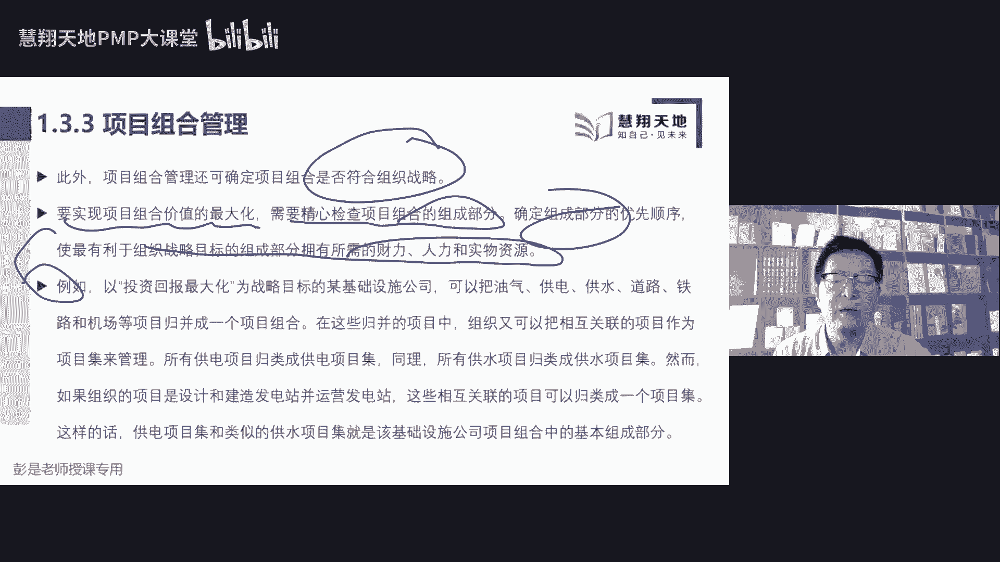

# 2023年最新免费第七版PMP课程 - 第二部分 - P1 - 慧翔天地软考 - BV1rF411y7g9

各位同学下午好，下午好，来了来了，现在是1。29，还有一分钟时间即将开始今天下午的课程，各位同学下午好，下午好，下午好，还有一分钟时间，大家检查声音，课件是否能够正常，声音是否能够正常听到。

课件能否正常解释，午睡睡了10分钟睡觉，午睡是个好东西啊，各位同学，下午好，下午好，还有30秒，今天开始下午的课程，午睡是个很神奇的事情啊，大家有没有有没有观察过，好像好像只有某些地区的人有午睡的习惯。

老外是不午睡的，但是老外到了中国，还慢慢的慢慢的接受了午睡这个事情，没有声音的同学，没有声音的同学点刷新，刷新重启可以解决一切问题，好了准备了准备了54321，各位同学，大家下午好。

咱们正式开始下午的课程，上午讲到了这一大堆，快速回顾一下，说对公司来说呀，目标愿景，使命价值观，然后定战略计划，有一些事情咱临时的独特的把它处理完，就当做项目去进行管理，有一些事情呢。

我们可能需要持续的重复的定期的去开展，就通常把它当做运营去进行管理，所以到底是什么是项目，到底什么是运营，不重要，取决于我们怎么看这个事情，对不对，今天比如C9C919十，C919首飞吧，好这个事情。

这个事情我们可以把它当做项目去进行管理，那第二次第三次，第四次慢慢的就变得变成了常态化，这样一个事情就是运营，然后又说项目启动之前有这么重要的三件事情，需求评估，商业论证和效益计划的制定。

需求分评估是告诉我们去寻找一些商业机会，商业论证呢更侧重于分析这个事情的可行性，以及价值，效益，管理计划呢更侧重于告诉我们，老板什么时间能够获得什么样的回报，什么时间会获得什么样的收益。

所以这个事情又有可行性，又有价值，老板才愿意投入资源，资金投入我们的人财物去做项目，项目结束以后，需要把我们的可交付成果移交给运营，以便于我们去更好的去持续的经营，持续的运作，实现价值。

那接下来接下来啊该做提了，看看这道题，通过做题检查我们对知识的掌握情况，以下哪一项不是项目的可交付成果呢，哪一个不是呢，项目管理团队所编制的项目管理计划，批量生产的汽车零配件。

学校新开发的课程研究课题所发现的知识项目，创造独特的产品服务或成果，诶这个东西是我们的，是我们的成果，科研成果，学校新开发的课程给大家讲p mp讲AC，P讲高项目，讲人口，对不对。

C也是我们的可交付成果，大家可能就是A和B容易纠结啊，A和B的区别在哪，能不能找到这个关键字呢，B选项叫批量批量，就制造业的制造业的同学肯定会知道啊，就叫生产工厂，我们生产口罩，生产汽车，生产零件。

生产矿泉水，源源不断的买原材料加工变成我们的成果，买原材料加工变成我们的东西诶，这是持续的重复开展的工作吧，持续的重复的开展我们的工作，所以它是叫量产这种东西呢，通常我们把它当作运营，通常把它当做运营。

那A选项项目管理团队所编制的项目管理计划，项目管理计划，就这种知识点，大家都想两个小问题就可以了，第一他是不是我们的劳动成果呢，是第二这个东西可不可以交付呢，可以所以我们项目的计划，项目的文档。

项目的这些资料也可以作为项目的可交付成果，所以这个道理大家随便想对吧，我们要盖房子，画的图纸是不是可交付成果呢，开发软件写好的代码，做的设计，各种资料是不是我们的可交付成果呢，是所以项目计划。

项目文件也可以作为项目的可交付成果，而量产它不一定不一定啊，那再看看这道题，以下哪一项最能表现项目的特征呢，需要制定进度计划，需要整合范围，进度和成本有确定的期限，需要由专门的团队来实施。

项目的典型特征，就那三个单词对吧，第一个是独特性，第二个是临时性，第三个是渐进明细的特点，项目创造独特的产品服务或成果，项目需要有明确的开始和结束日期，要有明确的起点和终点。

那整个项目信息会随着工作的开展，不断从少到多，从粗略到详细，所以呢最能表现项目特征，答案就是C，有确定的期限就确定题型啊，这种题考试的时候不会考的，考试时不会考，太简单了，基本概念题，所以问什么特点。

咱们就找项目的特性好了，再往下了啊，再做做这道题呢，以下哪一项说法是正确的，选A的同学再看看选A的同学再看看，还是老皮同学开心，同学看看选B的同学再看看，找一个正确的说法。

相对来说四个选项里面有一个选项说的还好，其他选项说的过分了，说的不对，A说既然和以前的项目，只以前项目的可交付成果比较，本项目的成果中存在着某些重复的元素，所以呢本项目从本质上讲不再是独特的了。

这就错了吧，存在着某些相同的元素，在某些方面肯定存在着不同，肯定存在着不同，所以A不对，B项目只能产出有形的产品，不对，我们知道有形也可以，无形项目产出的产品服务成果可以有形，可以无形的，所以B不对。

D选项说持续时间长达10年的工作，不应该当做项目来开展，这样的说法错误，对不对，这样的说法错误，项目项目的临时性和项目周期的长短没关系，有的项目周期长，有的项目周期短。

所以相对来说最合适的选项就是C项目，大多数人是为了创造持久性的结果，通常情况下，我们希望创造的产品服务成果不具有临时性，好再往下拉啊，看看这道题呢，以下哪一项是项目管理不可以逐渐细化的方面。

这道题如果做过预习的同学应该还好，没做过预习的同学可能稍稍有一点点，项目建立明细渐进，明细项目的所有信息都是逐渐清晰的范围，从粗略到细化，产品范围指的是什么呢，产品具有的功能。

产品具有的功能属性和特征对吧，我们要做研发一款新的手机诶，这是粗略的信息，这个手机到底是智能手机呢，还是什么折叠手机啊，待机时间有多少啊，多大屏幕啊，用什么CPU啊，多大存储啊，都是随着工作的开展。

会不断丰富，不断细化，D选项叫假设条件，假设条件是什么呢，就是大家日常工作生活里面通常会这么说，如果，如果如果如果如果明天不下雨，咱们一起出去玩儿，如果明天不迟到不迟到，我给你买早餐了诶。

那如果明天不下雨，如果明天不迟到，就明天下不下雨，迟到不迟到呢，它存在着不确定性，它存在着不确定性，所以它是我们主观上认为成立的条件和实践，那它存在着不确定性，我们就要考虑了。

这个东西意味着风险需要渐进明细，需要不断的不断的去确认这个条件是否还成立，所以这道题正确的答案是第二个范围蔓延，范围蔓延这个概念，后面我们会详细的给大家说，先大家粗暴有个印象啊，范围蔓延是什么东西呢。

范围蔓延啊是通常导致项目失败的主要原因，它指的是失去控制的，失去控制的范围的变化，失去控制的范围的变化是什么呢，我们没有考虑到范围的变化，是否会需要调整我们的时间成本质量，资源风险，以此类推。

所以大家日常在工作，在生活里边，在学习里面都会存在着范围蔓延的这种场景，所以举个例子，大家先听一听什么叫范围蔓延，今天晚上张三同学打算去打算去看看书，张三同学打算看看书，去回回顾一下今天的知识点。

回顾一下今天的知识点，但是呢张三刚打开书就看诶，手机有人给我发消息，看了会儿，手机发了消息之后，哎呀这个抖音刷一刷，抖音刷一刷，再上微博看看有没有什么热搜，哎呀。

这两天这两天什么什么浪姐进行到了二宫了吧，哎看看有没有什么热点新闻话题，以此类推，就不断的在改变我们，我们这个学习这个事情的范围，改变了这些范围，就对我们的进度，成本质量资源产生了深远的影响诶。

所以就是范围的变化没有得到控制，没有得到控制啊，可以看看手机看一下，马上回过来回过回过头来再来看书，这就是受控的范围的变化，所以大概粗暴理解一下这个场景好，所以答案是第二个好，再往下看看这道题呢。

组织所从从事的业务的整体价值，通过什么来进行体现，三康同学激动了激动了，淡定一点，四个选项都看完，四个选项都看完了，C肯定不能选啊，项目管理成熟度，项目管理成熟度，这不对，项目管理成熟度。

是你企业里边项目管理的这些方法标准规范，成熟不成熟这个东西好，所以正确的答案是B商业价值，商业价值包括有形价值和无形价值，其中A选项和D选项都是有形价值，企业除了有形价值，还有无形价值，对不对。

就是你企业的什么口碑啊，生育啊，这些东西好，再往下了啊，所以这道题正确的答案是第二个，再来做做这道题呢，以下都是商业价值的无形价值除了什么呢，54321，恭喜大部分同学答对了啊。

正确的答案就是A这种知识点考试也不会说啊，太简单了太简单了啊，只不过把这道题约还保留到这是干啥呢，其实知识点超简单，但是大家一定要注意这种否定词，否定词，如果脑子里面没转过弯来，就很容易选错。

考试的时候会，大家未来会看到大量的否定词，很多，很多老外出题非常非常喜欢用这种否定词啊，单重否定，双重否定，再复杂一点，三重三重否定，所以一定要转个弯来，以前都是商业价值，是无形价值。

除了让我们找一个有形价值呗，对不对，所以品牌认知度，公共利益，商标商誉，这都是无形的，A选项是有形的，好再往下走了，接下来我们看看今天1。2项目管理的重要性，听一听，这小段挺好玩的，商标算作是无形资产。

虽然你商标可以转化成有形价值，它是两回事啊对吧，你商标要转让能值多少钱，虽然它可以转化成有形价值，但是你注册商标这个东西它仍然属于无形，好再往下一点，二项目管理的重要性，项目管理的重要性，不着急。

吴志琴同学，多来点情景题啊，不着急不着急，现在大家如果没有掌握到足够的知识点，除了情景题，你学了这种题，你做了半天其实没有收获，想一想没有掌握到足够的知识，你现在做题不一定有收获对吧。

比如说我现在是个是个医学院大一的医生，大一的医生，医学院大一的学生啊，我想来个情景提议上来给我个疑难杂症，你知道半天就懵了，因为你啥都不知道，啥都不知道，好再往下拉一点，二项目管理的重要性，看一看啊。

项目管理，就是把知识技能工具和技术应用于项目活动，来满足项目的要求，变成人话，就是用我们的一生本领，想方设法的实现目标，完成任务，产出成果，所以呢需要运用我们什么什么整合特性，后面就不见了。

使组织能够高效有效的开展项目，项目管理，项目管理管理这个单词其实一点都不高大上，没有那么深奥啊对吧，我是个保安，来完成保安部门的管理工作，保安队长，保安队长来完成部门的管理工作，就这个东西。

项目呢只不过就是把我们的知识，技能工这些东西一身本领用到工作中，想方设法的让我们能够实现多快好省，实现目标，完成任务，产出成果，那1。2，再往下，有效的项目管理，能够帮助个人群体。

公共和私人组织达到一大堆的这一大堆，大家也不要背，看一遍就完事儿了，看就可以了啊，就是全都是正能量的话术，实现目标，满足期望，提高可预测性，提高概率，然后交付正确的东西，解决问题，处理好风险。

那这一大段文字需要大家记住的第一个知识点，这两句话我们要管理相互竞争的制约因素，范围，质量进度成本资源再加个风险，这就是传说中的六大制约因素，为什么叫六大制约因素呢，因为大家想这个道理啊。

如果国项目想增加范围，会不会改变进度，会不会让成本发生变化，会不会影响到资源，会不会带来风险，会不会会不会对质量产生影响，会吧还增加了范围，增加了范围可能需要更多的时间就会改变进度。

那为了解决进度这个问题，我考虑啊增加更多的资源，增加更多的资源诶，可能进度的问题解决了又会引起，又会引起成本的变化，那引起了成本的变化，我想想这些资源要不要降一些，降一些水平，降一些等级呢。

唉把成本的问题解决了，可能有带来质量的问题，质量的问题有可能引发一系列的风险，这就是传说中的六大制约因素，六元六大制约因素的概念是说，随便改变一个因素，随便改变一个其中的东西。

会或多或少引起一系列的连锁反应，相互竞争，相互制约，所以有了后面这句话，我们要考虑平衡制约因素对项目的影响，例如范围扩大可能会增加成本或者是延长进度，我们要找到一个平衡点，找到一个平衡点。

这是项目经理非常重要的一件事情，好那除了这个破玩意儿，除了这个破玩意儿，我们项目中还有四大恶人，后面会讲到预测型鬼畜啊，四个四个讨厌鬼，四个讨厌鬼都在这块儿叫什么呢，变更，风险，问题和。

冲突把争议这个词换成冲突，如果我们做好了计划，这四个东西不出现，没有风险，没有变化，没有冲突，不会出，不会发生问题，我们项目肯定能能做得顺风顺水，但就是项目中这四个东西无处不在，每天都可能有新的变化。

风险随时有可能会发生，工作可能会出现问题，大家的观点意见不一致，优先级资源竞争都会导致产生各种各样的冲突，这就是传说中的项目中的四大恶人，所以项目经理最重要的两件事情，第一找到竞争竞争制约因素的平衡点。

第二呢想方设法的排除掉这些，对我们对我们形成的阻碍，阻碍我们成功的人和事，阻碍我们成功的人和事情，好，这两个知识点先听一听啊，再往下说，项目管理不善或者是缺乏项目管理，可能会导致。

就是就把刚才刚才那一段话，全都变成负面的东西，成本超支，然后进度延误，质量低劣，反攻，这都不念了，这东西完全不用背，都是看一遍就够了，再往下这一章说，这一小节又说，项目是组织创造价值和效益的主要方式。

在当今商业环境下，我们需要应对什么，什么预算紧缩，时间短，稀缺资源，技术快速变化的情况，商业环境动荡不定，变化越来越快，为了保持竞争力，我们需要用项目来创造商业价值。

这一大段文字就是上午给大家说的那个道理，商业环境有可能，无时无刻会发生各种各样的变化，出现了变化呢，就会产生一些影响企业的因素，受到企业的影响，我们就不得不做点事情来进行应对，有项目项目之后呢。

我们把成果移交运营去，想办法叫实现价值，所以这段文字大家也是听一听就完事儿了，听一听就完事了啊，项目在帮助企业创造价值，然后通过运营去想办法实现价值，那在运营的过程中，我们要看一看环境有没有发生变化。

如果发生变化了，我们再去通过项目创造新的价值，再去通过运营去想办法让这个价值最大化，企业就基本上这点这点事儿好，所以这一段大家后面复习的时候，基本上看一遍就完事儿了，看一遍就完事了哈。

记住一个六大制约因素，在多快好省的基础之上，再加一个范围和呃，再增加一个资源和风险最大，这个因素就是多快好省加资源和风险，另外项目中的四个讨厌鬼变更风险问题和冲突，好看看这道题，哪一个更重要呢。

范围时间成本和质量相互制约的因素是中，通常范围最重要，质量最重要，管理层决定哪个更重要，项目经理决定哪个更重要，找一个相对来说最合适的选项，领导说的说的对吧，所以呢正确的答案是C。

正确的答案是C范围是不是最重要呢，不确定质量是不是最重要的呢，不确定项目经理有没有这个决策权，不确定不确定啊，所以呢领导这是管理层，我们要了解管理层对项目的期望，我们要了解管理层对项目的期望。

这种东西带入到大家的生活场景里面，就有好理解，比如说比如说啊各位同学中午应该吃好了吧，就吃饭那个小事情，中午大家休息一个半小时，有的同学说，老师啊，上午听课太累了，中午吃饭啊，凑合吃一口，凑合吃一口。

这种情况下，范围重要吗，质量重要吗，成本重要吗，还是说你更关注的是时间，对不对，赶快吃完，赶快吃完，赶快吃完，唉准备上课了，所以不同的项目，不同的项目要求不一样，期望不一样肤浅了，所以正确答案是C。

因为大家带入到工作场景里面去思考，大家想一想身边有没有遇到过这样的项目啊，有的项目即使是赔钱也会做，有的项目即使是赔钱也会做，有的项目呢可能是范围更重要，把活干完就可以了，质量差一点没关系。

质量差一点没关系，有的项目呢是质量第一，功能少一点没关系，是不是这个意思，是不是这个意思啊，好了，所以最后总结出来，各位同学都是三个字啊，看情况不一定所有的项目都赚钱，不一定所有的项目都要按范围去完成。

不一定所有的项目都追求质量，变成了就是看情况看情况，好了大家再往再往下走一点，三项目项目集和项目组合和运营，这里面要带出来一大堆的cos的概念，先看这一小段儿说在项目管理，项目管理过程。

工具和技术的运用，为组织达成目的和目标奠定了坚实的基础，一个项目可以采用三种不同的模式进行管理，第一作为一个独立的项目，不包括在项目组合或者是项目集中，第二呢项目包括在项目体制内。

第三呢项目可能会包括在项目组合，那这两个单词什么意思呢，这两个单词什么意思呢，什么叫项目集，什么叫项目组合，什么叫项目集，什么叫项目组合，大家想一个事情啊，想生活中的生活中生活中的场景。

有的时候咱们这个上课的平台小额通写不上字，干着急啊，然后有同学给我推荐了一个什么东西，我还没下载，后面后面想办法去改善，好大概看一看这个意思就可以了，向各位同学啊，买房和你小孩上什么学校，这两个事情。

这两个事情是不是B取决于A的成果，是不是B取决于A的成果，你买什么地方的房子，小孩就上什么地方的学校，对吧，你买学区房，小孩就上好学校想啊，对不对，买普通地方的房子，小孩就像一般的房子，提一般的学校。

就这个东西吧，诶这两个项目之间存在的叫什么呢，我们把它称之为内在的这种依赖关系，它存在着某种依赖关系，那这两个东西，这两个东西我们就可以把它画个圈圈，画个圈圈，这种管理方法叫项目集。

这种管理方法叫项目集，大概粗暴理解一下哈，粗暴理解，接下来大家其实可以带入到各种场景里面去了，代入了代入到各种场景，比如说我们那个餐厅，餐厅装修这个事儿，买设备这个事情，他俩之间有没有依赖关系呢。

讲了一个道理，这边没装修完呢，设备进去了，结果啊装修的暴土扬尘呢，把设备都弄坏了，弄脏了，诶，对不对，所以B这个事情它取决于A成果，目前的进度取决于A成果目前的进展，这两个事情之间存在着某种依赖关系。

我们把它画一个圈圈圈到里面来，统一协调，统一管理，这种管理方法就叫项目级，这种管理方法就叫项目级，因为如果讲了一个道理啊，如果没装修完呢，设备都进场了，哎把设备弄脏了，过两天再装修完了之后。

这个设备可能就不能正常工作了，我们还要去维修，去保养，还要把它擦干净，这就造成了什么呢，浪费，这就造成了浪费吧，为了避免这种浪费，让我们一次把这两个事情都搞定都做好，一次把这两个事情都搞定都做好。

就想办法让1+1大于二，这种管理方法就叫项目集，就叫项目集啊，好知道这个中心思想之后，再看项目组合这个概念，项目组合这个概念也给大家粗暴举例子啊，有的同学说老师啊，我的我的人生清单。

现在上面有很多事情啊，买房学p mp，开车找对象，换工作好了，对有些同学来说，大家可能身上现在有很多事情要去做，买房买车学p mp，然后找对象就找对象，换工作，这么多事情，这么多事情。

哪个事情对你来说优先级更高呢，哪个事情对你来说优先级更高，对不对，因为对人来说，我们的什么是有限的时间精力资金，对不对，我们时间精力资金是有限的，我们要把有限的精力，好钢用在刀刃上，好钢用在刀刃上。

就需要对这些事情做排序，去分析，什么时期对我们来说最重要的事情是什么，有的有的同学可能今天不能听课，今天不能听课啊，可能在工作，有的同学可能今天不能听课，去相亲了，有的同学今天可能喜提玛莎拉蒂。

有的同学可能今天在买房，那就是对这些同学来说，相对来说这些事情今天对他来说更重要性更高，重要性更高，对不对，唉所以对企业来说还是这个道理，对企业来说还是一个逻辑吧，对企业来说，我们要做的事情这么多。

有项目，有运营，项目呢，又又又可能有A项目，B项目，C项目D项目，有很多项目要做，要做的事情这么多，哪些事情对企业来说更重要，因为我们做项目，做项目要投入人，财务，对企业来说，我们这些人财物人财物对吧。

资源资金，资源资金，我们怎么确保这些资源资金好钢用在刀刃上呢，让我们的精兵强将去攻克那些有价值，有有重要战略意义的项目，普通的项目可能就交给普通的员工了，所以呢需要对这些事情排排序。

分析哪些事情对我们企业来说更重要，优先级更高，我们在资源和资金资金上给予倾斜，资源和资金上给予倾斜，所以像这种东西，大家随便你搜一搜，看看题，看看题啊，比如说苹果，华为苹果，华为。

大众奥迪宝马都是这样的，你看看苹果对吧，比如说苹果它生产出来的产品有这么多，有手机，有电脑对吧，有耳机，有耳机，这么多东西，这么多东西，他要做的事情这么多，什么东西是他最赚钱的那一部分呢。

什么东西优先级更高呢，他要排排序了，以此类推吧，你看这些汽车大厂有很多车呀，轿车SUV对吧，什么越野车，特种车辆，那对企业来说，什么样的车对他来说最赚钱呢，要排排序了，排排序了，分清楚轻重缓急。

分清楚重要性，优先级来合理的分配我们企业的人财务，所以项目组合最终最终的他的中心思想就是，好钢用在刀刃上，好钢用在刀刃上，确保确保我们能够更好地实现企业的战略目标，实现企业的宏图打野好。

知道这个中心思想之后，这就是项目项目集和项目组合，大概这个意思啊，知道的道理再往下看，项目级排序更排的侧重于排的是什么呢，依赖关系就是先后先后先后这个逻辑吧，项目组合排的是什么呢，优先级。

回过头来再看书上教材这段内容，如果在项目组合或者是项目集内管理某个项目，那么我们需要和项目及项目组合经理互动，例如未达到组织的一系列的目标和目的，可能需要实施多个项目，在这种情况下。

项目可能会被放入到项目集里边，项目级的概念就在这改了一句话，是一组相互关联并且被协调管理的项目，子项目集和项目及活动，以便获得分别管理者无法获得的利益，分别管理所无法获得的利益。

就是想办法看看能不能避免浪费，赚更多的钱，想办法1+1，让他大于二，想办法1+1，让它大于二，就这个东西吧，好所以有些同学比如说你现在在学p mp，本来想学什么软考高项中项。

有的同学想学1+2建这个东西，你完全可以把它把它放到一个圈圈里面，统一管理对吧，因为一建二线高校里面也涉及到项目管理的，项目管理的知识，咱就把这个东西合并到一个项目集里面去，这样的想办法学一遍项目管理。

K这些项目管理的知识就全都掌握到位了，然后再去学专业知识，就这个玩意儿再往下，有些组织可能会采用项目组合，以有效管理，在任何特定时间内同时进行的多个项目级，或者是项目，项目组合。

是指未实现战略目标而组合到一起管理的项目，项目集或者是子项目组合或者是运营工作，所以这两句话听完了之后就粗暴理解，项目集里边可能有项目，子项目集是什么意思呢，就是更小的项目级。

项目组合里边呢可能就是包括了项目，项目及更小的项目组合，也可以包括运营性质的工作，这两句话听懂了之后，听懂了之后，主要是通过这张图大概知道这个含义，高兴是什么，不重要不重要。

所以书上下面就给了给出了这张图，展示了项目组合，项目及项目和运营在特定环情况下怎么关联的，项目一是一个单独的存在，把这个项目完成实现目标产出成果就结束了，项目二和项目三呢放到了项目及A里边。

说明这两个项目之间存在着依赖关系，存在着关联关系，项目级B呢太大了，天下大势，合久必分，我们把它拆分出了一个更小的子项目集，就有了B1子项目集，里面就包括了项目四和项目，而项目组合呢是说。

只要和组织战略相匹配的东西，我们把它都放过来，放过来就包括了项目及789，甚至可以包括运营性质的工作，总之他对里面的一些构建这些事件，这些事情做排序，合理的分配，我们的人财物，就这玩意儿。

好继续往下往下走，往下讲下一段了啊，所以1。3。1就给出了关于项目及相关的，一大堆的概念，项目集管理和项目组合关注点不同，但是项目组和项目集和项目和运营，通常都涉及到相同的干系，人，可能用到同样的资源。

这就可能会导致组织内出现冲突对吧，大家工作都需要张三，工作都需要都需要什么车，都需要挖掘机，就这种东西都需要办公室，都需要电脑，所以这种情况促使企业增强什么内部协调，通过项目组合，项目集和项目管理。

达成组织内部的有效平衡，就是啊可能会出现问题，可能会出现冲突，我们呢大家协调协调相互关联的，就放到项目集里边，你们俩去协调和企业战略相关的，大家可能会抢资源，抢资金，我们就排排序，分个先来后到。

分个先来后到啊，好接下来这句话非常非常重要，让大家再巩固一下，到底项目组合和项目及他工作重心是啥，所以从组织的角度来看，项目项目集和项目组合管理，第一项目集和项目管理，更侧重于以正确的方式开展。

项目集和项目在聊啥呢，他思考的出发点就是，如何把事情做正确，怎么把这个活儿干好，项目经理更关注的是装修这个活儿怎么干好，B项目经理更关注的是哎，我们这个买设备这个事，怎么把这个设备安装好。

调试好这两个项目，这两个项目经理上面的那个项目及经理，关注的是，同时同时让装修和买设备这两个事情，我们把它一次都搞定，不浪费不浪费，不要让他们相互之间产生影响，带来问题，他关注的都叫如何把事情做好。

如何以正确的方式把这个事情去完成，而项目组合管理不一样，项目组合管理关注的是什么呢，开展正确的项目集和项目，它更关注的是做什么，做什么事情对企业来说是正确的，做什么事情对企业来说是正确的。

所以项目组合最后中心的中心思想是啥呢，关注的是what，项目集和项目组合关注的是方法好，就这样一个区别对吧，我是想学习，想买车，想买房，还想跳槽换工作，现在做什么事情对我来说就更重要。

哎这就像项目组合管理，项目集关注的是方法对吧，怎么把这个PMP学好，怎么把房子买到位了，怎么找到一个心仪的对象，以此类推拉关注的是方法，怎么把这个事儿做好，这就是他们中工作中心的区别。

知道了知道了这个大道理，知道了这个大道理啊，再回想一下上午见过的，隐隐约约见过的一张图，那对企业来说要做的事基本上就这么几个了，目标愿景使命，价值观，定企业的战略计划，战略计划一旦敲定了。

我们就知道我们有可能有ABCD，很多项目要去完成它，项目创造的产品服务或成果，我们还要通过运营去想办法去实现它，实现那个价值，那在其中在其中有相互关联关系的，有依赖关系的。

我们可能有采用项目及这种管理方法，想办法一次把多个事情处理好，一次把多个事情处理好，另外要做的事情这么多，我们就需要排排序了，于是呢就发明了项目组合这种管理方法，去分析什么东西跟企业的战略相关。

哪些东西和企业的战略相匹配，把不重要的事情踢走，把重要的事情放进来，然后排排序打排序，所以现在在各位同学备考PP，备考PMP这条的，这这这这条路上，就可以把一些不重要的事情剔除到。

从项目组合里面踢出去了，比如说什么刷抖音，刷微博，刷微博，看小红书，看电影，看综艺，追剧玩游戏，就像这样的事情，我们就把它从项目组合里面踢出去，因为它可能影响到我们战略的实现，就这玩意儿好。

再往下看了啊，132项目机管理，项目集管理约会这种事情可能是人生大事，人生大事啊，可能反而会纳入到项目组合，对不对，好再往下再往下，后面这段大家其实读多读两遍就完事了，项目即是指我们什么知识啊，技能啊。

来分别获得分别管理无法获得的利益，这咱知道了项目题的组成部分，包括项目和其他更小的项目及，它关注的是相互依赖关系，来确定管理项目的最佳方法，他更关注的是好方法论，他注重作为组成部分的项目和项目及之间。

的各种依赖关系来确定最佳方法，这都是标准的套话，关键词就那么几个事情吧，就想一个场景A和B存在着依赖关系，想办法1+1大于二，想办法1+1大于二，好再往下，后面这一大段，就是项目和项目集之间的具体措施。

这段文字大家其实看一遍就完事了，记得住记不住不重要啊，还是那些那些四个讨厌鬼问题，冲突风险变更，问题冲突风险变更，再往下翻，书上又给出了一个非常非常好理解的，项目级的例子，说建立一个新的通信卫星系统。

就是一个项目级的实力，其中所辖项目包括卫星和地面站的建设，什么设计啊，建造啊，卫星发射呀，以及系统的整合，所以粗暴想场景大家都知道，那个马斯克吧也没没事，发个没事，发个卫星，没事发个火箭去不断的迭代好。

地面战舰这么大，然后火箭都这么小，这是浪费，地面站建这么小，火箭建这么大，这也是浪费，想办法把这两个事情协调好，想办法一次一次如何，就是那个号怎么把多个事情处理好，这就是项目期。

所以后面这段文字基本上以看为主啊，133项目组合管理，项目组合是指为实现战略目标而组合在一起，管理的项目，项目及子项目组合和运营工作，那我们要去分清分清，目前对企业来说，实现战略目标的东西都有哪些。

实现战略目标的东西都有哪些，就把它放进来，和战略无关的事情就把它踢出去，就这玩意这玩意儿，学到这个程度，再加一个小小的知识点，再加一个小小的知识点，项目组合里边可能有项目，可能有项目及可能有子项目组合。

可能有运营，那项目组合里边有没有可能只有运营呢，项目组合里边有没有可能只有运营呢，可以吧，不犯法哈，不犯法哈，我餐厅餐厅开业了，开业了，没什么项目可以做的，每天我就抓运营，不犯法吧，每天我就抓运营。

提高服务的质量，提高服务的效率，降低成本，增加效益，可以吧，唉各种可能性，总之看看企业在不同发展时期，你的战略目标是什么，如果有项目就把它放进去，如果没项目，没项目，你就只有运营了，就抓运营。

所以大家完全可以对标到，对标到自己企业目前的发展阶段，看看自己企业目前发展到了哪个阶段呢，对不对，不一定，所有的企业都有项目，也不一定所有的企业不一定，所有的企业说战略里面一定要有项目，一定要有项目集。

一定要有项目组，子项目组合不一定的，可能只有运营，对不对，好，然后有同学就已经学到位了啊，初创的企业，初创的企业就没有运营，这也好理解吧，这句话说出来就是给大家启发的，5427同学非常非常棒。

大家按照5427同学这个这个问题去想一想，项目集里边有没有可能有运营，项目集里边有没有可能包括运营呢，领导决定啊，这话这话说的太抽象了，太艺术了，项目集里边有没有可能包括运营。

那项目集里面有没有可能包括运营，我们换个角度去理解这句话，项目的成果会不会影响到运营呢，项目和运营是不是也有可能存在着依赖关系呢，项目和运营是不是会存在着某种依赖关系，有吧。

我这个设备我这个设备迟迟买不到位，餐厅没法开门，对不对，买回来的设备都是什么火锅的餐具，然后我们是个快餐店，没有火锅啊，开不了门吧，诶项目项目的成果有可能会影响到运营，这种情况下。

我们就可以把它放到一个圈圈里，放到一个圈圈里，再变成高大上的场景下啊，我们要开满村度假村，这个度假村的建设项目，是不是会影响到度假村的运营呢，它俩存不存在的依赖关系呢，我们要修高速公路，这个修高速公路。

这个项目会不会影响到高速公路的运营呢，有没有可能呢，再变成大家身边身边看到的场景，又写不上字了，我们要盖个房子，盖不盖个房子啊，盖完了房子，我们的物业就帮助大家天天修修补补，如果这个房子是个豆腐渣工程。

唉我们运营的同事辛苦不辛苦呢，就这个道理吧，就这个道理，所以某些工作，如果项目项目创造的产品，服务成果和运营工作存在着某种依赖关系，我们完全可以把它放到一个圈圈里，想办法一次提前提前提前一次。

把这个事情规划好，设计好，所以以此类推啊，项目结束以后转运营了，这也是很常见的场景啊，所以大家吐槽的报考点的这些同学，应该深有体会对吧，运营擦屁股的干，擦屁股这种这种事情好了，知道了个大概意思就够了啊。

好红红同学，这个问题就带回来了，那项目项目有临时性项目及有没有临时性，项目组合有没有临时性，活学活用啊，项目有临时性，但是运营有没有临时性呢，没有，所以如果是项目加运营，这个项目集它不一定有临时性。

文字游戏啊，A具有临时性，B没有临时性，我们把它俩加到一起，这个事就不一定有临时性了，所以项目集不一定有临时性，对不对，活学活用，活学活用，好再往下了，刚才讲到，这个再往下看。

项目组合管理指的是指导组织的投资决策，其实就记这一句话就完事儿了，直到组织的投资决策是什么呢，就是企业好钢用在刀刃上，好钢用在刀刃上吧，我们这个钱花在哪儿，投资在哪，投资在哪，我们到底是搞人工智能呢。

还是盖房子，还是开餐厅还是开餐厅，我们的战略重心在哪对吧，好钢用在刀刃上，所以他要选择项目集和项目的最佳组合方式，来实现企业的战略目标，然后呢确定团队和实物资源分配的优先级人，才。

人财物确定这些人财物的分配的顺序，优先级重要性对吧，有的企业可能现在在赌人工智能，那就一把梭哈，其他项目都停一停，我们把把精兵强将，把我们的资金都抽调到JPT，这种人工智能项目上去，以此类推了。

所以一堆事儿一堆事情排排序，合理的分配好人财物，这就是项目组合管理的方法，再往下，此外项目组合管理，还可以确定项目组合是否符合组织战略，要实现项目组合价值的最大化，我们需要精心检查项目组合的组成部分。

确定项目这些组成部分的优先顺序，来合合理的分配好我们的人财物，这段这段话还带出那个事情，然后书上就给了一个项目组合的例子，这咱就不垫了，后面大家需要关于这段文字去看。

