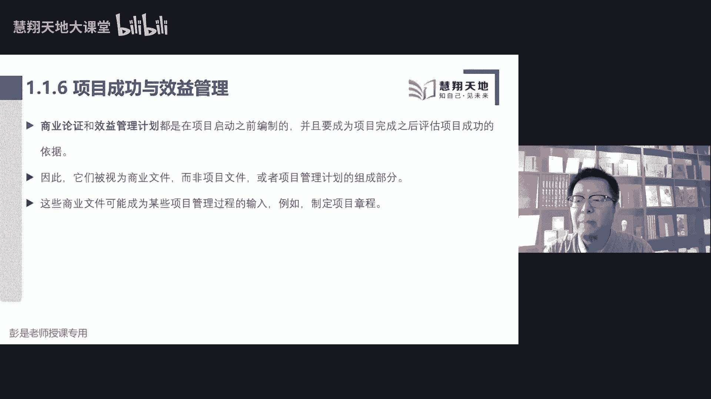
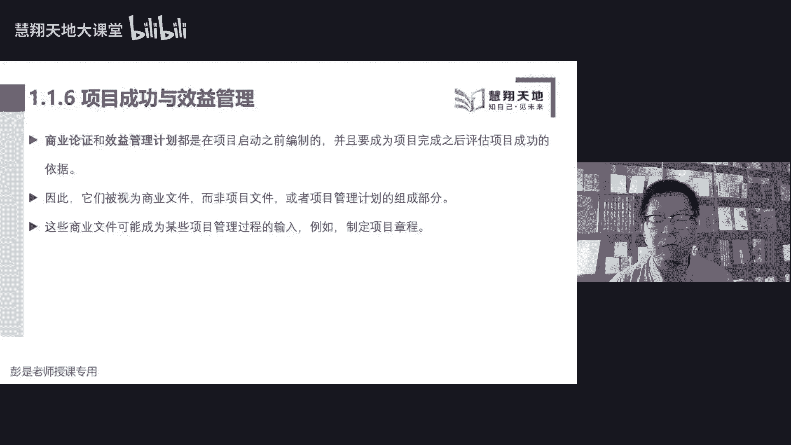

# 2023年第七版PMBOK考纲／免费PMP课程学习／项目管理基础知识 （二） - P1 - 慧翔天地软考 - BV1nk4y1g7vu

去了啊，再往下再往下，现在课件上的内容，大家教材上没有，所以只要听就够了，只要听就够了，项目其实还有第三个特点叫什么呢，叫渐进明细，渐进明细的主要中心思想就是什么呢，信息从少到多，会不断的丰富。

不断的细化，不断的丰富，不断的细化，我们要开一家餐厅，我们要开一家餐厅，这句话听完了之后，他就是非常非常非常粗略的一句话，对不对，这个方向非常粗略非常粗略，在哪开餐厅，什么时间开，开多大面积。

你要做快餐啊，做火锅啊，做麻辣烫啊，对不对，这个餐厅这个餐厅，这个餐厅大概打算招多少个服务员呢，哎以此类推啊，经理是谁啊，老板是谁呀，每天营业时间是多少呢，都是随着工作的开展，不断不断不断的去细化吧。

唉这就是项目渐进明细的特点，一开始我们可能只有高层级的概括的，粗略的这种信息，然后随着工作的开展，我们会去不断的丰富和细化它，这就是项目渐进明细的特点，知道了这个中心思想之后，再看书上这段文字。

教材上PPT上，PPT上这段文字，听一听就完事了，鉴定明细是根据在整个项目生命周期中，收集了新的相关相关见解，不断的改进我们计划的过程，在项目初期，由于提供的信息很少。

所以呢制定详细的计划通常具有挑战性，那鉴定明细指的是随着信息越来越丰富，越来越多，越来越具体，我们可以持续的去细化这个计划，来适应新的情况，这就是项目渐进明细的特点，好知道这个中心思想OK了。

是否需要购买pm和第七版，看情况看情况，备考的话只要看通关宝典就够了，备考的话考试的话只要看通关宝典就够了，然后有个人收藏偏好的同学，你想买就买想买想买想买就买啊，不买也可以的，取决于你自己的需求。

考试的话咱通关宝典就够了啊，好所以看情况贯穿上课期间，对，从现在听课到后面考试，就是冯老师一直在说这三个字，看情况看情况，看情况是什么呢，活学活用，渐进明细，敏捷是渐进明细。

传统的预测性项目也是渐进明细，它是所有项目共性的特点，好再往下1。1。3，又说了，项目驱动变更，项目驱动变更，驱动变更是什么意思呢，这段内容大家也是听就可以了，就看书上这张图，就看书上那张图听是说的吗。

什么意思啊，现在啊这家公司有两个部门，然后这家公司呢，我们由于由于商业环境发生了变化，我们要做组织变革，组织变革对吧，比如现在各大企业差的GPT横空出世，各大企业都开始搞人工智能，这不是企业变革吗。

嘿做了企业变革之后，企业就会从当前状态达到将来状态，那什么东西什么东西，那什么东西来促进企业变革呢，就是通过项目的形式，这句话能听懂吗，我们企业没有人工智能，现在人工智能比较火，我们要出什么。

现在百度什么腾讯，大家都跟风啊，都带出人工智能，我们要成立一个部门搞人工智能，然后招兵买马诶，这种企业变革，这种企业变革，对企业来说也是一种临时的事情吧，也是一种临时的事情。

所以通常通常这个事情是通过项目的形式进行，驱动的，这就叫项目驱动企业变革，项目驱动企业变革，对企业来说会得到了一个什么变化呢，价值让企业价值得到了提升，所以变成大白话就是增值，变成大白话就是增值。

所以大家完全就可以把这张图对标到各种场景，对标到各种场景啊，接下来给大家说几个粗暴的例子，比如说我企业做做快餐，我们天天做汉堡，做汉堡，但是发现了现在这个东西卖不动，这个东西卖不动。

周围的周围的这些这些这些客人呢，可能更爱吃煎饼，更爱吃煎饼好，我想增强让我们企业有摊煎饼的能力，这样的事情是通过项目的形式去把它完成的，买设备，学习怎么摊煎饼，然后招人招人就是项目吧。

招完之后招完人之后买原材料做煎饼卖出去，买原材料做煎饼卖出去，这是运营，所以通过开展开展更多的摊煎饼站的项目，让企业价值得到了提升，让企业价值得到得到了提升，原来只能做汉堡，现在还能做煎饼，再换个场景。

再换个场景，现在给大家讲p mp，然后呢我要备考，我要备课，备课还能讲软考CPNPTP，唉，通过这样的形式，通过项目的形式，让我去让我能够给大家提供更多的服务，这样呢我的身价就提升了，就这个道理好了。

所以这样的事情，这样的事情通常是通过项目来进行驱动的，就有了书上后面这段文字，项目驱动变更，项目驱动组织进行变更，从商业角度看，项目的目的，是推动组织从一个状态转移到另一个状态，从而达到特定的目标。

所以呢就有了开始将来和中间的过渡，在项目开始之前，我们现在企业是这个情况，就像刚才那张图，然后通过项目呢能够让企业得到一些增值，达到将来状态，在项目开展的过程中就称之为过渡状态，达到将来状态之后呢。

企业价值就得到了提升，实现了特定目标，所以这个1。1。3驱动变更那段，停一停就完事儿了，主要是大概对这张图有印象啊，对这张图有印象，最后呢再记这样一个结论就完事了，项目在帮助企业，创造价值。

项目在帮助企业创造价值，我现在在讲PMP，这是当前状态，然后呢我准备好了ACP的课程，还帮我创造了新的价值，增值增值价值得到了提升，所以就像各位同学，今天上课之前是你过去的当前状态，现在在听课。

在接受PMP的培训和洗礼，这是中间的过渡状态，一旦通过考试拿到了p mp证书，你的身价就有所提升，对不对，就得帮助你个人创造商业价值，有的同学会说，老师啊，我拿到证书，拿到证书之后，工资没涨，工资没涨。

那我得到了什么增值呢，工资没涨啊，有形价值可能没有，但是你会带来无形价值，这个东西总会有的吧，哇你好厉害，通过考试拿到证书，我给你点个赞，哎无形价值包括了你的名声，名气声誉对吧，还掌握了知识啊。

哎这都是无形价值，所以这样，这样把前面那个知识点串一串就完事儿了，再往下继续了啊，好有同学问啊，说变更以后有可能有好变化，变差吗，这个变更一定是正面的吗，哎好问题好问题真的是好问题，大家讲对吧。

各种可能性吧，各种可能性啊对吧，有的同学可能绞尽脑汁备课备课，然后呢影响了工作，影响了生活，影响了家庭，是不是这个道理可能反而会带会带来负面价值，咱们只不过前面那个是正面案例啊，各种可能性好，114。

114啊，刚才那个知识点给大家讲完了之后，大家看一看114，书上这段文字是不是都学会了呢，讲过了吧，讲过了吧，项目创造商业价值，Pmi，把商业价值定义为，从商业运作中获得的可量化净效益。

效益可以是有形的，无形的，两者兼有对吧，不是民就是利啊，趋名逐利，趋名逐利，不是名就是利，就这样粗暴理解对吧，可以可以让这公司说，公司说通过考试拿到证书给你涨工资，这都是有形的，这是有形的。

包括大家拿到的纸质证书，这也是有形的，然后发个朋友圈，获得了一大堆点赞，这就是无形价值，效益可以有形，可以无形，然后再往下在商业分析之中，商业价值被视为回报，即投入时间资金货物或者是什么悟性的回报。

这部电了啊，效益不等于成果，商业价值是指项目的成果，能够为干系人带来的效益，想一想这个东西，项目的成果能够认为干洗人带来的效益，餐厅做好的菜让我吃饱了，让我吃饱了，让我不至于饿死诶，这就是效益。

餐厅做的菜很好吃，让我很开心，很满意，这就是无形价值对吧，这个价值可能是负的啊，可能是负的，餐厅做的菜里面有头发，有里面有头发，有烟头，让我很不开心，这就是负面的效应，所以成果成果成果交给别人。

如果人家很满意，这才会得到正面的价值吧，正面的价值啊，好再往下，接下来书上就给给大家列出来的这种这种东西，有形的无形的效应，这段这段内容听就完事了，这玩意儿完全完全，大家不要去背，千万不要去背啊。

有形的效益，包括什么货币啊，股东权益啊，公共事业啊，就是看得见摸得着的这些东西，无形的效益呢就是明就是名，左边呢就是力，就这样粗暴理解就够了，什么商标啊，生育啊，公共利益啊，品牌认知度啊，好PMI是啥。

PMI是咱学的PMP证书的颁发机构，项目管理协会，这段114听就完事儿了，好115又来了新的知识点，115这一段大家也是听理解，听懂大概意思就可以了啊，这东西不记不记不住，没关系的，组织领导者启动项目。

是为了应对影响该组织的因素，这些基本因素分为了说明了项目背景，大致分为什么，后面的四大类符合法律法规或者是社会要求，满足干系人的要求，或者是需求执行变更业务，或者是技术战略创造改进。

或者是修复产品构成后服务就是解决的是，为什么为什么要做这个项目呢，为什么要做这个项目呢，想一想刚才给大家的那个场景对吧，我们要创业赚钱赚钱，你到底是为了更好的生活下去，还是为了能够生存下去呢，对不对。

这是个问题吧，你是为了生活还是为了生存，哎这就是我们开展这个事情的动机，就是目的就是目的啊动机，那这个目的，这个目的可能来源于各种各样的原因对吧，什么符合法律法规或者是社会要求。

这两天这两天大家有没有听过那个那个热搜啊，什么什么脱口秀对吧，违规了整改，脱口秀违规整改，这是不是个项目呢，是是把这个项目完成，是为了干嘛呢，更遵纪守法，更遵纪守法啊，满足干型的要求或需求对吧。

我们为什么要开餐厅，为什么要盖房子，为什么要修路呢，因为大家有需求对吧，这地方有车辆要走啊，大家要吃饭呐，哎满足相关相关群体的这种要求和需求，第三执行变更业务或者是技术战略对吧，现在什么差的DVD。

就这玩意儿差的TPT这种东西比较火呀，那我们公司要跟风啊，跟风啊，来我们上项目上项目对吧，进行组织改革，我们要出产品，出产品出服务，唉这是执行变更业务或者是技术战略。

最后呢创造改进或者是修复产品过程或服务，就像贝克研发新的产品，研发新的汽车，所以这是因为各种各样的原因，这是为什么就是动机，这都听就完事儿了，为什么有这一大堆东西呢，为什么有这一大堆东西呢。

就是这么四个四个话术啊，这段也是听就可以了，商业环境在变，商业环境在无时无刻的发生各种各样的变化，对吧，今天什么差的GPT横空出世，人工智能后天再在炒什么元宇宙对吧，这个过两天又出个什么新冠。

然后搜一下新冠又没了，今天出个独角兽，明天出个白天鹅对吧，说过两天就这样，今年年初什么什么机油燃油车，燃油车，然后突然突然全全国降价，然后又开始推推电动车，商业环境。

无时无刻不会不在发生着各种各样的变化，商业环境一旦有了变化，商业环境一旦有了变化，我们的企业就可能会受到影响，这也好理解吧，商业环境又发生了变化，咱们企业可能就受到影响，我们企业可能就不赚钱了。

那我们企业受到影响之后，不能坐以待毙的，我们需要想办法做点事儿，来做出一些调整，想方法做点事情，来做出一些调整，适应这个时代，适应这个环境，这样临时的事情通常就叫项目，就叫项目啊。

所以呢做的事情就去调整，去变革去变革，然后呢创造了产品服务车祸成果，帮助企业价值得到了提升，就进入到了标准化规范化的日常运营，这种常态化的工作模式了，然后我们再去看一看商业环境是否发生变化。

会不会出现新的影响企业的因素，要不要再做一些事情做出调整，然后再交给运营，所以就像这个循环，这个循环变成大白话，变成大白话，大家更好理解的场景，就是我们开了餐厅，然后发现这个我们做火锅，做火锅卖不动。

生意不好做，生意不好做，旁边开了个麻辣烫，开了个摊煎饼的，还抢生意，抢生意，就是环境发生了变化，那我们不能坐以待毙啊，我们要改革，对不对，我们也摊煎饼，我们卖汉堡，我们做薯条做改革。

改革就通过项目创造了新的产品服务或成果，项目完成以后呢，我们就进入到了常态的运营模式，每天做薯条，做汉堡，炸鸡腿，讲饿了哈，说饿了好，进入到了运营模式，我们再看一看环境有没有变化，环境有没有变化。

会不会又出现了一些新的竞争对手，然后我们再做做做，做调整，再做调整，在运营就不不断不断不断这样的循环，来适应这个时代的发展，还有20分钟就下课了，真的说饿了，好了，以此类推这套方法，这套方法，这个圈。

这个圈不断的不断的在我们工作的过程中，结合最新的实际情况，结合最新的实际情况，灵活的采用我们这些新的方法啊，新的新的新的方法，新的过程刚才说过了吧，这就是进取型的企业，我们不会坐以待毙的。

我们要垂死挣扎，不断的迎合这个时代的特点，不断的见机行事对吧，随机应变，随机应变哈，唉这是一套东西，所以这就是项目启动背景，告诉我们基于什么样的目的，我们可能会做项目对吧，什么为了符合法律法规啊。

干事人要求啊，总之各种各样的原因，各种各样的理由好，再往下看这张图，所以这些因素会影响组织持续运营和业务战略，那我们领导者应对这些因素，以便能够让我们长期的经营下去运作下去，商业环境有了变化。

可能导致生意不好，为了为了让我们能够继续运营下去，经营下去，我们需要做点事，做点事，这是项目，所以呢项目给企业提供了一个有效的途径，是使我们能够为了成功，然后做出应对这些因素所需的变更。

这些因素最终巴拉巴拉和我们的战略目标，和我们的商业价值产生了相关性，通过项目帮助企业创造了新的商业价值，让我们从过去状态经历过渡状态，达到将来状态，从而价值得到了提升，所以说来说去就这么一套东西啊。

好再往下了啊，116116，那既然说到说到项目在帮助企业创造价值，那就说了，我们怎么做才算成功呢，就提到了这么多这么多东西，第一句话，启动项目，旨在抓住和组织战略目标相符的商业机会。

发现做GBT比较赚钱，我们就做JPD，发现做口罩疫情期间做口罩比较赚钱，这不就是商业机会吗，我们就倒卖倒卖，做口罩倒霉倒倒卖倒卖倒卖，坐在这儿啊，狂飙里面，狂飙里面发现这个地方这个地方要征地，要要拆迁。

那我们就先修高速公路，再弄个度假村，先占坑，到时候拆迁的时候能够赚到更多的钱，就是发现了商业机会，然后我们通过项目的形式，想办法从中从中创造价值，赚更多的钱，赚更多的钱。

那这个商业机会它到底是不是一个真的机会呢，到底能不能赚钱呢，到底能不能赚钱呢，非常重要的一件事情就出来了，所以在启动项目之前，通常需要编制商业论证来概述项目的目标，所需的投资。

以及用于测量项目成功的财务标准，和其他量化标准，所以商业论证它最关键的两个词，两个词啊，一个叫可行性，一个叫价值，他就是做项目的可行性研究，做项目的可行性研究，它去分析，第一我们对企业来说。

这个项目我们能不能接，能不能接它，其实细分的可行性研究有很多细节，咱们不需要掌握这么细的东西啊，技术的，商业的，经济的，组织的，财务的，社会效益的，他要考虑很多方面的可行性，如果没有可行性。

如果没有可行性对吧，就是咱做不到，咱做不到啊，比如说我们餐厅正在营业，人家咱旁边旁边开了个煎饼摊，比较赚钱，我们一分析，还有我们这个人，这个我们餐厅没地方了，没地方了，这个事咱做不到，咱也学不会。

咱也没地方摊煎饼，哎，这个对这个东西对我们公司来说没有可行性，这项目咱就不做了，这项目咱就不做了，那如果有可行性，如果具有可行性，如果有可行性，我们还要考虑第二个因素就是价值，低价值没有价值的事情。

我们也不做了，我们也考虑不做了，对不对，好所以这两个条件都具备，都具备，我们才考虑开展项目，既有可行性又有价值，既能做到还赚钱，既能做到还赚钱，好了，所以这段抓住两个关键词啊，在开展项目之前。

我们要做项目的可行性研究，去分析项目是否具有可行性，项目是否能够帮助企业得到价值的提升，如果这两个条件都具备，我们才愿意干啥呢，一小时就可以了，对公司对企业来说，对组织来说。

我们才愿意投入人财务去做这个事情，就是投入我们的资源和资金，就是投入我们的资源和资金去做这个事情，所以后面这句话就非常非常带出来，这样一个重要重要的结论啊，商业论证为在整个项目生命周期中。

衡量项目成功和进展奠定了基础，以便于把实际结果和预定的成功标准做比较，变成大白话，就是说人家跟你说，有一个项目，有一个项目能够赚10万块钱，能够赚10万块钱，那我们项目结束的时候要去衡量啊，要去衡量。

对不对，这10万块钱是不是赚到了，就是这个思路，就这个思路啊，好这这是非常重要的一个东西，一定要记住项目启动之前，项目启动之前，我们再给大家梳理一下，找商业机会，找商业机会，我们把它变成专业的术语。

这个东西叫啥呢，需求评估，需求评估是看看有啥可做的，找项目到底是摊煎饼啊，还是要做麦当劳，做汉堡啊，还是做麻辣烫啊，还是做牛肉面的，看看人家的业务需要，看看人家的业务需要好。

如果分析一下这个地方的人都喜欢吃，都喜欢吃牛肉面，那我们要去分析，第一这个事儿对咱来说有没有可行性，第二做牛肉面的话，对我们公司来说赚钱不赚钱，就是做完了需求评估，再做商业论证。

去分析这个项目的可行性和价值，如果这个项目既有可行性又有价值，我们才愿意投入人才，不去做这个项目，这就是项目启动之前两件事情，需求评估，商业论证，如果既有可行性又有价值，公司就开始做这个项目。

投入我们的资源资金完成项目工作，产出成果，然后项目结束以后，再帮助公司创造新的商业价值，好再往下了啊，再往下116，项目启动通常出于以下一项，或多是或者是多项战略考虑，这一大堆内容大家也是看就够了。

他就是刚才在那四分类的基础之上做了拓展，给大家细分了一下，四分类是什么呢，就是刚才见过的这张图，为什么要做项目，有各种各样的理由满足相关方的群体，什么符合法律法规，什么什么创新变更这种东西。

这里面都是把它展开说了，市场需求是根据对市场的调研对吧，这个地方我们到底是做牛肉面呢，还是开开做汉堡，做市场调研，看看这地方人喜欢吃啥，或者是什么什么业务需求啊，社会需要啊，这都看这个了，不念了好。

再往下找，116，后面又说项目成功和效益管理，我们根据项目的目标和成功标准，来考核项目的成功程度，目标就是多快好省，成功标准粗暴理解赚多少钱对吧，商业价值要多赚多少钱，那在许多情况下。

产品服务成果的成功，只有在项目完成后一段时间方能够知晓，是什么意思呢，还是我们这个餐厅啊对吧，张三说我们要做牛肉面，这下次不能讲，餐厅越讲越饿，我们我们餐厅要新增项增项增香做牛肉面，说你这个牛肉面呢。

一旦一旦这个这个这个菜品推出来以后啊，我们我们一个月能多赚10万块钱，这个场景好理解吧，餐厅我们要做牛肉面，做新蒸牛肉面，做的牛肉面，做牛肉面，111推出来，一个月能多赚10万块钱。

唉那我们就开展项目去了，开展项目去了啊，然后我们买锅买锅碗瓢盆，招厨师来弄弄牛肉面诶，这个项目结束以后，我们就就正式的推出了这个菜品，这个项目结束以后，我们餐厅就把把那个菜排菜单改一改。

正式的推出了这个菜品，那现在，能去分析是不是实现了这个目标吗，这个商业价值分析不出来的吧，对不对，就这个东西吧，哎你现在一个月是不是多赚了10万块钱呢，咱也不知道，咱也不知道，我们需要运营一段时间。

才知道是不是一个月真的赚了10万块钱，就这个道理，以此类推，你把它换成各种各样的场景，换成各种各样的各种各样的场景啊，比如说比如说，可能会做这，张三跟你说啊，我这手头有个项目，一个项目啊，十个亿。

这是一个什么项目呢，我们要修高速公路，我们要修高速公路，说这个路啊可能需要修个3年，3年以后啊，然后你修完路之后呢，能够达到经营权，运营权给你30年，30年，30年的经营权，你来可以收费了，可以收费啊。

告诉你10年以后，10年以后就能收回成本，11年开始就盈利，11年以后开始盈利了，然后做到20年，30年你会收个10亿8亿的，这就是项目和运营的这个交叉点，项目结束的时候是不是赚了这么多钱，咱也不知道。

我们需要运营经营一段时间，才知道是不是赚了这么多钱，书上这段话就是在说这个意思，没声音了吗，没声音有声音吗，好没声音的同学，可能是你手机端网络出了问题，刷新一下，好了各位同学屏气凝神。

还有10分钟就下课了啊，重大利好马上就来了，还有10分钟，还有10分钟，这些来给大家在高屋建瓴，回顾一下今天今天说的这点东西啊，看看是不是这么回事儿了，项目启动之前啊，我们要看一看有没有商业机会。

这个玩意儿叫啥呢，叫需求评估，找到商业机会之后，我们要去分析这个事能不能做，能不能赚钱，这个东西叫啥呢，叫商业论证去分析这个项目的可行性和价值，如果有可行性有价值，企业才愿意投入资源资金去做这个事情。

就是项目项目创造的产品服务或成果，修好的路，开好的餐厅，我们要干嘛呢，移交运营啊，所以项目启动之前需求评估商业论证，然后中间是项目，项目结束以后是运营，那刚才书上这段话在说什么意思呢。

我们在做商业论证的时候，是告诉公司啊，这个项目一结束可能会赚钱，那有的项目结束的时候不一定能够赚钱，我们还可能会需要经营运作一段时间，所以呢他赚钱的这个时机，赚钱的这个时机是不是就要跟老板说清楚。

就这个大道理吧，说这个地方要盖一个住宅小区，甲方出十个亿，咱一算成本八个亿，完成项目结束以后能赚两个亿，嘿项目结束就赚就赚钱了，那有的项目有的项目啊说修路对吧，修高速公路，项目结束以后。

项目结束以后一算不赚钱，可能需要经营运营一段时间才能够赚钱，这个项目实现价值的时间点，一定要给老板说清楚，就变成了短期效益，长期效益，持续效益这个东西一会儿后面会讲，这叫效益管理计划。

先听一听这个大方向好，所以116再回到教材上，这段知识点根据项目的目标和成功标准，考核项目的成功程度，在许多情况下，产品服务成果成功，只有在项目完成后一段时间方能够知晓。

例如在项目产品服务成果交付运营的时候，市场份额有没有增加，运营成本有没有降低，新产品到底成功不成功呢，可能是不知道的，在这种情况下，可能由PMO项目组合指导委员会，或者是组织的其他其他职能部门。

在稍晚时间才对项目成功做评估，已确定结果是否符合业务目标，这几段话就听明白这个意思就完事了，然后中间这几个部门到底是谁来评估，完全不重要，完全不重要啊，但是最重要的是什么呢，就是这个时机，这个时间点。

短期效益，中期效益，长期效益要给老板说清楚，好再往下，所以就盖出来这个单词了，商业论证，它侧重于说清楚这个项目的可行性和价值，效益管理计划，效益管理计划侧重于说清楚什么呢，什么时间我们会得到什么价值。

这就是这两个文件它的重要的区别，商业论证告诉老板，这个项目我们要赚十个亿，再讲个粗暴案例，商业论证告诉老板这个项目要赚十个亿，然后老板会问什么时间会赚到这么多钱呢，比如说项目结束的时候。

我们可能做到收支平衡，可能经营个3年以后啊，我们能赚两个亿，到5年八年，还有我们能赚多少钱，把这个时间点什么时间能赚到多少钱，给老板说清楚，跟老板沟通，向上管理，刚才有有些同学说的啊，向上管理。

向上管理一定是以什么为为导向的，价值一定是以价值为导向，老板就认钱，粗暴理解，对不对，老板时间都很宝贵了，一定要告诉他这么做的价值是什么，有形的，无形的，好所以回到书上这段文字，两个单词一定要记住了。

商业论证效益计划都是在项目启动之前编制的，并且要为完成项目之后评估项目成功的遗迹，因此他们作为商业文件，而不是项目文件，也不是项目管理计划的组成部分，它是项目启动之前的单独的文档。

所以接下来高屋建立需求评估，商业论证效益计划，这是项目启动之前做的事，跟咱没关系，作为项目经理呢，我们就是多快好省，想办法完成任务，实现目标，产出成果，产出成果之后呢，我们这个东西呀砸在手里面用了。

我们可能需要移交运营，移交运营，让运营长久的长久的持续的生产加工销售，生产加工销售去赚钱去赚钱啊，这就是整个项目管理大概这么一个结构，我们需要知道这个来龙去脉，好，后面一个商业文件。

可能成为某些项目管理过程的输入，例如制定项目章程，这句话大家听不懂没关系，后面讲了章程再说，等到章程来说，这就是上午大概花了这么多时间给大家讲，这些大道理，只要能听懂，能听懂就OK了。

大部分概念完全不要去死记硬背，你背下来没什么用啊，一定要理解，一定要理解，所以再给大家全面复盘一下啊，我随便找一个画板。

好接下来各位同学上午是上午下课之前，上午下课之前，我们花几分钟时间快速的给大家回顾一下啊，对公司来说就这么点儿事儿，没啥东西，目标愿景使命价值观，然后定战略计划，战略计划一旦敲定诶。

我们要做的工作有两大类，一类有一类事情呢它具有临时性，有独特性，把它完成就可以了，通常称之为项目，有一些事情呢需要持续的重复的，定期的去开展，循环的就称之为运营，那项目运营到底是怎么回事呢，那咱开企业。

开企业我们要关注的是什么呢，进取型企业啊，我们要持续的与时俱进，推陈出新，跟上时代的节奏，不掉队不掉队啊，所以呢我们要关注什么呢，商业环境有没有发生变化呢，有了变化有没有出现影响企业的因素呢。

如果受到了影响，我们不能坐以待毙，就得做点什么事情，来反来来反击，来抗争，要做的事情就是项目，这事儿做完了之后，我们就去经营运作，经营运作哎，这就是那个循环，那到底商业环境有没有变化呢。

商业环境到底有没有变化呢，我们去要去寻找商业机会呀，所以就带出来我们哎通过需求评估，看看有没有什么技术进步啊，法律法规啊，社会要求啊，市场要求啊，客户要求啊，去找商业机会，找到商业机会之后。

找到商业机会之后，咱不能盲目的拍脑袋往里面砸钱，对不对，我们是聪明人，我们是宗人，所以呢有重要的两件事情，叫商业论证和效益计划，商业论证侧重于分析项目的可行性和价值，效益计划是告诉老板。

我们什么时间会赚到这么多钱，老板拿到这个商业计划书一看哎，3年回本，5年盈利，10年以后财富自由，老板一开心就投入人财物，我们就正儿八经的走马上任，启动项目完成任务，实现目标，产出成果，产出成果之后。

这个东西这个东西就要移交运营，由运营的同事想办法想办法，不断的去实现这个价值，上午讲到这儿讲就讲到这儿了，大家只要这个刚才这段课程思路能跟上，能听懂就够了，然后后面大家后面大家做的事情。

就是不断的不断的去看教材里面，这些晦涩难懂的文字。

等我回到教材啊，多看多看，更好地理解这些文字，为什么这么说，项目迭代是每个星期每个新的项目吗，还是运营就是重复的过程呢，这是啥问题呢，你的迭代的迭代是项目中的，是项目中的，那就是项目。

因为大家实际签合同拐个小弯，但在最后一分钟啊，实际上你企业签这种签证，签这种合同啊，有可能是项目加运营，想一想这个道理，布莱克布莱克布莱克同学应该是问的这个问题，你和企业签的合同和和甲方签的合同。

可能是项目加运营，项目把这个产品做出来，做出来以后呢，可能需要在运营的过程中不断的迭代，不断的迭代去完善它，对不对，好了，那也可能迭代是在项目之中，也可能迭代是在项目之后各种可能性，好啦，恭喜各位同学。

上午终于听完课了，饱受煎熬的三小时，相对来说大部分同学应该还好啊，这个时间过得非常非常快能懂，但是一片空白，没啥啥也没记住，啥也没记住，正常正常听一遍全都记住的同学凤毛麟角。

听一遍全都记住的同学不能理讲，讲到饿了，讲到了该吃吃，该喝喝，有事别往心里搁好了。

