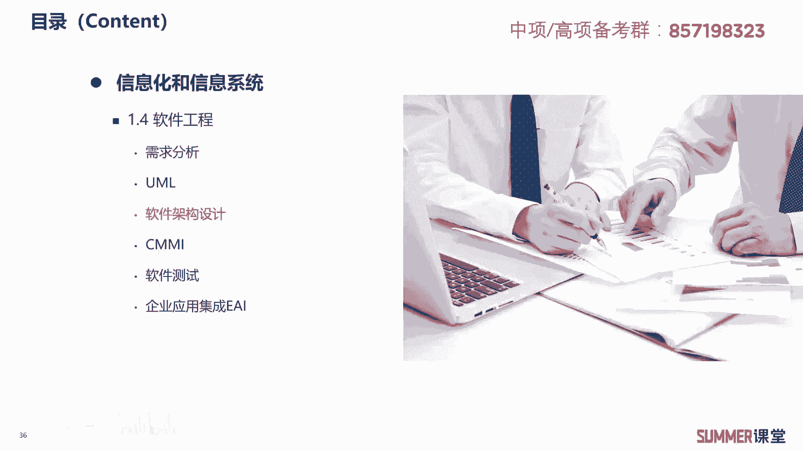
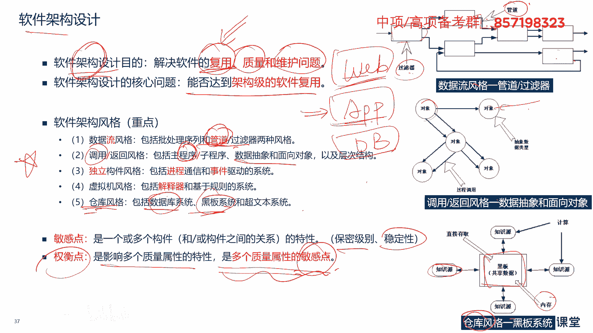
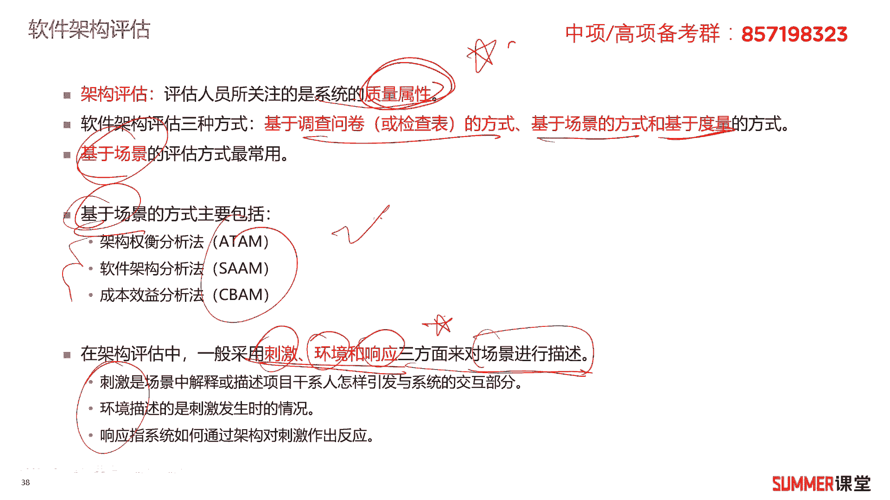
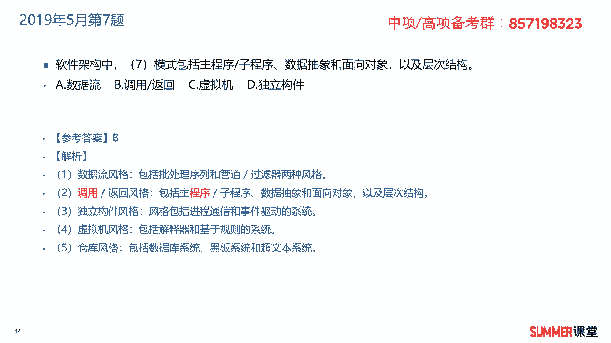
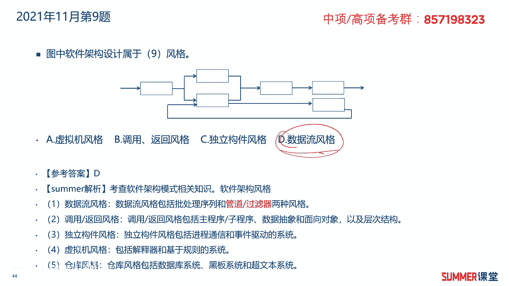

# 2023年软考信息系统项目管理师视频教程【总结到位，清晰易懂】-软考高项培训视频 - P10：1-2-3 软件架构设计 - summer课堂 - BV1wM4y1Z7ny

我们接着学习软件架构设计，进行架构设计的目的是为了解决三个问题，分别是复用质量和维护问题，这三个问题当中最核心的肯定是复用问题啊，软件架构设计，最最核心的问题就是能否达到架构级的软件服，用。

很多大公司里边都会有软件架构师是吧，他就是进行最顶层的架构设计，一个架构设计好了，它可以给很多软件去用的啊，比如说我这个公司一共就有十套软件，像这十套软件，底层的架构基本上都是保持一致的。

不会有太大变化啊，什么是架构呢，我给大家举个最简单的例子，讲一个大的一个架构，就我们现在很多大型的软件系统，基本上都是分三层的，第一层是网页，我们的用户或者管理员通过网页来访问后台，后台进来之后。

首先会有应用程序是吧，应用程序背后是数据库，就是web应用程序，数据库这么典型的三层架构啊，目前绝大部分大型的软件系统，都是采用这三种架构，ok啊这就是典型的嘛，很多软件都可以复用的是吧。

那当然我们落实到具体的应用程序里边，他可能还有各层架构，这就看不同公司的一个设计啊，这就是架构设计了是吧啊，刚刚我讲的也是一个架构设计，这是一个大的架构，落实到具体应用程序里面还会有小的架构，ok啊。

关于架构的设计啊，了解一下啊，下面软件架构的风格，这是重点，这是软件架构设计的核心，我们考试就主要考它，一共五句话，一共五句话，希望大家一定要多花时间啊，我们这里面一共就讲两页啊。

其中第一页的这块是核心中的核心，那其他的所有的你都可以不看啊，不懂，但是这玩意儿必须给我整懂，不是总统必须给我记住啊，你整不懂也没关系是吧啊，你你会做选择题就行了啊，我们来看一下哈啊这五种啊。

这五种风格以及他们的定义啊，第一种叫数据流风格，它包括批处理序列和管道过滤器两种风格啊，怎么记啊，第一种风格数据流流要要有管道，你的水才能流嘛，是吧啊，考试基本上就就就出关，出题出关键字。

你能看到关键字能选出来诶，有管道的就是数据流风格，ok第一种，第二种调用返回风格，它包括主程序子程序，然后数据抽象和面向对象以及层次结构，包含了这些东西，不太好记，告诉大家一个技巧。

你看到调用返回中间有斜杠的，一般后面就选这种有斜杠的，这是第一种记忆方法，第二种我建议大家记调用程序，调用程序及关键字嘛对吧，流管道，然后调用程序，第三种独立构建风格，它包括进程通信和事件驱动的系统啊。

独立进程，然后虚拟机风格包括解释器和基于规则的系统，虚拟机我们要去做解释啊，仓库风格包括数据库系统，黑板系统和超文本系统，仓库风格，仓库就是数据库嘛啊有可能有黑板。

因为我们通过黑板啊去显示各种各样的信息，显示各种各样信息的，是不是类似于仓库啊，它里面存储量比较大嘛，ok这五种风格关键词记忆，关键词记忆没有必要完全背下来，因为考试出选择题，然后针对这几种风格啊。

他有些图啊，我给大家简单看一下哈，数据流风格的图是长长这样啊，数据那个风格它包含两个东西，然后箭头线这是管道，然后方框这是过滤器啊，一看到这种图，它就是数据流风格，那调用返回风格呢。

它是各个对象之间有一个调用关系啊，有个调用关系看各个对象啊，然后他们调用关系，这叫调用返回风格，然后仓库风格里边的黑板系统啊，中间有一个黑板进行数据的共享啊，其他所有的知识源或者内存系统啊。

都在里边获取相应的信息，这是仓库风格，仓库风格三个图需要注意一下啊，三个图需要注意一下，接着还有两个知识点，权衡点和敏感点啊，敏感点是一个或者多个构件啊，或者构建之间关系的一些特性啊。

典型的比如说它的保密级别，它的稳定性要求，这是敏感点，敏感点只针对一个质量属性啊，只针对一个质量属性，而权衡点是影响多个质量属性的特性啊，是多个质量属性的敏感点，这两句话啊稍微读一下啊。

特别是权衡点是影响多个质量属性的一个特性，而敏感点是影响一个质量属性的特性，把这一点给get到就行了啊。

其他具体的细节不用管，不用深究了，ok接着是软件架构的评估，评估人员所关注的是系统的质量属性，需要记忆，软件评估方式有三种，分别是基于调查问卷的评估方式，基于场景的方式，基于度量的方式。

其中基于场景的评估方式是最常用的，然后基于场景的软件评估方式又包含三种，架构权衡法，软件架构分析法，成本效益法这三种了解一下啊，了解一下，在架构评估当中，一般采用刺激。

环境和响应三个方面来对场景进行描述，刺激是场景中解释或描述项目干系人，怎样引发与系统的交互部分，环境描述的是刺激发生时的情况，响应指系统如何通过架构对刺激做出反应，他们的解释稍微看一下。

把这三个标红的啊记一下，ok软件架构评估，这不是一个特别重要的知识点，我们把它作为了解就行了。

我们下面来看几道练习题，2018年5月第七题，老于是某银行的系统架构师，他为银行投资管理系统设计的软件架构，包括进程通信和事件驱动的系统，该软件架构风格属于什么独立通信是吧，让大家记得独立通信。

所以他是b独立架构风格，独立通信啊，调用程序这些。

希望大家在后期能够把它记下来，2019年5月的第七题，软件架构中什么模式，包括主程序子程序，然后数据抽象和面向对象以及层次结构，让大家掌握的方法，一看到有斜杠的，那就选有斜杠的嘛，对吧啊，另外调用程序。

调用程序关键字记忆，所以这道题选择b答案。

2021年11月的第九题，图中的软件架构设计属于什么风格，典型的数据流风格，而且我告诉过大家，中间的这个箭头代表的是管道，然后它是指过滤器啊，是指过滤器，所以这道题选择d答案，而且我们当时给大家讲了。

除了数据流风格的图以外，还讲了两组是吧啊。

